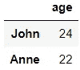

# 使用 Pandas 进行数据处理的全面指南

> 原文：[`towardsdatascience.com/a-comprehensive-guide-to-using-pandas-in-python-4bc32a14f2ec`](https://towardsdatascience.com/a-comprehensive-guide-to-using-pandas-in-python-4bc32a14f2ec)

## 了解如何使用 Python 中最著名的数据处理库之一

[](https://ivopbernardo.medium.com/?source=post_page-----4bc32a14f2ec--------------------------------)[](https://towardsdatascience.com/?source=post_page-----4bc32a14f2ec--------------------------------) [Ivo Bernardo](https://ivopbernardo.medium.com/?source=post_page-----4bc32a14f2ec--------------------------------)

·发布在 [Towards Data Science](https://towardsdatascience.com/?source=post_page-----4bc32a14f2ec--------------------------------) ·阅读时间 21 分钟·2023 年 7 月 18 日

--


照片由 [stonewyq](https://unsplash.com/pt-br/@stonewyq) @ Unsplash.com

当你开始在数据分析、工程或科学的上下文中使用 Python 时，`pandas`（可能）是你必须学习的第一个库之一。这个不可思议的库使你能够操作 Python 语言中的两个非常重要的对象——一维的`Series`和二维的`DataFrame`。这些对象是许多数据管道的一部分，掌握它们对开始你的 Python 职业生涯至关重要。

数据框在数据科学和分析中广泛使用，因为它们允许创建多维和多类型的对象。本文的目标是提供一个非常完整的指南，介绍如何使用一些著名的`pandas`函数以及如何操作库中最重要的功能。希望在阅读完本指南后，你能准备好使用最重要的`pandas`功能。你可能也很常从 SQL 背景迁移过来，所以我会尽量在一些说明中提供与 SQL 代码的比较，以便更容易比较两个框架之间的指令。但是，请记住，了解 SQL 并不是学习`pandas`的必要条件！

在本文中，我们将使用各种数据来深入了解`pandas`，即：

+   我们将通过对象创建命令构建自己的`pandas` Series 和 DataFrames。

+   我们将使用包含股票价格信息的三个数据集，这些数据集可以在这里找到（[`www.kaggle.com/datasets/rprkh15/sp500-stock-prices`](https://www.kaggle.com/datasets/rprkh15/sp500-stock-prices)）——具体来说，我们将使用*福特、苹果*和*Abbvie*的股票价格数据。

在本文中，我们将介绍`pandas`最著名的功能，即：

+   创建数据框

+   选择行

+   选择列

+   合并数据框

+   绘制数据

+   数据分组

+   链接函数

话不多说，让我们开始吧！

# 导入库

在我们开始之前，我们需要将 `pandas` 库导入到 Python 环境中，以确保我们可以使用文章中会看到的所有函数。

如果你是 Python 新手，这是语言中的一个标准。我们必须在代码中使用外部库之前导入它们，因为在安装 Python（在 Windows 上）或在基本版本（可在 Mac 或 Ubuntu 上获得）时，外部库在我们的环境中不可用。这种库的概念在开源语言中很常见，因为这是社区用来扩展语言基础功能的主要方式。

导入 pandas 很简单，我们只需在 Python Notebook 或可执行文件中运行以下代码：

```py
import pandas as pd
```

现在你一定会问自己……为什么 `pandas as pd`？主要是为了让我们使用库的函数时可以使用 *别名*。由于我们每次在代码中调用函数时都需要提到库的名称，使用像 `pd` 这样的较短 *别名* 会更方便。Pandas 用户通常使用这个标准，你可以在互联网上看到许多相关的代码。

# Pandas Series

不，Pandas 没有电视节目！

`pandas` Series 是一个一维对象，能够一次存储一种数据类型。例如，让我们使用 `pd.Series` 函数创建一个简单的 `pandas` Series，其中包含不同的整数：

```py
pd.Series([10,20,30,40,50])
```


`pd.Series` 命令的输出——作者图片

让我在这里暂停一下。`pd.Series` 意味着我们在调用从 `pd`（pandas 的别名！）库中加载的 `Series` 方法。这是 Python 语言中的标准语法：*library.method*

我们的 Series 包含 5 个整数：10、20、30、40、50。在命令的输出中，我们还看到了 `dtype: int 64`。默认情况下，pandas 存储整数时使用 64 位整数，这允许在定义数字时拥有更大的值范围。

除了整数，我们还可以通过在 `pd.Series` 中传递带小数点的数字来存储浮点数：

```py
pd.Series([10.1,20.2,30.4,40.6,50.2])
```


`pd.Series` 命令的浮点数输出——作者图片

注意我们的 `dtype` 现在是 `float64`。对这些值进行的任何计算将保持数值精度。稍后我们将看到这一点！

自然，我们也可以在 `pd.Series` 对象中存储字符串：

```py
pd.Series([‘Portugal’, ‘Spain’, ‘France’])
```


`pd.Series` 命令的字符串输出——作者图片

不要太困惑，不过在 `pandas` 中，字符串是以 *object* 数据类型存储的。实际上，大多数数据（除了基于时间的数据类型、分类数据或布尔值）如果既不是 `integers` 也不是 `floats`，都将以 `object` 数据类型存储——例如，定义一个包含嵌套列表的 `Series`：

```py
pd.Series([[1,2], [2,3], [1,2]])
```


pd.Series 命令输出的列表 — 作者提供的图片

如果你不熟悉 Python 中的列表，不必过于担心。这是一个相当不常见的操作，我只是做了这个实验来展示`object`数据类型并不限于文本数据。

一个警告 — 当你尝试在`pd.Series`中定义字符串和数字的混合时要小心，因为这会将整个对象转变为字符串（对象）：

```py
pd.Series([1,2,’ABC’])
```


混合数据类型的 pd.Series 命令输出 — 作者提供的图片

在 Python 中，我们可以使用赋值操作符`=`来保存我们的对象。让我们将这个最后的系列保存到名为`series_1`的对象中，以便我们可以方便地在其上调用`pandas`方法：

```py
series_1 = pd.Series([1,2,’ABC’])
```

我们可以访问`pd.Series`对象的一个属性是`dtype`属性。访问`dtype`会输出我们 Series 中存储的数据类型：

```py
series_1.dtype
```


数据类型对象 — 作者提供的图片

这将打印出我们的系列包含的对象类型 — 在`series_1`示例中，它存储的数据类型是`'O'`，表示对象。

在`pandas`指南的第一部分中，我们已经看到了`pd.Series`，这种对象类型可以简要描述为：

- 系列是*一维*对象，每次只能存储一个维度。

- 它们一次只能容纳一种数据类型。

但是……我们的指南中还有很多内容要涵盖！例如，如果我们想从`pd.Series`中检索特定元素怎么办？我们可以在 pandas 中做到吗？

是的，我们可以！为了做到这一点，我们需要依赖于*索引*的概念，这将在接下来看到！

# 索引系列

`pandas`的一个巧妙技巧是我们可以将索引附加到我们的数据上，并使用值来从对象中检索元素。

例如，让我创建一个包含一些*国家*和*首都*的`pandas`系列：

```py
countries_series = pd.Series(data=[‘Lisbon’,’Madrid’,’Paris’], index = [‘Portugal’,’Spain’,’France’])
```

注意我们在`series`中有了新东西 — 索引参数！这个参数解锁了为我们的值提供自定义索引的能力。


countries_series 对象 — 作者提供的图片

左侧是索引的值。右侧是存储在`pandas Series`中的值 — 每个城市的首都的文本值。

现在，假设我们想从`countries_series`中检索`Portugal`的首都 —— 在使用命名索引之前，一种方法是提供**数字索引，如下所示：**

```py
countries_series[0]
```


数字索引示例输出 — 作者提供的图片

即使我们没有为`series`提供任何自定义索引，数字**索引始终有效！**

但当然，这并不是很实际。如果我们的表格中有 200 个国家怎么办？我们如何在不记住 200 个索引的情况下检索数据？

幸运的是，我们还可以使用命名索引来通过在方括号中提供自定义索引来检索数据：

```py
countries_series[‘Portugal’]
```


命名索引示例的输出——作者提供的图片

这是一种更有意义的从我们的`pandas`系列中提取数据的方法。通过使用索引，我们可以从对象中提取特定的数据点。我们常用的另一种`pandas`技术是使用列表同时提取多个元素：

```py
countries_series[[0,1]]
```


多重数值索引示例的输出——作者提供的图片

在上面的示例中，我们从`countries_series`中提取了两个数据点——位置 1 和 2 的元素。记住，Python 索引是从 0 开始的。

使用命名索引，我们还可以通过在索引中传递列表来传递多个元素：

```py
countries_series[[‘Portugal’,’Spain’]]
```


多重数值索引示例的输出——作者提供的图片

了解系列对象是理解 pandas 中核心对象——数据框（dataframe）的关键步骤！我们已经看到系列对象只能存储一维数据，每次存储一种类型的数据。这是一个重大障碍，会影响我们在数据管道中的生产力，因此我们需要研究一个更复杂的对象！接下来我们来看看这个对象。

# 创建数据框

到目前为止，我们只处理了一维和单一类型的对象。当然，这不太实用，特别是当我们想处理更复杂的数据时。

创建数据框相对简单——我们可以使用`pd.DataFrame`函数创建一个：

```py
df_example = pd.DataFrame([24, 23, 22])
```

我的`df_example`包含一列和三行整数：


数据框对象示例——作者提供的图片

数据框的一个好处是它们支持二维对象（行和列）。让我们在数据中添加另一列，这是`Series`不支持的：

```py
df_example = pd.DataFrame([['John','Joe','Anne'],
                          [24, 23, 22]])
```

我们的`df_example`现在看起来如下：


两行数据框——作者提供的图片

哦哦！我们的`pd.DataFrame`命令逐行添加数据。注意我们传递了一个包含数据的列表：`[['John','Joe','Anne'], [24,23,22]]`。

我们有两种方法来纠正这种行为，要么转置我们的`DataFrame`，要么更改我们将提供给`pd.DataFrame`的数据结构——我们先从转置`dataframe`开始：

```py
df_example = pd.DataFrame([['John','Joe','Anne'],
                          [24, 23, 22]]).T
```

这个操作会产生以下结果：


两列数据框——作者提供的图片

调用数据框的`.T`属性会转置对象，将行和列互换。以这种格式将数据传递到`pd.DataFrame`的更有意义的方法是使用 Python 字典的力量：

```py
df_example = pd.DataFrame({'students_name':['John','Joe','Anne'],
                          'age':[24, 23, 22]})
```

下面是这个数据框所创建内容的解释：

+   `students_name`将包含三个名字：`John`、`Joe`和`Anne`。

+   `age`将包含三个年龄：24、23 和 22。


带有列名的数据框——作者提供的图片

对于这个对象，我们立即给列命名：`students_name`和`age`。列名将采用我们传递的字典的键的值。

我们知道，在这个表格中，每个学生只有一行——将学生姓名作为我们的索引会很有趣，这样我们可以利用`pandas`对象中的索引属性。我们可以通过将学生姓名声明为索引来实现这一点：

```py
df_example = pd.DataFrame({'age':[24, 23, 22]},
                         index=['John','Joe','Anne'])
```

我们的`df_example`有了新的外观：


带有索引的数据框 — 图片由作者提供

请注意，`student_name`不再是一个列，而是作为对象的索引。这意味着我们现在可以使用之前学到的所有索引属性——你能猜到`df_example['John']`会返回什么吗？


从 df_example 中索引`John` — 图片由作者提供

出错了！为什么？因为数据框是多维对象，我们不能像对`pd.Series`那样直接对它们进行索引，但我们可以依赖`loc`方法：

```py
df_example.loc[‘John’]
```


从 df_example 中索引`John` — 图片由作者提供

我们还可以通过将列表传递给`loc`来从我们的`DataFrame`中检索多个值：

```py
df_example.loc[['John','Anne']]
```



从 df_example 中索引`John`和`Anne` — 图片由作者提供

在实际示例中，我们将看到如何将选择和索引值扩展到列中。

最后，让我们看看如何通过数字索引来索引我们的`pandas`数据框。为此，我们需要依赖`iloc`：

```py
df_example.iloc[0]
```


从 df_example 中索引`John` — 图片由作者提供

这个命令将索引数据框的第一行，其作用类似于命名版本的索引`df_example.loc['John']`。

我们已经了解了`Series`和`DataFrame`——现在让我们深入了解一个更实际的示例，使用股票价格数据。这将帮助你更好地理解 pandas 及其用法。

# 读取 CSV 文件到数据框中

正如我在博客文章的介绍中详细说明的，我们将使用一个 Kaggle 数据集的子集，[点击这里](https://www.kaggle.com/datasets/rprkh15/sp500-stock-prices)。

首先，让我们将两个*CSV*文件读入数据框对象。这可以通过访问`pd.read_csv`函数来实现：

```py
apple = pd.read_csv('AAPL.csv')
ford = pd.read_csv('F.csv')
```

我们创建了两个不同的数据框，分别叫做`apple`和`ford`，它们将保存两个公司的不同信息。

接下来，让我们进行一个小的管道操作，探索我们新创建的对象的内容和结构！

# 探索我们新获得的数据框

在本章中，我们将研究`apple`数据框。大多数人一拿到数据框对象，就会首先调用`.head()`和`.tail()`方法。我们来看一下下面这两个方法的输出：

```py
apple.head(10)
```


apple 数据框前 10 行 — 图片由作者提供

`head` 命令提取 DataFrame 的前 *n* 行，并在输出中显示。*n* 是我们在 DataFrame 方法中传递的整数。

`tail` 方法将返回 DataFrame 的最后 *n* 个元素：

```py
apple.tail(10)
```


apple DataFrame 最底部 10 行 — 作者图片

这两个命令类似于在 SQL 中对表进行排序和调用 `LIMIT`。例如，查询 ``SELECT * FROM `APPLE` LIMIT 10`` 会达到相同的结果（假设行按日期排序）。

当我们有一个 DataFrame 时，使用一些整洁的 `pandas` 属性来了解其结构非常常见。以下是一些详细介绍：

+   `.shape` 方法给我们提供行和列的数量，格式为 *(行数, 列数)*。例如，`apple.shape` 会告诉我们 DataFrame 包含 10,483 行和 8 列：


apple DataFrame 形状

+   `.columns` 会给我们列名的列表：


apple DataFrame 列名

+   `.index` 将给我们索引的名称（行名）：


apple DataFrame 行名

我们没有为 DataFrame 提供索引（它仍然使用 `read.csv` 函数创建的自动数字索引）。我们稍后会学习如何分配有意义的命名索引。

+   `.describe()` 为我们提供所有数值列的一个很好的概述：


pandas Describe 命令 — 作者图片

`describe` 方法输出关于我们数值列的重要统计数据，例如平均值、标准差、最小值、分位数数据和分布的最大值。

如果你想查看某一列的值，你可以直接选择该列——在 pandas 中有两种主要方式来做到这一点：

+   使用索引，我们将列名放在方括号内（类似于如何在 pd.Series 中选择行）：

```py
apple[‘Volume’]
```


apple Volume 列 — 作者图片

我们还可以使用点表示法：

```py
apple.Volume
```


apple Volume 列 — 作者图片

Python 程序员倾向于使用索引方法，主要有两个原因：在点表示法中传递列名比较困难，且点表示法不支持名称中有空格的列。

哦，如果你想快速从特定的 `pandas` 列中检索平均值或标准差，只需在对象上调用该方法！例如，计算 `mean` Volume：

```py
apple.Volume.mean()
```


apple Volume 平均值 — 作者图片

现在我们有一个复杂的 pandas DataFrame，包含多个列和行，让我们学习如何通过 `iloc` 和 `loc` 扩展我们的知识来子集信息。

# 子集信息

在这一部分中，我们不仅解释了 Pandas 索引方法的每一个细节，还通过代码回答了有关数据的问题！这样，你将能够练习自然语言与库中可以使用的索引方法之间的转换。

让我们开始尝试选择能够回答一些问题的行：

+   *我们能选择苹果公司收盘股票价格高于 20 美元的天数吗？*

我们可以通过提供`apple.loc[apple[‘Close'] > 20]`来回答这个问题。这段代码将输出所有满足该条件的天数：


苹果数据子集 — 收盘股票价格高于 20 美元的天数 — 图片由作者提供

这是一个真正的特性，我们可以通过使用`.loc`来实现。请注意，在 loc 中我们现在传递了条件`apple[‘Close'] > 20`，输出将尊重该条件。

但是……如果我想要一个值的范围子集，例如：*我们能选择苹果公司收盘股票价格在 20 美元到 30 美元之间的天数吗？*

我们可以通过在`.loc`中将条件用括号括起来来实现这一点：

`apple.loc[(apple[‘Close'] > 20) & (apple[‘Close'] < 30)]`

和符号`(&)`将我们的条件与 AND 条件连接起来，而管道符号`(|)`用于 OR 条件。


苹果数据子集 — 收盘股票价格在 20 美元以上且低于 30 美元的天数 — 图片由作者提供

让我将上面的条件翻译成类似 SQL 的代码：

+   在`apple.loc[apple[‘Close'] > 20]`中，我们正在做类似于这个查询的操作：`SELECT * FROM 'apple' WHERE Close > 20`。

+   在`apple.loc[(apple[‘Close'] > 20) & (apple[‘Close'] < 30)]`中，我们正在做类似于这个查询的操作：`SELECT * FROM 'apple' WHERE Close > 20 AND Close < 30`。

我们还可以使用一个魔法技巧从我们的多维对象中提取特定的列。只需在`.loc`中添加一个逗号，我们就可以对子集列（被认为是对象的第二维）：

```py
apple.loc[apple['Close'] > 20, 'Volume']
```


苹果数据子集 — 股票价格高于 20 美元的天数 — 图片由作者提供

上述操作是在回答问题：*苹果公司收盘股票价格高于 20 美元的天数的成交量是多少？*

将其翻译成 SQL：`SELECT Volume FROM 'apple' WHERE Close > 20`。

不过，如果我们想要多个列呢？你能猜到如何修改上面的`pandas`代码吗？

答案：列表索引！

```py
apple.loc[apple['Close'] > 20, ['Volume','Close']]
```


苹果数据子集 — 股票价格高于 20 美元的天数的成交量和收盘价 — 图片由作者提供

另一个常见的数据整理操作是分组数据。我们将在下一部分中看看如何做到这一点！

# 分组信息

现在，我的数据过于详细——我想提取`apple`和`ford`股票价格的年度平均值。为此，我们需要做两件事：

+   创建一个新列，其中包含从`Date`列提取的年份。

+   提取按年份列分组的 `Close` 价格的均值。

我们有一个问题在于 `Date` 列 — 为什么？因为现在，它被视为一个 `Object` 列，如通过调用 `.dtypes` 属性所见：

```py
apple.dtype
```


apple 数据框数据类型 — 作者提供的图像

虽然我们可以执行子字符串操作来提取年份，但使用日期时间属性从这个日期中提取信息会更好。让我介绍一下 `pandas` 中的另一种数据类型 —— `datetime`！

要将对象转换为 `datetime`，我们可以调用 `to_datetime` 函数：

```py
pd.to_datetime(apple[‘Date’])
```

在 `to_datetime` 函数的参数中，我们可以传入我们希望转换为日期的列。请注意，我们可以转换这个列，因为它具有 `pandas` 日期所期望的格式（有关格式的更多信息，请参见[官方文档](https://pandas.pydata.org/docs/reference/api/pandas.to_datetime.html)）。

现在，返回的对象 `dtype` 已经改变：


日期时间转换 — 作者提供的图像

有了这个 `datetime` 对象，我们可以访问 `dt` 属性，并方便地使用 `.dt.year` 提取年份。让我们在下面尝试一下：

```py
pd.to_datetime(apple[‘Date’]).dt.year
```


年份列 — 作者提供的图像

但是，我们如何将这个列添加到现有的数据框中呢？这非常简单——我们只需将其分配给一个尚不存在的东西（还没有！）：

```py
apple[‘Year’] = pd.to_datetime(apple[‘Date’]).dt.year
```

这将会在我们的 apple 数据框中创建一个名为 `Year` 的新列，包含从 `Date` 列提取的年份。


创建年份列 — 作者提供的图像

我们的过程的第一部分已经完成！现在，让我们进入第二部分，我们将按 `Year` 计算 `Close` 价格的平均值——听起来很困难，对吧？

但其实不是！正如你可能猜到的那样，一旦掌握了库的工作原理，`pandas` 中的事情其实非常简单。首先，我们需要调用 `groupby` 方法，这样我们就可以……嗯……按列分组！

```py
apple.groupby([‘Year’])
```

`groupby` 方法不输出任何内容（除了通用的方法输出），它只是准备 `pandas` 接受将在参数列中进行分组的内容。生成 `groupby` 对象后，我们可以传入我们希望聚合的列和度量：

```py
apple.groupby([‘Year’])[‘Close’].mean()
```


生成的分组对象的前几行 — 作者提供的图像

我们还可以使用其他函数进行其他计算——例如，按组提取最大值：

```py
apple.groupby([‘Year’])[‘Close’].max()
```


生成的分组对象的前几行 — 作者提供的图像

这个最后的指令可以转化为以下 SQL 查询：`SELECT Year, max(Close) as max_close from apple group by Year`。

我们还可以同时对多个列进行聚合，例如：


从 Close 和 Volume 列中提取最大值 — 作者提供的图像

在我们进入合并表格的部分之前，让我们创建两个汇总表，其中包含每家公司在 2000 年之后支付的每股股息信息：

```py
ford[‘Year’] = pd.to_datetime(ford[‘Date’]).dt.year
```

```py
apple_dividends = apple.loc[apple.Year >= 2000].groupby(['Year'])['Dividends'].sum()
ford_dividends = ford.loc[ford.Year >= 2000].groupby(['Year'])['Dividends'].sum()
```

好的，让我们慢一点处理最后这条指令，因为我们要在这里综合运用我们在整个博客文章中学到的几个知识点：

+   首先，我们在 2000 年之后过滤每一行数据：`apple.loc[apple.Year >= 2000]`

+   这将返回一个 DataFrame，我们可以在之后使用 `groupby` 和 `sum`，例如 `groupby(['Year'])['Dividends'].sum()`。

让我们可视化一下我们的 `apple_dividends` DataFrame（?）：


pandas 按 Series 分组— 作者提供的图片

当我们执行返回单列的 group by 操作时，我们会输出一个 `pd.Series`，而不是 DataFrame。我们可以通过将其包装在 `pd.DataFrame` 函数中显式地将对象转换为 `DataFrame`：

```py
apple_dividends = pd.DataFrame(apple_dividends)
ford_dividends = pd.DataFrame(ford_dividends)
```

现在，以 DataFrame 格式查看 `apple_dividends` 对象：


pandas 按对象分组 — 作者提供的图片

将这些 DataFrames 合并成一个对象会很有趣。这是我们将在下一部分处理的内容！

# 合并对象

在这一部分，我将向你展示如何以多种方式合并 DataFrames：

+   垂直地，通过堆叠或附加它们。

+   水平地，通过使用连接。

首先，让我们学习如何垂直堆叠表格（类似于 `UNION` 操作符）——我们可以通过提供 `pd.concat` 来实现：

```py
pd.concat([apple_dividends,ford_dividends])
```

这将创建一个包含两家公司股息数据的 DataFrame。在当前格式下，很难理解每一行对应的公司。另一种方法是在原始 DataFrames 中创建一个新列，注明公司名称：

```py
apple_dividends['company'] = 'apple'
ford_dividends['company'] = 'ford'

pd.concat([apple_dividends,ford_dividends])

combined_dividends = pd.concat([apple_dividends,ford_dividends])
```


合并后的苹果和福特股息数据的样本 — 作者提供的图片

索引会重复，这可能会有些奇怪，尽管在索引同一年份的数据时可能会很方便：

```py
combined_dividends.loc[2015]
```


2015 年数据的子集 — 作者提供的图片

我们也可以选择将这些数据以两个时间序列并排的方式呈现。为此，我们需要稍微修改原始数据，并将过程考虑为表连接。如果我们想保持 `year` 作为索引，我们可以使用 `merge` 函数来合并数据：

```py
apple_dividends.merge(ford_dividends, left_index=True, right_index=True)
```


已连接的股息数据 — 作者提供的图片

上面的示例类似于执行查询：

```py
SELECT a.Dividends as Dividends_x, a.company as company_x, b.Dividends as dividends_y, b.company as company_y
from apple_dividends as a
inner join ford_dividends as b
on a.Year = b.Year
```

由于 `pandas` 在合并过程中不支持两个同名的列，Python 会自动添加 _x 或 _y 后缀，以区分列的来源。

另外，我们也可以使用方便的 `on` 参数，它支持按任何列进行连接。为了将我们的 `Year` 作为列，我们可以重置两个表的索引：

```py
apple_dividends.reset_index(inplace=True)
ford_dividends.reset_index(inplace=True)
```

注意这个查询中的`inplace=True`。这是 Python 中一个非常重要的属性！某些操作可以就地进行，这意味着对象会动态改变，无需重新赋值。在上面的例子中，我们只是重置了两个表的索引，将年份转换为一列：


索引重置示例 — 作者图片

现在，我们可以明确地在合并函数中使用 `Year`。

```py
joined_dividends = apple_dividends.merge(ford_dividends, on='Year')
```


按列连接的股息数据 — 作者图片

如果你想根据 DataFrame 中不属于索引的特定列组合数据，这可能会很有用。

既然我们的«表格已保存，让我们通过查看一些简单的`pandas`绘图功能来结束这篇博客文章吧！

# 绘图功能

`pandas` 与 Python `matplotlib` 的集成非常棒。绘制数据的一个酷炫的方法是直接调用 `.plot()` 方法：

```py
joined_dividends.Dividends_x.plot()
```


苹果的股息图 — 作者图片

如果我在两个 pandas 系列上调用图表，它们会同时显示在同一图表中，使我们能够比较两家公司的股息：

```py
joined_dividends.Dividends_x.plot()
joined_dividends.Dividends_y.plot()
```


福特和苹果的股息图 — 作者图片

这个图仍然有点不完整 — 我们没有标题、轴标签、x 轴标签或指示每条线对应哪家公司。我们可以使用`.plot()`函数来改进它吗？

当然！我们可以在整个 DataFrame 上调用 `.plot` 方法，并基于此控制 `x` 和 `y` 轴：

```py
import matplotlib.pyplot as plt

joined_dividends.plot(x='Year', 
 y=['Dividends_x','Dividends_y'], 
 xlabel='Year', 
 ylabel='Dividends Value',
 title='Annual Dividends by Company')

plt.legend(['Apple','Ford'])
```

我们不能在 `.plot()` 方法上更改一些属性。例如，添加自定义图例必须使用 `matplotlib` 库，通过在创建图表后调用 `plt.legend()` 来完成。


福特和苹果的股息条形图 — 作者图片

我们还可以通过使用 `kind` 参数来更改图表类型 — 例如，我们可以查看一个条形图中的股息：

```py
joined_dividends.plot(x='Year', 
                      y=['Dividends_x','Dividends_y'], 
                      xlabel='Year', 
                      ylabel='Dividends Value',
                      title='Annual Dividends by Company',
                     kind='bar')

plt.legend(['Apple','Ford'])
```


福特和苹果的股息条形图 — 作者图片

尽管有限，`pandas` 的绘图功能为库的特性增添了额外的风味，而且非常方便，特别是在进行快速数据探索分析时。使用 `pandas` 绘图 API 的缺点是有许多 `matplotlib` 的功能不可用，因此我们通常会导入这两个库，特别是当我们想创建更复杂的图表时。

就这些了！感谢你抽出时间阅读这篇文章，希望你喜欢学习 pandas。

对于每一个想要在 Python 中使用 DataFrame 的专业人士或学生来说，这个库是必备的。了解这个对象对于使用其他框架（如 spark）或语言（如 R）也非常重要。使用`pandas`已经成为数据科学家、工程师和分析师的关键技能。我相信`pandas`将在未来十年继续被使用，因为它已经深深嵌入到许多数据科学流程中。

不足之处是，`pandas`存在一些局限性，具体如下：

+   内存使用：对于大型且多样化的 DataFrame，`pandas`的性能可能较差。像`PySpark`这样的其他框架可能更适合这些操作。

+   可变性：对于从未使用过 Python 的人来说，可变性属性一开始可能会让人困惑。处理不当是使用该库时最常见的错误之一。

+   无法处理非结构化数据。虽然`pandas`可能支持将列表或字典作为列，但将非结构化数据存储其中是一个大问题，且易出错。

总结一下，让我们详细说明一下在博客中涉及的一些主题：

+   处理一维的`pandas`对象`Series`，该对象的工作方式类似于 R 的向量。

+   创建、索引以及对主要的`pandas`对象`DataFrame`进行各种操作。

+   读取外部对象，如 CSV 文件到`DataFrame`对象中。

+   合并不同的`DataFrame`，包括垂直（追加）和水平（连接数据）。

+   使用`matplotlib` API 在`pandas`中绘制数据。

阅读完这篇文章后，我建议你阅读一下`pandas`的官方文档，并尝试一些我们在博客中没有涉及的函数，比如[窗口操作](https://pandas.pydata.org/docs/user_guide/window.html)或[DataFrame 重塑](https://pandas.pydata.org/docs/user_guide/reshaping.html)。

此外，如果你正在走向数据科学家的道路，你可能会发现学习[NumPy](https://numpy.org/)、[Matplotlib](https://matplotlib.org/)、[scikit-learn](https://scikit-learn.org/stable/)或[PySpark](https://spark.apache.org/docs/latest/api/python/)是很有意义的。

你认为我在这个综合指南中遗漏了什么吗？请在下面的评论中告诉我，以便我添加！

*如果你有兴趣参加我的 Python 课程，请随时加入* ***我的免费课程*** *（*[*Python For Busy People — Python Introduction in 2 Hours*](https://www.udemy.com/course/python-for-busy-people-python-introduction-2-hours/?referralCode=1588B6BF72D40253CDD4)*)* ***或者一个更长的 16 小时版本*** *（*[*The Complete Python Bootcamp for Beginners*](https://www.udemy.com/course/the-python-for-absolute-beginners-bootcamp/?couponCode=MEDIUMJULY)*)，如果不适合你，可以享受 30 天退款政策。我的 Python 课程适合初学者/中级开发者，欢迎你来我的课程！*


[绝对初学者的 Python 课程](https://www.udemy.com/course/the-python-for-absolute-beginners-bootcamp/?couponCode=MEDIUMJULY) — 作者提供的图片

*这篇文章中使用的数据集采用了* [*知识共享署名 CC0 公共领域授权。*](https://creativecommons.org/licenses/by/4.0/legalcode)
