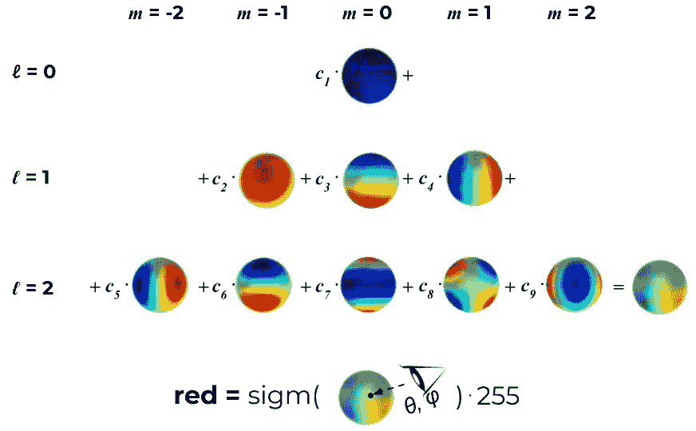

# 高斯溅射的全面概述

> 原文：[`towardsdatascience.com/a-comprehensive-overview-of-gaussian-splatting-e7d570081362?source=collection_archive---------0-----------------------#2023-12-23`](https://towardsdatascience.com/a-comprehensive-overview-of-gaussian-splatting-e7d570081362?source=collection_archive---------0-----------------------#2023-12-23)

## 你需要了解的关于 3D 表示领域的新趋势

 [Kate Yurkova](https://yurkovak.medium.com/?source=post_page-----e7d570081362--------------------------------)

·

[关注](https://medium.com/m/signin?actionUrl=https%3A%2F%2Fmedium.com%2F_%2Fsubscribe%2Fuser%2F16ecfab4b128&operation=register&redirect=https%3A%2F%2Ftowardsdatascience.com%2Fa-comprehensive-overview-of-gaussian-splatting-e7d570081362&user=Kate+Yurkova&userId=16ecfab4b128&source=post_page-16ecfab4b128----e7d570081362---------------------post_header-----------) 发布于 [Towards Data Science](https://towardsdatascience.com/?source=post_page-----e7d570081362--------------------------------) ·12 分钟阅读·2023 年 12 月 23 日

--

高斯溅射是一种用于表示 3D 场景和渲染新视角的方法，首次在“3D Gaussian Splatting for Real-Time Radiance Field Rendering”¹中介绍。**它可以被视为 NeRF²模型的替代方案**，而且就像以前的 NeRF 一样，高斯溅射引发了[大量新研究工作](https://github.com/MrNeRF/awesome-3D-gaussian-splatting)，这些研究选择使用它作为各种应用中的 3D 世界的基础表示。那么它有什么特别之处，为什么它比 NeRF 更好？或者它真的更好吗？让我们来探究一下！

# 目录：

+   简而言之

+   3D 世界的表示

+   图像形成模型与渲染

+   优化

+   视图依赖颜色与 SH

+   限制

+   在哪里玩

# TL;DR

首先，这项工作的主要亮点是**高渲染速度**，如标题所示。这归功于表示本身（将在下文中介绍）以及定制的 CUDA 内核渲染算法的实现。

**图 1：** 以渲染速度（fps）、训练时间（min）和视觉质量（峰值信噪比，越高越好）对比之前的高质量表现和高斯溅射（标记为“我们的”）[来源：取自[1]]

此外，高斯溅射**完全不涉及任何神经网络**。甚至没有一个小的 MLP，完全没有“神经”成分，场景本质上只是空间中的一组点。这本身已经非常吸引注意力。在我们对 AI 痴迷的世界中，看到这样的方法逐渐流行，与那些追逐包含更多数十亿参数的模型的研究公司相比，颇具清新感。它的理念来源于“表面溅射”³（2001），因此它为经典计算机视觉方法仍然可以激发相关解决方案树立了一个很好的例子。其简单而明确的表示使得高斯溅射特别**可解释**，这是在一些应用中选择它而不是 NeRFs 的一个非常好的理由。

# 代表一个 3D 世界

如前所述，在高斯溅射中，一个 3D 世界是由一组 3D 点表示的，实际上是数百万个，数量在 0.5-5 百万的范围内。每个点是一个 3D 高斯，其**唯一的参数针对每个场景进行拟合**，使得该场景的渲染与已知数据集图像非常匹配。优化和渲染过程将在后面讨论，因此现在我们暂时关注必要的参数。

**图 2：** 高斯中心（均值）[来源：取自动态 3D 高斯⁴]

**每个 3D 高斯由以下参数化：**

+   均值**μ**可以解释为位置 x, y, z；

+   协方差**Σ**；

+   不透明度**σ(𝛼)**，应用了一个 sigmoid 函数来将参数映射到[0, 1]区间；

+   **颜色参数**，可以是（R, G, B）的 3 个值或球面谐波（SH）系数。

这里有两组参数需要进一步讨论，一组是协方差矩阵，另一组是 SH。后者有一个专门的章节进行讨论。至于协方差，它被设计为各向异性的，即不是[各向同性](https://stats.stackexchange.com/questions/204595/what-is-an-isotropic-spherical-covariance-matrix)。实际上，这意味着**一个 3D 点可以是一个在空间中沿任意方向旋转和拉伸的椭球体**。它本来需要 9 个参数，但由于协方差矩阵只有在它是[半正定矩阵](https://en.wikipedia.org/wiki/Definite_matrix)时才有物理意义，因此这些参数不能直接优化。使用梯度下降进行优化使得直接对矩阵施加这样的约束变得困难，因此它被分解如下：

这种分解被称为[协方差矩阵的特征分解](https://www.visiondummy.com/2014/04/geometric-interpretation-covariance-matrix/#Covariance_matrix_as_a_linear_transformation)，可以理解为椭球体的配置，其中：

+   S 是一个具有 3 个缩放参数的对角缩放矩阵；

+   R 是一个用 4 个四元数解析表示的 3x3 旋转矩阵。

使用高斯分布的美在于每个点的双重影响。一方面，每个点根据其协方差有效地**表示了空间中接近其均值的有限区域**。另一方面，它具有**理论上的无限范围**，这意味着每个高斯分布在整个 3D 空间中定义，并且可以在任何点上进行评估。这一点很重要，因为在优化过程中，它允许梯度从较远的距离传播。⁴

3D 高斯分布的 *i* 对任意 3D 点 *p* 的影响定义如下：

**图 3：** 3D 高斯分布 *i* 对 3D 点 *p* 的影响 [来源：作者提供的图像]

这个方程看起来几乎像是[多变量正态分布](https://en.wikipedia.org/wiki/Multivariate_normal_distribution)的概率密度函数，除了归一化项的协方差行列式被忽略，取而代之的是通过不透明度加权。

# **图像形成模型与渲染**

## 图像形成模型

给定一组 3D 点，可能最有趣的部分是查看它如何用于渲染。你可能之前熟悉 NeRF 中使用的点对点𝛼混合。结果是**NeRF 和高斯点投射共享相同的图像形成模型**。为了了解这一点，让我们稍作绕道，重新访问 NeRF²及其许多后续工作的体积渲染公式(1)。我们还将使用简单的转换(2)对其进行重写：

你可以参考 NeRF 论文了解σ和δ的定义，但从概念上讲，可以这样理解：在 NeRF 中，图像像素*p*中的颜色是通过沿着通过该像素的射线对样本（MLP 预测）进行积分来近似的。最终的颜色是**沿着射线采样的三维点颜色的加权和，经过透射率的衰减**。有了这个认识，我们最后来看一下高斯 splatting 的图像形成模型：

确实，公式（2）和（3）几乎相同。**唯一的区别在于如何计算𝛼**。在高斯 splatting 中，对每个像素的聚合是基于一个有序的二维高斯投影列表的贡献。这个小小的差异在实践中却极其重要，并导致显著不同的渲染速度。实际上，它是高斯 splatting 实时性能的**基础**。

要理解为什么会这样，我们需要了解*`f^{2D}`*的含义以及它所带来的计算需求。这个函数只是将我们在上一节看到的*f(p)*投影到二维，即投影到正在渲染的相机的图像平面上。**三维点及其投影都是多变量高斯分布**，因此可以使用与计算三维高斯对其他三维点的影响相同的公式来计算投影的二维高斯对像素的影响（见图 3）。唯一的区别是均值μ和协方差Σ必须投影到二维，这通过 EWA splatting⁵的推导来完成。

可以通过将向量*μ*（在齐次坐标中，带有额外的 1 坐标）投影到图像平面上，使用内在相机矩阵*K*和外在相机矩阵*W=*[*R*|*t*]来轻松获得二维均值。

这也可以用一行来写：

这里“z”下标表示 z 标准化。二维中的协方差使用（4）的雅可比矩阵*J:*来定义。

整个过程仍然可以进行微分，这对优化至关重要。

## 渲染

公式（3）告诉我们如何在单个像素中获得颜色。要渲染整个图像，**仍然需要遍历所有 HxW 像素**，就像在 NeRF 中一样，但由于以下原因，过程要轻便得多：

+   对于给定的相机，**每个三维点的*f(p)*可以提前投影到二维**，然后再遍历像素。这样，当对几个相邻的像素进行高斯融合时，我们就不需要一遍遍地重新投影它。

+   **不需要对单张图像推断 H·W·P 次的 MLP**，二维高斯直接融合到图像上。

+   **沿射线评估哪个 3D 点没有歧义**，无需选择[射线采样策略](https://docs.nerf.studio/nerfology/model_components/visualize_samplers.html)。每个像素射线的 3D 点集（参见(3)中的*N*）是离散且在优化后固定的。

+   预处理的**排序阶段在每一帧中进行一次，使用 GPU**，通过自定义的可微分 CUDA 内核实现。

概念上的差异可以在**图 4**中看到：

**图 4：** NeRF 和 GS 之间的概念差异，左：沿射线查询**连续**的 MLP，右：混合与给定射线相关的离散高斯集合 [来源：作者提供的图像]

上述排序算法是论文的一个贡献。其目的是为了配合公式(3)进行颜色渲染：按深度（靠近图像平面的距离）对 3D 点进行排序，并按图块进行分组。前者用于计算透射率，后者则限制每个像素的加权和只对相关的 3D 点进行α混合（或其 2D 投影，更具体地说）。分组是通过简单的 16x16 像素图块实现的，并且实现方式使得一个高斯可以落在多个图块中，如果它重叠了多个视锥体。得益于**排序，每个像素的渲染可以简化为从像素所属的图块中预排序点的α混合。**

**图 5：** 视锥体，每个视锥体对应一个 16x16 的图像块。颜色没有特殊含义。排序算法的结果是在每个图块内按深度排序的 3D 点的子集。[来源：基于[这里](https://docs.nerf.studio/nerfology/model_components/visualize_samples.html#d-frustum)的图]

# **优化**

可能会产生一个幼稚的问题：如何从空间中的一堆模糊物体中得到一个看起来不错的图像？的确，如果高斯没有被妥善优化，渲染结果中会出现各种尖锐的伪影。在图 6 中，你可以观察到这种伪影的一个示例，它们看起来确实像椭球体。获得良好渲染的关键在于 3 个组成部分：**良好的初始化、可微分优化和自适应稠密化**。

**图 6：** 一个未优化场景的渲染示例 [来源：作者提供的图像]

初始化指的是在训练开始时设定的 3D 点参数。对于点位置（均值），作者建议使用 SfM（结构光束法）生成的点云，见图 7。逻辑是，对于任何 3D 重建，无论是 GS、NeRF 还是更经典的方法，你都必须知道相机矩阵，因此你可能还是会运行 SfM 来获取这些矩阵。**由于 SfM 生成稀疏点云作为副产品，为什么不利用它进行初始化？** 这就是论文的建议。当点云由于某种原因不可用时，可以使用随机初始化，但有可能导致最终重建质量的损失。

**图 7：** 由 SfM 生成的稀疏 3D 点云，表示初始化 [来源：取自 [here](https://speciale.ar/publication/privacypreservingsfm/)]

协方差初始化为各向同性，换句话说，**3D 点最初是球形**。半径基于与邻近点的平均距离进行设置，以确保 3D 世界被很好地覆盖，并且没有“孔洞”。

初始化后，使用简单的随机梯度下降法来正确拟合所有内容。场景经过优化以**使损失函数成为 L1 和 D-SSIM**（结构不相似性指数测量）之间的组合，比较真实视图和当前渲染效果。

然而，这还不是全部，另一个关键部分是自适应稠密化。它在训练过程中不时启动，比如每`100 SGD`步，这个过程旨在解决欠重建和过度重建的问题。需要强调的是，**SGD 本身只能调整现有点**。但在完全缺少点或点过多的区域，它会难以找到合适的参数。这时，自适应稠密化就派上用场了，它**拆分大梯度的点**（图 8）并**移除已收敛到非常低 α 值的点**（如果一个点如此透明，为什么还要保留它？）。

**图 8：** 自适应稠密化。一个玩具示例，展示了我们希望用少量点来呈现的豆形。[来源：取自[1]]

# **视图依赖色彩与 SH**

球面谐波（简称 SH）在计算机图形学中起着重要作用，最早提出作为一种学习离散 3D 体素视图依赖色彩的方法，在 Plenoxels⁶ 中得到应用。视图依赖性是一个可选属性，**它提高了渲染质量，因为它允许模型表示非朗伯特效应**，例如金属表面的高光。然而，这绝不是必须的，因为可以简化选择用 3 个 RGB 值表示颜色，仍然使用高斯散射，就像在[4]中做的那样。因此，我们在方法完整描述后单独回顾这个表示细节。

SH 是定义在球面上的特殊函数。换句话说，你可以对球面上的任何点评估这样的函数并得到一个值。**所有这些函数都从这个单一的公式中推导而来**，通过选择正整数的*ℓ* 和 - *ℓ* ≤ *m* ≤ *ℓ*，每个 SH 一个*(ℓ, m)*对：

虽然一开始有点令人生畏，但对于小值的*l*这个公式会大大简化。实际上，对于*ℓ = 1, Y = ~0.282*，在整个球面上只是一个常数。相反，较高的*ℓ*值会产生更复杂的表面。理论告诉我们，球面谐波形成一个正交基，因此**在球面上定义的每个函数都可以通过 SH 表示**。

这就是为什么表达视角相关颜色的想法是这样的：让我们将自由度限制在一个特定的*ℓ_max*，并假设每种**颜色（红色、绿色和蓝色）是前*ℓ_max*个 SH 函数的线性组合**。对于每个 3D 高斯，我们希望学习正确的系数，以便当我们从某个方向查看这个 3D 点时，它能传达出最接近真实颜色的颜色。获得视角相关颜色的整个过程可以参见图 9。

**图 9：** 获取一个点的视角相关颜色（红色分量）的过程，*ℓ_max = 2 和 9 个学习到的系数*。一个 sigmoid 函数将值映射到[0, 1]区间。通常，裁剪被用来代替 [来源：作者图片]

# 限制

尽管总体结果很出色，渲染速度也很快，但表示的简单性也有代价。最重要的考虑是优化过程中引入的各种**正则化启发式**，以保护模型**免受“破损”高斯的影响**：过大、过长、冗余的点等。这部分非常关键，这些问题在新视角渲染之外的任务中可能会进一步放大。

选择放弃连续表示而转向离散表示意味着**MLP 的归纳偏差丢失**。在 NeRF 中，MLP 执行隐式插值，并平滑给定视图之间可能的不一致，而 3D 高斯则更敏感，这会导致回到上述问题。

此外，高斯喷溅也不免受到一些在 NeRF 中存在的**已知伪影**的影响，这些伪影都来源于共享的图像形成模型：在少见或未见区域的质量较低、接近图像平面的浮动点等。

检查点的文件大小是另一个需要考虑的属性，即使新视角渲染距离边缘设备的部署还很远。考虑到 3D 点的大致数量和流行 NeRF 的 MLP 架构，两者**磁盘空间的量级相同**，其中 GS 平均重量仅重几倍。

# 玩它的地方

没有哪个博客文章能比直接运行方法并亲自查看结果更能体现其价值。你可以在这里尝试：

+   [gaussian-splatting](https://github.com/graphdeco-inria/gaussian-splatting) — 带有自定义 CUDA 内核的官方实现；

+   [nerfstudio](https://github.com/nerfstudio-project/nerfstudio) — 是的，**nerf**studio 中的高斯溅射。这是一个最初专注于 NeRF 类似模型的框架，但从 2023 年 12 月开始，它也支持 GS；

+   [threestudio-3dgs](https://github.com/DSaurus/threestudio-3dgs) — 一个用于 threestudio 的扩展，另一个跨模型框架。如果你对从提示生成 3D 模型感兴趣，而不是学习现有的图像集，你应该使用这个；

+   [UnityGaussianSplatting](https://github.com/aras-p/UnityGaussianSplatting) — 如果你对 Unity 感兴趣，你可以将训练好的模型移植到这个插件中进行可视化；

+   [gsplat](https://github.com/nerfstudio-project/gsplat) — 一个用于高斯体素 CUDA 加速光栅化的库，源自 nerfstudio。它可以作为可区分的溅射模块用于独立的基于 torch 的项目。

玩得开心！

# 致谢

本博客文章基于 Dr. Tali Dekel 实验室的一个小组会议。特别感谢[Michal Geyer](https://medium.com/u/74c8897cdd08?source=post_page-----e7d570081362--------------------------------)对论文讨论的贡献，感谢[4]的作者对高斯溅射的连贯总结，以及[Yuliang Guo](https://medium.com/u/0170f53deb62?source=post_page-----e7d570081362--------------------------------)对改进建议的提供。

# 参考文献

1.  Kerbl, B., Kopanas, G., Leimkühler, T., & Drettakis, G. (2023). [用于实时辐射场渲染的 3D 高斯溅射。](https://arxiv.org/abs/2308.04079) SIGGRAPH 2023。

1.  Mildenhall, B., Srinivasan, P. P., Tancik, M., Barron, J. T., Ramamoorthi, R., & Ng, R. (2020). [NeRF: 将场景表示为神经辐射场以实现视图合成。](https://arxiv.org/abs/2003.08934) ECCV 2020。

1.  Zwicker, M., Pfister, H., van Baar, J., & Gross, M. (2001). [表面溅射。](https://www.cs.umd.edu/~zwicker/publications/SurfaceSplatting-SIG01.pdf) SIGGRAPH 2001。

1.  Luiten, J., Kopanas, G., Leibe, B., & Ramanan, D. (2023). [动态 3D 高斯：通过持久动态视图合成进行跟踪。](https://arxiv.org/abs/2308.09713) 国际 3D 视觉会议。

1.  Zwicker, M., Pfister, H., van Baar, J., & Gross, M. (2001). [EWA 体积溅射。](https://www.cs.umd.edu/~zwicker/publications/EWAVolumeSplatting-VIS01.pdf) IEEE Visualization 2001。

1.  Yu, A., Fridovich-Keil, S., Tancik, M., Chen, Q., Recht, B., & Kanazawa, A. (2023). [Plenoxels: 无需神经网络的辐射场。](https://arxiv.org/abs/2112.05131) CVPR 2022。
