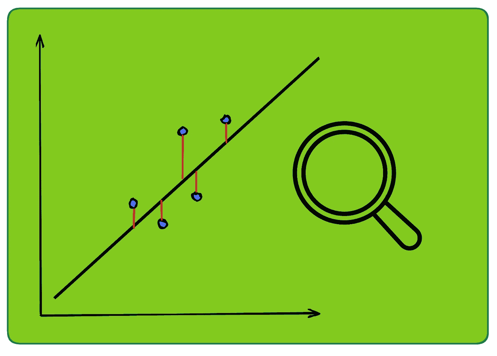

# 回归评估指标的全面概述

> 原文：[`towardsdatascience.com/a-comprehensive-overview-of-regression-evaluation-metrics-6264af0926db?source=collection_archive---------8-----------------------#2023-05-01`](https://towardsdatascience.com/a-comprehensive-overview-of-regression-evaluation-metrics-6264af0926db?source=collection_archive---------8-----------------------#2023-05-01)



作者使用[icons8](https://icons8.com/)的图标创建的图片

## 这是一个详尽的参考，涵盖了常用的回归评估指标及其在各种场景中的实际应用。

[](https://eryk-lewinson.medium.com/?source=post_page-----6264af0926db--------------------------------)[](https://towardsdatascience.com/?source=post_page-----6264af0926db--------------------------------) [Eryk Lewinson](https://eryk-lewinson.medium.com/?source=post_page-----6264af0926db--------------------------------)

·

[关注](https://medium.com/m/signin?actionUrl=https%3A%2F%2Fmedium.com%2F_%2Fsubscribe%2Fuser%2F44bc27317e6b&operation=register&redirect=https%3A%2F%2Ftowardsdatascience.com%2Fa-comprehensive-overview-of-regression-evaluation-metrics-6264af0926db&user=Eryk+Lewinson&userId=44bc27317e6b&source=post_page-44bc27317e6b----6264af0926db---------------------post_header-----------) 发布在[Towards Data Science](https://towardsdatascience.com/?source=post_page-----6264af0926db--------------------------------) ·15 min 阅读·2023 年 5 月 1 日[](https://medium.com/m/signin?actionUrl=https%3A%2F%2Fmedium.com%2F_%2Fvote%2Ftowards-data-science%2F6264af0926db&operation=register&redirect=https%3A%2F%2Ftowardsdatascience.com%2Fa-comprehensive-overview-of-regression-evaluation-metrics-6264af0926db&user=Eryk+Lewinson&userId=44bc27317e6b&source=-----6264af0926db---------------------clap_footer-----------)

--

[](https://medium.com/m/signin?actionUrl=https%3A%2F%2Fmedium.com%2F_%2Fbookmark%2Fp%2F6264af0926db&operation=register&redirect=https%3A%2F%2Ftowardsdatascience.com%2Fa-comprehensive-overview-of-regression-evaluation-metrics-6264af0926db&source=-----6264af0926db---------------------bookmark_footer-----------)

作为数据科学家，评估机器学习模型的性能是工作中至关重要的一部分。为了有效地进行评估，您可以利用多种统计指标，每种指标都有其独特的优势和局限性。通过深入理解这些指标，不仅可以更好地选择最佳指标来优化模型，还可以向业务利益相关者解释您的选择及其影响。

在这篇文章中，我专注于用于评估回归问题的指标，这些问题预测数值——例如房价或公司下个月的销售预测。由于回归分析被认为是数据科学的基础，因此理解其细节至关重要。

# 关于残差的快速入门

残差是大多数指标的构建块。简单来说，残差是实际值与预测值之间的差异。

```py
residual = actual - prediction
```
