# 一个关于作物产量和价格预测的数据科学课程项目，我至今不感到羞愧

> 原文：[`towardsdatascience.com/a-data-science-course-project-about-crop-yield-and-price-prediction-im-still-not-ashamed-of-75712dc8696f?source=collection_archive---------0-----------------------#2023-12-28`](https://towardsdatascience.com/a-data-science-course-project-about-crop-yield-and-price-prediction-im-still-not-ashamed-of-75712dc8696f?source=collection_archive---------0-----------------------#2023-12-28)

## 即便从一位经验丰富的数据科学家的角度来看

 [米哈伊尔·萨拉法诺夫](https://medium.com/@mik.sarafanov?source=post_page-----75712dc8696f--------------------------------)

·

[关注](https://medium.com/m/signin?actionUrl=https%3A%2F%2Fmedium.com%2F_%2Fsubscribe%2Fuser%2F209c78c40898&operation=register&redirect=https%3A%2F%2Ftowardsdatascience.com%2Fa-data-science-course-project-about-crop-yield-and-price-prediction-im-still-not-ashamed-of-75712dc8696f&user=Mikhail+Sarafanov&userId=209c78c40898&source=post_page-209c78c40898----75712dc8696f---------------------post_header-----------) 发表在 [Towards Data Science](https://towardsdatascience.com/?source=post_page-----75712dc8696f--------------------------------) ·12 分钟阅读·2023 年 12 月 28 日

--

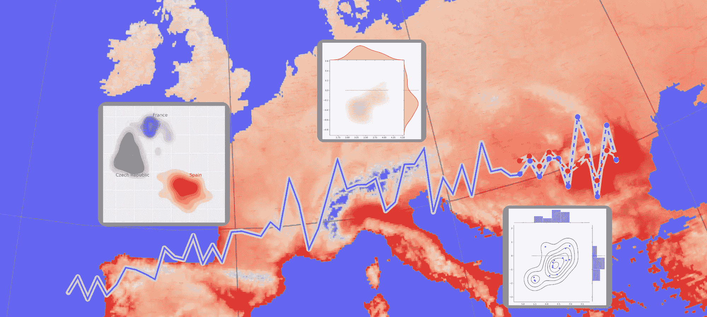

预览图（作者提供）

你好，亲爱的读者！在这些圣诞假期期间，我感到对过去的学生岁月有些怀念。因此，我决定写一篇关于一个学生项目的文章，这个项目是在差不多四年前作为 ITMO 大学硕士课程“*多变量数据分析方法与模型*”的项目完成的。

**免责声明：** 我决定写这篇文章有两个原因：

1.  分享一种组织大学学习的有效方法（至少对我来说）；

1.  向刚开始学习编程和/或统计学的人们提供灵感，让他们尝试和实验他们的宠物项目或课程项目，因为有时候这些项目对许多人来说是难忘且出乎意料的愉快

文章以提示格式提到了一些我在课程项目中能够应用的良好实践。

## 故事的开端

因此，在课程开始时，我们被告知学生可以自组 2–3 人的团队，并提出一个课程项目，我们将在课程结束时进行展示。在学习过程中（大约 5 个月），我们将向讲师做中期汇报。这样，教授们可以看到进展如何（或没有进展）。

之后，我立即和我的伙伴们：**Egor** 和 **Camilo** 组成了团队（因为我们知道一起玩乐很有趣），然后开始思考主题…

## **选择主题**

我建议选择

1.  一个足够大的主题，以便我们可以独立地在不同部分上工作

1.  与我们兴趣接近的领域（我对地理信息分析感兴趣，我的同事对经济学感兴趣）

所以，这就是…

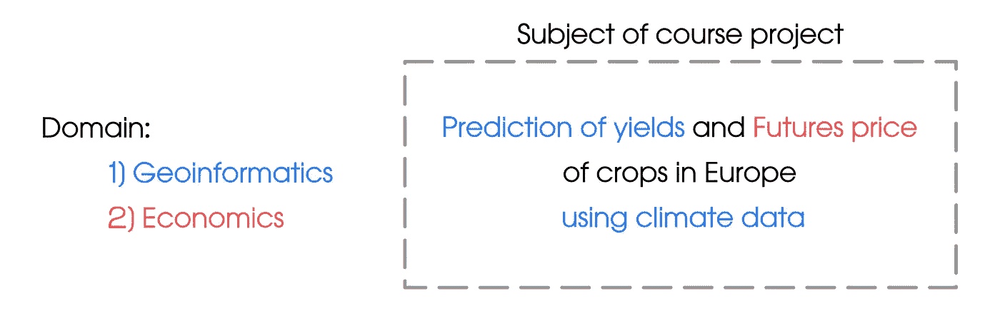

图 1\. 选择的主题（作者提供的图像）

Camilo 还想尝试制作可视化的仪表板（使用 PowerBI），但几乎任何任务都适合这种愿望。

> 提示 1：选择一个你（和你的同事）会充满热情的主题。它可能不是一个非常流行的项目，但你会享受在“晚上”做这件事的过程

## 主要思想是什么

课程包含了大量的主题，每个主题都是统计分析方法的集合。我们决定尝试以尽可能多的不同方式预测**产量和作物价格**，然后使用一些统计方法对预测结果进行集成。这让我们能够在实践中尝试课程中讨论的大多数方法。

此外，时空数据确实是多维的——这与课程的主要主题非常契合。

> 剧透：我们都得了 5 分中的 5 分

## 研究（& 数据来源）

我们从文献回顾开始，以准确了解作物产量和作物价格的预测方法。我们还想了解什么样的预测误差可以被认为是令人满意的。

我不会在这篇文章中引用这次评审得到的论文。我只是提到，我们决定使用以下指标和阈值来评估解决方案的质量（无论是作物产量还是作物价格）：

> 可接受的性能：[平均绝对百分比误差 (MAPE)](https://en.wikipedia.org/wiki/Mean_absolute_percentage_error) 对于一个相当好的预测应不超过 10%
> 
> 提示 2：在启动你的项目（无论是工作还是学习期间）之前，先回顾一下当代的解决方案。也许你现在关注的问题已经有人解决过了。
> 
> 提示 3：在开始开发之前，确定你将使用什么指标来评估解决方案。记住，你无法改进你无法衡量的东西。

回到研究中，我们确定了以下数据来源（链接截至 2023 年 12 月 28 日为最新）：

+   气候数据 — [E-OBS 从 1950 年至今的欧洲每日网格气象数据，来源于现场观测](https://cds.climate.copernicus.eu/cdsapp#!/dataset/insitu-gridded-observations-europe?tab=overview)。**许可证** — [许可证协议](https://cds.climate.copernicus.eu/api/v2/terms/static/licence-to-use-copernicus-products.pdf)；

+   景观类型矩阵 — [土地矩阵](https://landmatrix.org/)。**许可证 —** [创意共享 CC BY 4.0 国际](https://creativecommons.org/licenses/by/4.0/)。数据政策 — [数据政策 | 土地矩阵](https://landmatrix.org/about/data-policy/)；

+   带有国家边界的矢量图层 — [GIS-Lab](https://gis-lab.info/qa/vmap0-eng.html)。**许可证** — [GNU 较宽通用公共许可证](https://www.gnu.org/licenses/lgpl-3.0.html)；

+   国家作物产量数据 — [作物产量](https://ourworldindata.org/crop-yields)。**许可证** — [创意共享 BY 许可证](https://creativecommons.org/licenses/by/4.0/)；

+   作物产量期货价格（欧盟市场） — [Barchart](https://www.barchart.com/eu)。**许可证** — [使用 barchart.com 的许可证](https://www.barchart.com/terms)。

为什么选择这些来源？ — 我们假设作物的价格将取决于生产的产品数量。在农业中，生产数量取决于天气条件。

该模型用于：

+   小麦、稻米、玉米和大麦的产量；

+   国家：德国、法国、意大利、罗马尼亚、波兰、奥地利、荷兰、瑞士、西班牙和捷克共和国。

## 气候数据预处理；

因此，我们从一个假设开始：“小麦、稻米、玉米和大麦的产量取决于上半年（至 6 月 30 日）的天气条件”（图 2）；

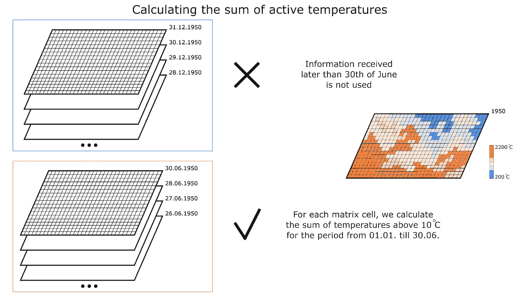

图 2. 产量预测特征生成（以活跃温度之和为例）（图像由作者提供）

从欧洲航天局网站获得的源档案包含 netCDF 文件。这些文件包含以下参数的每日字段：

+   平均日均气温，℃；

+   每日最低气温，℃；

+   最高日均气温，℃；

+   气压，HPa；

+   降水量，mm；

基于初步字段，计算了每年上半年的以下参数：

+   上半年总降雨量，mm（见动画）；

+   上半年降水天数，天；

+   平均气压，hpa；

+   上半年最高日均气温，℃；

+   上半年最低日均气温，℃；

+   10 摄氏度以上的活跃温度之和，℃（见图 3）。

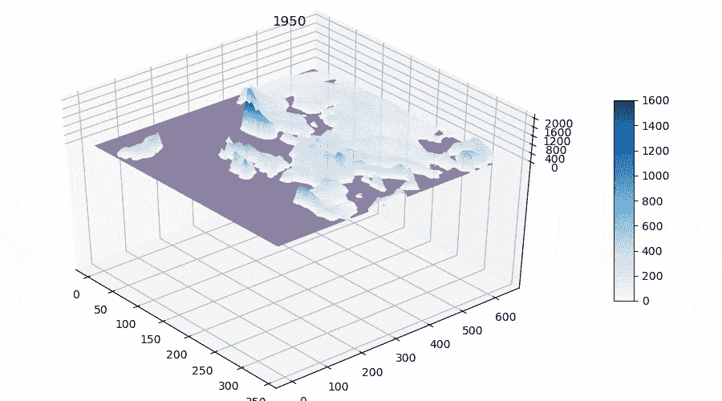

动画。上半年的降水量，毫米。图表顶部列出了年份（由作者提供）

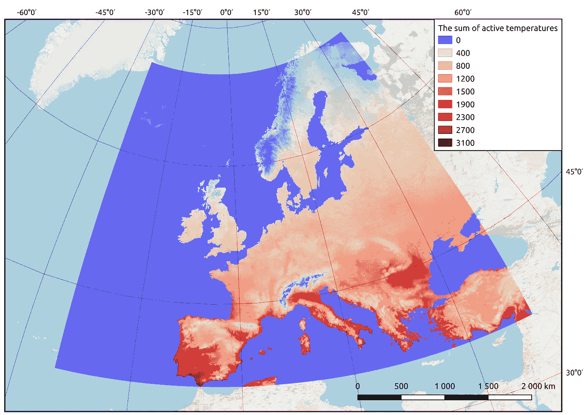

图 3\. 1950 年上半年活跃温度之和，摄氏度（图像由作者提供）

因此，我们获得了整个欧洲地区的矩阵，为未来的模型计算了特征。读者可能会注意到，我计算了一个参数，即“10 摄氏度以上的活跃温度之和”。这是生态学和植物学中非常流行的一个参数，有助于确定不同物种（主要是植物）的温度最佳值，例如 “[作为确定‘S̆ampion’和‘Ligol’苹果品种最佳收获日期的方法的活跃温度之和](https://www.semanticscholar.org/paper/The-sum-of-active-temperatures-as-a-method-of-the-%C5%81ysiak/764cd7d6aa55469a78dbd073d7c3805e8e2025fd)”）

> 提示 4：如果你在该领域拥有专业知识（与数据科学无关），确保在项目中加以利用——展示你不仅在进行“拟合预测”，而且在调整和改进领域特定的方法

下一步是按国家聚合信息。分别从气象参数矩阵中提取每个国家的值（图 4）。

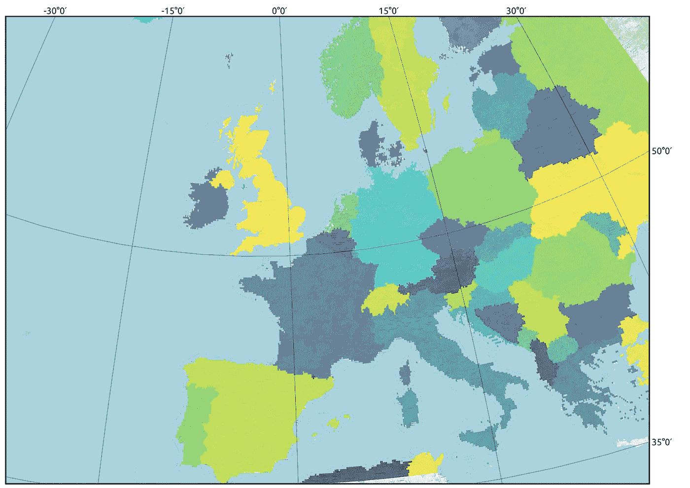

图 4\. 含有国家边界的矩阵（图像由作者提供）

我想指出，这个策略是有道理的（图 5）：例如，图片显示对西班牙而言，小麦产量几乎不受活跃温度之和的影响。然而，对于捷克共和国，温暖的上半年更可能导致较低的产量。因此，为每个国家单独建模是一个好主意。

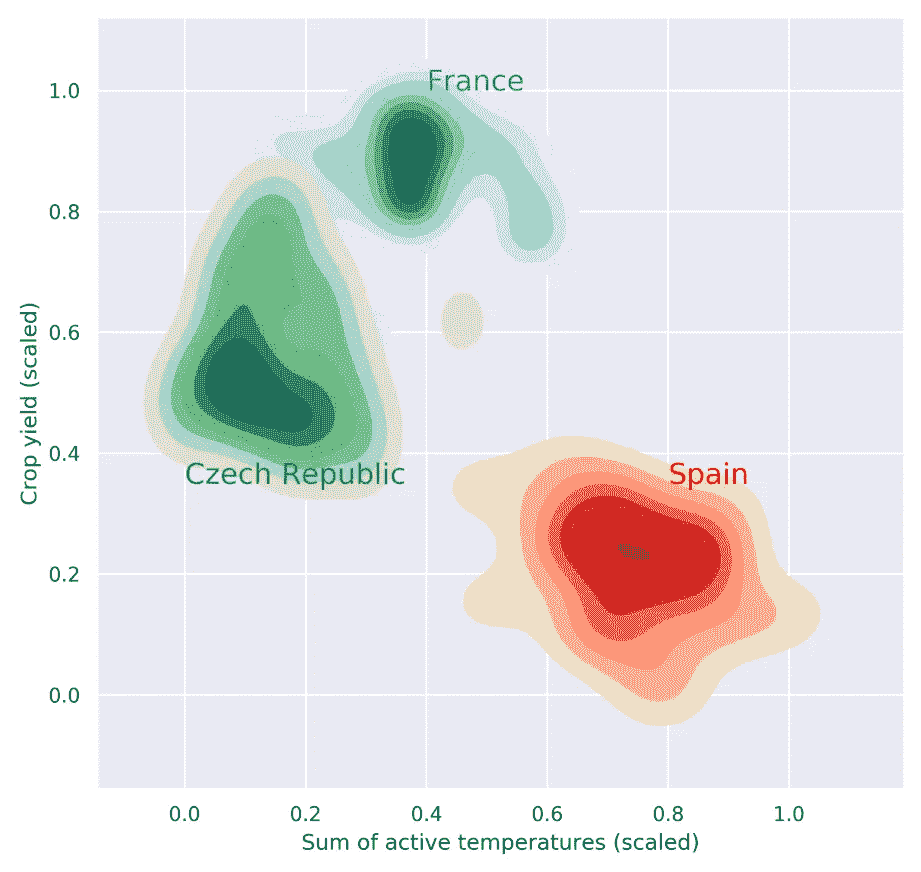

图 5\. **小麦**产量（吨/公顷）与活跃温度之和的依赖关系（图像由作者提供）

并非所有国家的领土都适合农业。因此，有必要仅从特定像素中聚合信息。为了考虑农业用地的位置，准备了以下矩阵（图 6）。

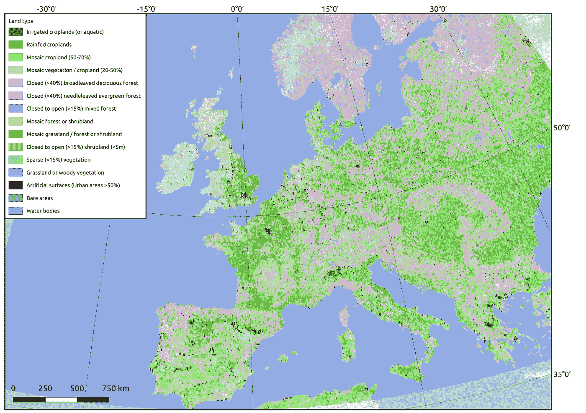

图 6\. 土地利用矩阵（图像由作者提供）

## 1\. 讲座主题为：单变量统计检验

所以，我们的数据已经准备好了。然而，农业是一个非常复杂的行业，每年、每十年都有显著改进。限制模型的训练样本可能是有意义的。为此，我们使用了累计和方法（图 7）：

> **累积和方法：** 对样本中的每一个数字，依次将后续数字累加。也就是说，如果样本仅包含三年：1950、1951 和 1952，那么 1950 年的数值将在 Y 轴上绘制为 1950，而 1951 将显示 1950 和 1951 的和，依此类推。
> 
> - 如果线的形状接近直线且没有断裂，样本是均匀的
> 
> - 如果线的形状有断裂，样本将基于此断裂分为两部分

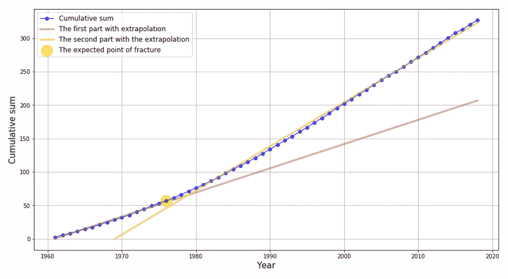

图 7\. 法国。跨年度目标变量比较：小麦（每公顷吨数）（图像由作者提供）

如果检测到断裂，我们将两个样本比较是否属于总体（Kolmogorov-Smirnov 统计量）。如果样本在统计上显著不同，我们将使用第二部分训练预测模型。如果没有，我们将使用整个样本。

> 提示 5：不要害怕结合统计分析的方法（这是课程项目！）。例如，在讲座中，我们没有被告知累积和方法——主题是比较分布。然而，我之前在处理冰图时使用了这种方法来比较冰况趋势。我认为这在这里也可能有用

我在这里应该指出，我们假设过程是遍历的，因此决定以这种方式进行比较。

准备好后，我们可以开始构建统计模型了——让我们来看看最有趣的部分吧！

## 2\. 讲座主题是：多元回归

以下特征被纳入模型：

+   总降雨量；

+   降水天数；

+   高于 10 ℃ 的活跃温度之和；

+   平均压力；

+   最低气温 ℃。

目标变量：**小麦**、**稻米**、**玉米**和**大麦**

验证年份：2008–2018 每个国家

让我们继续查看可视化，以使其更清晰。

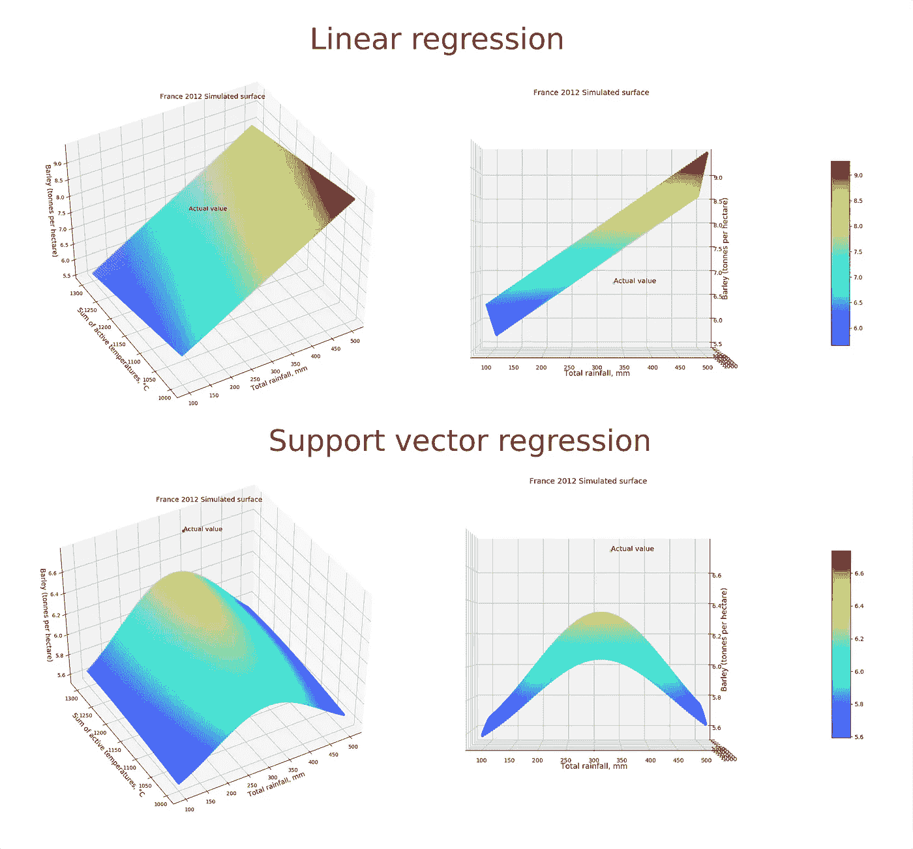

图 8\. 基于初始化模型，为每个国家生成的特定年份预测表面（图像由作者提供）

这里是图 9，显示了[残差](https://en.wikipedia.org/wiki/Errors_and_residuals)（*残差 = 观测值 - 估计（预测）值*）来自法国和意大利的线性模型：

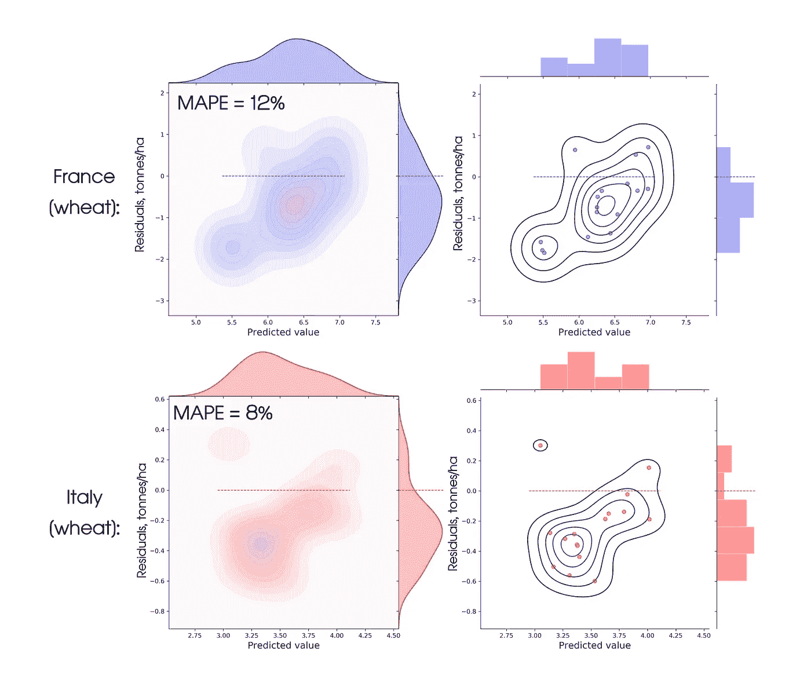

图 9\. 验证样本上线性回归的残差和指标的可视化（图像由作者提供）

从图表中可以看出，指标令人满意，但误差分布偏离零——这意味着模型存在系统误差。我们在下面的新模型中尝试进行修正

验证样本 MAPE 指标值：10.42%

> 提示 6：从最简单的模型开始（例如线性回归）。这将为你提供一个基线，以便与改进版本的模型进行比较。模型越简单越好，只要它显示出令人满意的指标

## 3\. 本讲座的主题是：多元分布分析

我们将本讲座的材料转化为一个“分布分析”模型。假设很简单——我们分析了每年的气候参数分布以及当前年份的分布，并找到与当前年份最相似的年份，以预测与过去已知值完全相同的产量（图 10）。

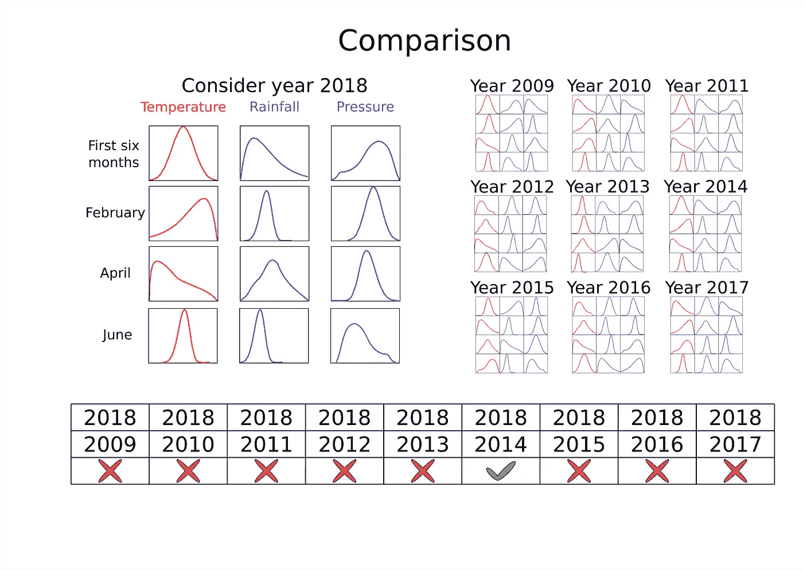

图 10\. 选择年份类比的两两比较概念（图片由作者提供）

**想法：** 具有相似气象条件的年份，其产量也将相似

**方法：** 比较温度、降水量和气压分布的两两对比。预测与考虑年份最相似的年份的产量。

**使用的分布：**

+   年初的温度，2 月、4 月、6 月的温度；

+   年初的降水量，2 月、4 月、6 月的降水量；

+   年初的气压，2 月、4 月、6 月的气压。

我们使用了 Kruskal-Wallis 检验来比较分布。为了调整 p 值，引入了多重检验修正——Bonferroni 修正。

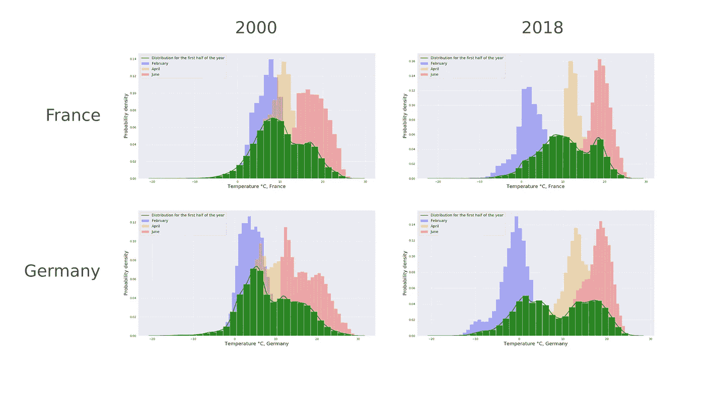

图 11\. 2000 年和 2018 年的气温分布（图片由作者提供）

验证样本的 MAPE 度量值：13.80%

> 提示 7：如果你进行多个统计检验，别忘了包括修正（例如，Bonferroni 修正）

## 4\. 本讲座的主题是：贝叶斯网络

一次讲座集中于[贝叶斯网络](https://en.wikipedia.org/wiki/Bayesian_network)。因此，我们决定将这种方法适用于产量预测。我们认为每年由一组变量 A、B、C 等描述，其中 A 是描述作物产量的类别集合，B 是例如活跃温度条件的总和，以此类推。例如，A 可以取三个值：“高作物产量”、“中等作物产量”、“低作物产量”。B 和 C 及其他也相同。因此，如果我们对条件和目标变量进行分类，我们得到每年的以下描述：

+   1950 年 — “高热量供应”，“低降水供应”，“高气压” — “高作物产量”

+   1951 年 — “低热量供应”，“高降水供应”，“高气压” — “中等作物产量”

+   1952 年 — “低热量供应”，“低降水供应”，“高气压” — 哪种作物产量？

该算法旨在基于三个其他类别的组合来预测产量类别：

+   **作物产量（3 个类别）— 隐藏状态 — 目标变量**

+   活跃温度总和（3 个类别）

+   降水量（3 个类别）

+   平均压力（3 个类别）

我们如何定义这些类别？——通过使用聚类算法！例如，确定了用于小麦产量的以下 3 个集群

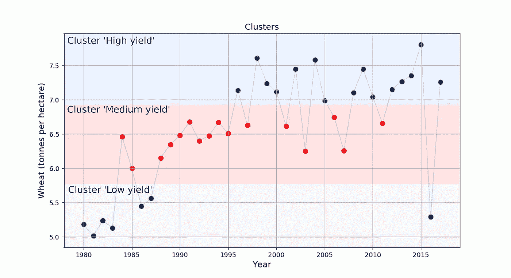

图 12：用于贝叶斯网络分析的小麦产量集群（图片由作者提供）

该模型的最终预测——预测集群的平均产量。

验证样本 MAPE 指标值：14.55%

> 8 个提示：做实验！时间序列预测的贝叶斯网络与聚类？——当然！分布的成对分析——为什么不呢？有时最大胆的方法会带来显著的改进

## 5. 讲座主题为：时间序列预测

当然，我们可以将目标变量作为时间序列进行预测。我们的任务是了解经典预测方法在理论和实践中的工作原理。

将这种方法付诸实践被证明是最简单的。例如，在 Python 中有几个库可以定制和应用 ARIMA 模型，例如 [pmdarima](https://pypi.org/project/pmdarima/)。

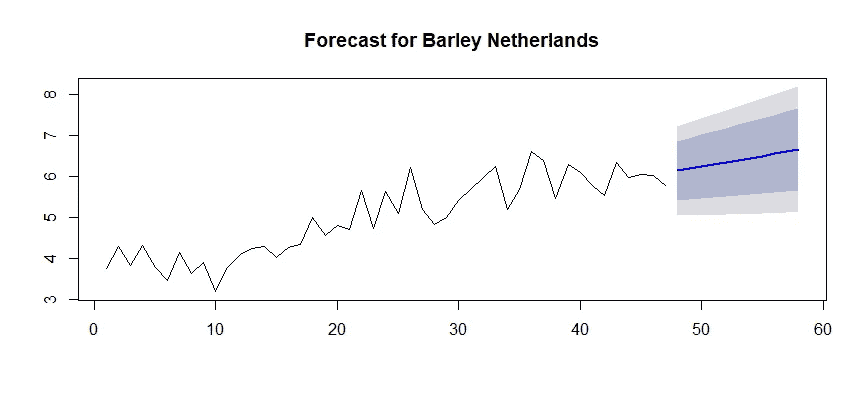

图 13：应用 ARIMA 模型预测产量时间序列。X 轴：时间索引，Y 轴：大麦产量（图片由作者提供）

验证样本 MAPE 指标值：10.41%

> 9 个提示：不要忘记与经典方法进行比较。一个抽象的指标不能告诉你的同事你的模型有多好，但与知名标准的比较会显示真正的性能水平

## 6. 讲座主题为：集成方法

所有模型建立后，我们探讨了每个模型是如何“出错”的（回忆线性回归模型的残差图——见图 9）：

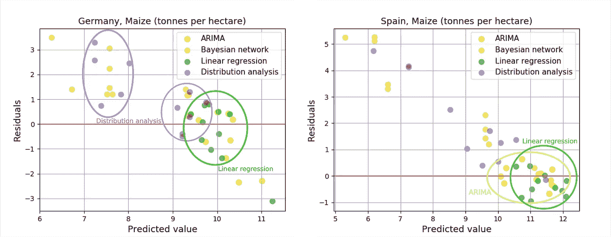

图 14：不同作物产量预测模型的残差图（图片由作者提供）

**没有一个呈现的算法能突破 10%的门槛（根据 MAPE）。**

使用了卡尔曼滤波器来提高预测质量（进行集成）。对于一些国家已经取得了令人满意的结果（图 15）

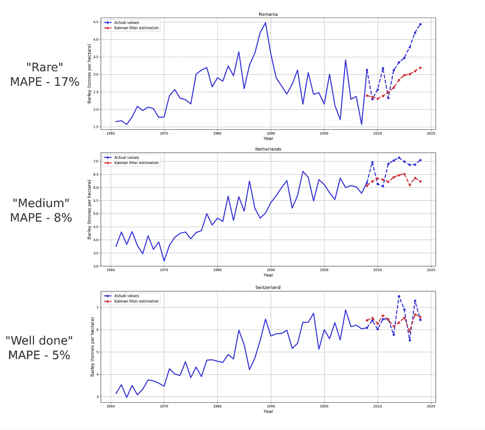

图 15：使用集成方法对不同国家的作物产量预测（图片由作者提供）

验证样本 MAPE 指标值：9.89%

> 10 个提示：如果有人要求我将开发的模型集成到生产服务中，我会选择集成 ARIMA 或线性回归，即使集成指标更好。然而，商业问题中的指标有时不是关键。一个独立模型有时比集成模型更好，因为它更简单，更可靠（即使错误指标稍高）

## 期货价格预测

最后一部分：模型（Lasso 回归），使用预测的产量值和期货特征来估计可能的价格值（图 16）：

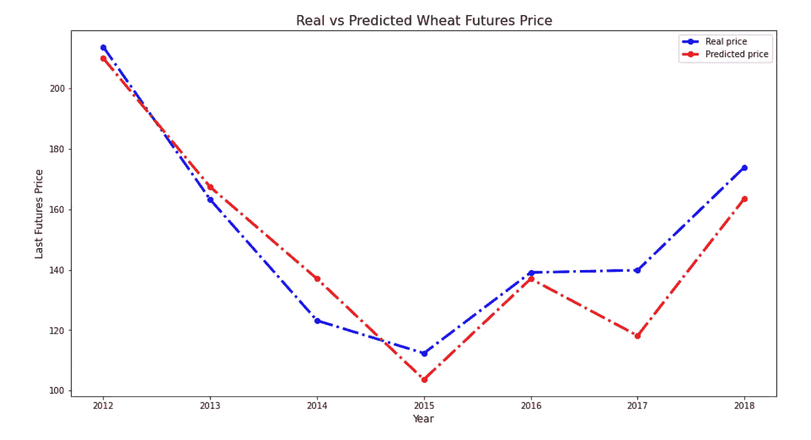

图 16\. 小麦期货价格预测（图片来源：作者）

验证样本上的 Mape：6.61%

## 为什么我仍然认为这个项目是一个好项目

故事到此为止。上面贴出了一些建议。在最后一段，我想总结最后一点，说明为什么我对这个项目感到满意。这里有三个主要方面：

+   工作组织和主题选择——我们很好地结合了各自的优势和最佳品质，合理规划了工作流程，并作为一个团队成功准备了一个好的项目并按时交付。**因此，我提升了自己的软技能；**

+   有意义的主题——我对我们所做的事情充满热情。即使我现在有几周的空闲时间做一个小项目，我也会很高兴将我目前的经验和技能应用到这样的案例研究中。**所以，我对我们完成的工作感到满意；**

+   硬技能——在我们的工作中，我们**尝试了新的统计方法，提高了对已有方法的理解，并提升了编程技能**。

好吧，我们在考试中也得了很高的分数 XD

我希望你在大学和其他地方的项目都能给你带来同样的激动。新年快乐！

此致敬礼，[米哈伊尔·萨拉法诺夫](https://github.com/Dreamlone)
