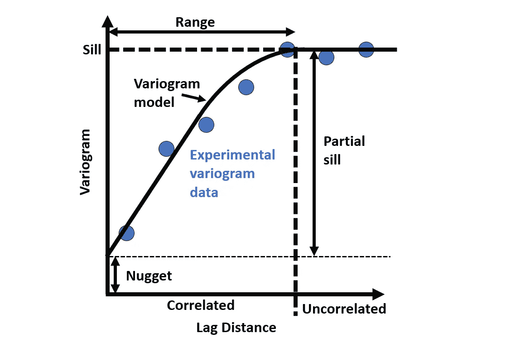
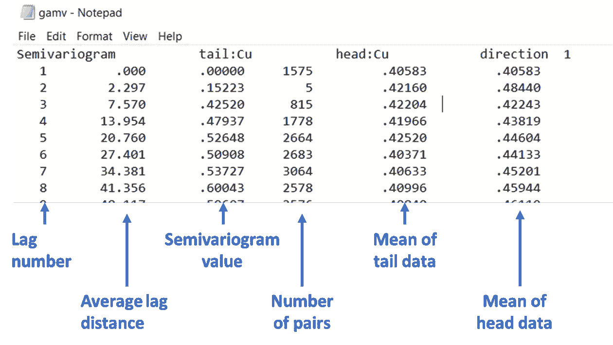

# 量化空间连续性的面向数据科学家的变异函数教程

> 原文：[`towardsdatascience.com/a-data-scientist-friendly-variogram-tutorial-for-quantifying-spatial-continuity-1d2f29dcfb51`](https://towardsdatascience.com/a-data-scientist-friendly-variogram-tutorial-for-quantifying-spatial-continuity-1d2f29dcfb51)

## 应用在一个合成矿业数据集上，使用开源的 GSLib 和 Python

[](https://fouadfaraj.medium.com/?source=post_page-----1d2f29dcfb51--------------------------------)[](https://towardsdatascience.com/?source=post_page-----1d2f29dcfb51--------------------------------) [Fouad Faraj](https://fouadfaraj.medium.com/?source=post_page-----1d2f29dcfb51--------------------------------)

·发布于 [Towards Data Science](https://towardsdatascience.com/?source=post_page-----1d2f29dcfb51--------------------------------) ·7 分钟阅读·2023 年 8 月 20 日

--


图片来源：[Sebastian Pichler](https://unsplash.com/@pichler_sebastian?utm_source=medium&utm_medium=referral) 于 [Unsplash](https://unsplash.com/?utm_source=medium&utm_medium=referral)

# 介绍

变异函数用于展示空间数据的距离相关变异性。理解和建模变异函数的空间连续性很重要，因为它们被用来将点测量估算到实际的块中，广泛应用于矿石品位、石油浓度或环境污染物等领域。

尽管有开源选项可以生成变异函数，由于其复杂性，大多数用户依赖于昂贵的软件包，这些软件包抽象了许多细节。这个教程旨在简要介绍变异函数以及如何使用开源地统计学库（GSLib），它可以独立使用或与 Python 结合使用来开发变异函数。

这里在一个合成矿业数据集上开发了一个变异函数模型，但该工作流程也可用于气象应用如温度或环境应用如污染物跟踪等任何类型的空间数据。

## 教程要求

我们需要 GSLib，免费提供 [这里](http://gslib.com/main_gd.html) 下载，以及一些最基本的、常用的 Python 库，这些库也包含在上传到 [github](https://github.com/13ff6/Variogram) 的完整代码中。

```py
import pandas as pd
import numpy as np
import matplotlib.pyplot as plt
```

# 变异函数基础

变异函数的一般思想是，相距较远的数据点比相距较近的数据点更有可能显著不同。数据点之间的方差随着距离的增加而增加，最终达到与数据的全局方差相等的点。

我们从空间数据集开始，可以将变异函数建模工作流程概括为以下几个步骤。首先，我们需要确定适当的变异函数搜索参数。然后识别主要和次要的连续性轴。最后，可以建模变异函数，并随后用于估算或模拟目的。每一步将在以下部分中进一步解释，并在教程中应用于数据集。


开发变异函数模型到空间数据集的一般工作流程。图像由作者提供

## 变异函数建模参数：基台、范围和上限

变异函数模型由三个组成部分构成，这些部分描述了数据的不同属性：

+   **基台**：变异函数模型的 Y 轴截距，表示在接近零距离处的即刻变异性或单点的随机性

+   **范围**：变异函数趋于平稳后的距离，表示该距离的点不再具有空间相关性

+   **上限**：建模数据的方差，一旦距离一定的点方差达到它，就不再有空间相关性

下面的变异函数示意图说明了每个模型参数。在到达范围之前，数据被认为是空间相关的。范围较长的变异函数比范围较短的更具有空间连续性。高基台变异函数表明在接近零距离处的变异性较高，这通常表明数据集更具变异性和不连续性。



示意图展示了变异函数模型如何拟合一组实验数据，突出相关的变异函数建模参数。图像由作者提供

## 变异函数开发

为了生成实验变异函数数据，我们需要定义对。每对由一个头和一个尾组成，间隔一定距离。我们增加距离以测试对之间的平均差异，并了解它如何随距离变化。如果我们处理的是二维数据，则在变异函数建模中有几个不同的标准搜索参数，如下所示。搜索参数带有容差，因为找到精确的 2.0000 米方向上的匹配是不太可能的。


示意图说明了二维变异函数搜索参数。图像由作者提供

确定参数后，搜索将迭代应用于所有点，以在每个滞后时段开发实验变异函数数据，如下所示对于一个点。每个滞后时段的平均变异函数被计算出来，最终达到上限或全局数据的方差。


示意图显示了从一个点生成实验变异函数数据时的所有 n 个滞后。图像由作者提供

每个延迟的计算只是所有配对的差值平方的一半，如下所示。这个变异函数值将对比延迟绘制出来以发展变异函数。


标注的变异函数方程。图像来源：作者

## 使用 GSLib 的 gamv 开发实验性变异函数数据

现在要使用 GSLib 的 gamv 实际计算实验性变异函数数据，我们首先需要定义搜索参数。下方是搜索参数示意图，旁边是标注的截图，指示了对应的 GSLib gamv 参数文件输入。


示意图展示了 2D 变异函数搜索参数，旁边是 GSLib 参数文件截图。图像来源：作者

设置参数后，确保你的空间数据符合 GSLib 所需的 .dat 格式，如下所示为我们的空间铜品位数据示例。


GSLib gamv 数据格式的标注记事本截图。图像来源：作者

现在要运行 GSLib 代码，你可以使用命令窗口，导航到工作目录，然后执行 gamv，如下所示：


运行 GSLib gamv 和典型返回反馈的输入行的标注截图。图像来源：作者

输出变异函数将保存在 gamv.out 文件中，数据排序如下面所示：



GSLib gamv 输出的标注截图，指示每一列的内容。图像来源：作者

之后你可以以任何你喜欢的方式分析输出，本教程将使用 Python。

# 在合成矿数据集上的应用

我们使用的合成钻孔数据集是基于真实的铜矿建模的。钻孔数据在二维空间中大约分布为 7x7 米，东向和北向以米为单位测量，每个点都有一个测量的铜品位，单位为重量百分比（wt%）。本教程中使用的所有代码和数据均可在 github 上找到。下图展示了铜品位及其在空间中的分布情况。


铜矿品位数据集的地图视图。图像来源：作者

以下 GSLib 变异函数搜索参数适用于约 7x7 米的空间数据，我们将用它们来生成我们的变异函数。[这里](https://geostatisticslessons.com/lessons/variogramparameters) 是一个很好的来源，用于根据空间数据确定合适的搜索参数。

+   延迟分隔距离：7 米，大致为数据间隔

+   延迟容差：3.5 米，经验法则是将延迟容差设为间隔的一半

+   延迟数：30，大部分区域覆盖在 30*7 米（210 米）中

+   方位容差：22.5 度，可能略小如 15 度，但我们希望确保能获得足够多的配对

+   带宽：10 米，可能略小如 7.5 米，但我们希望确保能获得足够多的配对

+   变异函数类型：半变异函数

## 确定最小和最大不连续性的主方向

由于我们在 2D 环境中工作，我们需要识别两个正交方向，即高和低连续性，通常称为主轴和次轴。确定主方向的方法有多种，这里介绍的最基本方法是生成多个等间隔的变差函数对，找出包涵最高和最低空间连续性的两个方向。其他有用的方法包括生成变差函数图，这可以直观地显示空间连续性，GSLib 提供了用于变差函数图的软件包，并且可以在[这里](http://www.gslib.com/gslib_help/varmap.html)找到使用指南。

下面我们看到在 15 度间隔下开发的变差函数对，可以清楚地看出，方位角为 000°和 090°的变差函数分别具有最高和最低的连续性。


六个正交对的实验变差函数数据突出显示了 000°和 090°方位角观察到的高和低连续性。图像来源：作者

我们可以快速检查 000°和 090°方位角方向的品位图，看看它们是否合理地对应于最连续和最不连续的方向。正如下面重新生成的图所示，最小连续性在东西方向是合理的，因为在该方向上品位从最高值过渡到最低值，而南北方向的品位变化不大。


铜品位图，突出显示了东西方向的低连续性和南北方向的高连续性及其相应的方位角。图像来源：作者

## 变差函数建模

000°和 090°方位角的实验变差函数数据使用指数模型进行建模。测试了不同的“豆子”值、范围和部分高程，直到获得了定性较好的拟合。使用嵌套结构和多模型，或探索如在矿业中常用的球形模型等不同模型，可能会获得对实验数据更好的拟合。


次轴和主轴的指数变差函数模型，参数已表格化。图像来源：作者

现在，变差函数模型可以用于对点数据进行任何类型的估算或模拟。GSLib 也提供了运行常用普通克里金估算或序贯高斯模拟所需的软件包。

# 结论

理解和建模空间连续性具有挑战性，特别是对于没有地质统计背景的人。这里我们提供了变差函数的简要介绍和使用开源软件生成变差函数模型的快速教程。许多用户目前使用昂贵的软件，因为空间连续性分析的编码经验总体不足，开源软件如 GSLib 并不广为人知。

此外，许多商业软件会抽象掉变差函数的重要细节，这些细节可能会影响所开发的模型。各种地质统计学文本都强调不要将变差函数建模视为黑箱，并且花费的精力去理解数据中的情况对于生成稳健的变差函数模型非常有用。
