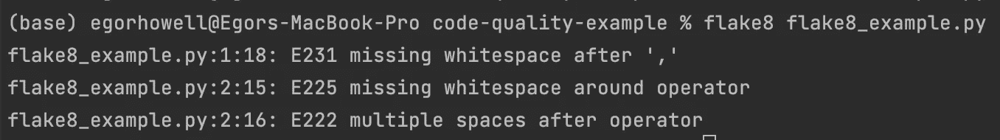
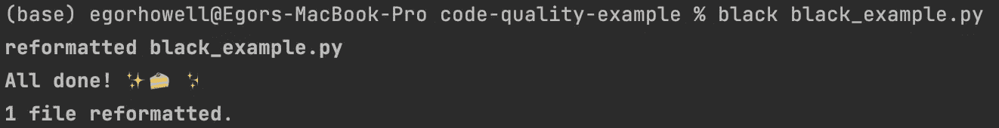
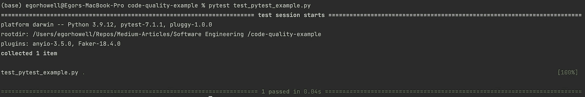
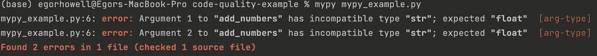

# 数据科学家提高 Python 代码质量的指南

> 原文：[`towardsdatascience.com/a-data-scientists-guide-to-improving-python-code-quality-21660ecea97d`](https://towardsdatascience.com/a-data-scientists-guide-to-improving-python-code-quality-21660ecea97d)

## 编写符合生产标准的 Python 代码的工具和包

[](https://medium.com/@egorhowell?source=post_page-----21660ecea97d--------------------------------)[](https://towardsdatascience.com/?source=post_page-----21660ecea97d--------------------------------) [Egor Howell](https://medium.com/@egorhowell?source=post_page-----21660ecea97d--------------------------------)

·发布于 [Towards Data Science](https://towardsdatascience.com/?source=post_page-----21660ecea97d--------------------------------) ·阅读时间 6 分钟·2023 年 8 月 3 日

--


[Christopher Gower](https://unsplash.com/@cgower?utm_source=medium&utm_medium=referral) 提供的照片，来源于 [Unsplash](https://unsplash.com/?utm_source=medium&utm_medium=referral)

# 背景

如今，数据科学家在部署机器学习模型的生产环节中变得越来越重要。这意味着我们需要像其他软件工程师一样，能够编写符合生产标准的 Python 代码。在这篇文章中，我想介绍一些可以帮助你为下一个模型编写符合生产标准代码的关键工具和包。

# 代码检查工具

## 概述

[**代码检查工具**](https://en.wikipedia.org/wiki/Lint_%28software%29) 是一种捕捉小错误、格式错误和可能导致运行时问题及意外输出的奇怪设计模式的工具。

在 Python 中，我们有 [**PEP8**](https://pep8.org/)，它幸运地为我们提供了一个全局的代码风格指南。虽然 Python 中存在许多符合 PEP8 的代码检查工具，但我个人的偏好是 [**flake8**](https://flake8.pycqa.org/en/latest/)。

## Flake8

Flake8 实际上是 [**Pyflakes**](https://github.com/PyCQA/pyflakes)、[**pycodestyle**](https://github.com/pycqa/pycodestyle) 和 [**McCabe**](https://github.com/PyCQA/mccabe) 代码检查包的组合。它用于检查错误、[**代码异味**](https://en.wikipedia.org/wiki/Code_smell) 并强制执行 PEP8 标准。

要安装 flake8 使用 `pip install flake8`，并且你可以通过 `flake8 <file_name.py>` 使用它。真的就是这么简单！

例如，假设我们在一个文件 `flake8_example.py` 中有一个函数 `add_numbers`：

```py
def add_numbers(a,b):
    result = a+  b
    return result

print(add_numbers(5, 10))
```

要对这个文件调用 flake8，我们执行 `flake8 flake8_example.py`，输出结果如下：



作者提供的照片。

Flake8 发现了几个样式错误，我们应该修正这些错误以符合 PEP8。

> 有关 flake8 的更多信息以及如何根据需要自定义它，请参见[此处](https://flake8.pycqa.org/en/latest/)。

# 代码格式化工具

## 概述

Linters 通常只是告诉你代码中有什么问题，但不会主动为你修复。格式化工具会修复你的代码，帮助加快工作流程，确保代码遵循风格指南，并使其对其他人更具可读性。

## isort

[isort 包](https://pycqa.github.io/isort/)按[**PEP8**](https://peps.python.org/pep-0008/#imports)中指定的顺序对导入进行排序。可以通过`pip install isort`轻松安装。

导入应写在单独的行上：

```py
# Correct
import pandas
import numpy 

# Incorrect 
import pandas, numpy
```

它们还应按以下顺序分组：

+   *标准库*（例如`sys`）

+   *相关第三方*（例如`pandas`）

+   *本地*（例如，repo 中其他文件的函数）

```py
# Correct
import math
import os
import sys

import pandas as pd

# Incorrect
import math
import os
import pandas as pd
import sys
```

最后，来自包的导入需要按字母顺序排列：

```py
# Correct
from collections import Counter, defaultdict

# Incorrect
from collections import defaultdict, Counter
```

以下命令展示了如何从终端运行 isort：

```py
# Format imports in every file
isort .

# Format in specific file
isort <file_name.py>
```

> 有关 isort 的更多信息，请查看他们的网站[此处](https://pycqa.github.io/isort/)。

## Black

Black 根据其自己的风格指南重新格式化代码，该指南是[**PEP8**](https://peps.python.org/pep-0008/)的一个子集。有关当前 black 遵循的格式化指南，请参见[此处](https://black.readthedocs.io/en/stable/the_black_code_style/current_style.html)。

要安装 black，只需运行`pip install black`，然后在文件上调用`black <file_name.py>`。

以下是一个名为`black_example.py`的文件示例：

```py
# Before running black 
def   add_numbers  (  x, y ) :

    result= x  +y
    return result
```

然后我们运行`black black_example.py`：

```py
# After running black
def add_numbers(x, y):
    result = x + y
    return result
```

终端中的输出也将是这样的：



作者拍摄。

> 有关更多信息以及如何自定义你的 black 格式化工具，请参见他们的主页[此处](https://black.readthedocs.io/en/stable/index.html#)。

# 单元测试

## 概述

[**单元测试**](https://en.wikipedia.org/wiki/Unit_testing)提供了一个结构化的格式，以确保你的代码按照预期执行。它们测试代码的小部分，例如函数和类，以验证它们是否按预期行为。测试设置相当简单，可以节省你大量的调试时间，因此对数据科学家非常推荐。

## PyTest

[**Pytest**](https://docs.pytest.org/en/7.3.x/)是最受欢迎的单元测试框架，与 Python 的本地[**单元测试**](https://docs.python.org/3/library/unittest.html)包一起使用，可以通过`pip install pytest`轻松安装。

要使用 pytest，我们首先需要一个可以测试的函数。让我们回到我们的`add_numbers`函数，该函数将位于名为`pytest_example.py`的文件中：

```py
def add_numbers(x, y):
    result = x + y
    return result
```

现在在一个名为`test_pytest_example.py`的单独文件中，我们编写相应函数的单元测试：

```py
from pytest_example import add_numbers

def test_add_numbers():
  assert add_numbers(5, 13) == 18
```

要运行此测试，我们只需执行`pytest test_pytest_example.py`：



作者拍摄。

如你所见，我们的测试通过了！

如果你想要更详细和全面的 pytest 和单元测试教程，请查看我之前关于这个主题的文章：

[](/debugging-made-easy-use-pytest-to-track-down-and-fix-python-code-ecbad62057b8?source=post_page-----21660ecea97d--------------------------------) ## 调试变得简单：使用 Pytest 跟踪和修复 Python 代码

### 初学者的单元测试教程及如何在 Pytest 中进行单元测试

towardsdatascience.com

# 类型检查器

## 概述

最后一个主题是类型系统，不是键盘类型！Python 是[**动态语言**](https://en.wikipedia.org/wiki/Dynamic_programming_language)，这意味着它不强制变量的严格类型。变量`x`在同一代码中可以是整数也可以是字符串。然而，这可能会导致意外的错误。因此，有工具可以使 Python 更像是[**静态类型**](https://www.techopedia.com/definition/22321/statically-typed#:~:text=Statically%20typed%20is%20a%20programming,with%20variables%2C%20not%20with%20values.)语言。

## Mypy

我们可以通过使用包[**mypy**](https://mypy-lang.org/)来确保我们的变量和函数具有正确的预期类型。这个包检查输入和输出是否符合所需的类型。

例如，对于`add_numbers`函数，我们期望输入和输出都为`float`。这可以在函数中指定：

```py
def add_numbers(x: float, y: float) -> float:
    result = x + y
    return result

print(add_numbers(10, 10))
print(add_numbers("10", "10"))
```

现在，假设我们将以下参数传递给函数并`print`结果：

```py
print(add_numbers(10, 10))
print(add_numbers("10", "10"))
```

输出会如下所示：

```py
print(add_numbers(10, 10))
>>> 20

print(add_numbers("10", "10"))
>>> 1010
```

我们看到第一个输出符合我们的预期，但第二个则不符合。这是因为我们传入了两个`str`类型，然而 Python 解释器没有报错，因为 Python 是动态语言。

我们可以使用 mypy 来捕获这些错误，避免下游出现任何 bug。为此，调用 mypy 命令为`mypy <file_name.py>`。所以，对于这个例子，我们执行`mypy mypy_example.py`：



作者拍摄的照片。

如我们所见，mypy 发现第 6 行中指定的参数是`str`，而函数期望的是`float`。

如果你想要更详细和全面的 mypy 和类型教程，请查看我之前关于这个主题的文章：

[](/a-data-scientists-guide-to-python-typing-boosting-code-clarity-194371b4ef05?source=post_page-----21660ecea97d--------------------------------) ## 数据科学家的 Python 类型指南：提升代码清晰度

### 类型的重要性及其在 Python 中的应用

towardsdatascience.com

# 什么是需求？

总结一下，你可能会想，为什么我们需要这些工具？这些工具的最终目的是让你的 Python 代码具有：

+   ***可读性：*** *你的代码变得对其他开发者和数据科学家更加直观和易读。这有助于更好的协作和更快的交付时间。*

+   ***鲁棒性：*** *代码将更不容易出错，并且引入错误的难度也更大，特别是使用单元测试时。*

+   ***更容易识别错误：*** *通过使用代码检查工具和测试，我们可以检测代码中的任何不一致和异常结果，从而降低在生产环境中出现代码错误的风险。*

你可以在我的 GitHub 上查看本文中使用的完整代码：

[](https://github.com/egorhowell/Medium-Articles/tree/main/Software%20Engineering%20/code-quality-example?source=post_page-----21660ecea97d--------------------------------) [## Medium-Articles/Software Engineering /code-quality-example at main · egorhowell/Medium-Articles

### 我在我的 Medium 博客/文章中使用的代码。通过创建一个帐户来为 egorhowell/Medium-Articles 的开发做出贡献…

github.com](https://github.com/egorhowell/Medium-Articles/tree/main/Software%20Engineering%20/code-quality-example?source=post_page-----21660ecea97d--------------------------------)

# 参考文献与进一步阅读

+   [*更多的 Python 代码质量示例*](https://testdriven.io/blog/python-code-quality/#black)

+   [*更多的代码检查工具*](https://realpython.com/python-code-quality/)

+   [*还有更多工具*](https://cpske.github.io/ISP/code-quality/code-quality-tools)

# 另一个话题！

我有一个免费的通讯， [**Dishing the Data**](https://dishingthedata.substack.com/)，在其中我每周分享成为更好数据科学家的小贴士。没有“空话”或“点击诱饵”，只有来自实践中的数据科学家的纯粹可操作的见解。

[](https://newsletter.egorhowell.com/?source=post_page-----21660ecea97d--------------------------------) [## Dishing The Data | Egor Howell | Substack

### 如何成为更好的数据科学家。点击阅读《Dishing The Data》，作者 Egor Howell，Substack 发表的…

newsletter.egorhowell.com](https://newsletter.egorhowell.com/?source=post_page-----21660ecea97d--------------------------------)

# 与我联系！

+   [**YouTube**](https://www.youtube.com/@egorhowell?sub_confirmation=1)

+   [**LinkedIn**](https://www.linkedin.com/in/egor-howell-092a721b3/)

+   [**Twitter**](https://twitter.com/EgorHowell)

+   [**GitHub**](https://github.com/egorhowell)
