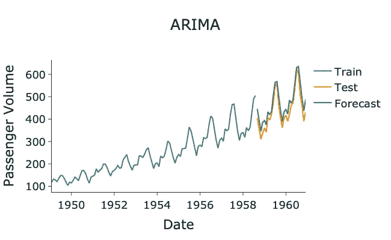

# Makefile 教程

> 原文：[`towardsdatascience.com/a-data-scientists-guide-to-make-and-makefiles-1595f39e0704`](https://towardsdatascience.com/a-data-scientists-guide-to-make-and-makefiles-1595f39e0704)

## 如何使用 Make 和 Makefiles 优化你的机器学习管道

[](https://medium.com/@egorhowell?source=post_page-----1595f39e0704--------------------------------)[](https://towardsdatascience.com/?source=post_page-----1595f39e0704--------------------------------) [Egor Howell](https://medium.com/@egorhowell?source=post_page-----1595f39e0704--------------------------------)

·发表于 [Towards Data Science](https://towardsdatascience.com/?source=post_page-----1595f39e0704--------------------------------) ·5 分钟阅读·2023 年 8 月 11 日

--


图片由 [Nubelson Fernandes](https://unsplash.com/@nublson?utm_source=medium&utm_medium=referral) 提供，来源于 [Unsplash](https://unsplash.com/?utm_source=medium&utm_medium=referral)

# 背景

现在数据科学家需要编写生产代码来部署他们的机器学习算法。因此，我们需要了解软件工程标准和方法，以确保我们的模型稳健有效地部署。其中一个在开发者社区中非常知名的工具是 `make`。这是一个强大的 Linux 命令，开发者早已知晓，在这篇文章中我想展示它如何用于构建高效的机器学习管道。

# 什么是 Make？

`make` 是一个终端命令/可执行文件，类似于 `ls` 或 `cd`，存在于大多数类 UNIX 操作系统中，如 MacOS 和 Linux。

`make` 的使用是为了简化并将工作流程分解为逻辑上的 shell 命令组。

它被开发者广泛使用，也被数据科学家采纳，因为它简化了机器学习管道并使生产部署更具稳健性。

# 为什么要使用 Make 进行数据科学？

`make` 是一个强大的工具，数据科学家应该利用它，原因如下：

+   *自动化机器学习环境的设置*

+   *更清晰的端到端管道文档*

+   *更容易测试具有不同参数的模型*

+   *项目的结构和执行显而易见*

# 什么是 Makefile？

`Makefile` 基本上是 `make` 命令读取和执行的内容。它有三个组成部分：

+   ***目标***：*这些是你试图构建的文件，或者如果你只是执行命令，你会有一个* `PHONY` *目标。*

+   ***依赖：*** *在执行此目标之前需要运行的源文件。*

+   ***命令：*** *顾名思义，这些是生成目标的步骤列表。*

# 基本示例

让我们通过一个非常简单的示例来使这个理论变得具体。

以下是一个`Makefile`，它有目标`hello`，并使用`echo`命令将`'Hello World'`打印到屏幕上，并且没有依赖关系：

```py
# Define our target as PHONY as it does not generate files
.PHONY: hello

# Define our target
hello:
 echo "Hello World!"
```

我们可以通过在终端中简单地执行`make hello`来运行它，这将产生以下输出：

```py
echo "Hello World!"
Hello World!
```

它本质上只是列出了并执行了命令。这就是`make`的本质，没有什么太复杂的。

注意我们将目标`hello`设置为`.PHONY`，因为它不会生成文件。这就是`.PHONY`的意义，只用于不产生文件的目标。

> 如果我们不想将`echo`命令输出到屏幕，可以在命令前添加`@`符号。

我们可以在`Makefile`中添加另一个目标来生成一个文件：

```py
# Define some targets as PHONY as they do not generate files
.PHONY: hello

# Define our target
hello:
 echo "Hello World!"

# Define our target to generate a file
data.csv:
 touch data.csv
```

要运行`data.csv`目标，我们执行`make data.csv`：

```py
touch data.csv
```

你应该会在本地目录中看到一个`data.csv`文件。

# 机器学习管道

## 管道概述

以下是我们将使用`Makefile`和`make`构建的机器学习项目的示例管道。它基于一个先前的项目，在该项目中，我基于**ARIMA**模型预测了美国航空公司乘客的数量。你可以在这里查看更多内容：

[](/how-to-forecast-with-arima-96b3d4db111a?source=post_page-----1595f39e0704--------------------------------) ## 如何使用 ARIMA 进行预测

### ARIMA 预测模型介绍及其使用方法

[towardsdatascience.com 

图示由作者提供。

因此，`read_clean_data.py`文件将加载并使时间序列数据[**平稳**](https://medium.com/towards-data-science/time-series-stationarity-simply-explained-125269968154)。`model.py`文件将为清理后的数据拟合 ARIMA 模型。最后，`analysis.py`文件将计算我们预测的性能。

另一个关键点是文件之间的依赖关系。除非`model.py`已被执行，否则`analysis.py`无法运行。这就是`Makefile`中的依赖关系变得有用的地方。

## 演练

以下是我们的第一个文件`read_clean_data.py`：

> 数据[来自 Kaggle](https://www.kaggle.com/datasets/ashfakyeafi/air-passenger-data-for-time-series-analysis)并带有 CC0 许可证。

GitHub Gist by author.

在这里，我们读取美国航空数据，通过差分使其平稳，并进行[**Box-Cox 变换**](https://medium.com/towards-data-science/box-cox-transform-for-time-series-cc45f26082c6)，并将其保存到本地目录中的一个名为`clean_data.csv`的文件中。

然后，我们有了`model.py`文件：

GitHub Gist by author.

最后，我们有了分析文件`analysis.py`：

GitHub Gist by author.

我们可以为我们的三阶段管道编写以下`Makefile`：

```py
.PHONY: all read_clean_data model analysis

all: analysis

read_clean_data:
 python read_clean_data.py

model: read_clean_data
 python model.py

analysis: model
 python analysis.py

.PHONY: clean
clean:
 rm -f clean_data.csv lam.pickle train_data.csv test_data.csv forecasts.csv
```

注意我们如何声明每一步对前一步的依赖，以确保我们拥有执行每一步所需的正确文件。我们还添加了 `clean` 目标，以便在需要时删除生成的文件。

整个管道可以通过 `make all` 命令运行，输出将如下所示：

```py
Output:

python read_clean_data.py
python model.py
python analysis.py
```

并将生成以下图表：



作者用 Python 生成的图表。

如你所见，`Makefile` 文件管道工作正常，预测效果也相当不错！

# 总结与进一步思考

就这些！希望你喜欢这篇关于 `make` 和 `Makefile` 的简短教程。当然，你可以用这些工具做更多复杂和高级的事情，但这篇文章可以作为你的起点。需要记住的关键点是：

+   `*make*` *是一个 UNIX 命令，用于自动化某些工作流的运行*

+   *一个* `*Makefile*` *允许我们编写多个* `*make*` *命令和序列来自动化机器学习管道*

本文中使用的完整代码可以在我的 GitHub 上找到：

[](https://github.com/egorhowell/Medium-Articles/tree/main/Software%20Engineering%20/make-example?source=post_page-----1595f39e0704--------------------------------) [## Medium-Articles/Software Engineering /make-example at main · egorhowell/Medium-Articles]

### 我在我的中等博客/文章中使用的代码。通过在…

[github.com](https://github.com/egorhowell/Medium-Articles/tree/main/Software%20Engineering%20/make-example?source=post_page-----1595f39e0704--------------------------------)

# 参考文献与进一步阅读

+   [*关于数据科学的更多 make 信息*](https://datasciencesouth.com/blog/make)

+   [*Makefile tutorial*](https://makefiletutorial.com/)

# 另一件事！

我有一个免费的通讯，[**Dishing the Data**](https://dishingthedata.substack.com/)，在这里我每周分享成为更好数据科学家的小贴士。没有“废话”或“点击诱饵”，只有来自实践数据科学家的纯粹可操作的见解。

[](https://newsletter.egorhowell.com/?source=post_page-----1595f39e0704--------------------------------) [## Dishing The Data | Egor Howell | Substack]

### 如何成为更好的数据科学家。点击阅读由 Egor Howell 发布的 Dishing The Data，Substack 版刊…

newsletter.egorhowell.com](https://newsletter.egorhowell.com/?source=post_page-----1595f39e0704--------------------------------)

# 与我联系！

+   [**YouTube**](https://www.youtube.com/@egorhowell)

+   [**LinkedIn**](https://www.linkedin.com/in/egor-howell-092a721b3/)

+   [**Twitter**](https://twitter.com/EgorHowell)

+   [**GitHub**](https://github.com/egorhowell)
