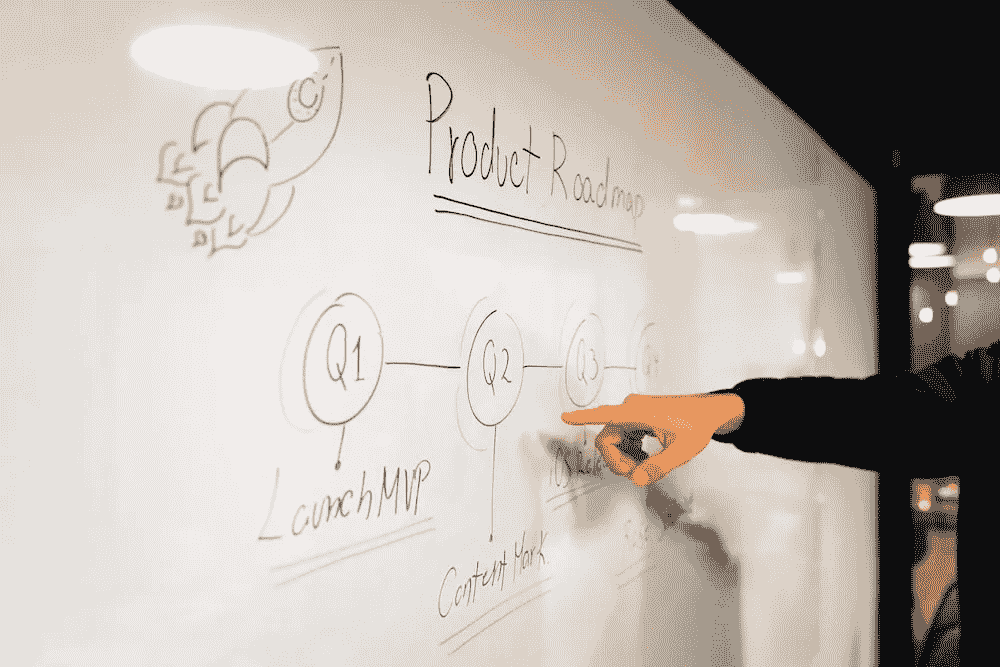

# 高级数据科学家的日常生活

> 原文：[`towardsdatascience.com/a-day-in-the-life-of-a-senior-data-scientist-e8b7a4866667?source=collection_archive---------3-----------------------#2023-02-14`](https://towardsdatascience.com/a-day-in-the-life-of-a-senior-data-scientist-e8b7a4866667?source=collection_archive---------3-----------------------#2023-02-14)

## 观点

## 包括常见的逐步项目概述

 [Matt Przybyla](https://datascience2.medium.com/?source=post_page-----e8b7a4866667--------------------------------)

·

[关注](https://medium.com/m/signin?actionUrl=https%3A%2F%2Fmedium.com%2F_%2Fsubscribe%2Fuser%2Fabe5272eafd9&operation=register&redirect=https%3A%2F%2Ftowardsdatascience.com%2Fa-day-in-the-life-of-a-senior-data-scientist-e8b7a4866667&user=Matt+Przybyla&userId=abe5272eafd9&source=post_page-abe5272eafd9----e8b7a4866667---------------------post_header-----------) 发表在 [Towards Data Science](https://towardsdatascience.com/?source=post_page-----e8b7a4866667--------------------------------) ·8 分钟阅读·2023 年 2 月 14 日

--

图片由 [Slidebean](https://unsplash.com/@slidebean?utm_source=unsplash&utm_medium=referral&utm_content=creditCopyText) 提供，来源于 [Unsplash](https://unsplash.com/photos/iW9oP7Ljkbg?utm_source=unsplash&utm_medium=referral&utm_content=creditCopyText) [1]。

# 目录

1.  介绍

1.  响应、规划和会议更新

1.  预期的数据科学工作

1.  总结与个人观点

1.  参考文献

# 介绍

> 目标读者：

*本文旨在为那些目前从事数据科学工作并希望成为高级数据科学家的读者提供指导。它还可以作为那些希望转行进入数据科学领域的人的工作示例。*

首先要明确的是，高级职位在不同公司中有所不同，所以请对这一天的工作情况持保留态度。对我来说，高级职位与非高级职位的主要区别在于，高级职位通常涉及更多跨团队和利益相关者的协作。你可能还会负责整个项目，类似于产品经理，不仅要提出解决方案，还要考虑为什么这样做及其影响，例如 KPI（*关键绩效指标*）。话虽如此……
