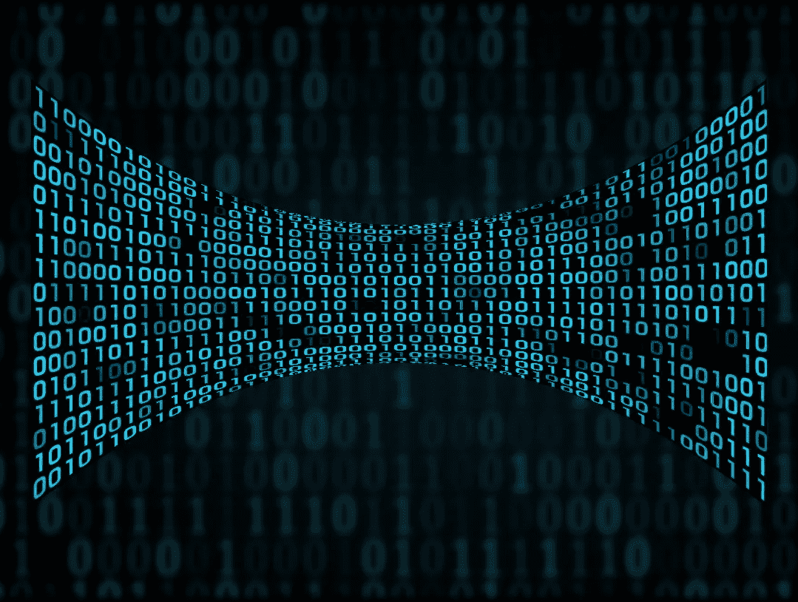

# 深入探讨自编码器及其与 PCA 和 SVD 的关系

> 原文：[`towardsdatascience.com/a-deep-dive-into-autoencoders-and-their-relationship-to-pca-and-svd-97e37c81898a?source=collection_archive---------3-----------------------#2023-06-13`](https://towardsdatascience.com/a-deep-dive-into-autoencoders-and-their-relationship-to-pca-and-svd-97e37c81898a?source=collection_archive---------3-----------------------#2023-06-13)

## 对自编码器和降维技术的深入探索

 [Reza Bagheri](https://reza-bagheri79.medium.com/?source=post_page-----97e37c81898a--------------------------------)

·

[关注](https://medium.com/m/signin?actionUrl=https%3A%2F%2Fmedium.com%2F_%2Fsubscribe%2Fuser%2Fda2d000eaa4d&operation=register&redirect=https%3A%2F%2Ftowardsdatascience.com%2Fa-deep-dive-into-autoencoders-and-their-relationship-to-pca-and-svd-97e37c81898a&user=Reza+Bagheri&userId=da2d000eaa4d&source=post_page-da2d000eaa4d----97e37c81898a---------------------post_header-----------) 发表在 [Towards Data Science](https://towardsdatascience.com/?source=post_page-----97e37c81898a--------------------------------) ·46 分钟阅读·2023 年 6 月 13 日

--

图片来源：作者

自编码器是一种神经网络，它学习重建其输入。它由一个编码器网络组成，将输入数据压缩到一个低维空间中，以及一个解码器网络，从该空间中重建输入数据。编码器和解码器被联合训练，以最小化输入数据与其重建之间的重建误差。

自编码器可以用于各种任务，如数据压缩、去噪、特征提取、异常检测和生成建模。它们在计算机视觉、自然语言处理和语音识别等领域有广泛的应用。自编码器还可以用于降维。实际上，自编码器的主要目的是学习输入数据的压缩表示，这可以作为一种降维形式。

在本文中，我们将探讨自编码器背后的基础数学，并了解它们如何进行降维。我们还将研究自编码器、主成分分析（PCA）和奇异值分解（SVD）之间的关系。我们还将展示如何实现线性和…
