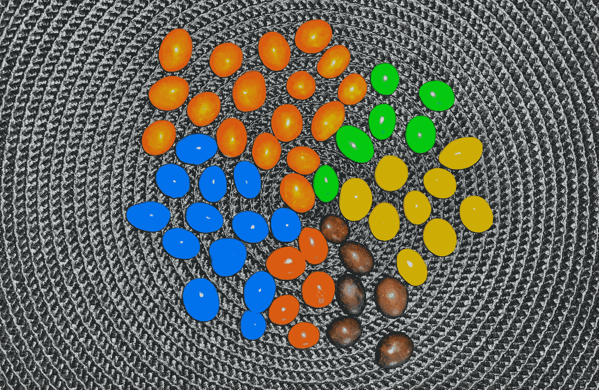
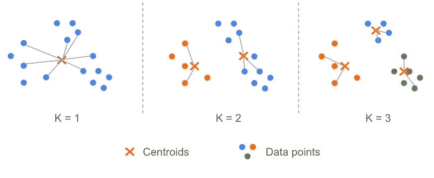
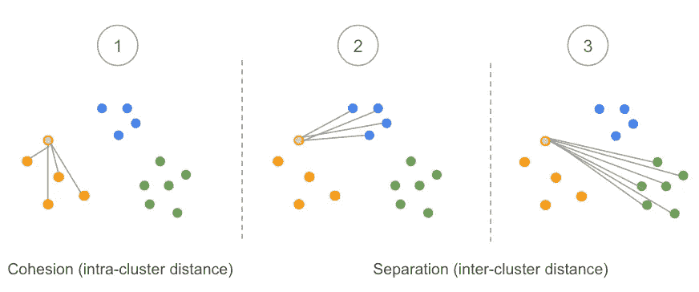
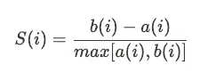
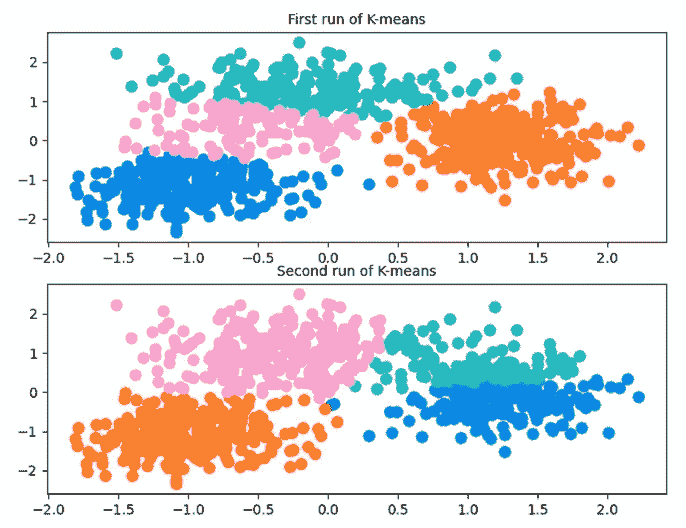
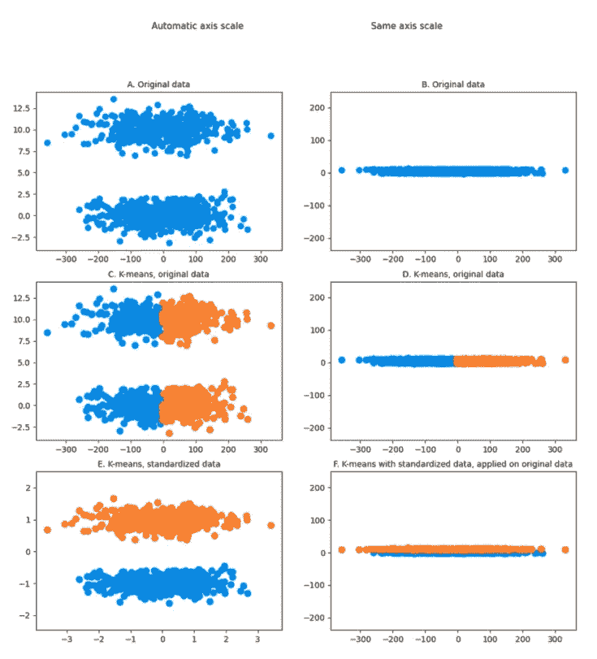
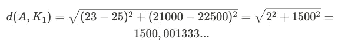
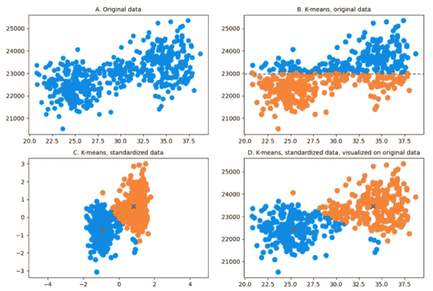

# 对 K-means 的深度解析，适合不太懂技术的读者

> 原文：[`towardsdatascience.com/a-deep-dive-into-k-means-for-the-less-technophile-eaea262bd51f?source=collection_archive---------16-----------------------#2023-01-24`](https://towardsdatascience.com/a-deep-dive-into-k-means-for-the-less-technophile-eaea262bd51f?source=collection_archive---------16-----------------------#2023-01-24)

## 从聚类到算法：五步之旅

 [Alexandre Allouin](https://medium.com/@alexandre.allouin?source=post_page-----eaea262bd51f--------------------------------)

·

[关注](https://medium.com/m/signin?actionUrl=https%3A%2F%2Fmedium.com%2F_%2Fsubscribe%2Fuser%2Fc5380bd2d1fe&operation=register&redirect=https%3A%2F%2Ftowardsdatascience.com%2Fa-deep-dive-into-k-means-for-the-less-technophile-eaea262bd51f&user=Alexandre+Allouin&userId=c5380bd2d1fe&source=post_page-c5380bd2d1fe----eaea262bd51f---------------------post_header-----------) 发布于 [Towards Data Science](https://towardsdatascience.com/?source=post_page-----eaea262bd51f--------------------------------) ·11 分钟阅读·2023 年 1 月 24 日

--

图片来自**Pauline Allouin**

虽然这篇文章比我之前的文章更为技术化——其中一篇是[如何成功地将技术语言翻译为管理层和用户的语言](https://medium.com/towards-data-science/pitching-your-data-strategy-translating-tech-talk-for-management-and-users-bbd044872ee4)——但它旨在用简单的语言解释数据科学中常用的一种算法。最近，我需要向一位好奇的非技术背景的高级经理解释什么是聚类。他理解了聚类的整个概念，并想进一步了解它如何被转化为算法。

本文的解释远远超出了简单的高级经理解释，但我认为我会分享这个有趣的经历；在这里，我尝试提供通常可以通过在线搜索找到的更多细节。因此，它可能为人们在首次实施 K-means 算法时提出的问题提供答案。此外，我不打算重复互联网上的许多资源，而是专注于其本质。在每段的末尾，我将突出可以传达给非技术观众的要点。

# 大致概况

聚类是一种将数据点集合按相似性分组（或簇）的技术。这种方法有许多应用，如行为分割、库存分类、健康监测中的群体识别、图像分组、异常检测等。它可以用来探索或扩展特定领域的知识，特别是当数据集过大而无法用传统工具分析时。

一个常见的例子是客户细分：基于不同因素（年龄、性别、收入等），你希望识别关键的档案/人物角色，以更好地定位你的营销活动，提高服务或收入。这篇[Franco 的帖子](https://francotisocco.medium.com/customer-segmentation-and-hypothesis-testing-b6dfedaaf5cd)提供了这种分析的具体和完整的应用。

K-means 就是这样的聚类算法之一（其他示例可以参考这篇[Indraneel 的帖子](https://link.medium.com/h3g8xiTzTwb)）。它是一种无监督机器学习算法。换句话说，该算法在没有人工干预的情况下发现数据中的模式。

> K-means 聚类是一种无监督学习算法，它将相似的数据点分组为不重叠的簇。尽管随着机器学习的兴起，它变得非常流行，但该算法实际上是由 Bell Labs 的 Stuart Lloyd 于 1957 年提出的。
> 
> K-means 最著名的应用包括客户细分、异常检测、文档分类等。

# K-means 算法概述

+   第一步：指定要使用的簇数（K）。

+   第二步：随机初始化（K）个质心。

+   第三步：对于每个数据点，计算它与每个质心的距离，并将数据点分配给离它最近的质心。

+   第四步：计算每个簇的新质心（即每个变量的均值）。

+   第五步：重复第三步，直到质心的位置不再变化（收敛）。

几个连续变量的质心可以看作是这些变量的均值，即表示簇中心的数据点。需要注意的是，质心的收敛并不保证，这在实施这种算法时应予以考虑。

当你第一次发现 K-means 算法时，可能会出现两个问题：

+   如何选择簇的数量（第一步）？

+   质心的随机初始化是否对结果有影响（步骤 2）？

这两个主题将在接下来的部分中讨论。

K-means 假设你知道你想用来划分数据集的簇的数量（K）。因此，K 的选择由运行算法的人决定。在众多可用的技术中，有两种主要的方法可以帮助你选择正确的 K 值。这两种方法在网上有广泛的描述。开始时，你可能对以下两篇 Medium 文章感兴趣：

+   K-means 聚类：算法、应用、评估方法及缺点

+   [如何确定 K-Means 的最优 K？](https://medium.com/analytics-vidhya/how-to-determine-the-optimal-k-for-k-means-708505d204eb)

再次，我不会过多关注公式或代码，而是专注于概念的解释。

> K-means 中的字母 K 代表算法将创建的簇的数量。这个簇的数量由分析师定义。K-means 通过测量数据点之间的距离来分配数据点到簇，并将最近的点分组在一起。

## 肘部法的原理

这是一种经验方法：主要思想是对可能范围内的 K 值（例如，从 1 到 10 个簇）运行 K-means 算法，并评估每种情况（K=1, K=2, …）中数据点与其关联质心（即每个簇）之间的距离。

对于每次运行 K-means 算法，我们实际上计算了每个点与其最近中心的平方距离之和，这让我们想起了方差的概念。这些量的总和称为 WCSS，即簇内平方和。

图片来自亚历山大·阿卢安

直观上，当簇的数量增加时，这个量会减少。确实，通过增加质心的数量，我们增加了数据点靠近质心的机会，从而减少了距离。该方法旨在找到一个点（肘部），在这个点上添加更多簇不会带来额外价值。

正如许多文章中所述的挑战是确定 K 簇的数量是否正确，因为我们不想得到太多的簇。因此，最佳选择可能有些任意。

**有时使用的术语：**

+   惯性：样本到其最近簇中心的平方距离之和（等同于 WCSS）。

+   失真：从各自簇的质心到数据点的欧几里得平方距离的平均值。

## 轮廓分析

轮廓值是衡量一个对象与其自身簇（凝聚度）相比与其他簇（分离度）相似程度的指标。[-维基百科](https://en.wikipedia.org/wiki/Silhouette_(clustering))

原则如下：如果簇的数量正确，则簇内每个数据点之间的平均距离（通常称为“平均簇内距离”）应小于与其他簇的其他数据点之间的平均距离（“平均簇间距离”）。

图片由 Alexandre Allouin 提供

该方法假设数据已经被聚类。换句话说，每个数据点已经被分配到一个簇。现在让我们关注一个给定的数据点（在上图中为浅橙色），以三个簇为例：

1.  我们计算该点与同一簇中所有其他数据点的平均距离。这通常记作 *a(i)*。

1.  我们计算相同点与其他簇所有数据点的平均距离。我们从蓝色簇开始。

1.  我们对绿色簇进行与步骤 2 相同的计算。

1.  我们比较步骤 2 和步骤 3 中获得的结果，并保留最小值，因为我们真正关心的是哪个簇靠近，而不是哪个簇远离。换句话说，我们对我们考虑的数据点的邻域感兴趣。我们将这个值表示为 *b(i)*。

1.  因此，给定数据点 *i* 的轮廓值 *S* 通过从 *a(i)* 中减去 *b(i)* 并将该数量除以 *a(i)* 和 *b(i)* 之间的最大值来获得。我尝试避免公式，但有时查看它们可能很有用：

因此，这个值总是介于 -1 和 1 之间。

***b(i)*** 和 ***a(i)*** 始终为正（距离的平均值），因此如果平均簇内距离 *a(i)* 大于平均簇间距离 *b(i)*，则 *S(i)* 将为负值。所考虑的数据点更接近另一个簇。在这种情况下，它似乎被错误分类了。

如果我们扩展这种推理，当 *b(i)* 相对于 *a(i)* 非常大时，*S(i)* 将接近 1：数据点被很好地分类了。

当 *S(i)* 约为零时，平均簇内距离大约等于平均簇间距离，将数据点分配到一个簇或另一个簇的选择并不明确。

## K 的最佳值选择

在给定簇中所有数据点的 *S(i)* 的平均值称为该簇的平均轮廓宽度 *S(K)*。对于每个模型（具有 2、3、4、…… K 个簇），我们可以计算 *S(K)* 的平均值——簇的平均轮廓宽度。这个量称为 *平均轮廓分数*。为了选择 K 的最佳值，获得的分数必须尽可能高。

两种方法，肘部法则和轮廓法，从不同的角度提供信息。它们通常结合使用，以增强 K 的选择。另一个盟友有时也可以支持决策：执行分析的人的领域知识！

> 虽然确定正确的聚类数量的决定最终取决于分析师，但存在不同的技术可以帮助分析师做出明智的决策。最受欢迎的方法是肘部法则和轮廓分析。

# 初始化质心

另一个可能引起你关注的算法方面是初始质心的随机选择。实际上，K-means 算法是非确定性的：算法可以根据其初始化产生不同的结果。下面是对同一数据集的两次不同算法运行的示例：

图片来源：Alexandre Allouin

这个示例的目的是仅仅为了说明 K-means 算法可能产生不同的结果。实际上，在这个特定的情况下，聚类的数量可能不合适。当 K-means 算法在这个数据集上多次运行，但只设置三个聚类时，结果始终是一致的。此外，作为最佳实践，建议多次运行 K-means 以查看提出的聚类的稳定性。

sklearn.cluster.KMeans 允许你选择初始化首个质心的方式。有两个选项：随机或 K-means++。K-means++ 是一种智能质心初始化技术，可以加速算法的收敛。其主要思想是选择尽可能远离的初始质心。

> K-means 算法可能导致不同的结果，这在聚类数量不正确或数据模式不明确时尤其如此。

# 需要记住的事项

## 特征缩放的重要性

[特征缩放](https://en.wikipedia.org/wiki/Feature_scaling) 对于 K-means 算法产生高质量结果至关重要。因为算法依赖于距离估计，特别是在计算质心时，不同的变量必须在相同的量级范围内。

下面是一个包含两个明显聚类的数据集示例（图表 A）。之所以明显，是因为自动缩放让你看到了这一点，但如果这个数据集在具有相同刻度的图表上进行可视化（图表 B），这对你或算法来说就不再可见了。

当你在这个未标准化的数据集上运行 K-means（图表 C 和图表 D）时，它变得更加有趣：创建了两个包含每个点云一半的聚类。这显然是你想要避免的结果！

最后，当数据集被标准化时（图表 E 和图表 F），尺度差异出现，K-means 能够识别出真实的聚类。

图片来源：Alexandre Allouin

更具体地说，假设你想根据年龄和年收入进行客户细分。你有一个包含 500 人的数据集，年龄在 20 到 40 岁之间，如下图所示。图表 A 代表了这个数据集（自动缩放），我们可以直观地想象出两个主要的簇。正如上面解释的那样，这些簇是可见的，因为两个维度的尺度不同，否则你将无法可视化。当 K-means 应用于原始数据时，算法将数据点水平地分成两组。原因是，在计算距离时，20 年的变化会与$20 的年收入变化进行比较。K-means 算法在步骤 3 中使用的欧几里得距离在一个可能的数据点 A（23, 21000）和一个假设的质心 K1（25, 22500）之间将是：

因此，年龄在计算距离时权重不大，因此，无论一个人是 20 岁还是 40 岁，影响都不显著。因此，K-means 主要根据年收入的均值来分割簇，因为这是唯一真正重要的维度。

然而，你希望你的算法能够检测到这个年龄变异，因为它在你的研究中是一个重要因素。图表 C 和图表 D 在数据标准化后运行 K-means 时提供了更好的簇。

图片来源：Alexandre Allouin

对这个例子的最后评论是，你可以看到一些数据点的分类可以更好一些。这是由于标准化效应，但也因为它们可能是离群点，而 K-means 在处理离群点时表现不佳。

## 对离群点的敏感性

由于算法最小化数据点和质心之间的距离，离群点会影响质心的位置，并可能改变簇的边界。然而，在运行 K-means 之前处理离群点可能具有挑战性，尤其是在大数据集上。虽然对 K-means 处理离群点的挑战做出了许多尝试，但似乎没有达成有效解决方案的真正共识。大多数时候，使用其他算法，如 K-medians、K-medoids 或 DBSCAN 更为优先。

## 类别数据

出于同样的原因，K-means 最小化数据点与其最近质心之间的距离，这使得 K-means 对类别数据不相关。即使你将类别编码为数字，两个类别之间的距离也没有意义：值之间没有自然顺序。应该优先使用其他算法。

## 数据模式

该算法的核心基于质心的概念，因此 K-means 在设计上总是尝试寻找球形簇。包含特定模式的数据集可能难以被该算法捕捉。像 DBSCAN 这样的算法更适合检测特殊数据形状的簇。一个示例可以在这里找到：DBSCAN 聚类处理 K-means 无法处理的数据形状。

> 由于 K-means 完全依赖于距离测量，该算法对异常值非常敏感：它们会改变簇的中心，从而影响数据点的分配。

# 管理者是否应该参与技术方面的考虑？

最近，在由[CERN IdeaSquare](https://www.linkedin.com/feed/update/urn:li:activity:7022250242473381888/)和[日内瓦创新运动协会](https://www.linkedin.com/posts/geneva-innovation-movement-association_geneva-activity-7021896676013428736-libf)组织的工作坊中，我们探索了在开发产品时如何调和高级经理与技术专家之间的沟通。

我们如何优化这种协作，以便更快、更好地交付解决方案？虽然活动很有趣（这也可以作为一个参数来考虑），但让双方坐到同一张桌子上共同工作似乎帮助很大。在数据科学的具体案例中，培养各利益相关者之间的数据文化无疑是正确的方向。

如前所述，我尝试过这种方法，并得到了来自一位高级经理的有趣反馈。你有兴趣吗？为什么不花 10 分钟与高级经理们开会，展示所选择的模型以及在调整某些参数时的表现呢？脚本可能过于粗糙，但使用低代码/无代码软件（如 Knime）可能会引发意想不到但有趣的结果。

# 致谢

+   真诚感谢[Sharon](https://www.linkedin.com/in/sharonroffey/)的校对、建议和持续支持。

+   特别感谢[Mathilde](https://www.linkedin.com/in/mathilde-allouin-bb8203263/)的有益评论和 Pauline 的艺术贡献！
