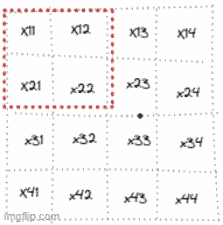
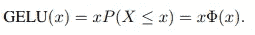
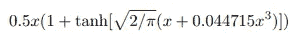
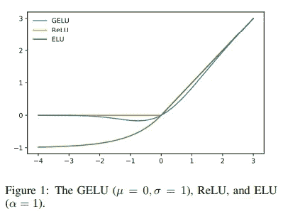

# 深入探讨 Visual Transformer (ViT) 模型的代码

> 原文：[`towardsdatascience.com/a-deep-dive-into-the-code-of-the-visual-transformer-vit-model-1ce4cc05ca8d`](https://towardsdatascience.com/a-deep-dive-into-the-code-of-the-visual-transformer-vit-model-1ce4cc05ca8d)

## 分析 HuggingFace ViT 实现

[](https://medium.com/@alexml0123?source=post_page-----1ce4cc05ca8d--------------------------------)[](https://towardsdatascience.com/?source=post_page-----1ce4cc05ca8d--------------------------------) [Alexey Kravets](https://medium.com/@alexml0123?source=post_page-----1ce4cc05ca8d--------------------------------)

·发表于 [Towards Data Science](https://towardsdatascience.com/?source=post_page-----1ce4cc05ca8d--------------------------------) ·14 分钟阅读·2023 年 8 月 15 日

--

Vision Transformer (ViT) 是计算机视觉演变中的一个显著里程碑。ViT 挑战了图像最好通过卷积层处理的传统观念，证明了基于序列的注意力机制可以有效地捕捉图像中的复杂模式、上下文和语义。通过将图像分解为可管理的补丁并利用自注意力机制，ViT 能够捕捉局部和全局关系，使其在图像分类、目标检测等多种视觉任务中表现出色。在本文中，我们将深入剖析 ViT 在分类任务中的工作原理。


[`unsplash.com/photos/aVvZJC0ynBQ`](https://unsplash.com/photos/aVvZJC0ynBQ)

# 介绍

ViT 的核心思想是将图像视为一系列固定大小的补丁，然后将这些补丁展平并转换为 1D 向量。这些补丁随后由一个 transformer 编码器处理，使得模型能够捕捉整个图像的全局上下文和依赖关系。通过将图像分割成补丁，ViT 有效地降低了处理大图像的计算复杂性，同时保持了建模复杂空间交互的能力。

首先，我们从 hugging face transformers 库中导入 ViT 分类模型：

```py
from transformers import ViTForImageClassification
import torch
import numpy as np

model = ViTForImageClassification.from_pretrained("google/vit-base-patch16-224")
```

*patch16–224* 表示模型接受大小为 224x224 的图像，并且每个补丁的宽度和高度为 16 像素。

这就是模型架构的样子：

```py
ViTForImageClassification(
  (vit): ViTModel(
    (embeddings): ViTEmbeddings(
      (patch_embeddings): PatchEmbeddings(
        (projection): Conv2d(3, 768, kernel_size=(16, 16), stride=(16, 16))
      )
      (dropout): Dropout(p=0.0, inplace=False)
    )
    (encoder): ViTEncoder(
      (layer): ModuleList(
        (0): ViTLayer(
          (attention): ViTAttention(
            (attention): ViTSelfAttention(
              (query): Linear(in_features=768, out_features=768, bias=True)
              (key): Linear(in_features=768, out_features=768, bias=True)
              (value): Linear(in_features=768, out_features=768, bias=True)
              (dropout): Dropout(p=0.0, inplace=False)
            )
            (output): ViTSelfOutput(
              (dense): Linear(in_features=768, out_features=768, bias=True)
              (dropout): Dropout(p=0.0, inplace=False)
            )
          )
          (intermediate): ViTIntermediate(
            (dense): Linear(in_features=768, out_features=3072, bias=True)
          )
          (output): ViTOutput(
            (dense): Linear(in_features=3072, out_features=768, bias=True)
            (dropout): Dropout(p=0.0, inplace=False)
          )
          (layernorm_before): LayerNorm((768,), eps=1e-12, elementwise_affine=True)
          (layernorm_after): LayerNorm((768,), eps=1e-12, elementwise_affine=True)
        )

        .......

        (11): ViTLayer(
          (attention): ViTAttention(
            (attention): ViTSelfAttention(
              (query): Linear(in_features=768, out_features=768, bias=True)
              (key): Linear(in_features=768, out_features=768, bias=True)
              (value): Linear(in_features=768, out_features=768, bias=True)
              (dropout): Dropout(p=0.0, inplace=False)
            )
            (output): ViTSelfOutput(
              (dense): Linear(in_features=768, out_features=768, bias=True)
              (dropout): Dropout(p=0.0, inplace=False)
            )
          )
          (intermediate): ViTIntermediate(
            (dense): Linear(in_features=768, out_features=3072, bias=True)
          )
          (output): ViTOutput(
            (dense): Linear(in_features=3072, out_features=768, bias=True)
            (dropout): Dropout(p=0.0, inplace=False)
          )
          (layernorm_before): LayerNorm((768,), eps=1e-12, elementwise_affine=True)
          (layernorm_after): LayerNorm((768,), eps=1e-12, elementwise_affine=True)
        )
      )
    )
    (layernorm): LayerNorm((768,), eps=1e-12, elementwise_affine=True)
  )
  (classifier): Linear(in_features=768, out_features=1000, bias=True)
)
```

# 嵌入

## 补丁嵌入

图像转换为补丁是通过 Conv2D 层完成的。如我们所知，Conv2D 层在输入数据上进行二维卷积操作，以从图像中学习特征和模式。然而，在这种情况下，Conv2D 层用于通过使用`stride`参数将图像分成 NxN 个补丁。步幅决定了滤波器在输入数据上滑动的步长。在这种情况下，因为我们的图像是 224x224，补丁大小为 16，意味着每个维度有 224/16 = 14 个补丁，如果我们选择`stride=16`，我们实际上将图像分为 14 个**不重叠**的补丁。

为了直观说明，假设图像的形状为 4x4，步幅为 2：



补丁创建，由作者提供的图像

例如，第一个和第二个补丁将是：

```py
proj = model.vit.embeddings.patch_embeddings.projection
torch.allclose(torch.sum(image[0, :, 0:16, 0:16] * w[0]) + b[0],
               proj(image)[0][0][0, 0], atol=1e-6)
# True

torch.allclose(torch.sum(image[0, :, 16:32, 0:16] * w[0]) + b[0],
                 proj(image)[0][0][1, 0], atol=1e-6)

# True
```

模式很明确——为了计算每个补丁，我们跳过 16 个像素以获取不重叠的补丁。如果我们对整个图像执行此操作，我们将得到一个 1 x 14 x 14 的张量，其中每个补丁由使用 Conv2D 的第一个滤波器计算得出。然而，有**768 个滤波器**，这意味着最后我们得到一个 768 x 14 x 14 维度的张量。所以现在我们实际上为每个补丁得到一个 768 维的表示，这就是我们的补丁嵌入。我们还对张量进行展平和转置，因此嵌入形状变为 *[batch_size, 196, 768]*，其中第二维展平为 14 x 14 = 196，我们实际上拥有一个 196 个补丁的序列，每个补丁的嵌入大小为 768。

```py
embeddings = model.vit.embeddings.patch_embeddings.projection(image)
# shape (batch_size, 196, 768)
embeddings = embeddings.flatten(2).transpose(1, 2)
```

如果我们想从头完全重现这一层，这是代码：

```py
 batch_size = 1 
F = 768 # number of filters
H1 = 14 # output dimension hight - 224/16
W1 = 14 # output dimension width - 224/16
stride = 16
HH = 16 # patch hight
WW = 16 # patch width
w = model.vit.embeddings.patch_embeddings.projection.weight
b = model.vit.embeddings.patch_embeddings.projection.bias

out = np.zeros((N, F, H1, W1))
chunks = []
for n in range(batch_size):
    for f in range(F):
        for i in range(H1):
            for j in range(W1):
                # perform convolution operation
                out[n, f, i, j] = torch.sum( image[n, :, i*stride:i*stride+HH, j*stride : j*stride + WW] * w[f] ) + b[f]

np.allclose(out[0], embeddings[0].detach().numpy(), atol=1e-5)
# True
```

现在，如果你对语言转换器 (如有需要请查看这里) 熟悉，你应该记得[CLS]标记，它的表示作为整个文本的浓缩和信息性摘要，使模型能够基于从转换器编码器中提取的特征做出准确的预测。在 ViT 中，[CLS]标记也具有与文本相同的功能，它被附加到上面计算的表示中。

[CLS]标记是一个我们将通过反向传播学习的参数：

```py
cls_token = nn.Parameter(torch.randn(1, 1, 768))
cls_tokens = cls_token.expand(batch_size, -1, -1)
# append [CLS] token
embeddings = torch.cat((cls_tokens, embeddings), dim=1)
```

## 位置嵌入

就像在语言转换器中一样，为了**保留补丁的位置信息**，ViT 包括位置嵌入。位置嵌入帮助模型理解不同补丁之间的空间关系，使其能够捕捉图像的结构。

位置嵌入是与之前计算的[CLS]标记形状相同的张量，即 *[batch_size, 197, 768]*。

```py
embeddings = embeddings + model.vit.embeddings.position_embeddings
```

## Dropout

补丁嵌入之后是一个 [Dropout](https://arxiv.org/abs/1706.06859) 层。在 dropout 中，我们以一定的 dropout 概率将一些值替换为零。Dropout 有助于减少过拟合，因为我们随机阻塞某些神经元的信号，使得网络需要找到其他路径来减少损失函数，从而学会更好地泛化，而不是依赖于某些特定路径。我们也可以将 dropout 看作是一种模型集成技术，因为在训练过程中，每一步我们随机停用某些神经元，最终得到“不同”的网络，这些网络在评估时被集成在一起。

在 Embeddings 层的末尾，我们有：

```py
# compute the embedding
embeddings = model.vit.embeddings.patch_embeddings.projection(image)
embeddings = embeddings.flatten(2).transpose(1, 2)
# append [CLS] token
cls_token = model.vit.embeddings.cls_token
embeddings = torch.cat((cls_tokens, embeddings), dim=1)
# positional embedding
embeddings = embeddings + self.position_embeddings
# droput
embeddings = model.vit.embeddings.dropout(embeddings) 
```

# 编码器

ViT 使用一系列的 Transformer 编码器块，类似于语言模型如 BERT 中使用的块。每个编码器块包括多头自注意力机制和前馈神经网络。自注意力机制使模型能够捕捉不同补丁之间的关系，而前馈神经网络则执行非线性变换。

具体而言，每一层由自注意力、中间和输出模块组成。

```py
(0): ViTLayer(
  (attention): ViTAttention(
    (attention): ViTSelfAttention(
      (query): Linear(in_features=768, out_features=768, bias=True)
      (key): Linear(in_features=768, out_features=768, bias=True)
      (value): Linear(in_features=768, out_features=768, bias=True)
      (dropout): Dropout(p=0.0, inplace=False)
    )
    (output): ViTSelfOutput(
      (dense): Linear(in_features=768, out_features=768, bias=True)
      (dropout): Dropout(p=0.0, inplace=False)
    )
  )
  (intermediate): ViTIntermediate(
    (dense): Linear(in_features=768, out_features=3072, bias=True)
  )
  (output): ViTOutput(
    (dense): Linear(in_features=3072, out_features=768, bias=True)
    (dropout): Dropout(p=0.0, inplace=False)
  )
  (layernorm_before): LayerNorm((768,), eps=1e-12, elementwise_affine=True)
  (layernorm_after): LayerNorm((768,), eps=1e-12, elementwise_affine=True)
)
```

## 自注意力

自注意力是 Vision Transformer (ViT) 模型中的一个关键机制，使其能够捕捉图像中不同补丁之间的关系和依赖性。它在提取上下文信息和理解补丁之间的长短程交互中发挥了重要作用。

每个补丁关联有三个向量：Key、Query 和 Value。这些向量是通过对原始补丁嵌入进行线性变换学习得到的。**Key 向量代表当前补丁的信息**，**Query 向量用于询问其他补丁**，而**Value 向量包含与其他补丁相关的信息**。

由于我们在前一部分已经计算了嵌入，我们通过使用 Key、Query 和 Value 矩阵对嵌入进行投影，来计算 Key、Query 和 Value：

```py
import math 
import torch.nn as nn

torch.manual_seed(0)

hidden_size = 768
num_attention_heads = 12
attention_head_size = hidden_size // num_attention_heads # 64

hidden_states = embeddings

# apply LayerNorm to the embeddings
hidden_states = model.vit.encoder.layer[0].layernorm_before(hidden_states)

# take first layer of the Transformer
layer_0 = model.vit.encoder.layer[0]

# shape (768, 64) 
key_matrix = layer_0.attention.attention.key.weight.T[:, :attention_head_size]
key_bias = layer_0.attention.attention.key.bias[:attention_head_size]

query_matrix = layer_0.attention.attention.query.weight.T[:, :attention_head_size] 
query_bias = layer_0.attention.attention.query.bias[:attention_head_size]

value_matrix = layer_0.attention.attention.value.weight.T[:, :attention_head_size]
value_bias = layer_0.attention.attention.value.bias[:attention_head_size]

# compute key, query and value for the first head attention
# all of shape (b_size, 197, 64)
key_1head = hidden_states @ key_matrix + key_bias
query_1head = hidden_states @ query_matrix + query_bias
value_1head = hidden_states @ value_matrix + value_bias
```

请注意，我们跳过了 LayerNorm 操作，稍后将介绍。

对于每个 Query 向量，通过测量 Query 向量和所有其他补丁的 Key 向量之间的兼容性或相似性来计算注意力分数。这是通过点积操作完成的，然后应用 Softmax 函数以获得形状为 *[b_size, 197, 197]* 的归一化注意力分数。注意力矩阵是方形的，因为所有补丁都相互关注，这就是为什么它被称为自注意力。这些分数表明在处理查询补丁时应给予每个补丁多少关注。由于每个补丁的下一层的新嵌入是基于注意力分数和所有其他补丁的值推导出来的，因此我们为每个补丁获得一个**上下文嵌入**，因为它是基于图像中的所有其他补丁推导的。

为了进一步澄清这一点，请回忆一下我们最开始用 Conv2D 层将图像拆分成补丁，以获得每个补丁的 768 维嵌入向量——这些嵌入是独立的，因为补丁之间没有交互（没有重叠）。然而，在 transformer 层中，补丁嵌入被混合，成为其他补丁嵌入的函数。例如，第一层的嵌入是：

```py
# shape (b_size, 197, 197)
# compute the attention scores by dot product of query and key
attention_scores_1head = torch.matmul(query_1head, key_1head.transpose(-1, -2))

attention_scores_1head = attention_scores_1head / math.sqrt(attention_head_size)
attention_probs_1head = nn.functional.softmax(attention_scores_1head, dim=-1)

# contextualized embedding for this layer
context_layer_1head = torch.matmul(attention_probs_1head, value_1head)
```

如果我们放大并查看第一个补丁：

```py
patch_n = 1
# shape (, 197)
print(attention_probs_1head[0, patch_n])
[2.4195e-01, 7.3293e-01, ..,
        2.6689e-06, 4.6498e-05, 1.1380e-04, 5.1591e-06, 2.1265e-05], 
```

对它的新嵌入（索引为 0 的是[CLS] token）是不同补丁的嵌入的组合，其中对第一个补丁本身（0.73）、[CLS] token（0.24）以及其他所有补丁的关注度最高。但情况并不总是如此。实际上，在后续层中，第一个补丁可能会更多地关注其周围的补丁，而不是自身和[CLS] token，甚至可能关注距离很远的补丁——这取决于模型认为对解决某个任务有用的东西。

此外，你可能已经注意到，我只选择了查询、键和值权重矩阵中的前 64 列。这 64 列代表了**第一个注意力头**，但实际上（在这个模型大小下）有 12 个注意力头。每个注意力头对补丁的表示都会有所不同。实际上，如果我们查看第一个补丁的第三个注意力头，可以看到第一个补丁对第二个补丁的关注度最高（0.26），而不是像第一个注意力头那样对自己。

```py
# shape (, 197)
[2.6356e-01, 1.2783e-03, 2.6888e-01, ... , 1.8458e-02]
```

因此，不同的注意力头将捕捉到补丁之间不同类型的关系，帮助模型从不同的角度观察事物。

为了并行计算所有这些注意力头，我们进行如下操作：

```py
def transpose_for_scores(x: torch.Tensor) -> torch.Tensor:
    new_x_shape = x.size()[:-1] + (num_attention_heads, attention_head_size)
    x = x.view(new_x_shape)
    return x.permute(0, 2, 1, 3)

mixed_query_layer = layer_0.attention.attention.query(hidden_states)

key_layer = transpose_for_scores(layer_0.attention.attention.key(hidden_states))
value_layer = transpose_for_scores(layer_0.attention.attention.value(hidden_states))
query_layer = transpose_for_scores(mixed_query_layer)

# Take the dot product between "query" and "key" to get the raw attention scores.
attention_scores = torch.matmul(query_layer, key_layer.transpose(-1, -2))
attention_scores = attention_scores / math.sqrt(attention_head_size)

# Normalize the attention scores to probabilities.
attention_probs = nn.functional.softmax(attention_scores, dim=-1)

# This is actually dropping out entire tokens to attend to, which might
# seem a bit unusual, but is taken from the original Transformer paper.
attention_probs = layer_0.attention.attention.dropout(attention_probs)

context_layer = torch.matmul(attention_probs, value_layer)

context_layer = context_layer.permute(0, 2, 1, 3).contiguous()
new_context_layer_shape = context_layer.size()[:-2] + (hidden_size,)
context_layer = context_layer.view(new_context_layer_shape)
```

在应用自注意力后，我们应用另一个投影层和 Dropout——这样我们就完成了自注意力层的处理！

```py
output_weight = layer_0.attention.output.dense.weight
output_bias = layer_0.attention.output.dense.bias

attention_output = context_layer @ output_weight.T + output_bias
attention_output = layer_0.attention.output.dropout(attention_output)
```

哎，等一下，我答应过要解释*LayerNorm*操作。

层归一化是一种用于提升深度学习模型训练和性能的规范化技术。它解决了内部协变量偏移的问题——在训练过程中，由于神经网络的权重变化，每层的输入分布可能会显著改变，从而使模型难以收敛。层归一化通过确保每层的输入具有一致的均值和方差来解决这个问题，从而稳定学习过程。它的实现方法是通过其均值和标准差对每个补丁嵌入进行标准化，使其均值为零，方差为一。然后应用训练的权重和偏差，使其可以被移动到具有不同的均值和方差，以便模型在训练过程中自动适应。由于我们在不同示例之间独立计算均值和标准差，因此它与[批量归一化](https://en.wikipedia.org/wiki/Batch_normalization#:~:text=Batch%20normalization%20(also%20known%20as,and%20Christian%20Szegedy%20in%202015.)不同，后者是在批量维度上进行归一化，因此依赖于批量中的其他示例。

让我们来看第一个补丁嵌入：

```py
first_patch_embed = embeddings[0][0]
# compute first patch mean
first_patch_mean = first_patch_embed.mean()
# compute first patch variance
first_patch_std = (first_patch_embed - first_patch_mean).pow(2).mean()
# standardize the first patch
first_patch_standardized = (first_patch_embed - first_patch_mean) / torch.sqrt(first_patch_std + 1e-12)
# apply trained weight and bias vectors
first_patch_norm = layer_0.layernorm_before.weight * first_patch_standardized + layer_0.layernorm_before.bias
```

## 中级

在中级课程之前，我们执行另一个层归一化和一个**残差连接**。到现在为止，应该清楚为什么我们需要应用另一个层归一化——我们需要规范化来自自注意力的上下文嵌入以提高收敛性，但你可能会想，我提到的那个其他的残差东西是什么？

残差连接是深度神经网络中的一个关键组件，可以缓解训练非常深的架构的挑战。随着我们通过堆叠更多层来增加神经网络的深度，我们会遇到梯度消失/爆炸的问题，在梯度消失的情况下，模型无法再学习，因为传播的梯度接近零，初始层停止变化权重和改进（如果你想了解更多关于梯度消失的问题，可以查看[这篇文章](https://medium.com/towards-artificial-intelligence/backpropagation-and-vanishing-gradient-problem-in-rnn-clearly-explained-efce8824971b)和[这篇](https://medium.com/towards-artificial-intelligence/backpropagation-and-vanishing-gradient-problem-in-rnn-part-2-4fa4c0e27b54)）。相反，梯度爆炸的问题发生在权重无法因极端更新而稳定，最终爆炸（趋于无穷大）。现在，适当的权重初始化和规范化有助于解决这个问题，但观察到的是，即使网络变得更加稳定，性能也会下降，因为优化变得更加困难。添加这些残差连接有助于提高性能，即使我们继续增加深度，网络也更容易优化。

它是如何实现的？很简单——我们只是将原始输入添加到经过一些变换后的变换输出中。

```py
transformations = nn.Sequential([nn.Linear(), nn.ReLU(), nn.Linear()])
output = input + transformations(input)
```

另一个关键见解是，如果残差连接的 *变换* 学会了逼近恒等函数，那么输入与学习到的特征的加法将没有任何效果。实际上，网络可以在需要时学习修改或细化特征。

在我们的案例中，残差连接是初始 *嵌入* 与 *attention_output* 之间的和，这些是经过 *self-attention* 层所有变换后的 *嵌入*。

```py
# first residual connection - NOTE the hidden_states are the 
# `embeddings` here
hidden_states = attention_output + hidden_states

# in ViT, layernorm is also applied after self-attention
layer_output = layer_0.layernorm_after(hidden_states)
```

在 Intermediate 类中，我们执行线性投影并应用 **非线性**：

```py
layer_output_intermediate = layer_0.intermediate.dense(layer_output)
layer_output_intermediate = layer_0.intermediate.intermediate_act_fn(layer_output_intermediate)
```

ViT 中使用的非线性是 GeLU 激活函数。它被定义为标准正态分布的累积分布函数：



[`arxiv.org/pdf/1606.08415v3.pdf`](https://arxiv.org/pdf/1606.08415v3.pdf)

通常，它用以下公式进行逼近以加快计算：



[`arxiv.org/pdf/1606.08415v3.pdf`](https://arxiv.org/pdf/1606.08415v3.pdf)

从下面的图表可以看出，*ReLU* 函数，由公式 *max(input, 0)* 给出，在正域内是单调的、凸的和线性的，而 *GeLU* 在正域内是非单调的、非凸的和非线性的，因此可以更容易地逼近复杂的函数。

此外，*GeLU* 函数是平滑的——与 *ReLU* 函数不同，后者在零点有一个急剧的过渡，*GeLU* 在所有值之间提供了平滑的过渡，使其在训练过程中更适合基于梯度的优化。



[`arxiv.org/pdf/1606.08415v3.pdf`](https://arxiv.org/pdf/1606.08415v3.pdf)

## 输出

编码器的最后一个部分是 Output 类。为了计算它，我们已经拥有了所有需要的元素——它是线性投影、Dropout 和残差连接：

```py
# linear projection
output_dense = layer_0.output.dense(layer_output_intermediate)
# dropout
output_drop = layer_0.output.dropout(output_dense)
# residual connection - NOTE these hidden_states are computed in 
# Intermediate 
output_res = output_drop + hidden_states # shape (b_size, 197, 768)
```

好吧，我们已经完成了第一个 ViT 层，还有其他 11 层要处理，这就是困难的部分……

开玩笑！我们实际上完成了——所有其他层与第一层完全相同，唯一的区别是，下一层的嵌入是之前计算的 *output_res*。

因此，编码器经过 12 层后的输出是：

```py
torch.manual_seed(0)
# masking heads in a given layer
layer_head_mask = None
# output attention probabilities
output_attentions = False

embeddings = model.vit.embeddings(image)
hidden_states = embeddings
for l in range(12):
    hidden_states = model.vit.encoder.layerl[0]

output = model.vit.layernorm(sequence_output)
```

# Pooler

通常，在 Transformer 模型中，Pooler 是一个用于聚合在 transformer 编码器块之后的序列中的 token 嵌入信息的组件。它的作用是生成一个固定大小的表示，该表示捕获了全局上下文并总结了从图像块中提取的信息，在 ViT 的情况下尤为重要。Pooler 对于获得紧凑且具有上下文感知的图像表示至关重要，这可以用于各种下游任务，如图像分类。

在这种情况下，Pooler 非常简单——我们取[CLS]标记并将其用作图像的紧凑且上下文感知的表示。

```py
pooled_output = output[:, 0, :] # shape (b_size, 768)
```

# 分类器

最后，我们准备使用*pooled_output*来对图像进行分类。分类器是一个简单的线性层，输出维度等于类别数：

```py
logits = model.classifier(pooled_output) # shape (b_size, num_classes)
```

# 结论

ViT 彻底革新了计算机视觉，几乎在所有应用中取代了卷积神经网络，这就是为什么理解它的工作原理如此重要。不要忘记，ViT 的主要组件——变换器架构，源于自然语言处理，因此你应该查看我之前关于 BERT 变换器的文章 [这里](https://medium.com/p/9f618472353e)。希望你喜欢这篇文章，下次见！

[](https://medium.com/@alexml0123/membership?source=post_page-----1ce4cc05ca8d--------------------------------) [## 通过我的推荐链接加入 Medium - Alexey Kravets

### 作为 Medium 会员，你的会员费用的一部分将分配给你阅读的作者，你可以完全访问每个故事…

medium.com](https://medium.com/@alexml0123/membership?source=post_page-----1ce4cc05ca8d--------------------------------)

## 参考文献

[1] [`github.com/huggingface/transformers`](https://github.com/huggingface/transformers)

[2] [[2010.11929] 一张图胜过 16x16 个词：用于大规模图像识别的变换器（arxiv.org）](https://arxiv.org/abs/2010.11929)
