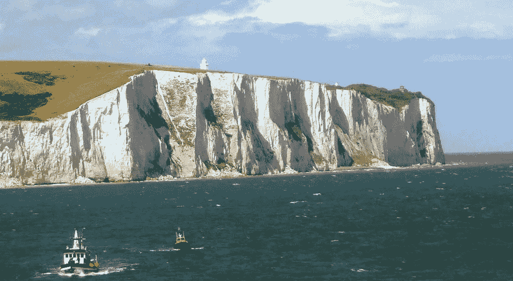

# 对统计期望科学的深度探索

> 原文：[`towardsdatascience.com/a-deep-dive-into-the-science-of-statistical-expectation-9dc0f80bd26?source=collection_archive---------1-----------------------#2023-06-17`](https://towardsdatascience.com/a-deep-dive-into-the-science-of-statistical-expectation-9dc0f80bd26?source=collection_archive---------1-----------------------#2023-06-17)

[多佛白崖](https://commons.wikimedia.org/wiki/File:White_Cliffs_of_Dover_02.JPG) ([CC BY-SA 3.0](https://creativecommons.org/licenses/by-sa/3.0/deed.en))

## 我们如何形成期望，期望任何事物意味着什么，以及数学如何产生这种意义。

 [Sachin Date](https://timeseriesreasoning.medium.com/?source=post_page-----9dc0f80bd26--------------------------------)

·

[关注](https://medium.com/m/signin?actionUrl=https%3A%2F%2Fmedium.com%2F_%2Fsubscribe%2Fuser%2Fb75b5b1730f3&operation=register&redirect=https%3A%2F%2Ftowardsdatascience.com%2Fa-deep-dive-into-the-science-of-statistical-expectation-9dc0f80bd26&user=Sachin+Date&userId=b75b5b1730f3&source=post_page-b75b5b1730f3----9dc0f80bd26---------------------post_header-----------) 发表在 [Towards Data Science](https://towardsdatascience.com/?source=post_page-----9dc0f80bd26--------------------------------) ·29 分钟阅读·2023 年 6 月 17 日

--

1988 年夏天，我第一次踏上了船。这是一艘从英国多佛到法国加来之间的渡轮。当时我并不知道，我正赶上渡轮黄金时代的尾声。就在这之前，廉价航空公司和英吉利海峡隧道[几乎终结了](https://journals.openedition.org/rhcf/2452)我仍然认为的最好的旅行方式。

我期待渡轮看起来像我在儿童书籍中看到的那些许多船中的一种。相反，我看到的是一个巨大得不可能的、闪闪发光的白色摩天大楼，配有小方窗。而且，这座摩天大楼似乎因某种令人困惑的原因侧躺着。从我在码头的观察角度，我看不到船的船体和烟囱。我看到的只是它长长的、平坦的、有窗户的外表。我在看一个横向的摩天大楼。

图片来源：[Martin](https://unsplash.com/es/@martinostsee?utm_source=medium&utm_medium=referral) 在 [Unsplash](https://unsplash.com/?utm_source=medium&utm_medium=referral)

回想起来，用统计学的语言重新审视我的经历非常有趣。我的大脑已经计算出了**渡轮的预期形状**……
