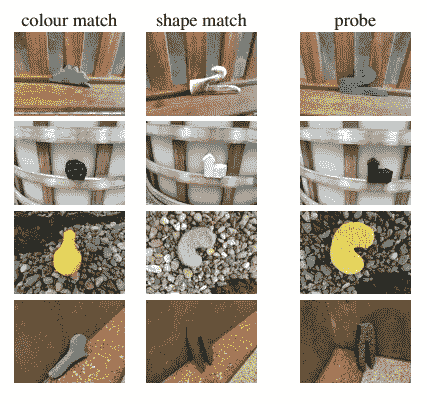

# 归纳偏差的一个童话故事

> 原文：[`towardsdatascience.com/a-fairy-tale-of-the-inductive-bias-d418fc61726c`](https://towardsdatascience.com/a-fairy-tale-of-the-inductive-bias-d418fc61726c)

## |归纳偏差| 变换器| 计算机视觉|

## 我们需要归纳偏差吗？简单模型如何达到复杂模型的性能

 [Salvatore Raieli](https://salvatore-raieli.medium.com/?source=post_page-----d418fc61726c--------------------------------)

·发布于 [Towards Data Science](https://towardsdatascience.com/?source=post_page-----d418fc61726c--------------------------------) ·18 分钟阅读·2023 年 7 月 10 日

--

图片由 [Natalia Y.](https://unsplash.com/@foxfox?utm_source=medium&utm_medium=referral) 提供，[Unsplash](https://unsplash.com/?utm_source=medium&utm_medium=referral)

正如我们近年来所见，深度学习在使用量和模型数量上都经历了指数级增长。这一成功的铺路石或许就是 [迁移学习](https://en.wikipedia.org/wiki/Transfer_learning) 本身——即一个模型可以通过大量数据进行训练，然后用于各种具体任务的理念。

近年来，出现了一种范式：[变换器](https://en.wikipedia.org/wiki/Transformer_(machine_learning_model))（或基于此模型的其他变体）被用于 NLP 应用。而在图像领域，则使用 [视觉变换器](https://en.wikipedia.org/wiki/Vision_transformer) 或 [卷积网络](https://en.wikipedia.org/wiki/Convolutional_neural_network)。

 ## LLMs 的无限巴别图书馆

### 开源、数据与注意力：LLMs 的未来将如何改变

towardsdatascience.com  ## META 的 Hiera：减少复杂性以提高准确性

### 简单性使 AI 能够达到惊人的性能和令人惊讶的速度

towardsdatascience.com

另一方面，虽然我们有大量实践工作证明这些模型效果良好，但理论上的理解却滞后。这是因为这些模型非常广泛，实验起来很困难。[视觉变换器](https://en.wikipedia.org/wiki/Vision_transformer)的表现优于卷积神经网络，因为它们在视觉上具有理论上更少的归纳偏差，这表明存在一个需要填补的理论空白。

本文重点讨论：

+   归纳偏差究竟是什么？为什么这很重要，我们最喜欢的模型有什么归纳偏差？

+   变换器和 CNN 的归纳偏差。这两种模型之间有什么区别，为什么这些讨论很重要？

+   我们如何研究归纳偏差？如何利用不同模型之间的相似性来捕捉它们的差异。

+   具有弱归纳偏差的模型能否在计算机视觉领域取得成功？这是一个传统上被认为归纳偏差很重要的领域。

# 什么是归纳偏差？

照片由[Raphael Schaller](https://unsplash.com/@raphaelphotoch?utm_source=medium&utm_medium=referral)提供，拍摄于[Unsplash](https://unsplash.com/?utm_source=medium&utm_medium=referral)

> 学习是通过观察和与世界互动来获取有用知识的过程。它涉及在解决方案空间中搜索，以找到一个能够更好地解释数据或获得更高奖励的解决方案。但在许多情况下，存在多个同样好的解决方案。 ([source](https://en.wikipedia.org/wiki/Fact,_Fiction,_and_Forecast))

想象一下在湖中遇到一只天鹅。从这只简单的天鹅，我们可能会假设所有的天鹅都是白色的（直到我们看到一只[黑天鹅](https://en.wikipedia.org/wiki/Black_swan_theory)），它们是水禽，它们以鱼为食，等等。

这个过程被称为[归纳推理](https://en.wikipedia.org/wiki/Inductive_reasoning)。从一个简单的观察中，我们可能能够推导出成千上万（甚至数十亿）个假设，显然，所有的假设并不都是真实的。实际上，我们可能会认为天鹅无法飞行，因为我们当时只观察到它在游泳。

显然，没有直接观察很难决定哪个假设是正确的。所以根据[奥卡姆剃刀原则](https://en.wikipedia.org/wiki/Occam%27s_razor)，我们可以说“天鹅可以在湖中游泳”。

> 为什么这对机器学习很重要？

数据集是观察结果的集合，我们想要创建一个可以从这些观察结果中[泛化](https://developers.google.com/machine-learning/crash-course/generalization/video-lecture)的模型。其理念是，从我们的数据集中，我们可以推断出一些对总体人群也适用的规则。换句话说，我们可以将我们的模型视为一组假设。

理论上，假设空间是无限的。实际上，如果我们考虑[**笛卡尔空间**](https://en.wikipedia.org/wiki/Cartesian_coordinate_system)中的两个点，它可以通过一条直线但无限多的曲线。在没有更多点的情况下，我们无法知道哪种假设是最正确的。

通常，最简单的假设是最正确的。一个完美拟合点的曲线通常是[**过拟合**](https://en.wikipedia.org/wiki/Overfitting)。

图片来自[这里](https://en.wikipedia.org/wiki/Overfitting)

归纳偏差可以定义为对某些假设的优先考虑（从而减少假设空间）。例如，当我们面对一个[**回归任务**](https://en.wikipedia.org/wiki/Regression_analysis)时，我们决定考虑线性模型，这时我们通过使假设仅限于线性模型来减少我们的假设空间。

线性回归。图片来源：[这里](https://en.wikipedia.org/wiki/Linear_regression)

> 归纳偏差使得学习算法可以在观察到的数据之外优先考虑一种解决方案（或解释）而非另一种，[**来源**](https://arxiv.org/pdf/1806.01261.pdf)

一方面，我们有不同类型的数据，以及具有不同假设和不同归纳偏差的不同类型模型（即，[**假设空间**](https://stats.stackexchange.com/questions/183989/what-exactly-is-a-hypothesis-space-in-machine-learning)的不同简化）。因此，人们可能会倾向于为所有类型的数据选择一个模型。

然而在 1997 年，[**无免费午餐定理**](https://en.wikipedia.org/wiki/No_free_lunch_theorem)结束了这种诱惑。没有一个模型可以适用于所有情况。实际上，没有一种最优的偏差可以使模型对所有任务进行泛化。换句话说，一个任务的最优假设可能对另一个任务并不最优。

这就是我们为什么对图像使用卷积神经网络，对文本序列使用 RNN（或 LSTM）等的原因。

为了更好地理解，以下是一些归纳偏差的例子：

+   [**决策树**](https://en.wikipedia.org/wiki/Decision_tree)基于这样的假设：一个任务可以通过一系列的二元决策（二元拆分）来解决。

+   [**正则化**](https://en.wikipedia.org/wiki/Regularization_(mathematics))的假设是指向参数具有小值的解决方案。

+   [**全连接层**](https://www.oreilly.com/library/view/tensorflow-for-deep/9781491980446/ch04.html)是一种全对全的偏差，其中层 i 的所有单元都与下一层 j 相连（一个层中的所有神经元都与下一层相连）。这意味着存在一种非常弱的关系偏差，因为任何单元都可以与其他单元进行交互。

+   [**卷积神经网络**](https://en.wikipedia.org/wiki/Convolutional_neural_network)基于局部性的理念，即特征通过局部像素提取，并以层次化模式组合。在另一种世界观中，我们假设相邻的像素实际上是相关的，这种关系应当被模型考虑（在卷积步骤中）。

+   [**递归神经网络**](https://en.wikipedia.org/wiki/Recurrent_neural_network)具有与序列性相关的偏差，因为每个词是按顺序处理的。由于权重在序列的所有元素中被重用（我们更新隐藏状态），因此还存在时间等变性（或递归性）。

+   [**变换器**](https://en.wikipedia.org/wiki/Transformer_(machine_learning_model))**。** 它没有强的归纳偏差，这应当提供更多的灵活性（但需要大量的训练数据）。实际上，在数据较少的情况下，该模型的表现往往不如其他模型。

图片来源: [这里](https://arxiv.org/pdf/1806.01261.pdf)

# **CNN 和变换器的归纳偏差**

图片由[Tudose Alexandru](https://unsplash.com/de/@pandatudii?utm_source=medium&utm_medium=referral)拍摄，发布于[Unsplash](https://unsplash.com/?utm_source=medium&utm_medium=referral)

[卷积神经网络](https://en.wikipedia.org/wiki/Convolutional_neural_network)长期以来主导了计算机视觉领域，直到[视觉变换器](https://en.wikipedia.org/wiki/Vision_transformer)的出现。正如我们前面提到的，CNN 基于相邻像素之间存在关系的原理。因此，在[卷积](https://en.wikipedia.org/wiki/Convolution)过程中，几个像素共享相同的权重。

此外，[池化层](https://www.geeksforgeeks.org/cnn-introduction-to-pooling-layer/)的使用旨在实现[平移不变性](https://stats.stackexchange.com/questions/208936/what-is-translation-invariance-in-computer-vision-and-convolutional-neural-netwo)。这意味着，无论模式出现在图像的何处（例如，图像的左角或右角），它都会被识别。

> 这些偏差对于处理自然图像数据非常有效，因为局部邻域内具有较高的协方差，而随着距离的增加，这种协方差会减小，并且统计特性在整张图像上大致是稳定的。（[来源](https://arxiv.org/abs/1806.01261)）

这些偏差实际上受到了[下颞皮层](https://www.ncbi.nlm.nih.gov/pmc/articles/PMC6404234/)的启发，该区域似乎提供了对应的生物学基础，用于尺度、平移和旋转不变性。这些偏差被认为对 CNN 在面对图像平移、缩放或其他变形时的鲁棒性很重要，因此通过卷积和池化加以应用。

图片来源：[这里](https://arxiv.org/abs/1801.01450)

另一方面，图像是复杂且信息丰富的对象。鉴于其用途，尝试更详细地理解[CNN](https://en.wikipedia.org/wiki/Convolutional_neural_network)所看到的内容以及存在的其他偏差。

[在 2017 年的一项研究中](https://arxiv.org/pdf/1706.08606.pdf)，作者展示了[Inception 模型](https://www.geeksforgeeks.org/ml-inception-network-v1/)（一种 CNN）的“形状偏差”很强。换句话说，CNN 在识别对象时更依赖于对象的形状而非其他类型的模式。作者使用了一个图像三联体来分类一个对象，并使用了颜色相同但形状不同（颜色匹配）或形状相同但颜色不同（形状匹配）的图像来研究模式是否更注重形状或颜色。

图片来源：[这里](https://arxiv.org/abs/1706.08606)

[在一项后续研究中](https://arxiv.org/pdf/1811.12231.pdf)，一些作者则展示了，模型更关注的是纹理而非颜色。作者使用了 ResNet50 来测试这一假设。

图片来源：[这里](https://arxiv.org/abs/1811.12231)

他们展示了在纹理与形状冲突的情况下，模型倾向于使用纹理。因此，对作者来说，CNN 具有强烈的“纹理偏差”。

图片来源：[这里](https://arxiv.org/abs/1811.12231)

然而，作者总结道，具有形状偏差的模型更具鲁棒性：

> 值得注意的是，具有较高形状偏差的网络在对许多不同图像扭曲的鲁棒性上天生更强（对于一些甚至达到了或超过了人类表现，尽管从未接受过这些扭曲的训练），并在分类和物体识别任务中表现更好。 ([这里](https://arxiv.org/pdf/1811.12231.pdf))

实际上，对于图像来说，具有形状偏差是理想的。这可以通过使用适当的数据集或[使用数据增强技术](https://arxiv.org/pdf/1911.09071.pdf)来实现，这些技术包括颜色失真、噪声和模糊（这些恰好减少了纹理偏差）。相反，随机裁剪会增加纹理偏差。

图片来源：[这里](https://arxiv.org/abs/1911.09071)

具体来说，我们可以说偏差不仅依赖于[卷积神经网络（CNN）](https://en.wikipedia.org/wiki/Convolutional_neural_network)的架构，还依赖于训练时使用的数据集。根据数据集的不同，CNN 会倾向于形状或纹理。

[一项研究的作者](https://arxiv.org/abs/2010.05981) 表示，这些偏差是互补的。模型可以专注于纹理或形状进行预测。然而，有时，仅这两种元素中的一种不足以进行正确预测（降低了性能）。作者表示，由于模型可以学习任一偏差，它还可以“*自动找出如何避免对形状或纹理有偏见。*”换句话说，使用具有冲突的（纹理和形状）示例可以指导模型避免偏见。

图像来源：[这里](https://arxiv.org/pdf/2010.05981.pdf)

[视觉变换器](https://en.wikipedia.org/wiki/Vision_transformer) 来源于变换器，正如前面提到的，它是一个没有强偏差的模型。

一些研究表明，[CNNs](https://en.wikipedia.org/wiki/Convolutional_neural_network) 和 ViTs 之间仍有几个相似之处。实际上，ViTs 也学习了层级视图，并且可以被可视化。

图像：[来源](https://arxiv.org/pdf/2212.06727.pdf)

 [## 视觉变换器所见的视觉之旅

### 一些最大的模型如何看待世界

[pub.towardsai.net](https://pub.towardsai.net/a-visual-journey-in-what-vision-transformers-see-9db9c8ba62d4?source=post_page-----d418fc61726c--------------------------------)

然而，后来的研究表明，[ViTs](https://en.wikipedia.org/wiki/Vision_transformer) 实际上具有比 [CNNs](https://en.wikipedia.org/wiki/Convolutional_neural_network) 更高的形状偏差。这实际上令人惊讶。此外，作者指出这种形状偏差在图像损坏的鲁棒性方面发挥了积极作用：

> […] 强调了形状偏差与均值损坏误差之间的一般性反向关系。模型对常见损坏的鲁棒性越高（即更小的 mCE），其形状偏差就越大。([来源](https://arxiv.org/abs/2106.13122))

视觉变换器的形状偏差。图像来源：[这里](https://arxiv.org/abs/2106.13122)

几个研究小组假设，通过添加适当的归纳偏差，可能使 ViTs 即使不使用数百万张图像进行训练也能超越 CNNs。另一方面，这一假设导致了大量模型的创建但使训练极其低效。

所以问题仍然存在：

> 参数和训练样本数量的扩展能在多大程度上弥补缺乏归纳偏差的问题？

# 如何研究归纳偏差？

照片由[Aaron Burden](https://unsplash.com/@aaronburden?utm_source=medium&utm_medium=referral)拍摄，来自[Unsplash](https://unsplash.com/?utm_source=medium&utm_medium=referral)

正如我们所见，仍然存在几个未解的问题。尽管有大量关于[CNNs](https://en.wikipedia.org/wiki/Convolutional_neural_network)和[ViTs](https://en.wikipedia.org/wiki/Vision_transformer)的研究，但这些性能提升背后的许多理论背景仍然不清楚。

> “MLP 是这些神经网络架构中最简单的一种，依赖于这种堆叠思想，因此提供了一个有效深度学习理论的最简模型。” ([source](https://arxiv.org/abs/2106.10165))

通常，许多关于更理论方面的研究都是使用[多层感知器](https://en.wikipedia.org/wiki/Multilayer_perceptron)（MLP）进行的。这是因为它是由简单的矩阵乘法组成的层，封装在一个非线性函数中。其简单性允许在较低的计算成本下进行许多实验。然后对更简单模型进行的研究被转化为更复杂和精细的模型。然而，MLP 在许多情况下性能较差，这留给我们的是，如何将观察到的内容转移到具有远超性能的模型中。

另一方面，MLP 还有一个优势，即其具有较弱的归纳偏差。这使得它成为 ViT 研究的一个良好候选模型。还有一个衍生模型，归纳偏差更小：[MLP-Mixer](https://arxiv.org/abs/2105.01601)

图片来源：[这里](https://arxiv.org/abs/2105.01601)

有趣的是，MLP-Mixer 既不使用卷积也不使用自注意力。相反，它依赖于多层感知器层，这些层应用于空间位置或特征通道。这一切都得益于矩阵乘法和非线性的巧妙使用。

简而言之，图像块被线性投影到嵌入空间（然后转换为可以被 MLP 利用的表格数据）。之后，我们有一系列混合层。输入数据进入并转置，然后我们有一个简单的全连接层。这个层识别在图像块中常见的特征（聚合通道）。然后结果被转置，并通过第二个全连接层来识别图像块本身的特征（与通道关联）。

此外，还有[跳跃连接](https://en.wikipedia.org/wiki/Residual_neural_network)、作为非线性函数的[GELU](https://paperswithcode.com/paper/gaussian-error-linear-units-gelus)和[层归一化](https://arxiv.org/abs/1607.06450)。另外，作者评论道：

> 我们的架构可以看作是一个独特的 CNN，它使用（1×1）卷积进行通道混合，使用单通道深度卷积进行令牌混合。然而，反之则不然，因为 CNN 不是 Mixer 的特例。（[来源](https://arxiv.org/abs/2105.01601)）

图片来源：[这里](https://arxiv.org/abs//2306.13575)

另一个有趣的关系是，卷积[可以看作是 MLP 的特例](https://arxiv.org/abs//2306.13575)，其中 W 权重矩阵是稀疏的并具有共享的条目。权重的这种共享确实导致学习在空间上是局部化的（正如我们上文提到的卷积的空间偏差）。

考虑一个矩阵 W、一个 2x3x1 像素的图像和一个 2x2 的滤波器 f，这种关系变得非常清晰：

图片来源：[这里](https://arxiv.org/abs//2306.13575)

这具有使模型具有平移不变性的优势，但如果图像中存在排列变换，则牺牲了[MLPs](https://en.wikipedia.org/wiki/Multilayer_perceptron)的鲁棒性。

> 那么，关于视觉变换器（Vision Transformers）呢？

[ViTs](https://en.wikipedia.org/wiki/Vision_transformer)和卷积之间也有密切的关系（尽管它们具有相同的偏差）。实际上，正如上文所示，自注意力层以类似于卷积层的方式处理图像。在[a 2020 paper](https://arxiv.org/abs/1911.03584)中，作者展示了[自注意力](https://en.wikipedia.org/wiki/Attention_(machine_learning))层如何表达任何卷积层。

所以正如我们所说，MLP、MLP-mixer、卷积网络和视觉变换器之间存在强烈的关系。虽然这些模型在归纳偏差和处理图像的方式上有很大的不同。

图片来源：[这里](https://arxiv.org/abs//2306.13575)

总的来说，由于各种模型之间存在强烈的关系和对应性，但也有归纳偏差的差异，我们可以使用[MLP](https://en.wikipedia.org/wiki/Multilayer_perceptron)作为一个简单的模型来理解是否通过缩放和训练集中示例的增加可以弥补缺乏归纳偏差的问题。

# 大卫与歌利亚

图片由[肖恩·罗伯逊](https://unsplash.com/ko/@knuknuk?utm_source=medium&utm_medium=referral)在[Unsplash](https://unsplash.com/?utm_source=medium&utm_medium=referral)拍摄

[在一篇近期的论文中，他们正是这样做的](https://arxiv.org/abs//2306.13575)。他们采用了[MLP](https://en.wikipedia.org/wiki/Multilayer_perceptron)，一个结构上简单的模型，试图理解缩放时发生了什么。**缩放能改善简单全连接层的性能吗？**

作者采用了一个 MLP 并构建了一个模型，他们堆叠了相同大小的 MLP 层。利用最近的文献，他们添加了[层归一化](https://arxiv.org/abs/1607.06450)和跳跃连接，以查看这些是否使训练更稳定。他们还创建了一个简单的架构，称为反向瓶颈，在这个架构中，通过两个权重矩阵，他们在同一块中扩展和收缩输入：

反向块。图像来源：[这里](https://arxiv.org/abs//2306.13575)

一方面，确实这些添加增加了[归纳偏差](https://en.wikipedia.org/wiki/Inductive_bias)，但与现代复杂架构相比，这几乎可以忽略不计。之后，他们决定探索将[MLP](https://en.wikipedia.org/wiki/Multilayer_perceptron)与其他模型在[计算机视觉](https://en.wikipedia.org/wiki/Computer_vision)任务中比较时的情况（通常[MLP](https://en.wikipedia.org/wiki/Multilayer_perceptron)的表现远远逊色）。

图像来源：[这里](https://arxiv.org/abs//2306.13575)

作者在一些流行的计算机视觉数据集上测试了这些架构，得到了有趣的结果：

+   [MLP](https://en.wikipedia.org/wiki/Multilayer_perceptron) 标准直接进入过拟合状态。

+   添加[数据增强](https://en.wikipedia.org/wiki/Data_augmentation)略微提高了性能。

+   使用瓶颈增加了性能。使用反向瓶颈的数据增强对性能有显著更高的影响（约 20% 的性能提升）。

+   尽管如此，[ResNet18](https://pytorch.org/vision/main/models/generated/torchvision.models.resnet18.html) 的性能远远优于。

这些数据与文献一致，文献指出，在样本量较小的情况下（毕竟这些数据集较小），[归纳偏差](https://en.wikipedia.org/wiki/Inductive_bias)很重要。事实上，[ViTs](https://en.wikipedia.org/wiki/Vision_transformer)和 MLP mixers 也观察到了同样的现象。

近年来，大模型的优势在于它们可以在大量图像上进行训练，然后将知识转移到较小的数据集（迁移学习）。为此，作者使用了[ImageNet21k](https://arxiv.org/abs/2104.10972)（1200 万张图像和 11k 类别）。之后，他们在新任务上进行了[微调](https://en.wikipedia.org/wiki/Fine-tuning_(deep_learning))。

图像来源：[这里](https://arxiv.org/abs//2306.13575)

结果令人惊讶，该模型能够将其对数据集的学习转移到另一个任务上。此外，结果远远优于以往所见。

> 尽管在大量数据上进行过预训练，我们仍然想强调的是，这样的 MLP 在所有数据集上与从头开始训练的 ResNet18 竞争，除了在 ImageNet1k 上表现意外不佳。 ([source](https://arxiv.org/abs//2306.13575))

这证实了[MLP](https://en.wikipedia.org/wiki/Multilayer_perceptron)是分析[迁移学习](https://en.wikipedia.org/wiki/Transfer_learning)、数据增强和其他理论元素的良好代理。这很令人惊讶，因为与现代模型相比，它是一个基础模型。

另一个令人惊讶的结果是，在训练中使用大的[批量大小](https://machinelearningmastery.com/difference-between-a-batch-and-an-epoch/)可以提高性能。

图像来源：[这里](https://arxiv.org/abs//2306.13575)

一般而言，观察到相反的效果。特别是在[CNN](https://en.wikipedia.org/wiki/Convolutional_neural_network)的情况下，当用更多的示例进行训练时，试图保持小[批量大小](https://machinelearningmastery.com/difference-between-a-batch-and-an-epoch/)的性能。毕竟，使用小批量意味着在一个[周期](https://machinelearningmastery.com/difference-between-a-batch-and-an-epoch/)中进行更多的梯度更新（尽管训练时间更长）。另一方面，大批量大小更快，并且可以跨多个设备分配，从而节省时间。

此外，[对变换器的观察](https://arxiv.org/abs/2001.08361)表明，即使是这些大模型也从更大的[批量大小](https://machinelearningmastery.com/difference-between-a-batch-and-an-epoch/)中受益。

图像来源：[这里](https://arxiv.org/abs/2001.08361)

一般来说，近年来对规模定律的讨论很多：根据这一理论，随着参数的增加，性能有一个高度可预测的提高（并且遵循一个可量化的幂律）。这种规模定律在 LLMs 中得到了观察，尽管最近一些团队对其提出了质疑。

 ## 人工智能中的涌现能力：我们是否在追逐一个神话？

### 改变对大型语言模型涌现特性的看法

towardsdatascience.com

尽管关于规模定律的讨论仍在进行中，但分析这种情况是否也适用于像[MLP](https://en.wikipedia.org/wiki/Multilayer_perceptron)这样的简单模型仍然很有趣（毕竟，MLP 通过增加参数数量应倾向于过拟合）。

在这项研究中，作者还定义了一个具有递增参数数量的模型家族。

图像来源：[here](https://arxiv.org/abs//2306.13575)

的确，[MLP](https://en.wikipedia.org/wiki/Multilayer_perceptron) 似乎也展现了类似幂律的行为。

图像来源：[here](https://arxiv.org/abs//2306.13575)

这确实是一个有趣的结果，因为它表明，即使像 [MLP](https://en.wikipedia.org/wiki/Multilayer_perceptron) 这样的简单模型也可以展示假定的幂律行为。

[MLP](https://en.wikipedia.org/wiki/Multilayer_perceptron) 是一个并非为处理图像而设计的模型。事实上，作者指出，由于 [MLP](https://en.wikipedia.org/wiki/Multilayer_perceptron) 的归纳偏差较差，它更依赖于示例的数量。因此，虽然可以通过大量示例来弥补弱的 [归纳偏差](https://en.wikipedia.org/wiki/Inductive_bias)，但这需要大量的示例。

一个非常有趣的点是，这些模型都在单个 GPU 上运行。对于 [ImageNet21k](https://arxiv.org/abs/2104.10972) 的最大架构，单个周期在单个 24 GB GPU 上花费了 450 秒。换句话说，这些实验可以在任何商业 GPU 上快速运行。

作者指出，[MLPs](https://en.wikipedia.org/wiki/Multilayer_perceptron) 显然更高效，可以使用更大的批量：

> 正如很快会显而易见的那样，MLP 在对单个图像进行预测时需要显著更少的 FLOPs，本质上更有条理地利用其参数。因此，与其他候选架构相比，延迟和吞吐量显著更好。（来源）

图像来源：[here](https://arxiv.org/abs//2306.13575)

# 结论

照片由 [Philip Myrtorp](https://unsplash.com/@philipmyr?utm_source=medium&utm_medium=referral) 拍摄，发布在 [Unsplash](https://unsplash.com/?utm_source=medium&utm_medium=referral) 上。

[归纳偏差](https://en.wikipedia.org/wiki/Inductive_bias) 是机器学习的基本概念之一。一般来说，这是我们根据数据类型选择一个模型而非另一个模型的主要原因之一。尽管已经有很多研究，但理论上仍存在空白。

令人着迷的是，考虑到假设先验领域的狭窄可能导致更好的结果。不过，这也付出了代价，包括理论水平和模型复杂性。如前所述，尝试向 ViTs 模型添加归纳偏差会导致创建越来越复杂且计算上低效的模型。

尽管 MLP 是一个极其简单的模型，但它在计算上具有高效的优势，这也是它被用于许多研究以填补理论空白的原因之一。主要问题之一是 MLP 在计算机视觉中的表现远远逊色于其他模型。

最近的结果显示，通过适当的调整，可以克服这一差距。此外，缺乏归纳偏差可以通过扩展来弥补。因此，MLP 可以作为研究现代架构及其在不同情况下表现的良好代理。

> 为什么这一切如此重要？

一般来说，近年来的 AI 研究集中在一个单一的范式上：更多的参数，更多的数据。为了提高准确率，出现了新的竞争。尽管如此，自 2017 年以来，变换器的架构一直没有改变。

这些庞大的模型具有相当高的训练成本。最近几个月，对替代方案的研究兴趣开始增长：既包括用更少的参数获得相同的结果，也包括寻找替代于变换器（及其平方计算成本）的方法。

[## Welcome Back 80s: Transformers Could Be Blown Away by Convolution](https://levelup.gitconnected.com/welcome-back-80s-transformers-could-be-blown-away-by-convolution-21ff15f6d1cc?source=post_page-----d418fc61726c--------------------------------)

### Hyena 模型展示了卷积如何比自注意力更快

[levelup.gitconnected.com](https://levelup.gitconnected.com/welcome-back-80s-transformers-could-be-blown-away-by-convolution-21ff15f6d1cc?source=post_page-----d418fc61726c--------------------------------) [**META’s LLaMA: A small language model beating giants**](https://medium.com/mlearning-ai/metas-llama-a-small-language-model-beating-giants-5065948e0b7f?source=post_page-----d418fc61726c--------------------------------)

### META 开源模型将帮助我们理解语言模型的偏见是如何产生的

[medium.com](https://medium.com/mlearning-ai/metas-llama-a-small-language-model-beating-giants-5065948e0b7f?source=post_page-----d418fc61726c--------------------------------)

在每种情况下，学术研究都被迫追赶以行业为主导的研究。很少有机构能够从头训练一个大型语言模型。[然而，像这样的研究](https://arxiv.org/abs//2306.13575) 表明，即使是简单的模型如 MLP 也可以大规模获得结果。这为更好地理解模型行为并开始思考变换器的替代方案提供了非常有趣的视角。

**你怎么看？请在评论中告诉我。**

# 如果你觉得这有趣：

*你可以查看我的其他文章，也可以* [***订阅***](https://salvatore-raieli.medium.com/subscribe) *以在我发布文章时获得通知，你还可以* [***成为 Medium 会员***](https://medium.com/@salvatore-raieli/membership) *来访问所有故事（平台的附属链接，我从中获得少量收入，您无需支付额外费用），也可以在* [***LinkedIn***](https://www.linkedin.com/in/salvatore-raieli/) ***上与我联系或找到我。***

*这是我 GitHub 仓库的链接，我计划在这里收集与机器学习、人工智能等相关的代码和资源。*

 [## GitHub - SalvatoreRa/tutorial: 机器学习、人工智能、数据科学的教程…

### 机器学习、人工智能和数据科学的教程，包含数学解释和可重复使用的代码（用 Python 编写）

[github.com](https://github.com/SalvatoreRa/tutorial?source=post_page-----d418fc61726c--------------------------------)

*或者你可能对我最近的一篇文章感兴趣：*

 [## AI 大学生重返实验室

### 大型语言模型如何解决大学考试以及这为何重要

[levelup.gitconnected.com](https://levelup.gitconnected.com/the-ai-college-student-goes-back-to-the-bench-daa6d9bdfb14?source=post_page-----d418fc61726c--------------------------------)  [## 我们能检测 AI 生成的文本吗？

### 水印可能是检测的解决方案

[levelup.gitconnected.com](https://levelup.gitconnected.com/can-we-detect-ai-generated-text-91293463dc52?source=post_page-----d418fc61726c--------------------------------)  ## 说一次！重复单词对 AI 无帮助

### 重复标记如何以及为何会伤害大型语言模型？这是一个问题吗？

[towardsdatascience.com

# 参考文献

这是我撰写本文时参考的主要文献列表，仅列出了每篇文章的第一个名字。

1.  Goodman, Nelson. *《事实、虚构与预测》*（第四版）。哈佛大学出版社，1983 年

1.  Battaglia 等人, 2018, 《关系归纳偏差、深度学习与图网络》，[链接](https://arxiv.org/abs/1806.01261)

1.  Kauderer-Abrams, 2017, 《卷积神经网络中的平移不变性定量化》，[链接](https://arxiv.org/abs/1801.01450)

1.  Ritter 等人, 2017, 《深度神经网络的认知心理学：形状偏置案例研究》，[链接](https://arxiv.org/abs/1706.08606)

1.  Conway 等人, 2018, 《下颞皮层的组织与功能》，[链接](https://www.ncbi.nlm.nih.gov/pmc/articles/PMC6404234/)

1.  Geirhos 等人, 2022, 《ImageNet 训练的 CNN 对纹理存在偏见；增加形状偏置可以提高准确性和鲁棒性》，[链接](https://arxiv.org/abs/1811.12231)

1.  Hermann 等人, 2020, 《卷积神经网络中的纹理偏置的起源与流行》，[链接](https://arxiv.org/abs/1911.09071)

1.  Li 等人, 2021, 《形状-纹理去偏神经网络训练》，[链接](https://arxiv.org/abs/2010.05981)

1.  Ghiasi 等人, 2022, 视觉变换器学到了什么？视觉探索，[link](https://arxiv.org/abs/2212.06727)

1.  Morrison 等人, 2021, 探索腐败鲁棒性：视觉变换器和 MLP-Mixer 的归纳偏差，[link](https://arxiv.org/abs/2106.13122)

1.  Mormille 等人, 2023, 通过基于 Gram 矩阵相似度的正则化在视觉变换器上引入归纳偏差，[link](https://link.springer.com/article/10.1007/s10015-022-00845-9)

1.  Tolstikhin 等人, 2021, MLP-Mixer：一种全 MLP 架构用于视觉，[link](https://arxiv.org/abs/2105.01601)

1.  Cordonnier 等人, 2020, 自注意力与卷积层之间的关系，[link](https://arxiv.org/abs/1911.03584)

1.  Bachmann 等人, 2023, 扩展 MLP：归纳偏差的故事，[link](https://arxiv.org/abs//2306.13575)

1.  Kaplan 等人, 2020, 神经语言模型的扩展规律，[link](https://arxiv.org/abs/2001.08361)

1.  Lei Ba 等人, 2016, 层归一化，[link](https://arxiv.org/abs/1607.06450)

1.  He 等人, 2015, 深度残差学习用于图像识别，[link](https://arxiv.org/abs/1512.03385)

1.  Ridnik 等人, 2021, 面向大众的 ImageNet-21K 预训练，[link](https://arxiv.org/abs/2104.10972)

1.  [Sharad Joshi](https://medium.com/u/b88796fee2b6?source=post_page-----d418fc61726c--------------------------------), 2022, 你需要了解的一切：归纳偏差，MLearning.ai
