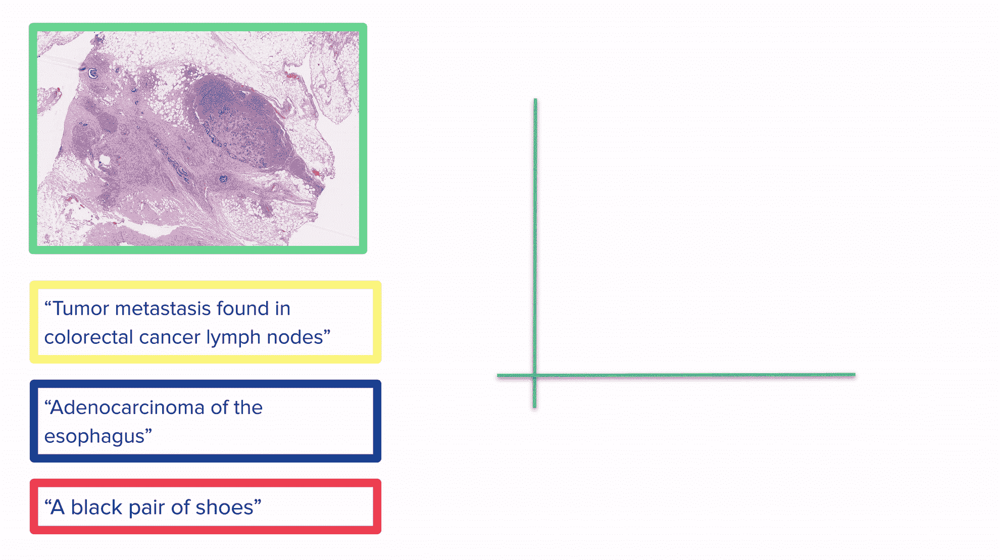
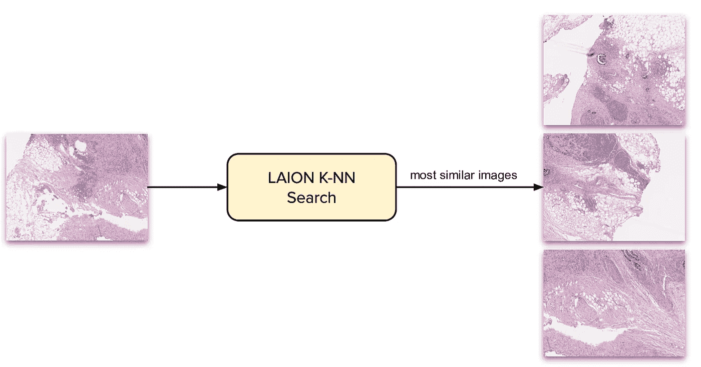
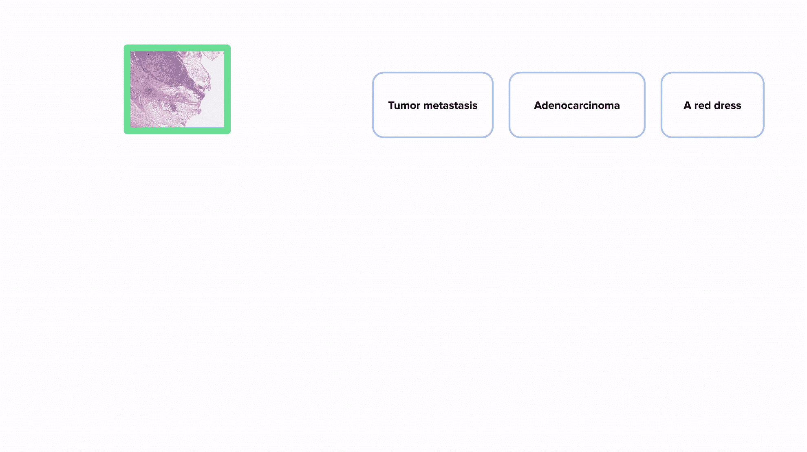
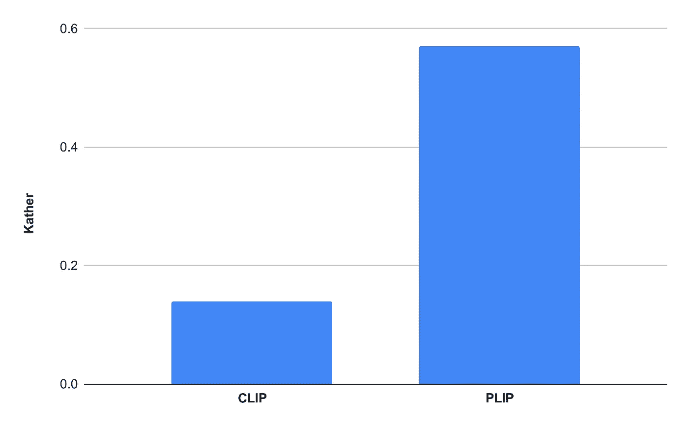
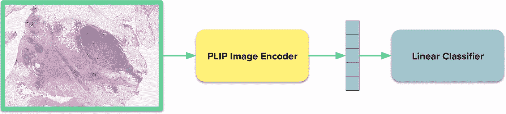
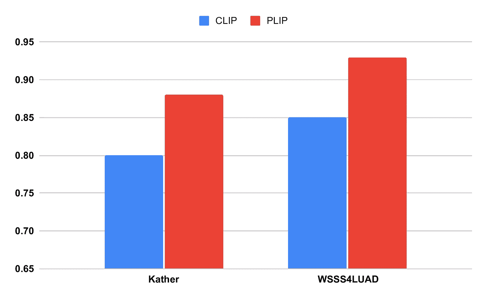

# 医疗 AI 的基础模型

> 原文：[`towardsdatascience.com/a-foundation-model-for-medical-ai-7b97e3ab3893?source=collection_archive---------2-----------------------#2023-09-19`](https://towardsdatascience.com/a-foundation-model-for-medical-ai-7b97e3ab3893?source=collection_archive---------2-----------------------#2023-09-19)

## 介绍 PLIP，一个病理学基础模型

[](https://fede-bianchi.medium.com/?source=post_page-----7b97e3ab3893--------------------------------)[](https://towardsdatascience.com/?source=post_page-----7b97e3ab3893--------------------------------) [Federico Bianchi](https://fede-bianchi.medium.com/?source=post_page-----7b97e3ab3893--------------------------------)

·

[关注](https://medium.com/m/signin?actionUrl=https%3A%2F%2Fmedium.com%2F_%2Fsubscribe%2Fuser%2F2aff872fe60e&operation=register&redirect=https%3A%2F%2Ftowardsdatascience.com%2Fa-foundation-model-for-medical-ai-7b97e3ab3893&user=Federico+Bianchi&userId=2aff872fe60e&source=post_page-2aff872fe60e----7b97e3ab3893---------------------post_header-----------) 发表在 [Towards Data Science](https://towardsdatascience.com/?source=post_page-----7b97e3ab3893--------------------------------) ·10 分钟阅读·2023 年 9 月 19 日

--

[](https://medium.com/m/signin?actionUrl=https%3A%2F%2Fmedium.com%2F_%2Fbookmark%2Fp%2F7b97e3ab3893&operation=register&redirect=https%3A%2F%2Ftowardsdatascience.com%2Fa-foundation-model-for-medical-ai-7b97e3ab3893&source=-----7b97e3ab3893---------------------bookmark_footer-----------)

图片由 Tara Winstead 提供: [`www.pexels.com/photo/person-reaching-out-to-a-robot-8386434/`](https://www.pexels.com/photo/person-reaching-out-to-a-robot-8386434/)

## 介绍

正在进行的 AI 革新带来了各个方面的创新。OpenAI 的 GPT 模型正在引领发展，并展示了基础模型如何实际上使我们的一些日常任务变得更轻松。从帮助我们写得更好到简化一些任务，我们每天都会看到新模型的发布。

许多机会正在我们面前展开。能够帮助我们工作生活的 AI 产品将成为我们在未来几年中获得的最重要工具之一。

我们将在哪里看到最具影响力的变化？我们可以在哪里帮助人们更快地完成任务？人工智能模型最令人兴奋的一个方向是将我们引向医疗 AI 工具。

在这篇博客文章中，我将[**PLIP**](https://github.com/PathologyFoundation/plip)（病理语言和图像预训练）描述为病理学的第一个基础模型之一。PLIP 是一个视觉-语言模型，可以用于将图像和文本嵌入到同一向量空间中，从而实现多模态应用。PLIP 源自 2021 年 OpenAI 提出的原始[CLIP](https://openai.com/research/clip)模型，并已在《Nature Medicine》上发表：

Huang, Z., Bianchi, F., Yuksekgonul, M., Montine, T., Zou, J., [**一种用于病理图像分析的视觉-语言基础模型，通过医疗 Twitter。**](https://rdcu.be/djLSK)2023, Nature Medicine.

在开始我们的冒险之前，一些有用的链接：

+   [HuggingFace Weights](https://huggingface.co/vinid/plip);

+   [Nature Medicine Paper](https://rdcu.be/djLSK);

+   [GitHub Repository](https://github.com/PathologyFoundation/pathology-language-image-pretraining/).

除非另有说明，所有图像均由作者提供。

# 对比预训练 101

我们展示了通过社交媒体上的数据收集以及一些额外的技巧，我们可以构建一个可以在医疗 AI 病理任务中取得良好结果的模型——而无需标注数据。

虽然介绍 CLIP（PLIP 衍生的模型）及其对比损失超出了这篇博客文章的范围，但了解一下还是很有帮助。CLIP 背后的非常简单的想法是，我们可以构建一个将图像和文本放入一个向量空间的模型，其中“图像及其描述将会彼此接近”。



对比模型——如 PLIP/CLIP——将图像和文本置于同一向量空间进行比较。黄色框中的描述与黄色框中的图像匹配，因此它们在向量空间中也非常接近。

上面的 GIF 还展示了一个示例，说明了如何将图像和文本嵌入同一向量空间的模型用于分类：通过将所有内容置于同一向量空间，我们可以通过考虑向量空间中的距离，将每个图像与一个或多个标签关联起来：描述与图像越接近，效果越好。我们期望最接近的标签是图像的真实标签。

明确来说：一旦 CLIP 训练完成，你可以嵌入**任何**图像或**任何**文本。请注意，这个 GIF 展示的是二维空间，但一般而言，CLIP 使用的空间维度要高得多。

这意味着，一旦图像和文本处于相同的向量空间中，我们可以做很多事情：从*零样本分类*（**找到哪个文本标签与图像更相似**）到*检索*（**找到哪个图像与给定描述更相似**）。

我们如何训练 CLIP？简单来说，模型会接收**大量**的图像-文本对，并尝试将相似的匹配项放在一起（如上图所示），而将其他项远离。图像-文本对越多，你学到的表示就越好。

我们将在这里结束对 CLIP 背景的介绍，这应该足以理解本文的其余部分。我在 Towards Data Science 上有一篇关于 CLIP 的更深入的博客文章。

[](/how-to-train-your-clip-45a451dcd303?source=post_page-----7b97e3ab3893--------------------------------) ## 如何训练你的 CLIP

### 介绍 CLIP 及其在 HuggingFace 社区周期间如何为意大利语进行微调。

towardsdatascience.com

CLIP 已被训练成为一个非常通用的图像-文本模型，但对于特定的使用案例（例如，[时尚](https://www.nature.com/articles/s41598-022-23052-9)（Chia 等，2022 年））效果不佳，而且在某些情况下，CLIP 表现不佳，而领域特定的实现效果更好（Zhang 等，2023 年）。

# 病理学语言和图像预训练（PLIP）

我们现在描述如何构建 PLIP，这是我们对原始 CLIP 模型进行微调的版本，专门针对病理学设计。

## 为病理学语言和图像预训练构建数据集

我们需要数据，而这些数据必须足够好，以用于训练模型。**问题是我们如何找到这些数据？** 我们需要的是具有相关描述的图像——就像我们在上面的 GIF 中看到的那样。

尽管网络上有大量的病理数据，但这些数据通常缺乏注释，并且可能以非标准格式存在，如 PDF 文件、幻灯片或 YouTube 视频。

我们需要换个地方寻找，而这个地方就是社交媒体。通过利用社交媒体平台，我们有可能接触到大量与病理学相关的内容。病理学家使用社交媒体在线分享自己的研究，并向同事提问（请参见 Isom 等，2017 年，讨论了病理学家如何使用社交媒体）。此外，还有一组一般推荐的**Twitter 标签**，病理学家可以用来进行沟通。[点击这里](https://www.symplur.com/healthcare-hashtags/ontology/pathology/) 查看这些标签。

除了 Twitter 数据外，我们还收集了**LAION 数据集**（Schuhmann 等，2022 年）中的一个子集，LAION 是一个包含 50 亿图像-文本对的大型数据集。LAION 通过爬取网络收集而来，也是许多流行的 OpenCLIP 模型训练所使用的数据集。

**病理学 Twitter**

我们使用病理学 Twitter 标签收集了超过 10 万条推文。过程相当简单，我们使用 API 收集与特定标签相关的推文。我们去除包含问号的推文，因为这些推文通常包含对其他病理（例如，“这是什么肿瘤？”）的请求，而不是我们实际需要的信息来构建模型。


我们提取包含特定关键词的推文，并去除敏感内容。此外，我们还去除了所有包含问号的推文，这些推文通常是病理学家向同事询问一些可能罕见的病例的提问。

**从 LAION 采样**

LAION 包含 50 亿图像-文本对，我们收集数据的计划如下：我们可以使用来自 Twitter 的图像，并在这个大型语料库中查找相似的图像；这样，我们应该能够获得相当相似的图像，并且这些相似的图像也可能是病理图像。

现在，手动进行这些操作是不可行的，嵌入和搜索 50 亿个嵌入是一个非常耗时的任务。幸运的是，LAION 有预计算的向量索引，我们可以通过 API 用实际图像查询！因此，我们简单地嵌入我们的图像并使用 K-NN 搜索在 LAION 中查找相似图像。请记住，这些图像每个都有一个标题，非常适合我们的用例。



我们通过在 LAION 数据集上使用 K-NN 搜索扩展数据集的设置非常简单。我们从原始语料库中的图像开始，然后在 LAION 数据集中搜索相似的图像。我们得到的每张图像都有一个实际标题。

**确保数据质量**

并非所有我们收集的图像都是好的。例如，我们从 Twitter 收集了大量医疗会议的合影。从 LAION，我们有时会得到一些类似分形的图像，这些图像可能模糊地类似于某些病理模式。

我们做的事情非常简单：我们使用一些病理数据作为正类数据，用 ImageNet 数据作为负类数据来训练分类器。这种分类器具有极高的精度（实际上，区分病理图像和网络上的随机图像很容易）。

此外，对于 LAION 数据，我们应用了英语语言分类器来去除非英语的示例。

## 训练病理语言和图像预训练

数据收集是最困难的部分。一旦完成且我们信任我们的数据，就可以开始训练。

为了训练 PLIP，我们使用了原始的 OpenAI 代码进行训练——我们实现了训练循环，添加了损失的余弦退火，并做了一些调整，以确保一切顺利进行并且可验证（例如，[Comet ML](https://www.comet.com/) 跟踪）。

我们训练了许多不同的模型（数百个），并比较了参数和优化技术。最终，我们得出了一个令人满意的模型。详细信息请参见论文，但在构建这种对比模型时，最重要的组成部分之一是确保在训练过程中批量大小尽可能大，这可以使模型学会区分尽可能多的元素。

# 医学 AI 的病理语言和图像预训练

现在是测试我们的 PLIP 模型的时候了。这个基础模型在标准基准测试上表现如何？

我们进行了不同的测试来评估 PLIP 模型的性能。其中最有趣的三个是零样本分类、线性探测和检索，但我主要关注前两个。在这里为了简洁，我将忽略实验配置，但这些都可以在手稿中找到。

## **PLIP 作为零样本分类器**

下面的 GIF 演示了如何使用类似 PLIP 的模型进行零样本分类。我们使用点积作为向量空间中的相似性度量（点积越高，相似度越高）。



进行零样本分类的过程。我们将图像和所有标签进行嵌入，然后在向量空间中找出与图像最接近的标签。

在下图中，你可以看到 PLIP 与 CLIP 在我们用于零样本分类的一个数据集上的快速比较。使用 PLIP 替代 CLIP 能显著提升性能。



PLIP 与 CLIP 在两个数据集上的零样本分类性能（加权宏 F1）。注意 y 轴在约 0.6 处停止，而不是 1。

## **PLIP 作为线性探测的特征提取器**

使用 PLIP 的另一种方法是作为病理图像的特征提取器。在训练过程中，PLIP 处理了许多病理图像，并学习为这些图像构建向量嵌入。

假设你有一些标注数据，想要训练一个新的病理分类器。你可以使用 PLIP 提取图像嵌入，然后在这些嵌入上训练一个逻辑回归（或你喜欢的任何回归器）。这是一种简单有效的分类任务方法。

为什么这样有效？这个想法是，PLIP 嵌入具有病理特异性，应该比 CLIP 嵌入（通用目的）更好。



PLIP 图像编码器允许我们为每个图像提取一个向量，并在其上训练一个图像分类器。

下面是 CLIP 和 PLIP 在两个数据集上的性能比较示例。虽然 CLIP 的表现不错，但我们使用 PLIP 得到的结果要高得多。



PLIP 与 CLIP 在两个数据集上进行线性探测的表现（宏 F1）。注意 y 轴从 0.65 开始，而不是 0。

# 使用病理语言和图像预训练

如何使用 PLIP？以下是一些使用 PLIP 的 Python 示例，以及一个你可以用来稍微玩一下模型的 Streamlit 演示。

## 代码：使用 PLIP 的 API

我们的 GitHub 仓库提供了一些额外的示例，你可以参考。我们已经构建了一个 API，允许你轻松地与模型进行交互：

```py
from plip.plip import PLIP
import numpy as np

plip = PLIP('vinid/plip')

# we create image embeddings and text embeddings
image_embeddings = plip.encode_images(images, batch_size=32)
text_embeddings = plip.encode_text(texts, batch_size=32)

# we normalize the embeddings to unit norm (so that we can use dot product instead of cosine similarity to do comparisons)
image_embeddings = image_embeddings/np.linalg.norm(image_embeddings, ord=2, axis=-1, keepdims=True)
text_embeddings = text_embeddings/np.linalg.norm(text_embeddings, ord=2, axis=-1, keepdims=True)
```

你还可以使用更标准的 HF API 来加载和使用模型：

```py
from PIL import Image
from transformers import CLIPProcessor, CLIPModel

model = CLIPModel.from_pretrained("vinid/plip")
processor = CLIPProcessor.from_pretrained("vinid/plip")

image = Image.open("images/image1.jpg")

inputs = processor(text=["a photo of label 1", "a photo of label 2"],
                   images=image, return_tensors="pt", padding=True)

outputs = model(**inputs)
logits_per_image = outputs.logits_per_image 
probs = logits_per_image.softmax(dim=1) 
```

## 演示：PLIP 作为教育工具

我们还相信 PLIP 和未来的模型可以作为医学 AI 的有效教育工具。PLIP 允许用户进行零样本检索：用户可以搜索特定的关键词，PLIP 将尝试找到最相似/匹配的图像。我们在 Streamlit 中构建了一个简单的 Web 应用，你可以在[这里](https://huggingface.co/spaces/vinid/webplip)找到它。

# 结论

感谢阅读这些内容！我们对这项技术未来可能的发展感到兴奋。

我将通过讨论 PLIP 的一些非常重要的局限性以及建议一些可能感兴趣的附加内容来结束这篇博客文章。

## 局限性

尽管我们的结果很有趣，但 PLIP 存在许多不同的局限性。数据不足以学习病理学所有复杂的方面。我们已经构建了数据过滤器以确保数据质量，但我们需要更好的评估指标来理解模型的正确与错误。

更重要的是，PLIP 并没有解决病理学当前的挑战；PLIP 不是一个完美的工具，可能会犯很多需要调查的错误。我们看到的结果无疑是有前景的，它们为未来在病理学中结合视觉和语言的模型打开了许多可能性。然而，在我们能看到这些工具在日常医学中应用之前，还有很多工作要做。

## 杂项

我还有一些关于 CLIP 建模和 CLIP 局限性的博客文章。例如：

[](/teaching-clip-some-fashion-3005ac3fdcc3?source=post_page-----7b97e3ab3893--------------------------------) ## 教授 CLIP 一些时尚知识

### 训练 FashionCLIP，一个特定领域的 CLIP 模型用于时尚

towardsdatascience.com [](/your-vision-language-model-might-be-a-bag-of-words-30b1beaef7f8?source=post_page-----7b97e3ab3893--------------------------------) ## 你的视觉-语言模型可能是一个词袋

### 我们在 ICLR 2023 的口头报告中探讨了视觉-语言模型在语言方面的局限性

towardsdatascience.com

## 参考文献

Chia, P.J., Attanasio, G., Bianchi, F., Terragni, S., Magalhães, A.R., Gonçalves, D., Greco, C., & Tagliabue, J. (2022). 一般时尚概念的对比语言与视觉学习。*Scientific Reports, 12*。

Isom, J.A., Walsh, M., & Gardner, J.M. (2017). 社交媒体与病理学：我们现在处于何处以及为何重要？*Advances in Anatomic Pathology*。

Schuhmann, C., Beaumont, R., Vencu, R., Gordon, C., Wightman, R., Cherti, M., Coombes, T., Katta, A., Mullis, C., Wortsman, M., Schramowski, P., Kundurthy, S., Crowson, K., Schmidt, L., Kaczmarczyk, R., & Jitsev, J. (2022). LAION-5B：一个用于训练下一代图像-文本模型的开放大规模数据集。*ArXiv, abs/2210.08402*。

Zhang, S., Xu, Y., Usuyama, N., Bagga, J.K., Tinn, R., Preston, S., Rao, R.N., Wei, M., Valluri, N., Wong, C., Lungren, M.P., Naumann, T., & Poon, H. (2023). 大规模领域特定预训练用于生物医学视觉-语言处理。*ArXiv, abs/2303.00915*。
