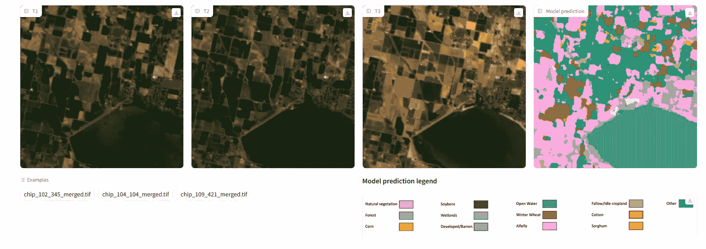

# 卫星图像基础模型

> 原文：[`towardsdatascience.com/a-foundation-model-for-satellite-images-dbf356c746a9?source=collection_archive---------8-----------------------#2023-11-04`](https://towardsdatascience.com/a-foundation-model-for-satellite-images-dbf356c746a9?source=collection_archive---------8-----------------------#2023-11-04)

## Prithvi-100M IBM 地理空间 AI 基础模型用于 NASA 地球观测数据

 [Caroline Arnold](https://medium.com/@caroline.arnold_63207?source=post_page-----dbf356c746a9--------------------------------)

·

[关注](https://medium.com/m/signin?actionUrl=https%3A%2F%2Fmedium.com%2F_%2Fsubscribe%2Fuser%2F9367198e7a3c&operation=register&redirect=https%3A%2F%2Ftowardsdatascience.com%2Fa-foundation-model-for-satellite-images-dbf356c746a9&user=Caroline+Arnold&userId=9367198e7a3c&source=post_page-9367198e7a3c----dbf356c746a9---------------------post_header-----------) 发表在 [Towards Data Science](https://towardsdatascience.com/?source=post_page-----dbf356c746a9--------------------------------) ·7 分钟阅读·2023 年 11 月 4 日

--

阿尔巴尼亚卡拉瓦斯塔泻湖的卫星图像，2017 年。图像来源：[`www.esa.int/var/esa/storage/images/esa_multimedia/images/2017/03/karavasta_lagoon_albania/16854373-1-eng-GB/Karavasta_Lagoon_Albania.jpg`](https://www.esa.int/var/esa/storage/images/esa_multimedia/images/2017/03/karavasta_lagoon_albania/16854373-1-eng-GB/Karavasta_Lagoon_Albania.jpg)。包含修改后的 Copernicus Sentinel 数据。

基础模型是灵活的深度学习算法，旨在处理通用任务，而不是立即专注于特定任务。在大量未标记数据上进行训练后，它们可以通过最少的微调应用于各种下游任务。基础模型在自然语言处理（[BERT](https://huggingface.co/bert-base-uncased)，GPT-x）和图像处理（[DALL-E](https://huggingface.co/dalle-mini/dalle-mini)）中都很有名。

2023 年 8 月，NASA 和 IBM 发布了用于 NASA 地球观测数据的地理空间 AI 基础模型。该模型以 Prithvi 命名，开放源代码在[Huggingface](https://huggingface.co/ibm-nasa-geospatial)上，Prithvi 是印度教的大地女神。它已在 NASA 卫星数据上进行训练——[根据 IBM](https://research.ibm.com/blog/nasa-hugging-face-ibm)，*超过 250 PB*的数据可用。

在这篇博客文章中，我们讨论

+   用于训练的 NASA 协调 Sentinel-2 Landsat 数据集，

+   Prithvi-100M 地理空间 AI 基础模型的架构，

+   在 IBM 的 Vela 超级计算机上的训练过程，

+   示例应用：洪水和作物类型识别。

## 训练数据

地理空间 AI 基础模型已在[NASA 协调的 LandSat Sentinel-2 数据](https://docs.sentinel-hub.com/api/latest/data/hls/)上进行训练。

[Sentinel-2](https://en.wikipedia.org/wiki/Sentinel-2)是由欧洲航天局协调的卫星任务，目前有两颗卫星在轨道上拍摄地球的高分辨率图像。它专注于陆地、沿海地区和特定的开放水域。Landsat 卫星由 NASA 发射，用于记录地表反射。协调数据结合了两个传感器的输入， resulting in a spatial resolution of about 30 meters and an average revisit time of two to three days. This resolution is sufficient for agricultural monitoring, land use classification, and natural disaster detection.

标准照片由红色、绿色和蓝色三种颜色组成。Sentinel-2 数据总共提供 13 种“颜色”，即所谓的*波段*，涵盖可见光、近红外和短波红外电磁谱范围。选择的波段可以用于识别不同的事物，例如，红外波段包含有关植被的信息。有关背景，请参见[这篇文章](https://gisgeography.com/sentinel-2-bands-combinations/)关于 Sentinel-2 波段组合。

夏威夷机场的伪彩色红外图像。图像来源：ESA sentinel 卫星图像，CC BY-SA 4.0 <[`creativecommons.org/licenses/by-sa/4.0`](https://creativecommons.org/licenses/by-sa/4.0)>, 通过维基媒体共享资源。

云层阻碍了地球观测卫星的视线。为应对这一影响，Sentinel-2 提供了一个可用于识别云层覆盖的波段。受影响的像素被屏蔽，以免干扰图像处理算法。

因此，Sentinel-2 和 Landsat 数据是未标记的。需要大量的人力和专业知识才能提供逐像素的土地使用类别分类。基础模型高度通用，并从数据中提取结构，而无需在训练过程的初始阶段提供标记数据。因此，它们在地球观测数据方面显得非常有前途。

## 模型架构

Prithvi-100M 地理空间 AI 基础模型基于时间序列视觉变换器和掩蔽自编码器。模型卡显示在 Huggingface 上：

Huggingface 上的 Prithvi-100M 模型卡。图像来源：[`huggingface.co/ibm-nasa-geospatial/Prithvi-100M/blob/main/GFM.png`](https://huggingface.co/ibm-nasa-geospatial/Prithvi-100M/blob/main/GFM.png)

该模型接受视频格式的 Landsat 图像作为输入。来自同一地点的图像被加载为时间序列，而静态图像可以通过将时间序列长度设置为 1 进行处理。波段对应于视觉变换器的通道。

**视觉变换器**

在 2020 年，Google Research 的团队展示了变换器不仅可以应用于自然语言处理，还可以应用于图像 [(Dosovitsky et al, ICLR 2020)](https://arxiv.org/pdf/2010.11929.pdf)。在那之前，卷积神经网络一直是图像处理的*事实上的*标准。

视觉变换器首先将图像切割成小块，类似于对语言处理变换器进行句子的标记化。然后，添加可学习的嵌入和位置编码。在原始论文中，展示了在大量训练数据下，视觉变换器可以超越典型的计算机视觉架构，如 ResNet。

 [## 视觉变换器（ViT）放大镜下，第一部分

### 嵌入

yurkovak.medium.com](https://yurkovak.medium.com/vision-transformer-vit-under-the-magnifying-glass-part-1-70be8d6661a7?source=post_page-----dbf356c746a9--------------------------------)

**掩蔽自编码器**

Prithvi-100M 掩蔽自编码器基于 He 等人（2021）的原始实现，[`arxiv.org/pdf/2111.06377.pdf`](https://arxiv.org/pdf/2111.06377.pdf)。概念很简单：

> 图像中的随机块被掩蔽。自编码器学习预测缺失的像素。这类似于大型语言模型的训练，其中模型学习预测句子中缺失的单词。

在原始论文中，考虑了带有 RGB（红色、绿色、蓝色）颜色通道的 2D 图像。论文中广泛讨论了在语言数据和图像数据上进行训练的区别。

编码器仅在未被遮挡的图像块上工作，这样可以节省计算时间。嵌入由对单独图像块的线性投影来处理，该投影包含可学习参数。

位置嵌入很重要，以便算法知道图像块在原始图像中的位置。在遮挡自编码器的情况下，位置嵌入通过 2D 正弦-余弦函数提供，这种函数通常用于变换器模型。它对图像中的 2D 网格位置进行编码。位置嵌入可能包含可学习的参数，但在[MAE 库](https://github.com/facebookresearch/mae/blob/efb2a8062c206524e35e47d04501ed4f544c0ae8/util/pos_embed.py#L38)的实现中似乎并非如此。

遮挡自编码器的应用。左侧：原始图像的遮挡图像块。中间：重建。右侧：真实情况。图像来源：[`arxiv.org/pdf/2111.06377.pdf`](https://arxiv.org/pdf/2111.06377.pdf)（图 2）

**MAE 架构的变化**

为了处理具有更多通道的卫星数据时间序列，NASA 和 IBM 团队对遮挡自编码器架构进行了若干修改。

+   2D 图像块嵌入被更改为 3D 图像块嵌入。

+   2D 位置嵌入被更改为 3D 位置嵌入。

+   图像块创建考虑到数据的 3D 特性。

+   除了 RGB 颜色外，还增加了一个近红外和两个短波红外波段。

**损失函数**

均方误差（MSE）损失用于训练，通过逐像素比较原始图像和重建图像。

## 模型训练

模型训练过程描述在 IBM 博客中：[`research.ibm.com/blog/nasa-hugging-face-ibm`](https://research.ibm.com/blog/nasa-hugging-face-ibm)。遗憾的是，提供的细节不多。然而，IBM 提到他们在公司 AI 超级计算机 Vela 上进行了训练。[Vela](https://research.ibm.com/blog/AI-supercomputer-Vela-GPU-cluster)是一个完全基于云的超级计算机，仅为 IBM 研究部门运营。

超级计算机由 200 个节点组成。每个节点配备了 8 个 NVIDIA A100 GPU，每个 GPU 有 80 GB 的内存。节点 RAM 为 1.5 TB，并且配备四个 3.2 TB 的本地硬盘。这些配置能够处理训练基础模型所需的大数据集。节点之间通过一个能传输高达 100 GB/秒的网络连接。

## 应用

Prithvi-100M 地理空间 AI 基础模型可以应用于多种下游任务。我们专注于两个任务：洪水和作物类型识别。

**洪水**

保留 Prithvi-100M 的原始编码器部分，模型现在被调整为预测卫星图像中洪水的扩展。详细信息描述在 [Huggingface](https://huggingface.co/ibm-nasa-geospatial/Prithvi-100M-sen1floods11)。[Sen1Floods11](https://github.com/cloudtostreet/Sen1Floods11) 数据集用于微调，涵盖了六大洲的 11 次洪水事件。

微调地理空间 AI 基础模型以进行洪水检测。图像来源：[`huggingface.co/ibm-nasa-geospatial/Prithvi-100M-sen1floods11/blob/main/sen1floods11-finetuning.png`](https://huggingface.co/ibm-nasa-geospatial/Prithvi-100M-sen1floods11/blob/main/sen1floods11-finetuning.png)

为了将 Prithvi-100M 准备好以应对下游任务，需要将嵌入形状转换回原始图像形状。然后，添加一个最终的 2D 卷积层，应用特定任务的分类。

图像中的每个像素被分类为水域或非水域（陆地）。由于这是一个分类问题，因此使用了二元交叉熵损失。一次只处理一张图像，因此未使用 Prithvi-100M 的时间序列功能。

作者报告了在玻利维亚的一个保留洪水事件中，平均准确率为 93%，平均交并比为 86%。

提供了一个演示页面，用户可以上传自己的 Sentinel-2 图像，并要求 Prithvi-100M 识别洪水。

洪水识别演示的快照。黑色像素对应陆地，白色像素对应水域。图像来源：[`huggingface.co/spaces/ibm-nasa-geospatial/Prithvi-100M-sen1floods11-demo`](https://huggingface.co/spaces/ibm-nasa-geospatial/Prithvi-100M-sen1floods11-demo)（使用 India_900498_S2Hand.tif）

**作物类型识别**

为了利用时间序列功能，作者提供了作物类型识别的演示。作物类型的实际情况由标记图像提供。这是一个多类分类问题，训练时使用了交叉熵损失。

作为 Prithvi-100M 的下游任务，进行多时相作物类型分类。图像来源：[`huggingface.co/ibm-nasa-geospatial/Prithvi-100M-multi-temporal-crop-classification/blob/main/multi_temporal_crop_classification.png`](https://huggingface.co/ibm-nasa-geospatial/Prithvi-100M-multi-temporal-crop-classification/blob/main/multi_temporal_crop_classification.png)

作者报告了不同作物类型的不同准确率。平均准确率为 64%，交并比为 46%。然而，作者指出实际情况存在噪声，更准确的标签将有助于改进这一下游任务。

Prithvi-100M 的作物类型演示。左侧三幅图显示卫星图像的时间序列。右侧图显示模型预测，每个像素根据作物类型着色。图片来源：[`huggingface.co/spaces/ibm-nasa-geospatial/Prithvi-100M-multi-temporal-crop-classification-demo`](https://huggingface.co/spaces/ibm-nasa-geospatial/Prithvi-100M-multi-temporal-crop-classification-demo)

## 总结

我们已经介绍了地球空间 AI 基础模型，目前（2023 年）在 Huggingface 上以 Prithvi-100M 的名义是最大的地球空间模型。该模型由 IBM Research 和 NASA 开发，使用 Landsat 数据集进行训练。

我们已经介绍了地球空间 AI 基础模型的训练数据、架构和训练过程。该模型开放源代码，可以进行更具体任务的微调。洪水检测和作物类型识别应用展示了地球空间 AI 基础模型的巨大潜力。

由于 Sentinel-2 数据可用于个人非商业用途，有兴趣的用户可以创建适用于特定下游任务的自己的模型。在未来的帖子中，我将展示如何为植被识别和超分辨率微调地球空间 AI 基础模型。

## 进一步阅读

+   Jakubik 等人，Prithvi-100M，[`github.com/NASA-IMPACT/hls-foundation-os`](https://github.com/NASA-IMPACT/hls-foundation-os)，2023。

+   Prithvi-100M 在 Huggingface 上：[`huggingface.co/ibm-nasa-geospatial`](https://huggingface.co/ibm-nasa-geospatial)

+   Sentinel-2 卫星波段：[`gisgeography.com/sentinel-2-bands-combinations/`](https://gisgeography.com/sentinel-2-bands-combinations/)

+   He 等人（2021），“Masked Autoencoders are Scalable Vision Learners”，[`arxiv.org/pdf/2111.06377.pdf`](https://arxiv.org/pdf/2111.06377.pdf)

+   Dosovitskiy 等人（2020），“An Image is Worth 16x16 Words: Transformers for Image Recognition at Scale”，ICLR 2020，[`arxiv.org/abs/2010.11929`](https://arxiv.org/abs/2010.11929)

 ## 环境数据科学：简介

### 处理环境数据的示例、挑战和展望

towardsdatascience.com
