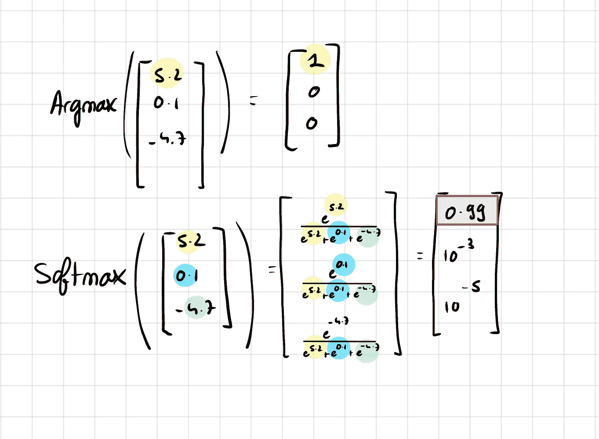
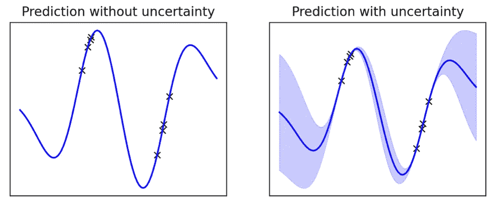
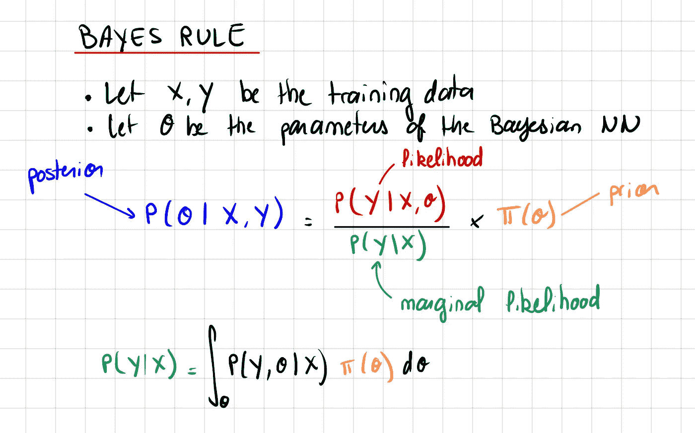
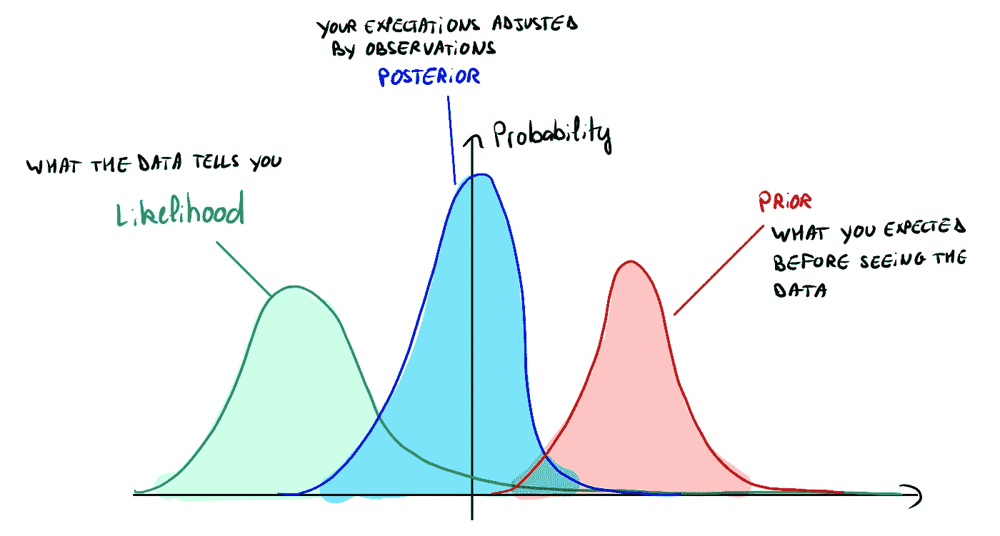
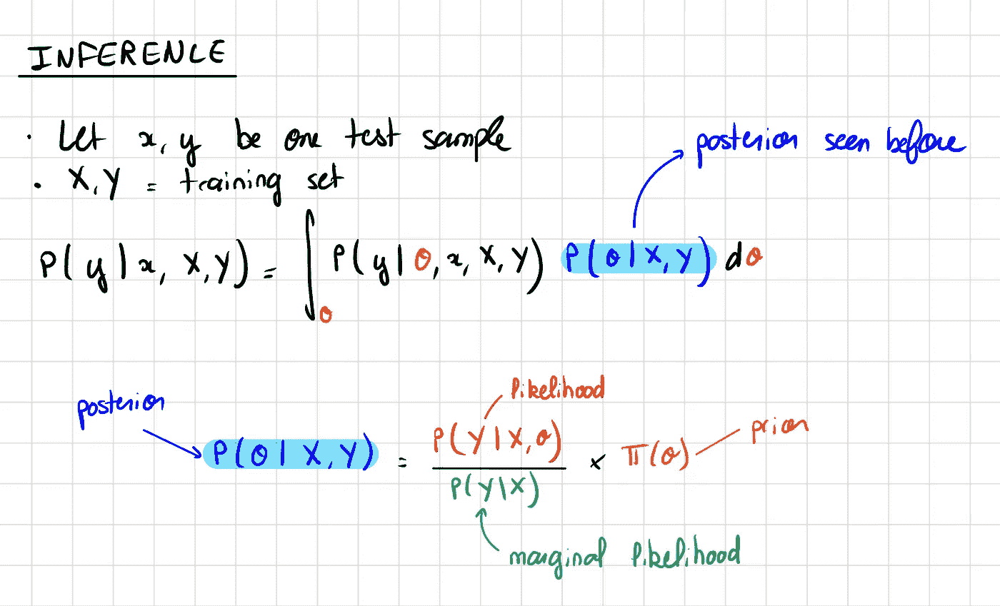
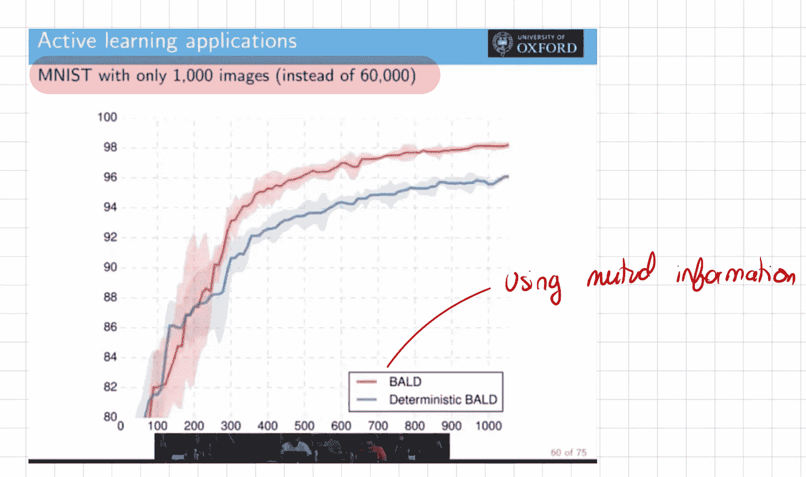
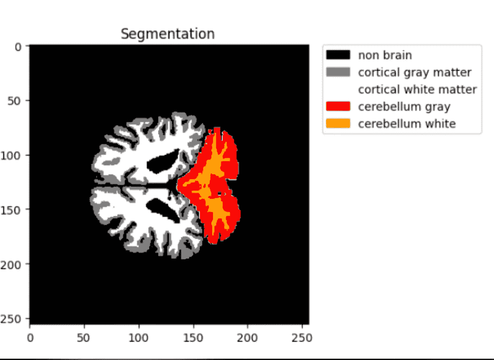

# 贝叶斯深度学习的温和介绍

> 原文：[`towardsdatascience.com/a-gentle-introduction-to-bayesian-deep-learning-d298c7243fd6`](https://towardsdatascience.com/a-gentle-introduction-to-bayesian-deep-learning-d298c7243fd6)

## 欢迎来到激动人心的概率编程世界！这篇文章是对该领域的温和介绍，你只需对深度学习和贝叶斯统计有基本了解。

 [François Porcher](https://medium.com/@francoisporcher?source=post_page-----d298c7243fd6--------------------------------)

·发表于 [Towards Data Science](https://towardsdatascience.com/?source=post_page-----d298c7243fd6--------------------------------) ·阅读时间 8 分钟·2023 年 7 月 26 日

--

到文章结束时，你应该对这个领域、它的应用以及它与更传统的深度学习方法的不同之处有一个基本的了解。

如果你像我一样听说过贝叶斯深度学习，并且猜测它涉及贝叶斯统计，但你不确切知道它是如何使用的，那么你来对地方了。

# 传统深度学习的局限性

传统深度学习的主要局限性之一是，即使它们是非常强大的工具，**它们也不能提供不确定性的度量。**

Chat GPT 可能会以明显的自信说出错误的信息。分类器的输出概率通常未经过校准。

**不确定性估计是决策过程中的一个关键方面，** 尤其是在医疗保健、自动驾驶汽车等领域。我们希望模型能够估计在对脑癌的分类非常不确定时，并在这种情况下需要进一步的医疗专家诊断。同样，我们希望自主汽车能够在识别到新环境时减速。

为了说明神经网络在估计风险时可能有多糟糕，我们来看看一个非常简单的带有 softmax 层的分类器神经网络。

softmax 的名字很容易理解，它是一个软最大函数，这意味着它是一个“更平滑”的最大函数。这是因为如果我们选择了一个“硬”的最大函数，只取概率最高的类别，我们将对所有其他类别的梯度为零。

使用 softmax 时，一个类别的概率可以接近 1，但永远不可能正好是 1。由于所有类别的概率总和是 1，因此仍有一些梯度流向其他类别。

硬最大值与软最大值，图像来源：作者

然而，softmax 函数也存在一个问题。它输出的概率**校准不佳**。在应用 softmax 函数之前值的微小变化会被指数函数压缩，从而导致输出概率变化极小。

这通常会导致过度自信，模型在面对不确定性时仍然给出某些类别的高概率，这是 softmax 函数‘max’特性固有的特征。

比较传统的神经网络（NN）与贝叶斯神经网络（BNN）可以突显不确定性估计的重要性。BNN 在遇到训练数据中的熟悉分布时，确定性较高，但当我们远离已知分布时，不确定性增加，从而提供更现实的估计。

下面是不确定性估计的一个示例：

传统神经网络与贝叶斯神经网络，图像来源：作者

你可以看到，当我们接近训练中观察到的分布时，模型非常确定，但当我们远离已知分布时，不确定性增加。

# 贝叶斯统计的简短回顾

在贝叶斯统计中有一个中心定理：**贝叶斯定理**。

贝叶斯定理，图像来源：作者

+   **先验**是我们在任何观察之前认为最可能的 theta 分布。例如，对于抛硬币，我们可以假设得到正面概率是围绕 p = 0.5 的高斯分布。

+   如果我们想尽可能减少归纳偏置，我们也可以说 p 在[0,1]之间是均匀的。

+   **似然性**是给定参数 theta 的情况下，我们得到观察 X，Y 的可能性。

+   **边际似然性**是对所有可能的 theta 积分后的似然性。它被称为“边际”的原因是我们通过对所有概率进行平均来边际化 theta。

在贝叶斯统计中，关键的概念是从先验开始，它是你对参数可能值的最佳猜测（它是一个分布）。通过你所做的观察，你调整你的猜测，并获得一个**后验分布**。

请注意，先验和后验不是 theta 的点估计，而是概率分布。

以此为例：

图像来源：作者

在这张图中，你可以看到先验向右移动，但似然性将我们的先验重新调整到左侧，而后验位于两者之间。

# 贝叶斯深度学习简介

贝叶斯深度学习是一种结合了两种强大数学理论的方法：**贝叶斯统计**和**深度学习。**

与传统深度学习的**区别在于对模型权重的处理：**

在传统深度学习中，我们从头开始训练模型，随机初始化一组权重，并训练模型直到其收敛到一组新的参数。**我们学习的是单一的一组权重。**

相反，贝叶斯深度学习采用了更为**动态的方法**。我们从对权重的先验信念开始，通常假设它们遵循正态分布。当我们将模型暴露于数据时，我们调整这一信念，从而更新权重的后验分布。**本质上，我们学习的是权重的概率分布，而不是单一的一组权重。**

在推断过程中，我们对所有模型的预测进行平均，并根据后验概率加权它们的贡献。**这意味着，如果一组权重的概率很高，则其对应的预测将获得更多的权重。**

让我们将这些正式化：

推断，图片来自作者

贝叶斯深度学习中的推断通过使用后验分布对所有可能的θ（权重）值进行积分。

我们还可以看到，在贝叶斯统计中，积分无处不在。这实际上是贝叶斯框架的主要限制。这些积分**往往是不可解的**（我们并不总是知道后验的原始函数）。因此，我们必须进行非常计算密集的近似。

# **贝叶斯深度学习的优势**

## 优势 1：不确定性估计

+   可以说，贝叶斯深度学习最显著的好处是其不确定性估计的能力。在包括医疗保健、自动驾驶、语言模型、计算机视觉和定量金融等许多领域中，量化不确定性的能力对做出明智的决策和管理风险至关重要。

## 优势 2：提高训练效率

+   与不确定性估计的概念密切相关的是提高的训练效率。由于贝叶斯模型能够意识到自身的不确定性，它们可以优先从那些不确定性——即学习潜力——最高的数据点中学习。这种方法被称为**主动学习**，能够实现令人印象深刻的有效和高效训练。

主动学习效果的演示，图片来自作者

如下图所示，使用主动学习的贝叶斯神经网络仅用 1,000 张训练图像就达到了 98%的准确率。相比之下，不利用不确定性估计的模型往往学习速度较慢。

## 优势 3：归纳偏差

贝叶斯深度学习的另一个优点是通过先验有效利用**归纳偏置**。先验允许我们编码对模型参数的初始信念或假设，这在**存在领域知识**的场景中尤为有用。

考虑生成式 AI，其思想是创建与训练数据类似的新数据（例如医学图像）。例如，如果你正在生成脑部图像，并且你已经知道脑部的一般布局——白质在内，灰质在外——这些知识可以包含在你的先验中。这意味着你可以给图像中心的白质分配更高的概率，而将灰质分配到边缘。

本质上，贝叶斯深度学习不仅使模型能够从数据中学习，还使其能够从知识点开始学习，而不是从头开始。这使其成为广泛应用的强大工具。

白质和灰质，图片由作者提供

# 贝叶斯深度学习的局限性

贝叶斯深度学习看起来非常不可思议！那么为什么这个领域会被低估呢？确实，我们经常谈论生成式 AI、Chat GPT、SAM 或更传统的神经网络，但我们几乎从未听说过贝叶斯深度学习，这是为什么呢？

## 限制 1: 贝叶斯深度学习非常**慢**

理解贝叶斯深度学习的关键在于我们“平均”模型的预测，而每当有平均时，就会有对参数集的**积分**。

但是**计算积分通常是不可解的**，这意味着没有一个封闭或显式的形式可以使积分计算快速。因此，我们不能直接计算它，我们必须通过采样一些点来近似积分，这使得推断非常慢。

想象一下，对于每个数据点 *x*，我们必须平均 10,000 个模型的预测，并且每个预测可能需要 1 秒来运行，这样我们最终得到的模型就是**无法扩展到大量数据**。

在大多数业务场景中，我们需要快速且可扩展的推断，这就是为什么贝叶斯深度学习不那么受欢迎。

## 限制 2: 近似误差

在贝叶斯深度学习中，通常需要使用近似方法，如变分推断，来计算权重的后验分布。这些近似可能导致最终模型中的错误。近似的质量取决于变分家族和散度度量的选择，这可能很难选择和调整。

## 限制 3: 模型复杂性和可解释性的增加

虽然贝叶斯方法提供了改进的不确定性度量，但这也增加了模型的复杂性。BNNs 可能难以解释，因为我们现在有的是一个可能权重的分布，而不是单一的权重集。这种复杂性可能会导致在解释模型决策时遇到挑战，特别是在解释性至关重要的领域。

对于 XAI（可解释人工智能）的兴趣日益增长，而传统深度神经网络本身就难以解释，因为难以理解权重，贝叶斯深度学习则更具挑战性。

感谢阅读！在你离开之前：

+   查看我在 Github 上的 [AI 教程合集](https://github.com/FrancoisPorcher/awesome-ai-tutorials)

 [## GitHub - FrancoisPorcher/awesome-ai-tutorials: 最佳 AI 教程合集，让你成为…

### 最佳 AI 教程合集，让你成为数据科学的高手！- GitHub …

github.com](https://github.com/FrancoisPorcher/awesome-ai-tutorials?source=post_page-----d298c7243fd6--------------------------------)

*你可以在你的收件箱中获取我的文章。* [***点击这里订阅。***](https://medium.com/@francoisporcher/subscribe)

*如果你希望获得 Medium 上的高级文章，只需每月$5 的会员费用。如果你通过* [***我的链接***](https://medium.com/@francoisporcher/membership)*注册，你将以不增加额外费用的方式支持我。*

> 如果你觉得这篇文章有见地且有益，请考虑关注我并留下掌声，以便获取更多深入内容！你的支持帮助我继续制作有助于我们共同理解的内容。

# 参考文献

1.  Ghahramani, Z. (2015). 概率机器学习与人工智能。自然，521(7553)，452–459。 [链接](https://www.nature.com/articles/nature14541)

1.  Blundell, C., Cornebise, J., Kavukcuoglu, K., & Wierstra, D. (2015). 神经网络中的权重不确定性。arXiv 预印本 arXiv:1505.05424。 [链接](https://arxiv.org/abs/1505.05424)

1.  Gal, Y., & Ghahramani, Z. (2016). Dropout 作为贝叶斯近似：在深度学习中表示模型不确定性。国际机器学习会议（第 1050–1059 页）。 [链接](https://proceedings.mlr.press/v48/gal16.pdf)

1.  Louizos, C., Welling, M., & Kingma, D. P. (2017). 通过 L0 正则化学习稀疏神经网络。arXiv 预印本 arXiv:1712.01312。 [链接](https://arxiv.org/abs/1712.01312)

1.  Neal, R. M. (2012). 贝叶斯神经网络学习（第 118 卷）。Springer Science & Business Media. [链接](https://www.springer.com/gp/book/9780387947242)
