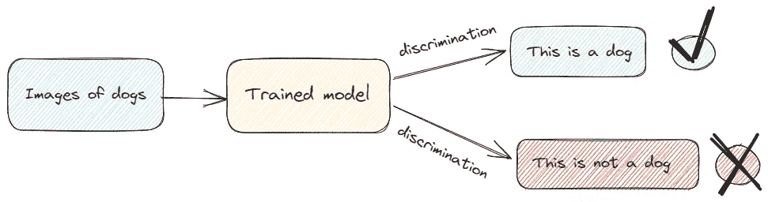
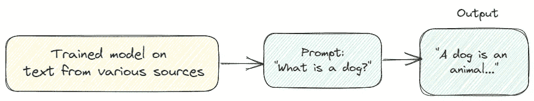

# 《初学者友好的生成式 AI 介绍》

> 原文：[`towardsdatascience.com/a-gentle-introduction-to-generative-ai-for-beginners-8c8752085900`](https://towardsdatascience.com/a-gentle-introduction-to-generative-ai-for-beginners-8c8752085900)

## 让我们深入了解生成式 AI 的整体图景

[](https://federicotrotta.medium.com/?source=post_page-----8c8752085900--------------------------------)[](https://towardsdatascience.com/?source=post_page-----8c8752085900--------------------------------) [Federico Trotta](https://federicotrotta.medium.com/?source=post_page-----8c8752085900--------------------------------)

·发表于 [Towards Data Science](https://towardsdatascience.com/?source=post_page-----8c8752085900--------------------------------) ·阅读时间 8 分钟·2023 年 6 月 29 日

--


图片由 [Susan Cipriano](https://pixabay.com/it/users/susan-lu4esm-7009216/?utm_source=link-attribution&utm_medium=referral&utm_campaign=image&utm_content=8015423) 提供，来源于 [Pixabay](https://pixabay.com/it//?utm_source=link-attribution&utm_medium=referral&utm_campaign=image&utm_content=8015423)

过去几个月里，所谓的“生成式 AI”得到了广泛关注，这是一种人工智能（AI）的子领域。像 ChatGPT 这样的工具已经成为最常被提及的词汇之一，并且正成为许多工作中日常任务的基础工具（甚至用来学习编程）。

诸如“[DALL-E](https://medium.com/mlearning-ai/can-i-sell-ai-generated-images-a5d4619c8e1b)”、“ChatGPT”和“生成式 AI”这些词汇在过去几个月里充斥了社交网络、媒体、同事聊天和我们世界的方方面面。几乎每个人都在谈论这些。

那么，什么是生成式 AI？它与“普通” AI 有何不同？

在这篇文章中，我们将澄清生成式 AI 背后的大图景。因此，如果你参与了相关讨论但对这个话题没有明确的理解，这篇文章绝对适合你。

这是一种探讨性解释，以理解生成式 AI 背后的基础内容。因此，不用担心：这里不会有任何代码。只有想法和描述，它们将以非常简洁的方式呈现。特别是，我们将重点关注大规模语言模型和图像生成模型。

这里是你将学习的内容概要：

```py
**Table of Contents:** 
What is generative AI and how does it differ from trditional AI?
Large Language Models
Image generation
```

# 什么是生成式 AI，它与传统 AI 有何不同？

生成式 AI 是 AI 的一个子领域，涉及创建能够生成新数据的算法，如图像、文本、代码和音乐。

生成式人工智能和“传统人工智能”之间的主要区别在于前者根据训练数据生成新的数据。此外，它可以处理“传统人工智能”无法处理的数据类型。

让我们稍微技术性地说一下：

+   “传统人工智能”可以定义为区分性人工智能。在这种情况下，实际上，我们训练机器学习模型，使其能够对新的、未见过的数据进行预测或分类。这些机器学习模型只能处理数字，有时也处理文本（例如，在自然语言处理的情况下）。

+   在生成式人工智能中，我们训练一个机器学习模型，它创建的输出类似于它所训练的数据。这些类型的机器学习模型可以处理不同类型的数据，如数字、文本、图像和音频。

让我们可视化这些过程：



传统人工智能的过程。图片来源于作者。

所以，在传统人工智能中，我们训练一个机器学习模型从数据中学习。然后，我们将其输入新的、未见过的数据，它可以进行区分，做出预测或分类。

关于所展示的示例，我们已经训练了一个机器学习模型来识别图像中的狗。然后，我们将训练好的机器学习模型输入新的、未见过的狗的图片，它将能够分类这些新图像是否代表狗。

这是深度学习算法在分类问题中的典型任务。



生成式人工智能的过程。图片来源于作者。

在生成式人工智能的情况下，我们用来自各种来源的数据训练一个机器学习模型，使用大量的数据。然后，得益于一个提示（用户插入的自然语言查询），模型给出一个类似于它所训练的数据的输出。

以这个示例为例，我们的模型已经在大量（文本）数据上进行了训练，其中包括解释什么是狗的数据。然后，如果用户向模型查询什么是狗，模型将用自然语言描述什么是狗。

这是像 ChatGPT 这样的工具执行的典型任务。

现在，让我们看看一些生成式人工智能模型的类型。

# 大型语言模型

让我们从大型语言模型（LLMs）开始，深入了解各种生成式人工智能子领域。[LLM 是](https://en.wikipedia.org/wiki/Large_language_model#:~:text=A%20large%20language%20model%20(LLM,learning%20or%20semi%2Dsupervised%20learning.)（来自维基百科）：

> 是一个计算机化的语言模型，由一个具有大量参数（从几千万到几十亿）的人工神经网络组成，使用自监督学习或半监督学习在大量未标记的文本上进行训练。
> 
> 尽管“大型语言模型”这个术语没有正式定义，但它通常指的是具有数百万甚至数十亿个参数的深度学习模型，这些模型已在大量语料库上“预训练”。

因此，LLM 是深度学习（DL）模型（即神经网络），使用数百万个参数在大量文本上进行训练（这就是我们称之为“大型”的原因），并且对解决一些语言问题很有用，如：

+   文本分类

+   问答

+   文档总结

+   文本生成

因此，标准机器学习模型的另一个重要区别在于，在这种情况下，我们可以训练一个可以用于不同任务的深度学习算法。

让我进一步解释。

如果我们需要开发一个可以识别图像中狗的系统，如前所述，我们需要训练一个深度学习算法来解决分类任务，即：告诉我们新的、未见过的图像是否代表狗。仅此而已。

相反，训练一个 LLM 可以帮助我们完成上述所有任务。因此，这也证明了训练 LLM 所需的计算能力（和资金！）的必要性（这需要 PB 级的数据！）。

我们知道，LLM 是通过用户的提示来查询的。现在，我们需要区分提示设计和提示工程：

+   **提示设计**。这是创造一个专门适用于系统执行的具体任务的提示的艺术。例如，如果我们想让我们的 LLM 将文本从英语翻译成意大利语，我们必须用英语写一个具体的提示，要求模型将我们粘贴的文本翻译成意大利语。

+   **提示工程**。这是创建提示以提高我们的 LLM 性能的过程。这意味着使用我们的领域知识来向提示中添加细节，如特定的关键词、特定的上下文和示例，以及必要时所需的输出。

当然，当我们进行提示时，有时会使用两者的混合。例如，我们可能希望将从英语到意大利语的翻译应用于特定知识领域，如力学。

例如，一个提示可能是：“*将以下内容翻译成意大利语：*

*光束受到正常应力作用。*

*考虑到我们处于力学领域，因此‘正常应力’必须与其相关*。

因为，你知道：“正常”和“应力”可能会被模型（甚至是人类！）误解。

## 三种类型的 LLM

有三种类型的 LLM：

+   **通用语言模型**。这些模型能够基于训练数据中的语言预测一个词（或一个短语）。例如，可以考虑你的电子邮件自动完成功能来理解这种类型。

+   **指令调优模型**。这些模型被训练以预测对输入中给出的指令的响应。总结给定文本是一个典型的例子。

+   **对话调优模型**。这些模型被训练与用户进行对话，使用后续的回应。一个典型的例子是 AI 驱动的聊天机器人。

无论如何，请注意，实际分发的模型具有混合特征。或者，至少，它们可以执行多个这些类型典型的操作。

例如，如果我们考虑 ChatGPT，我们可以明确地说它：

+   可以根据输入预测对指令的响应。事实上，例如，它可以总结文本，提供我们通过提示提供的某个论点的见解，等等……因此，它具有指令调优模型等功能。

+   经过训练以与用户对话。这很明显，因为它会根据后续提示进行工作，直到我们对其答案感到满意。因此，它还具有对话调优模型等功能。

# 图像生成

图像生成已经存在了一段时间，这与人们的看法相反。

无论如何，近年来它得到了流行，特别是像“DALL-E”或“稳定扩散”这样的工具，它们明确了其用途，使这一技术对全球大众变得可及。

我们可以说图像生成可以分为四类：

+   **变分自编码器**（VAEs）。[变分自编码器是](https://en.wikipedia.org/wiki/Variational_autoencoder#:~:text=Variational%20autoencoders%20are%20probabilistic%20generative,first%20and%20second%20component%20respectively.) “*需要神经网络作为其整体结构的一部分的概率生成模型*”。用操作性的话来说，它们将图像编码成压缩大小，并解码回原始大小。在此过程中，它们学习数据的分布。

+   **生成对抗模型**（GANs）。这些通常是最知名的，至少在生成 AI 领域的术语中是如此。[GAN 是](https://en.wikipedia.org/wiki/Generative_adversarial_network) “*一个机器学习框架的类别，其中两个神经网络相互对抗，其中一个的收益是另一个的损失*”。这意味着一个神经网络创建图像，而另一个预测它是真实的还是伪造的。

+   **自回归模型**。在统计学中，自回归模型是随机过程的表示。在生成图像的背景下，这些模型通过将图像视为像素序列来生成图像。

+   **扩散模型**。扩散模型受到热力学的启发，毫无疑问是图像生成子领域中最具前景和最有趣的模型。

这是在扩散模型的“引擎盖下”工作的过程：

+   **前向分布过程**。我们有一个初始的迭代过程，其中图像的结构在数据分布中被“破坏”。简单来说，就像我们反复向图像中添加噪声，直到所有像素变成纯噪声，图像无法被识别（通过人眼）。

+   **反向扩散过程**。然后，有一个反向扩散过程，它是实际的学习过程：它恢复数据的结构。这就像我们的模型学习如何“去噪”像素以重建图像。

## 连接这一切的力量

如果你保持了注意力到现在，你的脑海中自然会浮现一个问题：“*好的，费德里科，这很清楚。但我还有一点没弄明白：当我使用‘DALL-E’时，我输入一个提示，它输出一张图像：我们还没有讨论过这一点，是吗？！*”。

不，我们没有。

上面我们简要描述了目前最有前景（也是使用最多）的图像生成模型，但缺少的部分是提示。

我们实际上讨论了它们在高层次上的工作原理。也就是说，我们简要解释了它们的学习过程是如何运作的。

但这些模型的真正力量体现在它们与大型语言模型的结合上。实际上，这种结合使我们能够结合提示工程的力量来请求模型输出。

换句话说：我们结合了使用自然语言作为输入的可能性，这些模型可以实际理解这些输入并生成相应的图像。

这难道不是一种超级能力吗？！

# 结论

总结来说，我们可以说生成型人工智能是人工智能的一个子领域，旨在生成类似于训练数据的新数据。

一方面，大型语言模型可以根据训练数据生成文本，而图像生成模型可以基于训练图像生成新图像，生成型人工智能的真正力量，至少在图像的情况下，依赖于大型语言模型和图像生成模型的结合。这让我们可以根据提示输入创建图像。

***注意***：本文灵感来自谷歌提供的生成型人工智能课程，部分参考资料来自其中。我建议* [*参加此课程*](https://www.cloudskillsboost.google/journeys/118)*，以更好地理解生成型人工智能。*


费德里科·特罗塔

嗨，我是费德里科·特罗塔，我是一名自由职业的技术写作员。

想与我合作吗？ [联系我](https://bio.link/federicotrotta)。
