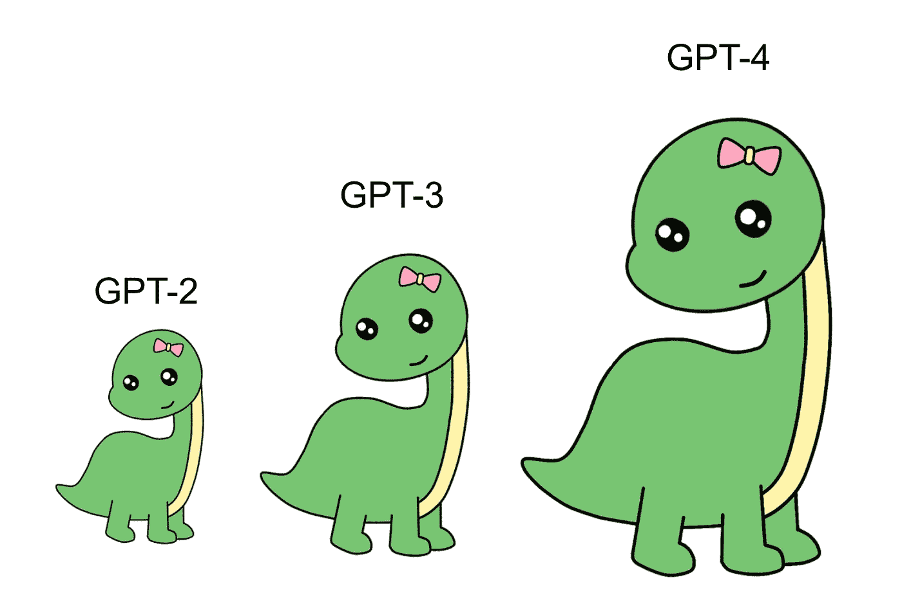

# GPT 模型简介

> 原文：[`towardsdatascience.com/a-gentle-introduction-to-gpt-models-e02b093a495b?source=collection_archive---------1-----------------------#2023-04-12`](https://towardsdatascience.com/a-gentle-introduction-to-gpt-models-e02b093a495b?source=collection_archive---------1-----------------------#2023-04-12)

## 欢迎来到新的令牌生成器的世界

 [本杰明·玛丽](https://medium.com/@bnjmn_marie?source=post_page-----e02b093a495b--------------------------------)

·

[关注](https://medium.com/m/signin?actionUrl=https%3A%2F%2Fmedium.com%2F_%2Fsubscribe%2Fuser%2Fad2a414578b3&operation=register&redirect=https%3A%2F%2Ftowardsdatascience.com%2Fa-gentle-introduction-to-gpt-models-e02b093a495b&user=Benjamin+Marie&userId=ad2a414578b3&source=post_page-ad2a414578b3----e02b093a495b---------------------post_header-----------) 发表于 [Towards Data Science](https://towardsdatascience.com/?source=post_page-----e02b093a495b--------------------------------) ·9 分钟阅读·2023 年 4 月 12 日

--

图片来源于 [Pixabay](https://pixabay.com/illustrations/dinosaur-t-rex-animal-dino-5631999/) — 作者修改

随着 ChatGPT 和 GPT-4 的最近发布，GPT 模型引起了科学界的极大关注。这些 OpenAI 的 GPT 模型新版本如此强大和多才多艺，以至于我们可能需要很长时间才能充分挖掘它们的潜力。

尽管它们令人印象深刻，但你可能不知道，GPT 模型背后的主要思想和算法远非新颖。

无论你是经验丰富的数据科学家还是仅仅对 GPT 感到好奇的人，了解 GPT 模型的演变对数据的影响以及未来几年的预期都是特别有启发性的。

在这篇文章中，我解释了 GPT 模型如何发展到今天的状态。我将主要关注 OpenAI 如何在这些年里扩展 GPT 模型。如果你想开始使用 GPT 模型，我也会给出一些指引。

# 生成预训练语言模型

GPT 模型是语言模型。

语言模型已经存在了 [超过 50 年](https://web.stanford.edu/~jurafsky/slp3/3.pdf)。

第一代语言模型是“*n*-gram 基础”的。它们对给定一些前置词的情况下，预测一个词的概率。

例如，如果你有以下句子：

*猫在厨房里睡觉*。

使用 *n*=3，你可以从一个 3-gram 语言模型中获得“*in*”跟在“*cat sleeps*”后面的概率。

*n*-gram 模型在许多自然语言和语音处理任务中仍然很有用，直到 2010 年代初。

这些模型存在几个限制。计算复杂性随着 *n* 的增加而急剧增加。因此，这些模型通常限制在 *n*=5 或更低。

然后，得益于神经网络和更强大的机器，这一主要限制得到了缓解，可以计算更长 *n*-gram 的概率，例如 *n*=20 或更高。

使用这些模型生成文本也是可能的，但它们的输出质量很差，因此很少用于这个目的。

然后，在 2018 年，[OpenAI 提出了第一个 GPT 模型](https://s3-us-west-2.amazonaws.com/openai-assets/research-covers/language-unsupervised/language_understanding_paper.pdf)。

GPT 代表“生成预训练”。“预训练”意味着模型只是基于大量文本进行训练，以建模概率，除了语言建模没有其他目的。GPT 模型可以进一步微调，即进一步训练，以执行更具体的任务。

例如，你可以使用一个小的数据集来获得一个在新闻摘要方面表现非常好的 GPT 模型，或者在法英翻译上进行微调，以获得一个能够将法语翻译成英语的机器翻译系统。

*注意：术语“预训练”暗示模型尚未完全训练，还需要另一个步骤。随着最近模型的出现，微调的需求趋于消失。预训练模型现在可以直接在应用中使用。*

GPT 模型现在在几乎所有自然语言处理任务中表现都很优秀。我特别研究了它们在机器翻译方面的能力，你可以在以下文章中阅读：

 ## 使用 GPT-3 进行翻译

### 机器翻译，但没有机器翻译系统

towardsdatascience.com

训练的规模和它们利用的 Transformer 神经网络架构是它们能够生成流畅文本的主要原因。

自 2018 年首次发布 GPT 以来，出现了多个版本和子版本的 GPT。

# 4 个版本和更多子版本

## GPT 和 GPT-2

[GPT-2 在首次发布 GPT 后的几个月内推出](https://d4mucfpksywv.cloudfront.net/better-language-models/language_models_are_unsupervised_multitask_learners.pdf)。*注：在描述首次 GPT 的科学论文中从未提到“GPT”这个术语。可以说，“GPT-1”实际上并不存在。据我所知，它也从未发布。*

*GPT 和 GPT-2 有什么区别？*

规模。GPT-2 比 GPT 大得多。

GPT 是在包含 7000 本书的 BookCorpus 上进行训练的。该模型有 1.2 亿个参数。

> 什么是参数？
> 
> 参数是模型训练过程中学习到的变量。通常，参数更多的模型更大，表现更好。

120 百万在 2018 年是一个巨大的数字。

借助 GPT-2，OpenAI 提出了一个包含 15 亿参数的更大模型。

它是在一个未公开的语料库 WebText 上进行训练的。这个语料库比 BookCorpus 大 10 倍（[根据描述 GPT-2 的论文](https://d4mucfpksywv.cloudfront.net/better-language-models/language_models_are_unsupervised_multitask_learners.pdf)）。

OpenAI 逐步发布了 4 个版本的 GPT-2：

+   small: 124 百万参数

+   medium: 355 百万参数

+   large: 774 百万参数

+   xl: 15 亿参数

它们[都是公开的](https://openai.com/research/gpt-2-1-5b-release)，可以用于商业产品中。

虽然 GPT-2-XL 在生成自然流畅的文本方面表现出色，即没有任何特定的指令或微调，但在特定任务上仍然远不如更新的 GPT 模型强大。

GPT-2-XL 的发布是 OpenAI 最后一次公开发布的 GPT 模型。GPT-3 和 GPT-4 只能通过 OpenAI 的 API 使用。

## GPT-3

GPT-3 于 2020 年发布。其拥有 1750 亿参数，比 GPT-2 的跳跃更大。

[这也是因为 OpenAI 停止公开 GPT 模型的精确训练信息。](https://arxiv.org/pdf/2005.14165.pdf)

今天，通过 OpenAI 的 API 提供了 7 个 GPT-3 模型，但我们对它们了解甚少。

借助 GPT-3，OpenAI 展示了如果用户提供一些他们希望模型完成的任务示例，GPT 模型可以在特定的语言生成任务中表现得极为出色。

## GPT-3.5

随着 GPT-3 模型在 API 中运行并吸引越来越多的用户，OpenAI 能够收集到一个非常大的用户输入数据集。

他们利用这些输入进一步改进了他们的模型。

他们使用了一种叫做[人类反馈强化学习（RLHF）](https://openai.com/blog/deep-reinforcement-learning-from-human-preferences/)的技术。我不会在这里详细解释，但你可以在 OpenAI 发布的[一篇博客文章](https://openai.com/research/instruction-following)中找到这些细节。

简而言之，得益于 RLHF，GPT-3.5 在遵循用户指令方面比 GPT-3 好得多。OpenAI 将这类 GPT 模型称为“instructGPT”。

使用 GPT-3.5，你可以“提示”模型执行特定任务，而无需给它任务的示例。你只需写出“正确”的提示以获得最佳结果。这就是“提示工程”变得重要的地方，也是为什么熟练的[提示工程师正在获得令人难以置信的工作机会](https://www.businessinsider.com/ai-prompt-engineer-jobs-pay-salary-requirements-no-tech-background-2023-3)。

GPT-3.5 是当前用于驱动 ChatGPT 的模型。

## GPT-4

GPT-4 于 2023 年 3 月发布。

我们几乎对其训练过程一无所知。

与 GPT-3/GPT-3.5 的主要区别在于 GPT-4 是双模态的：它可以接收图像和文本作为输入。

它可以生成文本，但不会直接生成图像。*注意：GPT-4 可以生成生成图像的代码，或者从网络上检索图像。*

在撰写这些文字时，GPT-4 仍处于“有限 beta”阶段。

# ChatGPT

ChatGPT 只是一个具有聊天功能的用户界面。当你在 ChatGPT 中写东西时，生成答案的是一个 GPT-3.5 模型。

ChatGPT 的一个特点是，它不仅仅是像开箱即用的 GPT 模型那样接收用户的当前查询。为了作为聊天引擎正常工作，ChatGPT 必须跟踪对话：已经说了什么，用户的目标是什么，等等。

OpenAI 并没有透露它是如何做到这一点的。鉴于 GPT 模型只能接受有限长度的提示（我稍后会解释这一点），ChatGPT 不能简单地将所有对话回合串联在一起放在同一个提示中。这种提示可能会过大，GPT-3.5 无法处理。

# 如何使用 GPT 模型？

你可以轻松地在网上获取 GPT-2 模型并在计算机上使用它们。如果你想在你的机器上运行大型语言模型，你可能会对阅读我的教程感兴趣：

 [## 在你的计算机上运行非常大的语言模型

### 使用 PyTorch 和 Hugging Face 的 device_map

pub.towardsai.net](https://pub.towardsai.net/run-very-large-language-models-on-your-computer-390dd33838bb?source=post_page-----e02b093a495b--------------------------------)

对于 GPT-3 和 GPT-3.5，我们别无选择，只能使用 OpenAI 的 API。你首先需要在[他们的网站](https://openai.com/)上创建一个 OpenAI 账户。

一旦你有了账户，你可以开始在“playground”（这是 OpenAI 提供的实验模型的沙盒）中玩耍。只有在登录后，你才能访问它。

如果你想在你的应用程序中直接使用这些模型，OpenAI 和开源社区提供了许多语言的库，如[Python、Node.js 和 PHP](https://platform.openai.com/docs/libraries)，以通过 OpenAI API 调用模型。

你可以在你的 OpenAI 账户中创建并获取你的 OpenAI API 密钥。*注意：请保密此密钥。任何拥有它的人都可以消耗你的 OpenAI 额度。*

每个模型有不同的设置，你可以进行调整。请注意，GPT 模型是*非确定性的*。如果你用相同的提示两次调用模型，很有可能会得到两个相似但不同的回答。

*注意：如果你想减少相同提示下回答的变异性，可以将模型的“温度”参数设置为 0。副作用是，它也会显著减少答案的多样性，换句话说，生成的文本可能会更冗余。*

你还需要注意“最大内容长度”。这是你的提示长度加上 GPT 生成的回答长度。例如，GPT-3.5-turbo 的“最大内容长度”是 4,096 *令牌*。

**一个令牌不是一个单词。**

令牌是 GPT 模型用于生成文本的最小单位。是的，GPT 模型并非真正的单词生成器，而是令牌生成器。令牌可以是一个字符、一个词的一部分、一个单词，甚至是某些语言中的词组。

OpenAI 在[API 文档](https://platform.openai.com/docs/guides/chat/introduction)中给出了一个示例。

> `*"ChatGPT is great!"*` *被编码成六个令牌：* `*["Chat", "G", "PT", " is", " great", "!"]*`*。*

一般而言，750 个英语单词约等于 1,000 个令牌。

我认为，管理“最大内容长度”是使用 OpenAI API 中最繁琐的部分。首先，没有简单的方法来知道你的提示包含多少个令牌。然后，你不能提前知道模型的回答将包含多少个令牌。

你需要猜测。只有当你有一定的模型经验时，才能猜对。我建议你多进行实验，以更好地评估在给定提示的情况下，回答可能有多长。

如果你的提示太长，回答将会被截断。

我不会在这里提供关于 API 的更多细节，因为它可能变得相当技术性。

# GPT 模型的局限性

GPT 模型仅仅是基于网络训练的令牌生成器。它们受限于训练数据的内容，因此不能被认为是完全安全的。

自 GPT-3.5 起，OpenAI 已训练其模型以避免回答有害内容。为实现这一目标，他们使用了机器学习技术，因此这种“自我调节”无法 100%被信任。

这种自我调节可能对某个特定提示有效，但在仅仅改变一个词后，可能会完全失效。

我还建议阅读 OpenAI 产品的[使用条款](https://openai.com/policies/terms-of-use)。在这份文档中，我认为 GPT 模型的局限性更为清晰。

如果你计划使用 API 构建应用程序，你应该特别注意这一点：

> 使用这些服务必须年满 13 岁。如果你未满 18 岁，必须获得父母或法定监护人的许可才能使用这些服务。如果你代表其他人或实体使用这些服务，你必须有权接受其条款。你必须提供准确和完整的信息来注册账户。你不得将访问凭证或账户提供给你组织以外的其他人，你对使用你的凭证发生的所有活动负责。

意大利暂时禁止使用 ChatGPT，因为它可能会生成不适合 18 岁以下人群的回答，以及其他原因。

[## 意大利禁止 ChatGPT，欧洲可能跟随](https://medium.com/@bnjmn_marie/italy-bans-chatgpt-europe-may-follow-c7222112f97e?source=post_page-----e02b093a495b--------------------------------)

### 面向 ChatGPT 包装器的繁荣“准备好迎接意大利”

[medium.com](https://medium.com/@bnjmn_marie/italy-bans-chatgpt-europe-may-follow-c7222112f97e?source=post_page-----e02b093a495b--------------------------------)

如果你是一个开发者，并在 OpenAI API 的基础上构建应用程序，你必须检查用户的年龄。

OpenAI 还发布了一份[使用政策清单，指出了所有禁止使用模型的情况](https://openai.com/policies/usage-policies)。

# 结论

GPT 模型非常简单，其架构自 2018 年以来没有发生太大变化。但当你在大规模合适数据上训练一个简单模型，并使用合适的超参数时，你可以获得像 GPT-3 和 GPT-4 这样的极其强大的 AI 模型。

它们如此强大，以至于我们几乎没有完全探索其所有潜力。

尽管最近的 GPT 模型不是开源的，但通过 OpenAI 的 API 使用它们仍然很容易。你也可以通过[ChatGPT](https://chat.openai.com/chat)来体验这些模型。
