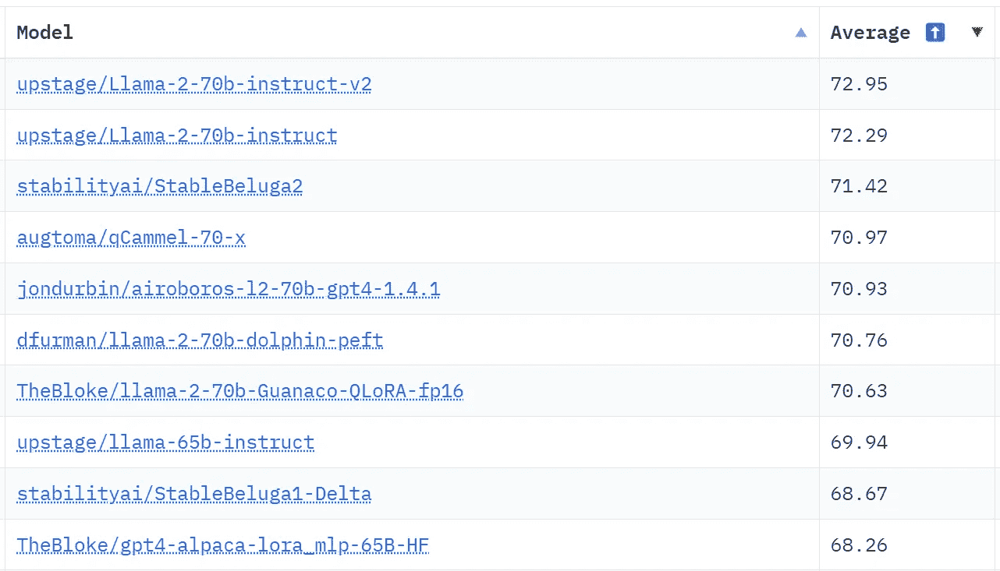

# 对开源大型语言模型的温馨介绍

> 原文：[`towardsdatascience.com/a-gentle-introduction-to-open-source-large-language-models-3643f5ca774`](https://towardsdatascience.com/a-gentle-introduction-to-open-source-large-language-models-3643f5ca774)

## 开放语言模型

## 为什么每个人都在谈论美洲驼、羊驼、猎鹰和其他动物

[](https://donatoriccio.medium.com/?source=post_page-----3643f5ca774--------------------------------)[](https://towardsdatascience.com/?source=post_page-----3643f5ca774--------------------------------) [Donato Riccio](https://donatoriccio.medium.com/?source=post_page-----3643f5ca774--------------------------------)

·发表于 [Towards Data Science](https://towardsdatascience.com/?source=post_page-----3643f5ca774--------------------------------) ·11 分钟阅读·2023 年 8 月 11 日

--


作者提供的图像（通过 Midjourney 生成）

除非你过去一年一直在过隐居生活，否则你已经见证了 ChatGPT 革命，以及大家似乎无法停止使用它的现象。在这篇文章中，我们将探索它的替代品，深入了解开源模型的世界。这是系列文章《开放语言模型》的第一篇，对希望入门并了解开源大型语言模型的人很有帮助，以及如何使用它们和为何使用它们。

# 目录

— 我们为什么需要开源模型？

— 越大越好？训练大型语言模型

— 微调大型语言模型

— 最佳开源大型语言模型

— 在你的计算机上运行大型语言模型

— 限制

— 结论

## 什么是大型语言模型？

一个**大型语言模型（LLM）**是一个能够理解和生成自然语言的人工智能。核心是一种叫做变换器的神经网络，它通过预测句子中下一个词来工作。词汇*大型*描述了这些模型的广泛性质，因为它们可以拥有数十亿甚至万亿个参数。它们的不同之处在于能够专注于特定任务，如代码生成或翻译，或应用于一般的指令跟随聊天机器人。这些模型的一个开创性方面是它们支持*零-shot*和*少-shot*学习，因为它们展示了前所未有的能力来学习未经过明确训练的任务。[1]

## **我们为什么需要开源模型？**

假设你使用 GPT API 创建了一个创新的应用程序，并迅速获得了关注。一切进展顺利，直到 OpenAI 改变了他们的行动计划。他们可能会停止服务、提高费用，甚至降低模型的能力——这已经在发生。[2]

目前，你唯一的解决方案是适应他们的新政策。此外，依赖第三方 API 会导致你的数据传输到他们的服务器。虽然 OpenAI 可能不会利用 GPT API 的数据进行模型训练，[3] 但**部署你自己的语言模型可以保证你对这些操作的完全控制**。即使这看起来是一个理想的计划，**部署你自己的 LLM 也有其自身的限制和挑战**，这些将在本文中讨论。


**（左）** 一只驼鹿。照片由 Sébastien Goldberg 拍摄 | **（中）** 一只美洲驼。照片由 Dušan veverkolog 拍摄 | **（右）** 一只羊驼。照片由 Adrian Dascal 拍摄。所有照片均来自 Unsplash。

## 越大越好？训练大型语言模型

如果你碰巧看到像**LLaMA 65B**这样的模型，你可能会想知道***65B***的含义。它简单地指的是模型中的参数数量。随着模型规模的增加，它需要更多的训练时间，并在推理时消耗更多的内存。与机器学习中的常见观点不同，复杂的模型可以更容易地泛化到不同的任务。有些模型的参数数量非常庞大：GPT-3 拥有 1750 亿，而 GPT-4 拥有超过 1 万亿。估计从零开始训练这些模型需要数百万美元。例如，**谷歌的 PaLM 540B 在 2240 个 GPU 上进行训练**[4]。相比之下，EfficientNet-B7 是最受欢迎的图像分类深度学习模型之一，仅有 6600 万个参数。


显然，这不是你可以在笔记本电脑上训练的模型。[5]

在 2022 年，谷歌声称：

> 随着模型规模的增加，性能在各个任务上得到提升，同时也解锁了新的能力。

在当前的 LLM 状态下，更多的参数通常意味着更好[4]。公司专注于构建更大的模型，但当前的开源趋势是创建更小、更高效的模型。虽然最受欢迎的开源模型通常有多达 70B 的参数，但在特定任务上，小型的、经过微调的模型表现可能优于更大的模型。此外，更大的模型在训练和推理时需要更多资源，部署起来也更具挑战性。

实际上，在一年内，连谷歌的观点也发生了变化。

> 开源模型更快、更可定制、更私密，而且在性价比方面更具优势。他们用 $100 和 13B 的参数做到了我们在 $10M 和 540B 的参数下都难以做到的事情。而且他们是在几周内完成的，而不是几个月。

从泄露的文档*我们没有护城河，OpenAI 也没有* [6]*，可以看出他们承认开源模型的惊人演变，这些模型通过使用更小、更便宜的模型迅速赶上了。


ChatGPT 对此反应良好。

多亏了过去一年开源社区的杰出工作，现在有了可用且免费的替代品。在谷歌的 PaLM 发布不到一年后，**LLaMA**也发布了；在论文中，作者声称他们最大的模型**LLaMA 65B**在许多任务上超越了 GPT-3（175B）和 PaLM（540B）[5]。

## 微调大型语言模型

LLMs 因其在单一框架内处理多种语言任务的多功能性而赢得了声誉。然而，你的特定应用可能要求模型在单一任务上表现出色。为此，你可以使用针对你的任务的数据集（例如文本摘要）来微调一个预训练的模型。令人着迷的是，即使数据集较小，也能取得良好的结果。尽管模型最初是用数十亿个文本片段进行训练的，你可能只需要 500 到 1000 个示例就能显著提高性能。


一个来自[Alpaca 数据集](https://github.com/gururise/AlpacaDataCleaned)的示例。该模型经过微调，以跟随用户给出的指令。

一种流行的技术是*指令微调*。这种方法涉及使用示例来训练模型，说明它应该如何响应特定的指令。这一过程的结果是一个指令模型——这是基模型的增强版本，在遵循指令方面表现出色，而不仅仅是完成文本。指令模型的例子包括**Alpaca**和**Vicuna**。

## 最佳开源大型语言模型

2023 年 2 月，Meta 的**LLaMA**模型以不同规模进入开源市场，包括 7B、13B、33B 和 65B。最初，该模型仅对研究人员开放，使用的是非商业许可证，但不到一周时间，它的权重就被泄露了。这一事件引发了开源大型语言模型（LLMs）领域的革命，因为其训练代码在 GPL 3 许可证下自由获取。因此，已经发布了几种强大的微调变体。

第一个是**Alpaca**，由斯坦福大学发布。该模型利用 GPT 生成的指令进行了 52K 示例的微调。紧随其后的是**Vicuna**，令人惊讶的是，它在许多任务中超越了 Alpaca，达到了 90%的 ChatGPT 质量。其显著特点是它是在 ShareGPT 数据上进行微调的。

在这些强大模型的基础上，新增了**GPT4All**——它受到使 LLMs 易于访问的愿景的启发，提供了一系列对消费者 CPU 友好的模型，并附带了一个互动 GUI 应用程序。

**WizardLM** 也加入了这些杰出的基于 LLaMa 的模型。通过一种名为 Evol-Instruct 的新颖独特的方法，它在复杂指令数据上进行了微调，并显示出与 ChatGPT 相似的表现，平均达到了 97.8%。

尽管如此，并不是所有最近的模型都基于 LLaMA。像 **MPT** 这样的模型以其变体能够生成多达惊人的 65k 上下文长度而闻名——一次生成整本书！

**Falcon** 也加入了这个趋势，提供了 7B 和 40B 两种变体。令人惊讶的是，它在 OpenLLM 排行榜上超越了 LLaMA，这要归功于其高质量的训练数据集 RefinedWeb。

然而，Falcon 在 HuggingFace 的 OpenLLM 排行榜上的统治地位并没有持续太久。2023 年 7 月，Meta 揭开了其著名模型的继任者 **LLaMa 2** 的面纱。这个下一代模型将其前身的令牌限制翻了一番，并将其上下文长度增加到 4K 令牌。同时，**llama-2-chat**——一个针对对话应用优化的版本——产生了重大影响。撰写本文时，**像 StableBeluga2、Airoboros 和 Guanaco 这样的 LLaMa 2 微调版本** 是最强大的开源大语言模型，主导了 [OpenLLM Leaderboard](https://huggingface.co/spaces/HuggingFaceH4/open_llm_leaderboard)。



[OpenLLM Leaderboard](https://huggingface.co/spaces/HuggingFaceH4/open_llm_leaderboard) 上的前 10 名模型大多基于 LLaMa 2。

如果你对某个模型感到好奇并且想尝试，最简单的方法可能是访问 HuggingFace 模型页面，然后打开一个使用该模型的 Space。它们是简单的 Gradio 界面，允许你向模型发送输入并接收输出。由于模型运行在他们的服务器上并且请求量很大，你通常需要排队等待一段时间。不过，鉴于他们的服务质量，等待几分钟也不是什么大问题。


HuggingFace Spaces 使尝试语言模型变得非常简单。作者提供的图片。

## **硬件要求和优化**

去年，你需要一个高端 GPU 才能在本地运行 LLM。即使是小型模型也需要大量内存，并且你必须将它们加载到显卡内存中。情况随着 [**llama.cpp**](https://github.com/ggerganov/llama.cpp)** 的发布发生了变化**。最初是 Facebook 的 LLaMA 模型在 C/C++ 中的移植，现在支持许多其他模型。它允许将 LLM 从 PyTorch 转换为 **GGML**，他们的新格式，允许在 CPU 上进行快速推理。由于用 C++ 编译，推理是多线程的。

> *得益于这一惊人的工作，现在可以在你的桌面电脑上，甚至在 MacBook 上运行许多 LLM。*

主要的限制是它们所消耗的内存。例如，一个 7B 模型的权重大约为 14GB。一个 65B 的模型将需要大约 130GB 的内存（RAM 和磁盘空间），这超过了我们大多数计算机的容量。幸运的是，有一种压缩它们的方法。

进入**量化**。

在每个机器学习模型中，参数是一个数字。这个数字通常表示为 float32，即 32 位（4 字节）表示。

由于每个参数占用两个字节的空间，一个具有 65B 参数的模型将占用大约**4*65*10⁹ = 260GB**的内存。

模型量化指的是通过使用舍入将模型参数表示为较低精度的数字，从而减少模型权重的想法。关于量化的数学细节，HuggingFace 博客上有一篇很棒的文章。[7]


8 位整数量化。[7]

作为一种压缩过程，量化会导致一定的性能损失。随着**LLM.int8()**及新技术的引入，这种损失已被大大减少，使得它成为 LLMs 的必备技术。

**Llama.cpp**支持高达 4 位整数量化。使用**Q4_0**，可以**将模型大小减少最多 4 倍**。


量化对模型困惑度和文件大小的影响。图片由作者提供。数据来自 llama.cpp GitHub 仓库。

**Q4_0**将文件大小**从 25.8GB 减少到 6.8GB**，同时将困惑度减少了约 2%。在 16GB 内存的计算机上可以加载一个 13B 模型，而如果你有 64GB 内存，你甚至可以运行最大的 70B 模型。


具有不同量化技术的 LLaMa 2 模型。[TheBloke](https://huggingface.co/TheBloke)的 HuggingFace 个人资料上有许多预训练模型。

另一个值得一提的量化技术是**GPTQ**，它可以将 VRAM 使用量减少多达 75%，同时保持准确性。[8] 它于 2023 年 3 月发布，使得第一次可以在单个 GPU 上运行 175B 模型。谈到消费级硬件，你可以用单张 RTX 3090 显卡运行最多 30B 的模型。

## 在你的计算机上运行大型语言模型

与 ChatGPT 最相似的体验是**GPT4All**应用程序，它是一个聊天界面，允许你与最喜欢的模型聊天。它不仅限于 GPT4All 模型，还支持许多最流行的模型。该应用程序可以在 Windows、Mac OS 和 Linux 上运行，并且完全开源。


在 Ryzen 5600 CPU 上进行 LLaMA-2 7B 推理。图片由作者提供。

另外，你可以使用像 [**text-generation-webui**](https://github.com/oobabooga/text-generation-webui) 或 [**openplayground**](https://github.com/nat/openplayground)** 这样的 GUI 工具。**虽然它们都提供了一个可以轻松生成文本的图形界面，但第一个可能是最完整的工具：它提供了许多功能，如聊天、训练、GPU 支持和 HTML/Markdown 输出等。第二个与 OpenAI 的 Playground 非常相似，是一个很好的工具，可以快速测试和比较不同参数的 LLM。


文本生成网页 UI 是一个使用 Gradio 构建的高级网页界面。

如果你想在 Python 中使用 LLM，有几个选项，比如 [**llama-cpp-python**](https://github.com/abetlen/llama-cpp-python) 或 **HuggingFace Transformers** 库，它提供了一种与任何 HF 模型交互的高级语法。它支持 PyTorch、Tensorflow 和 Jax 后端，可以与 HF 上找到的任何预训练模型一起使用，适用于文本、图像或音频。使用 transformers，与你喜欢的 LLM 生成文本就像编写两行代码一样简单：

```py
from transformers import pipeline
pipe = pipeline("text-generation", model="meta-llama/Llama-2-7b-chat-hf")
```

在 HF hub 上成千上万的免费模型中，有不同的格式。*Transformers* 库需要 **HF** 格式的模型，而 *llama.cpp* 需要 **GGML** 模型。

## 限制

尽管我们已经展示了大多数模型不需要强大的计算机，**可扩展性**仍然是你计划构建允许数百或数千名用户与模型互动的系统时首要考虑的问题。使用 GPT 的一个优势是 OpenAI 提供了便宜的、高速限制的 API，可以轻松地扩展你的应用。

另一个限制是 **安全性和管理**。由于你可能需要对模型的输出负责，你必须特别小心模型生成的内容。商业 LLM 具有使用强化学习与人类反馈 (RLHF) 构建的先进审查过滤器，用于限制有害内容。

使用前记得检查 **模型的许可证**。*开源* 并不总是意味着模型可以用于商业用途。

# 结论

这篇文章展示了开源模型是快速改进的可行和免费的替代方案。今年这些模型的发展取得了令人难以置信的进展，现在甚至可以在你的笔记本电脑上运行它们。

如果你正在考虑为下一个项目使用开源 LLM，希望你觉得这篇文章对你有用。系列中的后续文章将深入探讨 *开源语言模型* 的不同方面和挑战。

下次见！

*如果你喜欢这篇文章，加入* [***Text Generation***](https://textgeneration.substack.com/) *——我们的新闻通讯每周发布两篇文章，提供有关生成 AI 和大型语言模型的最新见解。*

*此外，你还可以在* [***LinkedIn***](https://www.linkedin.com/in/driccio/)***找到我。***

## 参考资料

[1] [斯坦福科学家发现，ChatGPT 确实变得更愚蠢了](https://futurism.com/the-byte/stanford-chatgpt-getting-dumber) (2023), (futurism.com)

[2] T. Brown 等人，[语言模型是少样本学习者](https://arxiv.org/abs/2005.14165) (2020), arXiv.org

[3] M. Schade，[您的数据如何用于提高模型性能](https://help.openai.com/en/articles/5722486-how-your-data-is-used-to-improve-model-performance) (2023), OpenAI 帮助中心

[4] Google AI 博客，[Pathways 语言模型 (PaLM): 扩展到 5400 亿参数以实现突破性性能](https://ai.googleblog.com/2022/04/pathways-language-model-palm-scaling-to.html) (2022), ai.googleblog.com

[5] A. Fan 等人，[LLaMA: 开放且高效的基础语言模型](https://arxiv.org/abs/2302.13971) (2023), arXiv.org

[6] D. Patel 和 A. Ahmad，[Google: 我们没有护城河（OpenAI 也没有）](https://www.semianalysis.com/p/google-we-have-no-moat-and-neither) (2023), semianalysis.com

[7] Y. Belkada 和 T. Dettmers，[使用 Hugging Face Transformers、Accelerate 和 bitsandbytes 对变换器进行大规模 8 位矩阵乘法的温和介绍](https://huggingface.co/blog/hf-bitsandbytes-integration) (2022), Hugging Face 博客

[8] E. Frantar 等人，[GPTQ: 生成预训练变换器的准确后训练量化](https://arxiv.org/abs/2210.17323) (2023), arXiv:2210.17323v2 [cs.LG]
