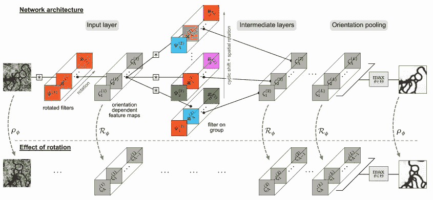
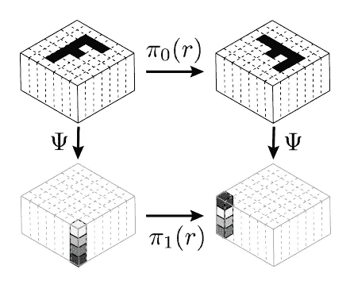

# 可调整神经网络的温和介绍（第一部分）

> 原文：[`towardsdatascience.com/a-gentle-introduction-to-steerable-neural-networks-part-1-32323d95b03f?source=collection_archive---------0-----------------------#2023-11-21`](https://towardsdatascience.com/a-gentle-introduction-to-steerable-neural-networks-part-1-32323d95b03f?source=collection_archive---------0-----------------------#2023-11-21)

## 什么是可调整神经网络及其背景

 [Matteo Ciprian](https://medium.com/@mat.cip43?source=post_page-----32323d95b03f--------------------------------)

·

[关注](https://medium.com/m/signin?actionUrl=https%3A%2F%2Fmedium.com%2F_%2Fsubscribe%2Fuser%2F975b976da56a&operation=register&redirect=https%3A%2F%2Ftowardsdatascience.com%2Fa-gentle-introduction-to-steerable-neural-networks-part-1-32323d95b03f&user=Matteo+Ciprian&userId=975b976da56a&source=post_page-975b976da56a----32323d95b03f---------------------post_header-----------) 发表在 [Towards Data Science](https://towardsdatascience.com/?source=post_page-----32323d95b03f--------------------------------) ·15 分钟阅读·2023 年 11 月 21 日

--

# 介绍

几何深度学习作为深度学习的一个分支，旨在扩展传统的 AI 框架，如卷积神经网络，以处理表示为图、流形或点云的三维或二维几何对象。通过直接将几何关系和空间依赖性整合到学习框架中，几何深度学习利用数据的固有结构特性，消除了对内存密集型数据增强技术的需求。出于所有这些原因，几何深度学习可以被视为在计算机视觉、自然语言处理等领域处理复杂数据场景的有价值工具。关于任务类型和转换类型，迄今已提出了大量新的 CNN 架构，如“球形神经网络” ([链接](https://arxiv.org/abs/1801.10130))， “图神经网络” ([链接](https://arxiv.org/pdf/1812.08434.pdf%2523:~:text=Graph%252520neural%252520networks%252520%28GNNs%2529%252520are,its%252520neighborhood%252520with%252520arbitrary%252520depth.)) 和 **“可转向神经网络”**。

> ***可转向神经网络*** *因其将常规卷积神经网络（CNNs）的能力扩展到新的领域而引起了广泛关注。这些网络可以被视为 CNNs 的演变，其中核被条件化以满足特定约束条件。虽然 CNNs 在对平移的等变性方面表现出色，但可转向神经网络通过提供增强的灵活性和捕获更广泛的转换，如旋转，而更进一步。*

**本教程** 将介绍“可转向神经网络”（S-CNNs）的简介，试图传达对其背后数学概念的直观理解以及如何设计这些网络的逐步解释。本**第一篇**文章作为介绍可转向神经网络的起点，解释其目的并深入探讨支持 S-CNNs 的概念和形式化。**第二篇**文章（[这里](https://medium.com/@mat.cip43/a-gentle-introduction-to-steerable-neural-networks-part-2-56dfc256b690)）在高层次上讨论了可转向滤波器的设计和整体可转向网络。

本工作旨在填补当前科学文献与更广泛数据科学受众之间的差距。它非常适合技术专业人士以及这一新的机器学习分支的研究人员。

来自论文[[3]](https://arxiv.org/abs/1711.07289)的一个简单可转向神经网络的示例。可以看到输入图像的旋转效果反映在网络输出响应中。

以下论文作为参考：

[1] “3D 可转向 CNN：在体积数据中学习旋转等变特征”，Weilier 等，([link](https://arxiv.org/abs/1807.02547));

[2] “可转向 CNN”，Cohen 等，([link](https://arxiv.org/abs/1612.08498));

[3] “学习用于旋转等变 CNN 的可转向滤波器”，Weilier 等，([link](https://arxiv.org/abs/1711.07289))

[4] “通用 E(2)-等变可转向 CNN” Weilier 等，([link](https://arxiv.org/abs/1911.08251))

[5] “适用于局部尺度不变卷积神经网络的尺度可转向滤波器”，Ghosh 等，([link](https://www.researchgate.net/publication/334480982_Scale_Steerable_Filters_for_the_Locally_Scale-Invariant_Convolutional_Neural_Network?enrichId=rgreq-7fc8b3654779eb94d36221a6e5fab2ff-XXX&enrichSource=Y292ZXJQYWdlOzMzNDQ4MDk4MjtBUzo3ODEyNTQ4ODI1MDg4MDBAMTU2MzI3NzA4NzY1NA%25253D%25253D&el=1_x_3&_esc=publicationCoverPdf))

[6] “构建 E(n)-等变可转向 CNN 的程序。” Cesa 等，([link](https://openreview.net/pdf?id=WE4qe9xlnQw))

# 什么是可转向神经网络：

可转向神经网络得名于它们使用的特定类型的滤波器。这些滤波器称为 g-*可转向滤波器*，它们的灵感来自于在图像识别领域中用于边缘检测或定向纹理分析的可转向滤波器，这些滤波器在[90 年代初](https://ieeexplore.ieee.org/document/93808)获得了广泛的应用。可转向通常指的是可操控的、可管理的、能够被控制的。按照这种惯例，可转向滤波器的响应是可定向的，并且可以适应输入的特定方向（例如一张图像）。可转向性与另一个非常重要的属性相关，这就是**等变性**。在等变滤波器中，如果滤波器的输入经过了一个精确且明确的几何变换 *g*（平移、旋转、移动），则输出（即输入与滤波器卷积的结果）也会经过相同的变换 *g*。通常，等变性并不要求变换（输入和输出的变换）是相同的。这个概念将在下一个段落中得到更好的阐述，但目前这使我们能够提供对可转向滤波器和可转向 CNN 的初步定义。

*一个* ***可转向 CNN 滤波器*** *可以定义为一个其内核结构为不同可转向滤波器的串联的滤波器。这些滤波器在* ***卷积操作*** *相对于一组定义明确的几何变换方面显示出等变性特性。*

正如我们稍后将看到的，卷积操作上的等变性条件导致对*内核结构及其权重*施加特定的约束。从这个定义中，现在可以定义什么是可转向 CNN：**可转向神经网络**是由一系列可转向滤波器组成的神经网络。

# S-CNN 的用途：

普通 CNN 的优势在于其对平移的等变性。然而，可导神经网络更加灵活，可以展示其他类型的变换，例如旋转。在旋转等变问题中，未经修改的 CNN 被迫学习相同滤波器的旋转版本，从而引入了冗余的自由度，并增加了过拟合的风险。

因此，可导 CNN 网络可以通过直接整合输入处几何变换的信息，优于经典 CNN。这一特性使得 S-CNN 在处理具有几何描述和表示的输入（如图像、流形或向量场）时特别有用。

可能的实际应用例如：

+   **挑战性的 2D 图像分割：** 给定输入显微镜图像预测细胞边界。

+   **3D 模型分类：** 对 3D 物体进行分类和识别。

+   **3D 化学结构分类：** 预测给定化学结构的分子 3D 化学结构。一个可能的例子是根据氨基酸序列预测其空间偏好，具体见论文的第 5.4 节 [[2]](https://arxiv.org/pdf/1807.02547.pdf)。

3D 可导神经网络在 3D 物体识别中的应用示例。输入物体（在顶部）以及两个不同隐藏层特征图的表示。摘自 [Link](https://www.youtube.com/watch?v=ENLJACPHSEA)

# 初步定义和背景

在介绍了可导神经网络及其应用后，让我们深入探讨它们背后的理论。本节提供了等变性和可导性的更正式解释，提供了理解后续文章中可导滤波器构造所需的基本定义和正式框架。

本文依赖于对映射和几何变换的理解，更多信息请参考这篇 文章。

## 1. 等变性：

等变性是对称问题中特别感兴趣的特性。如前所述，在等变模型中，当输入经过变换作用时，输出也会受到相应作用，从而使得变换的应用可以在模型应用之前或之后进行，而整体行为不发生变化。在日常环境中有许多等变性的例子。例如，驾驶时，当转动方向盘时，汽车的转向方向与汽车所指方向是等变的。形式上，如果我们有一个映射 𝛙: *X → Y*，其中 *X*⊂ℝᵈ 和 *Y*⊂ℝᵈ¹，以及 *g*，一个属于群体 *G* 的几何变换，𝛙 对 *G* 是等变的，如果：

Eq.1: 表示𝛙对 g 的等变性的数学方程。

其中*Π₀(g) : X → X’*和*Π₁(g): Y→ Y’*是由应用*g*到 x 确定的两个线性映射（例如，通常是通过乘法应用的矩阵）。下图提供了一个来自论文[[2](https://arxiv.org/abs/1612.08498)]的视觉示例。在图像中，*g*是旋转，具体为“*旋转-90°*”，因此被称为*r*。*Π₀(r)*在领域𝛙（=X）中操作，而*Π₁(r)*在𝛙（=Y）的值域中工作。

如果*X=ℝ²*，2 维笛卡尔空间，且 r 是“顺时针旋转 90°”的变换，则矩阵*Π₀(r)*将等于θ=π/2 的 2x2 欧拉矩阵。

应注意，如果𝛙对 G 是等变的，那么施加变换后再计算映射会产生与先计算映射再施加变换相同的结果，这一属性以前称为交换性。

Fig2A: 函数Ѱ对变换 r 等变的视觉示例。摘自文章[[2]](https://arxiv.org/abs/1612.08498)。

*此时还值得提到一个特例。* ***不变性***，一种特殊类型的等变性，其中*X=X’*和*Y=Y’*。无论输入如何变换，输出始终保持不变。从深度学习的角度来看，不变滤波器例如在物体识别中可能有用：无论输入图像如何旋转，滤波器的输出始终保持不变。需要注意的是，*X*和*Y*的空间可能不具有相同的维度，例如，如果我们试图确定图片中汽车的方向（*Y*作为 2 维向量）而*X*作为像素的 2 维数组，则变换*Π₁(g)*和*Π₀(g)*将不同，因为它们适用于不同的空间，即使它们共享相同的 g。

## 2. 可操控滤波器：

与汽车的可操控性相比，可操控滤波器稍微难以直观理解。然而，两者都共享实现对特定参数一致和可预测响应的基本目标——这种响应与滤波器本身的固有变换密切相关。

一个直观的例子可能如下：想象一下屋顶上的风向标，显示风的方向。与其为每种可能的风向安装单独的传感器（这是不切实际的），不如安装一个可以旋转以与当前风向对齐的风向标。可转向滤波器就像一个风向标，它根据输入信号中编码的方向自适应，而无需为每种可能的输入方向使用独立的传感器。同样，在图像处理中，可转向滤波器适应图像中的不同特征或方向，而无需为每种可能的输入方向使用独立的滤波器。这种方法为建模系统提供了智能和有效的方法。在机器学习的背景下，它使我们能够专注于构建有价值的模型，而不必担心增强或增加额外的权重以处理不同的方向。

尽管可转向性可以普遍应用于任何一组变换，我们将在此使用旋转来更正式地介绍这个概念。

让 𝛙: ℝᵈ →ℝᵈ¹ 成为其核函数为 **k** 的卷积映射。

对于 *x*∈ℝⁿ，给定一个依赖于 *x* 的输入信号 *f(x)* ∈ ℝᵈ，并且输出信号 *f*₁(*x*) ∈ ℝᵈ¹，我们可以写成：*f*₁(*x*)= 𝛙(*f(x)*)，这意味着 *f*₁(*x*)= *k(x)* ∗ *f(x)*。

如果对旋转的转向滤波器定义如下：

(1) 每个输出元素的卷积核 *k(x)* 可以表示为基函数 *ψⱼ(x)* 的和，其中 *j*=1,..M*。

(2) 通过任意角度 θ 旋转滤波器的 **g_θ** 可以用每个基函数的旋转表示（对于每个 θ 均适用）。数学上来说，这意味着：

Eq.2: 可转向滤波器的定义

由于这一特性，可以通过修改 *wⱼ* 的值来唯一定向滤波器对输入的响应。我们来举个例子。

在二维空间中，一个可定向单个可转向滤波器的最简单的例子是其核函数为 **二维高斯** 的方向导数。在这种情况下，*k: ℝ² →ℝ*，且 *x = (x₁,x₂)* ∈ ℝ²：

Eq.3: **二维高斯** 的方向导数（上）和函数 *k* R² →R 在 gθ 下的转换。

在接下来的几行中，我们将展示该滤波器按上述方式是可转向的。

从理论上我们知道，鉴于 *k* 的值域是 *ℝ*，我们可以将旋转后的滤波器写成 Eq.3（有关更多信息，请参见下一节中的 Eq.3）。

通过推导这个方程，我们可以展示其可转向性：

Eq.5: **二维高斯** 的方向导数可转向的数学证明

在这种情况下，我们应用了变换 ***g_θ*:** ℝ²→ℝ²，并且它由二维欧拉矩阵表示（见下文诱导表示）。如果我们计算 ***k(g_θ*** ⁻¹***(x₁,x₂))*,** 我们可以通过一些代数运算看到，这种冲激滤波器的通用旋转版本可以表示为两个基函数 ѱ*₁(x₁,x*₂*)* 和 ѱ₂*(x₁,x*₂*)* 的线性组合，系数由 θ 参数化。

如下方程（方程 6）所示，由于卷积的线性特性，输入函数 f 与θ旋转的冲激响应 **g_θ(k(x,y))=**k_θ 的卷积始终可以表示为 f 与 k 的单一基函数 ѱ*₁*、ѱ₂ 的卷积的线性组合。

方程 6：一个可转向滤波器与 f 的卷积。

这个公式突出了 *可转向滤波器在神经网络中的力量*。

通过引入这些滤波器，我们有可能构造一个可转向的核，它根据输入的方向“调整”其响应。每个基函数像一个多功能工具，允许网络使用学习到的权重‘w₁’和‘w₂’来高效地混合这些函数，以准确响应不同的方向。例如，当网络遇到具有不同方向的数据，如图像中的旋转物体时，它配置这些权重以使核的响应与输入数据的方向对齐。这种适应性提高了效率和效果，从而在参数更少的情况下达到相同或更好的结果。因此，这种方法可以作为使用可转向属性处理各种输入方向的更强大的 CNN 的基础。

在下一篇文章中，我们将进一步探讨这个问题，并了解如何使用可转向滤波器的概念来构建等变滤波器。

然而，在深入之前，一些定义将提供清晰度并帮助我们的讨论。因此，在下一段中我们引入了一些关于卷积的形式化内容。

## 3\. 形式化：

在这一部分，我们试图给读者提供一个所有分析元素的示意性解释。这种形式化将允许我们更正式地定义 CNN 及其在输入层操作的几何变换。这将使我们在下一篇 [文章](https://medium.com/@mat.cip43/a-gentle-introduction-to-steerable-neural-networks-part-3-56dfc256b690) 中理解可转向 CNN 的工作原理。

*元素：*

+   **一个空间 S**：分析发生的空间。虽然 S 可以扩展到任意数量的维度，但最容易在二维或三维空间中进行可视化。例如，如果我们考虑一幅图像，初始空间是二维的，对应于像素的坐标平面（ℤ²）。如果我们考虑一个“3D 物体”，那么空间 S 是三维的，ℤ³。因此，一个点 *x*∈S 确定了一个位置。

+   **一个输入函数 *f*:** 函数 *f:* S → *F₀ =* ℝ ͨ 描述了我们几何空间中的输入（它可以是流形或向量场）。这可以看作是从空间 S 到 ℝ ͨ 的一个函数，*其中每个位置 x 与“特征” f(x) 相关联，也称为* ***x 点的 f 的纤维***。举些例子，一个灰度图像可以看作是一个函数 *f:* ℝ² → ℝ，S=ℝ² *且* c=1。如果考虑一个彩色的 3D 流形，函数将是 *f:* ℝ³→ ℝ³，其中每个位置分配一个 RGB 颜色，S=ℝ³，c=3\。

    实际上，函数 *f* 通常表示为一些采样空间上的*纤维*的打包结构；对于标准格式的图像，纤维将水平和垂直地规则分布（即像素）。函数 f 构成了神经网络的输入层（见图 2A，图 2B）。从现在起，这个起始层将被称为 *F₀*。

+   **一组变换 G**: 一旦分析对象被适当地定义，我们可以定义网络应该保持等变性的变换集。单个变换 g∈G 总是可以被描述为与应用它的数学空间相关的函数。给定输入函数 *f:*S→ℝ ͨ*，* 可以表征 **π(g):** ℝ ͨ → ℝ ͨ，作为“*g 在 ℝ ͨ 中的诱导变换*”。*函数 *f 存在于 ℝ ͨ 中，但变换 g 操作在 S 空间中。**π(g)** 描述了 *f*（在 ℝ ͨ 中）在应用 g（在 S 中）下的变换。考虑 *g* 作为由两个组件 *r*（旋转）和 *t*（平移）组成的旋转-平移，一般来说，输入函数 *f(x)* 在变换 g 下的变换如 Eq.7 所述\。

    在下图中，如果 f 是一个向量场，**π(g)** 是一个 cxc 维度的矩阵，而**，** 如果 *f* 是一个标量场（*f:* ℝ² → ℝ），π(r) = 1。

    所考虑的变换组 G 通常是旋转（在这种情况下我们将讨论***SO(2)*** 网络）或旋转 + 平移（在这种情况下我们将讨论 ***SE(2)*** 网络）。类似地，在三维空间中，考虑 3D 刚体运动（***SO(3)*** 或 ***SE(3)***）。

图 2B: 变换 g 对标量场（左）或向量场（右）的应用的图形表示。摘自论文 [[3]](https://arxiv.org/abs/1911.08251)。

Eq.7: f 如何通过变换 g 应用于 x 而被变换

+   **特征图：** 根据第二点给出的 *f* 定义，神经网络每一层的输出可以看作是函数 *f ₙ* 在初始空间 S 上的应用结果。形式上可以表示为从 S 到对域空间 *Fₙ* 的函数，（ *f : S* → *Fₙ*），其中 *Fₙ*=ℝ ͨ ʿ*ⁿ* ʾ 和 c*ⁿ* 是层 *n* 的特征数量。如果以图 2B 为例，我们可以看到初始信号（输入）可以看作是函数 *f :* S=ℝ² → *F₀*= ℝ³。

    *f₁:* S=ℝ² → *F₁*= ℝ²。

+   **NN 滤波器 φn**: 滤波器可以定义为两个连续层之间的映射，如**φ*:****Fₙ→ Fₙ₊₁*。将这种滤波器应用于一层意味着与相应的内核*k*进行卷积。在这种情况下如何定义卷积对理解可导 NN 至关重要。因此，我们在下面专门讨论了这一点。

# NN 滤波器和卷积

在这种情况下，内核可以看作是一个函数 *k: S →* ℝ ͨ ʿ*ⁿ* ʾ ˟ ͨ ʿ*ⁿ⁺ ¹* ʾ，其中 *S 中的每个位置都连接到一个维度为 c*ʿ*ⁿ* ʾ ˟ cʿ*ⁿ⁺ ¹* ʾ 的矩阵。为了清晰起见，c*ⁿ* 和 c*ⁿ* ⁺ *¹* 分别是 *Fₙ* 和 *Fₙ₊₁* 的维度（特征数量）。

*我们可以定义卷积如下：*

Eq.8: 上方：连接层 n 和层 n+1 的关系。下方：空间 S 中的卷积定义

上面的方程 Eq.8 代表连接层 *n* 和 *n+1* 的函数；下面的是 n 维空间 S 中的卷积定义。函数 σ*(x)* 代表应用于卷积输出的非线性函数。

在图 2B 中，可以看到在离散域中，内核与输入层之间的卷积是如何计算的。我们用一个灰度图像 *f ₀*: ℝ² -> ℝ 来说明这一点。我们可以应用第二部分中讨论的滤波器，这是一个具有函数的可导滤波器。

*k(x₁, x₂)* 是一个定义为 *k:* ℝ² -> ℝ¹˟¹=ℝ 的 2D 高斯滤波器。

**在这种情况下，将滤波器 k 应用于*f*₀* 是经典的 2D 卷积，可以表示为：**

Eq.9: 卷积的定义

不同的是，在图 2B 中，你可以看到另一个例子，其中 *f ₀*: *ℝ²->* ℝ³（例如 rgb 图像）和 *f₁*: *ℝ²-> ℝ²* 以及 *k₀: ℝ²->* ℝ³˟ *²*。

**图 2B**: 如上定义的滤波器卷积的视觉示例，S=R²。F⁰是信号 f⁰存在的输入空间，在此案例中是 R³。可以注意到，卷积操作已被相关操作替代，如[[4]](https://arxiv.org/abs/1911.08251)中所建议。

综合我们迄今讨论的所有要点，可以在这一形式化框架内可视化神经网络。每个单独的特征图可以被解释为一个函数 *f: S → Fₙ*，其中 *Fₙ*= ℝʿⁿ ʾ 和 *f₀(x)* 代表网络的输入。滤波器的应用涉及与其在 Eq.8 中定义的核函数卷积。值得注意的是，到目前为止，主要的创新在于将 *f* 作为在位置空间 S 中操作的函数的几何表示，以及在这一空间内卷积的定义。

以下是我们提供的神经网络在这一背景下的表示：

Eq.10: 使用上述形式化表达的神经网络的符号表示。

我们将在下一篇[文章](https://medium.com/@mat.cip43/a-gentle-introduction-to-steerable-neural-networks-part-3-56dfc256b690)中了解这种形式化定义如何帮助我们设计可引导的 CNN 滤波器。

# 结论

在我们《可引导神经网络》教程的初始部分，我们已经建立了可引导神经网络、等变性和可引导滤波器的基本概念。还介绍了一个数学框架，为理解这些概念提供了严格的基础。等变性在变换下保持行为不变，而可引导滤波器能够智能地适应输入的方向。这一基础工作为设计等变 CNN 滤波器铺平了道路，增强了边缘检测和基于方向的识别。下一篇文章将利用这些概念更深入地探讨可引导 CNN 滤波器的机制，完成我们对这一强大神经网络范式的探索。

# ✍️ 📄. 关于作者：

***1️⃣ Matteo Ciprian***，机器学习工程师/研究员

+   帕多瓦大学电信工程硕士。当前从事传感器融合、信号处理和应用 AI 领域的工作。具有与 AI 在电子健康和可穿戴技术中的应用相关的项目经验（包括学术研究和企业领域）。专注于开发异常检测算法，以及推进深度学习和传感器融合技术。

    对哲学充满热情。YouTube 内容创作者。

    **🔗 链接：** 💼 [Linkedin](https://www.linkedin.com/in/matteo-ciprian-ba30ab122/)

    📹 [Youtube](https://www.youtube.com/channel/UCF--7G3kkCmEsdPLm8wyPow)

    👨‍💻[Instagram](https://www.instagram.com/cip_mat/)

2️⃣ ***Robert Schoonmaker***，信号处理/机器学习研究员

+   杜伦大学计算凝聚态物理博士。专注于应用机器学习和非线性统计，目前研究 GPU 计算方法在合成孔径雷达及类似系统中的应用。经验包括开发用于传感器融合和定位技术的对称机器学习方法。

    **🔗 链接：** 💼 [Linkedin](https://www.linkedin.com/in/robert-schoonmaker-951221b/)
