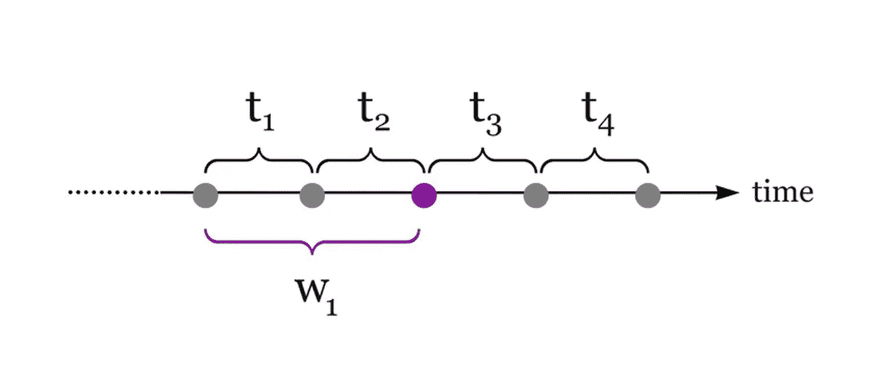

# 对分析流处理的温和介绍

> 原文：[`towardsdatascience.com/a-gentle-introduction-to-stream-processing-f47912a2a2ea?source=collection_archive---------13-----------------------#2023-03-31`](https://towardsdatascience.com/a-gentle-introduction-to-stream-processing-f47912a2a2ea?source=collection_archive---------13-----------------------#2023-03-31)

## 为工程师及其他相关人员构建心理模型

[](https://newfrontcreative.medium.com/?source=post_page-----f47912a2a2ea--------------------------------)[](https://towardsdatascience.com/?source=post_page-----f47912a2a2ea--------------------------------) [Scott Haines](https://newfrontcreative.medium.com/?source=post_page-----f47912a2a2ea--------------------------------)

·

[关注](https://medium.com/m/signin?actionUrl=https%3A%2F%2Fmedium.com%2F_%2Fsubscribe%2Fuser%2F3b4cab6af83e&operation=register&redirect=https%3A%2F%2Ftowardsdatascience.com%2Fa-gentle-introduction-to-stream-processing-f47912a2a2ea&user=Scott+Haines&userId=3b4cab6af83e&source=post_page-3b4cab6af83e----f47912a2a2ea---------------------post_header-----------) 发表在 [Towards Data Science](https://towardsdatascience.com/?source=post_page-----f47912a2a2ea--------------------------------) · 17 分钟阅读 · 2023 年 3 月 31 日[](https://medium.com/m/signin?actionUrl=https%3A%2F%2Fmedium.com%2F_%2Fvote%2Ftowards-data-science%2Ff47912a2a2ea&operation=register&redirect=https%3A%2F%2Ftowardsdatascience.com%2Fa-gentle-introduction-to-stream-processing-f47912a2a2ea&user=Scott+Haines&userId=3b4cab6af83e&source=-----f47912a2a2ea---------------------clap_footer-----------)

--

[](https://medium.com/m/signin?actionUrl=https%3A%2F%2Fmedium.com%2F_%2Fbookmark%2Fp%2Ff47912a2a2ea&operation=register&redirect=https%3A%2F%2Ftowardsdatascience.com%2Fa-gentle-introduction-to-stream-processing-f47912a2a2ea&source=-----f47912a2a2ea---------------------bookmark_footer-----------)

流处理可以被温柔而细致地处理，也可以被狂野而几乎失控地处理！你可以判断你更愿意拥抱哪种未来。来源：[@psalms](https://unsplash.com/@psalms) [原始照片](https://unsplash.com/photos/o3Ggpo3BvqM)

# 介绍

在许多情况下，将数据流中或实时可用的数据进行处理，可以将由于数据流量和规模而导致的庞大数据问题，转化为更可管理的问题。通过更频繁地处理较小的数据集，你可以有效地解决那些可能因成本和时间限制而难以处理的数据问题。

> 从批处理思维转变为流处理思维虽然也可能很棘手，所以让我们从小做起，逐步构建。

## 从庞大的数据回到大数据

假设你负责构建一个分析应用程序，该应用程序必须处理大约*10 亿个事件*（1,000,000,000）每天。虽然这在开始时可能感觉难以实现，但由于数据的巨大规模，通常有助于退后一步，思考应用程序的意图（它做了什么？）和你正在处理的内容（数据是什么样的）？问问自己事件数据是否可以被分解（划分和分区）并作为流处理操作（即流内）并行处理，还是必须通过多个步骤串行处理？无论哪种情况，如果你将应用程序的视角修改为查看有限的时间窗口，那么你现在只需要创建一个可以摄取和处理仅*每秒 11,500 个事件（k）*（或者如果事件流是恒定的，则每分钟约 695k 个事件）的应用程序，这是一个更容易理解的数字。

虽然这些数字仍然可能显得难以触及，但这正是分布式流处理真正发挥光芒的地方。从本质上讲，你是在减少问题的视角或范围，以在时间上跨越分区数据集实现目标。虽然并非所有问题都能在流处理中解决，但许多问题确实适合这种处理模式。

***注意****：本章是我书中的一部分* [*“现代数据工程与 Apache Spark：构建关键流应用程序的实用指南”*](https://www.amazon.com/Modern-Engineering-Apache-Spark-Hands/dp/1484274512)*。本书带你从简单的脚本编写，到应用程序的构建，最后到部署和监控你的关键 Apache Spark 应用程序。*

# 本章学习内容

本章将作为流处理的温和介绍，为我们直接进入[第十章](https://github.com/newfront/spark-moderndataengineering/tree/main/ch-10)构建自己的端到端结构化流应用程序做好准备，而无需回顾和讨论许多决策过程背后的理论。

到本章结束时，你应该能高层次地理解以下内容：

1.  如何减少流数据问题中的*时间问题*

1.  时间、时间戳和事件视角的问题

1.  从批处理到流处理思维模型的不同处理模式

# 流处理

流数据是*非静态的*。事实上，你可以将其视为活跃的（即使只是短时间）。这是因为流数据是捕捉*当前时刻的事件和动作的*数据。让我们来看一个实际的，尽管是理论上的例子，它从一个简单的传感器数据流开始。把你最后一次访问的停车场（或停车库）固定在你的脑海中。

# 用例：实时停车可用性


停车是个噩梦：大多数停车基础设施的问题，或客户的常见痛点，往往是在确保按时到达的情况下找到一个可用的车位。[照片来自 Unspash](https://unsplash.com/photos/k1AFA4N8O0g) 和 [@ryansearle](https://unsplash.com/@ryansearle)

想象一下，你刚刚找到一个停车位，感谢一些有用的标志指引你到一个空车位。现在假设这一切都因为来自连接的本地停车传感器网络的数据。传感器的唯一目的是*用于识别此时此刻可用停车位的数量*。

这是一个实时数据问题，实时准确性既可以测量，也可以由停车结构的用户实际感受到。这些能力的实现始于系统场景的声明。

> **产品推广**：“我们希望创建一个系统来跟踪所有可用停车位的状态，识别何时有车辆停车、车辆在特定车位停留多久，并且尽可能地自动化这个过程”

优化这样的系统可以从*一个简单的传感器*开始，该传感器位于每个停车位（与传感器.id / 车位.id 参考关联）。每个传感器负责以**事件**的形式发出数据，包含车位标识符、时间戳和简单的位（0 或 1），以表示车位是空的还是被占用。然后，这些数据可以编码为紧凑的消息格式，如示例 9–1，并定期从每个停车位高效地发送。

**示例 9–1**. 为了清晰起见，展示了一个示例传感器事件（封装在[Google Protocol Buffer](https://protobuf.dev/)消息格式中）。

```py
message ParkingSensorStatus {
  uint32 sensor_id = 1;
  uint32 space_id = 2;
  uint64 timestamp = 3;
  bool available = 4;
}
```

在一天的正常交通流中，传感器的**状态**（停车位的可用性）会根据车辆到达或离开每个车位而开或关（**二进制状态**）。由于每个驾驶员的动态日程，这种行为是不可预测的，但随着规模的扩大，模式总是会显现出来。

利用收集的传感器数据提供的实时状态，可以轻松构建实时的、现实生活中的（IRL）“报告”，以便更新驾驶员停车结构的活动状态：停车基础设施是否已满，如果未满，则车库中*目前有 X 个可用车位*。

## 传感器数据的作用

这些数据可以帮助自动化*人类决策过程*，甚至可以通过简单的网络服务在线提供，以便实时跟踪状态，因为最终驾驶员只是想尽快停车，而不是浪费时间！此外，这些数据还可以用于跟踪每个传感器上次检查的时间（刷新），这可以用来诊断故障传感器，甚至跟踪传感器离线或故障的频率。

现在，技术更先进的车库甚至能够通过指示牌和提示引导驾驶员到结构内的空车位。这既减少了车库间的交通和拥堵，又提高了顾客满意度，所有这一切只需捕捉实时的传感器数据流并进行近实时处理。

## 高峰定价和数据驱动决策

根据从这些传感器事件流中收集的时间（时间戳）信息，一个精明的车库运营者可以利用先前的趋势来实时减少或增加每日或每小时的价格，这取决于对车位的需求，考虑到当前的可用性（剩余车位数）。通过优化定价（在现实限制范围内），运营者可以找到一个完美的阈值，使得每小时/每日价格能使车库更多时间达到满员。换句话说，*“以什么价格大多数人愿意停车且车位不会空置？”*。

这是一个优化问题的例子，源于实时传感器数据的收集。组织越来越常见地查看如何重用数据来同时解决多个问题。*物联网*（IOT）用例只是你在编写流应用程序时可能处理的众多数据流中的一种。

在书中早些时候，我们讨论了“创建一个系统，可以获取咖啡店的占用信息，以告知人们离他们最近的店铺是否有适合他们人数的座位”。在故事中的那个阶段，我们只是创建了一个合成表来展示这个例子，但这也是一个可以用传感器或简单的签到系统解决的问题，该系统发出相关事件数据，通过我们的流数据管道可靠地传递下游。

这里讨论的两个例子（停车基础设施和咖啡帝国扩展）都采用了基本的分析（统计），并可以从简单的机器学习中受益，以发现新的行为模式，从而实现更优的操作。在我们过于深入之前，先休息一下，深入了解流数据网络提供的功能。

# 时间序列数据和事件流

从一个关于固定视图或时间点的静态数据思维方式，转变为一个将数据视为在时间中流动的视角，涉及到对许多视图和时间点中无限数据流的解释，这是一个视角上的练习，但起初可能具有挑战性。通常，当你考虑流式系统时，连续事件流的概念会浮现出来。这是一个更常见的用例，可以作为对*流数据*概念的温和引入。例如，**图 9–1**中所示的抽象时间序列。



**图 9–1**：事件发生在精确的时间点，可以单独收集和处理（t1->t4），也可以在时间窗口（w1）中聚合。图片来源：作者（Scott Haines）

正如你所看到的，数据本身在不同的状态下存在，取决于系统（或应用程序）应用的视角或观点。每个事件（T1->T4）只在其狭窄的参考范围内理解*发生了什么*，或者换句话说，事件捕捉了*时间*的有限（相对）视角。当一系列事件在一个有界集合（窗口）中一起处理时，你会得到一系列数据点（事件），这些数据点要么*完全实现的概念*，要么*部分实现的概念*。当你缩小视角并查看整个时间线时，你可以更准确地描绘从第一个事件到最后一个事件发生的故事。

让我们进一步探讨这个想法。

# 事件是否独立存在？

考虑这个简单的事实。你的事件数据存在于完整的概念中，或作为部分概念或思想。我发现将数据视为一个随时间变化的故事有助于赋予这些数据字节以生命。因此，每个数据点负责帮助构建一个完整的故事，*作为一系列随时间展开或呈现的交织思想和观念*。

数据组合是一个有用的视角，适用于你在采用分布式数据视图时。我还发现它在构建和定义新的分布式数据模型时很有用，同时在处理大规模的现实世界数据网络（织物）时也很有帮助。作为一种组合来看待，这些事件汇聚在一起讲述了*一个特定的故事*，这些基于事件的痕迹可以揭示事物发生的顺序，并通过每次事件的时间戳得到极大的增强。没有时间的事件描绘了一个平面的发生过程，而时间的加入赋予了你关于动量或速度的概念，或者在事件之间的时间延续和拉伸，或者对于一系列数据点的完整过程。理解数据在许多管道和数据通道中流动的行为对数据操作至关重要，并且需要可靠的监控以保持数据在最佳速度下流动。

让我们来看一个用例，其中时间维度帮助讲述一个现实世界场景的更好故事。

# 用例：追踪客户满意度


一家安静的咖啡店，每杯咖啡都倾注爱心。照片由 [Nafinia Putra](https://unsplash.com/@nputra?utm_source=medium&utm_medium=referral) 提供，来源于 [Unsplash](https://unsplash.com/?utm_source=medium&utm_medium=referral)

> 设想你是一个数据工程师，与一个名为“CoffeeCo”的虚拟咖啡帝国的数据应用特性团队合作，讨论的是哪些数据能够描述客户满意度随时间变化的故事（时间序列分析）。

如果我告诉你***两位客户***进入我们的咖啡店，点了饮料并带着饮料离开了店里。你可能会问我为什么要告诉你这些，因为这正是咖啡店里发生的事情。如果我告诉你这两个咖啡订单是在***差不多同时*** 下的，并且*故事中的第一位客户在咖啡店待了不到五分钟*。如果我告诉你这是**一个工作日**，且这个故事发生在**早高峰时段**？如果我告诉你第二位客户，恰好排在第一位客户之后，在咖啡店里待了三十分钟？你可能会问这个客户是否在读报纸或者使用设施。*这两个问题都是合理的*。

如果我告诉你第二位客户因为在四步**咖啡生产线**的*第 3 步和第 4 步之间*发生错误而等待，那么我们将更好地理解如何在未来简化客户体验。

四个步骤是：

1\. **客户订单**: {customer.order:initialized}

2\. **付款完成** {**customer.order:payment:processed}

3\. **订单排队**: {customer.order:queued}

4\. **订单完成**: {customer.order:fulfilled}

无论错误是在自动化过程中，还是由于现实世界系统的故障（如打印机卡纸、咖啡师漏单或其他任何原因），结果是客户需要插手（人工干预），并通知操作系统（咖啡生产线）*“似乎有人忘记制作我的饮料”*。

此时讨论可能会转向如何处理客户的情绪反应，这些反应可能在积极和消极之间大幅波动：从乐于助人（1），到轻微的挫折（4），再到对咖啡生产线的延迟和故障的明显愤怒（10）。但通过分析一个假设的用例，我们现在对如何利用捕捉好数据的艺术有了更深入的了解。

## 事件时间、事件捕捉顺序和事件间的延迟都讲述了一个故事

如果不了解从第一个事件（customer.order:initialized）到终端事件（customer.order:fulfilled）之间的*时间经过了多久*，或者每个步骤通常需要多长时间来完成，我们将无法对体验进行评分或真正理解发生了什么，基本上就会在系统中创造出对异常延迟或故障的盲点。了解客户通常等待不同大小订单的时间的统计数据（平均值、中位数和 99 百分位数）是有益的，因为这些历史数据点可以通过自动化用于预先解决问题，例如当一个订单的处理时间比预期的要长时。这可能意味着客户的不满和终身客户之间的差别。

这是公司请求客户反馈的主要原因之一——无论是对体验的好评/差评，奖励基于应用程序的参与（用你的积分换取免费商品和服务），还是跟踪实时反馈，比如“你的订单比预期的时间长，这里有$2 折扣下次咖啡使用。只需使用应用程序兑换”。这些通过现实世界互动收集和捕获的数据，以事件形式编码，并为你的利益处理，最终是值得的，如果它积极影响公司的运营和声誉。只要确保遵循数据隐私规则和法规，最终不要让客户感到不适。

这个小小的思想实验旨在揭示事件数据中捕获的细节（以及数据故事随时间的演变）可以是一个游戏规则改变者，并进一步说明时间是赋予这些旅程动力或速度的维度。只有一个时间的问题。

# 时间的麻烦

虽然事件发生在*精确的时间点*，但时间的问题在于它也受时间和空间（位置）问题的影响。爱因斯坦利用他的相对论理论在宇宙尺度上解释了这个问题，但在更局部的尺度上这也是一个问题。例如，我有家人住在美国不同的地方。在大家的*时间协调*上可能会有困难，这种情况发生在简单的事件中，比如远程视频聊天或在现实世界中聚会。即使一切都已协调好，人们也习惯于*稍微迟到*。

从我的家庭或一般人的角度看，关于事件的中心协调问题，你会开始看到这个问题不仅仅是跨时区（东部/中部或西海岸）的同步问题，而是如果你更仔细地看，时间相对于我们的本地/物理空间，会受到一定的时间漂移或时钟偏差的影响。

以现代数字时钟为例。它作为一个过程运行在你的智能手机、手表或众多“智能”连接设备中。保持不变的是时间始终明显同步（即使漂移的范围是毫秒级）。许多人仍然使用模拟的非数字时钟。这些设备的准确度从高端手表（“计时器”）的极度准确到需要每几天重新校准的便宜时钟不等。

关键点在于，两个系统在精确时间上达成一致的情况很少，就像两个人在时间和空间上协调类似问题一样。因此，必须使用一个中央参考点（视角）来同步跨多个时区运行的系统的时间。

## **时间校正**

在任何现代云基础设施中运行的服务器都利用一个称为[网络时间协议](https://en.wikipedia.org/wiki/Network_Time_Protocol)（NTP）的过程来校正时间漂移的问题。*ntp*过程负责使用一个可靠的中央时间服务器同步本地服务器时钟。这个过程将本地时间校正到与协调世界时间（UTC）相差几毫秒。这是一个重要的概念，因为在大型网络中运行的应用程序，产生事件数据，将负责创建时间戳，而这些时间戳需要非常精确，以便分布式事件能够对齐。还有一个狡猾的问题是夏令时（每 6 个月增加或减少一小时），因此，协调跨时区以及跨本地日期时间语义（全球）的系统数据需要从这个中央、同步的视角来看待时间。

我们已经从理论上看过时间如何与事件驱动的数据相关，但为了全面了解背景，我们还应该考虑时间如何与数据在系统（无论是流式还是其他）中需要被捕获和处理的*优先级*相关。

# 优先级排序事件处理模式

你可能对这句名言很熟悉：“时间就是生命。”这句话的意思是某事很重要，是首要任务。解决问题的速度至关重要。这种优先级感可以作为一个工具或定义指标，用来为*实时*、*接近实时*、*批处理*或*最终处理（按需处理）*的数据处理方式辩护。这四种处理模式以不同的方式处理时间，通过对数据问题施加窄或宽的焦点来应对。这里的范围是基于一个过程必须完成的速度，这反过来限制了工作的复杂性作为时间的一个因素。可以把这些处理风格看作是以截止日期驱动的，完成一个动作的时间是有限的。

# 实时处理

实时系统的期望是，从上游系统发出事件的时间到该事件被处理并可用于分析和洞察的时间，端到端延迟应在毫秒到低秒级别内。这些事件直接写入事件流处理服务，如 Apache Kafka，在正常情况下，允许监听者（消费者）一旦写入事件就能立即使用。真正的实时系统有许多典型用例，包括物流（如停车位示例以及在咖啡馆找到桌子），以及影响整个业务的过程，如欺诈检测、主动网络入侵检测或其他坏演员检测，其中检测的平均时间（毫秒/秒到检测）越长，可能会导致声誉、财务或两者的灾难性后果。

对于其他系统而言，运行在近实时状态是完全可以接受的。考虑到解决难题需要时间，实时决策需要高效、预计算或低延迟的答案。这确实是纯内存流处理。

# 近实时处理

近实时是大多数人在考虑实时时的想法。这里发生的模式类似于你刚刚在实时部分阅读的，唯一的区别是端到端延迟的期望放宽到高秒级别到几分钟。对于大多数系统而言，没有真正的理由对每个到达的事件做出立即反应，因此，虽然时间仍然很重要，但数据可用性的 SLA 优先级会有所延长。

操作仪表板和度量系统通常更新迅速（每 30 秒—5 分钟刷新图表和检查监控），足够快以捕捉问题，并给出接近现实的表示。对于所有其他数据系统，你会有批处理或按需处理的概念。

# 批处理

我们在前两章中涵盖了批处理和周期性调度，但为了明确，将数据从可靠的真实数据源（数据湖或数据库）推送到其他连接系统的周期性作业，一直以来都是世界数据处理的主要方式。

这背后的简单原因是成本。这涉及到操作成本和维护大型流媒体系统的人力成本。

流处理系统要求全天候访问从 CPU 和 GPU 到网络 IO 和 RAM 的可变数量资源，期望这些资源不会短缺，因为流处理中的延迟（阻塞）可能会迅速积累。另一方面，批处理在长期维护上可能更容易，只要数据的消费者理解从数据首次发出到下游数据可用之间始终存在间隔。

最后需要考虑的是按需处理（或即时处理）。

# 按需或即时处理

说实话，有些问题（即查询）问得非常少，或者以一种不适合任何预定义模式的方式提出。

例如，自定义报告任务和探索性数据分析是两种适合这些范式的数据访问风格。大多数情况下，回答这些查询的后端数据直接从数据湖中加载，然后使用共享计算资源或隔离计算集群进行处理。为这些查询提供的数据可能是其他实时或接近实时系统的副产品，这些系统被处理和存储用于批处理或历史分析。

使用这种模式，数据可以解冻，并通过将记录从较慢的对象存储（如 Amazon S3）导入内存，或通过快速访问的固态硬盘（SSD），或者根据数据的大小、格式和布局，直接从云对象存储中查询。这种模式可以轻松委托给 Apache Spark，使用*SparkSQL*。这使得通过像 Apache Zeppelin 这样的工具进行临时分析成为可能，或通过 JDBC 绑定直接在应用程序中使用[Apache Spark thrift-server](https://spark.apache.org/docs/latest/sql-distributed-sql-engine.html)和 Apache Hive Metastore。

这四种处理方式之间的区别在于*时间*。

回到视角和观点的概念，每种方法或模式都有其*时间和地点*。流处理处理的是在特定*时间点*捕获的事件，正如我们在本章前半部分讨论的那样，我们如何关联时间，以及我们如何捕捉和测量一系列事件（作为数据），共同绘制了当前发生的情况或过去发生的情况的画面。在我们对流处理的温和介绍中，重要的是还要讨论流处理的基础。在下一节中，我们将讨论处理连续、无界数据流的一些常见问题和解决方案。因此，讨论数据作为核心支柱并从那里扩展开来是有意义的。

希望你喜欢第九章的前半部分。如果你想继续阅读第二部分，它在下面有链接。👇

[## 谦逊的分析流处理介绍](https://towardsdatascience.com/a-modest-introduction-to-analytical-stream-processing-db58b3694263?source=post_page-----f47912a2a2ea--------------------------------)

### 构建可靠分布式系统的架构基础。

[前往数据科学](https://towardsdatascience.com/a-modest-introduction-to-analytical-stream-processing-db58b3694263?source=post_page-----f47912a2a2ea--------------------------------)

如果你想了解更多，请查看我的书！

[现代数据工程与 Apache Spark：构建关键任务流处理的实用指南](https://www.amazon.com/Modern-Engineering-Apache-Spark-Hands/dp/1484274512?source=post_page-----f47912a2a2ea--------------------------------)

### 亚马逊网站：现代数据工程与 Apache Spark：构建关键任务流处理的实用指南…

[www.amazon.com](https://www.amazon.com/Modern-Engineering-Apache-Spark-Hands/dp/1484274512?source=post_page-----f47912a2a2ea--------------------------------)
