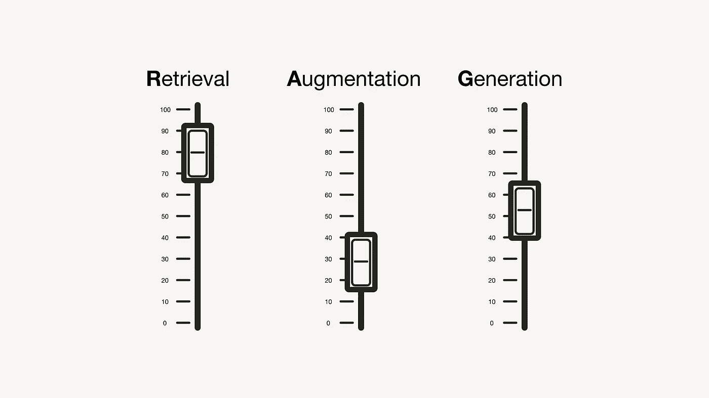
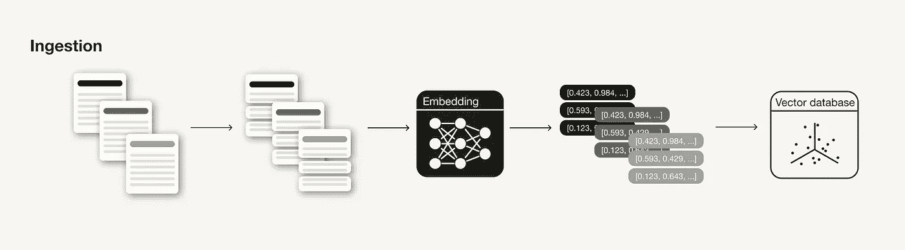
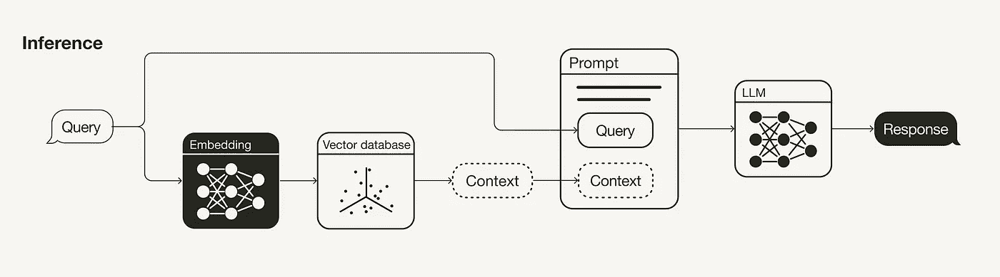

# 《生产就绪的 RAG 应用的 12 种调整策略指南》

> 原文：[`towardsdatascience.com/a-guide-on-12-tuning-strategies-for-production-ready-rag-applications-7ca646833439?source=collection_archive---------0-----------------------#2023-12-06`](https://towardsdatascience.com/a-guide-on-12-tuning-strategies-for-production-ready-rag-applications-7ca646833439?source=collection_archive---------0-----------------------#2023-12-06)

## 如何通过这些“超参数”和调整策略来提升你的检索增强生成（RAG）管道的性能

[](https://medium.com/@iamleonie?source=post_page-----7ca646833439--------------------------------)[](https://towardsdatascience.com/?source=post_page-----7ca646833439--------------------------------) [Leonie Monigatti](https://medium.com/@iamleonie?source=post_page-----7ca646833439--------------------------------)

·

[关注](https://medium.com/m/signin?actionUrl=https%3A%2F%2Fmedium.com%2F_%2Fsubscribe%2Fuser%2F3a38da70d8dc&operation=register&redirect=https%3A%2F%2Ftowardsdatascience.com%2Fa-guide-on-12-tuning-strategies-for-production-ready-rag-applications-7ca646833439&user=Leonie+Monigatti&userId=3a38da70d8dc&source=post_page-3a38da70d8dc----7ca646833439---------------------post_header-----------) 发布于 [Towards Data Science](https://towardsdatascience.com/?source=post_page-----7ca646833439--------------------------------) · 10 min 阅读 · 2023 年 12 月 6 日 [](https://medium.com/m/signin?actionUrl=https%3A%2F%2Fmedium.com%2F_%2Fvote%2Ftowards-data-science%2F7ca646833439&operation=register&redirect=https%3A%2F%2Ftowardsdatascience.com%2Fa-guide-on-12-tuning-strategies-for-production-ready-rag-applications-7ca646833439&user=Leonie+Monigatti&userId=3a38da70d8dc&source=-----7ca646833439---------------------clap_footer-----------)

--

[](https://medium.com/m/signin?actionUrl=https%3A%2F%2Fmedium.com%2F_%2Fbookmark%2Fp%2F7ca646833439&operation=register&redirect=https%3A%2F%2Ftowardsdatascience.com%2Fa-guide-on-12-tuning-strategies-for-production-ready-rag-applications-7ca646833439&source=-----7ca646833439---------------------bookmark_footer-----------)

《检索增强生成（RAG）应用的调整策略》

数据科学是一门实验性科学。它以“无免费午餐定理”开始，该定理指出，没有一种万能的算法可以适用于所有问题。这导致数据科学家使用[实验跟踪系统](https://medium.com/@iamleonie/intro-to-mlops-experiment-tracking-for-machine-learning-858e432bd133)来帮助他们[调整机器学习（ML）项目的超参数，以实现最佳性能](https://medium.com/towards-data-science/intermediate-deep-learning-with-transfer-learning-f1aba5a814f).

本文从数据科学家的角度审视了[检索增强生成（RAG）管道](https://medium.com/towards-data-science/retrieval-augmented-generation-rag-from-theory-to-langchain-implementation-4e9bd5f6a4f2)。讨论了可以实验的潜在“超参数”以提高 RAG 管道的性能。类似于深度学习中的实验，在深度学习中，例如，数据增强技术不是超参数，而是一个可以调整和实验的控制旋钮，本文还将涵盖可以应用的不同策略，这些策略本身不一定是超参数。

[](/retrieval-augmented-generation-rag-from-theory-to-langchain-implementation-4e9bd5f6a4f2?source=post_page-----7ca646833439--------------------------------) ## 检索增强生成（RAG）：从理论到 LangChain 实现

### 从原始学术论文的理论到使用 OpenAI、Weaviate 和 LangChain 的 Python 实现

towardsdatascience.com

本文涵盖了按相关阶段排序的“超参数”。在 RAG 管道的吞吐阶段，你可以通过以下方法实现性能提升：

+   数据清洗

+   数据分块

+   嵌入模型

+   元数据

+   多索引

+   索引算法

在推理阶段（检索和生成），你可以调整：

+   查询转换

+   检索参数

+   高级检索策略

+   重新排序模型

+   大型语言模型（LLMs）

+   提示工程

请注意，本文涵盖了 RAG 的文本使用案例。对于多模态 RAG 应用，可能需要不同的考虑因素。

# 吞吐阶段

吞吐阶段是构建 RAG 管道的准备步骤，类似于 ML 管道中的数据清洗和预处理步骤。通常，吞吐阶段包括以下步骤：

1.  收集数据

1.  数据分块

1.  生成数据块的向量嵌入

1.  在向量数据库中存储向量嵌入和数据块



RAG 管道的吞吐阶段

本节讨论了在推理阶段可以应用和调整的有影响力的技术和超参数，以提高检索到的上下文的相关性。

## 数据清洗

像任何数据科学管道一样，你的数据质量对 RAG 管道的结果有着重要影响[8, 9]。在进行以下步骤之前，确保你的数据符合以下标准：

+   **清洁**：应用至少一些自然语言处理常用的基本数据清理技术，如确保所有特殊字符都正确编码。

+   **正确**：确保你的信息一致且事实准确，以避免信息冲突让你的 LLM 感到困惑。

## 分块

在 RAG 管道中，分块你的文档是对外部知识源的一个关键准备步骤，可能会影响性能[1, 8, 9]。这是一种生成逻辑上连贯的信息片段的技术，通常通过将长文档拆分成较小的部分（但也可以将较小的片段合并成连贯的段落）。

你需要考虑的一个方面是**分块技术的选择**。例如，在[LangChain 中，不同的文本分割器](https://python.langchain.com/docs/modules/data_connection/document_transformers/)根据不同的逻辑拆分文档，如按字符、标记等。这取决于你拥有的数据类型。例如，如果你的输入数据是代码与 Markdown 文件，你将需要使用不同的分块技术。

理想的**块长度（**`**chunk_size**`**）**取决于你的使用场景：如果你的使用场景是问答，你可能需要较短的具体块；但如果你的使用场景是摘要，你可能需要较长的块。此外，如果块太短，可能包含的上下文不够。另一方面，如果块太长，可能包含过多的无关信息。

此外，你还需要考虑**块之间的“滚动窗口”（**`**overlap**`**）**以引入一些额外的上下文。

## 嵌入模型

嵌入模型是你检索的核心。**嵌入的质量**对检索结果有着重大影响[1, 4]。通常，生成的嵌入维度越高，嵌入的精度也越高。

关于可用的替代嵌入模型，你可以查看[MASSIVE TEXT EMBEDDING BENCHMARK (MTEB)排行榜](https://huggingface.co/spaces/mteb/leaderboard)，该排行榜涵盖了 164 种文本嵌入模型（截至本文撰写时）。

[](https://huggingface.co/spaces/mteb/leaderboard?source=post_page-----7ca646833439--------------------------------) [## MTEB 排行榜 - 由 mteb 提供的 Hugging Face 空间

### 发现社区制作的精彩 ML 应用

huggingface.co](https://huggingface.co/spaces/mteb/leaderboard?source=post_page-----7ca646833439--------------------------------)

虽然你可以直接使用通用的嵌入模型，但在某些情况下，**对你的嵌入模型进行微调**可能更有意义，以避免之后出现领域外的问题 [9]。根据 LlamaIndex 进行的实验，微调你的嵌入模型可以导致[检索评估指标性能提高 5–10%](https://github.com/run-llama/finetune-embedding/blob/main/evaluate.ipynb) [2]。

请注意，并非所有嵌入模型都可以微调（例如，[OpenAI 的](https://platform.openai.com/docs/guides/fine-tuning) `[text-embedding-ada-002](https://platform.openai.com/docs/guides/fine-tuning)` [目前不能进行微调](https://platform.openai.com/docs/guides/fine-tuning)）。

## 元数据

当你将向量嵌入存储在一个[向量数据库](https://medium.com/towards-data-science/explaining-vector-databases-in-3-levels-of-difficulty-fc392e48ab78)中时，一些向量数据库允许你将它们与元数据（或未向量化的数据）一起存储。**用元数据注释向量嵌入**对搜索结果的额外后处理可能是有帮助的，例如**元数据过滤** [1, 3, 8, 9]。例如，你可以添加元数据，如日期、章节或子章节参考。

## 多重索引

如果元数据不足以提供额外的信息以逻辑地分隔不同类型的上下文，你可能需要**尝试多重索引** [1, 9]。例如，你可以为不同类型的文档使用不同的索引。注意，在检索时你需要进行一些索引路由 [1, 9]。如果你对元数据和分离集合有更深入的兴趣，你可能想了解更多关于[原生多租户](https://www.youtube.com/watch?v=KT2RFMTJKGs)的概念。

## 索引算法

为了在大规模上实现快速相似性搜索，向量数据库和向量索引库使用近似最近邻（ANN）搜索而不是 k-最近邻（kNN）搜索。顾名思义，ANN 算法近似最近邻，因此可能不如 kNN 算法精确。

你可以尝试**不同的 ANN 算法**，例如[Facebook Faiss](https://github.com/facebookresearch/faiss)（聚类）、[Spotify Annoy](https://github.com/spotify/annoy)（树）、[Google ScaNN](https://github.com/google-research/google-research/tree/master/scann)（向量压缩）和[HNSWLIB](https://github.com/nmslib/hnswlib)（邻近图）。此外，这些 ANN 算法中的许多都有一些参数可以调整，例如 HNSW 的`ef`、`efConstruction`和`maxConnections` [1]。

此外，你可以为这些索引算法启用向量压缩。类似于 ANN 算法，向量压缩会导致一定的精度损失。然而，根据向量压缩算法的选择及其调整，你也可以对此进行优化。

然而，在实践中，这些参数通常由向量数据库和向量索引库的研究团队在基准测试实验期间进行调整，而不是由 RAG 系统的开发人员进行调整。不过，如果你想通过调整这些参数来挤出最后的性能提升，我推荐这篇文章作为起点：

[](https://weaviate.io/blog/rag-evaluation?source=post_page-----7ca646833439--------------------------------#indexing-knobs) [## 关于 RAG 评估的概述 | Weaviate - 向量数据库

### 了解 RAG 评估中的新趋势及当前的最新技术。

weaviate.io](https://weaviate.io/blog/rag-evaluation?source=post_page-----7ca646833439--------------------------------#indexing-knobs)

# 推理阶段（检索与生成）

RAG 管道的主要组成部分是检索和生成组件。本节主要讨论提高检索（查询转换、检索参数、高级检索策略和重新排序模型）的策略，因为这是两个组件中影响更大的部分。但它也简要涉及一些提高生成（LLM 和提示工程）的策略。



RAG 管道的推理阶段

## 查询转换

由于在 RAG 管道中检索附加上下文的搜索查询也被嵌入到向量空间中，因此其措辞也会影响搜索结果。因此，如果你的搜索查询没有产生令人满意的结果，你可以尝试各种[查询转换技术](https://gpt-index.readthedocs.io/en/v0.6.9/how_to/query/query_transformations.html) [5, 8, 9]，例如：

+   **改写：** 使用 LLM 改写查询并重试。

+   **假设文档嵌入（HyDE）：** 使用 LLM 生成对搜索查询的假设响应，并将两者用于检索。

+   **子查询：** 将较长的查询拆分为多个较短的查询。

## 检索参数

检索是 RAG 管道的一个重要组成部分。首先需要考虑的是语义搜索是否足够满足你的用例，还是你想尝试混合搜索。

在后一种情况下，你需要尝试对混合搜索中的稀疏和密集检索方法的加权进行实验[1, 4, 9]。因此，调整参数`**alpha**`**，即控制语义搜索（**`**alpha = 1**`**）和基于关键词的搜索（**`**alpha = 0**`**）之间加权的参数，将变得必要。

[](/improving-retrieval-performance-in-rag-pipelines-with-hybrid-search-c75203c2f2f5?source=post_page-----7ca646833439--------------------------------) [## 通过混合搜索提高 RAG 管道中的检索性能

### 如何通过将传统的基于关键词的搜索与现代向量搜索相结合来找到更相关的搜索结果

[`towardsdatascience.com/improving-retrieval-performance-in-rag-pipelines-with-hybrid-search-c75203c2f2f5?source=post_page-----7ca646833439--------------------------------`](https://towardsdatascience.com/improving-retrieval-performance-in-rag-pipelines-with-hybrid-search-c75203c2f2f5?source=post_page-----7ca646833439--------------------------------)

此外，**检索的搜索结果数量**将发挥重要作用。检索的上下文数量将影响所用上下文窗口的长度（见 Prompt Engineering）。此外，如果你使用的是重排序模型，你需要考虑输入模型的上下文数量（见 Re-ranking models）。

注意，虽然用于语义搜索的相似度度量是一个可以更改的参数，你不应随意实验，而是应根据所用的嵌入模型设置（例如，`[text-embedding-ada-002](https://platform.openai.com/docs/guides/embeddings/what-are-embeddings)` 支持余弦相似度或 `[multi-qa-MiniLM-l6-cos-v1](https://huggingface.co/sentence-transformers/multi-qa-MiniLM-L6-cos-v1#technical-details)` 支持余弦相似度、点积和欧几里得距离）。

## 高级检索策略

本节技术上可以作为一篇独立的文章。为了本概述，我们将尽量简洁。有关以下技术的详细说明，我推荐这个 DeepLearning.AI 课程：

[`www.deeplearning.ai/short-courses/building-evaluating-advanced-rag/?source=post_page-----7ca646833439--------------------------------`](https://www.deeplearning.ai/short-courses/building-evaluating-advanced-rag/?source=post_page-----7ca646833439--------------------------------) [## 构建和评估高级 RAG 应用

### 学习句子窗口检索和自动合并检索等方法，提高你的 RAG 流水线的性能……

[`www.deeplearning.ai/short-courses/building-evaluating-advanced-rag/?source=post_page-----7ca646833439--------------------------------`](https://www.deeplearning.ai/short-courses/building-evaluating-advanced-rag/?source=post_page-----7ca646833439--------------------------------)

本节的基本思想是检索的块不一定要与生成所用的块相同。理想情况下，你会为检索嵌入较小的块（见 Chunking），但检索更大的上下文。[7]

+   **句子窗口检索：** 不仅检索相关句子，还要检索在检索句子之前和之后的适当句子。

+   **自动合并检索：** 文档以树状结构组织。在查询时，可以将分开但相关的小块合并成一个更大的上下文。

## 重排序模型

虽然语义搜索根据与搜索查询的语义相似性检索上下文，但“最相似”并不一定意味着“最相关”。**重排序模型**，如 [Cohere’s Rerank](https://cohere.com/rerank?ref=txt.cohere.com&__hstc=14363112.8fc20f6b1a1ad8c0f80dcfed3741d271.1697800567394.1701091033915.1701173515537.7&__hssc=14363112.1.1701173515537&__hsfp=3638092843) 模型，可以通过计算每个检索上下文对查询的相关性分数来帮助消除不相关的搜索结果 [1, 9]。

> “最相似”并不一定意味着“最相关”

如果你使用的是重排序模型，你可能需要重新调整**搜索结果数量**以供重排序模型输入，并决定你希望将多少个重排序的结果输入到 LLM 中。

与嵌入模型一样，你可能还想尝试**对重排序模型进行微调**以适应你的特定用例。

## LLMs

**LLM 是核心组件**，用于生成响应。类似于嵌入模型，根据你的要求（如开放 vs. 专有模型、推理成本、上下文长度等），你可以选择不同的 LLM。[1]

与嵌入模型或重排序模型一样，你可能想要尝试**对 LLM 进行微调**以适应你的特定用例，以融入特定的措辞或语气。

## 提示工程

你如何表述或**工程化你的提示**将显著影响 LLM 的完成质量[1, 8, 9]。

```py
Please base your answer only on the search results and nothing else!
```

```py
Very important! Your answer MUST be grounded in the search results provided. 
Please explain why your answer is grounded in the search results!
```

此外，在提示中使用**少量示例**可以提高完成的质量。

如检索参数中提到的，**输入提示的上下文数量**是你应该尝试的一个参数[1]。虽然随着相关上下文的增加，你的 RAG 管道性能可能会提高，但你也可能会遇到“在中间迷失”[6]效应，即如果相关上下文被放置在许多上下文的中间，LLM 可能不会将其识别为相关。

# 摘要

随着越来越多的开发者获得原型开发 RAG 管道的经验，讨论将 RAG 管道带到生产就绪性能的策略变得越来越重要。本文讨论了不同的“超参数”和在 RAG 管道的相关阶段中可以调整的其他参数：

本文涵盖了摄取阶段中的以下策略：

+   数据清理：确保数据是干净和正确的。

+   分块：选择分块技术、分块大小（`chunk_size`）和分块重叠（`overlap`）。

+   嵌入模型：选择嵌入模型，包括维度，以及是否进行微调。

+   元数据：是否使用元数据及其选择。

+   多索引：决定是否对不同的数据集合使用多个索引。

+   索引算法：选择和调整 ANN 和向量压缩算法，通常不由从业者进行调整。

以及在推理阶段（检索和生成）中的以下策略：

+   查询转换：尝试重新表述、HyDE 或子查询。

+   检索参数：选择搜索技术（如果启用了混合搜索，则为`alpha`）和检索结果的数量。

+   高级检索策略：是否使用高级检索策略，如句子窗口或自动合并检索。

+   Re-ranking models：是否使用重新排序模型、选择重新排序模型、输入到重新排序模型中的搜索结果数量以及是否对重新排序模型进行微调。

+   LLMs：选择 LLM 和是否对其进行微调。

+   Prompt engineering：尝试不同的措辞和少量示例。

# 享受了这个故事吗？

[*免费订阅*](https://medium.com/subscribe/@iamleonie) *以获取我发布新故事时的通知。*

[](https://medium.com/@iamleonie/subscribe?source=post_page-----7ca646833439--------------------------------) [## 每当 Leonie Monigatti 发布新内容时获取电子邮件通知。

### 每当 Leonie Monigatti 发布新内容时，获取电子邮件通知。注册后，如果你还没有 Medium 账户，将会创建一个…

medium.com](https://medium.com/@iamleonie/subscribe?source=post_page-----7ca646833439--------------------------------)

*在* [*LinkedIn*](https://www.linkedin.com/in/804250ab/)，[*Twitter*](https://twitter.com/helloiamleonie)*，以及* [*Kaggle*](https://www.kaggle.com/iamleonie)*上找到我*！

# 参考文献

## 文献

[1] [Connor Shorten](https://medium.com/u/59216259c525?source=post_page-----7ca646833439--------------------------------) 和 [Erika Cardenas](https://medium.com/u/91b27bdf28df?source=post_page-----7ca646833439--------------------------------)（2023）。Weaviate 博客。[RAG 评估概述](https://weaviate.io/blog/rag-evaluation)（访问日期：2023 年 11 月 27 日）

[2] [Jerry Liu](https://medium.com/u/e76da1c45ef7?source=post_page-----7ca646833439--------------------------------)（2023）。LlamaIndex 博客。[使用合成数据对 RAG 进行嵌入微调](https://blog.llamaindex.ai/fine-tuning-embeddings-for-rag-with-synthetic-data-e534409a3971)（访问日期：2023 年 11 月 28 日）

[3] LlamaIndex 文档（2023）。[为生产构建高性能 RAG 应用程序](https://gpt-index.readthedocs.io/en/stable/optimizing/production_rag.html)（访问日期：2023 年 11 月 28 日）

[4] Voyage AI（2023）。[嵌入推动 RAG 的质量：Chat.LangChain 的案例研究](https://blog.voyageai.com/2023/10/29/a-case-study-of-chat-langchain/)（访问日期：2023 年 12 月 5 日）

[5] LlamaIndex 文档（2023）。[查询转换](https://gpt-index.readthedocs.io/en/v0.6.9/how_to/query/query_transformations.html)（访问日期：2023 年 11 月 28 日）

[6] Liu, N. F., Lin, K., Hewitt, J., Paranjape, A., Bevilacqua, M., Petroni, F., & Liang, P.（2023）。《迷失在中间：语言模型如何使用长上下文》。*arXiv 预印本 arXiv:2307.03172*。

[7] DeepLearning.AI（2023）。[构建和评估高级 RAG 应用程序](https://www.deeplearning.ai/short-courses/building-evaluating-advanced-rag/)（访问日期：2023 年 12 月 4 日）

[8] [Ahmed Besbes](https://medium.com/u/adc8ea174c69?source=post_page-----7ca646833439--------------------------------)（2023）。Towards Data Science。为什么你的 RAG 在生产环境中不可靠（访问日期：2023 年 11 月 27 日）

[9] [Matt Ambrogi](https://medium.com/u/1e23ad8f92c5?source=post_page-----7ca646833439--------------------------------)（2023 年）。面向数据科学。提高检索增强生成系统性能的 10 种方法（访问日期：2023 年 11 月 27 日）

## 图片

除非另有说明，所有图片均由作者创作。
