# 机器学习中的 21 种特征重要性方法和包指南（附代码）

> 原文：[`towardsdatascience.com/a-guide-to-21-feature-importance-methods-and-packages-in-machine-learning-with-code-85a841f8b319`](https://towardsdatascience.com/a-guide-to-21-feature-importance-methods-and-packages-in-machine-learning-with-code-85a841f8b319)

## 从 OmniXAI、Shapash 和 Dalex 解释性包到 Boruta、Relief 和随机森林特征选择算法

 [Theophano Mitsa 博士](https://theomitsa.medium.com/?source=post_page-----85a841f8b319--------------------------------)

·发表在[Towards Data Science](https://towardsdatascience.com/?source=post_page-----85a841f8b319--------------------------------) ·阅读时间 19 分钟·2023 年 12 月 19 日

--

图片由作者在 DALL-E 上创建

> **“我们就是我们的选择。” —让-保罗·萨特**

我们生活在人工智能的时代，主要是由于大规模语言模型（LLMs）的惊人进步。对于机器学习工程师来说，学习这些新技术固然重要，但同样重要的是掌握模型选择、优化和部署的基本概念。还有一件事非常重要：上述的输入，即*数据特征*。数据，就像人一样，有称为*特征*的属性。对于人，你必须理解他们的独特特征才能发挥他们的最佳能力。同样的原则也适用于数据。具体来说，本文关于*特征重要性*，衡量一个特征对模型预测能力的贡献。我们必须理解特征重要性，有很多重要原因：

+   时间：特征过多会拖慢训练模型的时间，也会影响模型的部署。后者在边缘应用（如移动设备、传感器、医疗诊断）中尤为重要。

+   过拟合。如果我们的特征没有被仔细选择，我们可能会让模型过拟合，即也学习噪声。

+   维度诅咒。许多特征意味着许多维度，这使得数据分析变得指数级困难。例如，*k-NN 分类*，一种广泛使用的算法，受到维度增加的重大影响。

+   适应性和迁移学习。这是我最喜欢的原因，也是*写这篇文章的真正原因*。在*迁移学习*中，经过一个任务训练的模型可以在经过一些微调后用于第二个任务。对第一和第二个任务中的特征有很好的理解，可以大大减少你需要进行的微调。

我们将重点讨论表格数据，并介绍二十一种评估特征重要性的方法。有人可能会问：‘为什么是二十一种技术？难道一种就够了吗？’ 讨论所有二十一种技术很重要，因为每一种都有独特的特点，非常值得学习。具体而言，我将在文章中以以下两种方式指明某一技术值得学习的原因：（a）标题为“**为什么这很重要**”的部分，以及（b）突出**独特**一词，表示我在谈论一个特殊且独特的特征。

我们将讨论的技术来自机器学习的两个不同领域：*可解释性*和*特征选择*。具体而言，我们将讨论以下内容：

**可解释性 Python 包。** 这些库通过提供输入特征如何影响模型预测的见解，帮助使模型的决策过程更加透明。我们将讨论以下内容：*OmniXAI*，**Shapash**，*DALEX*，*InterpretML* 和 *ELI5*。

**特征选择方法。** 这些方法专注于通过识别最具信息量的特征来减少模型的特征，它们通常分为过滤器、嵌入式和包装三类。每一类的特点将在下一节中讨论。我们将从每一类中讨论以下内容：

+   包装方法：递归特征消除、顺序特征选择，*Boruta* 算法。

+   嵌入式方法：逻辑回归，*RandomForest*，*LightGBM*，*CatBoost*，*XGBoost*，*SelectFromModel*

+   过滤器方法：互信息，*MRMR* 算法，*SelectKBest*，*Relief* 算法。

+   其他：*Featurewiz* 包，*Selective* 包，*PyImpetus* 包。

# 数据

为了演示上述特征重要性计算技术，我们将使用来自 *Kaggle* 的与心力衰竭预测相关的表格数据：[`www.kaggle.com/datasets/fedesoriano/heart-failure-prediction/data`](https://www.kaggle.com/datasets/fedesoriano/heart-failure-prediction/data)

数据集包含 918 行和 12 列，对应以下特征：

+   ‘Age’，‘Sex’（M, F），‘ChestPainType’（TA，ATA，NAP，ASY），‘RestingBP’， 

+   ‘Cholesterol’，‘FastingBS’（0,1），‘RestingECG’（正常，ST，LVH），‘MaxHR’， 

+   ‘ExerciseAngina’（Y,N），‘Oldpeak’，‘ST_Slope’（上升、平坦、下降），

+   ‘HeartDisease’（0,1）。这是目标变量。0 表示没有心脏病，1 表示有心脏病。

数据集没有缺失值，目标变量相对平衡，有 410 个‘0’实例和 508 个‘1’实例。五个特征是类别型的：‘*性别*’，‘ChestPainType’，‘ExerciseAngina’，‘RestingECG’，‘ST_Slope’。这些特征通过*one-hot-encoding Pandas*方法进行了编码：

然后，数据被分割为训练集和测试集。最后，*scikit-learn*的*StandardScaler*被应用于训练集和测试集的数值数据。现在，我们可以开始特征重要性评估了。

# **特征重要性评估**

# A. 可解释性包

## **它们为何重要**

近年来，机器学习算法的可解释性引起了广泛关注。机器学习算法最近在许多领域找到了应用，如金融、医学、环境建模等。非专业的机器学习用户广泛使用这些算法，呼唤更多的透明度，因为：

+   **信任问题。** 黑箱让人们感到不安，不确定是否应该信任它们。

+   **监管和伦理问题**。全球各国政府越来越关注人工智能的使用，并制定立法以确保人工智能系统在没有任何偏见的情况下做出公平的决策。了解机器学习系统的内部工作原理是实现公平和无偏见的人工智能的重要前提。

可解释性包基于模型独立的解释框架*SHAP*（SHapley 加性解释）和*LIME*（局部可解释模型无关解释）[2]。*SHAP*使用博弈论方法，提供全局解释。另一方面，*LIME*提供局部解释。它们通过“解释器”的理念提供透明性。解释器是一种封装类型的对象；它可以封装模型，并提供进入模型内部细节的通道。

## **A.1 Shapash 包**

*Shapash* [1]就是这样一个可解释性包。下面，我们看到*Shapash*的‘SmartExplainer’的实现，它以*RandomForestClassifier*类型的机器学习模型和特征名称作为输入。然后，调用*Shapash*的‘compile’函数，这是整个过程的‘核心’： (a) 将模型绑定到数据上， (b) 计算特征重要性， (c) 为可视化准备数据。最后，我们启动互动网页应用程序。

图 1，来自*Shapash*的应用界面，展示了特征的重要性。横条的长度对应于特征的重要性。因此，‘ST_Slope_up’是最重要的特征，而‘chest_pain_typeTA’是最不重要的。

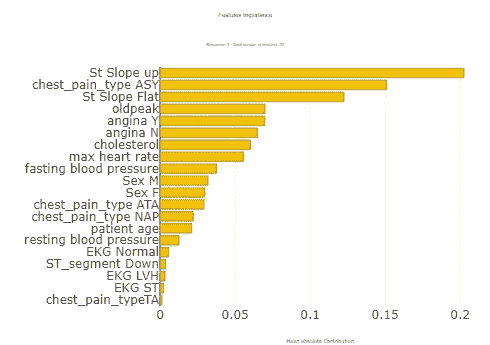

图 1\. 特征重要性

图 2 显示了*Shapash* 提供的一种重要类型的图，特征贡献。图中检查的特征是‘ST_Slope_up’。上半部分包含*ST_Slope_up* 的正贡献情况，而下半部分包含‘ST_Slope_up’的负贡献情况。此外，上半部分图形对应于‘ST_Slope_up’为 0 的情况，下半部分对应于‘ST_Slope_up’为 1 的情况。当我们点击显示结构中间的圆圈时，以下信息将显示：案例编号，‘ST_Slope_up’值，预测类别和‘ST_Slope_up’的贡献。

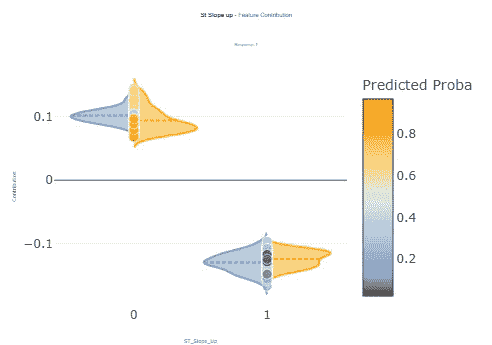

图 2\. 特征贡献

图 3 显示了切片 131 的局部解释，其中预测类别为 1，概率为 0.8416。右侧的条形图显示对结果的正贡献，而左侧的条形图显示负贡献。‘St_Slope_up’具有最高的正贡献，而‘max_heart_rate’具有最高的负贡献。

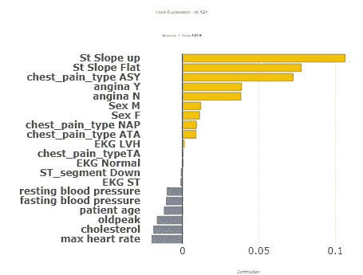

图 3\. 局部解释

总结来说，*Shapash* 是一个非常有用的软件包，因为 (a) 它提供了一个很好的界面，用户可以深入了解全局和局部解释，(b) 它提供了展示特征贡献的***独特***功能。

## **A.2\. OMNIXAI 包**

*OMNIXAI* [(开源可解释人工智能) [3]]，如*Shapash*，也提供可视化工具，但其***独特***的*优势*在于其解释技术的广泛性。具体来说，它提供了针对各种数据类型的预测解释方法，即表格数据、文本和图像。它的一些**独特**功能包括 (a) *NLPExplainer*，(b) 偏差检查模块，(c) 表格数据的莫里斯敏感性分析，(d) 用于图像分类的*VisionExplainer*，以及 (e) 反事实解释器。

下面的代码显示了*OMNIXAI* 解释器的创建。主要步骤包括 (a) 创建一个*OMNIXAI* 特定的数据类型（‘Tabular’）来保存数据，(b) 通过‘TabularTransform’进行数据预处理，(c) 数据分割为训练集和测试集，(d) 训练一个*XGBClassifier* 模型 (e) 将数据还原为原始格式 (f) 设置一个带有*SHAP* 和*LIME* 方法的*XGBClassifier* 的‘TabularExplainer’。解释将应用于‘test_instances’ [130–135] (g) 生成和显示预测

图 4 显示了使用*LIME*对切片 [130:135] 的聚合局部解释。右侧的绿色条形图显示对标签类别 1 的正贡献，而左侧的红色条形图显示对类别 1 的负贡献。条形图越长，贡献越显著。

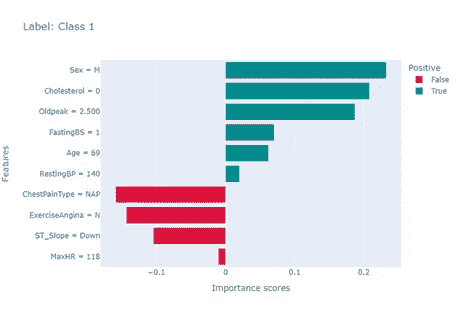

图 4\. LIME 解释

图 5 展示了使用 *SHAP* 对切片 [130:135] 进行的汇总局部解释。绿色/红色条的含义与上图相同。

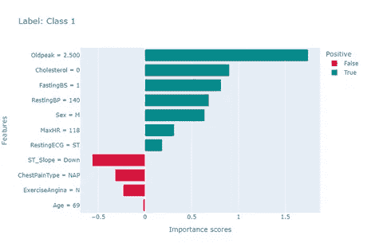

图 5\. SHAP 解释

## **A.3\. InterpretML 包**

*InterpretML* XAI 可解释性 [4] 包具有**独特**的‘glassbox 模型’特性，即固有可解释的模型。

下面的代码片段展示了一个固有可解释模型‘ExplainableBoostingClassifier’的实现。全局解释和切片 43 的局部解释也已设置。

图 6 展示了计算的全局特征重要性。

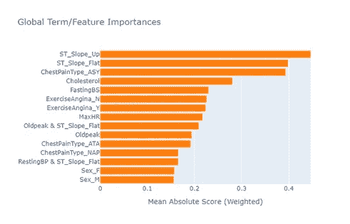

图 6\. 全局特征重要性

图 7 展示了切片 43 的计算局部解释。大多数特征对类别 1 的预测有积极贡献，而只有‘Cholesterol’和‘FastingBS’有负面贡献。

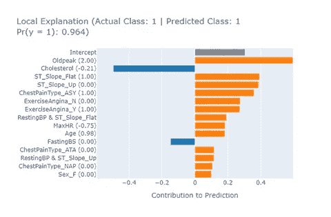

图 7\. 局部解释

## **A. 4 Dalex 包**

*Dalex* 包 [5] 是一个旨在解释和理解机器学习模型的库。*Dalex* 代表“Descriptive mAchine Learning EXplanations。”它具有以下**独特**特性：

+   它与 R 和 Python 兼容。

+   *Aspects* 模块。这使我们能够考虑特征间的相互依赖关系来解释模型。

+   *Fairness* 模块。它使我们能够评估模型的公平性。

下面的代码片段展示了 *Dalex* 的‘Explainer’的实现。

*Dalex* 生成的特征重要性见图 8。

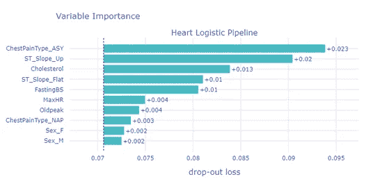

图 8\. 特征重要性

## A.5 Eli5 包

我们将讨论的最终可解释性包是 Eli5 [5]。它具有以下**独特**特性：

+   排列重要性度量。在此技术中，每个特征的值会被随机打乱，然后测量模型性能的下降。下降越大，特征越重要。

+   它处理文本数据。具体来说，它提供了一个‘TextExplainer’，可以解释文本分类器的预测。

+   它与 Keras 兼容。

下面的代码片段中，‘PermutationImportance’ 方法被应用于 *Support Vector Classification* (‘svc’) 估计器。

图 9 展示了‘svc’估计器计算的特征重要性。

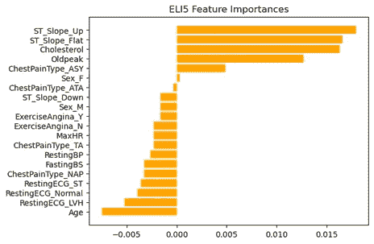

图 9.

# **B. 特征选择技术**

## 包装方法

顾名思义，这些算法将特征选择过程包裹在机器学习算法周围。它们不断评估特征子集，直到找到根据标准产生最佳性能的子集。这个标准可以是以下之一：模型准确率、子集特征数量、信息增益等。

## **它们为何重要**

这些算法的本质（标准优化、全面搜索）表明，这些方法在选择最佳特征方面可以具有非常好的性能。另一个非常有用的特性是它们考虑了特征交互。然而，它们的本质也表明，它们可能计算量大且可能会过拟合。因此，如果没有计算限制且准确性至关重要，这些方法是一个不错的选择。

## B.1. 序列特征选择

*序列特征选择*（*SFS*）以两种模式评估特征子集：前向选择，从没有特征开始，逐步添加特征；以及后向消除，从所有特征开始，逐一移除特征。

以下代码片段展示了围绕‘KNeighborsClassifier’模型实现的 SFS。它还展示了如何输出选择的特征及其名称。

选择的特征包括：

## **B.2 Boruta 算法**

*Boruta* 是最有效的特征选择算法之一。最令人印象深刻的是，它不需要用户任何输入[7]！它基于‘影子特征’（所有原始特征的随机化副本）的巧妙想法。然后，应用随机森林分类器来评估每个真实特征相对于这些影子特征的重要性。这个过程会重复，直到识别出所有重要特征。

以下代码片段展示了使用*Boruta*包实现*Boruta*的过程以及选择的特征。

从*Boruta*选择的特征包括：

## **B.3 RFECV 算法**

*RFECV*（递归特征消除与交叉验证）是一种特征选择技术，它通过交叉验证逐步从模型中移除最不重要的特征，以找到最佳特征子集。代码实现见下方片段。

选择的特征包括：

## 嵌入方法

这些算法具有内置的计算特征重要性或选择特征的能力，如*随机森林*和*套索*回归。对于这些方法，一个重要的注意事项是它们*不会直接*选择特征。相反，它们计算特征重要性，这些重要性可以在后续处理中用于选择特征。这样的后续过程是第 B.9 节讨论的‘SelectFromModel’。

## **它们为何重要**

高维数据今天非常普遍，形式包括非结构化文本、图像和时间序列，特别是在生物信息学、环境监测和金融领域。嵌入方法的最大优势在于它们处理高维数据的能力。其原因在于它们没有单独的建模和特征选择步骤。特征选择和建模在一个步骤中完成，这大大加快了速度。

## **B.4 逻辑回归**

逻辑回归是一种用于二分类的统计方法。模型的系数与特征的重要性相关。每个权重表示特征对目标变量对数赔率的影响方向（正向或负向）及强度。权重的绝对值越大，表示对应的特征在预测结果中越重要。下面的代码片段展示了逻辑回归的创建过程。超参数‘C’（正则化强度）和‘max_iter’通过应用*scikit-learn*的‘GridSearchCV’进行学习。

逻辑回归系数如下所示。

## **B.5 随机森林**

*随机森林*是一种用于分类和回归的集成机器学习方法。它通过构建许多决策树并合并它们的结果来工作。它使用*bagging*技术，即对数据集应用有放回的抽样。然后，每个样本用于训练一个单独的决策树。*随机森林*的一个显著特点是在训练过程中计算特征重要性。它通过随机化一个特征（同时保持其他特征不变），然后检查错误增加的程度来完成这一点。计算特征重要性最常用的标准是特征用于分割节点时的平均*不纯度下降*（*MDI*） [8]。下面的代码片段展示了*scikit-learn*的‘RandomForestClassifier’的计算，其中超参数已经如上所述使用*scikit-learn*的‘GridSearchCV’确定。

计算和显示特征重要性的代码如下所示。计算出的特征重要性见图 10。

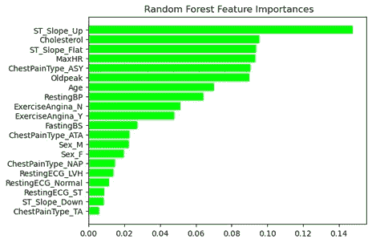

图 10\. 特征重要性

## B.6 *LightGBM* 算法

*LightGBM*（Light Gradient Boosting Machine）是一种结合了速度和性能的梯度提升算法。由*微软*开发，因其处理大数据集的能力以及在内存和速度上的高效性而闻名。它的一些**独特**特点包括（a）能够过滤掉梯度较小的数据实例，专注于更关键的实例，（b）‘Exclusive Feature Bundling’（EFB）：*LightGBM*通过捆绑互斥特征（那些很少同时为非零的特征）来减少特征数量。通过这种方式，算法提高了高维数据的效率 [9]。

下面的代码片段展示了*LightGBM*的实现。超参数（‘learning rate’，‘max_depth’，和‘n_estimators’）使用*scikit-learn*的‘GridSearchCV’算法进行选择。从*LightGBM*计算出的特征重要性见图 11。

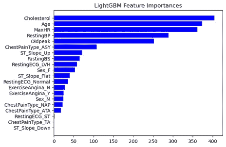

图 11.

## **B.7 XGBoost 算法**

*XGBoost*，即*eXtreme Gradient Boosting*，是梯度提升的高级实现。它具有以下**独特**特性：

+   它可以有效利用所有可用的 CPU 核心或集群来并行创建树。同时，它还利用了缓存优化。

+   与 *LightGBM* 相比，*XGBoost* 以树的深度为单位（层级）生长树，而 *LightGBM* 以叶子为单位生长树。这使得 *XGBoost* 在处理大数据集时效率较低。

代码片段展示了 *XGBoost* 的实现，其中下述超参数 [10] 是基于在 ‘hyperopt’ 包中实现的 *贝叶斯优化* 选择的。这些超参数是：

+   ‘gamma’（分裂的最小损失减少）

+   ‘min_child_weight’（子节点中所有观察值的权重之和的最小值）

+   ‘max_depth’（最大树深度）

+   ‘reg_lambda’（L2 正则化处理）

最终，控制 L1 正则化的超参数 ‘reg_alpha’ 在实验后被手动设置。

图 12 显示了特征的重要性。注意由于 L1 正则化，一些重要性被设为零。

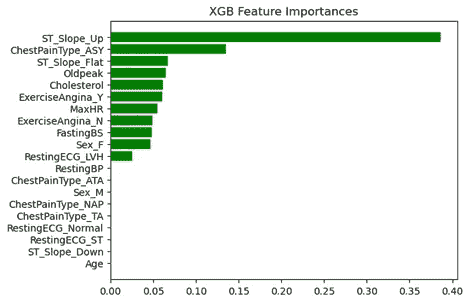

图 12. 特征重要性

## **B.8 CatBoost 算法**

*CatBoost* [11] 是一个高性能的开源梯度提升库，特别适用于分类数据。具体来说，它不需要对分类变量进行任何预处理，如标签编码或 one-hot 编码。相反，它原生处理分类变量。*CatBoost* 使用对称树作为其基础预测器，并支持 GPU 加速。关于 *CatBoost* 在 Python 中的实现，值得注意的是所有非数值特征必须声明为 ‘category’ 类型。然后，如下片段所示，这些分类特征作为输入提供给模型的 *fit* 函数。

图 13 显示了由 *CatBoost* 计算的特征重要性。需要注意的是，特征的名称是原始数据集中（而不是 one-hot 编码后的）。由于 *CatBoost* 原生处理分类数据，因此 *CatBoost* 算法的输入是原始数据（而不是 one-hot 编码后的）。

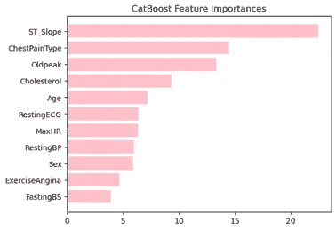

图 13. 特征重要性

## **B.9 SelectFromModel 方法**

‘SelectFromModel’ 是由 *scikit-learn’s feature.selection* 包提供的。它的**独特**特征在于它是一个 *元转换器*，可以与那些通过 *coef_* 或 *feature_importances_* 来分配特征重要性的模型一起使用。

与我们讨论的前面嵌入方法不同，‘SelectFromModel’ 实际上是 *选择* 特征的。下面的代码片段展示了使用这种方法进行特征选择的代码。

选定的特征是：

## 过滤特征选择方法

这些特征与任何机器学习模型无关。它们通常依赖统计度量来评估每个特征，例如目标变量和预测变量之间的相关性和互信息。

## 它们为何重要

过滤方法直观且计算非常简单，因此在许多数据量大的领域（如生物信息学[12]、环境研究和医疗保健研究[13]）中作为初始特征选择步骤使用。

## B.10 互信息

*互信息*度量了在给定另一个变量的知识时一个变量的不确定性（熵）的减少。预测变量与目标变量之间的互信息使用*scikit-learn*的*mutual_info_classif*计算。每个预测变量的互信息得分如图 14 所示。

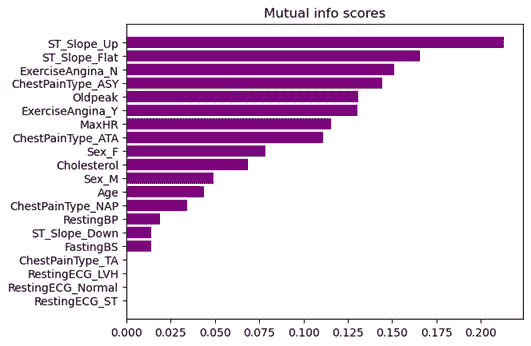

图 14\. 互信息得分。

## B.11 MRMR 算法

*MRMR*代表*最大相关性最大冗余*。正如名称所示，*MRMR*算法选择的特征具有以下特点：（a）最大相关，即与目标变量强相关，（b）最小冗余，即它们之间表现出高度的不相似性。冗余可以使用相关性或互信息度量计算，相关性可以使用 F 统计量或互信息计算[15]。*MRMR*是一种*最小最优*方法，因为它选择了一组特征，这些特征组合在一起具有最大的预测能力[14]。这与在 B.2 节讨论的*Boruta*算法形成对比，后者是一种*全相关*算法，因为它识别了所有对模型预测相关的特征。

下面的代码片段展示了使用‘mrmr’ Python 库实现的*MRMR*。

最小最优特征集如下所示：

## B.12 SelectKBest 方法

正如名称所示，该算法根据用户定义的评分选择 K 个最佳特征。数量 K 也是用户定义的。该算法可应用于分类和回归任务，提供多种评分函数。例如，对于分类，用户可以应用以下方法：（a）‘f_classif’，计算*ANOVA* *F 值*，（b）‘mutual_info_classif’，计算互信息，（c）*chi2*，计算预测变量与目标变量之间的卡方统计量[16]。下面的代码片段展示了 k=5 和评分函数‘f_classif’的*SelectKBest*的计算。

下面的图 15 显示了根据评分函数‘f_classif’的特征得分（重要性）。注意，虽然我们选择了 K=5，但图 15 显示了所有特征的得分。

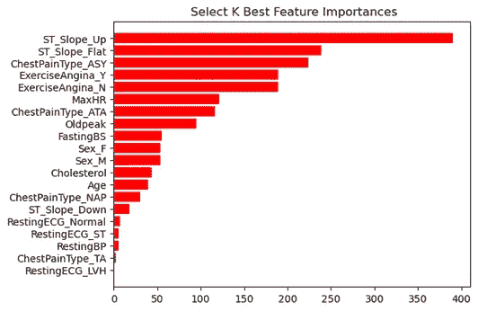

图 15\. 特征重要性。

## B.13 Relief 算法

*Relief* 的 **独特** 特征是以下想法：对于一个数据样本，找到同一类别中最近的邻居（‘近邻’）和另一类别中最近的邻居（‘近错’）。特征根据它们与‘近邻’的相似程度以及与‘近错’样本的区别程度进行加权。由于其对复杂特征关联的敏感性，*Relief* 在生物医学信息学中特别有用 [17]。在这里，我们使用了原始 *Relief* 算法的扩展版——*ReliefF* 算法，它可以应用于多类别分类。相比之下，原始的 *Relief* 算法仅适用于二分类情况。下面的代码片段展示了从 ‘kydavra’ Python 包中调用 ‘ReliefFselector’ 的方法。

从算法中选择的特征如下所示。

## 杂项特征选择技术

在这一最终类别中，我们将讨论 *Featurewiz*、*Selective* 和 *PyImpetus* 包。

## 他们的重要性

每个包都有其 **独特** 的原因：（a）*Featurewiz* 是一个非常方便的 AutoML 包。它只需一行代码即可选择特征；（b）*Selective* 包提供了多种过滤和嵌入式过滤选择方法，可以通过一行代码轻松调用；（c）*PyImpetus* 包基于一种与所有其他特征选择技术非常不同的算法，即 *Markov Blanket*。

## B.14 *Featurewiz* 包

这是一个自动化特征选择工具 [18][19]。其调用方式如下面的代码片段所示。该工具在后台使用 ‘SULOV’ 算法（*S*earching for *U*ncorrelated *L*ist Of *V*ariables），其基础是上文 B.11 节中描述的 *MRMR* 算法。‘SULOV’ 选择具有最高互信息分数和最小相关性的特征。然后，这些特征递归传递给 *XGBoost* 以找到最佳子集。

从 *Featurewiz* 中选择的特征如下所示。

## B.15 *Selective* 特征选择库

这个库提供了多种特征选择方法用于分类和回归任务 [20]。其中一些方法包括：相关性、方差、统计分析（ANOVA f 检验分类、卡方检验等）、线性方法（线性回归、*lasso* 和 *ridge* 正则化等），以及基于树的方法（*Random Forest*、*XGBoost* 等）。以下展示了这个库的一个用例。

使用 ‘TreeBased’ 方法选择的特征如下：

## B.16 *PyImpetus* 包

这个算法的 **独特** 思路是 *Markov Blanket*，它是预测目标变量所需的最小特征集 [21][22]。它可用于分类和回归任务。其分类实现如下所示。

图 16 显示了选择的特征及其相对重要性。

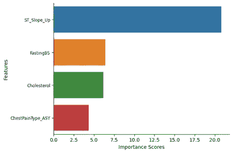

图 16。

# **讨论与结论**

在这篇文章中，我们讨论了从两个不同领域：解释性和特征选择，涉及的广泛特征重要性评估技术。鉴于讨论的算法多样性，自然会出现一个问题：“不同算法选择的最重要特征有多相似？”

让我们看看下面的表 1。该表有两列，对应于特征‘ST_Slope_up’和‘ST_Slope_flat’。行对应于我们在文章中使用的算法和包。数字 1、2、3 表示该特征被算法选择为最佳、第二最佳或第三最佳。

表 1。

如文章中所述，一些算法简单地输出了一组特征而没有任何顺序。在这种情况下，表中的 X 表示算法*选择*了该特征。如果表中有空缺，说明该特征未被相应算法选择为前三个最重要的特征。对于逻辑回归，考虑了系数的绝对值。对于*CatBoost*，我们为‘ST_Slope_up’和‘ST_Slop_flat’分配了 1，因为*CatBoost*将‘ST_Slope’选为最重要特征。最后，*OMNIXAI*包的结果未包含在内，因为它们仅提供了少数行的局部解释。

从表 1 的观察中出现了一个有趣的事实。除了*LightGBM*，特征‘ST_Slope_up’在报告特征重要性的算法中具有*最高*或*第二高*的重要性。它也被大多数报告选择特征但不报告重要性的算法所选择。特征‘ST_Slope_Flat’也表现得相当好，因为它要么位于前三个最高重要性特征中，要么位于大多数算法选择的特征组中。

现在，让我们*深入*探讨另一个有趣的见解。这两个特征具有*最高*和*第二高*的*互信息评分*。正如我们在 B.10 节中看到的，这是一个只需一行代码即可计算的简单特征。*因此，通过一行代码，我们获得了对数据中最重要特征的见解，这些特征由其他计算复杂度更高的算法报告。*

本文讨论了二十一种计算*特征重要性*的包和方法，这是衡量特征对模型预测能力贡献的一个指标。欲进一步阅读，我推荐 [23]，它讨论了特征的另一个作用，即其对模型的错误贡献。

完整代码可以在 [`github.com/theomitsa/Feature_importance/tree/main`](https://github.com/theomitsa/Feature_importance/tree/main) 找到。

感谢阅读！

**脚注：**

+   **数据集许可：** 如在 [`www.kaggle.com/datasets/fedesoriano/heart-failure-prediction`](https://www.kaggle.com/datasets/fedesoriano/heart-failure-prediction) 中提到的，遵循开放数据公共开放数据库许可证 (ODbL) v1.0，并在 [`opendatacommons.org/licenses/odbl/1-0/`](https://opendatacommons.org/licenses/odbl/1-0/) 中描述。

+   我证实文章中的所有可视化/图像/图表均由作者创作，可以在上述 GitHub 目录中复制。

# **参考文献**

1.  **Shapash 包**，[`shapash.readthedocs.io/en/latest/`](https://shapash.readthedocs.io/en/latest/)

1.  Molnar, C.，**可解释的机器学习**，2023 年。[`christophm.github.io/interpretable-ml-book/`](https://christophm.github.io/interpretable-ml-book/)

1.  **OMNIXAI 包**，[`opensource.salesforce.com/OmniXAI/latest/omnixai.html`](https://opensource.salesforce.com/OmniXAI/latest/omnixai.html)

1.  **InterpretML 包**，[`interpret.ml/`](https://interpret.ml/)

1.  **Dalex 包**，[`dalex.drwhy.ai/`](https://dalex.drwhy.ai/)

1.  **Eli5 包**，[`eli5.readthedocs.io/en/latest/index.html`](https://eli5.readthedocs.io/en/latest/index.html)

1.  Mazzanti, S.，**Boruta** **正如你希望别人解释给你听的那样详细解释**，Medium: Towards Data Science，2020 年 3 月。

1.  Scornet E.，**树、森林与基于杂质的变量重要性**，2021 年，ffhal-02436169v3f，[`hal.science/hal-02436169v3/file/importance_variable.pdf`](https://hal.science/hal-02436169v3/file/importance_variable.pdf)

1.  Ke, G. 等人，**LightGBM：一种高效的梯度提升决策树**，NIPS 会议，页码 3149–3157，2017 年 12 月。

1.  Banerjee, P.，**XGBoost 超参数调整指南**，[`www.kaggle.com/code/prashant111/a-guide-on-xgboost-hyperparameters-tuning`](https://www.kaggle.com/code/prashant111/a-guide-on-xgboost-hyperparameters-tuning)

1.  Prokhorenkova, L. 等人，**CatBoost：具有类别特征的无偏提升**，NIPS’18：第 32 届国际神经信息处理系统会议论文集，页码 6639–6649，2018 年 12 月。

1.  Urbanowicz, R.J. 等人，**生物信息学数据挖掘中基于 Relief 的特征选择方法基准测试**，《生物医学信息学杂志》，第 85 卷，页码 168–188，2018 年 9 月。

1.  Raju, S.K.，**SARS-CoV-2 呼吸道感染的互信息与特征选择评估**，生物工程 (巴塞尔)，第 10 卷，第 7 期，2023 年 7 月。

1.  Mazzanti, S.，“**MRMR** 正如你希望别人解释给你听的那样详细解释”，Medium: Towards Data Science，2021 年 2 月。

1.  Radovic, M. 等人，**用于时间基因表达数据的最小冗余最大相关特征选择方法**，BMC 生物信息学，2017 年 1 月。

1.  Kavya, D.，**优化性能：用于机器学习中高效特征选择的 SelectKBest**，Medium，2023 年 2 月。

1.  Urbanowicz, R. J. 等，**基于 Relief 的特征选择：介绍与综述，** 《生物医学信息学杂志》，第 85 卷，第 189–203 页，2018 年 9 月。

1.  **Featurewiz 包，** [`github.com/AutoViML/featurewiz`](https://github.com/AutoViML/featurewiz)

1.  Sharma, H., **Featurewiz：快速选择数据中最佳特征的方法，** Medium，Medium: Towards Data Science，2020 年 12 月。

1.  **选择性特征选择库，** [`github.com/fidelity/selective`](https://github.com/fidelity/selective)

1.  **PyImpetus 包，** [`github.com/atif-hassan/PyImpetus`](https://github.com/atif-hassan/PyImpetus)

1.  Hassan, A. 等，**PPFS：预测置换特征选择，** [`arxiv.org/pdf/2110.10713.pdf`](https://arxiv.org/pdf/2110.10713.pdf)

1.  Mazzanti, S.，**你的特征重要吗？这并不意味着它们好，** Medium: Towards Data Science，2023 年 8 月。
