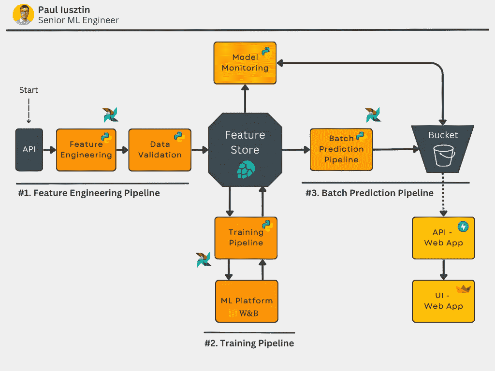
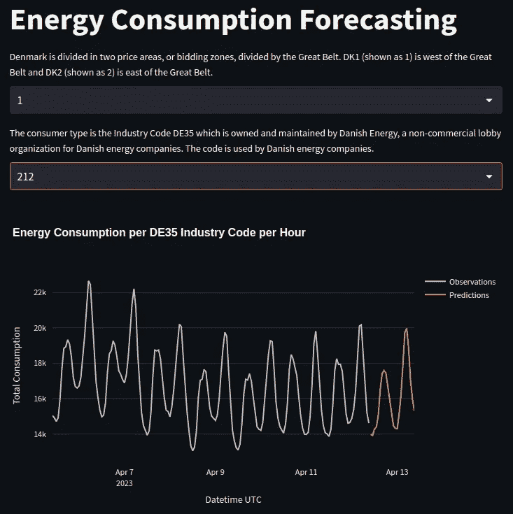
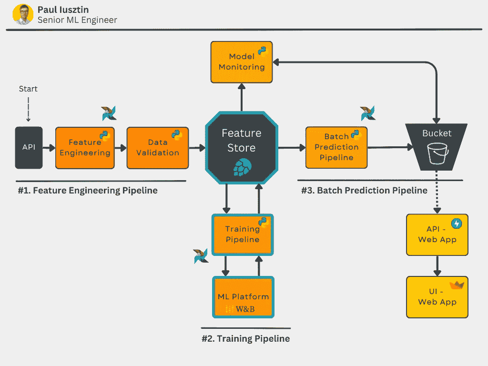
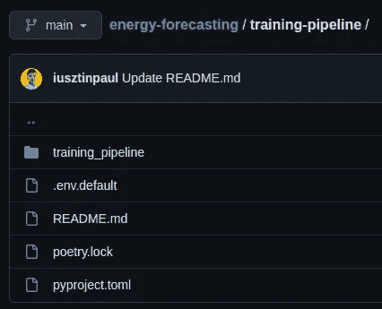
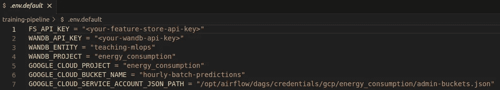
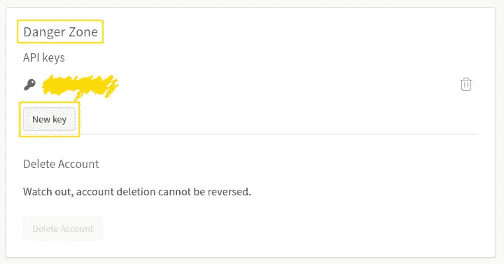
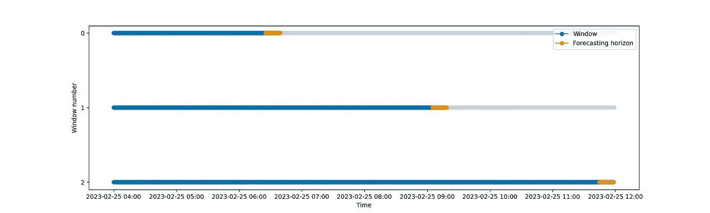
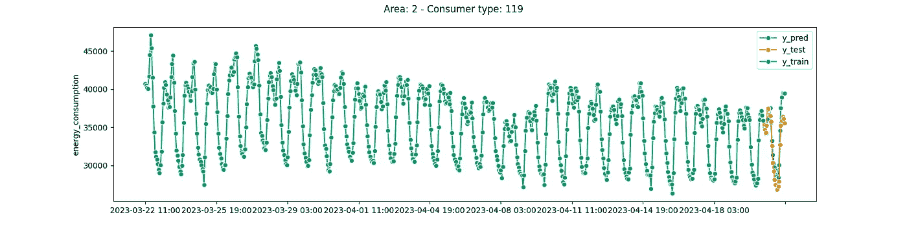
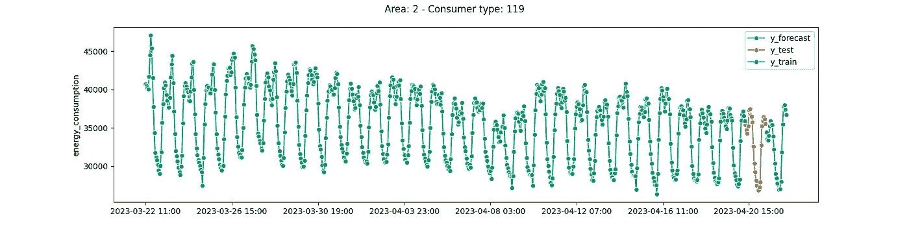

# 高效训练管道构建指南

> 原文：[`towardsdatascience.com/a-guide-to-building-effective-training-pipelines-for-maximum-results-6fdaef594cee`](https://towardsdatascience.com/a-guide-to-building-effective-training-pipelines-for-maximum-results-6fdaef594cee)

## [完整的 7 步 MLOps 框架](https://towardsdatascience.com/tagged/full-stack-mlops)

## 第 2 课：训练管道。ML 平台。超参数调整。

 [Paul Iusztin](https://pauliusztin.medium.com/?source=post_page-----6fdaef594cee--------------------------------)

·发表于 [Towards Data Science](https://towardsdatascience.com/?source=post_page-----6fdaef594cee--------------------------------) ·19 分钟阅读·2023 年 5 月 9 日

--

图片来源于 [Hassan Pasha](https://unsplash.com/@hpzworkz?utm_source=medium&utm_medium=referral) 在 [Unsplash](https://unsplash.com/?utm_source=medium&utm_medium=referral)

本教程代表了**7 节课程中的第二部分**，将逐步指导你如何**设计、实现和部署一个 ML 系统**，使用**MLOps 的最佳实践**。在课程期间，你将构建一个生产就绪的模型，以预测未来 24 小时内来自丹麦的多个消费者类型的能源消耗水平。

*通过本课程的学习，你将掌握设计、编码和部署一个使用批量服务架构的 ML 系统的所有基本知识。*

本课程*针对中级/高级机器学习工程师*，旨在通过构建自己的端到端项目来提升技能。

> *如今，证书随处可见。构建高级的端到端项目并展示出来是获得专业认可的最佳方式。*

# 目录：

+   课程简介

+   课程内容

+   数据来源

+   第 2 课：训练管道。ML 平台。超参数调整。

+   第 2 课：代码

+   结论

+   参考文献

# 课程简介

***在这 7 节课的课程结束时，你将学会如何：***

+   设计一个批量服务架构

+   使用 Hopsworks 作为特征存储

+   设计一个从 API 读取数据的特征工程管道

+   构建一个带有超参数调整的训练管道

+   使用 W&B 作为 ML 平台来跟踪你的实验、模型和元数据

+   实现一个批量预测管道

+   使用 Poetry 构建你自己的 Python 包

+   部署你自己的私有 PyPi 服务器

+   使用 Airflow 协调一切

+   使用预测结果编写一个基于 FastAPI 和 Streamlit 的网页应用

+   使用 Docker 容器化你的代码

+   使用 Great Expectations 确保数据验证和完整性

+   监控预测性能的时间变化

+   将所有内容部署到 GCP

+   使用 GitHub Actions 构建 CI/CD 管道

如果这听起来很多，不用担心，完成本课程后你将理解我之前所说的一切。最重要的是，你会知道**我为什么使用所有这些工具**，以及它们如何作为一个系统协同工作。

**如果你想从这门课程中获得最大收益，** [**我建议你访问包含所有课程代码的 GitHub 仓库**](https://github.com/iusztinpaul/energy-forecasting) **。本课程旨在让你快速阅读和复制文章中的代码。**

在课程结束时，你将知道如何实现下图所示的内容。如果有些地方对你来说不太明白，不用担心，我会详细解释一切。

课程期间你将构建的架构图 [作者提供的图像]。

在**第二课结束时**，你将知道如何实现和集成**训练管道**和**ML 平台**。

**注意：** 这是最长的一节课，因为我无法从 ML 平台中逻辑性地分离出训练管道。享受吧！

# 课程内容：

1.  [批量服务。特征存储。特征工程管道。](https://medium.com/towards-data-science/a-framework-for-building-a-production-ready-feature-engineering-pipeline-f0b29609b20f)

1.  **训练管道。ML 平台。超参数调整。**

1.  [批量预测管道。使用 Poetry 打包 Python 模块。](https://medium.com/towards-data-science/unlock-the-secret-to-efficient-batch-prediction-pipelines-using-python-a-feature-store-and-gcs-17a1462ca489)

1.  [私有 PyPi 服务器。使用 Airflow 协调一切。](https://medium.com/towards-data-science/unlocking-mlops-using-airflow-a-comprehensive-guide-to-ml-system-orchestration-880aa9be8cff)

1.  使用 GE 进行数据质量和完整性验证。模型性能持续监控。

1.  [使用 FastAPI 和 Streamlit 消耗和可视化你的模型预测。将一切 Docker 化。](https://medium.com/towards-data-science/fastapi-and-streamlit-the-python-duo-you-must-know-about-72825def1243)

1.  [将所有 ML 组件部署到 GCP。使用 GitHub Actions 构建 CI/CD 管道。](https://medium.com/towards-data-science/seamless-ci-cd-pipelines-with-github-actions-on-gcp-your-tools-for-effective-mlops-96f676f72012)

1.  [[附赠] ‘不完美’ ML 项目的幕后故事——课程和见解](https://medium.com/towards-data-science/imperfections-unveiled-the-intriguing-reality-behind-our-mlops-course-creation-6ff7d52ecb7e)

如果您想充分掌握本课内容，我们建议您查看之前的课程，该课程讨论了设计批量服务架构、构建特征工程管道和将特征加载到特征存储中：

## 构建生产就绪特征工程管道的框架

### 第 1 课：批量服务。特征存储。特征工程管道。

[towardsdatascience.com

# 数据来源

我们使用了一个免费的开放 API，提供丹麦所有能源消费者类型的小时能耗值 [1]。

他们提供了一个直观的界面，您可以轻松查询和可视化数据。[您可以在这里访问数据](https://www.energidataservice.dk/tso-electricity/ConsumptionDE35Hour) [1]。

数据有 4 个主要属性：

+   **小时 UTC：** 数据点观察到的 UTC 日期时间。

+   **价格区域：** 丹麦分为两个价格区域：DK1 和 DK2——由大贝尔特分隔。DK1 在大贝尔特以西，DK2 在大贝尔特以东。

+   **消费者类型：** 消费者类型是由丹麦能源公司拥有和维护的行业代码 DE35。

+   **总消耗：** 以 kWh 计的总电力消耗

**注意：** 观察值有 15 天的滞后！但对于我们的演示用例来说，这不是问题，因为我们可以模拟实时中的相同步骤。

我们的 web 应用程序的截图，显示了我们如何预测区域 = 1 和消费者类型 = 212 的能耗 [作者图像]。

数据点具有小时分辨率。例如：“2023–04–15 21:00Z”，“2023–04–15 20:00Z”，“2023–04–15 19:00Z”等。

我们将数据建模为多个时间序列。每个唯一的**价格区域**和**消费者类型**组合代表一个独特的时间序列。

因此，我们将构建一个模型，独立预测每个时间序列未来 24 小时的能耗。

*查看下面的视频以更好地理解数据的样子* 👇

课程和数据源概述 [作者视频]。

# 第 2 课：**训练管道。机器学习平台。超参数调整。**

## 第 2 课的目标

本课将教您如何构建训练管道并使用机器学习平台，如下图所示 👇

最终架构图，带有第 2 课组件用蓝色突出显示 [作者图像]。

更具体地说，我们将展示如何使用 Hopsworks 特征存储中的数据来训练您的模型。

我们还将展示如何使用 LightGBM 和 Sktime 构建一个预测模型，该模型将预测丹麦多个消费者类型未来 24 小时的能耗水平。

我们将覆盖的另一个关键步骤是如何使用 W&B 作为 ML 平台来跟踪你的实验，注册模型和配置为工件，并执行超参数调优以找到模型的最佳配置。

最终，根据超参数调优步骤中找到的最佳配置，我们将用整个数据集训练最终模型，并将其加载到 Hopsworks 模型注册表中，以便后续批量预测管道使用。

***注意：*** 本课程不涉及时间序列预测或超参数调优。这是一门 ML 工程课程，我希望展示多个部分如何汇聚成一个完整的系统。因此，我将直接切入代码的 DS 部分，而不深入细节。

## 理论概念与工具

**Sktime：** Sktime 是一个 Python 包，提供大量时间序列功能。它遵循与 Sklearn 相同的接口，因此得名。使用 Sktime，我们可以快速封装 LightGBM 并执行未来 24 小时的预测、交叉验证等。[Sktime 官方文档](https://www.sktime.net/en/latest/index.html) [3]

**LightGBM：** LightGBM 是一个基于提升树的模型。它建立在梯度提升和 XGBoost 之上，提供性能和速度的提升。以 XGBoost 或 LightGBM 开始是一个常见的做法。[LightGBM 官方文档](https://lightgbm.readthedocs.io/en/latest/Python-Intro.html) [4]

如果你想了解更多关于 LightGBM 的信息，可以查看我的文章，其中我 [在 15 分钟内解释了从决策树到 LightGBM 的一切](https://medium.com/mlearning-ai/decision-trees-from-0-to-xgboost-lightgbm-a5f6827dfa23)。

**ML 平台：** ML 平台是一种工具，使你能够轻松跟踪实验、记录训练元数据、上传和版本化工件、数据血缘等。ML 平台在任何训练管道中都是必不可少的。你可以直观地将 ML 平台视为你的中央研究与实验中心。

**Weights & Biases：** W&B 是一个流行的无服务器 ML 平台。我们选择它作为我们的 ML 平台是因为 3 个主要原因：

1.  他们的工具非常棒且非常直观。

1.  它提供了慷慨的免费版供个人研究和项目使用。

1.  它是无服务器的——无需担心部署和维护工具。

**训练管道：** 训练管道是一个逻辑结构（一个脚本、一个应用程序或更多），它接受经过策划和验证的数据作为输入（来自数据和特征工程管道的结果），并输出一个作为工件的工作模型。通常，模型会被上传到一个模型注册表中，后来可以被各种推理管道访问（我们系列中的批量预测管道是推理管道的具体实现示例）。

# 第 2 课：代码

[你可以在这里访问 GitHub 仓库。](https://github.com/iusztinpaul/energy-forecasting)

**注意：** 所有安装说明都在仓库的 README 文件中。这里我们直接跳到代码部分。

*第 2 课中的所有代码都位于* [***training-pipeline***](https://github.com/iusztinpaul/energy-forecasting/tree/main/training-pipeline)*文件夹下。*

[**training-pipeline**](https://github.com/iusztinpaul/energy-forecasting/tree/main/training-pipeline) 文件夹中的文件结构如下：

显示 training-pipeline 文件夹结构的截图 [作者提供的图片]。

所有代码都位于 [**training_pipeline**](https://github.com/iusztinpaul/energy-forecasting/tree/main/training-pipeline/training_pipeline)目录下（注意使用"_"而非"-"）**。**

直接将凭证存储在你的 git 仓库中是一个巨大的安全隐患。这就是为什么你将通过 **.env** 文件注入敏感信息的原因。

**.env.default** 是你必须配置的所有变量的示例。它还可以用来存储不敏感的属性的默认值（例如，项目名称）。

.env.default 文件的截图 [作者提供的图片]。

## ***准备凭证***

首先，我们必须创建一个 **.env** 文件，添加所有凭证。我已经在 第 1 课中展示了如何设置 **.env** 文件。另外，我在 第 1 课中解释了 **.env** 文件中的变量如何从你的 **ML_PIPELINE_ROOT_DIR** 目录加载到 **SETTINGS** Python 字典中，以便在你的代码中使用。

因此，如果你想复制我所做的工作，我强烈建议你查看 第 1 课。

*如果你只想进行轻度阅读，可以完全跳过“****准备凭证****”步骤。*

在第 2 课中，我们将使用两个服务：

1.  [Hopsworks](https://www.hopsworks.ai/)

1.  [Weights & Biases](https://wandb.ai/)

[***Hopsworks***](https://www.hopsworks.ai/) ***(免费)***

我们已经在 [第 1 课](https://medium.com/towards-data-science/a-framework-for-building-a-production-ready-feature-engineering-pipeline-f0b29609b20f)中展示了如何为 **Hopsworks** 设置凭证。请访问 [第 1 课的“准备凭证”部分](https://medium.com/towards-data-science/a-framework-for-building-a-production-ready-feature-engineering-pipeline-f0b29609b20f)，在那里我们详细介绍了如何为 Hopsworks 设置 API KEY。

[***Weights & Biases***](https://wandb.ai/) ***(免费)***

为了保持课程简洁，我们假设你已经阅读并应用了[第 1 课](https://medium.com/towards-data-science/a-framework-for-building-a-production-ready-feature-engineering-pipeline-f0b29609b20f)中准备 Hopsworks 凭据的步骤。

好消息是，90%的步骤与配置**Hopsworks**的步骤类似，除了如何从 W&B 获取 API 密钥。

首先，在 W&B 上创建一个账户。然后，创建一个团队（即实体）和一个项目（或者使用你已有的默认项目）。

***然后，查看下面的图片，了解如何获取你自己的 W&B API 密钥 👇***

前往你的 W&B 账户。在右上角，点击你的个人资料账户，然后选择“用户设置”。进入用户设置后，向下滚动直到你看到“危险区域”卡片。然后，在“API 密钥”下，点击“新密钥”按钮。复制你的 API 密钥，就完成了。你现在有了你的 API 密钥 [图片由作者提供]。

一旦你拥有了所有的 W&B 凭据，前往你的**.env**文件并按如下方式替换它们：

+   **WANDB_ENTITY：** 你的实体/团队名称（我们的：*“teaching-mlops”*）

+   **WANDB_PROJECT：** 你的项目名称（我们的：*“energy_consumption”*）

+   **WANDB_API_KEY**：你的 API 密钥

## 从特征存储中加载数据

一如既往，第一步是访问用于训练和测试模型的数据。我们已经在 Hopsworks 特征存储中拥有所有数据。因此，下载它变得轻而易举。

下面的代码片段包含了**load_dataset_from_feature_store**() IO 函数，它位于[**training_pipeline/data.py**](https://github.com/iusztinpaul/energy-forecasting/blob/main/training-pipeline/training_pipeline/data.py)文件中。你将使用这个函数下载特定的**feature_view_version**和**training_dataset_version**的数据。

**注意：** 通过提供特定的数据版本，你将始终知道你使用了哪些数据来训练和评估模型。因此，你可以一致地重现你的结果。

使用下面的函数，我们执行以下步骤：

1.  我们访问 Hopsworks 特征存储。

1.  我们获取给定版本的特征视图的引用。

1.  我们获取给定版本的训练数据的引用。

1.  我们将所有与使用的数据集相关的元数据记录到 W&B。

1.  现在我们已经下载了数据集，我们将其传递给**prepare_data()**函数。稍后我们将详细介绍它。目前，请注意我们将数据分为训练集和测试集。

1.  我们将所有与数据集拆分相关的元数据记录到 W&B 中，以及每个拆分的一些基本统计信息，如拆分大小和特征。

**重要观察：** 使用 W&B，你可以记录所有描述你如何提取和准备数据的元数据。通过这样做，你可以轻松了解每次实验的数据来源。

通过使用 **run.use_artifact("<artifact_name>")**，你可以在不同的工件之间建立联系。在我们的示例中，通过调用 **run.use_artifact(“energy_consumption_denmark_feature_view:latest”)**，我们将这个 W&B 运行与在不同 W&B 运行中创建的工件关联起来。

请查看下面的视频，以了解 W&B 运行和工件在 W&B 界面中的样子 👇

W&B 工件概述 [作者的视频]。

现在，让我们深入了解 **prepare_data()** 函数。

*我想强调的是，在* ***prepare_data()*** *函数中，我们不会执行任何特征工程步骤。*

如下所示，在这个函数中，你将重构数据以兼容 **sktime** 界面，选择目标，并拆分数据。

数据被建模为层次时间序列，转化为同一变量在不同上下文中的多个独立观察。在我们的示例中，我们观察了不同区域和能源消耗类型的能源消耗情况。

对于层次时间序列，Sktime 期望数据使用多重索引建模，其中日期时间索引是最后一个。要了解更多有关层次预测的信息，请查看 [Sktime 官方教程](https://github.com/sktime/sktime/blob/main/examples/01c_forecasting_hierarchical_global.ipynb) [7]。

我们还可以安全地使用 **sktime's temporal_train_test_split()** 函数拆分数据。测试集的长度为给定的 **fh (=forecast horizon)**。

一个关键观察点是测试集拆分不是随机抽样的，而是基于最新的观察数据。例如，如果你的数据从 2023 年 5 月 1 日到 2023 年 5 月 7 日，频率为 1 小时，则长度为 24 小时的测试集将包含数据的最后一天，即 2023 年 5 月 7 日的所有值。

## **构建预测模型**

**基准模型**

首先，你将创建一个朴素基准模型作为参考。该模型基于给定的季节性周期性预测最后一个值。

例如，如果 **seasonal_periodicity = 24 hours**，它将返回从“**当前 - 24 小时**”的值。

使用基准模型是一个健康的实践，它可以帮助你将你的高级 ML 模型与更简单的模型进行比较。如果你不能用你的高级模型超越基准模型，那么 ML 模型是没有用的。

**高级 ML 模型**

我们将使用 Sktime 和 LightGBM 来构建模型。

请查看 [Sktime 文档](https://www.sktime.net/en/latest/index.html) [3] 和 [LightGBM 文档](https://lightgbm.readthedocs.io/en/latest/Python-Intro.html) [4]。

如果你对时间序列感兴趣，请查看这个 [Sktime 预测教程](https://www.sktime.net/en/latest/examples/01_forecasting.html#1.-Basic-forecasting-workflows) [6]。如果你只想了解系统的大致情况，你可以继续。

LightGBM 将作为你的回归模型，用于学习数据中的模式并预测未来的值。

使用来自**Sktime**的**WindowSummarizer**类，你可以快速计算各种窗口的滞后和均值及标准差。

例如，对于滞后，我们提供了默认值**list(range(1, 72 + 1)),** 这意味着“计算过去 72 小时的滞后”。

另外，作为均值滞后的示例，我们有默认值**[[1, 24], [1, 48], [1, 72]].** 例如，**[1, 24]** 表示滞后为 1，窗口大小为 24，这意味着它将计算过去 24 天的均值。因此，最终对于**[[1, 24], [1, 48], [1, 72]],** 你将得到过去 24 天、46 天和 72 天的均值。

相同的原则适用于标准差值。[查看此文档以了解更多](https://www.sktime.net/en/latest/api_reference/auto_generated/sktime.transformations.series.summarize.WindowSummarizer.html?highlight=windowsummarizer) [2]。

你使用**Sktime**中的**make_reduction()**函数来包装 LightGBM 模型。通过这样做，你可以轻松附加之前初始化的**WindowSummarizer**。此外，通过指定**strategy = "recursive"**，你可以使用递归范式轻松预测多个未来值。例如，如果你想预测未来 3 小时，模型将首先预测 T + 1 的值。然后，它将使用 T + 1 预测的值作为输入来预测 T + 2 的值，以此类推……

最后，我们将构建**ForecastingPipeline**，在其中附加两个转换器：

1.  **transformers.AttachAreaConsumerType():** 一个自定义转换器，它从索引中提取区域和消费者类型，并将其作为外生变量添加。我们将向你展示我们如何定义它。

1.  **DateTimeFeatures():** 一个来自**Sktime**的转换器，用于计算不同的与日期时间相关的外生特征。在我们的案例中，我们仅使用了星期几和一天中的小时作为额外特征。

请注意，这些转换器类似于**Sklearn**中的那些，因为**Sktime**保持了相同的接口和设计。使用转换器是设计模块化模型中的关键步骤。要了解更多关于 Sklearn 转换器和管道的内容，请查看我的文章：如何快速设计高级 Sklearn 管道。

最后，我们用给定的配置初始化了管道和模型的超参数。

**AttachAreaConsumerType**转换器很容易理解。我们将其实现为一个示例，展示其可能性。

长话短说，它只是将索引中的值复制到它自己的列中。

**重要观察——设计决策**

如你所见，所有的特征工程步骤都内置在预测管道对象中。

你可能会问：“但为什么？这样做，我们不是将特征工程逻辑保留在训练流程中吗？”

嗯，是的……也不是……

我们确实在训练脚本中定义了预测管道，但关键思想是我们将整个预测管道保存到模型注册表中。

因此，当我们加载模型时，也会加载预测管道中包含的所有预处理和后处理步骤。

这意味着所有的特征工程都封装在预测管道中，我们可以安全地将其视为一个黑箱。

这是一种将转换 + 原始数据存储在特征存储中的方式，如 Lesson 1 中讨论的那样。

我们本来也可以在特征存储中独立存储转换函数，但组合一个单一的管道对象会更简洁。

## 超参数调整

**如何使用 W&B sweeps**

你将使用 W&B 进行超参数调整。他们提供了你需要的所有方法。从常规的网格搜索到贝叶斯搜索。

W&B 使用***sweeps***来进行超参数调整。sweep 是指在基于超参数搜索空间的多个实验中的单个实验的高级术语。

我们将使用 MAPE（平均绝对百分比误差）指标来比较实验，以找到最佳的超参数配置。我们选择 MAPE 而不是 MAE 或 RMSE，因为它的值在[0, 1]之间归一化，从而使分析更为容易。

查看下面的视频，了解 W&B 中的 sweeps 面板的样子 👇

现在我们明白了我们的目标，让我们查看[**training_pipeline/hyperparamter_tuning.py**](https://github.com/iusztinpaul/energy-forecasting/blob/main/training-pipeline/training_pipeline/hyperparameter_tuning.py)文件中的代码。

如下函数所示，我们从特征存储中加载特定**feature_view_version**和**training_dataset_version**的数据集。

仅使用训练数据，我们开始进行超参数优化。

**注意：** 你必须确保不要使用测试数据进行超参数优化搜索。否则，你可能会导致测试拆分过拟合，从而使模型无法泛化。测试拆分应仅用于最终决策。

最后，我们保存运行的元数据，其中包含搜索的**sweep_id**。

现在，让我们来看一下**run_hyperparameter_optimization()**函数，它接收训练数据，创建一个新的 sweep 并启动一个 W&B 代理。

在单次 sweep 运行中，我们构建模型并使用交叉验证训练模型。

如你所见，配置由 W&B 提供，基于给定的超参数搜索空间（稍后我们会详细解释）。此外，我们将配置作为一个工件进行日志记录，以便以后访问。

在我们的例子中，我们使用了简单的网格搜索来进行超参数调整。

如下所示，我们创建了一个名为**sweep_config**的 Python 字典，其中包含了方法、需要最小化的指标和要搜索的参数。

[查看 W&B 官方文档以了解更多关于扫频的信息](https://docs.wandb.ai/guides/sweeps) [5]。

**注意：** 通过一些调整，你可以在单个扫频中快速并行运行多个 W&B 代理。因此，显著加快了超参数调优的速度。[如果你想了解更多，请查看他们的文档](https://docs.wandb.ai/guides/sweeps/parallelize-agents) [5]。

**如何对时间序列数据进行交叉验证**

所以，我强调了只使用训练数据集进行超参数调优是至关重要的。

那么，应该在什么拆分上计算你的指标呢？

好吧，你将使用适应于时间序列的交叉验证。

如下图所示，我们使用了 3 折交叉验证技术。关键点是，由于你使用的是时间序列数据，你不能为每个折叠选择整个数据集。这是合理的，因为你不能从未来学习以预测过去。

因此，使用与我们拆分数据集进行训练和测试时相同的原则，我们从数据集开始的 1/3 中抽样，其中**预测范围（橙色部分）**用于计算验证指标。下一个折叠使用 2/3，最后一个折叠使用 3/3 的数据集。

再次，**Sktime**让我们的生活变得更简单。使用**ExpandingWindowSplitter**类和**cv_evaluate()**函数，你可以快速训练和评估模型，使用指定的交叉验证策略——[官方文档在这里](https://github.com/sktime/sktime/blob/main/examples/window_splitters.ipynb) [8]。

最后，我们重构了**results**数据框，使其适应我们的接口，这个数据框是**cv_evaluate()**函数返回的。

很好，现在你已经完成了使用 W&B 扫频的超参数调优步骤。

在这一步结束时，我们有一个附加了多个实验的**sweep_id**，每个实验都有一个**config artifact**。

现在我们必须解析这些信息并创建一个**best_config artifact**。

## 从超参数调优搜索中上传最佳配置

使用[**training_pipeline/best_config.py**](https://github.com/iusztinpaul/energy-forecasting/blob/main/training-pipeline/training_pipeline/best_config.py)脚本，我们将解析给定**sweep_id**的所有实验，并找到具有最低 MAPE 验证分数的最佳实验。

幸运的是，当我们调用**best_run()**函数时，W&B 会自动完成这项工作。之后，你恢复**best_run**并将运行重命名为**best_experiment**。

另外，你将附加到最佳配置的配置上传到其称为**best_config**的 artifact 中。

之后，我们将使用这个 artifact 从头开始训练模型，无论多少次。

现在你有了**best_config** artifact，它准确地告诉你应使用什么超参数来训练你的最终模型。

## 使用最佳配置训练最终模型

最终，将最终模型训练并加载到模型注册表是最后一步。

在[**training_pipeline/train.py**](https://github.com/iusztinpaul/energy-forecasting/blob/main/training-pipeline/training_pipeline/train.py) 文件中的 **from_best_config()** 函数中，我们执行以下步骤：

1.  从 Hopsworks 加载数据。

1.  初始化 W&B 运行。

1.  加载最佳配置工件。

1.  构建基线模型。

1.  在测试集上训练和评估基线模型。

1.  使用最新的最佳配置构建高级模型。

1.  在测试集上训练和评估高级模型。

1.  渲染结果以查看它们的视觉表现。

1.  在整个数据集上重新训练模型。这对时间序列模型至关重要，因为你必须将它们重新训练到当前时刻，以预测未来。

1.  预测未来值。

1.  渲染预测值。

1.  将最佳模型保存为 W&B 中的工件。

1.  将最佳模型保存在 Hopsworks 的模型注册表中。

**注意：** 你可以使用 W&B Artifacts 作为模型注册表，也可以直接使用 Hopsworks 模型注册功能。我们将展示这两种方法。

*注意我们如何使用* ***wandb.log()*** *将所有感兴趣的变量上传到 W&B。*

查看这个视频，直观地了解我们如何使用 W&B 作为实验跟踪器 👇

**训练和评估模型。**

为了训练任何**Sktime**模型，我们实现了这个通用函数，接受任何模型、数据和预测范围。

使用下述方法，我们通过聚合指标和在所有独特的区域和消费者类型组合上切片来评估模型。

通过在切片上评估模型，你可以快速调查公平性和偏差。

正如你所见，大部分繁重的工作，例如 MAPE 和 RMSPE 的实现，都可以直接从**Sktime**中访问。

**渲染结果**

使用**Sktime**，你可以快速将各种时间序列渲染到一个图表中。

如上视频所示，我们在 W&B 实验跟踪器中渲染了每个（区域，消费者类型）组合的结果。

直观比较区域 = 2 和消费者类型 = 119 的预测与实际观察 [作者提供的图片]。

直观观察未来的预测值，对于区域 = 2 和消费者类型 = 119 [作者提供的图片]。

**将模型上传到模型注册表**

最后一步是将模型上传到模型注册表。上传后，模型将被下载并用于我们的批量预测管道。

在实验过程中，我们已经将模型上传为 W&B 工件。如果你计划在应用程序中依赖 W&B，直接使用它是完全可以的。

但我们希望保持批量预测管道仅依赖 Hopsworks。

因此，我们使用了 Hopswork 的模型注册功能。

在以下代码中，基于给定的**best_model_artifact**，我们在 Hopsworks 特征视图中添加了一个标签，以将两者链接起来。这有助于调试。

最后，我们下载了最佳模型权重，并使用 **mr.python.create_model()** 方法将其加载到 Hopsworks 模型注册表中。

现在，通过几行代码，你可以下载并对你的模型进行推断，而无需再担心我们在本课中展示的所有复杂步骤。

[查看第 3 课](https://medium.com/towards-data-science/unlock-the-secret-to-efficient-batch-prediction-pipelines-using-python-a-feature-store-and-gcs-17a1462ca489) 以了解我们将如何使用来自 Hopsworks 模型注册表的模型构建批量预测流程。

# 结论

恭喜你！你完成了 **第二课** 来自 **全栈 7 步 MLOps 框架** 课程。

如果你已经读到这里，你应该知道如何：

+   使用 ML 平台进行实验和元数据跟踪

+   使用 ML 平台进行超参数调优

+   根据给定版本从特征存储中读取数据

+   构建一个封装的 ML 模型和流程

+   将你的模型上传到模型注册表

现在你了解了使用 ML 平台的强大功能，你可以最终掌控你的实验，并快速将你的模型导出为工件，以便在推断流程中轻松使用。

[查看第 3 课](https://medium.com/towards-data-science/unlock-the-secret-to-efficient-batch-prediction-pipelines-using-python-a-feature-store-and-gcs-17a1462ca489) 以了解如何实现批量预测流程和使用 Poetry 打包你的 Python 模块。

**另外，** [**你可以在这里访问 GitHub 仓库**](https://github.com/iusztinpaul/energy-forecasting)**。**

💡 我的目标是帮助机器学习工程师在设计和生产 ML 系统方面提升水平。关注我在 [LinkedIn](https://www.linkedin.com/in/pauliusztin/) 或订阅我的 [每周通讯](https://pauliusztin.substack.com/) 获取更多见解！

🔥 如果你喜欢阅读这样的文章并希望支持我的写作，可以考虑 [成为 Medium 会员](https://pauliusztin.medium.com/membership)。通过使用 [我的推荐链接](https://pauliusztin.medium.com/membership)，你可以在享受 Medium 丰富故事内容的同时，支持我而无需额外费用。

 [## 使用我的推荐链接加入 Medium - Paul Iusztin

### 🤖 加入以获取关于设计和构建生产就绪 ML 系统的独家内容 🚀 解锁完整访问权…

pauliusztin.medium.com](https://pauliusztin.medium.com/membership?source=post_page-----6fdaef594cee--------------------------------)

## 参考文献

[1] [来自丹麦 API 的每小时能源消耗数据](https://www.energidataservice.dk/tso-electricity/ConsumptionDE35Hour), [丹麦能源数据服务](https://www.energidataservice.dk/about/)

[2] [WindowSummarizer 文档](https://www.sktime.net/en/latest/api_reference/auto_generated/sktime.transformations.series.summarize.WindowSummarizer.html?highlight=windowsummarizer)，Sktime 文档

[3] [Sktime 文档](https://www.sktime.net/en/latest/index.html)

[4] [LightGBM 文档](https://lightgbm.readthedocs.io/en/latest/Python-Intro.html)

[5] [W&B Sweeps 文档](https://docs.wandb.ai/guides/sweeps)，W&B 文档

[6] [Sktime 预测教程](https://www.sktime.net/en/latest/examples/01_forecasting.html#1.-Basic-forecasting-workflows)，Sktime 文档

[7] [Sktime 分层、全球和面板预测教程](https://github.com/sktime/sktime/blob/main/examples/01c_forecasting_hierarchical_global.ipynb)，Sktime 文档

[8] [Sktime 窗口分割器教程](https://github.com/sktime/sktime/blob/main/examples/window_splitters.ipynb)，Sktime 文档
