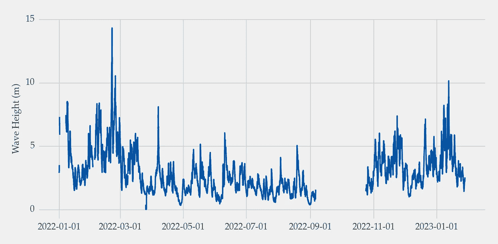
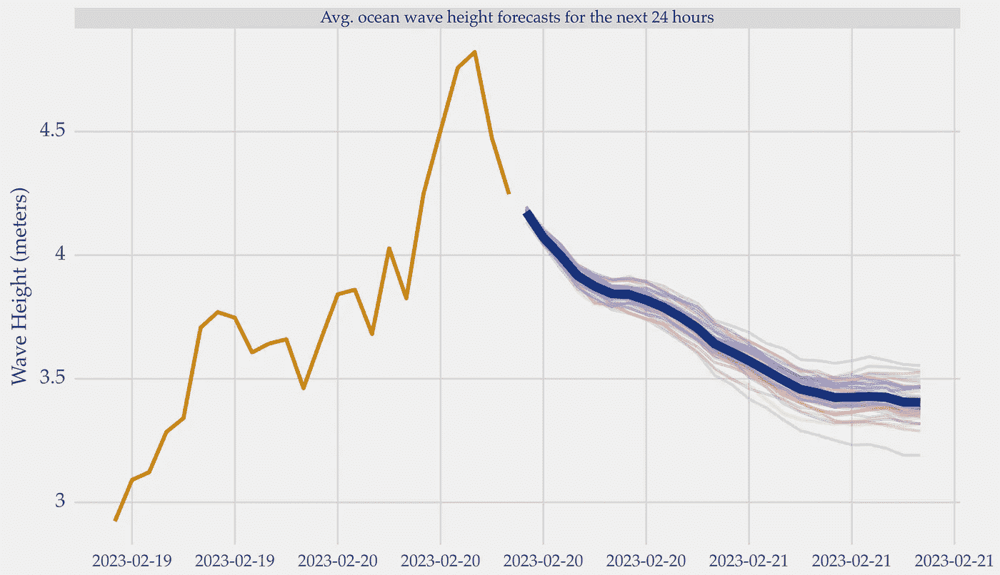

# 使用预测模型进行实时推断指南

> 原文：[`towardsdatascience.com/a-guide-to-live-inference-with-a-forecasting-model-aef5c437d4e`](https://towardsdatascience.com/a-guide-to-live-inference-with-a-forecasting-model-aef5c437d4e)

## 超越离线训练和预测测试

[](https://vcerq.medium.com/?source=post_page-----aef5c437d4e--------------------------------)[](https://towardsdatascience.com/?source=post_page-----aef5c437d4e--------------------------------) [Vitor Cerqueira](https://vcerq.medium.com/?source=post_page-----aef5c437d4e--------------------------------)

·发表于 [Towards Data Science](https://towardsdatascience.com/?source=post_page-----aef5c437d4e--------------------------------) ·阅读时间 6 分钟·2023 年 2 月 22 日

--


图片由 [Fringer Cat](https://unsplash.com/@nittygritty_photo?utm_source=medium&utm_medium=referral) 在 [Unsplash](https://unsplash.com/?utm_source=medium&utm_medium=referral) 提供

许多在线资源关于使用机器学习进行预测。然而，这些资源主要关注离线训练和测试预测。

在这里，你将学习如何创建模型并使用它来预测*实际*的未来观察值。

# 介绍

预测资源常常忽视模型在实时预测中的应用。

关于将机器学习应用于预测的信息很多。但大多数信息集中在预测生命周期的特定阶段。例如，数据预处理或模型构建。

这些资源通常缺乏有关模型实际应用的信息。即，如何将其从离线设置扩展到实时设置。

在时间序列中，这一点尤其重要，因为观察值是相关的，并且它们的顺序很重要。

让我们看看如何构建一个模型并用它来进行实时预测。

# 案例研究——预测波浪高度


图片由 [Silas Baisch](https://unsplash.com/ko/@silasbaisch?utm_source=medium&utm_medium=referral) 在 [Unsplash](https://unsplash.com/?utm_source=medium&utm_medium=referral) 提供

我们将使用有关海洋波浪高度的时间序列数据。预测这类数据对于管理海洋操作非常重要。

数据集由放置在爱尔兰海岸的智能浮标捕获。有关详细信息，请参见参考[1]。

该时间序列会不断更新新观察值。因此，它是开发实时预测预测模型的完美示例。

我们将涵盖以下步骤：

1.  获取历史数据；

1.  数据预处理和特征工程；

1.  选择和构建预测模型；

1.  获取最新观测数据并进行预测。

## 获取历史数据

首先，我们来获取数据。

你可以直接从 ERDAP 的服务器读取数据，如下所示：

```py
import pandas as pd

START_DATE = '2022-01-01'
URL = f'https://erddap.marine.ie/erddap/tabledap/IWaveBNetwork.csv?time%2CSignificantWaveHeight&time%3E={START_DATE}T00%3A00%3A00Z&station_id=%22AMETS%20Berth%20B%20Wave%20Buoy%22'

def reading_data(url: str) -> pd.Series:
    """
    Reading ERDAP data

    :param url: ERDAP url as string
    :return: hourly wave height time series as pd.Series
    """

    # reading data directly from erdap
    data = pd.read_csv(url, skiprows=[1], parse_dates=['time'])

    # setting time to index and getting the target series
    series = data.set_index('time')['SignificantWaveHeight']

    # transforming data to hourly and from centimeters to meters
    series_hourly = series.resample('H').mean() / 100

    return series_hourly

series = reading_data(URL)
```

这是时间序列图：



每小时的海洋波高时间序列。来源参考[1]。图片由作者提供。

## 预处理和特征工程

在建模之前，你可能需要进行一些预处理。

为了说明问题，我们将做两件事：

+   对数据取对数。这有助于稳定方差；

+   使用总结统计进行特征提取。

这里是这两个操作的代码：

```py
import numpy as np

class LogTransformation:
    """
    Log transformation and inverse transformation

    Taking the log helps stabilize the variance
    """

    @staticmethod
    def transform(x):
        xt = np.sign(x) * np.log(np.abs(x) + 1)

        return xt

    @staticmethod
    def inverse_transform(xt):
        x = np.sign(xt) * (np.exp(np.abs(xt)) - 1)

        return x
```

上述类还包括一个*inverse_transform*方法，用于还原对数变换。这对于将对数预测还原到其原始尺度非常重要。

```py
def feature_engineering(X: pd.DataFrame) -> pd.DataFrame:
    """
    param X: lagged observations (explanatory variables)

    :return: new features
    """

    summary_stats = {'mean': np.mean, 'sdev': np.std}

    features = {}
    for f in summary_stats:
        features[f] = X.apply(lambda x: summary_statsf, axis=1)

    features_df = pd.concat(features, axis=1)
    X_feats = pd.concat([X, features_df], axis=1)

    return X_feats
```

函数*feature_engineering*计算滚动平均值和滚动标准差。这是一些可以计算的特征的例子，用于改进预测模型。

我们的目标是展示不同的预处理步骤如何融入实时推断的流程中。在你的情况下，你需要确保这些或其他变换是必要的。例如，使用交叉验证或统计测试。

## 构建预测模型

下一步是构建模型并估计其性能。

我们首先将数据分为训练集和测试集。然后，我们使用滑动窗口对这些数据进行自回归变换。你可以查看上一篇文章了解更多关于时间序列的监督学习。

```py
from sklearn.model_selection import train_test_split
# https://github.com/vcerqueira/blog
from src.tde import time_delay_embedding

# using last 24 observations as lags, 
# and next 24 observations as the forecasting horizon
N_LAGS, HORIZON = 24, 24

train, test = train_test_split(series, test_size=0.2, shuffle=False)

X_train, Y_train = time_delay_embedding(train, n_lags=N_LAGS, horizon=HORIZON, return_Xy=True)
X_test, Y_test = time_delay_embedding(test, n_lags=N_LAGS, horizon=HORIZON, return_Xy=True)
```

使用此设置，我们将构建一个模型，以预测基于过去 24 个滞后的下一 24 小时的数据。

构建预测模型有几种技术。这里，我们将重点关注随机森林。这包括使用交叉验证进行超参数调优。下面是如何进行：

```py
from sklearn.model_selection import RandomizedSearchCV, TimeSeriesSplit

## apply preprocessing steps
# log transformation
X_train = LogTransformation.transform(X_train)
Y_train = LogTransformation.transform(Y_train)
# feature engineering
X_train_ext = feature_engineering(X_train)

# time series cv procedure
tscv = TimeSeriesSplit(n_splits=5, gap=50)

# defining the search space
# a simple optimization of the number of trees of a RF
model = RandomForestRegressor()
param_search = {'n_estimators': [10, 50, 100, 200],
                'criterion': ['squared_error', 'absolute_error'],
                'max_depth': [None, 2, 5, 10],
                'max_features': ['log2', 'sqrt']}

# applying CV with random search on the training data
gs = RandomizedSearchCV(estimator=model,
                        cv=tscv,
                        refit=True,
                        param_distributions=param_search,
                        n_iter=10, n_jobs=1)

gs.fit(X_train_ext, Y_train)
```

在优化参数后，你可以将模型应用于测试数据。这提供了可靠的性能估计。

```py
# applying preprocessing steps to test data
X_test = LogTransformation.transform(X_test)
X_test_ext = feature_engineering(X_test)

# inference on test set and evaluation
preds = gs.predict(X_test_ext)

# log forecasts
preds_log = gs.predict(X_test_ext)

# reverting the log transformation
preds = LogTransformation.inverse_transform(preds_log)

# estimating performance using r-squared
estimated_performance = r2_score(Y_test, preds)
```

请注意，[超参数优化和性能估计是在数据的两个不同部分进行的](https://medium.com/towards-data-science/how-to-do-cross-validation-effectively-1bbeb1d69ee8)。

选择的模型使用所有可用数据进行再训练。你还可以使用*joblib*将其存储在文件中：

```py
from joblib import dump

# preparing all available data for auto-regression
X, Y = time_delay_embedding(series, n_lags=N_LAGS, horizon=HORIZON, return_Xy=True)

# applying preprocessing steps
X = LogTransformation.transform(X)
Y = LogTransformation.transform(Y)
X_ext = feature_engineering(X)

# model fitting
final_model = RandomForestRegressor(**gs.best_params_)
final_model.fit(X_ext, Y)

dump(final_model, 'random_forest_v1.joblib')
```

## 应用模型

在这个阶段，我们完成了几件事：

+   读取并预处理时间序列；

+   使用交叉验证建立和优化预测模型；

+   使用测试集估计其性能。

现在，我们准备在实际环境中应用这个模型。

首先，我们从浮标处获取最新的观测数据。

```py
import datetime

# setting the max history to yesterday
yesterday = datetime.date.today() - datetime.timedelta(days=1)
yesterday = yesterday.strftime('%Y-%m-%d')

LIVE_URL = f'https://erddap.marine.ie/erddap/tabledap/IWaveBNetwork.csv?time%2CSignificantWaveHeight&time%3E={yesterday}T00%3A00%3A00Z&station_id=%22AMETS%20Berth%20B%20Wave%20Buoy%22'

# reading the data from the ERDAP server
new_series = reading_data(LIVE_URL)

# getting the last 24 observations needed for the model
lags = new_series.tail(N_LAGS)
```

我们为什么需要这些观测数据？

回忆一下，我们的模型是基于自回归的。这意味着它使用最近的观测数据来预测未来的数据。在我们的例子中，我们使用过去 24 个观测数据来预测接下来 24 小时的数据。因此，模型的输入是基于过去 24 个最近的观测数据。

我们需要在应用模型之前重新结构化这些数据。这意味着应用我们为最终模型训练所做的相同变换。然后，我们加载并将模型应用于此样本。

```py
from joblib import load

# structuring the lags as a DataFrame
lags_df = pd.DataFrame(lags).T.reset_index(drop=True)
lags_df.columns = X.columns

# applying preprocessing steps
lags_df = LogTransformation.transform(lags_df)
lags_feats = feature_engineering(lags_df)

# loading the model from disk
final_model = load('random_forest_v1.joblib')

# applying the model
log_forecasts = final_model.predict(lags_feats)

# reverting the log transformation
forecasts = LogTransformation.inverse_transform(log_forecasts)
```

下面是预测结果的样子：



随机森林的预测（深蓝色）用于接下来的 24 小时。图片由作者提供。

个别树木的预测也被包括在内，以传达预测的不确定性。

由于这些是实际的预测，我们需要等待以检查模型的表现。

# 关键要点

在本文中，我们构建了一个模型并用它在实际场景中进行预测。

我们探讨了：

+   如何获取最新的观察数据并将其结构化以用于自回归模型；

+   如何存储和加载模型；

+   如何应用和还原变换，以便在原始数据尺度上获得预测结果。

感谢阅读，下一篇故事见！

## 相关文章

+   预测的机器学习：变换和特征提取

+   预测的机器学习：多变量时间序列的监督学习

## 参考资料

[1] [爱尔兰波浪浮标](https://erddap.marine.ie/erddap/tabledap/IWaveBNetwork.html) 来自海洋研究所（数据集 ID：IWaveBNetwork）。许可证：CC BY 4.0
