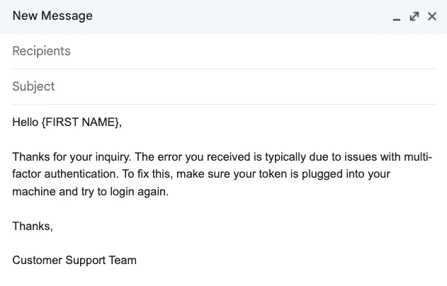

# 机器学习实际数据收集指南

> 原文：[`towardsdatascience.com/a-guide-to-real-world-data-collection-for-machine-learning-a232c436ac19`](https://towardsdatascience.com/a-guide-to-real-world-data-collection-for-machine-learning-a232c436ac19)

## 5 种可操作的策略来优化你的数据收集过程

 [Leah Berg and Ray McLendon](https://medium.com/@DataScienceRebalanced?source=post_page-----a232c436ac19--------------------------------)

·发表于[Towards Data Science](https://towardsdatascience.com/?source=post_page-----a232c436ac19--------------------------------) ·阅读时间 8 分钟·2023 年 9 月 5 日

--

图片由[Henrik Dønnestad](https://unsplash.com/@spaceboy?utm_source=medium&utm_medium=referral)提供，来源于[Unsplash](https://unsplash.com/?utm_source=medium&utm_medium=referral)

无论你是刚刚进入数据科学领域的新手，还是大型组织中的首席数据科学家，你可能都曾使用过精心制作的数据集来解决玩具型的机器学习问题。也许你使用过 K-Means 聚类来预测[Iris](https://en.wikipedia.org/wiki/Iris_flower_data_set)数据集中的花卉种类。或者你可能尝试过使用逻辑回归模型来预测哪些乘客在[Titanic](https://www.kaggle.com/competitions/titanic)航程中幸存。

尽管这些数据集非常适合练习机器学习的基础知识，但它们并不反映你在工作中遇到的实际数据。实际上，你的数据可能存在质量问题，可能不适合当前的任务，或者可能尚不存在。这意味着数据科学家通常需要卷起袖子收集数据——这是一项当前数据科学课程中常常未涉及的挑战。

对于新的数据科学家来说，在深入实际问题之前收集大量数据可能会感到极其艰巨，因为这一阶段为整个机器学习项目奠定了基础。然而，通过正确的策略，这个过程可以变得更加可控。

在我作为数据科学家超过 10 年的职业生涯中，我遇到了各种各样的数据收集策略。在这篇文章中，我将分享五个优化数据收集过程的实用技巧，帮助你迈向创建成功机器学习产品的道路。

# **1\. 将数据收集转化为用户的即时价值**

一个强大的起点在于从一开始就提供有形的价值。让我们借用汽车行业的一个重要参与者，特斯拉作为例子。他们对完全自动驾驶汽车的追求是一个巨大的目标，经过了多年的开发，并且需要大量的数据收集。

那么，在收集所有这些数据的过程中，他们做了什么呢？

照片由 [Milan Csizmadia](https://unsplash.com/@milancsizmadia?utm_source=medium&utm_medium=referral) 拍摄，来源于 [Unsplash](https://unsplash.com/?utm_source=medium&utm_medium=referral)

为了使这些数据收集立即产生价值，2018 年他们发布了一个[自动挡风玻璃刮水系统](https://electrek.co/2018/01/01/tesla-releases-automatic-wiper-update-beta/)——虽然不完全是自驾车，但对用户来说是一个逐步的好处。

这是一个公司采用敏捷方法的绝佳例子，强调逐步产品开发：想想滑板，然后是自行车，然后是摩托车，最后是汽车。接受这种思维方式让你在同时收集数据以进行更大项目的同时提供即时价值。

在我最近参与的一个项目中，我们的目标是自动化客户支持邮件回复。然而，为了训练一个机器学习模型，我们需要制作一个标注的数据集。

为了应对这个挑战，我们挖掘了客户现有的电子邮件，并创建了模板回复。然后，他们使用这些模板回应新请求，这不仅节省了客户的时间，还帮助收集了训练机器学习模型所需的标签。

邮件模板示例。图片由作者提供。

向标注者快速展示数据标注的价值是至关重要的，因为这个任务既枯燥又耗时。此外，这是向高层管理展示投资回报（ROI）的机会——这是[在机器学习项目中广为人知的挑战](https://www.pwc.com/us/en/tech-effect/ai-analytics/artificial-intelligence-roi.html)。

# **2. 使数据标注隐形**

特斯拉巧妙地使得自驾车的数据标注过程几乎隐形。当你转动方向盘或踩下任何踏板时，你正在不知不觉中标注数据集。在 2020 年，[埃隆·马斯克](https://electrek.co/2020/04/30/tesla-fleet-training-orders-of-magnitude-better-elon-musk/)表示

> 实际上，司机在驾驶和采取行动时，实际上是在进行标注——标注现实——随着他们的驾驶，[不断提升]他们的技能。

但这可以如何应用到其他地方呢？

回到我们的邮件自动化示例，我们本可以让客户对所有电子邮件进行分类，以便我们直接提取类别，但增加额外步骤并不可行。相反，我们使用邮件模板巧妙地标注了数据集，使其成为一个无缝且自然的过程。

当客户开始使用模板时，他们很快需要对其进行自定义，这给我们带来了挑战。我们之前是根据原始模板文本来标记数据，现在需要跟踪每个模板的多个版本。

解决这个问题的创意方案涉及采用类似 Genius 的方法的水印系统，用于[识别他们在 Google 上被抓取的内容](https://www.pcmag.com/news/genius-we-caught-google-red-handed-stealing-lyrics-data)。

通过在每个模板上隐形水印，我们可以唯一地标记数据集而不会干扰用户体验。理想情况下，系统会捕获使用的模板，但我们目前的设置缺乏这一功能，使得水印成为一种具有成本效益且富有创意的替代方案。

# **3\. 向用户提供多个默认选项**

作为数据科学家，无论你是在创建新产品还是将机器学习集成到现有产品中，利用现有生产系统进行数据收集是关键。这不仅揭示了有价值的用户洞察，还优化了你的方法。

一种有效的方法是利用用户行为心理学来揭示用户洞察。用户常常[倾向于选择默认选项](https://archive.uie.com/brainsparks/2011/09/14/do-users-change-their-settings/)，因为它的便利性和熟悉感。在提供选择时，默认选项作为起点，不需要额外的决策努力。

比如操作系统上的默认网页浏览器。大多数苹果用户选择 Safari，Windows 用户选择 Edge，而安卓用户选择 Chrome。选择其他浏览器比坚持使用默认浏览器能更好地揭示用户的特征。

照片由[Denny Müller](https://unsplash.com/@redaquamedia?utm_source=medium&utm_medium=referral)拍摄，刊登在[Unsplash](https://unsplash.com/?utm_source=medium&utm_medium=referral)上。

基于用户兴趣提供多个默认选项丰富了我们的理解，并使我们能够对相似用户进行分组。想想像 Pinterest、Netflix 或 Twitter 这样的应用程序，它们在注册时询问你的兴趣。

通过这些量身定制的默认设置收集的数据，成为了训练机器学习模型的宝贵资源。这些模型可以从用户的偏好和行为中学习，从而使平台提供更准确的推荐、预测和洞察。

几年前，我参与了一个旨在对文档进行分类的项目。当我深入分析数据时，迅速发现来自不同地区的用户有自己独特的文档分类方式。因此，我最终为每个地区建立了独立的模型，以便精细调整预测。这种方法使我能够将用户的偏好和行为纳入我的模型，并最终提供更准确的推荐。

# **4\. 仔细选择要标记的数据**

虽然尝试标记所有可用数据以训练机器学习模型似乎是合乎逻辑的，但这种方法往往效率低下，可能导致收益递减。标记数据的人在时间、注意力和专业知识方面都有局限性。

由[Christian Erfurt](https://unsplash.com/@christnerfurt?utm_source=medium&utm_medium=referral)拍摄，来源于[Unsplash](https://unsplash.com/?utm_source=medium&utm_medium=referral)

标记所有内容可能意味着在已经了解或信息量较少的数据点上花费精力。此外，标记大量数据的成本和时间可能超过了提高模型准确性的好处。

相反，考虑一种选择性的方法，例如[主动学习](https://link.springer.com/article/10.1007/s10462-022-10246-w)，以允许标注者集中精力在最有价值的数据点上。主动学习就像有一个聪明的学生，他知道向老师提出哪些问题以便更好地学习。

这有助于机器学习模型更快地学习，并在总体数据较少的情况下表现良好。就像学生通过提出正确的问题来学习一样，主动学习帮助模型通过选择最具信息量的数据进行标记来学习。

在一个最近的项目中，我只有有限的时间（几个分析师的时间）来标记数据，以便预测文档的保留政策。为了充分利用他们的时间，我使用了一种主动学习技术，称为不确定性采样。这项技术定位了模型难以处理的数据点，使我们能够集中精力处理最具挑战性的例子，并优化标记过程。

# **5\. 利用历史数据 — 向后看以向前迈进**

当你从用户那里收集标签时，你可以将其与历史数据进行比较，以揭示关系。你甚至可能创建一个预测模型，从这些历史数据中推断标签。

模型从历史数据中识别的模式中学习，然后应用这些学习来为新的未标记实例分配标签。这不仅扩大了历史数据集的价值，还加快了收集标记数据集的过程。

另一种有效的技术是将已标记的数据与历史上未标记的数据进行聚类，以确定最需要标记的数据。识别在已标记数据集中没有代表的数据簇，确保你充分利用了有限的资源。

由[Jessica Lee](https://unsplash.com/@jaely368?utm_source=medium&utm_medium=referral)拍摄，来源于[Unsplash](https://unsplash.com/?utm_source=medium&utm_medium=referral)

回到之前的文档保留政策模型，我结合了聚类和不确定性采样，以选择一个更有针对性的样本供分析师标记。

首先，我使用聚类方法对类似的数据点进行了分组，然后使用模型预测了保留政策和置信度分数。从那里，我抽取了 5-10 个置信度分数最低的数据点，并将这个更集中的数据集发送给分析师进行标记。

# **结论**

开始数据收集的旅程可能看起来令人畏惧，但这是一个可以通过我所涵盖的五种策略来征服的挑战。

**技巧总结**

1.  将数据收集转化为对用户的即时价值

1.  使数据标记过程不被察觉

1.  向用户提供多个默认选项

1.  精心选择要标记的数据

1.  利用历史数据——回顾以便前行

通过将即时价值、无缝体验、个性化默认设置、选择性标记和历史见解结合在一起，你不仅是在收集数据——你是在为成功铺路。

确保模型在相关、多样化和具有代表性的数据上进行训练是获得可靠预测的关键，而优化数据收集过程则节省时间和成本，加速成功的机器学习部署。

# **参考资料**

1.  [`en.wikipedia.org/wiki/Iris_flower_data_set`](https://en.wikipedia.org/wiki/Iris_flower_data_set)

1.  [`www.kaggle.com/competitions/titanic`](https://www.kaggle.com/competitions/titanic)

1.  [`electrek.co/2018/01/01/tesla-releases-automatic-wiper-update-beta/`](https://electrek.co/2018/01/01/tesla-releases-automatic-wiper-update-beta/)

1.  [`www.pwc.com/us/en/tech-effect/ai-analytics/artificial-intelligence-roi.html`](https://www.pwc.com/us/en/tech-effect/ai-analytics/artificial-intelligence-roi.html)

1.  [`electrek.co/2020/04/30/tesla-fleet-training-orders-of-magnitude-better-elon-musk/`](https://electrek.co/2020/04/30/tesla-fleet-training-orders-of-magnitude-better-elon-musk/)

1.  [`www.pcmag.com/news/genius-we-caught-google-red-handed-stealing-lyrics-data`](https://www.pcmag.com/news/genius-we-caught-google-red-handed-stealing-lyrics-data)

1.  [`archive.uie.com/brainsparks/2011/09/14/do-users-change-their-settings/`](https://archive.uie.com/brainsparks/2011/09/14/do-users-change-their-settings/)

1.  [`link.springer.com/article/10.1007/s10462-022-10246-w`](https://link.springer.com/article/10.1007/s10462-022-10246-w)

1.  `towardsdatascience.com/uncertainty-sampling-cheatsheet-ec57bc067c0b`
