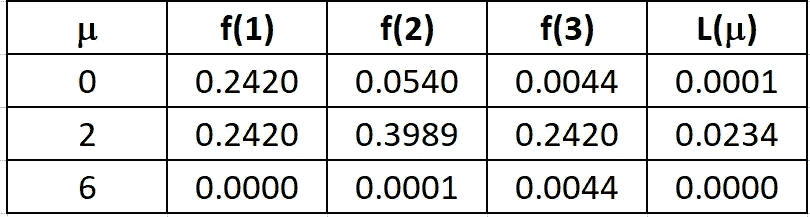
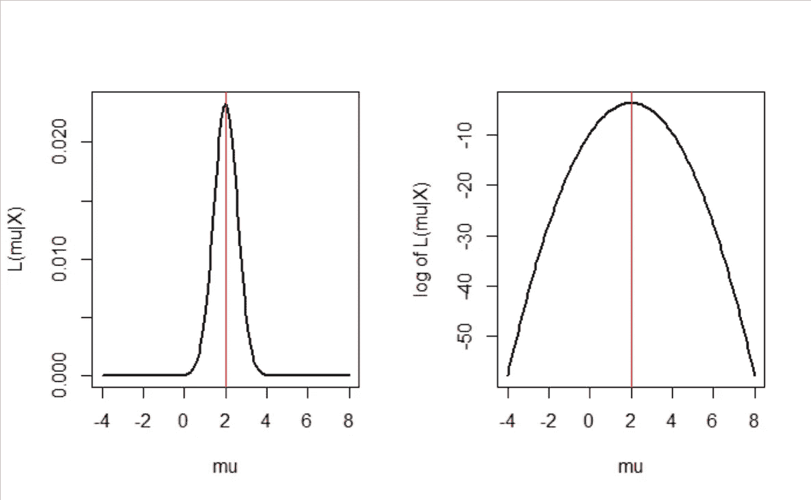

# 初学者的最大似然估计（附 R 代码）

> 原文：[`towardsdatascience.com/a-laymans-guide-to-maximum-likelihood-estimation-with-r-code-9e992a10ecd9`](https://towardsdatascience.com/a-laymans-guide-to-maximum-likelihood-estimation-with-r-code-9e992a10ecd9)

## 最大似然方法的直观解释

[](https://medium.com/@jaekim8080?source=post_page-----9e992a10ecd9--------------------------------)[](https://towardsdatascience.com/?source=post_page-----9e992a10ecd9--------------------------------) [Jae Kim](https://medium.com/@jaekim8080?source=post_page-----9e992a10ecd9--------------------------------)

·发布于 [Towards Data Science](https://towardsdatascience.com/?source=post_page-----9e992a10ecd9--------------------------------) ·4 min read·Mar 14, 2023

--

最大似然原理是数据科学、机器学习和人工智能中大量模型的基本估计方法。它适用于从分类的 logit 模型到深度学习中的信息理论等各种方法。本文旨在提供对该原理的直观介绍。

假设你有三个数据点 x = (1, 2, 3)，你认为它们是从均值未知（μ）且标准差为 1 的正态分布中生成的，即 N(μ,1)。

*考虑这些数据点，最可能的μ值是什么？*

这是最大似然估计方法旨在回答的问题。


图片由作者创建

假设研究人员考虑了μ = (0, 2, 6)这三个可能的值作为候选值。哪一个值最有可能是观察到的数据的值？

上图分别用蓝色、黑色和绿色绘制了 N(0,1)、N(2,1)和 N(6,1)的三个正态分布概率（密度）函数。即，它们分别是 f(X|μ=0)、f(X|μ=2)、f(X|μ=6)。

作者创建

底部的红色方块点表示 x=(1, 2, 3)，这些是观察到的数据点。

从上面的图表可以明显看出，数据点 x 最有可能来自 N(2,1)。它们来自 N(0,1)的可能性相当低，来自 N(6,1)的可能性更低。因此，我们可以说μ = 2 的值与 x = (1, 2, 3)的兼容性最高。

如果我们考虑所有其他可能的μ值，并且确信 2 最有可能生成 x，那么它就是μ的最大似然估计。

让我们定义一些数学细节：

f(X1,X2,X3|μ)：**联合** **概率** **密度函数**，给定 μ。它展示了在给定 μ 的情况下 X 的概率密度。

L(μ|x1,x2,x3)：**似然函数**，给定 x。它展示了在给定观察数据 x=(x1, x2, x3) 的情况下 μ 的似然。

区别在于密度函数是通过随机变量 X 索引，给定如 μ 这样的参数值；而似然函数是通过参数索引，给定观察到的数据 x。

这两个函数的关系为

L(μ|x1,x2,x3) = k f(x1,x2,x3|μ)。

其中 k > 0 是任何常数。为了简便起见，我们假设 k = 1。那么这两个函数几乎相同，区别在于它们的参数和条件值。如果我们为简单起见假设 X 们是独立的，那么我们可以写出（因为在独立情况下联合概率是个体概率的乘积）

L(μ|x1,x2,x3) = f(x1|μ) × f(x2|μ) × f(x3|μ)。



图片由作者创建

上表显示了当 x=(1, 2, 3) 时似然函数 L(μ|x1,x2,x3) 的值：最后一列列出了这些值的乘积。最大似然值出现在 μ = 2。

现在我们考虑 μ 的所有可能值，并将似然和对数似然函数作为 μ 的函数进行绘制。对数似然函数定义为

*l*(μ|x1,x2,x3) = log[L(μ|x1,x2,x3)]，

其中 log() 是自然对数函数。对数似然是似然函数的单调变换。它被广泛使用，因为它在分析上是可处理的，具有可加性和线性。



图片由作者创建

上述函数如图所示。从上面的图中可以清楚地看到，似然或似然对数在 μ = 2 时最大，这也是 x = (1, 2, 3) 的最大似然估计。

在分析上，可以证明样本均值是从 N(μ,1) 独立生成的样本的最大似然估计量，而 x = (1, 2, 3) 的样本均值确实是 2。

计算和绘图的 R 代码如下：

```py
x = c(1,2,3) # Data observed
X=seq(-5,9,0.01) # X range
par(mfrow=c(1,1))
# plot density functions
plot(X,dnorm(X, mean=2, sd=1), type ="l",
     col="black", lwd=2, add=TRUE, yaxt="n",ylab="density")
curve(dnorm(x, mean=0, sd=1), type ="l", col="blue",
      lwd=2, add=TRUE, yaxt="n")
curve(dnorm(x, mean=6, sd=1), type ="l", col="green"
        , lwd=2, add=TRUE, yaxt="n")
# points for data X
points(x,c(0,0,0),col="red",pch=15)
legend("topleft", legend=c("N(0,1)", "N(2,1)","N(6,1)"),
       col=c("blue", "black","green"), lty=1,cex=1,lwd=2)
abline(v=c(0,2,6),col=c("blue","black","green"))

# Calculation of Likelihood vales at different mean values
prod(dnorm(x,mean=0,sd=1))
prod(dnorm(x,mean=2,sd=1))
prod(dnorm(x,mean=6,sd=1))

# Plotting likelihood and log-of-likelihood 
m=seq(-4,8,0.1)
m1=rep(0,length(m))
m2=rep(0,length(m))
for(i in 1:length(m)) {
  # Likelihood
  m1[i]=prod(dnorm(x,mean=m[i],sd=1))
  # log-of-Likelihood
  m2[i]=sum(log(dnorm(x,mean=m[i],sd=1)))
}
# plotting
par(mfrow=c(1,2))
# Likelihood
plot(m,m1,type="l",ylab="L(mu|X)",xlab = "mu",lwd=2)
abline(v=2,col="red")
# Log-of-Likelihood
plot(m,m2,type="l",ylab="log of L(mu|X)",xlab = "mu",lwd=2)
abline(v=2,col="red") 
```

总之，最大似然估计方法被广泛应用于数据科学中的许多模型和方法。其概念和原理通常未被研究人员和实践者完全理解。本文旨在提供一种直观的解释，而不介绍分析细节。

感谢阅读！

请关注我，获取更多有趣的故事！
