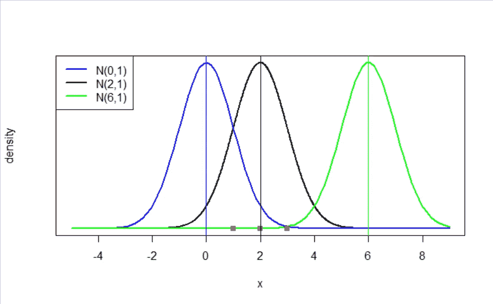

# 初学者的最大似然估计（附 R 代码）

> 原文：[`towardsdatascience.com/a-laymans-guide-to-maximum-likelihood-estimation-with-r-code-9e992a10ecd9?source=collection_archive---------15-----------------------#2023-03-14`](https://towardsdatascience.com/a-laymans-guide-to-maximum-likelihood-estimation-with-r-code-9e992a10ecd9?source=collection_archive---------15-----------------------#2023-03-14)

## 最大似然方法的直观解释

 [Jae Kim](https://medium.com/@jaekim8080?source=post_page-----9e992a10ecd9--------------------------------)

·

[关注](https://medium.com/m/signin?actionUrl=https%3A%2F%2Fmedium.com%2F_%2Fsubscribe%2Fuser%2F3a7641c3f8c1&operation=register&redirect=https%3A%2F%2Ftowardsdatascience.com%2Fa-laymans-guide-to-maximum-likelihood-estimation-with-r-code-9e992a10ecd9&user=Jae+Kim&userId=3a7641c3f8c1&source=post_page-3a7641c3f8c1----9e992a10ecd9---------------------post_header-----------) 发表在 [Towards Data Science](https://towardsdatascience.com/?source=post_page-----9e992a10ecd9--------------------------------) ·4 分钟阅读·2023 年 3 月 14 日

--

最大似然原则是数据科学、机器学习和人工智能中大量模型的基础估计方法。它适用于从分类的对数几率模型到深度学习中的信息理论等各种方法。本文旨在提供对该原理的直观介绍。

假设你有三个数据点 x = (1, 2, 3)，并且你认为它们是从一个均值（μ）未知且标准差等于 1 的正态分布中生成的，即 N(μ,1)。

*鉴于这些数据点，你认为μ的最可能值是什么？*

这是最大似然估计方法旨在回答的问题。

图片由作者创建

假设研究人员考虑了 μ = (0, 2, 6) 这三个可能的值作为候选值。哪一个值最可能符合观察到的数据？

上图绘制了三个正态分布概率（密度）函数，分别是 N(0,1)、N(2,1) 和 N(6,1)，以蓝色、黑色和绿色表示。也就是说，它们分别是 f(X|μ=0)、f(X|μ=2)、f(X|μ=6)，其中
