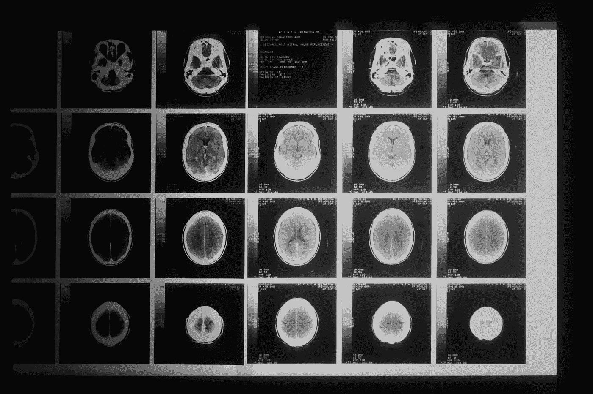
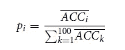

# 一种机器学习方法预测胶质母细胞瘤患者的 MGMT 甲基化状态

> 原文：[`towardsdatascience.com/a-machine-learning-approach-to-predicting-mgmt-methylation-status-in-glioblastoma-patients-b996e36cc339?source=collection_archive---------12-----------------------#2023-07-26`](https://towardsdatascience.com/a-machine-learning-approach-to-predicting-mgmt-methylation-status-in-glioblastoma-patients-b996e36cc339?source=collection_archive---------12-----------------------#2023-07-26)

## 肿瘤学中的放射组学

 [贾雷特·埃文斯](https://medium.com/@jevans2532?source=post_page-----b996e36cc339--------------------------------)

·

[关注](https://medium.com/m/signin?actionUrl=https%3A%2F%2Fmedium.com%2F_%2Fsubscribe%2Fuser%2F9612ed1f387a&operation=register&redirect=https%3A%2F%2Ftowardsdatascience.com%2Fa-machine-learning-approach-to-predicting-mgmt-methylation-status-in-glioblastoma-patients-b996e36cc339&user=Jarrett+Evans&userId=9612ed1f387a&source=post_page-9612ed1f387a----b996e36cc339---------------------post_header-----------) 发表在 [Towards Data Science](https://towardsdatascience.com/?source=post_page-----b996e36cc339--------------------------------) · 5 分钟阅读 · 2023 年 7 月 26 日

--

照片由 [国家癌症研究所](https://unsplash.com/@nci?utm_source=medium&utm_medium=referral) 提供，发布在 [Unsplash](https://unsplash.com/?utm_source=medium&utm_medium=referral)

## 介绍

今天，我们将探讨一项针对胶质母细胞瘤患者的研究，该研究发表在《自然》杂志的 Scientific Reports 上：[*通过优化放射组学特征使用基于遗传算法的机器学习方法改善胶质母细胞瘤 MGMT 甲基化状态预测*](https://www.nature.com/articles/s41598-022-17707-w)。该研究的目标是尝试预测 O6-甲基鸟嘌呤-DNA-甲基转移酶（MGMT）甲基化状态。能够预测这一状态的重要原因在于，它可以很好地指示化疗药物替莫唑胺（TMZ）的效果。

> **替莫唑胺概述**
> 
> TMZ 是一种烷化剂，通过损伤癌细胞中的 DNA 来发挥作用，最终导致细胞死亡。TMZ 还使细胞对放射线更敏感。这在癌症治疗中是一个重要因素，因为放射线用于帮助杀死癌细胞。

这项研究旨在通过机器学习寻找预测 MGMT 甲基化状态的新方法。如果成功，这可以帮助缓解目前为获取肿瘤标本而需进行的技术限制和侵入性程序。

由于胶质母细胞瘤（GBM）对患者的致命威胁，处理这种癌症的效率和有效性非常重要。其中位生存期为 14 至 16 个月，占所有恶性中枢神经系统肿瘤的约 45%。

## 方法

该团队寻求利用两阶段方法来预测适当的 MGMT 甲基化状态。首先是通过消除噪声放射组学特征，然后将分类算法实施到遗传算法中，以帮助识别最佳预测特征。

在这项研究中测试了各种机器学习技术。目的是寻找对预测最有意义的放射组学特征。他们通过从磁共振成像（MRI）的多模态图像中提取放射组学特征来实现这一目标。两阶段特征选择方法从 eXtreme Gradient Boosting（XGBoost）模型开始，随后使用基于遗传算法（GA）的包装模型。GA 模型的工作方式类似于自然选择，通过识别“最适合”的特征集进行预测。

使用的数据是来自癌症基因组图谱的预处理和分割的多模态 MRI 特征。总共包括了 53 名 GBM 患者，并获得了 704 个放射组学特征。

遗传算法的工作流程阶段包括六个不同的步骤：初始种群的生成、适应度评估、父母选择、交叉、突变和下一代的种群替换。用于选择概率的公式（其中特征是根据其在适应度评估阶段的表现进行选择）如下所示：

选择概率公式

一旦从 XGBoost 算法中提取了初始特征，就该使用这些特征进行分类，以预测哪些患者属于 MGMT 甲基化和非甲基化类别，并将其作为适应度评估。他们尝试将三种不同的机器学习算法应用于遗传算法工作流中的适应度评估部分。他们使用了随机森林（RF）、XGBoost 和支持向量机（SVM）。为了实现这些算法，他们利用了 Python 机器学习库 SKlearn。

## 结果

一旦训练了三种不同版本的算法，他们使用三种不同的测量标准来评估模型性能：准确率、特异性和召回率。为了比较性能，他们使用了运行 20 次交叉验证的平均值，并使用了 Kolmogorov-Smirnov 检验进行评估。

最佳结果是通过将随机森林算法融入遗传算法（GA-RF）实现的。该技术在所有评估指标中都优于其他方法，准确率为 0.925，灵敏度为 0.894，特异性为 0.966。

在 GA-RF 模型完成后，得到了一个最佳的 22 个放射组学特征的子集。这些特征中包括 17 个纹理特征、3 个基于直方图的特征、1 个体积特征和 1 个强度特征。纹理特征可以通过反映空间强度相关性和体素的分布，帮助临床医生定量评估血流、浮肿和坏死的“多区域变化”。直方图特征可以用来说明图像中强度值的频率分布。

## 扩展的使用案例

为了测试模型的更广泛适用性，团队使用了在新数据集上学到的特征。他们这次使用的数据集是低级别胶质瘤（LGG）患者的数据集。他们直接应用了学到的特征，没有进行任何额外的特征选择。

GA-RF 模型在 LGG 数据集上的结果为准确率 0.75，灵敏度 0.78，特异性 0.62。没有进行任何迁移学习或微调，这些结果还是相当有前景的。

通过在 LGG 数据集上应用这些特征取得强劲表现，研究人员能够展示这些特征有可能被重用于其他类似疾病。

## 限制

该技术的一个潜在限制是，当患者数量较少时，研究人员可能会遇到高维度相关的问题。这种情况发生在特征数量相对于可用训练数据量较高时。如果发生这种情况，学习数据和目标变量之间的准确关系可能会很具挑战性。

高维度问题在放射组学领域普遍存在，而不仅仅是本研究中的问题。为了克服这一限制，团队使用了交叉验证，以更确定他们得到的结果。

> **交叉验证概述**
> 
> 交叉验证通过将用于训练和测试的数据分成不同的组来进行每次验证的迭代。通过多次这样做并取结果的平均值，你可以更有信心地认为你的模型能够重复地获得它给出的结果。

在癌症治疗中，临床医生依赖于肿瘤的特征和等级，以便优化化疗、放疗和手术治疗。

## 结论

如果这一技术继续得到发展并最终被利用，它可能成为医生非侵入性了解患者 MGMT 甲基化状态的一种方式。这些信息可以帮助他们做出更明智的治疗决策，从而有助于改善患者的预后。这也为放射组学在肿瘤学中可能的其他应用打开了大门。

> Do, D.T., Yang, MR., Lam, L.H.T. *等*。通过优化放射组学特征来改善胶质母细胞瘤 MGMT 甲基化状态预测，使用基于遗传算法的机器学习方法。 *Sci Rep* **12**, 13412 (2022)。 [`doi.org/10.1038/s41598-022-17707-w`](https://doi.org/10.1038/s41598-022-17707-w)
> 
> Eberhart, Karin, Ozlem Oral, 和 Devrim Gozuacik。“第十三章 — 通过抗癌药物诱导自噬性细胞死亡。” *ScienceDirect*，2014 年，[`www.sciencedirect.com/topics/neuroscience/temozolomide#:~:text=Temozolomide%20(TMZ)%20is%20a%20small,damage%20and%20tumor%20cell%20death`](https://www.sciencedirect.com/topics/neuroscience/temozolomide#:~:text=Temozolomide%20(TMZ)%20is%20a%20small,damage%20and%20tumor%20cell%20death)。访问日期：2023 年 7 月 12 日。
> 
> 国家癌症研究所。‘试验产生了对脑癌治疗有影响的结果。’ *癌症动态博客*，2016 年 6 月 9 日，[`www.cancer.gov/news-events/cancer-currents-blog/2016/asco-temozolomide-brain`](https://www.cancer.gov/news-events/cancer-currents-blog/2016/asco-temozolomide-brain)。访问日期：2023 年 7 月 18 日。
> 
> 美国癌症学会。“化疗药物的作用机制。” 美国癌症学会，2019 年 11 月 22 日，[`www.cancer.org/treatment/treatments-and-side-effects/treatment-types/chemotherapy/how-chemotherapy-drugs-work.html`](https://www.cancer.org/treatment/treatments-and-side-effects/treatment-types/chemotherapy/how-chemotherapy-drugs-work.html)。访问日期：2023 年 7 月 25 日。
> 
> 欧洲医学肿瘤学会。“胶质瘤中的 MGMT 启动子甲基化：ESMO 生物标志物简报。” Oncology Pro，[更新于 2019 年 1 月 18 日]，[`oncologypro.esmo.org/education-library/factsheets-on-biomarkers/mgmt-promoter-methylation-in-glioma`](https://oncologypro.esmo.org/education-library/factsheets-on-biomarkers/mgmt-promoter-methylation-in-glioma)。访问日期：2023 年 7 月 9 日。
> 
> 创作共用许可证链接：[`creativecommons.org/licenses/by/4.0/`](https://creativecommons.org/licenses/by/4.0/)
