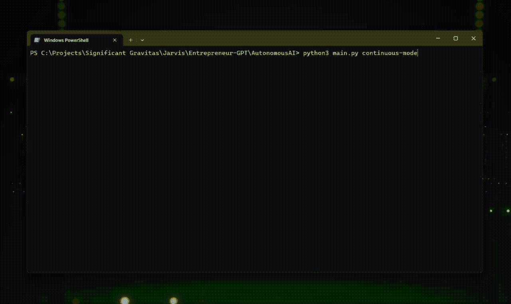

# 一种新的工程类型

> 原文：[`towardsdatascience.com/a-new-kind-of-engineering-fee04ce567ba?source=collection_archive---------1-----------------------#2023-04-15`](https://towardsdatascience.com/a-new-kind-of-engineering-fee04ce567ba?source=collection_archive---------1-----------------------#2023-04-15)

## 如何基于 LLM 的微型 AGI 将需要向建模思维过程的范式转变

 [Johanna Appel](https://medium.com/@johannaappel?source=post_page-----fee04ce567ba--------------------------------)

·

[关注](https://medium.com/m/signin?actionUrl=https%3A%2F%2Fmedium.com%2F_%2Fsubscribe%2Fuser%2Fede7381126aa&operation=register&redirect=https%3A%2F%2Ftowardsdatascience.com%2Fa-new-kind-of-engineering-fee04ce567ba&user=Johanna+Appel&userId=ede7381126aa&source=post_page-ede7381126aa----fee04ce567ba---------------------post_header-----------) 发表在[Towards Data Science](https://towardsdatascience.com/?source=post_page-----fee04ce567ba--------------------------------) ·4 分钟阅读·2023 年 4 月 15 日

--

作者根据[ALAN DE LA CRUZ](https://unsplash.com/@alandelacruz4?utm_source=unsplash&utm_medium=referral&utm_content=creditCopyText)在[Unsplash](https://unsplash.com/photos/TOOhhlGHOsQ?utm_source=unsplash&utm_medium=referral&utm_content=creditCopyText)上的照片制作的图片

在撰写本文时（2023 年 4 月），如 langchain [1]等框架正在开创越来越复杂的 LLM 应用场景。最近，增强了 LLM 推理能力的软件代理已开始向人类水平的机器智能迈进。

# 我们在谈论什么？

[智能体](https://en.wikipedia.org/wiki/Intelligent_agent)是软件系统中的一种模式；它们是能够做出决策并与环境相对自主互动的算法。在 langchain 智能体的情况下，环境通常是基于文本输入/输出的互联网、用户或其他智能体和工具的接口。

根据这个概念，其他项目 [2,3] 已经开始研究更通用的问题解决者（某种‘微型’通用人工智能，或 AGI——一种接近人类水平推理能力的 AI 系统）。尽管这些系统的当前版本仍然相当单片，因为它们作为一个软件整体接受目标/任务/想法的输入，但从它们的执行中可以很容易地看出，它们依赖于多个不同的子系统。

图片来源：Significant Gravitas ([`github.com/Significant-Gravitas/Auto-GPT`](https://github.com/Significant-Gravitas/Auto-GPT), 30/03/2023)

我们在这些系统中看到的新范式是，它们建模思维过程：“批判性思考并检查你的结果”、“查阅多个来源”、“反思你的解决方案的质量”、“使用外部工具进行调试”等，这些都接近于人类的思维方式。

现在，在日常（人类）生活中，我们雇佣专家来完成需要特定专业知识的工作。我的预测是，在不久的将来，我们将雇佣某种认知工程师来建模 AGI 的思维过程，可能通过构建特定的 [多智能体系统](https://en.wikipedia.org/wiki/Multi-agent_system)，以更高质量地解决特定任务。

# 我为什么会这么认为？为什么整体 AGI 不一定足够好？

从我们今天如何使用 LLMs 来看，我们已经在做这件事——建模认知过程。我们通过特定的方式，利用提示工程和大量相邻研究领域的成果，来实现所需的输出质量。即使我上面描述的可能看起来很未来，这已经是现状。

那我们接下来该怎么做？我们可能会看到越来越智能的 AI 系统，甚至可能在某个时点超越人类水平。随着它们变得越来越智能，与我们的目标——我们希望它们做的事情——保持一致将变得越来越困难。AGI 对齐以及对过于强大的未对齐 AI 的安全关注已经是一个非常活跃的研究领域，风险很高——例如，Eliezer Yudkowski [4] 就详细解释了这一点。

我的直觉是较小的，即‘更简单的’系统更容易对齐，因此它们会以更高的概率以某种质量产生某种结果。这些系统正是我们可以使用认知工程方法构建的。

# 我们应该做什么

+   我们应该对如何构建专门的 AGI 系统有一个良好的实验性理解

+   从这些经验中，我们应该创建和迭代正确的抽象，以更好地进行这些系统的建模。

+   有了这些抽象概念，我们可以开始创建可重用的思维模块，就像我们使用可重用的构件来创建用户界面一样。

+   在不久的将来，我们将理解建模这些智能系统的模式和最佳实践，随着经验的积累，我们将了解到哪些架构可以导致哪些结果。

作为一种积极的副作用，通过这项工作和经验的积累，也许可以学习如何更好地调整更智能的人工通用智能系统。

# 这将会引向何方

我预计很快会看到来自不同学科的知识融入这一新兴领域。

多智能体系统的研究以及如何将其用于问题解决，心理学、业务管理和流程建模的洞察都可以有益地融入这一新范式及新兴的抽象中。

我们还需要考虑这些系统如何能够最好地进行交互。例如，人类反馈循环，或者至少在过程中定期评估，可以帮助取得更好的结果——你可能在使用 ChatGPT 时对此有所了解。

这是一个前所未见的用户体验模式，其中计算机变得更像一个合作伙伴或副驾驶，负责进行低级别的研究、制定方案、头脑风暴、自动化或推理任务。

# 关于作者

Johanna Appel 是总部位于瑞士苏黎世的机器智能咨询公司[Altura.ai](https://altura.ai) GmbH 的联合创始人。

她通过将这些“微型”人工通用智能系统集成到现有的业务流程中，帮助公司从中获利。

# 参考资料

[1] Langchain GitHub 代码库，[`github.com/hwchase17/langchain`](https://github.com/hwchase17/langchain)

[2] AutoGPT GitHub 代码库，[`github.com/Significant-Gravitas/Auto-GPT`](https://github.com/Significant-Gravitas/Auto-GPT)

[3] BabyAGI GitHub 代码库，[`github.com/yoheinakajima/babyagi`](https://github.com/yoheinakajima/babyagi)

[4] “Eliezer Yudkowsky: AI 的危险与人类文明的终结”，Lex Fridman 播客 [#368](https://www.youtube.com/hashtag/368)，[`www.youtube.com/watch?v=AaTRHFaaPG8`](https://www.youtube.com/watch?v=AaTRHFaaPG8)
