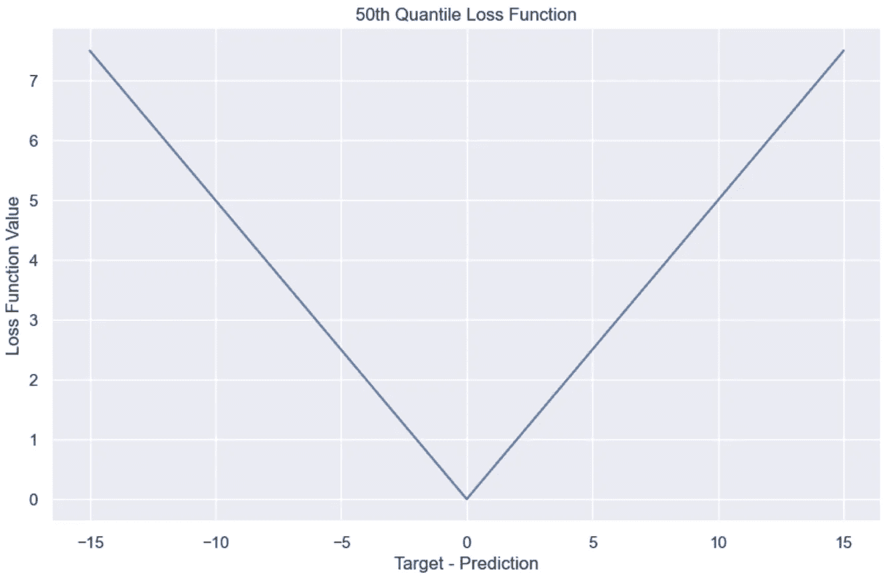
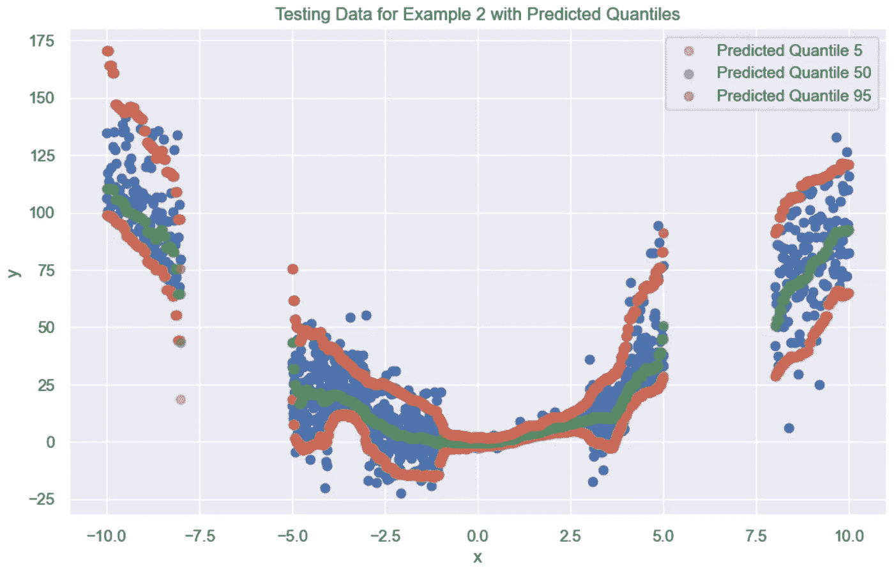

# 预测概率分布的新方法

> 原文：[`towardsdatascience.com/a-new-way-to-predict-probability-distributions-e7258349f464`](https://towardsdatascience.com/a-new-way-to-predict-probability-distributions-e7258349f464)

## 探索 Catboost 的多分位数回归

[](https://harrisonfhoffman.medium.com/?source=post_page-----e7258349f464--------------------------------)[](https://towardsdatascience.com/?source=post_page-----e7258349f464--------------------------------) [Harrison Hoffman](https://harrisonfhoffman.medium.com/?source=post_page-----e7258349f464--------------------------------)

·发表于 [Towards Data Science](https://towardsdatascience.com/?source=post_page-----e7258349f464--------------------------------) ·阅读时间 10 分钟 ·2023 年 2 月 14 日

--


骰子。图片由作者提供。

我们对机器学习模型的预测可以有多自信？这个问题在过去十年中一直是一个重要的研究领域，并且在高风险的机器学习应用如金融和医疗保健中具有重大意义。尽管许多分类模型，特别是[校准](https://why-calibrators-part-1-of-the-series-on-probability-calibration-9110831c6bde)模型，通过预测目标类别的概率分布提供了不确定性量化，但在回归任务中量化不确定性要复杂得多。

在许多提出的方法中，分位数回归是最受欢迎的之一，因为它对目标分布没有假设。直到最近，分位数回归的主要缺点是每个预测的分位数都需要训练一个模型。例如，为了预测目标分布的第 10、第 50 和第 90 百分位数，需要训练三个独立的模型。Catboost 通过[多分位数损失函数](https://catboost.ai/en/docs/concepts/loss-functions-regression#MultiQuantile:~:text=MultiQuantile,-%5Cdisplaystyle%5Cfrac%7B%5Csum)解决了这个问题——这是一个使单个模型能够预测任意数量分位数的损失函数。

本文将探讨两个使用多分位数损失函数的合成数据示例。虽然这些示例不一定能反映真实世界的数据集，但它们将帮助我们理解该损失函数如何通过预测目标分布的分位数来量化不确定性。有关机器学习中噪声和不确定性的快速回顾，请参见这篇文章：

[](/understanding-noisy-data-and-uncertainty-in-machine-learning-4a2995a84198?source=post_page-----e7258349f464--------------------------------) ## 理解机器学习中的噪声数据和不确定性

### 你的机器学习模型不起作用的真正原因

towardsdatascience.com

这篇文章的后续内容现已发布：

[](/another-conformal-way-to-predict-probability-distributions-fcc63e78680d?source=post_page-----e7258349f464--------------------------------) ## 另一种（符合性）预测概率分布的方法

### 使用 Catboost 的符合性多分位数回归

towardsdatascience.com

# 分位数回归简要概述

在有监督的机器学习中，通常的任务是训练一个模型，以预测给定一组输入特征时目标的期望值：


有监督机器学习。图片由作者提供。

值得注意的是，这种方式训练的模型产生一个单一预测，指示模型认为在给定特征的情况下目标的最*可能*值。在回归任务中，这通常是条件特征下目标分布的均值。

然而，如 [上一篇文章](https://medium.com/towards-data-science/understanding-noisy-data-and-uncertainty-in-machine-learning-4a2995a84198) 中所示，大多数机器学习模型在噪声数据集上训练，而仅仅预测目标的条件期望值不足以充分描述目标分布。要看到这一点，请考虑以下噪声回归数据集：


噪声线性回归数据。图片由作者提供。

即使模型预测与数据最优匹配，它也没有量化不确定性。例如，当 x 接近 0.4 时，最佳拟合线预测 y 为 3.8。虽然在 x 接近 0.4 时 3.8 是 y 最可能的值，但数据中有许多例子 y 的值远高于或低于 3.8。换句话说，目标的条件分布在其例外之外具有高变异性，而分位数回归帮助我们描述这一点。

在分位数回归中，损失函数被修改以鼓励模型学习条件目标分布的期望分位数。


分位数回归损失函数。图片由作者提供。

为了更好地理解这个损失函数，假设一个模型正在训练以学习目标分布的第 95 百分位数。在第一个例子中，考虑一个训练样本，其中目标值为 45，模型预测为 60（即模型高估了目标 15）。假设每个训练样本的权重为 1。损失函数在这些值下的评估如下：


第 95 百分位数损失函数高估。作者提供的图像。

现在，假设目标值为 45，模型预测为 30（即模型低估目标 15）。损失函数的值看起来差异很大：


第 95 百分位数损失函数低估。作者提供的图像。

尽管在两个例子中模型预测都偏差了 15，但损失函数对低估的惩罚远高于高估。因为学习的是第 95 百分位数，损失函数对低于目标的任何预测惩罚系数为 0.95，对高于目标的预测惩罚系数为 0.05。因此，当学习第 95 百分位数时，模型“被迫”倾向于高估而非低估。这种情况发生在学习任何中位数以上的百分位数时 — 学习中位数以下的百分位数时情况正好相反。为了更好地理解这一点，我们可以可视化每个预测百分位数的损失函数：


第 95 百分位数损失函数。低估（即目标 — 预测 > 0）受到更重的惩罚。作者提供的图像。



第 50 百分位数损失函数。高估和低估受到相同的惩罚。作者提供的图像。


第 10 百分位数损失函数。高估（即目标 — 预测 < 0）受到更重的惩罚。作者提供的图像。

Catboost 现在通过允许基础决策树在每个节点输出多个百分位数来扩展这个概念。这使得单个模型可以通过最小化新的损失函数来预测多个百分位数：


Catboost 多百分位数损失函数。作者提供的图像。

# 示例 1 — 简单线性回归

为了理解多百分位数损失函数如何工作，我们从一个简单的数据集开始。以下 Python 代码生成一个带有高斯加性噪声的合成线性数据集：

```py
import numpy as np
import pandas as pd
import matplotlib.pyplot as plt
import seaborn as sns
from catboost import CatBoostRegressor
sns.set()

# Number of training and testing examples
n = 1000

# Generate random x values between 0 and 1
x_train = np.random.rand(n)
x_test = np.random.rand(n)

# Generate random noise for the target
noise_train = np.random.normal(0, 0.3, n)
noise_test = np.random.normal(0, 0.3, n)

# Set the slope and y-intercept of the line
a, b = 2, 3

# Generate y values according to the equation y = ax + b + noise
y_train = a * x_train + b + noise_train
y_test = a * x_test + b + noise_test
```

结果训练数据应该类似于此：


嘈杂的线性回归数据。作者提供的图像。

接下来，需要为预测指定目标分布的百分位数。为了展示多百分位数损失的强大功能，该模型将寻求为每个观察预测 99 个不同的百分位数值。这几乎可以认为是从每个预测分布中采样 99 个样本。

```py
# Store quantiles 0.01 through 0.99 in a list
quantiles = [q/100 for q in range(1, 100)]

# Format the quantiles as a string for Catboost
quantile_str = str(quantiles).replace('[','').replace(']','')

# Fit the multi quantile model
model = CatBoostRegressor(iterations=100,
                          loss_function=f'MultiQuantile:alpha={quantile_str}')

model.fit(x_train.reshape(-1,1), y_train)

# Make predictions on the test set
preds = model.predict(x_test.reshape(-1, 1))
preds = pd.DataFrame(preds, columns=[f'pred_{q}' for q in quantiles])
```

结果预测的数据框如下所示：


百分位数预测。图片由作者提供。

每一行对应一个测试示例，每一列给出一个预测的百分位数。例如，第一个测试示例的第 10 百分位数预测值为 3.318624\. 由于只有一个输入特征，我们可以将几个预测的百分位数叠加在测试数据上进行可视化：

```py
fig, ax = plt.subplots(figsize=(10, 6))
ax.scatter(x_test, y_test)

for col in ['pred_0.05', 'pred_0.5', 'pred_0.95']:
    ax.scatter(x_test.reshape(-1,1), preds[col], alpha=0.50, label=col)

ax.legend()
```


测试数据与预测的百分位数叠加。图片由作者提供。

从视觉上看，第 95 百分位数和第 5 百分位数似乎很好地考虑了数据的不确定性。此外，第 50 百分位数（即中位数）大致近似于最佳拟合线。在处理预测的百分位数时，我们通常感兴趣的一个指标是覆盖率。覆盖率是落在两个期望百分位数之间的目标百分比。例如，覆盖率可以使用第 5 百分位数和第 95 百分位数计算如下：

```py
coverage_90 = np.mean((y_test <= preds['pred_0.95']) & (y_test >= preds['pred_0.05']))*100
print(coverage_90) 
# Output: 91.4
```

使用第 5 百分位数和第 95 百分位数，假设完美的校准，我们预计覆盖率为 95–5 = 90%。在这个示例中，预测的百分位数略有偏差，但仍然接近，覆盖率值为 91.4%。

现在让我们分析模型输出的整个预测分布。回顾一下，最佳拟合线是 y = 2x + 3\. 因此，对于任何输入 x，预测分布的均值应接近 2x + 3\. 同样，由于数据中加入了标准差为 0.3 的随机高斯噪声，预测分布的标准差应接近 0.3\. 让我们来测试一下：

```py
# Give the model a new input of x = 0.4
x = np.array([0.4])

# We expect the mean of this array to be about 2*0.4 + 3 = 3.8
# We expect the standard deviation of this array to be about 0.30
y_pred = model.predict(x.reshape(-1, 1))

mu = np.mean(y_pred)
sigma = np.std(y_pred)
print(mu) # Output: 3.836147287742427
print(sigma) # Output: 0.3283984093786787

# Plot the predicted distribution
fig, ax = plt.subplots(figsize=(10, 6))
_ = ax.hist(y_pred.reshape(-1,1), density=True)
ax.set_xlabel('$y$')
ax.set_title(f'Predicted Distribution $P(y|x=4)$, $\mu$ = {round(mu, 3)}, $\sigma$ = {round(sigma, 3)}')
```


当 x = 4 时 y 的预测分布。图片由作者提供。

令人惊讶的是，预测分布似乎与我们的预期一致。接下来，让我们尝试一个更困难的例子。

# 示例 2—具有可变噪声的非线性回归

为了看到多百分位数回归的真正威力，让我们使学习任务更加困难。以下代码创建了一个具有异质噪声的非线性数据集，这些噪声依赖于域的特定区域：

```py
# Create regions of the domain that have variable noise
bounds = [(-10, -8), (-5, -4), (-4, -3), (-3, -1), (-1, 1), (1, 3), (3, 4), (4, 5), (8, 10)]
scales = [18, 15, 8, 11, 1, 2, 9, 16, 19]

x_train = np.array([])
x_test = np.array([])
y_train = np.array([])
y_test = np.array([])

for b, scale in zip(bounds, scales):

    # Randomly select the number of samples in each region 
    n = np.random.randint(low=100, high = 200)

    # Generate values of the domain between b[0] and b[1]
    x_curr = np.linspace(b[0], b[1], n)

    # For even scales, noise comes from an exponential distribution
    if scale % 2 == 0:

        noise_train = np.random.exponential(scale=scale, size=n)
        noise_test = np.random.exponential(scale=scale, size=n)

    # For odd scales, noise comes from a normal distribution
    else:

        noise_train = np.random.normal(scale=scale, size=n)
        noise_test = np.random.normal(scale=scale, size=n)

    # Create training and testing sets
    y_curr_train = x_curr**2  + noise_train
    y_curr_test = x_curr**2  + noise_test

    x_train = np.concatenate([x_train, x_curr])
    x_test = np.concatenate([x_test, x_curr])
    y_train = np.concatenate([y_train, y_curr_train])
    y_test = np.concatenate([y_test, y_curr_test])
```

结果训练数据如下所示：


示例 2 的训练数据。图片由作者提供。

我们将以与示例 1 相同的方式拟合 Catboost 回归器，并在测试集上可视化预测结果：

```py
model = CatBoostRegressor(iterations=300,
                          loss_function=f'MultiQuantile:alpha={quantile_str}')

model.fit(x_train.reshape(-1,1), y_train)

preds = model.predict(x_test.reshape(-1, 1))
preds = pd.DataFrame(preds, columns=[f'pred_{q}' for q in quantiles])

fig, ax = plt.subplots(figsize=(10, 6))
ax.scatter(x_test, y_test)

for col in ['pred_0.05', 'pred_0.5', 'pred_0.95']:

    quantile = int(float(col.split('_')[-1])*100)
    label_name = f'Predicted Quantile {quantile}'
    ax.scatter(x_test.reshape(-1,1), preds[col], alpha=0.50, label=label_name)

ax.set_xlabel('x')
ax.set_ylabel('y')
ax.set_title('Testing Data for Example 2 with Predicted Quantiles')
ax.legend()
```



测试数据与预测的百分位数叠加。图片由作者提供。

通过视觉检查，模型很好地刻画了这种非线性、异方差的关系。注意在 x = 0 附近，三个预测分位数趋向于一个单一值。这是因为 x = 0 附近的区域几乎没有噪声——任何正确预测该区域条件概率分布的模型都应预测出小方差。相反，当 x 在 7.5 到 10.0 之间时，由于该区域的固有噪声，预测的分位数则相距更远。90% 覆盖度可以像以前一样计算：

```py
coverage_90 = np.mean((y_test <= preds['pred_0.95']) & (y_test >= preds['pred_0.05']))*100
print(coverage_90) 
# Output: 90.506
```

使用第 5 和第 95 分位数，假设完美校准，期望覆盖度为 95–5 = 90%。在这个例子中，预测的分位数甚至比示例 1 更好，覆盖度达到了 90.506%。

最后，让我们查看一些输入及其相应的预测分布。


x = -0.06 的预测目标分布。图像作者提供。

上述分布在相对较小的方差下很好地捕捉了目标值。这是可以预期的，因为当 x = 0 时，训练数据中的目标值几乎没有噪声。与此对比的是当 x = -8.56 时的预测目标分布：


x = -8.56 的预测目标分布。图像作者提供。

该分布向右偏斜，方差更高。这在该数据区域是预期的，因为噪声是从高方差的指数分布中采样的。

# 结论

本文展示了多分位回归在学习任意条件目标分布方面的强大能力。我们只探索了两个一维示例以视觉检查模型性能，但我鼓励任何感兴趣的人尝试在更高维数据上使用多分位损失函数。重要的是要注意，分位回归不提供收敛的统计或算法保证，这些模型的表现将根据学习问题的性质而有所不同。感谢阅读！

*成为会员：* [*https://harrisonfhoffman.medium.com/membership*](https://harrisonfhoffman.medium.com/membership)

*请我喝杯咖啡：* [*https://www.buymeacoffee.com/HarrisonfhU*](https://www.buymeacoffee.com/HarrisonfhU)

# 参考文献

1.  *Catboost 损失函数 —* [`catboost.ai/en/docs/concepts/loss-functions-regression#MultiQuantile`](https://catboost.ai/en/docs/concepts/loss-functions-regression#MultiQuantile)
