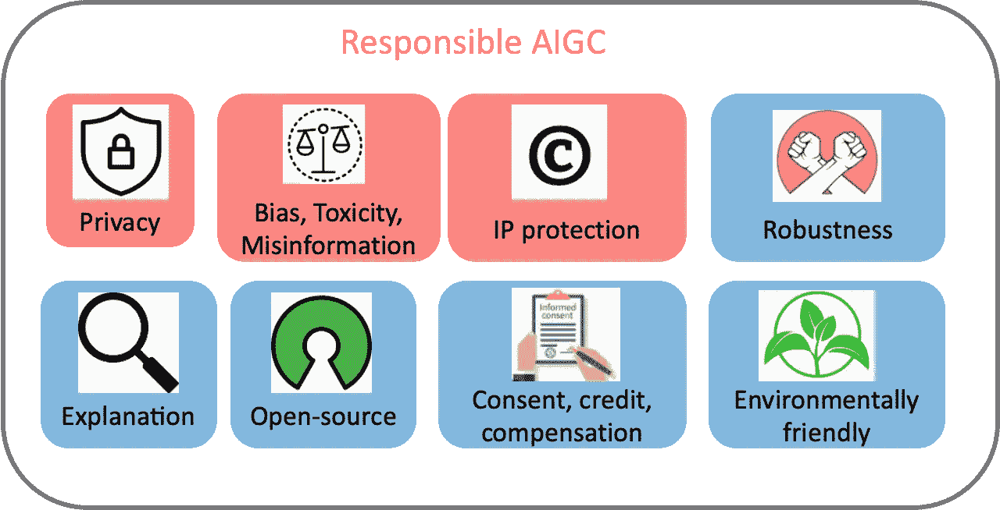
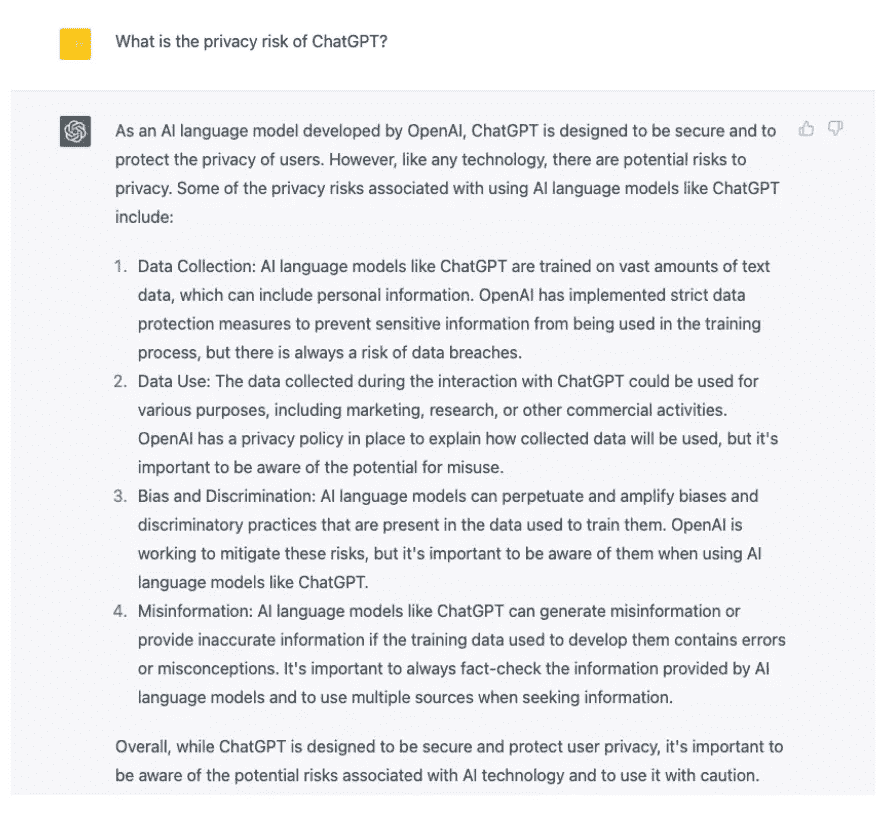
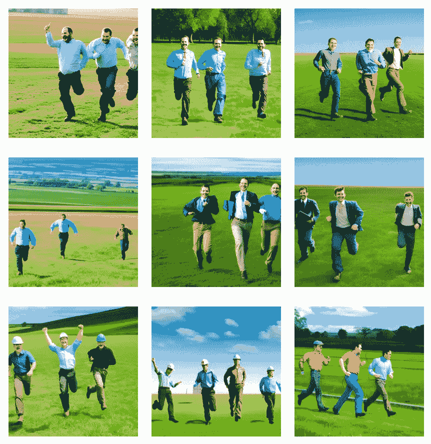

# 迈向负责任的 AI 生成内容之路

> 原文：[`towardsdatascience.com/a-pathway-towards-responsible-ai-generated-content-6c915e8155f9?source=collection_archive---------6-----------------------#2023-03-16`](https://towardsdatascience.com/a-pathway-towards-responsible-ai-generated-content-6c915e8155f9?source=collection_archive---------6-----------------------#2023-03-16)

## 关于隐私、偏见、毒性、错误信息和知识产权问题的警告

 [Lingjuan Lyu](https://lingjuanlyu.medium.com/?source=post_page-----6c915e8155f9--------------------------------)

·

[关注](https://medium.com/m/signin?actionUrl=https%3A%2F%2Fmedium.com%2F_%2Fsubscribe%2Fuser%2Fca2f89d83dfb&operation=register&redirect=https%3A%2F%2Ftowardsdatascience.com%2Fa-pathway-towards-responsible-ai-generated-content-6c915e8155f9&user=Lingjuan+Lyu&userId=ca2f89d83dfb&source=post_page-ca2f89d83dfb----6c915e8155f9---------------------post_header-----------) 发表在 [Towards Data Science](https://towardsdatascience.com/?source=post_page-----6c915e8155f9--------------------------------) · 11 分钟阅读 · 2023 年 3 月 16 日

--

图 1：负责任的 AI 生成内容的范围。

**介绍**

AI 生成内容（AIGC）在过去几年内引起了极大的关注，内容涵盖了图像、文本、音频、视频等。同时，AIGC 成为了一把双刃剑，最近也因其负责任的使用问题受到了许多批评。在这篇愿景论文中，我们关注可能阻碍 AIGC 健康发展和实际部署的三大主要风险，包括：（1）隐私；（2）偏见、毒性、错误信息；和（3）知识产权（IP），如图 1 所示。通过记录已知和潜在的风险，以及 AIGC 可能的误用场景，旨在引起对潜在风险和误用的关注，帮助社会消除障碍，推动 AIGC 更加伦理和安全的部署。此外，我们还提供了在构建生成模型时解决这些风险的有前景的方向，以便 AIGC 能够负责任地使用，以造福社会。

**1\. 隐私**

**隐私泄露**。大型基础模型已知存在隐私风险，建立在这些模型基础上的 AIGC 模型也可能面临隐私泄露。例如，Stable Diffusion 在训练数据中记住了重复的图像 [Rombach *等*, 2022c]。 [Somepalli *等*, 2022] 证明 Stable Diffusion 明目张胆地从训练数据中复制图像，生成的图像仅仅是训练数据集中前景和背景对象的简单组合。此外，系统有时展示了重建记忆的能力，生成的对象在语义上等同于原始对象，但像素形式上并不完全相同。这些图像的存在引发了对数据记忆和扩散图像所有权的担忧。

类似地，近期研究显示 Stable Diffusion 和 Google 的 Imagen 可能泄露真实人物照片和受版权保护的图像 [Heikkila ̈, 2023]。在 Matthew Butterick 最近的诉讼中 [Butterick, 2023]，他指出由于系统中的所有视觉信息都来源于受版权保护的训练图像，因此生成的图像必然是这些训练图像的衍生作品，不论其外观如何。DALL·E 2 也遇到了类似的问题。它有时会再现训练数据中的图像，而不是生成新的图像。OpenAI 发现这种图像复述现象发生的原因是数据集中图像被多次复制。类似地，当我问 ChatGPT “ChatGPT 的隐私风险是什么”时，它回应了 4 种潜在的隐私风险，如图 2 所示。

图 2：ChatGPT 对“ChatGPT 的隐私风险是什么”的回答（2023 年 1 月 30 日版本）。

**隐私措施**。在隐私措施方面，业内，Stability AI 已认识到 Stable Diffusion 的局限性，例如训练数据中可能记忆重复图像的潜在问题。为了解决这一问题，他们提供了一个 [网站](https://rom1504.github.io/clip-retrieval/) 来支持识别这些记忆图像。此外，艺术公司 Spawning AI 创建了一个名为“[Have I Been Trained](https://haveibeentrained.com)”的网站，以帮助用户确定他们的照片或作品是否被用作 AI 训练材料。OpenAI 采取了措施通过去重减少数据重复，以应对隐私问题。此外，微软和亚马逊等公司实施了措施，防止员工泄露机密，通过禁止与 ChatGPT 共享敏感数据，因为这些信息可能被用于 ChatGPT 未来版本的训练数据。

**2.** **偏见、毒性、虚假信息**

**问题数据集和 AIGC 模型**。由于 AI 模型使用的训练数据来自现实世界，它们可能无意中加剧有害的刻板印象，排除或边缘化某些群体，并包含有毒的数据源，这些数据可能煽动仇恨或暴力并冒犯个人 [Weidinger et al., 2021]。例如，用于训练扩散模型的 LAION 数据集因包含与社会刻板印象、色情、种族侮辱和暴力相关的问题内容而受到批评。尽管一些 AIGC 模型如 Imagen 尝试过滤掉不良数据，例如色情图像和有毒语言，但过滤后的数据仍可能包含性暗示或暴力内容。

在没有缓解策略的情况下，使用上述有问题的数据集进行训练、学习或微调的模型可能继承有害的刻板印象、社会偏见和毒性，从而导致对某些社会群体的不公平歧视和伤害 [Weidinger *et al.*, 2021]。例如，Stable Diffusion v1 主要在 LAION-2B 数据集上进行训练，该数据集仅包含英文描述的图像。因此，该模型偏向于白人、西方文化，其他语言的提示可能没有得到充分代表。Stable Diffusion 模型的后续版本在过滤后的 LAION 数据集上进行了微调，但偏见问题仍然存在。类似地，DALLA·E 和 DALLA·E 2 被发现对少数群体表现出负面刻板印象。Google 的 Imagen 也编码了几个社会偏见和刻板印象，例如生成肤色较浅的人物图像并符合西方性别刻板印象。由于这些问题，大多数公司决定不将其 AIGC 模型公开。

为了说明 AIGC 模型中的固有偏差，我们在 Stable Diffusion v2.1 上测试了一个玩具示例。如图 3 所示，使用提示“在草原上奔跑的三名工程师”生成的图像全部是男性，而且没有任何一个属于少数族裔，显示出生成图像的多样性不足。

图 3：使用 Stable Diffusion v2.1 生成的文本“在草原上奔跑的三名工程师”的图像。9 张图像中共有 28 人，全部为男性。而且，没有任何一个人属于少数族裔。这显示了 Stable Diffusion 的巨大偏差。

当模型提供不准确或虚假的答案时，也存在信息错误的风险。GPT 及其衍生模型生成的内容可能看起来准确且权威，但实际上可能完全不准确。因此，这可能被用于学校、法律、医疗领域、天气预报或其他任何地方的误导目的。例如，ChatGPT 提供的医疗剂量答案可能不准确或不完整，可能导致用户采取危险甚至危及生命的行动。关于交通法规的误导性信息如果被驾驶员采纳，可能导致事故甚至死亡。

**偏见、有毒信息、虚假信息的缓解**。OpenAI 采取了额外措施，通过仔细筛选原始训练数据集，确保 DALLA·E 2 的训练数据中移除了任何暴力或性内容。然而，筛选可能会引入偏见，这些偏见可能会传播到下游模型。为了解决这个问题，OpenAI 开发了预训练技术，以缓解由筛选引起的偏见。

为确保 AI 驱动的模型反映当前社会状态，必须定期用最新信息更新 AIGC 模型所用的训练语料。这有助于防止信息滞后，并确保模型保持更新、相关且有益，因此需要定期收集新的训练数据并更新模型。一个明显的点是，虽然可以减少源数据集中的偏见和刻板印象，但这些偏见仍可能在 AIGC 模型的训练和开发过程中被传播甚至加剧。因此，评估模型训练和开发全过程中的偏见、有毒信息和虚假信息的存在是至关重要的，而不仅仅停留在数据源级别。

**3.** **知识产权保护**

**知识产权侵权**。生成内容的所有权和保护引发了大量关注和辩论。如果生成的内容无论是有意还是无意地复制了现有作品，就存在版权侵权的风险，这引发了关于知识产权侵权的法律问题。2022 年 11 月，Matthew Butterick 对微软的子公司 GitHub 提起了集体诉讼，指控其产品 Copilot 侵犯了版权法 [Butterick, 2022]。该诉讼的核心在于 Copilot 非法使用了来自互联网的有版权代码段而未给予署名。德州农工大学的教授 Tim Davis 也提供了他的代码被 Copilot 逐字复制的例子。尽管微软和 OpenAI 已确认 Copilot 是在公共 GitHub 仓库中的开源软件上进行训练的，但微软声称 Copilot 的输出仅仅是一系列代码“建议”，并不主张对这些建议的任何权利。微软还不对生成代码的正确性、安全性或版权做出任何保证。

对于文本生成图像模型，一些生成模型面临了侵犯艺术创作的指控。[Somepalli *et al.*, 2022] 提出了证据，表明像 Stable Diffusion 这样的艺术生成 AI 系统可能会从其训练数据中复制内容。虽然 Stable Diffusion 声明不拥有生成图像的版权，并允许用户在图像内容合法且无害的情况下自由使用这些图像，但这种自由引发了关于所有权伦理的问题。像 Stable Diffusion 这样的生成模型在未经知识产权持有者批准的情况下，训练于来自互联网的数十亿张图像，这被一些人认为是对其权利的侵犯。

**知识产权问题缓解**。为了缓解知识产权问题，许多公司已开始采取措施以适应内容创作者。例如，Midjourney 在其服务条款中添加了 DMCA 删除政策，允许艺术家在怀疑版权侵权时请求将他们的作品从数据集中删除。类似地，Stability AI 计划为艺术家提供一个选项，允许他们从未来版本的 Stable Diffusion 中排除自己。

此外，文本水印，这种水印以前用于保护语言生成 API 的知识产权 [He *et al.*, 2022a; He *et al.*, 2022b]，也可以用来识别这些 AIGC 工具是否未经许可使用了来自其他来源的样本。这在 Stable Diffusion 中表现得很明显，该模型生成的图像上带有 Getty Images 的水印 [Vincent, 2023]。随着 AIGC 的日益流行，水印的需求变得越来越迫切。OpenAI 正在开发一种水印，用于识别其 GPT 模型生成的文本。这将成为教育工作者和教授检测使用此类工具生成的作业中的剽窃行为的有价值工具。谷歌已对其发布的所有图像应用了 Parti 水印。

除了水印技术，OpenAI 还发布了一种分类器，可以区分由 AI 生成的文本和由人类编写的文本。然而，这不应仅仅依赖于此来做出关键决策。

**讨论**

除了在负责任的 AIGC 中提到的问题外，还有更多需要关注的方面，包括但不限于以下几点。

滥用的担忧：为 AIGC 提供动力的基础模型使得创建接近真实的深度伪造变得更容易且更便宜，这带来了额外的风险和担忧。这些技术的滥用可能导致虚假新闻、骗局、骚扰和虚假信息的传播，损害个人声誉，甚至违法。

对投毒攻击的脆弱性：如果基础模型被攻破，将是一场灾难。例如，一个具有隐藏“后门”的扩散模型在数据生成过程中遇到特定触发模式时可能会执行恶意行为[Chou *et al.*, 2022]。这种木马效应可能对依赖于受损扩散模型的下游应用造成灾难性损害。

关于 AIGC 是否会取代人类的辩论：AIGC 的使用面临着那些担心它会取代人类工作的批评。Insider 列出了[几种可能被 ChatGPT 取代的工作](https://www.businessinsider.com/chatgpt-jobs-at-risk-replacement-artificial-intelligence-ai-labor-trends-2023-02)，包括编码员、数据分析师、法律助理、交易员、会计师等。一些艺术家担心，诸如 Stable Diffusion 这样的图像生成工具的广泛使用，最终可能使人类艺术家、摄影师、模特、摄影师和演员在商业上失去竞争力[Heikkila ̈, 2022b]。

可解释的 AIGC：基础模型的“黑箱”特性可能导致不令人满意的结果。例如，常常很难确定生成模型输出所使用的信息，这会导致数据集中出现偏差。解释是理解 AIGC 为何以及如何产生这些问题的关键因素。

负责任的开源：由于 AIGC 背后的代码和模型对公众不透明，并且它们的下游应用多样，可能具有复杂的社会影响，因此很难确定它们可能造成的潜在危害。因此，负责任的开源变得至关重要，以确定在特定使用案例中 AIGC 的利益是否超过其潜在风险。

用户反馈：收集用户反馈也是负责任 AIGC 的一个关键因素。像 OpenAI 这样的公司积极寻求用户反馈，以识别在实际场景中可能出现的有害输出，并发现和缓解新的风险。通过将用户纳入反馈循环，AIGC 开发者可以更好地理解模型的潜在后果，并采取纠正措施以最小化任何负面影响。

对数据拥有者或贡献者的同意、信用和补偿：许多 AIGC 模型是在未获得同意或未向原始数据贡献者提供信用或补偿的情况下训练的。为了避免负面影响，AIGC 公司在训练模型之前应获得数据贡献者的同意，并采取积极措施。如果未能做到这一点，可能会导致针对 AIGC 的诉讼。

训练 AIGC 模型造成的环境影响：AIGC 模型的巨大规模，可能拥有数十亿或数万亿个参数，导致了模型训练和运行的高环境成本。例如，GPT-3 拥有 1750 亿个参数，需要大量的计算资源来进行训练。GPT-4 可能比前身有更多的参数，并预计会产生更显著的碳排放。如果不采取适当措施来减轻 AIGC 的高能源成本，可能会对我们的星球造成无法修复的损害。

**结论**

尽管 AIGC 仍处于起步阶段，但其发展迅速，并将在可预见的未来保持活跃。目前的 AIGC 技术只是 AI 在艺术领域创作潜力的冰山一角。虽然 AIGC 提供了许多机会，但也带来了重大风险。在这项工作中，我们提供了对当前和潜在威胁的概要，以便用户和公司能够充分认识这些风险，并采取适当措施加以减轻。公司在所有 AIGC 相关项目中融入负责任的 AI 实践至关重要。

除非另有说明，所有图片均为作者所摄。

**论文链接**：

[## [2303.01325] 走向负责任的 AI 生成内容之路

### 摘要：AI 生成内容（AIGC）在过去几年受到了极大的关注，内容范围涵盖……

[128.84.21.203](http://128.84.21.203/abs/2303.01325?source=post_page-----6c915e8155f9--------------------------------)

**参考文献**

*[Rombach et al., 2022c] Robin Rombach, Andreas Blattmann, Dominik Lorenz, Patrick Esser 和 Bjo ̈rn Ommer. 稳定扩散 v1 模型卡。* [*https://github.com/CompVis/stable-diffusion/blob/main/*](https://github.com/CompVis/stable-diffusion/blob/main/) *Stable Diffusion v1 Model Card.md, 2022。*

*[Heikkila ̈, 2023] Melissa Heikkila ̈. AI 模型吐出的真实人物照片和受版权保护的图像。* [*https://www.technologyreview.com/2023/02/*](https://www.technologyreview.com/2023/02/) *03/1067786/ai-models-spit-out-photos-of-real-people-and-copyrighted-images/, 2023。*

*[Butterick, 2022] Matthew Butterick. Github copilot 调查。* [*https://githubcopilotinvestigation.com/,*](https://githubcopilotinvestigation.com/,) *2022。*

*[Butterick, 2023] Matthew Butterick. 稳定扩散诉讼。* [*https://stablediffusionlitigation.com,*](https://stablediffusionlitigation.com,) *2023。*

*[索梅帕利等, 2022] 高瓦米·索梅帕利, 瓦苏·辛格拉, 米卡·戈德布鲁姆, 乔纳斯·盖平, 和 汤姆·戈德斯坦。扩散艺术还是数字伪造？调查扩散模型中的数据复制。arXiv 预印本 arXiv:2212.03860, 2022。*

*[何等, 2022a] 何玄力, 徐琼凯, 吕灵娟, 吴方钊, 和 王成光。通过词汇水印保护语言生成 API 的知识产权。AAAI, 2022。*

*[何等, 2022b] 何玄力, 徐琼凯, 曾义, 吕灵娟, 吴方钊, 李季伟, 和 贾若溪。Cater：通过条件水印保护文本生成 API 的知识产权。神经信息处理系统进展, 2022。*

*[文森特, 2023] 詹姆斯·文森特。Getty 图片公司起诉 AI 艺术工具 Stable Diffusion 的创作者，因其抓取了 Getty 的内容。* [*https://www.theverge.com/2023/1/17/23558516/*](https://www.theverge.com/2023/1/17/23558516/) *ai-art-copyright-stable-diffusion-getty-images-lawsuit, 2023。*

*[魏丁格等, 2021] 劳拉·魏丁格, 约翰·梅洛, 玛丽贝丝·劳, 康纳·格里芬, 乔纳森·尤萨托, 黄博森, 玛伊拉·程, 米亚·格莱斯, 博尔哈·巴列, 阿图萨·卡西尔扎德, 等。语言模型的伦理和社会风险。arXiv 预印本 arXiv:2112.04359, 2021。*

*[海基拉, 2022b] 梅利莎·海基拉。这个艺术家主宰了 AI 生成的艺术，并且对此感到不满。* [*https://www.technologyreview.com/2022/09/16/*](https://www.technologyreview.com/2022/09/16/) *1059598/this-artist-is-dominating-ai-generated-art-and-hes-not-happy-about-it/, 2022。*

*[周等, 2022] 周声彦, 陈品渝, 和 何宗义。如何在扩散模型中植入后门？arXiv 预印本 arXiv:2212.05400, 2022。*
