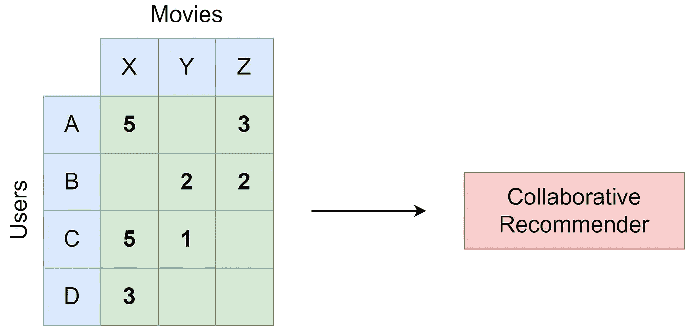
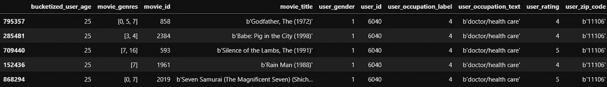
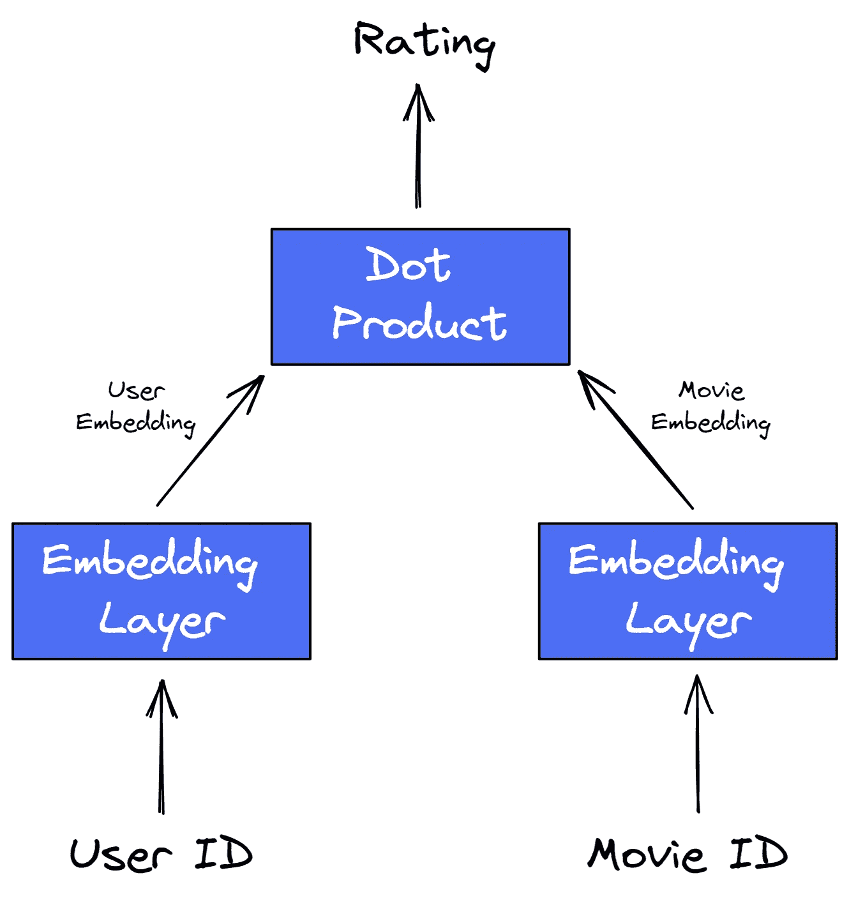
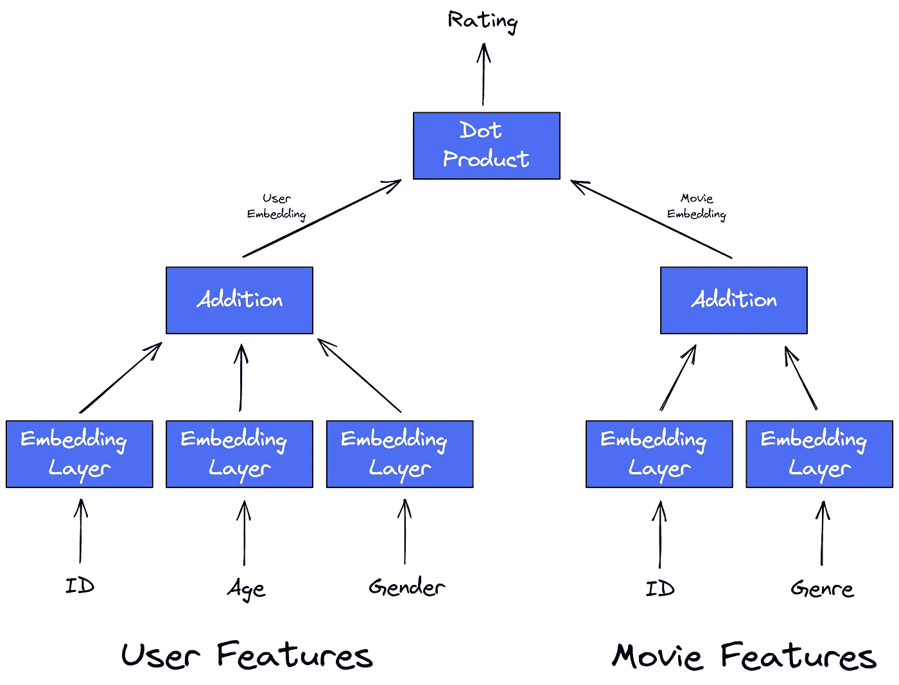
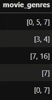
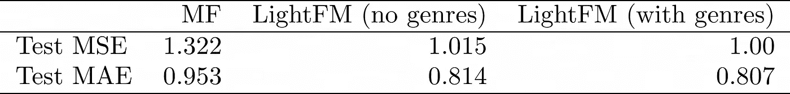

# 没有冷启动问题的高效推荐系统

> 原文：[`towardsdatascience.com/a-performant-recommender-system-without-cold-start-problem-69bf2f0f0b9b`](https://towardsdatascience.com/a-performant-recommender-system-without-cold-start-problem-69bf2f0f0b9b)

## [推荐系统](https://medium.com/tag/recommendation-system)

## 当协同过滤和基于内容的推荐系统合并时

[](https://dr-robert-kuebler.medium.com/?source=post_page-----69bf2f0f0b9b--------------------------------)[](https://towardsdatascience.com/?source=post_page-----69bf2f0f0b9b--------------------------------) [Dr. Robert Kübler](https://dr-robert-kuebler.medium.com/?source=post_page-----69bf2f0f0b9b--------------------------------)

·发表于 [Towards Data Science](https://towardsdatascience.com/?source=post_page-----69bf2f0f0b9b--------------------------------) ·阅读时间 11 分钟·2023 年 1 月 31 日

--


图片由 [Ivan Aleksic](https://unsplash.com/@ivalex?utm_source=medium&utm_medium=referral) 提供，来源于 [Unsplash](https://unsplash.com/?utm_source=medium&utm_medium=referral)

也许最著名的推荐系统是所谓的**矩阵分解**。在这种**协同过滤**推荐系统中，用户和项目都通过**嵌入**表示，这不过是一个数字向量。直观的理解是，用户和项目嵌入的点积应等于用户对该项目的评分。

如果你对这些概念还不熟悉，我建议（😉）在继续之前阅读我的另一篇文章，因为我在其中解释了许多概念和代码片段。

[](/introduction-to-embedding-based-recommender-systems-956faceb1919?source=post_page-----69bf2f0f0b9b--------------------------------) ## 嵌入式推荐系统简介

### 学习如何在 TensorFlow 中构建一个简单的推荐系统

towardsdatascience.com

# 冷启动问题

纯粹的协同过滤推荐系统，如矩阵分解，有一个优点，即使没有太多关于用户和你想推荐的电影/文章/项目的数据，你也通常可以立即构建它们。你只需要知道谁对什么进行了评分以及评分情况；例如，用户*B*对电影*Y*的评分为 2 星。



作者提供的图片。

然而，当你有**新**的**用户或项目**时，它们就不够用了，因为模型没有机会学习这些内容，从而基本上为这些用户或项目提供了随机推荐——这就是令人头疼的**冷启动问题**。假设另一个用户*E*注册了，我们还在数据库中添加了一个新电影*W*。


图片由作者提供。

在这篇文章中，我将展示一种通过结合更多关于用户和项目的特征来缓解冷启动问题的简单方法——这就是我们将加入到模型中的**基于内容的**组件。使用实际内容数据，如用户年龄或电影类型，生成的模型能更好地处理新用户或新电影。

# 回到 MovieLens

和我上一篇文章一样，我将使用 [MovieLens](https://movielens.org/) 数据集，它提供了用户-电影评分。此外，它还包含了一些用户和电影特征，尽管我们在上一篇文章中忽略了这些特征，但今天我们将利用这些特征来构建更好的模型！

> *你可以在* [*我的 Github*](https://github.com/Garve/Towards-Data-Science---Notebooks/blob/main/TDS%20-%20A%20Performant%20Recommender%20System%20Without%20Cold%20Start%C2%A0Problem.ipynb)*找到代码*。

跟随上一篇文章让我们

1.  使用 tensorflow-datasets 获取数据

1.  将其制作成数据框并更改一些列类型，然后

1.  按时间排序以进行时间上的训练-测试分割

```py
import tensorflow_datasets as tfds

data = tfds.load("movielens/1m-ratings")
df = tfds.as_dataframe(data["train"])

filtered_data = (
    df
    .sort_values("timestamp") # for a temporal train-eval-test split
    .astype(
        {
            "bucketized_user_age": int,
            "movie_id": int,
            "movie_title": str,
            "user_gender": int,
            "user_id": int,
            "user_occupation_label": int,
            "user_occupation_text": str,
            "user_rating": int,
            "user_zip_code": str,
        }
    )
    .drop(columns=["timestamp"])
)

# temporal train-eval-test split
train = filtered_data.iloc[:80000]
evaluation = filtered_data.iloc[80000:90000]
test = filtered_data.iloc[90000:]

X_train = train.drop(columns=["user_rating"])
y_train = train["user_rating"]
X_eval = evaluation.drop(columns=["user_rating"])
y_eval = evaluation["user_rating"]
X_test = test.drop(columns=["user_rating"])
y_test = test["user_rating"]
```

`filtered_data` 数据框



图片由作者提供。

告诉我们除了**user_id、movie_id**和目标**user_rating**之外，我们还有**用户特征**

+   bucketized_user_age

+   user_gender

+   user_occupation_label

+   user_occupation_text

+   user_zip_code

以及**电影特征**

+   movie_genres

+   movie_title

使用一些刻板印象：

> 从直观上看，这些特征应该非常有帮助，因为模型可以学习“女性喜欢戏剧”或“年轻人不喜欢老电影”之类的内容。

我们现在将了解如何通过一个简单的网络架构**LightFM**来使用所有这些额外特征。这个名字是由 [Maciej Kula](https://www.linkedin.com/in/maciej-kula-57283147/) 在他写得很好的论文 **Metadata Embeddings for User and Item Cold-start Recommendations** [1] 中选择的。请阅读一下！

> LightFM 是一种混合型推荐系统，因为它使用评分以及用户和项目特征。

# LightFM 的简单想法

让我们首先回顾一下我们简单的矩阵分解是怎样的，省略偏差。在我们旧的推荐系统中，我们使用了**user_id**和**movie_id**，将两者进行嵌入，然后计算点积来计算评分。



矩阵分解架构，图片由作者提供。

对于**LightFM**，它是这样工作的：

1.  我们**嵌入所有特征**，包括用户特征和电影特征。

1.  用户（电影）嵌入是**所有这些用户（电影）特性嵌入的总和**。

就这样！对于某些特定的特性，网络架构可能看起来像这样：



LightFM 架构，图片由作者提供。

## 优势

这个方法的好处是，即使你将新用户或电影添加到数据库中，只要知道它们的特性（*内容*），你也可以创建有意义的嵌入。你不会知道 ID 的嵌入——这是矩阵分解方法中的主要问题——但我们希望其他嵌入可以弥补这一点。在冷启动设置中，**user_id** 或 **movie_id** 是未知的，但我们仍然可以给它们一些默认的嵌入。

# 在 TensorFlow 中的实现

仅用两个 ID 作为输入，明确指定输入、编码、嵌入和偏差就足够了。然而，对于我们的特性数量，先定义一些配置然后使用循环是有意义的。

> ***注意：*** *我们将省略* ***movie_title*** *和* ***movie_genres*** *，因为我们必须以不同于其他特性的方式处理它们。然而，我会告诉你如何将这些特性也纳入其中。*

```py
features_config = {
    "user_id": {"entity": "user", "dtype": tf.int64},
    "bucketized_user_age": {"entity": "user", "dtype": tf.int64},
    "user_gender": {"entity": "user", "dtype": tf.int64},
    "user_occupation_label": {"entity": "user", "dtype": tf.int64},
    "movie_id": {"entity": "movie", "dtype": tf.int64},
    "user_zip_code": {"entity": "user", "dtype": tf.string},
    "user_occupation_text": {"entity": "user", "dtype": tf.string},
}

for name, config in features_config.items():
    if config["dtype"] == tf.int64:
        config["encoding_layer_class"] = tf.keras.layers.IntegerLookup
    elif config["dtype"] == tf.string:
        config["encoding_layer_class"] = tf.keras.layers.StringLookup
    else:
        raise Exception

    config["vocab"] = train[name].unique()
```

我们现在有一个详细的配置字典，它告诉我们每个特性的信息。

+   输入层需要的*dtype*，

+   特性是否属于电影或用户特性，

+   需要哪个查找层，即`IntegerLookup`用于整数特性，`StringLookup`用于字符串特性，

+   以及词汇表，即每个特性的唯一类。

然后，我们可以定义一个 TensorFlow 模型来实现我们在 LightFM 架构图中看到的内容：

```py
# define input layers for each feature
inputs = {
    name: tf.keras.layers.Input(shape=(1,), name=name, dtype=config["dtype"])
    for name, config in features_config.items()
}

# encode all features as integers via the lookup layers
inputs_encoded = {
    name: config"encoding_layer_class"(inputs[name])
    for name, config in features_config.items()
}

# create embeddings for all features
embeddings = {
    name: tf.keras.layers.Embedding(
        input_dim=len(config["vocab"]) + 1,
        output_dim=32,
    )(inputs_encoded[name])
    for name, config in features_config.items()
}

# create embeddings for all features
biases = {
    name: tf.keras.layers.Embedding(input_dim=len(config["vocab"]) + 1, output_dim=1)(
        inputs_encoded[name]
    )
    for name, config in features_config.items()
}

# compute the user embedding as the sum of all user feature embeddings
user_embedding = tf.keras.layers.Add()(
    [
        embeddings[name]
        for name, config in features_config.items()
        if config["entity"] == "user"
    ]
)

# compute the movie embedding as the sum of all movie feature embeddings
movie_embedding = tf.keras.layers.Add()(
    [
        embeddings[name]
        for name, config in features_config.items()
        if config["entity"] == "movie"
    ]
)

# compute the user bias as the sum of all user feature biases
user_bias = tf.keras.layers.Add()(
    [
        biases[name]
        for name, config in features_config.items()
        if config["entity"] == "user"
    ]
)

# compute the movie bias as the sum of all movie feature biases
movie_bias = tf.keras.layers.Add()(
    [
        biases[name]
        for name, config in features_config.items()
        if config["entity"] == "movie"
    ]
)

# do the exact same thing as in matrix factorization, 
# i.e. compute the dot product of the user and movie embedding,
# add the user and movie bias, and squash the result into the range [1, 5]
dot = tf.keras.layers.Dot(axes=2)([user_embedding, movie_embedding])
add = tf.keras.layers.Add()([dot, user_bias, movie_bias])
flatten = tf.keras.layers.Flatten()(add)
squash = tf.keras.layers.Lambda(lambda x: 4 * tf.nn.sigmoid(x) + 1)(flatten)

model = tf.keras.Model(
    inputs=[inputs[name] for name in features_config.keys()], outputs=squash
)

model.compile(loss="mse", metrics=[tf.keras.metrics.MeanAbsoluteError()])
```

我知道这很繁重。但如果你也阅读了我关于基于嵌入的推荐系统的其他文章，应该没有大惊小怪的地方。我们准备好训练模型了！

```py
model.fit(
    x={name: X_train[name].values for name in features_config.keys()},
    y=y_train.values,
    batch_size=256,
    epochs=100,
    validation_data=(
        {name: X_eval[name].values for name in features_config.keys()},
        y_eval.values,
    ),
    callbacks=[tf.keras.callbacks.EarlyStopping(patience=1, restore_best_weights=True)],
)

# Output:
# [...]
# Epoch 6/100
# 313/313 [==============================] - 1s 3ms/step - loss: 0.7626 - mean_absolute_error: 0.6836 - val_loss: 0.9836 - val_mean_absolute_error: 0.7985
```

测试集上的表现：

```py
model.evaluate(
    x={name: X_test[name].values for name in features_config.keys()},
    y=y_test.values,
    batch_size=1_000_000,
)

# Output:
# 1/1 [==============================] - 1s 667ms/step - loss: 1.0153 - mean_absolute_error: 0.8135
```

你也可以尝试在这种设置中进行矩阵分解；你只需将`features_config`字典更改为

```py
features_config = {
    "user_id": {"entity": "user", "dtype": tf.int64},
    "movie_id": {"entity": "movie", "dtype": tf.int64},
}
```

通过删除一些行，然后执行剩余的代码。在这种情况下，结果是测试 MSE 为 1.322 和 MAE 为 0.953，这比 LightFM 结果差得多。这看起来很棒！

## 处理电影类型

到目前为止，我们忽略了可能极具信息量的列**movie_genres**，因为它比分类变量更难处理，因为这里我们有一个整数列表而不是单个整数。所以，我们必须制定一些逻辑来处理这个问题。



图片由作者提供。

处理这个最简单的方法是为每个类型创建一个嵌入，然后取它们的均值。你可以使用`GlobalAveragePooling1D`层来实现这一点。

为了在代码中实现这个想法，请执行以下操作：

```py
# new movie embeddings
all_movie_genres = train["movie_genres"].explode().unique().astype(int) # get all different genres
movie_genres_input = tf.keras.layers.Input(shape=(None,), name="movie_genres")
movie_genres_as_integer = tf.keras.layers.IntegerLookup(vocabulary=all_movie_genres)(movie_genres_input)
movie_genres_embeddings = tf.keras.layers.Embedding(input_dim=len(all_movie_genres) + 1, output_dim=32)(movie_genres_as_integer)
movie_genres_biases = tf.keras.layers.Embedding(input_dim=len(all_movie_genres) + 1, output_dim=1)(movie_genres_as_integer)
movie_genres_embedding = tf.keras.layers.GlobalAveragePooling1D(keepdims=True)(movie_genres_embeddings)
movie_genres_bias = tf.keras.layers.GlobalAveragePooling1D(keepdims=True)(movie_genres_biases)

movie_embedding = tf.keras.layers.Add()(
    [
        embeddings[name]
        for name, config in features_config.items()
        if config["entity"] == "movie"
    ] + [movie_genres_embedding] # add the movie genres embedding here as well
)

# new movie bias
movie_bias = tf.keras.layers.Add()(
    [
        biases[name]
        for name, config in features_config.items()
        if config["entity"] == "movie"
    ] + [movie_genres_bias] # add the movie genres bias here as well
)

# add the movie inut to the inputs
model = tf.keras.Model(
    inputs=[inputs[name] for name in features_config.keys()] + [movie_genres_input], outputs=squash
)
```

其余部分保持不变。在拟合、评估和测试模型时，你只需将特征**movie_genres**添加到模型中。由于类型的形状有点困难，因为列表的长度不同，所以 TensorFlow 在将其转换为常规张量时遇到问题。幸运的是，TensorFlow 通过提供**ragged tensors**（通过`tf.ragged.constant`）来处理这些可变大小的张量。

```py
model.fit(
    x={
        **{name: X_train[name].values for name in features_config.keys()},
        "movie_genres": tf.ragged.constant(X_train["movie_genres"].values)
    },

# [...]
```

在测试集上拟合和评估模型显示了另一个改进，尽管小于预期。MSE 约为 1.0，MAE 约为 0.807。



所有结果的综合。图片由作者提供。

## 处理电影标题

另一个有趣的特征是我们迄今为止忽略的，因为它包含关于电影系列的信息。有了这些信息，我们可以使模型更容易学习一些用户非常喜欢所有的蝙蝠侠电影。例如，*编码这个是你的作业*。一种方法是将标题字符串分割成单词列表，然后按照我们对待类型的方法进行处理。你甚至可以使用句子编码器、类似变换器的架构、LSTM 或其他任何方法将文本转换为嵌入。

## 进行预测

你可以通过提供所有必要的特征来进行预测，方法如下：

```py
query = {
    "user_id": tf.constant([-1]), # unknown user!
    "bucketized_user_age": tf.constant([18]),
    "user_gender": tf.constant([0]),
    "user_occupation_label": tf.constant([12]),
    "movie_id": tf.constant([1]),
    "user_zip_code": tf.constant(["b'65712'"]),
    "user_occupation_text": tf.constant(["b'writer'"]),
    "movie_genres": tf.ragged.constant([[1, 2, 3]])
}

model.predict(query)

# Output:
# array([[4.0875683]], dtype=float32)
```

在这里，你可以看到一个年轻的未知用户，该用户性别为 0，职业标签为 12，居住在 65712 邮政编码区域，且是一名作家，他可能会喜欢 ID 为 1 的电影，该电影属于 1、2 和 3 这些类型。

# 来自论文的更多有趣见解

我的一个小实验表明，LightFM 可以提高模型性能，正如[1]中所述。这很棒，尽管这可能是你已经预料到的，因为**LightFM 是矩阵分解的一个推广版本**。

在这方面，论文作者写道：

1.  “在冷启动和低密度场景下，LightFM 的表现至少与纯内容模型一样好，当（1）训练集中有协同信息或（2）模型中包含用户特征时，它的表现会大幅超越这些模型。”

1.  “当协同数据丰富（热启动，密集的用户-项目矩阵）时，LightFM 的表现至少与 MF 模型一样好。”

1.  “LightFM 生成的嵌入编码了关于特征的重要语义信息，可用于相关的推荐任务，如标签推荐。”

这些陈述没有证明，但他通过在两个数据集上测试得出了这个结论。这两个数据集都有**二进制标签，** 意味着该项目对用户有用或无用。对于二进制标签，他选择了 AUC 作为评估指标，并在此表格中总结了他的发现：


论文中，MF = 矩阵分解。数字越高越好。

在这里，我们还可以看到 LightFM 在冷启动甚至热启动设置中超越了其他方法。很高兴看到 LightFM 在热启动设置中不比 MF 差，但主要的卖点是**LightFM 在冷启动设置中完全击败了 MF**。

> ***记住：*** *AUC 为 0.5 意味着随机猜测，即某用户随机挑选的* ***相关项目*** *的评分高于该用户的* ***随机选择的非相关项目*** *的概率为* ***50%****。*

# 结论

在这篇文章中，我们讨论了纯协同推荐系统（例如矩阵分解）在面对新用户或新项目时遇到的问题，这被称为冷启动问题。

一旦我们获得更多关于用户和项目的信息，我们可以缓解这个问题，因为模型可以学习一些一般性的模式，例如年轻人不喜欢老电影。因此，如果我们有一个新用户，并且知道他们年轻，好的模型应该将老电影的评分低于新电影。

不过，如果这个新用户继续评分，模型可以调整并学会显示像 [诺斯费拉图](https://en.wikipedia.org/wiki/Nosferatu) 这样的老电影，如果用户的行为表明这可能是一个合适的选择。

具有这些理想特性的模型对我来说感觉有点*贝叶斯*：

> 用户和项目特征嵌入作为一种先验，对预测具有很大的影响，只要我们没有互动数据。随着互动数据的到来，这种先验会发生变化。

然而，一个有趣的问题是，一旦我们拥有**密集评分矩阵**，例如每个用户评分了 95%的所有电影，用户和项目特征是否失去相关性。

不管怎样，LightFM 是一个很好的候选模型，这一点从我和论文作者的实验中可以看出。LightFM 在我们的选定数据集上表现优于 MF，特别是在冷启动设置中。如果冷启动不是问题，改进是微小的，甚至可能只是统计噪声。

**你也可以尝试论文** [**作者对 LightFM 的实现**](https://github.com/lyst/lightfm)**。**

# 参考文献

[1] M. Kula, [用户和项目冷启动推荐的元数据嵌入](https://arxiv.org/abs/1507.08439) (2015)，arXiv 预印本 arXiv:1507.08439

我希望你今天学到了一些新的、有趣的和有用的东西。感谢阅读！

> *如果你有任何问题，可以在* [*LinkedIn*](https://www.linkedin.com/in/dr-robert-k%C3%BCbler-983859150/)*上联系我！*

如果你想深入了解算法的世界，可以尝试我的新出版物**关于算法的一切**！我仍在寻找作者！

[](https://medium.com/all-about-algorithms?source=post_page-----69bf2f0f0b9b--------------------------------) [## 关于算法的一切

### 从直观解释到深入分析，算法通过示例、代码和精彩的方式展现出活力……

medium.com](https://medium.com/all-about-algorithms?source=post_page-----69bf2f0f0b9b--------------------------------)
