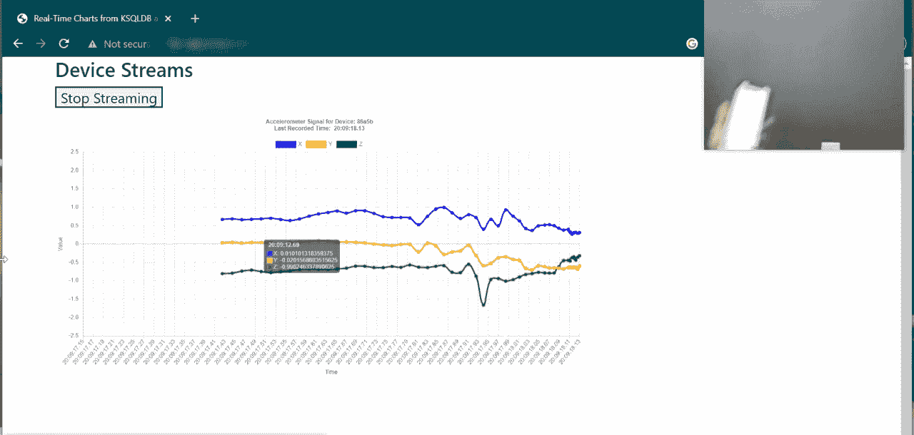
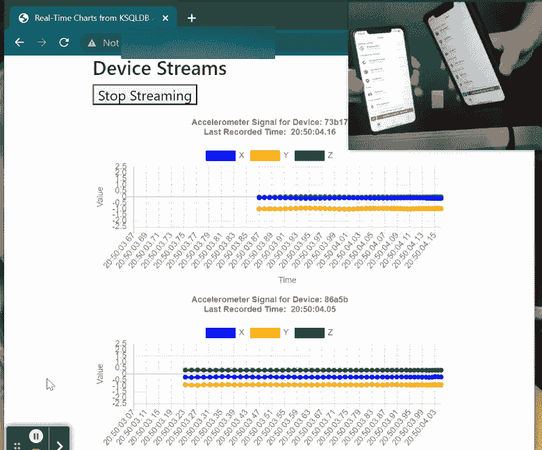
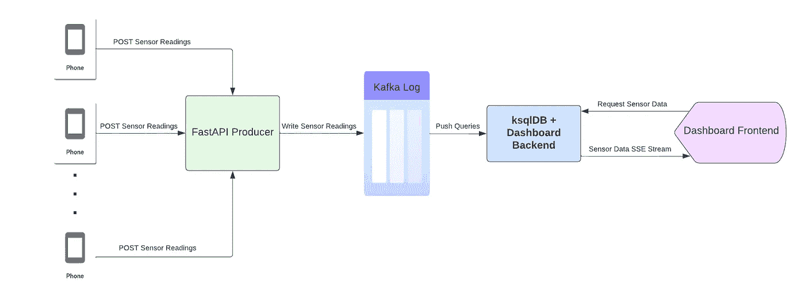
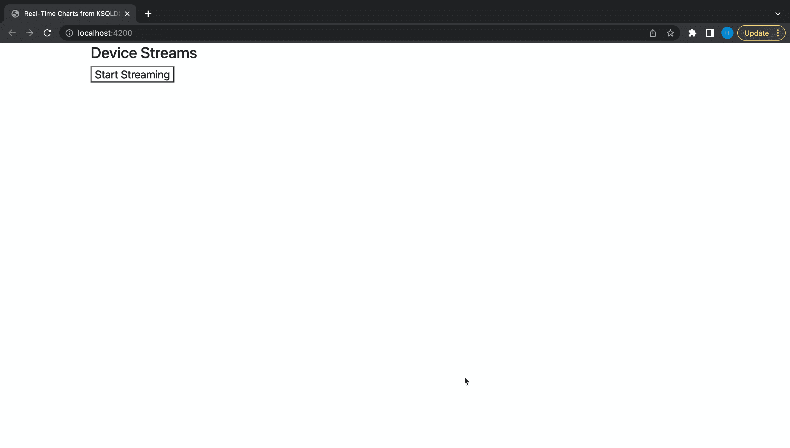

# 高效查询流式数据的方法

> 原文：[`towardsdatascience.com/a-performant-way-to-query-streaming-data-b95c52b2361e`](https://towardsdatascience.com/a-performant-way-to-query-streaming-data-b95c52b2361e)

## 使用 ksqlDB 改进实时流式项目

[](https://harrisonfhoffman.medium.com/?source=post_page-----b95c52b2361e--------------------------------)[](https://towardsdatascience.com/?source=post_page-----b95c52b2361e--------------------------------) [Harrison Hoffman](https://harrisonfhoffman.medium.com/?source=post_page-----b95c52b2361e--------------------------------)

·发表于 [Towards Data Science](https://towardsdatascience.com/?source=post_page-----b95c52b2361e--------------------------------) ·阅读时间 13 分钟·2023 年 5 月 22 日

--


北卡罗来纳州。图像由作者提供。

在 上一篇文章 中，我们探讨了一个实时流式项目的组件，该项目使用 FastAPI、Kafka、QuestDB 和 Docker 消耗和处理智能手机传感器数据。这个项目是实现一种架构的初步尝试，该架构可以将智能手机的流式数据通过 Kafka 日志传输到时间序列数据库，在那里数据可以被轻松查询和处理。最终产品是一个仪表盘，它轮询数据库并实时显示传感器读数：

[](https://youtube.com/shorts/zRUVvz5vsl8?feature=share&source=post_page-----b95c52b2361e--------------------------------) [## 使用 FastAPI、Kafka、QuestDB 和 Docker 流式传输智能手机数据

### 该视频演示了如何使用 FastAPI、Kafka、QuestDB 和…可视化实时智能手机传感器数据。

youtube.com](https://youtube.com/shorts/zRUVvz5vsl8?feature=share&source=post_page-----b95c52b2361e--------------------------------)

对该项目的一个批评是，由于从 Kafka 写入数据到数据库并查询数据库以显示最新的传感器读数，引入了不必要的延迟。当我们的主要目标是实时分析数据时，写入和读取数据库变得低效。

这是 [ksqlDB](https://docs.ksqldb.io/en/latest/) 被创建来解决的问题之一。与将数据写入数据库并查询分析不同，ksqlDB 允许直接处理和分析数据流，从而消除了在访问数据之前将数据持久化到数据库中的需求。

本文将通过引入 ksqlDB 进行查询和处理流数据来扩展之前的内容。与传统的数据库轮询不同，在 ksqlDB 中实现 [推送查询](https://docs.ksqldb.io/en/latest/developer-guide/ksqldb-reference/select-push-query/) 显著减少了仪表盘的延迟并简化了后端基础设施。用于构建此项目的所有代码都可以在 GitHub 上找到：

[](https://github.com/hfhoffman1144/smartphone_sensor_stream2?source=post_page-----b95c52b2361e--------------------------------) [## GitHub - hfhoffman1144/smartphone_sensor_stream2: 使用 FastAPI 流式传输智能手机传感器数据…

### 从传感器记录器流式传输智能手机数据（见…

github.com](https://github.com/hfhoffman1144/smartphone_sensor_stream2?source=post_page-----b95c52b2361e--------------------------------)

# 最终产品

本项目的目标与之前相同：开发一个实时仪表盘，以 [可视化传感器数据](https://www.youtube.com/watch?v=zEMfVRgBuLA)。然而，在这一迭代中，我们的重点是通过利用 ksqlDB 的强大功能来最小化手机和仪表盘之间的可感知延迟。新的仪表盘应如下所示：



从 ksqlDB 查询的智能手机加速度计数据。图像由作者提供。

智能手机的三轴加速度计数据被发送到一个 FastAPI 应用程序，写入 Kafka，通过 ksqlDB 查询，并在仪表盘上显示。注意图表对手机移动的响应速度——延迟几乎无法察觉。

该项目还支持来自多部智能手机的流数据：



同时从两部智能手机流式传输数据。图像由作者提供。

# **项目架构**

该项目的架构比 之前 更简单，因为不再需要 QuestDB 及其消费者来将数据传输到仪表盘。



项目架构。图像由作者提供（使用 Lucidchart 制作）。

每部智能手机通过 POST 请求将传感器读数（加速度计、陀螺仪和磁力计）发送到一个 [FastAPI](https://fastapi.tiangolo.com/lo/) 应用程序（生产者）。生产者将请求体重新格式化为 ksqlDB 兼容的 JSON 格式，并异步地将传感器读数写入一个 [Kafka 主题](https://dattell.com/data-architecture-blog/what-is-a-kafka-topic/#:~:text=Kafka%20topics%20are%20the%20categories,consumers%20read%20data%20from%20topics.)。一旦传感器数据到达 Kafka 主题，就可以通过 ksqlDB 进行查询。

为了获取连续的传感器数据流，客户端可以与后端（一个 FastAPI 应用程序）建立一个[服务器推送事件（SSE）](https://www.w3schools.com/html/html5_serversentevents.asp)连接。后端通过 ksqlDB API 发起一个[推送查询](https://docs.ksqldb.io/en/latest/concepts/queries/#:~:text=A%20push%20query%20is%20a%20form%20of%20query%20issued%20by%20a%20client%20that%20subscribes%20to%20a%20result%20as%20it%20changes%20in%20real%2Dtime.)，持续将传感器数据发送到前端。

这是项目的目录：

```py
├── dashboard_backend
│   ├── Dockerfile
│   ├── app
│   │   ├── core
│   │   │   ├── config.py
│   │   │   └── utils.py
│   │   ├── db
│   │   │   └── data_api.py
│   │   ├── main.py
│   │   └── models
│   │       └── sensors.py
│   ├── entrypoint.sh
│   └── requirements.txt
├── dashboard_frontend
│   ├── Dockerfile
│   ├── app
│   │   ├── main.py
│   │   ├── static
│   │   │   └── js
│   │   │       └── main.js
│   │   └── templates
│   │       └── index.html
│   ├── entrypoint.sh
│   └── requirements.txt
├── producer
│   ├── Dockerfile
│   ├── app
│   │   ├── __init__.py
│   │   ├── core
│   │   │   ├── config.py
│   │   │   └── utils.py
│   │   ├── main.py
│   │   └── schemas
│   │       └── sensors.py
│   ├── entrypoint.sh
│   └── requirements.txt
├── docker-compose.yml
```

三个[FastAPI](https://fastapi.tiangolo.com/lo/)应用程序被编写以促进数据流动和可视化——生产者、仪表板前端和仪表板后端。这些应用程序与 Kafak 和 ksqlDB 一起，通过[docker-compose](https://docs.docker.com/compose/)进行编排：

```py
version: '3.8'

services:

  zookeeper:
    image: bitnami/zookeeper:latest
    ports:
      - 2181:2181
    environment:
      - ALLOW_ANONYMOUS_LOGIN=yes

  kafka:
    image: bitnami/kafka:latest
    ports:
      - 9092:9092
      - 9093:9093
    environment:
      - KAFKA_BROKER_ID=1
      - KAFKA_CFG_LISTENERS=PLAINTEXT://:9092
      - KAFKA_CFG_ADVERTISED_LISTENERS=PLAINTEXT://127.0.0.1:9092
      - KAFKA_CFG_ZOOKEEPER_CONNECT=zookeeper:2181
      - ALLOW_PLAINTEXT_LISTENER=yes
      - KAFKA_CFG_LISTENER_SECURITY_PROTOCOL_MAP=CLIENT:PLAINTEXT
      - KAFKA_CFG_LISTENERS=CLIENT://:9092
      - KAFKA_CFG_ADVERTISED_LISTENERS=CLIENT://kafka:9092
      - KAFKA_CFG_INTER_BROKER_LISTENER_NAME=CLIENT
    depends_on:
      - zookeeper

  ksqldb-server:
    image: confluentinc/ksqldb-server:latest
    hostname: ksqldb-server
    container_name: ksqldb-server
    depends_on:
      - kafka
    ports:
      - "8088:8088"
    environment:
      KSQL_LISTENERS: http://0.0.0.0:8088
      KSQL_BOOTSTRAP_SERVERS: kafka:9092
      KSQL_KSQL_LOGGING_PROCESSING_STREAM_AUTO_CREATE: "true"
      KSQL_KSQL_LOGGING_PROCESSING_TOPIC_AUTO_CREATE: "true"
      KSQL_KSQL_STREAMS_COMMIT_INTERVAL_MS: 100
      KSQL_KSQL_IDLE_CONNECTION_TIMEOUT_SECONDS: 600

  ksqldb-cli:
    image: confluentinc/ksqldb-cli:latest
    container_name: ksqldb-cli
    depends_on:
      - kafka
      - ksqldb-server
    entrypoint: /bin/sh
    tty: true

  producer:
    build:
      context: ./producer
      dockerfile: Dockerfile
    command: uvicorn main:app --workers 1 --host 0.0.0.0 --port 8000
    ports:
      - 8000:8000
    env_file:
      - .env
    depends_on:
      - kafka
      - zookeeper

  dashboard_backend:
    build:
      context: ./dashboard_backend
      dockerfile: Dockerfile
    command: uvicorn main:app --workers 1 --host 0.0.0.0 --port 5000
    ports:
      - 5000:5000
    env_file:
      - .env
    depends_on:
      - ksqldb-server

  dashboard_frontend:
    build:
      context: ./dashboard_frontend
      dockerfile: Dockerfile
    command: uvicorn main:app --workers 1 --host 0.0.0.0 --port 4200
    ports:
      - 4200:4200
    env_file:
      - .env
    depends_on:
      - dashboard_backend
```

注意那些未在代码中明确写出的四个服务（值得庆幸的是）：Zookeeper、Kafka、ksqlDB 和 Kafka-CLI。这些服务与生产者和仪表板一起工作，构建了该项目。让我们更详细地探索这些组件。

# 生产者

与之前类似，生产者是一个 FastAPI 应用程序，接受来自智能手机的数据（通过 POST 请求），并写入 Kafka 日志。以下是目录结构：

```py
producer
    ├── Dockerfile
    ├── app
    │   ├── __init__.py
    │   ├── core
    │   │   ├── config.py
    │   │   └── utils.py
    │   ├── main.py
    │   └── schemas
    │       └── sensors.py
    ├── entrypoint.sh
    └── requirements.txt
```

我们不会逐一浏览生产者目录中的每个文件，因为所有内容都可以在[GitHub](https://github.com/hfhoffman1144/smartphone_sensor_stream2)上找到。相反，让我们看看`main.py`（生产者 API 的驱动脚本）：

```py
# producer/app/main.py
import json
from fastapi import FastAPI
import asyncio
from aiokafka import AIOKafkaProducer
from schemas.sensors import SensorReading, SensorResponse
from core.config import app_config
from core.utils import flatten_dict
from loguru import logger

# Instantiate FastAPI app
app = FastAPI(title=app_config.PROJECT_NAME)

# Create the event loop to use async programming
loop = asyncio.get_event_loop()

# Instatiate the Kafka producer object
producer = AIOKafkaProducer(
    loop=loop,
    client_id=app_config.PROJECT_NAME,
    bootstrap_servers=app_config.KAFKA_URL
)

@app.on_event("startup")
async def startup_event():

    await producer.start()
    await producer.send(app_config.TOPIC_NAME, json.dumps({'status':'ready'}).encode("ascii"))

@app.on_event("shutdown")
async def shutdown_event():
    await producer.stop()

@app.post("/phone-producer/")
async def kafka_produce(data: SensorReading):

    """
    Produce a message containing readings from a smartphone sensor to Kafka.

    Parameters
    ----------
    data : SensorReading
        The request body containing sensor readings and metadata.

    Returns
    -------
    response : SensorResponse
        The response body corresponding to the processed sensor readings
        from the request.
    """

    # Extract the messageId, deviceId, and sessionId
    message_info = data.dict().copy()
    message_info.pop('payload')

    # Write each sensor reading in the payload to kafka
    for sensor_reading in data.dict()['payload']:

        kafka_message = {**flatten_dict(sensor_reading), **message_info}
        await producer.send(app_config.TOPIC_NAME,
                            json.dumps(kafka_message).encode("ascii"))

    response = SensorResponse(
        messageId=data.messageId,
        sessionId=data.sessionId,
        deviceId=data.deviceId
    )

    logger.info(response)

    return response
```

这段代码的解释基本与前一篇文章%3A)相同。主要区别在于请求有效载荷中的传感器读数需要在写入 Kafka 之前重新格式化。这种新格式允许 ksqlDB 以类似 SQL 的方式查询传感器数据。每个来自手机的 POST 请求发送的 JSON 数据如下所示：

```py
{"messageId": 20,
 "sessionId": "4bf3b3b9-a241-4aaa-b1d3-c05100df9976",
 "deviceId": "86a5b0e3-6e06-40e2-b226-5a72bd39b65b",
 "payload": [{"name": "accelerometeruncalibrated",
              "time": "1671406719721160400",
              "values": {"z": -0.9372100830078125,
                         "y": -0.3241424560546875, 
                         "x": 0.0323486328125}},
             {"name": "magnetometeruncalibrated",
              "time": "1671406719726579500",
              "values": {"z": -5061.64599609375,
                         "y": 591.083251953125,
                         "x": 3500.541015625}},
             {"name": "gyroscopeuncalibrated",
              "time": "1671406719726173400",
              "values": {"z": -0.004710599314421415,
                         "y": -0.013125921599566936,
                         "x": 0.009486978873610497}}, 
...
]}
```

各个传感器读数位于“payload”下，并在`kafka_produce()`路由中写入 Kafka：

```py
# Extract the messageId, deviceId, and sessionId
message_info = data.dict().copy()
message_info.pop('payload')

# Write each sensor reading in the payload to kafka
for sensor_reading in data.dict()['payload']:

    kafka_message = {**flatten_dict(sensor_reading), **message_info}
    await producer.send(app_config.TOPIC_NAME,
                        json.dumps(kafka_message).encode("ascii"))
```

`flatten_dict()`函数位于`producer/app/core/utils.py`中，它处理原始传感器消息，例如：

```py
{
  "name": "accelerometeruncalibrated",
  "time": "1683555956851304200",
  "values": {
    "z": -1.0012664794921875,
    "y": -0.467315673828125,
    "x": -0.00494384765625
  }
}
```

并将消息重新格式化以兼容 ksqlDB 模式——这就是写入 Kafka 的内容：

```py
{
  "name": "accelerometeruncalibrated",
  "time": "1683555956851304200",
  "values_z": -1.0012664794921875,
  "values_y": -0.467315673828125,
  "values_x": -0.00494384765625,
  "messageId": 35,
  "sessionId": "c931f349-faf5-4e45-b09f-c623a76ef93a",
  "deviceId": "86a5b0e3-6e06-40e2-b226-5a72bd39b65b"
}
```

重新格式化的传感器读数中的每一条记录可以看作是一个可以被 ksqlDB 查询的列。更多内容将在下一节中介绍。

# ksqlDB

此时，传感器读数可以从智能手机流向 FastAPI 生产者，在那里以 ksqlDB 兼容格式写入 Kafka。ksqlDB 随后可以查询 Kafka 中的最新数据和历史数据。

[ksqlDB](https://docs.ksqldb.io/en/latest/)是一个开源流式引擎，旨在使用类似 SQL 的语法处理、分析和转换来自 Kafka 的实时数据流。简而言之，ksqlDB 使得使用熟悉的关系数据库概念（如表、查询、物化视图、查询、连接和聚合）与 Kafka 主题中的数据进行交互。ksqlDB 的[功能](https://docs.ksqldb.io/en/latest/concepts/)非常广泛，本文章无法全面涵盖，但文档提供了核心概念的良好定义：

[](https://docs.ksqldb.io/en/latest/concepts/?source=post_page-----b95c52b2361e--------------------------------) [## ksqlDB 概念 - ksqlDB 文档

### 了解 ksqlDB 的内部工作原理。

[docs.ksqldb.io](https://docs.ksqldb.io/en/latest/concepts/?source=post_page-----b95c52b2361e--------------------------------)

对于这个项目，将在存储智能手机传感器读数（生产者写入的数据）的主题上创建一个流：

```py
CREATE STREAM smartphone_sensor_stream (
    name VARCHAR,
    time BIGINT,
    values_x DOUBLE,
    values_y DOUBLE,
    values_z DOUBLE,
    messageId BIGINT,
    sessionId VARCHAR,
    deviceId VARCHAR
  ) WITH (
    KAFKA_TOPIC = 'smartphone-sensor-data',
    VALUE_FORMAT = 'JSON'
  );
```

上述 ksqlDB 语句创建了一个流`smartphone_sensor_stream`，可用于查询写入`smartphone-sensor-data` Kafka 主题的传感器读数。可以利用像[ksql-python](https://github.com/bryanyang0528/ksql-python)这样的库来与 ksqlDB REST API 进行接口交互，并以编程方式执行查询：

```py
from ksql import KSQLAPI # pip install ksql

# Where ksqldb is running
KSQL_URL = "http://localhost:8088" 

# Instantiate the ksqldb API object
client = KSQLAPI(KSQL_URL)

# Create the "smartphone_sensor_stream" stream over the specified topic
client.create_stream(table_name="smartphone_sensor_stream",
                     columns_type=["name varchar",
                                   "time bigint",
                                   "values_x double",
                                   "values_y double",
                                   "values_z double",
                                   "messageId bigint",
                                   "sessionId varchar",
                                   "deviceId varchar"
                                   ],
                     topic="smartphone-sensor-data",
                     value_format="JSON") 
```

一个[推送查询](https://docs.ksqldb.io/en/latest/concepts/queries/#:~:text=A%20push%20query%20is%20a%20form%20of%20query%20issued%20by%20a%20client%20that%20subscribes%20to%20a%20result%20as%20it%20changes%20in%20real%2Dtime.)被执行以检索传感器读数，因为它们被写入主题中。从本质上讲，推送查询打开一个长期连接，每当主题中接收到新数据时，都会将更新发送给客户端。这使得推送查询成为流式智能手机数据的良好选择。

```py
select deviceId,
       time,
       values_x,
       values_y,
       values_z
from smartphone_sensor_stream
where name = 'accelerometeruncalibrated'
emit changes
```

上述查询每次流更新数据时“推送”设备 ID、时间和加速度计值，从`smartphone_sensor_stream`中提取。这可以使用 ksql-python 执行：

```py
from ksql import KSQLAPI
from typing import Generator

# Where ksqldb is running
KSQL_URL = "http://localhost:8088" 

# Instantiate the ksqldb API object
client = KSQLAPI(KSQL_URL)

# Write a push query 
push_query = '''select deviceId,
                        time,
                        values_x,
                        values_y,
                        values_z
                    from smartphone_sensor_stream
                    where name = 'accelerometeruncalibrated'
                    emit changes
                   '''
# Get the KSQL stream generator
sensor_push_stream: Generator = client.query(push_query, use_http2=True)

# Loop through messages in the generator and print them as they're received
for raw_message in sensor_push_stream:

    print(raw_message) 
```

ksql-python 客户端返回一个[生成器](https://wiki.python.org/moin/Generators)对象，该对象会在写入 Kafka 并从流中读取时产生消息。与传统的循环遍历固定大小数组不同，这种循环将继续执行，只要在流中接收到数据。

从查询中获得的消息看起来类似于以下内容：

```py
[
 '86a5b0e3-6e06-40e2-b226-5a72bd39b65b', # Device ID
 1684615020438850600, # Timestamp of the sensor recording
 0.993927001953125, # x value
-0.5736083984375, # y value
-0.1787261962890625 # z value
]
```

一次返回一条消息，每条消息可以被认为是`smartphone_sensor_stream`ksql 流中的一行。请记住，ksqlDB 可以执行更复杂的查询，如聚合和连接，但对于这个项目，只需要一个基本的`select`。

# 仪表板后端

仪表板后端是一个 FastAPI 应用程序，接受 SSE 请求以获取传感器数据流。一旦请求了 SSE 连接，将打开一个 ksqlDB 推送查询，并在到达 Kafka 时持续向前端发送消息。仪表板后端的目录结构如下：

```py
 dashboard_backend
   ├── Dockerfile
   ├── app
   │   ├── core
   │   │   ├── config.py
   │   │   └── utils.py
   │   ├── db
   │   │   └── data_api.py
   │   ├── main.py
   │   └── models
   │       └── sensors.py
   ├── entrypoint.sh
   └── requirements.txt
```

首先让我们看一下`data_api.py`——这是 ksqlDB 和仪表板后台之间的接口：

```py
# data_api.py

from retry import retry
from ksql import KSQLAPI
from models.sensors import SensorName
from typing import Generator

@retry()
def create_ksql_connection(url: str) -> KSQLAPI:
    """
    Create a connection to a KSQL server using the provided URL.

    Parameters
    ----------
    url : str
        The URL of the KSQL server to connect to.

    Returns
    -------
    KSQLAPI
        An instance of the `KSQLAPI` class representing the connection
        to the KSQL server.
    """

    return KSQLAPI(url)

def create_ksql_device_stream(client: KSQLAPI,
                              stream_name: str,
                              topic_name: str) -> None:
    """
    Creates a new device stream in KSQL server if it does not already exist.

    Parameters:
    -----------
    client : KSQLAPI
        A client instance of the KSQLAPI class to connect with KSQL server.
    stream_name : str
        The name of the device stream to create.
    topic_name : str
        The name of the Kafka topic to associate with the device stream.

    Returns:
    --------
    None

    Raises:
    -------
    KSQLServerError
        If there is an error while creating the stream in KSQL server.
    """

    # Get the current streams
    curr_streams = client.ksql('show streams')
    curr_stream_names = [stream['name'].lower()
                         for stream in curr_streams[0]['streams']]

    # If the device stream doesn't exist, create it
    if stream_name.lower() not in curr_stream_names:

        client.create_stream(table_name=stream_name,
                             columns_type=['name varchar',
                                           'time bigint',
                                           'values_x double',
                                           'values_y double',
                                           'values_z double',
                                           'messageId bigint',
                                           'sessionId varchar',
                                           'deviceId varchar'
                                           ],
                             topic=topic_name,
                             value_format='JSON')

def ksql_sensor_push(client: KSQLAPI,
                     stream_name: str,
                     sensor_name: SensorName) -> Generator:
    """
    Generator function that continuously pushes sensor data
    for a given sensor name from a KSQL server using the KSQL API client.

    Parameters:
    -----------
    client : KSQLAPI
        The KSQL API client instance used to query the KSQL server.
    stream_name : str
        The name of the KSQL stream to query data from.
    sensor_name : SensorName
        An enum value representing the name of the sensor to stream data for.

    Returns:
    --------
    Generator:
        A generator object that yields the sensor data as it is streamed in real-time.
    """

    push_query = f'''
                  select deviceId,
                         time,
                         values_x,
                         values_y,
                         values_z
                    from {stream_name}
                    where name = '{sensor_name.value}'
                    emit changes
                   '''

    sensor_push_stream: Generator = client.query(push_query, use_http2=True)

    return sensor_push_stream
```

在这个脚本中，`create_ksql_device_stream()`创建了前一节定义的 ksqlDB 流，`ksql_sensor_push()`返回一个生成器，该生成器生成传感器数据推送查询的结果。

让我们详细解析`main.py`——这是仪表板后台的主驱动脚本。以下是依赖项：

```py
# main.py

import pandas as pd
import json
from fastapi import FastAPI
from sse_starlette.sse import EventSourceResponse
from fastapi.requests import Request
from starlette.middleware.cors import CORSMiddleware
from core.config import app_config
from core.utils import maybe_load_json
from models.sensors import SensorName
from db.data_api import (create_ksql_connection,
                         create_ksql_device_stream,
                         ksql_sensor_push)
```

主要需要注意的导入项是`EventSourceResponse`（[类](https://www.starlette.io/responses/#eventsourceresponse:~:text=A%20response%20class%20that%20implements%20Server%2DSent%20Events.%20It%20enables%20event%20streaming%20from%20the%20server%20to%20the%20client%20without%20the%20complexity%20of%20websockets.) 实现了 SSE）和来自`data_api.py`的函数。接下来，实例化了一个 KSQLAPI 对象和一个 FastAPI 应用：

```py
# main.py

...

# Instantiate KSQLAPI object
KSQL_CLIENT = create_ksql_connection(app_config.KSQL_URL)

# Create the KSQL device stream if it doesn't exist
create_ksql_device_stream(
  KSQL_CLIENT, app_config.STREAM_NAME, app_config.TOPIC_NAME
)

# Instantiate FastAPI app
app = FastAPI()

# Configure middleware
app.add_middleware(
    CORSMiddleware,
    allow_origins=["*"],
    allow_credentials=True,
    allow_methods=["*"],
    allow_headers=["*"],
)
```

最后，定义了将传感器数据从 ksqlDB 发送到前端的 SSE 端点：

```py
# main.py

...

# An SSE endpoint that pushes sensor data from KSQLDB to the client
@app.get("/chart-data/{client_id}")
async def message_stream(request: Request, client_id: str):
    async def event_generator():
        while True:
            # If the client closes the connection, stop sending events
            if await request.is_disconnected():
                break

            try:

                # Get the KSQL stream generator
                sensor_push_stream = ksql_sensor_push(
                    KSQL_CLIENT, app_config.STREAM_NAME, SensorName.ACC)

                for raw_message in sensor_push_stream:

                    # If client closes connection, stop sending events
                    if await request.is_disconnected():
                        break

                    # Check if the raw message is the correct format
                    message = maybe_load_json(raw_message)

                    # If the message is in the correct format (i.e. a list),
                    # send to client
                    if isinstance(message, list):

                        # Format the sensor timestamp
                        message[1] = str(pd.to_datetime(message[1]))

                        # Yield the message as JSON
                        yield {
                            "event": "new_message",
                            "id": "message_id",
                            "retry": 1500000,
                            "data": json.dumps(message)
                        }
            except Exception as e:

                if await request.is_disconnected():

                    break

                continue

    return EventSourceResponse(event_generator())
```

`message_stream()`端点接受[GET](https://developer.mozilla.org/en-US/docs/Web/HTTP/Methods/GET)请求，这些请求打开长连接，后台可以通过这些连接持续发送传感器数据。在`message_stream()`中，定义并返回了一个[协程](https://docs.python.org/3/library/asyncio-task.html#coroutines) `event_generator()`。`event_generator()`的目的是创建一个 while 循环，在 ksqlDB 处理传感器数据消息时生成这些消息。只有当客户端关闭连接时，这个循环才会终止。

# 仪表板前端

仪表板前端是由 FastAPI 应用托管的 HTML 页面。它的目的是展示数据如何在项目的各个组件之间流动，并不是一个全面的前端。界面如下：



在仪表板上显示智能手机传感器数据流。图像由作者提供。

当用户点击“开始流媒体传输”时，会与后台建立一个 SSE 连接，并持续发送来自推送查询的数据。所有用于创建前端的代码以及运行所有内容的说明都可以在[GitHub](https://github.com/hfhoffman1144/smartphone_sensor_stream2)上找到。

# 最后的思考

本文介绍了 ksqlDB 作为一种解决方案，用以改进之前使用 FastAPI、Kafka、QuestDB 和 Docker 构建的实时流媒体项目。该项目旨在创建一个可视化传感器数据的仪表板，接近实时展示数据。面临的挑战之一是由于将数据从 Kafka 写入数据库并查询数据库进行分析所造成的不必要延迟。

ksqlDB 是一个为流处理而构建的数据库，用于解决此问题。与其在访问数据之前将其持久化到数据库中，ksqlDB 允许直接处理和分析 Kafka 中的数据流。通过在 ksqlDB 中实现推送查询，仪表盘的延迟显著减少，传感器读数的显示几乎没有可检测的延迟。

ksqlDB 的使用简化了后端基础设施，并允许对传感器读数进行近实时高效分析。未来的文章将继续对该项目进行改进，并通过新工具和功能增强其功能。我们始终欢迎反馈。感谢阅读！

*成为会员:* [*https://harrisonfhoffman.medium.com/membership*](https://harrisonfhoffman.medium.com/membership)

# 参考资料

> ***Apache Kafka:***[*https://kafka.apache.org/*](https://kafka.apache.org/)
> 
> ***Event-Driven Architectures — The Queue vs The Log:*** [*https://jack-vanlightly.com/blog/2018/5/20/event-driven-architectures-the-queue-vs-the-log*](https://jack-vanlightly.com/blog/2018/5/20/event-driven-architectures-the-queue-vs-the-log)
> 
> ***Lucidchart:***[*https://www.lucidchart.com/*](https://www.lucidchart.com/pages/landing?utm_source=google&utm_medium=cpc&utm_campaign=_chart_en_us_mixed_search_brand_exact_&km_CPC_CampaignId=1457964857&km_CPC_AdGroupID=57044764032&km_CPC_Keyword=lucidchart&km_CPC_MatchType=e&km_CPC_ExtensionID=&km_CPC_Network=g&km_CPC_AdPosition=&km_CPC_Creative=442433231228&km_CPC_TargetID=aud-552508845082%3Akwd-33511936169&km_CPC_Country=9026996&km_CPC_Device=c&km_CPC_placement=&km_CPC_target=&gclid=Cj0KCQiAkMGcBhCSARIsAIW6d0CWGMutQsstwP9ldA4dNOtZFA1Rx74z64sS-PRobNhZ_vyLMUMrESIaAslAEALw_wcB)
> 
> ***Kafka Poc using FastApi:*** [*https://github.com/GavriloviciEduard/fastapi-kafka*](https://github.com/GavriloviciEduard/fastapi-kafka)
> 
> ***geo-stream-kafka:***[*https://github.com/iwpnd/geo-stream-kafka*](https://github.com/iwpnd/geo-stream-kafka)
> 
> ***18 Most Popular IoT Devices in 2022:*** [*https://www.softwaretestinghelp.com/iot-devices/#:~:text=Smart%20Mobiles%2C%20smart%20refrigerators%2C%20smartwatches,there%20by%20the%20year%202022%3F*](https://www.softwaretestinghelp.com/iot-devices/#:~:text=Smart%20Mobiles%2C%20smart%20refrigerators%2C%20smartwatches,there%20by%20the%20year%202022%3F)
> 
> ***FastAPI:***[*https://fastapi.tiangolo.com/*](https://fastapi.tiangolo.com/)
> 
> ***QuestDB:***[*https://questdb.io/docs/*](https://questdb.io/docs/)
> 
> ***Row vs Column Oriented Databases:***[*https://dataschool.com/data-modeling-101/row-vs-column-oriented-databases/*](https://dataschool.com/data-modeling-101/row-vs-column-oriented-databases/)
> 
> **ksqlDB**: [`docs.ksqldb.io/en/latest/`](https://docs.ksqldb.io/en/latest/)
