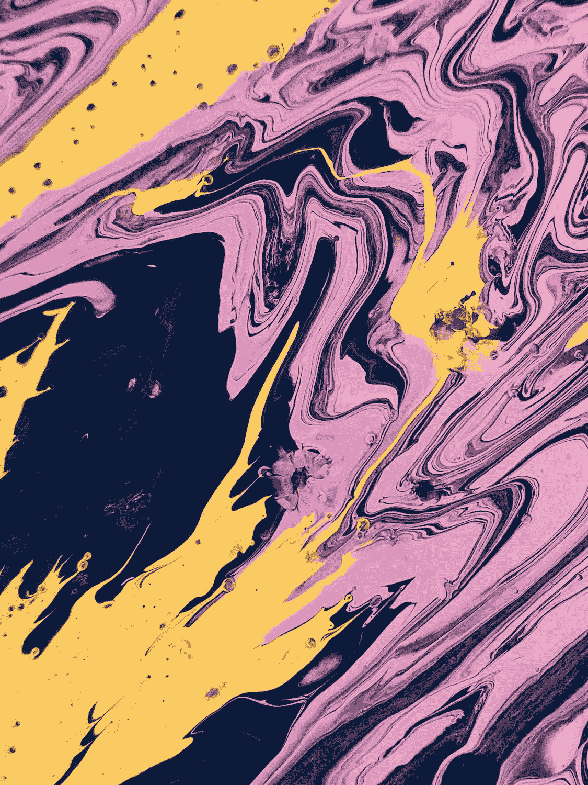
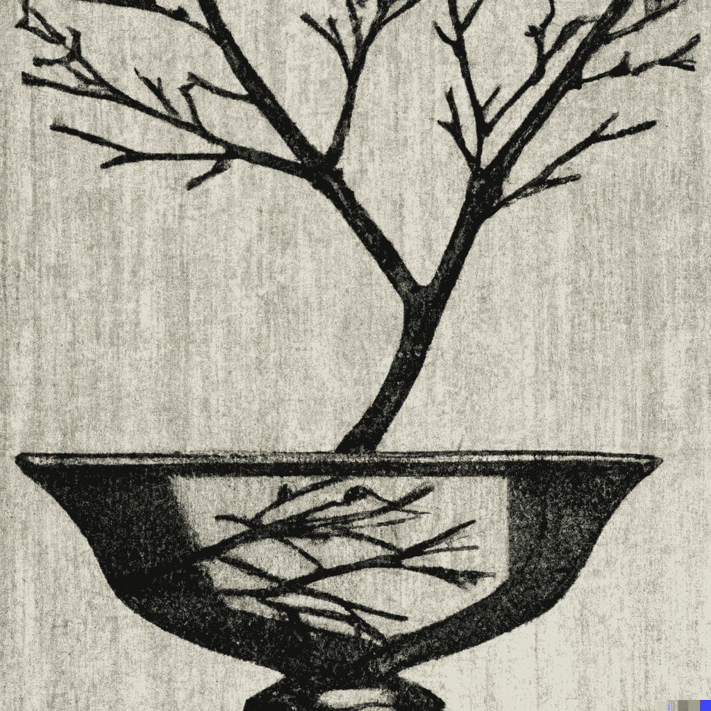
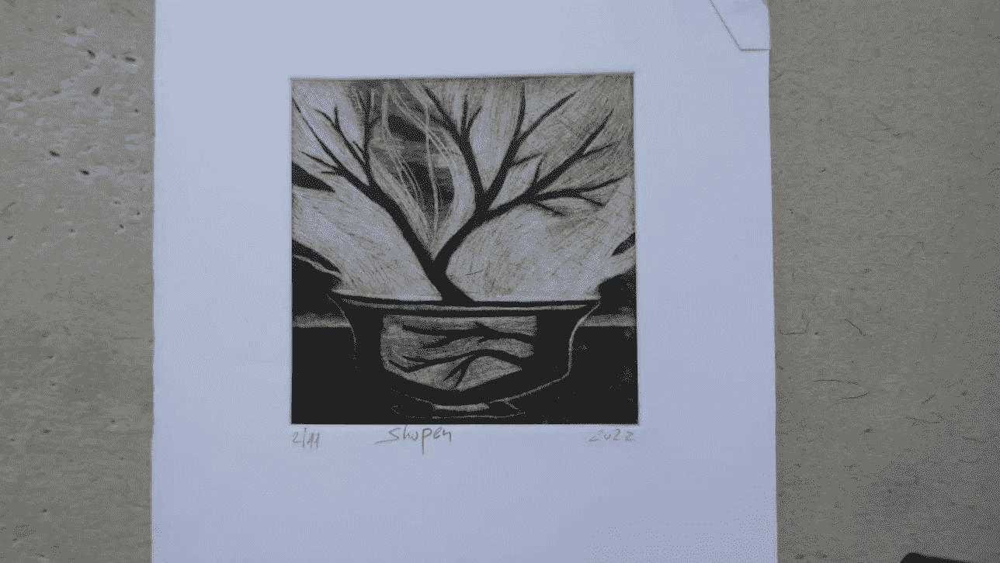
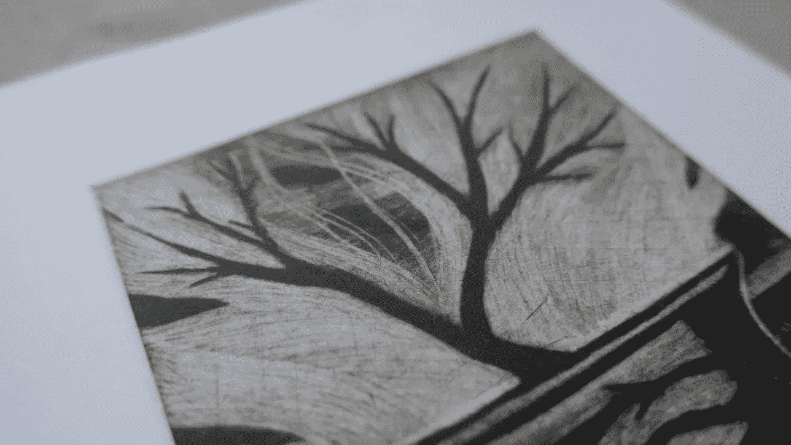

# 关于 DALL·E2 的哲学与艺术视角

> 原文：[`towardsdatascience.com/a-philosophical-and-artistic-perspective-on-dall-e2-b362df74a63c?source=collection_archive---------21-----------------------#2023-07-25`](https://towardsdatascience.com/a-philosophical-and-artistic-perspective-on-dall-e2-b362df74a63c?source=collection_archive---------21-----------------------#2023-07-25)

## TLDR: 探索 AI 与艺术的交汇点：关于在创作过程中整合 DALL·E2 的知识性对话

 [Ido Leshem](https://leshem-ido.medium.com/?source=post_page-----b362df74a63c--------------------------------)

·

[关注](https://medium.com/m/signin?actionUrl=https%3A%2F%2Fmedium.com%2F_%2Fsubscribe%2Fuser%2F64b979a03bf7&operation=register&redirect=https%3A%2F%2Ftowardsdatascience.com%2Fa-philosophical-and-artistic-perspective-on-dall-e2-b362df74a63c&user=Ido+Leshem&userId=64b979a03bf7&source=post_page-64b979a03bf7----b362df74a63c---------------------post_header-----------) 发表在 [Towards Data Science](https://towardsdatascience.com/?source=post_page-----b362df74a63c--------------------------------) ·11 分钟阅读·2023 年 7 月 25 日

--

图片来自 Pexels 的 Dids

感谢 Yaron Senderowicz 教授和 Liav Isaac Shopen 愿意接受本博客文章的采访。

## **介绍和动机**

DALL·E2 已经推出一段时间了，我认为从哲学和艺术的角度写一篇关于它的博客文章会很有趣。作为一名数据科学家和业余版画爱好者，我对这种方法在艺术上的看法和使用方式产生了浓厚的兴趣。

尽管工程师们常常专注于让事物正常运作，但值得更多关注其他方面，比如艺术性、美学和社会考量，这些方面往往受到较少关注。这次探索的主要动机是更好地理解和探讨 DALL·E2 在什么意义上具有艺术性和人类特质。换句话说，我们应如何解读 DALL·E2 的输出？

此外，人们对 DALL·E2 的影响及其对就业的后果越来越担忧。它生成的图像非常吸引人，以至于很难分辨它们是由人类还是算法生成的。例如，我们刚刚见证了一张 AI 生成的照片 [赢得了摄影奖](https://www.theguardian.com/technology/2023/apr/17/photographer-admits-prize-winning-image-was-ai-generated)，这突显了这个问题的重要性。

在这篇博客文章中，我有幸采访了两位有趣的人。第一位采访者是耶路撒冷大学哲学教授**耶龙·森德罗维茨**，因其对人类意识的研究而闻名。第二位采访者是**利亚夫·艾萨克·肖本**，他是一位大师级版画家，他的艺术造诣和实践经验使他对 DALL·E2 有独特的理解，并如何将其融入他的艺术作品中。

# **与耶龙·森德罗维茨教授的访谈**

**伊多：耶龙，你能分享一下你对 DALL·E2 的看法吗？你认为这个算法在某些方面不仅能模仿，还能展示人类的能力吗？**

我不完全确定算法是否真实地复制了人类的能力。例如，人类可以自动创作艺术，但关键问题是这些艺术是否具有审美价值。可以制定标准来判断一件艺术作品是否具备这种价值。我认为其中一个标准是作品对背景的敏感程度。

我们存在于某种文化、时期、空间和文明中。我们可以轻易地辨别不同文化之间的差异。例如，如果莫扎特的作品在 12 世纪或 21 世纪呈现，它的审美价值可能会有很大的不同，因为它本质上与创作时的背景紧密相连。

**创造力、意义与背景**

**伊多：创造力关乎意义以及人类如何感知它。那么艺术家的创作应如何解读和评估呢？**

Yaron：技术可以复制梵高的风格，但我们应该质疑的是，我们使用 DALL·E2 创作的艺术作品是否提供了新颖的东西，还是仅仅是现有作品的衍生物。如果你有技术资源可以完美复制梵高的艺术风格，这并不意味着创作出的作品就是艺术。它只是展现了令人印象深刻的模仿能力。

理解 DALL·E2 的一种可能方法是使用“字面意义”的概念。人类有能力判断语言使用是否正确，即使它没有被明确界定或其真实性条件没有被明确列出。美国哲学家约翰·赛尔（John Searle）广为人知的贡献之一是对“字面意义”的质疑（即对句子的直接和直白的解释，不包含任何比喻或隐喻元素）。

意义的概念与……嗯，背景密切相关。当前的问题是，是否可以提供一个描述，包括一个术语适用于世界上一个物体的必要和充分条件。此外，我们对定义的理解（或者说计算机对定义的理解）是否足够准确，以便在一个我们既没有考虑过也没有遇到过的对话背景中正确使用这个术语。

我们理解一个句子，尽管我们的词汇量和使用范围是有限的。基于记忆的用法是确定且有限的。现在，一个涉及到“字面意义”文章中‘on’概念的例子。让我们考虑一个我们想理解的短语——“猫在地毯上”或“猫在地板上”。

有没有一种方法可以准确推导出将这些术语与猫和地毯正确关联的语义必要和充分条件？为了确认一只猫在地毯上，它必须有多少部分在地毯上？我们如何定义那部分？一条腿？三条腿？如果有两条腿在地毯上，两条腿在地毯外呢？

我们能否准确确定什么时候可以说猫在地毯上？让我们进一步说明。想象一下在太空中飞行，你看到一只猫和一块地毯颠倒放置。猫看起来是倒立的，但谁在什么上面？意识到我们使用“在”这个词是基于一个背景——地球的引力。这种无意识的用法只是说明了我们的陈述及其理解中有多少背景。我们的声明总是预设了一个背景，而这个背景从未被明确陈述或充分阐述。

由 Dalle2 生成的图像

为了更精确地描述背景，考虑另一个场景，你到美国旅行。你在沙漠中感到饥饿，于是你在一个餐馆停下来，点了一杯可乐和一个汉堡包。突然，你得到一个 5 米长的汉堡和一个 2 米高的可乐。这是你点的东西吗？可能不是，但你是怎么在点餐时说明的？任何了解背景——“买一个汉堡意味着什么”——的人都知道这不是你点的东西。而且这个背景在不同文化中显然有所不同。

你可能会声称这不是你所要求的，但无数可能的情况无法充分描述。我们总是在上下文中理解。

Dalle2 生成的图像

**人类与算法的创造力**

**Ido：你怎么看待人类与算法的创造力**

Yaron：将这一讨论与创造力联系起来——人类创造力表现为理解一个没有明确特定定义的术语的创造性使用的能力。然而，任何对该语言有一定造诣的人会同意这种新应用是正确的，或者他们会否定这种应用。尽管如此，仍会有一些人持不同意见。这里没有什么是精确定义的，而这种精确性需要更丰富的逻辑系统来明确。

我的主要观点是，我们应当始终质疑那些相信自己发现了算法，特别是与艺术相关的算法的人：他们是否仅仅生成了一个成功模仿在算法出现之前开发的风格或作品的算法？我们只能在展示能够产生艺术中新运动的计算机或写一本新书的情况下回答这个问题。

毕加索，作为一位杰出的具象艺术家，通常在探索其他风格之前教授这种风格。艺术在历史上是层叠的，要求对其根源和基础有深入了解。当计算机成功启动一种新的艺术运动——也就是说，当评论家或专家惊叹道，“哇！我们从未见过这样的东西”——如果这种运动确实源于对艺术历史状态的理解，恰当地融入，并引发了变化，那么这就是重要的。当这种情况发生，并且它成功地创作了重新定义诗歌理解的诗歌，正如博尔赫斯所说——在卡夫卡的作品之后，人们突然发现了许多先前存在的卡夫卡。

**模仿者与创新者**

**Ido：那如何看待模仿者与创新者**

Yaron：毫无疑问，模仿者与开发创意者之间存在对比。人们可以欣赏艺术作品中的创造力和原创性。

这些算法的许多开发者可能会争辩说，普遍接受的创新并不存在。他们可能认为这过于模糊或难以定义。确实，艺术在不断辩论中。然而，在今天的世界里，学者们引用现代文本时可以将其与非现代文本区分开来。解释学（解释理论）关注这一点。这是任何试图解析文本之间意义的人所关心的关键问题。他们专门处理这种问题，努力应对源自文化背景的历史特征。

要真正成为我们生活经验的一部分并对此作出显著贡献，计算机必须从单纯的模仿者演变为创新者和创造者。它应该致力于创造一些新的东西，而不仅仅是复制他人已经发明的东西。我并不是说这样的算法不存在，但我们应该对过早断言其存在持谨慎态度。我想说的是，考验不在于是否能够复制或伪造他人的画风，而在于是否能够带来新的文化变革。

一个真正具有创造力的计算机应该能够产生一种新的艺术类型。立体主义绘画的出现最初被视为对传统艺术的贬低偏离。只有在我们对莫奈、马奈和雷诺阿等印象派画作进行美学调整后，我们才在回顾中欣赏到印象派的痕迹，这些痕迹延续到 18 世纪。突然间，它弥漫到了公众领域。创新的演变可以比作一个隐喻；它开始时是令人耳目一新的意外之物，随着时间的推移，获得了更明确的字面意义。

这种演变总是与特定的时间、政治、社会和文化背景及我们对过去的解读相关。这是一个复杂的过程，不能仅通过提取梵高画作的规则来描绘。绘画行为远不止于此。梵高的作品是具体个体所做的具体行为，超越了现有的规范。

必须在技术成就和创造力之间建立区别。我们需要调查创造力在我们所知的人类生活中如何表现，然后评估算法生成的结果是否符合这一点。

# **采访 2 — 利亚夫·伊萨赫·肖本，资深版画家**

**伊多：利亚夫，你对 DALL·E2 有何看法，我们应该如何采纳这种技术？**

利亚夫：我认为 DALL·E2 应被视为一个工具，而不是艺术过程的替代品。从一个初步的想法开始，制定一个提示，并查看结果是否能激发你的灵感。DALL·E2 对我来说像是你心中概念的过滤器。你可以通过将提示的结果作为视觉参考点来丰富你的艺术。关键是将你的独特艺术风格注入其中，同时实验提供的图像。我会对其进行调整，不断寻求原始图像的变体。随着这一过程的重复，艺术变得更加准确，并生成与我的风格相符的新图像。

与其在 Pinterest 或其他平台上筛选，不如使用 DALL·E2 根据你的艺术偏好定制结果。在这方面，我认为它可能取代传统的艺术平台，为艺术家提供个性化的参考。

**伊多：有人可能会争辩说，这项技术的成果如此美丽，以至于只有人类才能创作出来。你对此有何看法？**

Liav: 一些结果确实很出色，但它们仍然感觉有些冷漠和疏离。在某些方面，这项技术将创作的控制权还给了艺术家，因为他们必须提取他们想要创作的参考，这可能不是他们总能做到的。然而，重要的是要注意，这个参考并不是最终产品，而是艺术过程中的一个中间阶段。

**Ido: 你是如何将 DALL·E2 用于你自己的目的的？**

基于我生成的一幅图像，我制作了一张 mezzotint 印刷品。我准备了一个详细的文字描述，说明我在寻找什么，这个图案帮助我构思出一幅与我通常创作的作品不同的图像。最终，每位艺术家都有一套图案，这个工具可以帮助扩展这个范围。我不确定没有 DALL·E2 的话，最终的作品是否会是我的首选，但它确实使开发过程更快，更具多样性。

**Ido: 从一开始是什么激励你使用 DALL·E2 的？**

Liav: 部分原因是工具周围的热议，以及我对其对我的创作过程潜在贡献的好奇。这对我来说更多的是关于如何使用它并将其融入到我的工作中，而不是对其能力的震撼。DALL·E2 通过融入金融、时间和努力等方面，使艺术变得更易于获取，这与当前的 DIY 流行趋势相吻合。

仅仅使用它并不一定让你成为艺术家。我认为仅生成一幅图像并不足以被贴上艺术标签，还需要额外的、个性化的层次或阶段。

**Ido: 这次对话回到了我与 Yaron 的采访——这代表了创造力吗？它模仿了人类的某些方面吗？**

Liav: 我相信艺术作品需要原创性，需要在过去的创作和特定的背景、语言中进行创作。目前，我们使用的是别人创造的语言，并对其进行变体处理。作为艺术家的角色是贡献我们的视角，从而将创造力还给艺术家，产生新颖性。在美学吸引力方面，我认为这归结于个人喜好。我们最终必须质疑自己是否对最终产品有感情。虽然我相信创造力本质上是人类的，但我们衡量创造力的方式不能应用于计算机。人类常常将人类特征投射到非人类事物上，但这些不应被误认为是现实。

**Ido: 所以你是说将 DALL**·**E2 视为一种类人能力源于我们的世界观？**

绝对是。这个现象很常见。以抽象画为例，每个观众看到的都有些许不同。我们投射出我们熟悉的东西，我们渴望的东西。这是人类的一部分。要有效地使用 DALL·E2，你必须投入到创作过程中，并引导算法，特别是在尝试捕捉更抽象的东西，如感觉或氛围时。

Liav 使用 Dalle2 生成的原始图像

由 Liav 创作的 mezzotint 印刷品

由 Liav 创作的 mezzotint 印刷品

**结论与主要收获**

艺术本质上涉及原创性、发明、好奇心和文化背景的概念。我们应当问自己的根本问题是我们与所使用的 AI 工具的关系。我们只是使用它们创造输出，还是将我们的独特个性注入其中，以真实地表达自己？

在我看来，主要的收获是：

(1) 尽管像 DALL·E2 这样的算法具有模仿人类艺术风格的惊人能力，但关键在于是否真正展现了人类创造力的新颖和原创特质。

(2) 艺术中的真正创新需要生成新类型并引发文化变革，而不仅仅是现有风格的简单复制。

(3) DALL·E2 应被视为一种增强艺术创作过程的工具，而非完全取代它。它可以作为视觉参考点和想法过滤器，允许艺术家将其独特风格注入 AI 生成的图像中。

(4) 人类倾向于将人类特征投射到非人类事物上，例如 DALL·E2，这不应被误认为现实。

**参考文献**

Searle, J. R. (1978). 字面意义。 *Erkenntnis*, 207–224.
