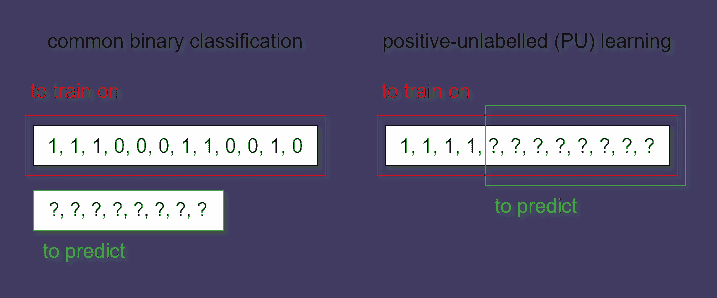

# 评估业务分析中的**正负未标记（PU）分类器**的实用方法

> 原文：[`towardsdatascience.com/a-practical-approach-to-evaluating-positive-unlabeled-pu-classifiers-in-real-world-business-66e074bb192f?source=collection_archive---------4-----------------------#2023-03-31`](https://towardsdatascience.com/a-practical-approach-to-evaluating-positive-unlabeled-pu-classifiers-in-real-world-business-66e074bb192f?source=collection_archive---------4-----------------------#2023-03-31)

## 一种通过调整常见分类指标以评估 PU 模型的正类先验概率的方法

 [Volodymyr Holomb](https://wldmrgml.medium.com/?source=post_page-----66e074bb192f--------------------------------)

·

[关注](https://medium.com/m/signin?actionUrl=https%3A%2F%2Fmedium.com%2F_%2Fsubscribe%2Fuser%2F95923fba037b&operation=register&redirect=https%3A%2F%2Ftowardsdatascience.com%2Fa-practical-approach-to-evaluating-positive-unlabeled-pu-classifiers-in-real-world-business-66e074bb192f&user=Volodymyr+Holomb&userId=95923fba037b&source=post_page-95923fba037b----66e074bb192f---------------------post_header-----------) 发表在 [Towards Data Science](https://towardsdatascience.com/?source=post_page-----66e074bb192f--------------------------------) ·4 分钟阅读·2023 年 3 月 31 日

--

根据作者的描述，由 DALL-E-2 制作

随着企业越来越多地使用机器学习模型分析收集的数据，一个出现的挑战是正负标签混合（PU）数据集。这些数据集只包含少量已标记的数据，其余样本为未标记数据。**虽然未标记样本通常被认为是负类，但其中一些可能是正类**。PU 数据集在各种商业场景中得到应用，例如预测客户流失或追加销售机会、销售预测和欺诈检测。

在 PU 数据集上评估机器学习算法可能很困难，因为传统指标可能无法准确反映模型的性能。例如，简单地将正样本留作测试并将未标记条目添加为负类可能会导致高度偏斜的混淆矩阵，且假阳性数目被夸大。这种情况可能发生在**模型在测试集中检测到正样本，但它们的标签却是负类**时。

# PU 分类器评估的实用方法

为解决这一问题，我们团队采用了一种实用的方法，通过使用有关正样本期望频率的信息来估算 PU 数据集上的标准二分类指标。**我们的方法涉及使用正类的先验概率（在自学习分类器的拟合过程中估算）来调整测试中观察到的假阳性和真阳性**。这种方法使得即使在正类显著不足的情况下，也能更准确地评估模型在 PU 数据集上的表现。

为了展示我们方法的有效性并在受控环境中进行实验，我们首先使用 sci-kit-learn 的*make_classification*函数创建了一个合成的二分类数据集。正样本代表数据中的少数类，通过随机选择部分正样本并移除其标签来模拟 PU 学习场景。

在实际商业场景中，数据集通常包含这种预设的标记/未标记条目的比例。例如，用于**预测下一年客户流失**的数据集可能包含上一年未签订新年度合同的标记客户，以及具有类似特征但尚未流失的现有客户。在这种情况下，数据集可能包含多达 40%的流失客户，但只有一半会被标记为流失（显示年流失率为 20%）。

作者提供的图片

接下来，我们使用*train_test_split*函数将数据分割为训练集和测试集。将特征*X*和目标变量的伪标签版本*y_pu*传递给分类器进行训练。为了评估分类器的性能，我们计算测试集中未标记版本的标准机器学习指标，如准确率、精确率和召回率，并进一步将其与原始标记版本计算出的相应指标进行比较。

# 实现该方法的代码片段

以下是一个代码片段，展示了我们提出的方法在 PU 数据集上评估分类器性能的实现。

我们的*compute_confusion_matrix*函数确定了测试数据的大小，并识别了训练集中正样本的索引。然后获取模型对训练集中正样本的概率估计，并计算其均值，表示正样本被标记的概率。

然后，该函数应用已拟合的**ImPULSE 模型**来预测测试数据中正类的概率，并使用 sci-kit-learn 的*confusion_matrix*函数创建混淆矩阵。假设模型对正类的先验概率（在未标记样本中）大于零，则该函数会调整混淆矩阵以考虑测试数据中可能存在的未标记正样本。该函数估计由于未标记条目导致的假阳性和真阳性的预期数量，并相应调整混淆矩阵。

为了确保生成的混淆矩阵与测试数据的大小匹配，该函数会对其进行舍入和重新缩放，如果需要的话，还会调整真负样本的数量。

在获得调整后的混淆矩阵后，我们可以利用它计算标准机器学习指标，以尽可能准确地评估模型的性能。

你可以在[Jovian 上的对应[demo notebook](https://jovian.com/wldmrgml/impulse-conf-mtx-demo-git)]和[GitHub 仓库](https://github.com/woldemarg/self_training_pu.git)中找到完整的代码。

# 结论

我们提出了一种实用的方法，用于评估在商业场景中常见的正未标记（PU）数据集上的机器学习模型。传统评估指标可能无法准确反映模型在此类数据集上的性能。该方法通过使用正类的先验概率，估计 PU 数据集上的标准二分类指标，从而实现对模型性能的更准确评估。

# 参考阅读

1.  [Jain, Shantanu, et al. “Recovering True Classifier Performance in Positive-Unlabeled Learning.”, 2017](https://doi.org/10.48550/arXiv.1702.00518)

1.  [Bekker Jessa, 和 Davis Jesse. “从正负未标记数据中学习：一项调查。”，2018](https://doi.org/10.48550/arXiv.1811.04820)

1.  Agmon, Alon. “半监督分类未标记数据（PU 学习）”, 2022

1.  [Saunders, Jack, 和 Freitas, A. “评估正负未标记分类器的预测性能：简要的批判性回顾及改进的实际建议。”，2022](https://doi.org/10.48550/arXiv.2206.02423)

1.  Holomb, Volodymyr. “激励行动：正负未标记分类的实用解决方案。”，2023
