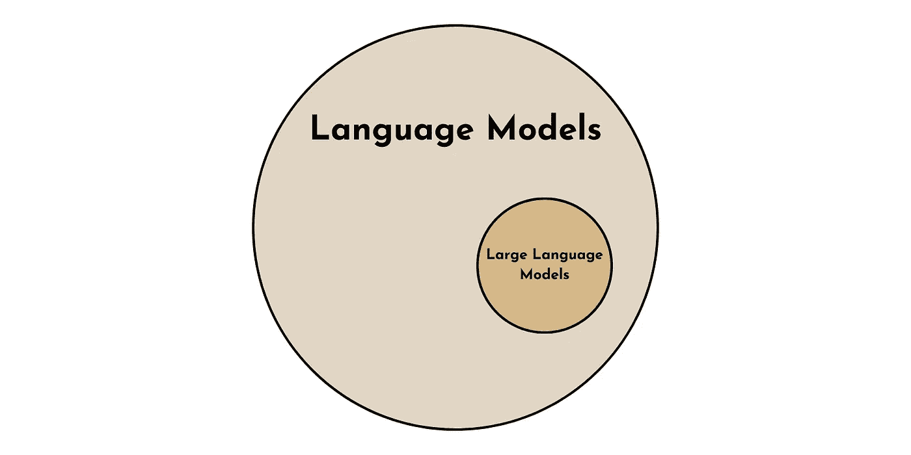
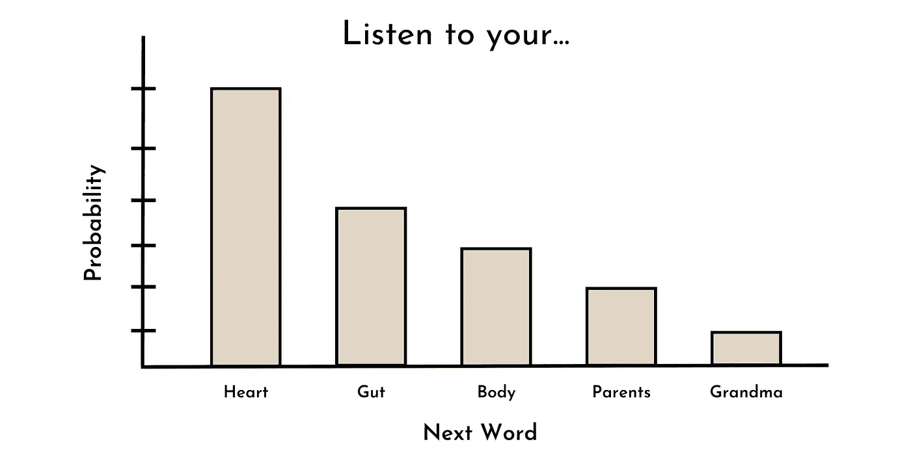

# 实用介绍 LLMs

> 原文：[`towardsdatascience.com/a-practical-introduction-to-llms-65194dda1148`](https://towardsdatascience.com/a-practical-introduction-to-llms-65194dda1148)

## 实践中使用 LLM 的 3 个层次

 [Shaw Talebi](https://shawhin.medium.com/?source=post_page-----65194dda1148--------------------------------)

·发表于[Towards Data Science](https://towardsdatascience.com/?source=post_page-----65194dda1148--------------------------------) ·阅读时间 7 分钟·2023 年 7 月 13 日

--

这是关于实践中使用大型语言模型（LLMs）的[系列文章](https://shawhin.medium.com/list/large-language-models-llms-8e009ae3054c)的第一篇。在这里，我将介绍 LLM 并展示 3 个层次的使用方式。未来的文章将深入探讨 LLM 的实际应用，例如如何使用[OpenAI 的公共 API](https://medium.com/towards-data-science/cracking-open-the-openai-python-api-230e4cae7971)、[Hugging Face Transformers](https://medium.com/towards-data-science/cracking-open-the-hugging-face-transformers-library-350aa0ef0161) Python 库、如何[微调 LLM](https://medium.com/towards-data-science/fine-tuning-large-language-models-llms-23473d763b91)以及[如何从零开始构建 LLM](https://medium.com/towards-data-science/how-to-build-an-llm-from-scratch-8c477768f1f9)。

图片由[Patrick Tomasso](https://unsplash.com/@impatrickt?utm_source=medium&utm_medium=referral)提供，来源于[Unsplash](https://unsplash.com/?utm_source=medium&utm_medium=referral)

# **什么是 LLM？**

**LLM** 是**大型语言模型**的缩写，这是一种最近在 AI 和机器学习领域的创新。这个强大的新型 AI 在 2022 年 12 月通过 ChatGPT 的发布而迅速传播。

对于那些足够开明、生活在 AI 热点和技术新闻周期之外的人来说，**ChatGPT** 是一个基于名为 GPT-3（在撰写时已升级为 GPT-3.5 或 GPT-4）的 LLM 的聊天界面。

如果你使用过 ChatGPT，很明显这不是你传统的来自[AOL 即时消息](https://en.wikipedia.org/wiki/AIM_(software))或你的信用卡客户服务的聊天机器人。

这篇文章*感觉*有所不同。

# **什么使 LLM“巨大”？**

当我听到“大型语言模型”这个术语时，我第一个问题是，*这与“常规”语言模型有何不同？*

语言模型比大语言模型更为通用。就像所有的正方形都是矩形，但并非所有的矩形都是正方形。**所有的 LLM 都是语言模型，但并非所有的语言模型都是 LLM**。

大语言模型是一种特殊类型的语言模型。图片由作者提供。

好吧，LLM 是一种特殊类型的语言模型，**但是什么让它们与众不同呢？**

有**2 个关键特性**将 LLM 与其他语言模型区分开来。其中一个是定量的，另一个是定性的。

1.  **定量上**，LLM 的区别在于模型中使用的参数数量。当前 LLM 的参数数量在**100 亿到 1000 亿之间** [1]。

1.  **定性上**，当语言模型变得“庞大”时，会发生一些显著的变化。它表现出所谓的***突现特性***例如零 shot 学习 [1]。这些是**在语言模型达到足够大的规模时似乎突然出现的特性**。

# **零 shot 学习**

GPT-3（及其他 LLM）的主要创新在于它能够在各种上下文中进行**零 shot 学习** [2]。这意味着 ChatGPT 可以**执行即使未被明确训练过的任务**。

虽然这对我们高度进化的人工来说可能没什么大不了，但这种零-shot 学习能力与之前的机器学习范式形成了鲜明对比。

以前，模型需要**明确地在其旨在完成的任务上进行训练**才能有良好的表现。这可能需要从 1 千到 1 百万个预标记的训练样本。

例如，如果你想让计算机进行语言翻译、情感分析和识别语法错误。这些任务中的每一个都需要一个在大量标记样本上进行训练的专门模型。然而，现在**LLM 可以在没有明确训练的情况下完成所有这些任务**。

# **LLM 是如何工作的？**

训练大多数最先进 LLM 的核心任务是**词预测**。换句话说，给定一系列单词，**下一个词的概率分布是什么**？

例如，对于序列“听从你的 ____”，最可能的下一个词可能是：心、直觉、身体、父母、奶奶等。这可能看起来像下图所示的概率分布。

“听从你的 ___”序列中的下一个词的玩具概率分布。图片由作者提供。

有趣的是，过去许多（非大规模）语言模型也是以这种方式进行训练的（例如 GPT-1）[3]。然而，由于某种原因，当语言模型超过一定规模（比如~10B 参数）时，这些（突现的）能力，如零 shot 学习，可能会开始出现[1]。

尽管目前对*为什么*会发生这种情况没有明确的答案（目前只是猜测），但显然 LLM 是一项强大的技术，具有无数的潜在应用。

# **使用 LLM 的 3 个层次**

现在我们来探讨如何在实践中使用这一强大技术。虽然 LLM 的潜在用例无数，但我在这里将其分为 3 个级别，**按所需的技术知识和计算资源排序**。我们从最容易的开始。

## **第 1 级：提示工程**

实践中使用 LLMs 的第一个级别是**提示工程**，我将其定义为**开箱即用的 LLM 任何用法**，即不更改任何模型参数。虽然许多技术倾向的个人似乎对提示工程嗤之以鼻，但这是在实践中使用 LLMs（无论是技术上还是经济上）最可及的方式。

[## 提示工程 — 如何让 AI 解决你的问题](https://example.org/prompt-engineering-how-to-trick-ai-into-solving-your-problems-7ce1ed3b553f?source=post_page-----65194dda1148--------------------------------)

### 7 个提示技巧、Langchain 和 Python 示例代码

towardsdatascience.com](/prompt-engineering-how-to-trick-ai-into-solving-your-problems-7ce1ed3b553f?source=post_page-----65194dda1148--------------------------------)

提示工程有两种主要方式：**简单方式**和**不那么简单的方式**。

**简单方式：ChatGPT（或其他方便的 LLM 用户界面） —** 这种方法的关键好处是便利。像 ChatGPT 这样的工具提供了一种直观、无成本且无需编码的使用 LLM 的方式（没有比这更简单的了）。

然而，便利通常伴随代价。在这种情况下，这种方法有**两个主要缺点**。**第一个**是功能性不足。例如，ChatGPT 并不容易让用户自定义模型输入参数（如温度或最大响应长度），这些参数会调节 LLM 输出。**第二**，与 ChatGPT 用户界面的交互无法轻松自动化，因此不能应用于大规模用例。

虽然这些缺点可能对某些用例来说是致命的，但如果我们将提示工程更进一步，这些缺点都可以得到改善。

**不那么简单的方式：直接与 LLM 互动 —** 我们可以通过程序化接口直接与 LLM 互动，从而克服 ChatGPT 的一些缺点。这可以通过公共 API（例如 OpenAI 的 API）或本地运行 LLM（使用如 [Transformers](https://medium.com/towards-data-science/cracking-open-the-hugging-face-transformers-library-350aa0ef0161) 的库）来实现。

虽然这种提示工程方式不那么方便（因为需要编程知识和可能的 API 成本），但它提供了一种可定制、灵活和可扩展的方式来实际使用 LLMs。本系列未来的文章将讨论 付费的 和 无成本的 这种类型的提示工程方式。

尽管（在这里定义的）提示工程可以处理大多数潜在的 LLM 应用，但依赖于通用模型和现成的解决方案可能会导致特定用例的性能不佳。在这些情况下，我们可以进入使用 LLM 的下一个级别。

## **第二级：模型微调**

使用 LLM 的第二级是**模型微调**，我将其定义为对现有 LLM 进行调整，以通过**训练至少 1 个（内部）模型参数**（即权重和偏差）来适应特定用例。对于那些喜欢的人来说，这是*迁移学习*的一个例子，即使用现有模型的一部分来开发另一个模型。

微调通常包括 2 个步骤。**步骤 1**：获取一个预训练的 LLM。**步骤 2**：根据特定任务更新模型参数（通常是成千上万的）高质量标记示例。

模型参数定义了 LLM 对输入文本的内部表示。因此，通过调整这些参数以适应特定任务，内部表示会针对微调任务进行优化（或者至少这是其理念）。

这是一种强大的模型开发方法，因为相对**少量的示例**和计算资源**可以产生卓越的模型性能**。

然而，缺点是它需要比提示工程显著更多的技术专长和计算资源。在[未来的文章](https://medium.com/towards-data-science/fine-tuning-large-language-models-llms-23473d763b91)中，我将尝试通过回顾微调技术并分享示例 Python 代码来减少这个缺点。

 ## 微调大型语言模型（LLMs）

### 一个概念概述，并附有示例 Python 代码

towardsdatascience.com

虽然提示工程和模型微调可能能够处理 99% 的 LLM 应用，但在某些情况下，必须进一步深入。

## **第三级：构建你自己的 LLM**

使用 LLM 的第三种也是最后一种实际方法是[**构建你自己的**](https://medium.com/towards-data-science/how-to-build-an-llm-from-scratch-8c477768f1f9)。在模型参数方面，这意味着你**从头开始制定所有模型参数**。

LLM 主要是其训练数据的产物。因此，对于某些应用，可能需要为模型训练策划定制的高质量文本语料库——例如，为开发临床应用而制定的医学研究语料库。

这种方法最大的好处是你可以**完全定制 LLM 以适应你的特定用例**。这是**最终的灵活性**。然而，正如常见的情况一样，灵活性往往以便利性为代价。

由于**LLM 性能的关键在于规模**，从零构建 LLM 需要巨大的计算资源和技术专长。换句话说，这不仅仅是一个周末项目，而是一个团队要工作数月甚至数年的工程，预算达到 7–8F。

然而，在这系列的[未来文章](https://medium.com/towards-data-science/how-to-build-an-llm-from-scratch-8c477768f1f9)中，我们将深入探讨从零开发 LLM 的流行技术。

 ## 如何从零构建 LLM

### 数据整理、变换器、规模化训练和模型评估

towardsdatascience.com

# 结论

虽然关于 LLM 的炒作过多，但它们是 AI 中的一种强大创新。在这里，我提供了 LLM 是什么的入门知识，并框定了它们如何在实践中使用。[系列中的下一篇文章](https://medium.com/towards-data-science/cracking-open-the-openai-python-api-230e4cae7971)将为 OpenAI 的 Python API 提供初学者指南，帮助启动你的下一个 LLM 用例。

👉 **更多 LLM 信息**: [OpenAI API](https://medium.com/towards-data-science/cracking-open-the-openai-python-api-230e4cae7971) | [Hugging Face Transformers](https://medium.com/towards-data-science/cracking-open-the-hugging-face-transformers-library-350aa0ef0161) | [Prompt Engineering](https://medium.com/towards-data-science/prompt-engineering-how-to-trick-ai-into-solving-your-problems-7ce1ed3b553f) | [Fine-tuning](https://medium.com/towards-data-science/fine-tuning-large-language-models-llms-23473d763b91) | 构建 LLM | QLoRA | [RAG](https://medium.com/towards-data-science/how-to-improve-llms-with-rag-abdc132f76ac) | 文本嵌入

[Shaw Talebi](https://shawhin.medium.com/?source=post_page-----65194dda1148--------------------------------)

## 大型语言模型（LLMs）

[查看列表](https://shawhin.medium.com/list/large-language-models-llms-8e009ae3054c?source=post_page-----65194dda1148--------------------------------)13 篇故事

# 资源

**联系**: [我的网站](https://shawhintalebi.com/) | [预约电话](https://calendly.com/shawhintalebi)

**社交媒体**: [YouTube 🎥](https://www.youtube.com/channel/UCa9gErQ9AE5jT2DZLjXBIdA) | [LinkedIn](https://www.linkedin.com/in/shawhintalebi/) | [Twitter](https://twitter.com/ShawhinT)

**支持**: [请我喝咖啡](https://www.buymeacoffee.com/shawhint) ☕️

 [## 免费获取我撰写的每一篇新故事

### 免费获取我撰写的每一篇新故事 P.S. 我不会与任何人分享您的电子邮件 注册后，您将创建一个...

shawhin.medium.com](https://shawhin.medium.com/subscribe?source=post_page-----65194dda1148--------------------------------)

[1] 大型语言模型调查。 [arXiv:2303.18223](https://arxiv.org/abs/2303.18223) **[cs.CL]**

[2] GPT-3 论文。 [arXiv:2005.14165](https://arxiv.org/abs/2005.14165) **[cs.CL]**

[3] Radford, A., & Narasimhan, K. (2018). 通过生成预训练提高语言理解。 ([GPT-1 论文](https://s3-us-west-2.amazonaws.com/openai-assets/research-covers/language-unsupervised/language_understanding_paper.pdf))
