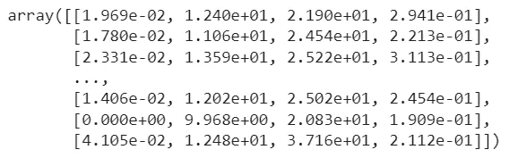
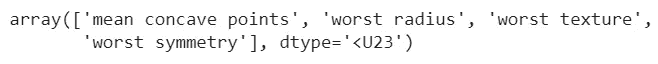
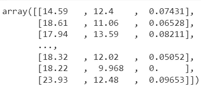
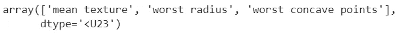

# 顺序特征选择的实用介绍

> 原文：[`towardsdatascience.com/a-practical-introduction-to-sequential-feature-selection-a5444eb5b2fd`](https://towardsdatascience.com/a-practical-introduction-to-sequential-feature-selection-a5444eb5b2fd)

## 轻松探讨这种不寻常的特征选择技术

[](https://gianlucamalato.medium.com/?source=post_page-----a5444eb5b2fd--------------------------------)[](https://towardsdatascience.com/?source=post_page-----a5444eb5b2fd--------------------------------) [Gianluca Malato](https://gianlucamalato.medium.com/?source=post_page-----a5444eb5b2fd--------------------------------)

·发表在[Towards Data Science](https://towardsdatascience.com/?source=post_page-----a5444eb5b2fd--------------------------------) ·阅读时间 4 分钟·2023 年 2 月 16 日

--


*Robert Stump*的照片可在[*Unsplash*](https://unsplash.com/it/foto/pQyTChJwEDI?utm_source=unsplash&utm_medium=referral&utm_content=creditCopyText)上查看。

特征选择对于数据科学家来说总是一个挑战。确定合适的特征集对模型的成功至关重要。有几种技术利用特征集对模型的性能。其中之一是顺序特征选择。

# 什么是顺序特征选择？

顺序特征选择是一种有监督的特征选择方法。它利用有监督模型，可以用来从大型数据集中移除无用的特征或通过逐步添加来选择有用的特征。

该算法按照以下步骤工作：

+   从数据集中选择一个特征，以最大化模型在 k 折交叉验证中的平均性能。这个数据集仅由一个特征组成。

+   根据相同的原则（最大化模型的交叉验证性能），向数据集中添加第二个特征

+   不断向数据集中添加特征，直到达到所需特征数量或性能没有显著提升

这是一种*前向*方法，因为我们从一个特征开始，然后添加其他特征。还有一种*后向*方法，它从所有特征开始，根据相同的最大化标准移除较不相关的特征。

由于在每一步，我们检查模型在相同数据集上添加每个剩余特征（一个一个）的性能，因此这是一种贪婪方法。

当达到所需特征数量或性能未超过某个阈值时，算法会停止。

# 优势和劣势

主要优点是它实际上能够根据给定模型找到非常好的特征集。此外，它仅仅依赖于模型性能，因此不需要模型像[随机森林](https://www.yourdatateacher.com/2021/10/11/feature-selection-with-random-forest/)或[套索回归](https://www.yourdatateacher.com/2021/05/05/feature-selection-in-machine-learning-using-lasso-regression/)那样提供特征重要性的解释。它适用于所有模型，这是一个很大的优势。

主要缺点与贪婪方法有关。正如你所想，它计算成本很高，尤其是在你使用反向方法并且有数百个特征时。

此外，根据性能选择特征并不总能保证得到最佳特征集。例如，这种方法不能正确去除共线性。

最终，整个过程依赖于使用适当的性能度量（这是任何监督学习问题中至关重要的）和选择应用于停止选择的阈值。

必须根据我们所做的项目考虑这种程序的优缺点。

# Python 示例

让我们用 Python 编程语言看一个例子。在这个例子中，我们将使用 scikit-learn >= 1.1 的乳腺癌数据集。

让我们导入一些对象以及执行特征选择算法的 SequentialFeatureSelector 对象。

```py
from sklearn.feature_selection import SequentialFeatureSelector 
from sklearn.model_selection import train_test_split 
from sklearn.datasets import load_breast_cancer
```

让我们导入一个分类模型，例如高斯朴素贝叶斯模型。

```py
from sklearn.naive_bayes import GaussianNB
```

让我们将数据集分成训练集和测试集。

```py
X,y = load_breast_cancer(return_X_y = True) 
X_train,X_test,y_train,y_test = train_test_split(X,y,test_size=0.3,random_state=0)
```

现在，让我们应用前向方法，自动选择 4 个最佳特征。我们将使用 AuROC 得分来衡量性能，并进行 5 折交叉验证。

```py
selector = SequentialFeatureSelector(GaussianNB() , n_features_to_select=4, direction='forward',  scoring="roc_auc", cv=5) 
```

```py
selector.fit_transform(X_train,y_train)
```

正如预期的那样，选择了 4 个特征。



作者提供的图片

就像我们可以对 scikit-learn 的每个特征选择器对象做的那样，我们可以使用选择器的“get_support”方法来获取所选特征的名称。

```py
feature_names = load_breast_cancer()['feature_names'] 
feature_names[selector.get_support()]
```



作者提供的图片

现在，让我们尝试另一种方法。让算法根据平衡准确度得分和 1%的停止阈值选择最佳特征集。因此，如果每个阶段的特征选择未能将该得分提高至少 1%，算法会停止，并保留到目前为止识别出的特征。

```py
selector = SequentialFeatureSelector(GaussianNB(), n_features_to_select='auto', direction='forward', scoring="balanced_accuracy", tol=0.01, cv=5) selector.fit_transform(X_train,y_train)
```



作者提供的图片

选择器已经选择了 3 个特征。它们的名称是：



作者提供的图片

通过将“direction”参数设置为“backward”，可以以反向的方式完成类似的任务。

# 结论

顺序特征选择在数据科学家的工具箱中可以是一个非常有用的工具。然而，我们必须考虑到它的复杂性和计算速度，这非常低。我建议使用自动化方法来选择最佳特征数量，一般来说，使用前向方法可能是最好的选择。这是因为如果我们从大量特征开始，模型的性能可能会受到维度诅咒的影响，从而对任何目的，包括特征选择，都不可靠。相反，前向方法从少量特征开始，并不断添加特征直到找到一个良好的特征集。这可以减少计算时间，并提供更可靠的结果。

*最初发布于* [*https://www.yourdatateacher.com*](https://www.yourdatateacher.com/2023/02/15/a-practical-introduction-to-sequential-feature-selection/) *于 2023 年 2 月 15 日。*
