# 《线性代数入门》

> 原文：[`towardsdatascience.com/a-primer-on-linear-algebra-414111d195ca?source=collection_archive---------14-----------------------#2023-01-12`](https://towardsdatascience.com/a-primer-on-linear-algebra-414111d195ca?source=collection_archive---------14-----------------------#2023-01-12)

## 对数据科学的关键概念和操作的温和回顾

 [Rob Taylor, PhD](https://medium.com/@dataforyou?source=post_page-----414111d195ca--------------------------------)

·

[关注](https://medium.com/m/signin?actionUrl=https%3A%2F%2Fmedium.com%2F_%2Fsubscribe%2Fuser%2F98de080592fc&operation=register&redirect=https%3A%2F%2Ftowardsdatascience.com%2Fa-primer-on-linear-algebra-414111d195ca&user=Rob+Taylor%2C+PhD&userId=98de080592fc&source=post_page-98de080592fc----414111d195ca---------------------post_header-----------) 发表在 [Towards Data Science](https://towardsdatascience.com/?source=post_page-----414111d195ca--------------------------------) ·9 分钟阅读·2023 年 1 月 12 日

--

照片由 [Vashishtha Jogi](https://unsplash.com/@jogi?utm_source=medium&utm_medium=referral) 提供，来自 [Unsplash](https://unsplash.com/?utm_source=medium&utm_medium=referral)

## 介绍

无论你是在拟合一个简单的回归模型还是卷积神经网络，线性代数在使这些计算高效方面都起着重要作用。虽然大多数人可能对其在几何学中的应用比较熟悉——例如用来定义线条、平面及其变换（如旋转和位移）——但线性代数在科学和工程领域中都是基础性的。鉴于它对科学计算的重要性，每个数据科学家都应该对其有所了解。

所以，如果你的线性代数有些生疏，或者你只是想初步了解一下，这个入门介绍了一些基本概念，希望能温和地引导你进入线性代数的世界。

## 向量

一个*向量*包含一组有序的值，这些值告诉我们如何在*n*维空间中从一个点移动到另一个点。例如，在二维空间中，向量表示两个离散的(*x, y*)点之间的有向线段——它告诉你一个点相对于另一个点的位置。然而，向量空间可以有超过两个维度；因此，向量包含的分量数量对应于其空间的*维度*：

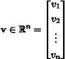

一个 n 维列向量（图片由作者提供）。

其中 ℝ 表示所有维度为*n*的实值向量的集合。这里，**v** 是一个*列向量*，但也可以表示为*行向量：*

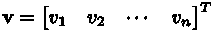

行向量是通过转置列向量创建的（图片由作者提供）。

其中*T* 是*转置*运算符。通常，向量以列形式用小写粗体字母表示，但将向量以行形式显示也很方便。

## 向量运算

对向量应用运算和函数通常很有用，其中一种运算是*向量加法*。这个操作没有什么神秘之处，它的作用就像名字所示那样。假设我们有两个*2*维向量**u**和**v**，我们想将它们相加。这些向量的和就是它们分量的和：

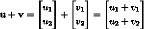

向量加法（图片由作者提供）。

我们也可以对向量进行乘法运算，其中最简单的称为*标量乘法*。这涉及到将每个向量分量乘以一个实数常量*c*，这个常量称为*标量倍数*，或简称为*标量*。例如，向量*c***v** 为：

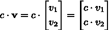

向量的标量乘法（图片由作者提供）。

这会产生一个*缩放*后的向量，这个向量的效果是拉伸或收缩，缩放后的版本长度是原始向量的 |*c*| 倍。此外，如果*c < 0*，则向量的方向会*反转*。如果我们想减去向量而不是加上向量，这会非常有用，因为向量**v**的负数就是(-1)**v = -v**，所以在这种情况下*c* = -1。然后，向量**u**和**v**之间的差异可以表示为：

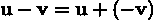

向量减法（图片由作者提供）。

标量还用于创建*线性组合*的向量；不过，在这种情况下，标量通常称为*系数*。例如，我们可以用向量**u**和**v**以及系数*a*和*b*来创建一个向量**w**，如下所示：

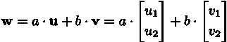

向量的线性组合（作者提供的图片）。

这只是两个缩放向量的和。

## 点积

*点积*（或*数量积*）取两个维度相同的向量，并产生每个对应分量的乘积的和的标量。这是相当冗长的描述，所以为了说明，在下面显示了两个*n*维向量**u**和**v**的点积：

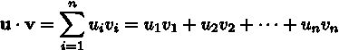

点积（作者提供的图片）。

这表明，因为每个向量的大小相同，乘法是分量对应相乘--向量**u**中的第*i*个分量乘以向量**v**中的第*i*个分量--然后所有乘积相加。请注意，哪个向量乘以哪个向量都没有关系，因为点积是可交换的，意思是**u** x **v = v** x **u.**

点积还用于测量向量的长度，称为*范数*。范数是一个非负标量，等于其平方分量的和的平方根，用来衡量原点*O*=[0, 0]和*n*维空间中的向量点之间的距离。例如，具有维度*n*的向量**v**的范数计算如下：

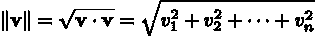

范数是向量的长度（作者提供的图片）。

在二维空间中，这不仅测量直角三角形的斜边长度，并且与毕达哥拉斯定理完全相同。我们还可以测量两个向量之间的距离，这只是上述的一般化。如果我们想要测量向量**u**和**v**之间的距离，那么这只是两个向量之间差异的范数：

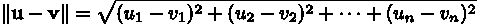

两个向量之间的距离（作者提供的图片）。

最后，点积还用于测量两个非零向量之间的角度。具体来说，向量**u**和**v**之间的角度的余弦是：

两个向量之间夹角的余弦（作者提供的图片）。

因此，角度等于：

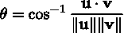

求角度（作者提供的图片）。

在结束向量之前，一个重要的条件要认识到是*正交性*。如果两个向量之间的夹角为 90 度（或*垂直*），则说这些向量是正交的。在这种情况下，向量形成直角，因此：

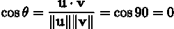

如果满足这个条件，两个向量是正交的（作者提供的图片）。

由此可见：

正交性的另一个影响（作者提供的图片）。

## 矩阵

一个*矩阵*是一个按列和行排列的值的表格。矩阵中的每个值称为*元素*或*条目*，矩阵的*大小*描述了它有多少行和列。例如，一个*m* x *n*（读作“*m* 乘 *n*”）矩阵有*m* 行和*n* 列。如果一个矩阵只有一行，那么它与上面介绍的行向量相同，但也可以称为*行矩阵*。类似地，只有一列的矩阵是列向量或*列矩阵*。

一般来说，大小为*n* x *m* 的矩阵的形式为：

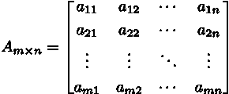

一个*m* x *n* 矩阵（作者插图）。

在引用特定矩阵元素时，通常使用*双下标*符号，其中*i* 为条目的行下标，*j* 为列下标。对于上述矩阵*A*，一个条目可以引用为：

矩阵 A 中元素的定义（作者插图）。

对于任何矩阵，我们可以将*对角元素*定义为那些具有相同下标的元素：

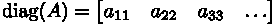

矩阵的对角元素具有相同的下标（作者插图）。

如果条件*m* = *n* 成立，那么矩阵被称为*方阵*，并且沿主对角线的元素数量等于行或列的数量。此外，对于任何*n* x *n* 方阵，*迹*定义为沿主对角线元素的总和：

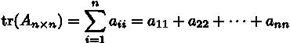

方阵的迹（作者插图）。

现在，如果一个矩阵只有非零的对角线元素——这意味着所有其他元素*都是*零——那么这个矩阵被称为*对角矩阵*：

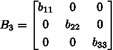

对角矩阵沿主对角线只有非零元素（作者插图）。

然而，如果对角矩阵的值都是*相同的——*也就是说，对角线上的值是一个标量——那么这个矩阵被称为*标量矩阵*：

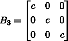

标量矩阵沿主对角线只有非零标量（作者插图）。

但如果标量恰好是*c* = 1，那么这个矩阵被称为*单位矩阵*：

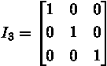

单位矩阵沿主对角线只有 1（作者插图）。

请注意，对于任何标量*c*，标量矩阵可以作为单位矩阵的标量倍数来推导：*B* = *c* *I*。

## 矩阵运算

之前讨论的向量运算也可以推广到矩阵。例如，如果两个矩阵*A*和*B*大小相等，则可以按元素相加，如下所示：

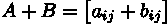

矩阵加法（作者插图）。

类似地，矩阵可以使用任何实值常数*c*进行缩放：

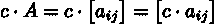

矩阵的标量乘法（作者插图）。

我们还讨论了如何使用转置运算符将列向量转换为行向量。这个运算符也可以推广到矩阵，并通过交换行和列来实现。具体来说，矩阵*A*的转置结果是：

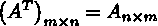

矩阵的转置（图像作者提供）。

这表明转置矩阵的第*i*列是原始矩阵*A*的第*i*行。换句话说，转置矩阵中第*i*行和第*j*列的元素与矩阵*A*中第*j*行和第*i*列的元素相同。

转置也用于评估一个方阵是否是*对称的*。如果满足以下条件，则为对称矩阵：

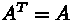

对称方阵的条件（图像作者提供）。

这表明*A*等于它的转置。

## 矩阵乘法

与上面讨论的向量和矩阵操作不同，矩阵乘法不是逐元素的。例如，如果*A*是一个*m* x *n*的矩阵，*B*是一个*n* x *p*的矩阵，那么积*C* = *AB* 是一个*m* x *p*的矩阵，其中第*i*行和第*j*列的条目计算为：

对于第*i*行和第*j*列的逐元素计算（图像作者提供）。

这看起来与之前讨论的点积非常相似，实际上它*就是*一个点积！具体来说，矩阵*C*中第*i*行和第*j*列的元素是矩阵*A*的第*i*行与矩阵*B*的第*j*列的点积。请注意，矩阵的大小不必相等；然而，矩阵乘法要求*A*的列数与*B*的行数匹配。

## 最后的备注

本文涉及了一些线性代数中的基础概念和操作，所以有很多内容无法挤进一篇文章中。其他一些值得注意的内容包括可逆矩阵和矩阵求逆、线性方程组的解法，以及特征值和特征向量。我将在未来的文章中详细讲解这些内容，同时希望你觉得这篇简短的入门文章有用。

感谢阅读！

如果你喜欢这篇文章并希望保持更新，请考虑[关注我在 Medium 上](https://medium.com/@dataforyou)。这样可以确保你不会错过任何新内容。

要获取所有内容的无限访问权限，请考虑[注册 Medium 会员](https://medium.com/membership)。

你还可以[在 Twitter 上关注我](https://twitter.com/dataforyounz)、[在 LinkedIn 上关注我](https://www.linkedin.com/in/dataforyou/)，或者查看我的[GitHub](https://github.com/dataforyounz)，如果你更喜欢这样😉
