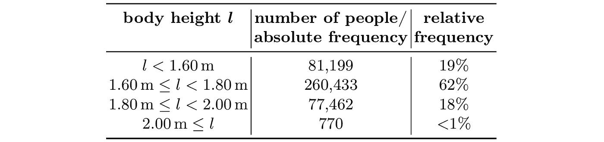
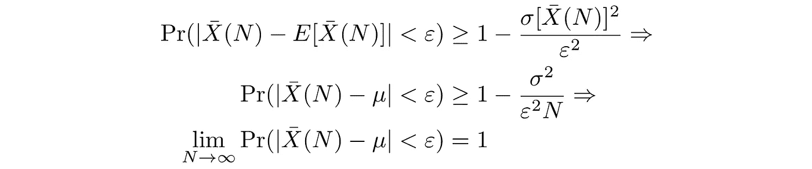
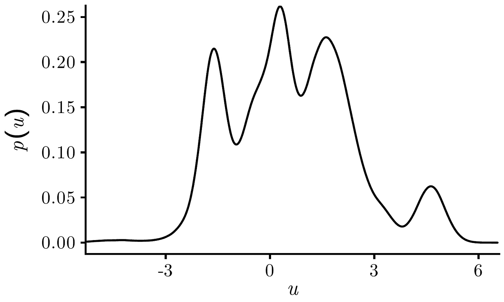
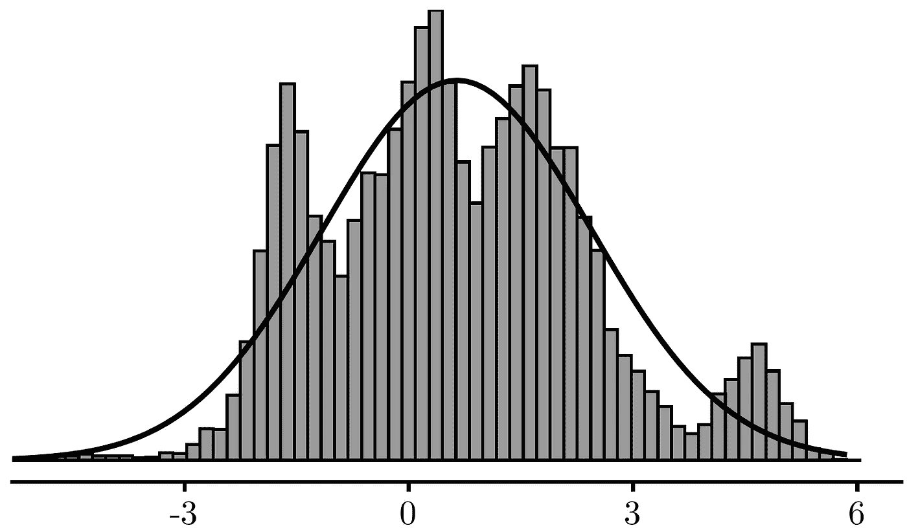
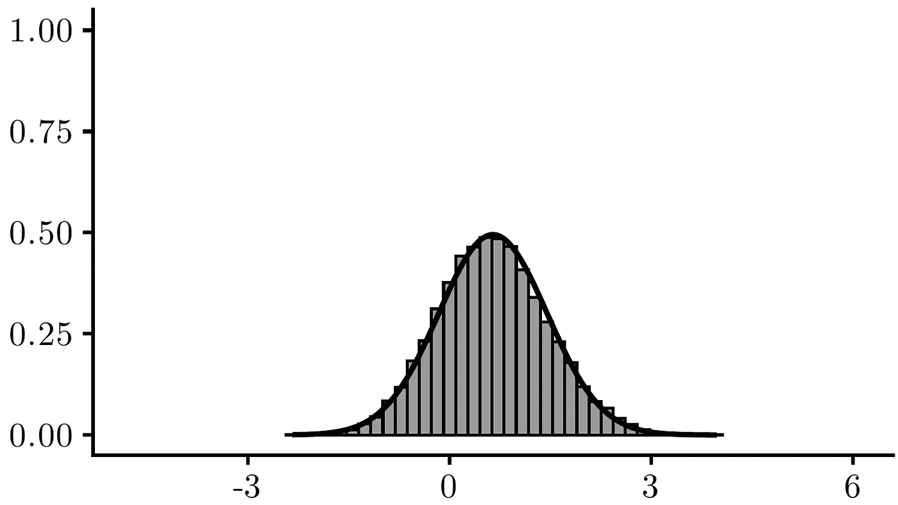
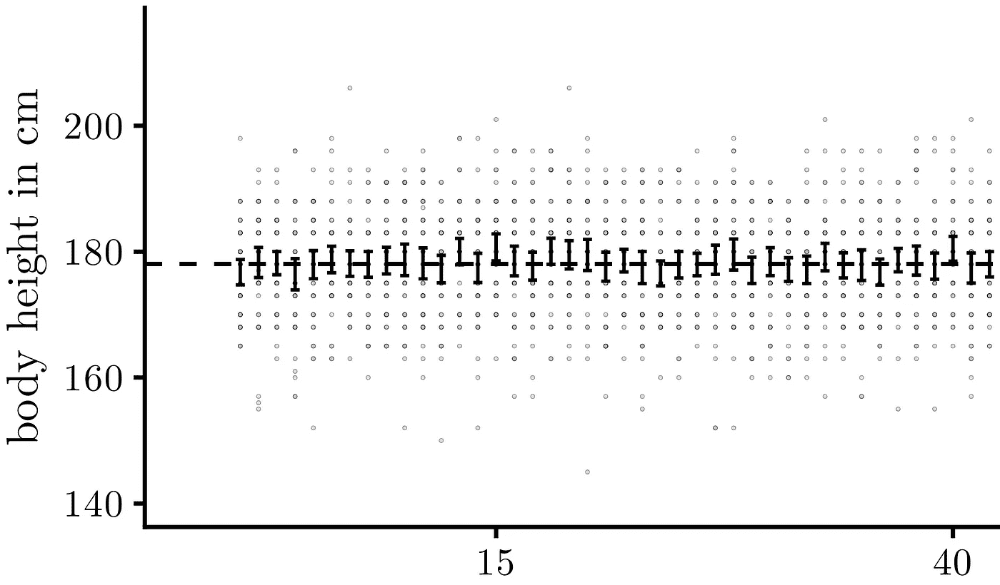
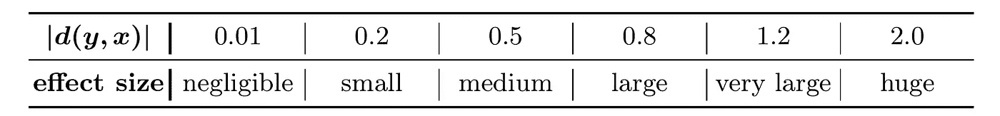
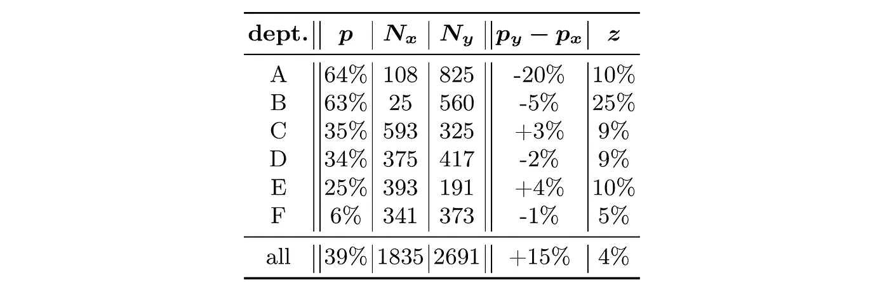

# 统计估计与推断基础

> 原文：[`towardsdatascience.com/a-primer-on-statistical-estimation-and-inference-02b1615e2168?source=collection_archive---------3-----------------------#2023-10-31`](https://towardsdatascience.com/a-primer-on-statistical-estimation-and-inference-02b1615e2168?source=collection_archive---------3-----------------------#2023-10-31)

## 大数法则和扎实的统计推理是数据科学中有效统计推断的基础

  [Matthias Plaue](https://medium.com/@mplaue?source=post_page-----02b1615e2168--------------------------------)

·

[关注](https://medium.com/m/signin?actionUrl=https%3A%2F%2Fmedium.com%2F_%2Fsubscribe%2Fuser%2Ff8460ff93951&operation=register&redirect=https%3A%2F%2Ftowardsdatascience.com%2Fa-primer-on-statistical-estimation-and-inference-02b1615e2168&user=Matthias+Plaue&userId=f8460ff93951&source=post_page-f8460ff93951----02b1615e2168---------------------post_header-----------) 发表在 [Towards Data Science](https://towardsdatascience.com/?source=post_page-----02b1615e2168--------------------------------) · 17 分钟阅读 · 2023 年 10 月 31 日

--

图片来源：[Gabriel Ghnassia](https://unsplash.com/@gabrielghnassia?utm_source=medium&utm_medium=referral) 在 [Unsplash](https://unsplash.com/?utm_source=medium&utm_medium=referral)

*大数法则和扎实的统计推理是数据科学中有效统计推断的基础。*

*以下内容大部分取自我的书籍，《*[*数据科学——统计与机器学习导论*](https://doi.org/10.1007/978-3-662-67882-4)*》（[Plaue 2023]），由* [*Springer Nature*](https://www.springernature.com/)* 最近出版。*

# 引言

通过我们的日常经验，我们对人群的典型身高有一个直观的理解。在世界大部分地区，成年人通常身高在 1.60 m 到 1.80 m 之间，而身高超过两米的人则很少见。通过提供身高的频率分布，这一直观事实可以用数值证据来支持。

表 1：人类身高频率。图像由作者提供。

这些数据基于美国疾病控制与预防中心（CDC）收集的数据集，其中列出了包括身高在内的 340,000 多人的各种属性[[CDC 2018](https://www.cdc.gov/brfss/annual_data/annual_2018.html)]。对这个频率表的检查表明，实际上，超过一半的受访者报告他们的身高在

1.60 m 和 1.80 m。

尽管**样本**的规模有限，我们仍然相信我们的调查使我们能够对整体人群得出结论。例如，仅基于数据，我们可以相对有把握地得出结论，人类不可能长到三米高。

**随机过程**的一个重要目标是严谨而数学地证明这些结论。该领域可以分为两个子领域：

+   **概率论**处理概率概念的数学定义和研究。此类研究的一个中心对象是**随机变量**：这些变量的值并未被精确指定或知道，而是存在不确定性。换句话说，只能给出一个概率，即随机变量取值在某个范围内。

+   **推断统计学**基于这样的假设，即统计观察和测量（例如频率、均值等）是随机变量的值或**实现**。相反，该领域研究了随机变量的特征在多大程度上可以从样本数据中估计出来。特别地，在某些简化假设下，可以量化这种估计的准确性或误差。

让我们来看看一个简单的统计推断示例：通过观察一系列掷币结果来确定一枚硬币是否公平或有偏。我们可以假设掷硬币的结果由一个离散随机变量 *X_*1 决定，该变量取值为零（代表反面）或一（代表正面）。如果我们再次掷同一枚硬币，我们可以假设结果可以用第二个随机变量 *X_*2 来描述，该变量与第一个变量独立但遵循相同的分布。

如果我们没有任何证据支持硬币有偏的假设，我们可以假设硬币是公平的。换句话说，我们期望正面和反面的出现概率相同。在这种被称为**零假设**的假设下，如果我们重复多次实验，我们期望正面出现的频率与反面大致相同。

相反，这些数据使我们能够对潜在的真实分布得出结论。例如，如果我们观察到正反面出现的频率差异很大，比如正面出现的频率为 70%，而反面为 30%，那么——如果样本量足够大——我们会相信需要修正我们最初关于等概率的假设。换句话说，我们可能需要放弃我们认为硬币是公平的假设。

在上述例子中，数据中正面出现的频率作为“硬币出现正面”这一随机事件的概率的估计量。常识表明，我们对这些估计的信心随着样本量的增加而增加。例如，如果之前提到的不平衡只出现在十次掷硬币中（七次正面和三次反面），我们可能还不会确信我们有一个偏倚的硬币。零假设，即公平的硬币，仍然有可能成立。在日常术语中，实验结果也可能归因于“纯粹的运气”。然而，如果我们观察到在一百次掷硬币中出现了七十次正面，那将是更有力的证据支持硬币是偏倚的替代理论！

# 中心极限定理：从点估计到置信区间

点估计是统计学家和数据科学家工具包中最基本的工具之一。例如，从大量样本中得到的算术平均值提供了对给定变量可能取值的洞察。在机器学习中，我们从训练数据中估计模型参数，这些数据应涵盖足够数量的标记示例。

通过经验和直觉，我们相信较大的样本和更多的训练数据可以提供更准确的统计程序和更好的预测模型。推断统计提供了更稳健的基础来支持这种直觉，这通常被称为**大数法则**。此外，通过计算**置信区间**，我们对什么是“足够大的样本”有了更深刻的理解，而不是仅仅依赖点估计。置信区间为我们提供了一些范围值，在这些范围内，我们可以合理地断言我们试图估计的真实参数存在。

在接下来的部分中，我们将以自包含的方式展示计算置信区间的数学框架，其核心在于**中心极限定理**。

## 切比雪夫大数法则

正如我们期望相对频率是事件或二元变量结果概率的良好估计器一样，我们也期望算术均值是产生我们观察到的数值数据的随机变量期望值的良好估计器。

需要注意的是，这个估计值本身也是一个随机变量。如果我们掷骰子 50 次并记录平均数，然后重复实验，我们可能会得到略有不同的值。如果我们多次重复实验，我们记录的算术均值将遵循某种分布。然而，对于大样本，我们期望它们仅显示出小的离散度，并围绕真实的期望值集中。这是[**切比雪夫大数法则**](https://en.wikipedia.org/wiki/Law_of_large_numbers)的核心信息，我们将在下面详细说明。

在此之前，我们引入一个概率理论中的重要工具— [**切比雪夫不等式**](https://en.wikipedia.org/wiki/Chebyshev%27s_inequality)。假设我们有一个随机变量 *X*，其均值为 *μ*，方差为 *σ²*。那么，对于任何 ε > 0，下述关系成立，其中 Pr( · ) 表示“概率”：

这一结果与我们对离散度量的直观理解是一致的：方差越小，随机变量取值接近均值的可能性越大。

例如，随机变量在其期望值的六个标准差范围内的观察值的概率非常高，至少为 97%。换句话说，随机变量取值偏离均值超过六个标准差的概率非常低，小于 3%。这一结果适用于任何形状的分布，只要期望值和方差是有限值。

现在假设我们在样本中观察到数值，这些数值是随机变量 *X_*1, *…*, *X_*N 的实现。我们假设这些随机变量彼此独立，并且遵循相同的分布，这一属性通常被称为**独立同分布**，简称**i.i.d.**。当观察结果是由独立设立和相同准备的实验所得，或代表从总体中随机选择的样本时，这一假设是合理的。然而，需要注意的是，这一假设可能并不总是成立。

此外，我们假设每个随机变量的期望值 *μ* 和方差 *σ²* 存在且有限。由于这些变量遵循相同的分布，这些值对每个变量都是相同的。接下来，我们考虑以下产生算术平均值的随机变量：

首先，我们展示算术均值估计量 x̄是**无偏估计量**：其值围绕真实均值*μ*分布。这是直接从期望值*E*[ · ]的线性性质中得出的结果。

接下来，我们希望展示对于大样本，算术均值估计量的值不会过于偏离真实均值。由于*X_*1, *…*, *X_*N 被假定为相互独立，它们是成对不相关的。检查成对不相关的随机变量的方差可以按如下方式表示，因为所有交叉项都消失了，并不困难：

因此，算术均值估计量的方差如下：

既然我们知道了算术均值估计量的均值和方差，我们可以应用切比雪夫不等式：

这一结果表明算术均值是**一致估计量**：它在概率上收敛于真实均值。换句话说，对于大样本，底层分布的期望值*μ*与样本的算术均值之间不太可能有显著差异。

## 林德伯格–列维中心极限定理

切比雪夫大数法则指出，在相当一般的条件下，大样本的算术均值很可能接近于底层分布的真实均值。或许令人惊讶的是，我们可以相当具体地说明大样本的均值围绕真实期望值的分布情况。这是[**林德伯格–列维中心极限定理**](https://en.wikipedia.org/wiki/Central_limit_theorem)的核心信息。对于任意数字*a*，*b*且*a* < *b*：

方程右侧的被积函数是**标准正态分布**的概率密度函数：[**正态分布**](https://en.wikipedia.org/wiki/Normal_distribution)——其具有著名的钟形曲线——均值为零，方差为一。

通常，若一序列随机变量对某随机变量收敛于分布，则其累计分布函数点对点地收敛于该随机变量的分布*。* 从数学上讲，中心极限定理表明，无论*X_*1, … *X_*N 如何分布（只要它们是独立同分布的），以下随机变量序列总是收敛于标准正态分布的随机变量：

从统计学角度讲，中心极限定理暗示，如果我们重复收集一组

对于来自同一总体的足够大样本，这些样本的均值将呈正态分布。这个定理具有实际意义，因为它允许我们对统计估计的准确性做出精确的陈述。一个常见的误解是，这个定理是为什么许多经验分布在实践中可以近似为正态分布的原因。然而，事实并非如此。

尽管定理的证明需要高级分析工具，我们在这里不讨论（参见，例如，[[Durrett 2019](https://services.math.duke.edu/~rtd/PTE/pte.html)，定理 3.4.1]），但我们可以通过一个数值例子理解它的实际意义。我们来考虑以下概率密度函数，我们假设它生成了正在研究的数据：

图 1：任意概率密度函数。图片来源于作者。

为了强调定理适用于任何形状的底层分布，请注意密度函数如何与钟形曲线不相似。我们可以通过数值模拟检查从分布中重复抽取的样本大小 *N* 的大量均值的直方图。对于仅由单一实例组成的样本，*N* = 1，我们不能期望极限定理适用——我们只是重复底层分布：

图 2：从任意分布中采样得到的直方图（N = 1 的情况）。图片来源于作者。

然而，即使对于相对较小的样本大小 *N* = 5，算术均值的分布——即，重复采样并计算 (*x_*1 + … + *x_*5) / 5——仍然显示出正态分布的典型钟形曲线：

图 3：样本均值的分布，样本大小为 *N* = 5。图片来源于作者。

[Grant Sanderson](https://twitter.com/3blue1brown) 在他的 YouTube 频道 [3Blue1Brown](https://www.youtube.com/c/3blue1brown) 上制作了一个[视频](https://youtu.be/zeJD6dqJ5lo?si=DqUgZRlQWhLar6aB)，提供了关于中心极限定理的额外直观见解，非常值得观看。

## 区间估计和假设检验

中心极限定理很重要，因为它允许我们指定**置信区间**而不仅仅是点估计来估计某些总体的均值：我们指定一个区间，我们可以相当确定地认为这个区间包含真实均值，而不是一个单一的估计值。例如，假设我们希望在样本足够大的情况下，以 95%的置信度确保我们的估计是正确的。我们可以通过设置置信区间，并将**置信水平**设为γ = 0.95 来实现：

我们做出以下假设，数值 *z* > 0 尚待确定：

中心极限定理允许我们得出以下结论：

因此，*z* = *z*(γ) 是由在标准正态分布曲线下产生面积 γ 的积分界限决定的。例如，*z*(0.95) = 1.96 或 *z*(0.99) = 2.58。

总结来说，基于足够大样本的均值的区间估计（常用的经验法则是 *N* > 30 或 *N* > 50）在置信水平 γ 下为：

为了得出上述公式，我们用经验估计值 x̄ 和 *s*(x) 替代了均值 μ 和标准差 σ。这对于足够大的样本是一个合理的近似，并可以通过 [**斯卢茨基定理**](https://en.wikipedia.org/wiki/Slutsky%27s_theorem) 证明，该定理基本上说明了只要其中一个加数/因子收敛到常数，基本算术运算与分布极限的操作是可以交换的。

而不是置信水平 γ，**显著性水平**，或 **概率

error，**α = 1 − γ 可以指定。

让我们计算一个实际的例子。CDC 调查中男性受访者的 99.9% 置信区间为 [177.98 cm, 178.10 cm]。这种高统计准确性得益于超过 190,000 名男性受访者的大样本量。我们想展示如何对较小样本量进行区间估计。为此，我们反复抽取 *N* = 50 的随机样本体高值，并计算相应的 95% 置信区间。结果见下图：

图 5：从样本大小 *N* = 50 的体高区间估计。图像来源于作者。

注意，大多数置信区间（以垂直误差条表示）也包含了 178 cm 的真实值（以水平虚线表示）。然而，有些则不包含，大约百分之一 — 这是按照构造预期的，并与指定的误差概率 α = 5% 一致。总是有可能区间估计会错过总体的真实均值，特别是在低置信水平下。

中心极限定理的另一个重要应用，与区间估计密切相关，是假设检验。假设我们有理由相信随机变量 *X* 的期望值 *不* 等于某个值 μ。在这种情况下，我们想要驳斥原假设 *E*[*X*] = μ。如果观察到的均值不包含在以下区间内，我们可以说这个原假设与数据不一致：

让我们回顾一下引言中的可能有偏的硬币的例子。我们记录每次抛硬币的结果，得到一个二进制值序列，其中值为 1 表示正面，值为 0 表示反面。该序列的算术平均值等于正面的相对频率，我们可以应用迄今为止学到的知识。假设我们有理由相信这枚硬币是不公平的。零假设声称硬币是公平的，即 *E*[*X*] = 0.5。在第一次实验中，我们观察到经过十次抛掷后，硬币正面朝上的次数为七次。在置信水平 γ = 0.95 下，此实验的零假设区间为：[0.24, 0.76]。实际观察到的 0.7 比例仍在此区间内。因此，在给定的置信水平下，不能拒绝公平硬币的零假设。

样本量相对较小，实际上建议使用[**学生的 *t*-检验**](https://en.wikipedia.org/wiki/Student%27s_t-test)。*t*-检验会将临界标准分数 *z*(0.95) = 1.96 调整为 2.26，从而得到更宽的置信区间。

如果我们观察到一百次抛硬币中有七十次结果为正面，那么在假设零假设为真的情况下，得到的置信区间将是[0.41, 0.59]。在这种情况下，实际观察到的 0.7 比例*不*包含在置信区间内。因此，应该拒绝零假设，我们可以在给定的置信水平下得出结论——硬币是有偏的。

我们还可以基于每个样本调查两个总体的均值是否相等。双侧的双样本 [***Z*-检验**](https://en.wikipedia.org/wiki/Z-test) 如果满足以下条件则意味着拒绝均值相等的零假设：

# 从数据中得出结论：统计推断的陷阱

进行统计测试和计算置信区间并不能替代适当的统计推理：统计上显著的效果可能仍然具有很小的实际相关性，或者可能只是虚假的关系。

## 统计显著性与实际显著性：效应量

特别是对于非常大的样本，检测到统计上显著的均值差异或其他类型的效应是相当常见的，这些效应在统计检验中被认为是显著的。然而，这些效应的实际大小可能仍然很小。

例如：CDC 数据集允许比较不同的美国州。我们可以将罗德岛的男性受访者的平均身高与纽约的进行比较。应用*Z*检验，我们得到 95%置信水平下的检验分数为 0.33 cm。这个值低于观察到的 0.44 cm 的差异。因此，该差异在统计上是显著的。然而，其大小非常小，因此我们可以预期其实际相关性很小。

在许多情况下，可以通过指定效应来很好地衡量效应大小。

自然单位。在上述示例中，我们选择了长度的公制单位。另一种可能性是以标准差的倍数单位来指定。[**Cohen’s *d***](https://en.wikipedia.org/wiki/Effect_size#Cohen's_d) 是衡量统计效应实际相关性的一个指标。它被定义为均值差异除以合并方差[[Cohen 1988](https://www.utstat.toronto.edu/~brunner/oldclass/378f16/readings/CohenPower.pdf), p.67]：

上述示例中观察到的 0.44 cm 的差异对应于 Cohen’s *d* 为 0.05。当我们比较波多黎各的受访者与纽约的受访者的平均身高时，我们得到 Cohen’s *d* 为 0.50，对应于 4.1 cm 的度量单位差异。

解释 Cohen’s *d* 值的经验法则见下表[[Sawiloswky 2009](https://doi.org/10.22237/jmasm/1257035100)]：

表 2：根据 Cohen’s d 的效应大小。图片由作者提供。

## 统计推断与因果解释：辛普森悖论

当然，统计推断中最常被引用的陷阱之一就是“相关性不等于因果关系”的格言。这一概念通常通过[**明显虚假且有时滑稽的**](https://www.tylervigen.com/spurious-correlations) 例子来说明，例如将[海盗短缺归因于全球变暖](https://pastafarians.org.au/pastafarianism/pirates-and-global-warming/)。

然而，在实际应用中，统计关联是否确实是虚假的或指示因果关系通常并不明显。一个不易察觉的虚假相关来源是未知的混杂变量。事实上，未知混杂因素的存在可能导致在检查特定子群体时关联方向的逆转，这种现象被称为[**辛普森悖论**](https://en.wikipedia.org/wiki/Simpson%27s_paradox)。

下面的例子可以说明辛普森悖论（参见[[Blyth 1972](https://doi.org/10.1080/01621459.1972.10482387)]、[[Bickel et al. 1975](https://doi.org/10.1126/science.187.4175.398)] 和 [Freedman et al. 2007，第二章，第四部分]）：在一所大学的六个最大部门中，*p_x* = 30%的 1835 名女性申请者被录取，而*p_y* = 45%的 2691 名男性申请者被录取。我们可以使用*Z*检验来得出这一录取率差异在 99%的置信水平下是显著的结论。

这些是按大学部门划分的数字：

表 3：按部门划分的大学招生率。图片来源：作者。

对于每个部门，我们可以计算双侧检验分数，并将该分数与观察到的招生率差异的绝对值| *p_y* − *p_x* |进行比较。根据可用数据，我们还可以计算每个部门的录取率*p*，不论性别：

表 4：大学招生率分析。图片来源：作者。

只有部门*A*在招生率上显示出显著差异。与所有部门的比较相反，这一差异对女性申请者更为有利。部门*A*和*B*是申请者最有可能被录取的部门，差距很大。51%的男性申请者选择这两个部门申请，但所有女性申请者中只有 7%这样做。因此，这些数据与女性申请者更可能申请竞争性较强的课程的假设是一致的，这意味着她们更可能被拒绝。

# 结论

大数法则为统计估计过程提供了坚实的基础，其有效性得到了中心极限定理的严格支持。随着数据的增加，统计估计变得越来越准确，在许多情况下，我们可以计算出量化结果准确性和我们信心的指标。

然而，重要的是强调，采用“[闭嘴并计算](https://en.wikiquote.org/wiki/Shut_up_and_calculate)”的方法不足以进行稳健的统计推理和有效的数据科学。首先，即使**随机误差**被最小化，统计结果仍可能受到各种**系统性误差**的影响。这些误差可能源于[**反应偏差**](https://en.wikipedia.org/wiki/Response_bias)、[测量设备故障](https://en.wikipedia.org/wiki/2011_OPERA_faster-than-light_neutrino_anomaly)或引入[**抽样偏差**](https://en.wikipedia.org/wiki/Sampling_bias)的缺陷研究设计。因此，对潜在偏差源的全面检查对于可靠的统计分析至关重要。

其次，在解释结果时，重要的是要认识到，仅凭统计显著性和相关性不足以评估实际意义或观察到的效应背后的潜在原因。统计结果必须放在背景中进行解读，以确定其现实世界的重要性并提供对观察到现象的解释。

# 参考文献

[[普劳 2023](https://doi.org/10.1007/978-3-662-67882-4)] 马蒂亚斯 普劳. “*数据科学 — 统计学与机器学习导论*”。施普林格 柏林，海德堡。2023 年。

[[CDC 2018](https://www.cdc.gov/brfss/annual_data/annual_2018.html)] 美国疾病控制与预防中心 (CDC). *行为风险因素监测系统调查数据*。亚特兰大，乔治亚州：美国卫生与公共服务部，疾病控制与预防中心。2018 年。

*CDC 数据* [*属于公共领域，可以在无需许可的情况下复制*](https://www.cdc.gov/brfss/about/brfss_faq.htm)*。

[[杜雷特 2019](https://services.math.duke.edu/~rtd/PTE/pte.html)] 里克 杜雷特. *概率：理论与示例*。第 5 版。剑桥大学出版社，2019 年 5 月。

[[科恩 1988](https://www.utstat.toronto.edu/~brunner/oldclass/378f16/readings/CohenPower.pdf)] 雅各布 科恩. *行为科学的统计功效分析*。第 2 版。新泽西州，美国：劳伦斯·厄尔鲍姆协会，1988 年。

[[萨维洛斯基 2009](https://doi.org/10.22237/jmasm/1257035100)] 什洛莫 S. 萨维洛斯基. “新的效应大小规则”。发表于《现代应用统计方法杂志》8.2（2009 年 11 月），第 597–599 页。

[[布莱斯 1972](https://doi.org/10.1080/01621459.1972.10482387)] 科林 R. 布莱斯. “关于辛普森悖论和确定性原则”。发表于《美国统计协会杂志》67.338（1972 年 6 月），第 364–366 页。

[[比克尔等 1975](https://doi.org/10.1126/science.187.4175.398)] P. J. 比克尔、E. A. 汉梅尔 和 J. W. 奥康奈尔. “研究生录取中的性别偏见：来自伯克利的数据”。发表于《科学》187.4175（1975 年 2 月），第 398–404 页。

[弗里德曼等 2007] 大卫 弗里德曼、罗伯特 皮萨尼 和 罗杰 普维斯. *统计学*。第 4 版。W. W. 诺顿公司，2007 年 2 月。
