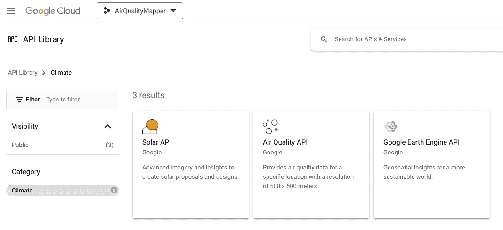
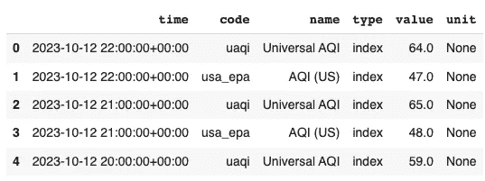
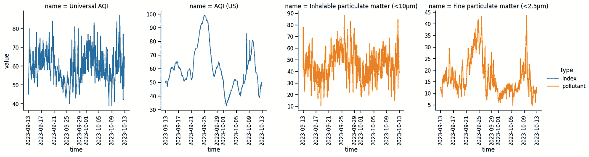
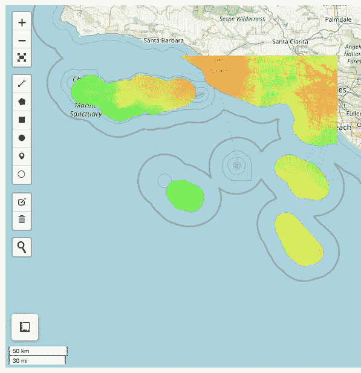
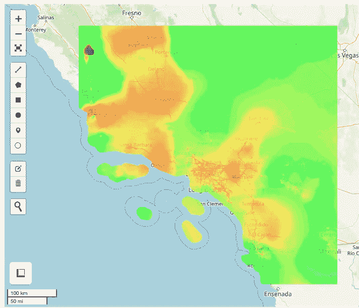
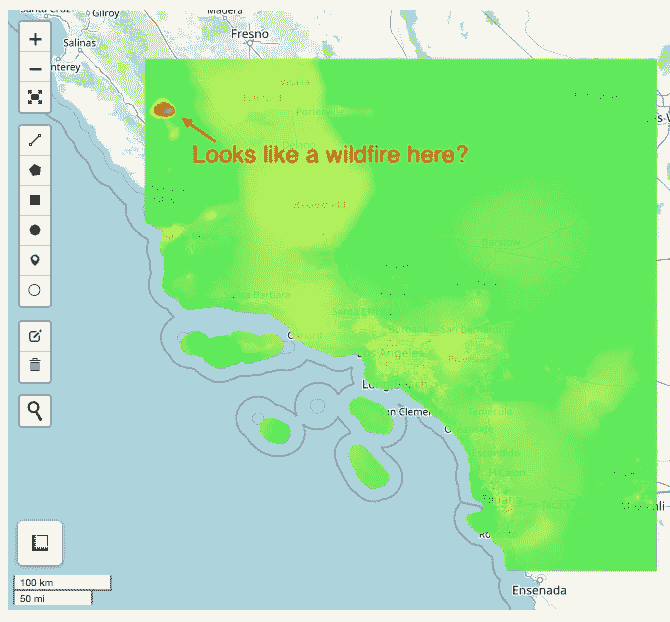

# 从 Google Maps 空气质量 API 获取空气污染数据的 Python 工具

> 原文：[`towardsdatascience.com/a-python-tool-for-fetching-air-pollution-data-from-google-maps-air-quality-apis-7cf58a7c63cb?source=collection_archive---------0-----------------------#2023-10-16`](https://towardsdatascience.com/a-python-tool-for-fetching-air-pollution-data-from-google-maps-air-quality-apis-7cf58a7c63cb?source=collection_archive---------0-----------------------#2023-10-16)

## 了解如何从全球各地获取丰富的实时空气质量数据

[](https://medium.com/@rmartinshort?source=post_page-----7cf58a7c63cb--------------------------------)[](https://towardsdatascience.com/?source=post_page-----7cf58a7c63cb--------------------------------) [Robert Martin-Short](https://medium.com/@rmartinshort?source=post_page-----7cf58a7c63cb--------------------------------)

·

[关注](https://medium.com/m/signin?actionUrl=https%3A%2F%2Fmedium.com%2F_%2Fsubscribe%2Fuser%2F83d38eb39498&operation=register&redirect=https%3A%2F%2Ftowardsdatascience.com%2Fa-python-tool-for-fetching-air-pollution-data-from-google-maps-air-quality-apis-7cf58a7c63cb&user=Robert+Martin-Short&userId=83d38eb39498&source=post_page-83d38eb39498----7cf58a7c63cb---------------------post_header-----------) 发表在 [Towards Data Science](https://towardsdatascience.com/?source=post_page-----7cf58a7c63cb--------------------------------) ·16 分钟阅读·2023 年 10 月 16 日[](https://medium.com/m/signin?actionUrl=https%3A%2F%2Fmedium.com%2F_%2Fvote%2Ftowards-data-science%2F7cf58a7c63cb&operation=register&redirect=https%3A%2F%2Ftowardsdatascience.com%2Fa-python-tool-for-fetching-air-pollution-data-from-google-maps-air-quality-apis-7cf58a7c63cb&user=Robert+Martin-Short&userId=83d38eb39498&source=-----7cf58a7c63cb---------------------clap_footer-----------)

--

[](https://medium.com/m/signin?actionUrl=https%3A%2F%2Fmedium.com%2F_%2Fbookmark%2Fp%2F7cf58a7c63cb&operation=register&redirect=https%3A%2F%2Ftowardsdatascience.com%2Fa-python-tool-for-fetching-air-pollution-data-from-google-maps-air-quality-apis-7cf58a7c63cb&source=-----7cf58a7c63cb---------------------bookmark_footer-----------)

> **本文详细说明了如何在 Python 中使用 Google Maps 空气质量 API 获取和探索实时空气污染数据、时间序列和地图。查看完整代码** [**这里**](https://github.com/rmartinshort/air_quality_mapper)

# 1\. 背景

2023 年 8 月，Google 宣布将空气质量服务添加到其映射 API 列表中。你可以在[这里](https://cloud.google.com/blog/products/maps-platform/introducing-air-quality-api-promoting-resilience-changing-climate)阅读更多关于此的信息。看来这些信息现在也可以通过 Google Maps 应用获得，不过通过 API 获得的数据要丰富得多。

根据公告，Google 正在结合来自不同分辨率的多种来源的信息——地面污染传感器、卫星数据、实时交通信息和来自数值模型的预测——以生成一个动态更新的空气质量数据集，涵盖 100 个国家，分辨率高达 500 米。这听起来像是一个非常有趣且潜在有用的数据集，适用于各种映射、医疗和规划应用！

当第一次读到这个消息时，我计划在一个“与数据对话”的应用中尝试它，利用从构建这个[旅行规划器](https://medium.com/towards-data-science/building-a-smart-travel-itinerary-suggester-with-langchain-google-maps-api-and-gradio-part-1-4175ff480b74)工具中学到的一些东西。也许是一个可以绘制你最喜欢城市空气污染浓度时间序列的系统，或者一个帮助人们规划本地徒步旅行以避免空气质量差的工具？

这里有[三个 API 工具](https://developers.google.com/maps/documentation/air-quality)可以提供帮助——一个“当前条件”服务，它提供给定位置的当前空气质量指数值和污染物浓度；一个“历史条件”服务，它提供相同的信息，但以小时为间隔，覆盖最多 30 天的历史数据；以及一个“热图”服务，它提供给定区域的当前条件的图像。

以前，我使用过优秀的`[googlemaps](https://github.com/googlemaps/google-maps-services-python)`包来调用 Python 中的 Google Maps API，但这些新 API 尚未得到支持。令人惊讶的是，除了官方文档，我几乎找不到使用这些新工具的人的示例，也没有预先存在的 Python 包来调用它们。如果有人知道其他信息，我会很高兴地接受纠正！

因此，我自己构建了一些快速工具，在这篇文章中，我们将详细介绍它们的工作原理及使用方法。我希望这对那些希望在 Python 中尝试这些新 API 并寻找起点的人有所帮助。这个项目的所有代码可以在[这里](https://github.com/rmartinshort/air_quality_mapper)找到，我可能会随着时间的推移扩展这个仓库，增加更多功能，并使用空气质量数据构建某种映射应用。

# 2\. 获取给定位置的当前空气质量

让我们开始吧！在本节中，我们将介绍如何使用 Google Maps 获取给定位置的空气质量数据。你首先需要一个 API 密钥，你可以通过你的 Google Cloud 账户生成。它们有一个[90 天的免费试用期](https://cloud.google.com/free/docs/free-cloud-features?_ga=2.153672123.-2071471501.1688189408)，之后你将为你使用的 API 服务付费。在开始进行大量调用之前，请确保启用“空气质量 API”，并了解定价政策！



Google Cloud API 库的截图，你可以从中激活空气质量 API。图片由作者生成。

我通常将 API 密钥存储在 `.env` 文件中，并通过类似下面的函数使用 `dotenv` 加载它。

```py
from dotenv import load_dotenv
from pathlib import Path

def load_secets():
    load_dotenv()
    env_path = Path(".") / ".env"
    load_dotenv(dotenv_path=env_path)

    google_maps_key = os.getenv("GOOGLE_MAPS_API_KEY")

    return {
        "GOOGLE_MAPS_API_KEY": google_maps_key,
    }
```

获取当前条件需要进行 POST 请求，详细信息请参见[此处](https://developers.google.com/maps/documentation/air-quality/current-conditions)。我们将借鉴[googlemaps](https://github.com/googlemaps/google-maps-services-python)包的设计，以一种可以概括的方法来实现这一点。首先，我们构建一个使用 `requests` 进行调用的客户端类。目标非常简单——我们想构建一个类似下面的 URL，并包含所有特定于用户查询的请求选项。

```py
https://airquality.googleapis.com/v1/currentConditions:lookup?key=YOUR_API_KEY
```

`Client` 类将我们的 API 密钥作为 `key` 传入，然后构建查询的 `request_url`。它接受作为 `params` 字典的请求选项，然后将它们放入 JSON 请求体中，这由 `self.session.post()` 调用处理。

```py
import requests
import io

class Client(object):
    DEFAULT_BASE_URL = "https://airquality.googleapis.com"

    def __init__(self, key):
        self.session = requests.Session()
        self.key = key

    def request_post(self, url, params):
        request_url = self.compose_url(url)
        request_header = self.compose_header()
        request_body = params

        response = self.session.post(
            request_url,
            headers=request_header,
            json=request_body,
        )

        return self.get_body(response)

    def compose_url(self, path):
        return self.DEFAULT_BASE_URL + path + "?" + "key=" + self.key

    @staticmethod
    def get_body(response):
        body = response.json()

        if "error" in body:
            return body["error"]

        return body

    @staticmethod
    def compose_header():
        return {
            "Content-Type": "application/json",
        }
```

现在我们可以创建一个函数，帮助用户为当前条件 API 组装有效的请求选项，然后使用这个 Client 类来发起请求。这也受到 googlemaps 包设计的启发。

```py
def current_conditions(
    client,
    location,
    include_local_AQI=True,
    include_health_suggestion=False,
    include_all_pollutants=True,
    include_additional_pollutant_info=False,
    include_dominent_pollutant_conc=True,
    language=None,
):
    """
    See documentation for this API here
    https://developers.google.com/maps/documentation/air-quality/reference/rest/v1/currentConditions/lookup
    """
    params = {}

    if isinstance(location, dict):
        params["location"] = location
    else:
        raise ValueError(
            "Location argument must be a dictionary containing latitude and longitude"
        )

    extra_computations = []
    if include_local_AQI:
        extra_computations.append("LOCAL_AQI")

    if include_health_suggestion:
        extra_computations.append("HEALTH_RECOMMENDATIONS")

    if include_additional_pollutant_info:
        extra_computations.append("POLLUTANT_ADDITIONAL_INFO")

    if include_all_pollutants:
        extra_computations.append("POLLUTANT_CONCENTRATION")

    if include_dominent_pollutant_conc:
        extra_computations.append("DOMINANT_POLLUTANT_CONCENTRATION")

    if language:
        params["language"] = language

    params["extraComputations"] = extra_computations

    return client.request_post("/v1/currentConditions:lookup", params)
```

这个 API 的选项相对简单。它需要一个包含你想要调查的点的经纬度的字典，并可以选择接受其他各种控制返回信息量的参数。让我们来看一下所有参数都设置为`True`时的效果。

```py
# set up client
client = Client(key=GOOGLE_MAPS_API_KEY)
# a location in Los Angeles, CA
location = {"longitude":-118.3,"latitude":34.1}
# a JSON response
current_conditions_data = current_conditions(
  client,
  location,
  include_health_suggestion=True,
  include_additional_pollutant_info=True
)
```

返回了很多有趣的信息！不仅有来自通用和美国 AQI 指数的空气质量指数值，还有主要污染物的浓度、每种污染物的描述，以及针对当前空气质量的整体健康建议。

```py
{'dateTime': '2023-10-12T05:00:00Z',
 'regionCode': 'us',
 'indexes': [{'code': 'uaqi',
   'displayName': 'Universal AQI',
   'aqi': 60,
   'aqiDisplay': '60',
   'color': {'red': 0.75686276, 'green': 0.90588236, 'blue': 0.09803922},
   'category': 'Good air quality',
   'dominantPollutant': 'pm10'},
  {'code': 'usa_epa',
   'displayName': 'AQI (US)',
   'aqi': 39,
   'aqiDisplay': '39',
   'color': {'green': 0.89411765},
   'category': 'Good air quality',
   'dominantPollutant': 'pm10'}],
 'pollutants': [{'code': 'co',
   'displayName': 'CO',
   'fullName': 'Carbon monoxide',
   'concentration': {'value': 292.61, 'units': 'PARTS_PER_BILLION'},
   'additionalInfo': {'sources': 'Typically originates from incomplete combustion of carbon fuels, such as that which occurs in car engines and power plants.',
    'effects': 'When inhaled, carbon monoxide can prevent the blood from carrying oxygen. Exposure may cause dizziness, nausea and headaches. Exposure to extreme concentrations can lead to loss of consciousness.'}},
  {'code': 'no2',
   'displayName': 'NO2',
   'fullName': 'Nitrogen dioxide',
   'concentration': {'value': 22.3, 'units': 'PARTS_PER_BILLION'},
   'additionalInfo': {'sources': 'Main sources are fuel burning processes, such as those used in industry and transportation.',
    'effects': 'Exposure may cause increased bronchial reactivity in patients with asthma, lung function decline in patients with Chronic Obstructive Pulmonary Disease (COPD), and increased risk of respiratory infections, especially in young children.'}},
  {'code': 'o3',
   'displayName': 'O3',
   'fullName': 'Ozone',
   'concentration': {'value': 24.17, 'units': 'PARTS_PER_BILLION'},
   'additionalInfo': {'sources': 'Ozone is created in a chemical reaction between atmospheric oxygen, nitrogen oxides, carbon monoxide and organic compounds, in the presence of sunlight.',
    'effects': 'Ozone can irritate the airways and cause coughing, a burning sensation, wheezing and shortness of breath. Additionally, ozone is one of the major components of photochemical smog.'}},
  {'code': 'pm10',
   'displayName': 'PM10',
   'fullName': 'Inhalable particulate matter (<10µm)',
   'concentration': {'value': 44.48, 'units': 'MICROGRAMS_PER_CUBIC_METER'},
   'additionalInfo': {'sources': 'Main sources are combustion processes (e.g. indoor heating, wildfires), mechanical processes (e.g. construction, mineral dust, agriculture) and biological particles (e.g. pollen, bacteria, mold).',
    'effects': 'Inhalable particles can penetrate into the lungs. Short term exposure can cause irritation of the airways, coughing, and aggravation of heart and lung diseases, expressed as difficulty breathing, heart attacks and even premature death.'}},
  {'code': 'pm25',
   'displayName': 'PM2.5',
   'fullName': 'Fine particulate matter (<2.5µm)',
   'concentration': {'value': 11.38, 'units': 'MICROGRAMS_PER_CUBIC_METER'},
   'additionalInfo': {'sources': 'Main sources are combustion processes (e.g. power plants, indoor heating, car exhausts, wildfires), mechanical processes (e.g. construction, mineral dust) and biological particles (e.g. bacteria, viruses).',
    'effects': 'Fine particles can penetrate into the lungs and bloodstream. Short term exposure can cause irritation of the airways, coughing and aggravation of heart and lung diseases, expressed as difficulty breathing, heart attacks and even premature death.'}},
  {'code': 'so2',
   'displayName': 'SO2',
   'fullName': 'Sulfur dioxide',
   'concentration': {'value': 0, 'units': 'PARTS_PER_BILLION'},
   'additionalInfo': {'sources': 'Main sources are burning processes of sulfur-containing fuel in industry, transportation and power plants.',
    'effects': 'Exposure causes irritation of the respiratory tract, coughing and generates local inflammatory reactions. These in turn, may cause aggravation of lung diseases, even with short term exposure.'}}],
 'healthRecommendations': {'generalPopulation': 'With this level of air quality, you have no limitations. Enjoy the outdoors!',
  'elderly': 'If you start to feel respiratory discomfort such as coughing or breathing difficulties, consider reducing the intensity of your outdoor activities. Try to limit the time you spend near busy roads, construction sites, open fires and other sources of smoke.',
  'lungDiseasePopulation': 'If you start to feel respiratory discomfort such as coughing or breathing difficulties, consider reducing the intensity of your outdoor activities. Try to limit the time you spend near busy roads, industrial emission stacks, open fires and other sources of smoke.',
  'heartDiseasePopulation': 'If you start to feel respiratory discomfort such as coughing or breathing difficulties, consider reducing the intensity of your outdoor activities. Try to limit the time you spend near busy roads, construction sites, industrial emission stacks, open fires and other sources of smoke.',
  'athletes': 'If you start to feel respiratory discomfort such as coughing or breathing difficulties, consider reducing the intensity of your outdoor activities. Try to limit the time you spend near busy roads, construction sites, industrial emission stacks, open fires and other sources of smoke.',
  'pregnantWomen': 'To keep you and your baby healthy, consider reducing the intensity of your outdoor activities. Try to limit the time you spend near busy roads, construction sites, open fires and other sources of smoke.',
  'children': 'If you start to feel respiratory discomfort such as coughing or breathing difficulties, consider reducing the intensity of your outdoor activities. Try to limit the time you spend near busy roads, construction sites, open fires and other sources of smoke.'}}
```

# 3\. 获取给定位置的空气质量时间序列

能够获取给定位置的这些 AQI 和污染物值的时间序列不是很好吗？这可能会揭示有趣的模式，例如污染物之间的相关性或由交通或天气因素引起的每日波动。

我们可以通过另一个 POST 请求到[historical conditions API](https://developers.google.com/maps/documentation/air-quality/history)，获取小时历史记录。这个过程与当前条件非常相似，唯一的主要区别是，由于结果可能很长，它们作为多个`pages`返回，需要一些额外的逻辑来处理。

修改`Client`的`request_post`方法以处理这个问题。

```py
 def request_post(self,url,params):

    request_url = self.compose_url(url)
    request_header = self.compose_header()
    request_body = params

    response = self.session.post(
      request_url,
      headers=request_header,
      json=request_body,
    )

    response_body = self.get_body(response)

    # put the first page in the response dictionary
    page = 1
    final_response = {
        "page_{}".format(page) : response_body
    }
    # fetch all the pages if needed 
    while "nextPageToken" in response_body:
      # call again with the next page's token
      request_body.update({
          "pageToken":response_body["nextPageToken"]
      })
      response = self.session.post(
          request_url,
          headers=request_header,
          json=request_body,
      )
      response_body = self.get_body(response)
      page += 1
      final_response["page_{}".format(page)] = response_body

    return final_response
```

这处理了`response_body`包含一个名为`nextPageToken`的字段的情况，该字段是已生成并准备好提取的下一页数据的 ID。如果存在该信息，我们只需使用一个名为`pageToken`的新参数再次调用 API，该参数指示到相关页面。我们在 while 循环中重复执行此操作，直到没有更多页面为止。因此，我们的`final_response`字典现在包含了由页码表示的另一层。对于调用`current_conditions`，将只有一页，但对于调用`historical_conditions`，可能会有多个页面。

处理完这些事项后，我们可以以与`current_conditions`非常相似的风格编写`historical_conditions`函数。

```py
def historical_conditions(
    client,
    location,
    specific_time=None,
    lag_time=None,
    specific_period=None,
    include_local_AQI=True,
    include_health_suggestion=False,
    include_all_pollutants=True,
    include_additional_pollutant_info=False,
    include_dominant_pollutant_conc=True,
    language=None,
):
    """
    See documentation for this API here https://developers.google.com/maps/documentation/air-quality/reference/rest/v1/history/lookup
    """
    params = {}

    if isinstance(location, dict):
        params["location"] = location
    else:
        raise ValueError(
            "Location argument must be a dictionary containing latitude and longitude"
        )

    if isinstance(specific_period, dict) and not specific_time and not lag_time:
        assert "startTime" in specific_period
        assert "endTime" in specific_period

        params["period"] = specific_period

    elif specific_time and not lag_time and not isinstance(specific_period, dict):
        # note that time must be in the "Zulu" format
        # e.g. datetime.datetime.strftime(datetime.datetime.now(),"%Y-%m-%dT%H:%M:%SZ")
        params["dateTime"] = specific_time

    # lag periods in hours
    elif lag_time and not specific_time and not isinstance(specific_period, dict):
        params["hours"] = lag_time

    else:
        raise ValueError(
            "Must provide specific_time, specific_period or lag_time arguments"
        )

    extra_computations = []
    if include_local_AQI:
        extra_computations.append("LOCAL_AQI")

    if include_health_suggestion:
        extra_computations.append("HEALTH_RECOMMENDATIONS")

    if include_additional_pollutant_info:
        extra_computations.append("POLLUTANT_ADDITIONAL_INFO")

    if include_all_pollutants:
        extra_computations.append("POLLUTANT_CONCENTRATION")

    if include_dominant_pollutant_conc:
        extra_computations.append("DOMINANT_POLLUTANT_CONCENTRATION")

    if language:
        params["language"] = language

    params["extraComputations"] = extra_computations
    # page size default set to 100 here
    params["pageSize"] = 100
    # page token will get filled in if needed by the request_post method
    params["pageToken"] = ""

    return client.request_post("/v1/history:lookup", params)
```

为了定义历史时期，API 可以接受一个`lag_time`（以小时为单位，最多 720 小时（30 天））。它也可以接受一个`specific_period`字典，其中定义了开始和结束时间，格式如上面的注释所述。最后，要获取单个小时的数据，可以提供由`specific_time`提供的时间戳。还要注意`pageSize`参数的使用，它控制每次调用 API 返回的时间点数量。这里的默认值是 100。

让我们试一下。

```py
# set up client
client = Client(key=GOOGLE_MAPS_API_KEY)
# a location in Los Angeles, CA
location = {"longitude":-118.3,"latitude":34.1}
# a JSON response
history_conditions_data = historical_conditions(
    client,
    location,
    lag_time=720
)
```

我们应该得到一个长而嵌套的 JSON 响应，其中包含过去 720 小时内每小时增量的 AQI 指数值和特定污染物值。有许多方法可以将其格式化为更适合可视化和分析的结构，下面的函数将把它转换为“长”格式的 pandas 数据框，这种格式与`seaborn`绘图非常匹配。

```py
from itertools import chain
import pandas as pd

def historical_conditions_to_df(response_dict):

  chained_pages = list(chain(*[response_dict[p]["hoursInfo"] for p in [*response_dict]]))

  all_indexes = []
  all_pollutants = []
  for i in range(len(chained_pages)):
    # need this check in case one of the timestamps is missing data, which can sometimes happen
    if "indexes" in chained_pages[i]:
      this_element = chained_pages[i]
      # fetch the time
      time = this_element["dateTime"]
      # fetch all the index values and add metadata
      all_indexes += [(time , x["code"],x["displayName"],"index",x["aqi"],None) for x in this_element['indexes']]
      # fetch all the pollutant values and add metadata
      all_pollutants += [(time , x["code"],x["fullName"],"pollutant",x["concentration"]["value"],x["concentration"]["units"]) for x in this_element['pollutants']]

  all_results = all_indexes + all_pollutants
  # generate "long format" dataframe
  res = pd.DataFrame(all_results,columns=["time","code","name","type","value","unit"])
  res["time"]=pd.to_datetime(res["time"])
  return res
```

在`historical_conditions`的输出上运行这个操作将生成一个数据框，其列格式化以便进行易于分析。

```py
df = historical_conditions_to_df(history_conditions_data)
```



准备好绘图的历史 AQI 数据的示例数据框。

现在我们可以在`seaborn`或其他可视化工具中绘制结果。

```py
import seaborn as sns
g = sns.relplot(
    x="time",
    y="value",
    data=df[df["code"].isin(["uaqi","usa_epa","pm25","pm10"])],
    kind="line",
    col="name",
    col_wrap=4,
    hue="type",
    height=4,
    facet_kws={'sharey': False, 'sharex': False}
)
g.set_xticklabels(rotation=90)
```



该位置在 LA 的 30 天期间的通用 AQI，美国 AQI，pm25 和 pm10 值。由作者生成的图像。

这已经非常有趣了！显然，污染物时间序列中存在几个周期性现象，并且美国 AQI 与 pm25 和 pm10 浓度密切相关，这是预期中的结果。我对 Google 提供的 Universal AQI 并不太熟悉，所以无法解释为什么它与 pm25 和 pm10 显示出反相关。较小的 UAQI 是否意味着更好的空气质量？尽管进行了搜索，我仍未找到一个好的答案。

# **4\. 获取空气质量热图瓦片**

现在是 Google Maps 空气质量 API 的最终使用案例——生成热图瓦片。关于这一点的[文档](https://developers.google.com/maps/documentation/air-quality/reference/rest/v1/mapTypes.heatmapTiles/lookupHeatmapTile)较为稀疏，这很遗憾，因为这些瓦片是可视化当前空气质量的强大工具，尤其是与`Folium`地图结合使用时。

我们通过 GET 请求获取这些瓦片，这涉及到构建以下格式的 URL，其中瓦片的位置由 `zoom`、`x` 和 `y` 指定。

```py
GET https://airquality.googleapis.com/v1/mapTypes/{mapType}/heatmapTiles/{zoom}/{x}/{y}
```

`zoom`、`x` 和 `y` 的含义是什么？我们可以通过了解 Google Maps 如何将纬度和经度坐标转换为“瓦片坐标”来回答这个问题，这在[这里](https://developers.google.com/maps/documentation/javascript/coordinates)有详细描述。本质上，Google Maps 将图像存储在每个单元格为 256 x 256 像素的网格中，而单元格的实际尺寸是缩放级别的函数。当我们调用 API 时，需要指定要从哪个网格中绘制——这是由缩放级别决定的——以及在网格上的哪个位置绘制——这是由`x` 和 `y` 瓦片坐标决定的。返回的是一个字节数组，可以由 Python Imaging Library (PIL) 或类似的图像处理包读取。

在上述格式中形成 `url` 后，我们可以向 `Client` 类添加一些方法，以便获取相应的图像。

```py
 def request_get(self,url):

    request_url = self.compose_url(url)
    response = self.session.get(request_url)

    # for images coming from the heatmap tiles service
    return self.get_image(response)

  @staticmethod
  def get_image(response):

    if response.status_code == 200:
      image_content = response.content
      # note use of Image from PIL here
      # needs from PIL import Image
      image = Image.open(io.BytesIO(image_content))
      return image
    else:
      print("GET request for image returned an error")
      return None
```

这很好，但我们真正需要的是将一组经纬度坐标转换为瓦片坐标的能力。文档解释了如何做——我们首先将坐标转换为[墨卡托投影](https://en.wikipedia.org/wiki/Mercator_projection)，然后使用指定的缩放级别将其转换为“像素坐标”。最后，我们将其转换为瓦片坐标。为了处理所有这些转换，我们可以使用下面的 `TileHelper` 类。

```py
import math
import numpy as np

class TileHelper(object):

  def __init__(self, tile_size=256):

    self.tile_size = tile_size

  def location_to_tile_xy(self,location,zoom_level=4):

    # Based on function here
    # https://developers.google.com/maps/documentation/javascript/examples/map-coordinates#maps_map_coordinates-javascript

    lat = location["latitude"]
    lon = location["longitude"]

    world_coordinate = self._project(lat,lon)
    scale = 1 << zoom_level

    pixel_coord = (math.floor(world_coordinate[0]*scale), math.floor(world_coordinate[1]*scale))
    tile_coord = (math.floor(world_coordinate[0]*scale/self.tile_size),math.floor(world_coordinate[1]*scale/self.tile_size))

    return world_coordinate, pixel_coord, tile_coord

  def tile_to_bounding_box(self,tx,ty,zoom_level):

    # see https://developers.google.com/maps/documentation/javascript/coordinates
    # for details
    box_north = self._tiletolat(ty,zoom_level)
    # tile numbers advance towards the south
    box_south = self._tiletolat(ty+1,zoom_level)
    box_west = self._tiletolon(tx,zoom_level)
    # time numbers advance towards the east
    box_east = self._tiletolon(tx+1,zoom_level)

    # (latmin, latmax, lonmin, lonmax)
    return (box_south, box_north, box_west, box_east)

  @staticmethod
  def _tiletolon(x,zoom):
    return x / math.pow(2.0,zoom) * 360.0 - 180.0

  @staticmethod
  def _tiletolat(y,zoom):
    n = math.pi - (2.0 * math.pi * y)/math.pow(2.0,zoom)
    return math.atan(math.sinh(n))*(180.0/math.pi)

  def _project(self,lat,lon):

    siny = math.sin(lat*math.pi/180.0)
    siny = min(max(siny,-0.9999), 0.9999)

    return (self.tile_size*(0.5 + lon/360), self.tile_size*(0.5 - math.log((1 + siny) / (1 - siny)) / (4 * math.pi)))

  @staticmethod
  def find_nearest_corner(location,bounds):

    corner_lat_idx = np.argmin([
        np.abs(bounds[0]-location["latitude"]),
        np.abs(bounds[1]-location["latitude"])
        ])

    corner_lon_idx = np.argmin([
        np.abs(bounds[2]-location["longitude"]),
        np.abs(bounds[3]-location["longitude"])
        ])

    if (corner_lat_idx == 0) and (corner_lon_idx == 0):
      # closests is latmin, lonmin
      direction = "southwest"
    elif (corner_lat_idx == 0) and (corner_lon_idx == 1):
      direction = "southeast"
    elif (corner_lat_idx == 1) and (corner_lon_idx == 0):
      direction = "northwest"
    else:
      direction = "northeast"

    corner_coords = (bounds[corner_lat_idx],bounds[corner_lon_idx+2])
    return corner_coords, direction

  @staticmethod
  def get_ajoining_tiles(tx,ty,direction):

    if direction == "southwest":
      return [(tx-1,ty),(tx-1,ty+1),(tx,ty+1)]
    elif direction == "southeast":
      return [(tx+1,ty),(tx+1,ty-1),(tx,ty-1)]
    elif direction == "northwest":
      return [(tx-1,ty-1),(tx-1,ty),(tx,ty-1)]
    else:
      return [(tx+1,ty-1),(tx+1,ty),(tx,ty-1)]
```

我们可以看到 `location_to_tile_xy` 函数接收一个位置字典和缩放级别，并返回可以找到该点的瓦片。另一个有用的函数是 `tile_to_bounding_box`，它会找到指定网格单元的边界坐标。如果我们要对单元格进行地理定位并将其绘制在地图上，我们需要这个函数。

让我们看看`air_quality_tile`函数如何工作，该函数将接收我们的`client`、`location`和一个表示我们要提取的瓦片类型的字符串。我们还需要指定一个缩放级别，这在开始时可能很难选择，需要一些试验和错误。我们稍后将讨论`get_adjoining_tiles`参数。

```py
def air_quality_tile(
    client,
    location,
    pollutant="UAQI_INDIGO_PERSIAN",
    zoom=4,
    get_adjoining_tiles = True

):

  # see https://developers.google.com/maps/documentation/air-quality/reference/rest/v1/mapTypes.heatmapTiles/lookupHeatmapTile

  assert pollutant in [
      "UAQI_INDIGO_PERSIAN",
      "UAQI_RED_GREEN",
      "PM25_INDIGO_PERSIAN",
      "GBR_DEFRA",
      "DEU_UBA",
      "CAN_EC",
      "FRA_ATMO",
      "US_AQI"
  ]

  # contains useful methods for dealing the tile coordinates
  helper = TileHelper()

  # get the tile that the location is in
  world_coordinate, pixel_coord, tile_coord = helper.location_to_tile_xy(location,zoom_level=zoom)

  # get the bounding box of the tile
  bounding_box = helper.tile_to_bounding_box(tx=tile_coord[0],ty=tile_coord[1],zoom_level=zoom)

  if get_adjoining_tiles:
    nearest_corner, nearest_corner_direction = helper.find_nearest_corner(location, bounding_box)
    adjoining_tiles = helper.get_ajoining_tiles(tile_coord[0],tile_coord[1],nearest_corner_direction)
  else:
    adjoining_tiles = []

  tiles = []
  #get all the adjoining tiles, plus the one in question
  for tile in adjoining_tiles + [tile_coord]:

    bounding_box = helper.tile_to_bounding_box(tx=tile[0],ty=tile[1],zoom_level=zoom)
    image_response = client.request_get(
        "/v1/mapTypes/" + pollutant + "/heatmapTiles/" + str(zoom) + '/' + str(tile[0]) + '/' + str(tile[1])
    )

    # convert the PIL image to numpy
    try:
      image_response = np.array(image_response)
    except:
      image_response = None

    tiles.append({
        "bounds":bounding_box,
        "image":image_response
    })

  return tiles 
```

从阅读代码中，我们可以看出工作流程如下：首先，找到感兴趣位置的瓦片坐标。这指定了我们要提取的网格单元。然后，找到该网格单元的边界坐标。如果我们要提取周围的瓦片，找到边界框的最近角落，然后使用该角落计算三个相邻网格单元的瓦片坐标。然后调用 API，并将每个瓦片返回为带有相应边界框的图像。

我们可以按标准方式运行，如下所示：

```py
client = Client(key=GOOGLE_MAPS_API_KEY)
location = {"longitude":-118.3,"latitude":34.1}
zoom = 7
tiles = air_quality_tile(
    client,
    location,
    pollutant="UAQI_INDIGO_PERSIAN",
    zoom=zoom,
    get_adjoining_tiles=False)
```

然后用 folium 绘制一个可缩放的地图！请注意，我在这里使用的是 leafmap，因为此包可以生成与 gradio 兼容的 Folium 地图，gradio 是一个强大的工具，用于生成 Python 应用程序的简单用户界面。有关示例，请查看[这篇文章](http://owardsdatascience.com/building-a-smart-travel-itinerary-suggester-with-langchain-google-maps-api-and-gradio-part-3-90dc7be627fb)。

```py
import leafmap.foliumap as leafmap
import folium

lat = location["latitude"]
lon = location["longitude"]

map = leafmap.Map(location=[lat, lon], tiles="OpenStreetMap", zoom_start=zoom)

for tile in tiles:
  latmin, latmax, lonmin, lonmax = tile["bounds"]
  AQ_image = tile["image"]
  folium.raster_layers.ImageOverlay(
    image=AQ_image,
    bounds=[[latmin, lonmin], [latmax, lonmax]],
    opacity=0.7
  ).add_to(map)
```

也许令人失望的是，在此缩放级别下包含我们位置的瓦片大部分是海洋，尽管看到空气污染绘制在详细地图上仍然不错。如果你放大，可以看到道路交通信息被用来指示城市区域的空气质量信号。



在 Folium 地图上绘制空气质量热力图瓦片。图像由作者生成。

设置`get_adjoining_tiles=True`为我们提供了一个更漂亮的地图，因为它在该缩放级别下提取了三个最近的、不重叠的瓦片。在我们的情况下，这有助于使地图更加美观。



当我们还提取相邻瓦片时，会产生更有趣的结果。请注意，这里的颜色显示的是通用 AQI 指数。图像由作者生成。

我个人更喜欢当`pollutant=US_AQI`时生成的图像，但还有几种不同的选项。不幸的是，API 未返回颜色尺度，尽管可以使用图像中的像素值和对颜色含义的了解生成一个。



上面的相同瓦片根据美国 AQI 着色。此地图生成于 2023 年 10 月 12 日，根据此工具[`www.frontlinewildfire.com/california-wildfire-map/`](https://www.frontlinewildfire.com/california-wildfire-map/)的描述，中央加州的亮红色区域似乎是位于科阿林加附近山丘的处方火。图像由作者生成。

# 结论

感谢你阅读到最后！在这里，我们探讨了如何使用 Google Maps 空气质量 API 来在 Python 中提供结果，这些结果可以用于各种有趣的应用程序。未来，我希望能继续更新关于 [air_quality_mapper](https://github.com/rmartinshort/air_quality_mapper) 工具的文章，因为它还在不断发展，但我希望这里讨论的脚本本身能对你有用。像往常一样，任何进一步发展的建议都将受到非常欢迎！
