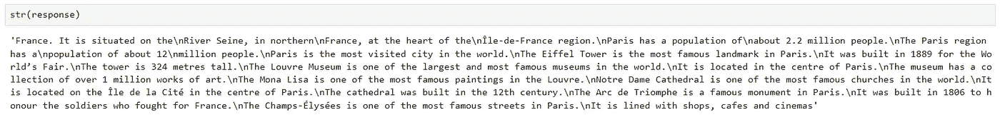
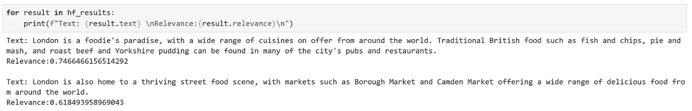
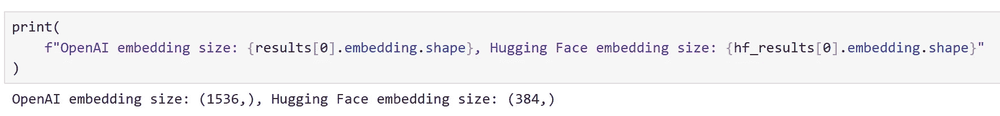

# 《Pythonista 的语义内核入门》

> 原文：[`towardsdatascience.com/a-pythonistas-intro-to-semantic-kernel-af5a1a39564d?source=collection_archive---------0-----------------------#2023-09-02`](https://towardsdatascience.com/a-pythonistas-intro-to-semantic-kernel-af5a1a39564d?source=collection_archive---------0-----------------------#2023-09-02)

[](https://medium.com/@chris.p.hughes10?source=post_page-----af5a1a39564d--------------------------------)[](https://towardsdatascience.com/?source=post_page-----af5a1a39564d--------------------------------) [Chris Hughes](https://medium.com/@chris.p.hughes10?source=post_page-----af5a1a39564d--------------------------------)

·

[关注](https://medium.com/m/signin?actionUrl=https%3A%2F%2Fmedium.com%2F_%2Fsubscribe%2Fuser%2Ff13df9df155e&operation=register&redirect=https%3A%2F%2Ftowardsdatascience.com%2Fa-pythonistas-intro-to-semantic-kernel-af5a1a39564d&user=Chris+Hughes&userId=f13df9df155e&source=post_page-f13df9df155e----af5a1a39564d---------------------post_header-----------) 发表在 [Towards Data Science](https://towardsdatascience.com/?source=post_page-----af5a1a39564d--------------------------------) ·30 分钟阅读·2023 年 9 月 2 日[](https://medium.com/m/signin?actionUrl=https%3A%2F%2Fmedium.com%2F_%2Fvote%2Ftowards-data-science%2Faf5a1a39564d&operation=register&redirect=https%3A%2F%2Ftowardsdatascience.com%2Fa-pythonistas-intro-to-semantic-kernel-af5a1a39564d&user=Chris+Hughes&userId=f13df9df155e&source=-----af5a1a39564d---------------------clap_footer-----------)

--

[](https://medium.com/m/signin?actionUrl=https%3A%2F%2Fmedium.com%2F_%2Fbookmark%2Fp%2Faf5a1a39564d&operation=register&redirect=https%3A%2F%2Ftowardsdatascience.com%2Fa-pythonistas-intro-to-semantic-kernel-af5a1a39564d&source=-----af5a1a39564d---------------------bookmark_footer-----------)

自从发布了[ChatGPT](https://openai.com/blog/chatgpt)以来，大型语言模型（LLMs）在行业和媒体中受到了极大的关注；导致了几乎在所有可以想到的背景下利用 LLMs 的前所未有的需求。

[语义内核](https://github.com/microsoft/semantic-kernel)是一个开源 SDK，最初由微软开发，用于支持 Microsoft 365 Copilot 和 Bing 等产品，旨在简化将 LLM 集成到应用程序中的过程。它使用户能够利用 LLM 根据自然语言查询和命令来编排工作流程，通过将这些模型与提供附加功能的外部服务连接，使模型能够利用这些服务完成任务。

由于它是针对 Microsoft 生态系统创建的，因此目前可用的许多复杂示例都是用 C# 编写的，关注 Python SDK 的资源较少。在这篇博客文章中，我将展示如何使用 Python 入门 Semantic Kernel，介绍关键组件，并探索如何利用这些组件执行各种任务。

在这篇文章中，我们将涵盖以下内容：

+   内核

+   连接器

+   提示函数

    - 创建自定义连接器

+   使用聊天服务

    - 制作一个简单的聊天机器人

+   内存

    - 使用文本嵌入服务

    - 将内存集成到上下文中

+   插件

    - 使用现成插件

    - 创建自定义插件

    - 链式调用多个插件

+   使用规划器编排工作流

**免责声明：** 由于 Semantic Kernel 和所有与 LLM 相关的内容一样，发展非常迅速。因此，接口可能会随着时间的推移稍有变化；我会尽量保持这篇文章的更新。

尽管我在 Microsoft 工作，但我并没有被要求或获得任何补偿来推广 Semantic Kernel。在 [行业解决方案工程 (ISE)](https://playbook.microsoft.com/code-with-engineering/ISE/) 中，我们以根据情况和所服务的客户选择我们认为最佳的工具为荣。在我们选择不使用 Microsoft 产品的情况下，我们会向产品团队提供详细的反馈，说明原因以及我们认为缺失或可以改进的地方；这种反馈循环通常会导致 Microsoft 产品更好地满足我们的需求。

在这里，我选择推广 Semantic Kernel，因为尽管有一些小瑕疵，我相信它显示了很大的潜力，并且我更喜欢 Semantic Kernel 在设计选择上的表现，相比于我所探索的其他一些解决方案。

撰写时使用的软件包包括：

```py
dependencies:
  - python=3.10.1.0
  - pip:
    - semantic-kernel==0.9.3b1
    - timm==0.9.5
    - transformers==4.38.2
    - sentence-transformers==2.2.2
    - curated-transformers==1.1.0
```

***简而言之：*** *如果你只是想看看一些可以直接使用的工作代码，所有复制此文章所需的代码都可以在这里的笔记本中找到* [*这里。*](https://gist.github.com/Chris-hughes10/6dacd205f1da3cc3aec4fc45e57fb0b6)

# 致谢

我想感谢我的同事 [Karol Zak](https://medium.com/u/c92a3c46e12c?source=post_page-----af5a1a39564d--------------------------------)，感谢他与我合作探索如何在我们的用例中充分利用 Semantic Kernel，并提供了一些启发本文中示例的代码！


Semantic Kernel 组件概述。图片来源：[`learn.microsoft.com/en-us/semantic-kernel/media/kernel-flow.png`](https://learn.microsoft.com/en-us/semantic-kernel/media/kernel-flow.png)

现在，让我们从库的核心组件开始。

# 内核

*核心： “对象或系统的核心、中心或本质。” —* [*维基词典*](https://en.wiktionary.org/wiki/kernel)

语义内核中的一个关键概念就是内核本身，它是我们用来协调基于 LLM 的工作流的主要对象。最初，内核的功能非常有限；它的所有功能主要由我们将要连接的外部组件提供。然后，内核作为一个处理引擎，通过调用适当的组件来完成给定的任务。

我们可以按照下面的示例创建一个内核：

```py
import semantic_kernel as sk

kernel = sk.Kernel()
```

# 连接器

为了使我们的内核有用，我们需要连接一个或多个 AI 模型，这使我们能够利用内核来理解和生成自然语言；这通过*连接器*来完成。语义内核提供了开箱即用的连接器，使得从不同来源添加 AI 模型变得简单，例如 [OpenAI](https://platform.openai.com/overview)、[Azure OpenAI](https://azure.microsoft.com/en-us/products/ai-services/openai-service) 和 [Hugging Face](https://huggingface.co/docs/hub/index)。这些模型随后用于向内核提供*服务*。

在撰写本文时，支持以下服务：

+   **文本生成服务**：用于生成自然语言

+   **聊天服务**：用于创建对话体验

+   **文本嵌入生成服务**：用于将自然语言编码为嵌入

每种类型的服务可以同时支持来自不同来源的多个模型，这使得可以根据任务和用户的偏好在不同模型之间切换。如果没有指定特定的服务或模型，内核将默认为定义的第一个服务和模型。

我们可以使用以下属性查看所有当前注册的服务：


正如预期的那样，我们当前没有任何连接的服务！让我们来改变这一点。

在这里，我将开始访问一个 [GPT3.5-turbo 模型](https://learn.microsoft.com/en-us/azure/ai-services/openai/concepts/models#gpt-35)，这是我通过 [Azure OpenAI 服务](http://127.0.0.1:8800/files/notebooks/(https%3A/azure.microsoft.com/en-us/products/ai-services/openai-service)?_xsrf=2%7Cdf00fee6%7Cc6c752f68f76d91ba394976c9852cc67%7C1693063310) 在我的 [Azure 订阅](https://azure.microsoft.com/en-gb/free/search/?ef_id=_k_2411806e795914439019e49fb1bde4ba_k_&OCID=AIDcmm3bvqzxp1_SEM__k_2411806e795914439019e49fb1bde4ba_k_&msclkid=2411806e795914439019e49fb1bde4ba) 中部署的。

由于这个模型可以用于文本生成和聊天，我将同时注册这两项服务。

```py
from semantic_kernel.connectors.ai.open_ai import (
    AzureChatCompletion,
    AzureTextCompletion,
)

kernel.add_service(
    service=AzureTextCompletion(
        service_id="azure_gpt35_text_completion",
        deployment_name=OPENAI_DEPLOYMENT_NAME,
        endpoint=OPENAI_ENDPOINT,
        api_key=OPENAI_API_KEY
    ),
)

gpt35_chat_service = AzureChatCompletion(
    service_id="azure_gpt35_chat_completion",
    deployment_name=OPENAI_DEPLOYMENT_NAME,
    endpoint=OPENAI_ENDPOINT,
    api_key=OPENAI_API_KEY,
)

kernel.add_service(gpt35_chat_service)
```

我们现在可以看到，聊天服务已注册为文本生成和聊天生成服务。


要使用非 Azure OpenAI API，我们唯一需要更改的是使用`OpenAITextCompletion`和`OpenAIChatCompletion`连接器，而不是我们的 Azure 类。如果你没有访问 OpenAI 模型的权限，也不用担心，我们稍后会看看如何连接到开源模型；模型的选择不会影响后续步骤。

要在注册服务后检索服务，我们可以使用内核上的以下方法。


现在我们已经注册了一些服务，让我们探索一下如何与它们交互！

# 提示函数

通过语义内核与 LLM 交互的方式是创建一个*提示函数*。提示函数期望自然语言输入，并使用 LLM 来解释所要求的内容，然后采取相应的行动以返回合适的响应。例如，提示函数可用于文本生成、摘要、情感分析和问答等任务。

在语义内核中，语义功能由两个组件组成：

+   **提示模板**：将发送给 LLM 的自然语言查询或命令

+   **执行配置**：包含提示功能的设置和选项，例如应该使用的服务、期望的参数以及功能描述。

最简单的入门方法是使用内核的`create_function_from_prompt`方法，该方法接受提示和执行配置，以及一些标识符以帮助跟踪内核中的函数。

为了说明这一点，让我们创建一个简单的提示：

```py
prompt = """
{{$input}} is the capital city of
""" 
```

在这里，我们使用了`{{$}}`语法来表示将注入到提示中的参数。虽然我们将在整个帖子中看到更多的示例，但有关模板语法的全面指南可以在[文档中](https://learn.microsoft.com/en-us/semantic-kernel/prompt-engineering/prompt-template-syntax)找到。

接下来，我们需要创建一个执行配置。如果我们知道要使用哪种服务来执行我们的函数，可以导入相应的配置类并创建其实例，如下所示。

```py
from semantic_kernel.connectors.ai.open_ai import OpenAITextPromptExecutionSettings

execution_config = OpenAITextPromptExecutionSettings(service_id = "azure_gpt35_text_completion",
                                                    max_tokens=100,
                                                    temperature=0,
                                                    top_p=0.0)
```

虽然这样做有效，但它将我们的函数与某种类型的服务耦合，限制了我们的灵活性。另一种方法是直接从我们打算使用的服务中检索相应的配置类，如下所示。


这样，我们可以在运行时选择我们希望使用的服务，并自动加载合适的配置对象。让我们使用这种方法来创建我们的执行配置。

```py
target_service_id = "azure_gpt35_text_completion"

execution_config = kernel.get_service(target_service_id).instantiate_prompt_execution_settings(
        service_id=target_service_id,
        max_tokens=100,
        temperature=0,
        seed=42
    )
```

现在，我们可以创建我们的函数了！

```py
generate_capital_city_text = kernel.create_function_from_prompt(
    prompt=prompt,
    plugin_name="Generate_Capital_City_Completion",
    function_name="generate_city_completion",
    execution_settings=execution_config
)
```

现在，我们可以使用内核的`invoke`方法来调用我们的函数。由于我们连接的许多服务可能会调用外部 API，`invoke`是一个异步方法，基于[Asyncio](https://docs.python.org/3/library/asyncio.html)。这使我们能够同时执行多个外部服务调用，而无需为每个调用等待响应。

```py
response = await kernel.invoke(generate_capital_city_text, input="Paris")
```

响应对象包含有关我们的函数调用的有价值信息，例如所使用的参数；如果一切按预期工作，我们可以使用对象上的`str`构造函数来访问结果。



在这里，我们可以看到我们的函数已经成功工作！

# 使用本地模型

除了使用 API 背后的模型外，我们还可以使用内核来协调对本地模型的调用。为了说明这一点，让我们注册另一个文本完成服务，并创建一个配置，使我们能够指定我们希望使用新的服务。对于我们的第二个完成服务，我们使用来自[Hugging Face transformers library](https://huggingface.co/docs/transformers/index)的模型。为此，我们使用`HuggingFaceTextCompletion`连接器。

在这里，由于我们将本地运行模型，我选择了[OPT-350m](https://huggingface.co/facebook/opt-350m)，这是一个较旧的模型，旨在大致匹配 GPT-3 的性能，应该能够在大多数硬件上快速轻松地运行。

```py
from semantic_kernel.connectors.ai.hugging_face import HuggingFaceTextCompletion

hf_model = HuggingFaceTextCompletion(service_id="hf_text_completion", ai_model_id="facebook/opt-350m", task="text-generation")
kernel.add_service(hf_model)
```

现在，让我们创建我们的配置对象。我们可以以类似的方式进行，但这次需要传递与我们 Hugging Face 服务相关的`service_id`。

```py
target_service_id = "hf_text_completion"

execution_config = kernel.get_service(target_service_id).instantiate_prompt_execution_settings(
        service_id=target_service_id,
        max_tokens=100,
        temperature=0,
        seed=42
    )
```

我们现在可以创建并执行我们的函数，就像我们之前看到的那样。

```py
hf_complete = kernel.create_function_from_prompt(
    prompt=prompt,
    plugin_name="Generate_Capital_City_Completion",
    function_name="generate_city_completion_opt",
    execution_settings=execution_config
)

response = await kernel.invoke(hf_complete, input='Paris')
```


好的，生成似乎已经成功，但可以说效果不如 GPT-3.5 所提供的响应。这并不意外，因为这是一个较旧的模型！有趣的是，我们可以看到，在达到最大令牌限制之前，它开始以类似的模式回答关于柏林的问题；这种行为在处理文本完成模型时并不意外。

# 创建自定义连接器

现在我们已经看到如何创建语义函数并指定我们希望我们的函数使用哪个服务。然而，直到这一点为止，我们使用的所有服务都依赖于现成的连接器。在某些情况下，我们可能希望使用来自不同库的模型，而不是当前支持的模型，这时我们需要一个自定义连接器。让我们来看看如何实现这一点。

例如，我们可以使用来自[curated transformers](https://github.com/explosion/curated-transformers)库的变换器模型。

要创建自定义连接器，我们需要继承`TextCompletionClientBase`，它作为我们模型的一个轻量级封装。下面提供了一个简单的示例。

```py
from typing import Any, Dict, List, Optional, Union

import torch
from curated_transformers.generation import (AutoGenerator,
                                             SampleGeneratorConfig)
from semantic_kernel.connectors.ai.prompt_execution_settings import \
    PromptExecutionSettings
from semantic_kernel.connectors.ai.text_completion_client_base import \
    TextCompletionClientBase

class CuratedTransformersPromptExecutionSettings(PromptExecutionSettings):
    temperature: float = 0.0
    top_p: float = 1.0

    def prepare_settings_dict(self, **kwargs) -> Dict[str, Any]:
        settings = {
            "temperature": self.temperature,
            "top_p": self.top_p,
        }
        settings.update(kwargs)
        return settings

class CuratedTransformersCompletion(TextCompletionClientBase):
    device: Any
    generator: Any

    def __init__(
        self,
        service_id: str,
        model_name: str,
        device: Optional[int] = -1,
    ) -> None:
        """
        Use a curated transformer model for text completion.

        Arguments:
            model_name {str}
            device_idx {Optional[int]} -- Device to run the model on, -1 for CPU, 0+ for GPU.

        Note that this model will be downloaded from the Hugging Face model hub.
        """
        device = (
            "cuda:" + str(device)
            if device >= 0 and torch.cuda.is_available()
            else "cpu"
        )
        generator = AutoGenerator.from_hf_hub(
            name=model_name, device=torch.device(device)
        )
        super().__init__(
            service_id=service_id,
            ai_model_id=model_name,
            device=device,
            generator=generator,
        )

    async def complete(
        self, prompt: str, settings: CuratedTransformersPromptExecutionSettings
    ) -> Union[str, List[str]]:
        generator_config = SampleGeneratorConfig(**settings.prepare_settings_dict())
        try:
            with torch.no_grad():
                result = self.generator([prompt], generator_config)

            return result[0]

        except Exception as e:
            raise ValueError("CuratedTransformer completion failed", e)

    async def complete_stream(self, prompt: str, request_settings):
        raise NotImplementedError(
            "Streaming is not supported for CuratedTransformersCompletion."
        )

    def get_prompt_execution_settings_from_settings(
        self, settings: CuratedTransformersPromptExecutionSettings
    ) -> CuratedTransformersPromptExecutionSettings:
        return settings
```

现在，我们可以注册我们的连接器并创建一个语义函数，如前所示。这里，我使用了[Falcon-7B 模型](https://huggingface.co/tiiuae/falcon-7b)，这需要一个 GPU 才能在合理的时间内运行。在这里，我使用了[英伟达 A100](https://learn.microsoft.com/en-us/azure/virtual-machines/nda100-v4-series)在 Azure 虚拟机上运行，因为在本地运行太慢了。

```py
kernel.add_service(
        CuratedTransformersCompletion(
            service_id="custom",
            model_name="tiiuae/falcon-7b",
            device=-1,
        )
    )

complete = kernel.create_function_from_prompt(
        prompt=prompt,
        plugin_name="Generate_Capital_City_Completion",
        function_name="generate_city_completion_curated",
        prompt_execution_settings=CuratedTransformersPromptExecutionSettings(
            service_id="custom", temperature=0.0, top_p=0.0
        ),
    )

print(await kernel.invoke(complete, input="Paris"))
```


再次，我们可以看到生成的内容有效，但在回答了我们的问题后很快陷入了重复。

这很可能是由于我们选择的模型。通常，自回归变换器模型被训练以预测大量文本中的下一个单词；从本质上讲，使其成为强大的自动补全机器！在这里，它似乎试图‘完成’我们的问题，这导致它继续生成文本，这对我们并没有帮助。

# 使用聊天服务

一些 LLM 模型经过了额外的训练，使其在交互中更有用。OpenAI 的[InstructGPT](https://arxiv.org/abs/2203.02155)论文详细介绍了这一过程的一个例子。

从高层次来看，这通常涉及添加一个或多个监督微调步骤，在这些步骤中，模型不是在随机的非结构化文本上训练，而是在策划的任务示例上进行训练，例如问答和总结；这些模型通常被称为*指令调优*或*聊天*模型。

由于我们已经观察到基础 LLM 可以生成比我们需要的更多的文本，因此让我们调查聊天模型是否表现不同。要使用我们的聊天模型，我们需要更新配置以指定适当的服务并创建一个新函数；在我们的情况下，我们将使用`azure_gpt35_chat_completion`。


```py
generate_capital_city_chat = kernel.create_function_from_prompt(
        prompt=prompt,
        plugin_name="Generate_Capital_City",
        function_name="capital_city_chat_2",
        prompt_execution_settings=kernel.get_service(target_service_id).instantiate_prompt_execution_settings(
            service_id=target_service_id, temperature=0.0, top_p=0.0, seed=42
        ),
    )

print(await kernel.invoke(generate_capital_city_chat, input="Paris"))
```


很好，我们可以看到聊天模型给出了一个更简洁的回答！

之前，由于我们使用的是文本补全模型，我们将提示格式化为模型要完成的句子。然而，经过指令调优的模型*应该*能够理解问题，因此我们可能能够调整提示，使其更加灵活。让我们看看如何调整我们的提示，以便与模型进行互动，就像它是一个设计来提供有关我们可能喜欢访问的地方的信息的聊天机器人。

首先，让我们调整我们的函数配置，使提示更加通用。

```py
chatbot = kernel.create_function_from_prompt(
        prompt="{{$input}}",
        plugin_name="Chatbot",
        function_name="chatbot",
        prompt_execution_settings=kernel.get_service(target_service_id).instantiate_prompt_execution_settings(
            service_id=target_service_id, temperature=0.0, top_p=0.0, seed=42
        ),
    )
```

在这里，我们可以看到我们仅传递了用户输入，因此我们必须将输入表达为问题。让我们尝试一下。

```py
async def chat(user_input):
    print(await kernel.invoke(generate_capital_city_chat, input=user_input))
```


很好，这似乎有效。让我们尝试提出一个后续问题。


我们可以看到模型提供了一个非常通用的回答，这完全没有考虑到我们之前的问题。这是可以预期的，因为模型收到的提示是`"What are some interesting things to do there?"`，我们没有提供“那里”指的是哪里！ 

让我们看看如何在接下来的部分中扩展我们的方法，制作一个简单的聊天机器人。

# 制作一个简单的聊天机器人

现在我们已经了解了如何使用聊天服务，让我们探索如何创建一个简单的聊天机器人。

我们的聊天机器人应该能够做三件事：

+   知道它的目的并告知我们

+   理解当前对话的上下文

+   回复我们的提问

让我们调整我们的提示以反映这一点。

```py
chatbot_prompt = """
"You are a chatbot to provide information about different cities and countries. 
 For other questions not related to places, you should politely decline to answer the question, stating your purpose"
 +++++

{{$history}}
User: {{$input}}
ChatBot: """
```

注意我们添加了变量`history`，它将用于向聊天机器人提供以前的上下文。虽然这是一种相当幼稚的方法，因为长时间的对话会很快导致提示达到模型的最大上下文长度，但对于我们的目的来说应该有效。

到目前为止，我们只使用了使用单个变量的提示。要使用多个变量，我们需要调整我们的配置，如下所示，通过创建一个`PromptTemplateConfig`；它定义了我们期望的输入。

```py
from semantic_kernel.prompt_template.input_variable import InputVariable

execution_config = kernel.get_service(target_service_id).instantiate_prompt_execution_settings(
        service_id=target_service_id,
        max_tokens=500,
        temperature=0,
        seed=42
    )

prompt_template_config = sk.PromptTemplateConfig(
    template=chatbot_prompt,
    name="chat",
    template_format="semantic-kernel",
    input_variables=[
        InputVariable(name="input", description="The user input", is_required=True),
        InputVariable(name="history", description="The conversation history", is_required=True),
    ],
    execution_settings=execution_config,
)
```

现在，让我们使用这个更新后的配置和提示来创建我们的聊天机器人

```py
chatbot = kernel.create_function_from_prompt(
    function_name="chatbot_with_history",
    plugin_name="chatPlugin",
    prompt_template_config=prompt_template_config,
)
```

为了跟踪要包含在提示中的历史记录，我们可以使用`ChatHistory`对象。让我们创建一个新的实例。

```py
from semantic_kernel.contents.chat_history import ChatHistory

chat_history = ChatHistory()
```

此外，为了将多个参数传递给我们的提示，我们可以使用`KernelArguments`，这样我们只需将一个参数传递给`invoke`；这个参数包含所有的参数。

我们可以通过创建一个简单的聊天功能来实现这一点，以在每次互动后更新我们的历史记录。

```py
from pprint import pprint

async def chat(input_text, verbose=True):
    # Save new message in the context variables
    context = KernelArguments(user_input=input_text, history=chat_history)

    if verbose:
        # print the full prompt before each interaction
        print("Prompt:")
        print("-----")
        # inject the variables into our prompt
        print(await chatbot.prompt_template.render(kernel, context))
        print("-----")

    # Process the user message and get an answer
    answer = await kernel.invoke(chatbot, context)

    # Show the response
    pprint(f"ChatBot: {answer}")

    # Append the new interaction to the chat history
    chat_history.add_user_message(input_text)
    chat_history.add_assistant_message(str(answer))
```

让我们试试看！


在这里，我们可以看到这满足了我们的要求！

检查我们的提示，我们可以看到历史记录被渲染成一个可以包含额外元数据的格式。虽然这可能是一个有用的实现细节，但我们很可能不希望我们的提示以这种方式格式化！

当使用如语义内核这样的库时，能够准确验证传递给模型的内容非常重要，因为提示的书写和格式化方式对结果有很大影响。

大多数语言模型，例如 OpenAI API，不接受单个提示作为输入，而是更喜欢格式化为消息列表的输入；在用户和模型之间交替。我们可以检查我们的提示将如何被拆分成消息。


在这里，我们可以看到与聊天历史相关的所有格式都已被移除，消息看起来符合我们的预期。

# 记忆

在与我们的聊天机器人互动时，使体验感觉像有用互动的关键因素之一是聊天机器人能够保留我们之前问题的上下文。我们通过让聊天机器人访问*记忆*，利用`ChatHistory`来处理这一点。

尽管这对于我们简单的用例效果很好，但我们所有的对话历史都存储在系统的 RAM 中，并未持久化；一旦我们关闭系统，这些数据将永远消失。对于更智能的应用程序，能够构建和持久化短期和长期记忆以供模型访问是很有用的。

此外，在我们的示例中，我们将*所有*之前的互动内容都输入到我们的提示中。由于模型通常具有固定大小的上下文窗口——这决定了我们的提示可以有多长——如果我们开始进行长时间的对话，这将很快崩溃。避免这种情况的一种方法是将记忆存储为独立的“块”，并仅将我们认为可能相关的信息加载到提示中。

语义内核提供了一些关于如何将记忆融入应用程序的功能，所以让我们探索一下如何利用这些功能。

例如，让我们扩展我们的聊天机器人，使其能够访问存储在记忆中的一些信息。

首先，我们需要一些可能与我们的聊天机器人相关的信息。虽然我们可以手动研究和整理相关信息，但让模型为我们生成信息会更快！让我们让模型生成一些关于伦敦市的事实。我们可以按如下方式进行：

```py
response = chatbot(
    """Please provide a comprehensive overview of things to do in London. Structure your answer in 5 paragraphs, based on:
- overview
- landmarks
- history
- culture
- food

Each paragraph should be 100 tokens, do not add titles such as `Overview:` or `Food:` to the paragraphs in your response.

Do not acknowledge the question, with a statement like "Certainly, here's a comprehensive overview of things to do in London". 
Do not provide a closing comment.
"""
)
```


现在我们有了一些文本，为了让模型只访问它需要的部分，让我们将其划分成几个块。语义内核提供了一些功能来实现这一点，在它的`text_chunker`模块中。我们可以按如下方式使用它：

```py
from semantic_kernel.text import text_chunker as tc

chunks = tc.split_plaintext_paragraph([london_info], max_tokens=100)
```


我们可以看到文本被分割成了 8 个块。根据文本内容，我们需要调整每个块的最大标记数。

# 使用文本嵌入服务

现在我们已经对数据进行了块化处理，我们需要创建每个块的表示，以便能够计算文本之间的相关性；我们可以通过将文本表示为嵌入来实现这一点。

为了生成嵌入，我们需要将文本嵌入服务添加到我们的内核中。类似于之前的情况，根据基础模型的来源，有各种连接器可以使用。

首先，让我们使用一个`[text-embedding-ada-002](https://learn.microsoft.com/en-us/azure/ai-services/openai/concepts/models#embeddings-models)` [模型](https://learn.microsoft.com/en-us/azure/ai-services/openai/concepts/models#embeddings-models)，该模型在 Azure OpenAI 服务中部署。这个模型由 OpenAI 训练，更多关于这个模型的信息可以在他们的[发布博客文章](https://openai.com/blog/new-and-improved-embedding-model)中找到。

```py
from semantic_kernel.connectors.ai.open_ai import AzureTextEmbedding

embedding_service =  AzureTextEmbedding(
        service_id="azure_openai_embedding",
        deployment_name=OPENAI_EMBEDDING_DEPLOYMENT_NAME,
        endpoint=OPENAI_ENDPOINT,
        api_key=OPENAI_API_KEY,
    )

kernel.add_service(embedding_service)
```

现在我们可以访问生成嵌入的模型，我们需要一个地方来存储这些嵌入。Semantic Kernel 提供了一个 MemoryStore 的概念，它是各种持久性提供程序的接口。

对于生产系统，我们可能会希望使用数据库进行持久化。为了简化我们的示例，我们将使用内存存储。让我们创建一个内存中的记忆存储实例。

```py
memory_store = sk.memory.VolatileMemoryStore()
```

虽然我们使用了内存中的记忆存储来简化我们的示例，但在构建更复杂的系统时，我们可能会希望使用数据库进行持久化。Semantic Kernel 提供了与流行存储解决方案的连接器，如[CosmosDB](https://learn.microsoft.com/en-us/azure/cosmos-db/introduction)、Redis、[Postgres](https://www.postgresql.org/)等。由于记忆存储具有通用接口，因此唯一需要更改的只是修改使用的连接器，这使得在提供程序之间切换变得容易。

现在我们已经定义了我们的记忆存储，我们需要生成嵌入。Semantic Kernel 提供了*语义记忆*数据结构来帮助实现这一点；它将记忆存储与可以生成嵌入的服务关联起来。在这里，我们将使用`SemanticTextMemory`，它将使我们能够嵌入和检索我们的文档片段。

```py
from semantic_kernel.memory.semantic_text_memory import SemanticTextMemory

memory = SemanticTextMemory(storage=memory_store, embeddings_generator=embedding_service)
```

我们现在可以按照如下方式将信息保存到我们的记忆存储中。

```py
for i, chunk in enumerate(chunks):
    await memory.save_information(
        collection="London", id="chunk" + str(i), text=chunk
    )
```

在这里，我们创建了一个新的集合，用于分组相似的文档。

我们现在可以以以下方式查询此集合：

```py
results = await memory.search(
    "London", "what food should I eat in London?", limit=2
)
```


查看结果，我们可以看到返回了相关信息；这反映在高相关性评分上。

然而，这其实很简单，因为我们有直接相关的信息，使用了非常相似的语言。让我们尝试一个更微妙的查询。

```py
results = await memory.search(
    "London", "Where can I eat non-british food in London?", limit=2
)
```


在这里，我们可以看到我们得到了完全相同的结果。然而，由于我们的第二个结果明确提到了‘来自世界各地的食物’，我认为这是更好的匹配。这突显了语义搜索方法的一些潜在局限性。

# 使用开源模型

出于兴趣，让我们看看开源模型在这个上下文中与我们的 OpenAI 服务的比较。我们可以注册一个[Hugging Face 句子变换模型](https://huggingface.co/sentence-transformers/all-MiniLM-L6-v2)来实现这一点，如下所示：

```py
from semantic_kernel.connectors.ai.hugging_face import HuggingFaceTextEmbedding

hf_embedding_service = HuggingFaceTextEmbedding(
    service_id="hf_embedding_service",
    ai_model_id="sentence-transformers/all-MiniLM-L6-v2",
    device=-1
)
hf_memory = SemanticTextMemory(storage=sk.memory.VolatileMemoryStore(), embeddings_generator=hf_embedding_service)
```

我们现在可以以与之前相同的方式进行查询。

```py
for i, chunk in enumerate(chunks):
    await kernel.memory.save_information_async(
        "hf_London", id="chunk" + str(i), text=chunk
    )

hf_results = await hf_memory.search(
    "hf_London", "what food should I eat in London", limit=2, min_relevance_score=0
)
```



```py
hf_results = await hf_memory.search(
    "hf_London",
    "Where can I eat non-british food in London?",
    limit=2,
    min_relevance_score=0,
)
```


我们可以看到，我们返回了相同的片段，但相关性评分不同。我们还可以观察到不同模型生成的嵌入的维度差异。



# 将记忆集成到上下文中

在我们之前的示例中，我们看到虽然可以基于嵌入搜索识别大致相关的信息，但对于更细微的查询，我们没有得到最相关的结果。让我们探索是否可以改进这一点。

我们可以采取的一种方法是将相关信息提供给我们的聊天机器人，然后让模型决定哪些部分最相关。让我们创建一个提示，指示模型根据提供的上下文回答问题，并注册一个提示功能。

```py
prompt_with_context = """
 Use the following pieces of context to answer the users question.
 This is the only information that you should use to answer the question, do not reference information outside of this context.
 If the information required to answer the question is not provided in the context, just say that "I don't know", don't try to make up an answer.
 ----------------
 Context: {{$context}}
 ----------------
 User question: {{$question}}
 ----------------
 Answer:
"""

execution_config = kernel.get_service(target_service_id).instantiate_prompt_execution_settings(
        service_id=target_service_id,
        max_tokens=500,
        temperature=0,
        seed=42
    )

prompt_template_config = sk.PromptTemplateConfig(
    template=prompt_with_context,
    name="chat",
    template_format="semantic-kernel",
    input_variables=[
        InputVariable(name="question", description="The user input", is_required=True),
        InputVariable(name="context", description="The conversation history", is_required=True),
    ],
    execution_settings=execution_config,
)

chatbot_with_context = kernel.create_function_from_prompt(
    function_name="chatbot_with_memory_context",
    plugin_name="chatPluginWithContext",
    prompt_template_config=prompt_template_config,
)
```

现在，我们可以使用这个功能来回答我们更细微的问题。首先，我们创建一个上下文对象，并将问题添加到其中。

```py
question = "Where can I eat non-british food in London?"
```

接下来，我们可以手动执行嵌入搜索，并将检索到的信息添加到我们的上下文中。

```py
results = await hf_memory.search("hf_London", question, limit=2)
```

我们创建一个上下文对象，并将问题添加到其中。

```py
context = KernelArguments(question=question, context="\n".join([result.text for result in results]))
```

最后，我们可以执行我们的功能。

```py
answer = await kernel.invoke(chatbot_with_context, context)
```


这一次，我们看到我们的答案引用了我们寻找的信息，并提供了更好的答案！

# 插件

在语义内核中，插件是一组可以加载到内核中以暴露给 AI 应用程序和服务的功能。插件中的功能可以由内核协调以完成任务。

[文档](https://learn.microsoft.com/en-us/semantic-kernel/ai-orchestration/plugins)将插件描述为语义内核的“构建块”，可以将它们链接在一起以创建复杂的工作流程；由于插件遵循 OpenAI 插件规范，因此为 OpenAI 服务、必应和 Microsoft 365 创建的插件可以与语义内核一起使用。

语义内核 [提供了几种开箱即用的插件](https://learn.microsoft.com/en-us/semantic-kernel/ai-orchestration/out-of-the-box-plugins?tabs=python)，包括：

+   **ConversationSummaryPlugin**：用于总结对话

+   **HttpPlugin**：用于调用 API

+   **TextMemoryPlugin**：用于在内存中存储和检索文本

+   **TimePlugin**：用于获取时间和任何其他时间信息

让我们先探索如何使用预定义的插件，然后再调查如何创建自定义插件。

## 使用开箱即用的插件

语义内核中包含的一个插件是`TextMemoryPlugin`，它提供了从内存中保存和检索信息的功能。让我们看看如何使用它来简化我们之前的示例，即从内存中填充提示上下文。

首先，我们必须导入我们的插件，如下所示。


在这里，我们可以看到这个插件包含两个语义功能，`recall` 和 `save`。

现在，让我们修改我们的提示：

```py
prompt_with_context_plugin = """
 Use the following pieces of context to answer the users question.
 This is the only information that you should use to answer the question, do not reference information outside of this context.
 If the information required to answer the question is not provided in the context, just say that "I don't know", don't try to make up an answer.
 ----------------
 Context: {{recall $question}}
 ----------------
 User question: {{$question}}
 ----------------
 Answer:
"""
```

我们可以看到，要使用`recall`功能，我们可以在提示中引用它。现在，让我们创建一个配置并注册一个功能。

```py
execution_config = kernel.get_service(target_service_id).instantiate_prompt_execution_settings(
        service_id=target_service_id,
        max_tokens=500,
        temperature=0,
        seed=42
    )

prompt_template_config = sk.PromptTemplateConfig(
    template=prompt_with_context_plugin,
    name="chat",
    template_format="semantic-kernel",
    input_variables=[
        InputVariable(name="question", description="The user input", is_required=True),
        InputVariable(name="context", description="The conversation history", is_required=True),
    ],
    execution_settings=execution_config,
)

chatbot_with_context_plugin = kernel.create_function_from_prompt(
    function_name="chatbot_with_context_plugin",
    plugin_name="chatPluginWithContextPlugin",
    prompt_template_config=prompt_template_config,
)
```

在我们的手动示例中，我们能够控制返回结果的数量和搜索的集合。使用`TextMemoryPlugin`时，我们可以通过将这些添加到`KernelArguments`来设置它们。让我们尝试一下我们的函数。

```py
context = KernelArguments(question="Where can I eat non-british food in London?", collection='London', relevance=0.2, limit=2)

answer = await kernel.invoke(chatbot_with_context_plugin, context)
```


我们可以看到这与我们的手动方法是等效的。

## 创建自定义插件

现在我们了解了如何创建语义函数以及如何使用插件，我们拥有了一切所需来开始制作自己的插件！

插件可以包含两种类型的函数：

+   **提示函数**：使用自然语言执行操作

+   **本地函数**：使用 Python 代码执行操作

这些可以在一个插件中结合使用。

是否使用提示函数或本地函数取决于你所执行的任务。对于涉及理解或生成语言的任务，提示函数显然是首选。然而，对于更确定性的任务，如执行数学运算、下载数据或访问时间，本地函数更为合适。

让我们探讨如何创建每种类型。首先，让我们创建一个文件夹来存储我们的插件。

```py
from pathlib import Path

plugins_path = Path("Plugins")
plugins_path.mkdir(exist_ok=True)
```

**创建一个诗歌生成器插件**

对于我们的示例，让我们创建一个生成诗歌的插件；为此，使用提示函数似乎是自然的选择。我们可以在目录中为此插件创建一个文件夹。

```py
poem_gen_plugin_path = plugins_path / "PoemGeneratorPlugin"
poem_gen_plugin_path.mkdir(exist_ok=True)
```

回顾一下，插件只是函数的集合，而我们正在创建一个语义函数，下一部分应该很熟悉。关键的不同点在于，我们将不再在线定义提示和配置，而是为这些创建单独的文件，以便更容易加载。

让我们为我们的语义函数创建一个文件夹，命名为`write_poem`。

```py
poem_sc_path = poem_gen_plugin_path / "write_poem"
poem_sc_path.mkdir(exist_ok=True)
```

接下来，我们创建我们的提示，保存为`skprompt.txt`。


现在，让我们创建我们的配置并将其存储在 json 文件中。

虽然在配置中设置有意义的描述总是一个好习惯，但当我们定义插件时，这变得更加重要；插件应提供清晰的描述，说明它们的行为、输入输出以及副作用。原因在于，这是由我们的内核呈现的接口，如果我们希望使用 LLM 来协调任务，它需要能够理解插件的功能及如何调用它，以便选择适当的函数。

```py
config_path = poem_sc_path / "config.json"
```

```py
%%writefile {config_path}

{
  "schema": 1,
  "description": "A poem generator, that writes a short poem based on user input",
  "execution_settings": {
    "azure_gpt35_chat_completion": {
      "max_tokens": 512,
      "temperature": 0.8,
      "top_p": 0.0,
      "presence_penalty": 0.0,
      "frequency_penalty": 0.0,
      "seed": 42
    }
  },
  "input_variables": [
    {
      "name": "input",
      "description": "The topic that the poem should be written about",
      "default": "",
      "is_required": true
    }
  ]

}
```

现在，我们可以导入我们的插件：

```py
poem_gen_plugin = kernel.import_plugin_from_prompt_directory(
    plugins_path, "PoemGeneratorPlugin"
)
```

检查我们的插件，我们可以看到它暴露了我们的`write_poem`语义函数。


我们可以像以前一样使用内核调用我们的函数。

```py
result = await kernel.invoke(poem_gen_plugin["write_poem"], KernelArguments(input="Munich"))
```


或者，我们可以在另一个语义函数中使用它：

```py
prompt = """
{{PoemGeneratorPlugin.write_poem $input}}
"""

target_service_id = "azure_gpt35_chat_completion"

execution_config = kernel.get_service(target_service_id).instantiate_prompt_execution_settings(
        service_id=target_service_id,
        max_tokens=500,
        temperature=0.8,
        seed=42
    )

prompt_template_config = sk.PromptTemplateConfig(
    template=prompt,
    name="chat",
    template_format="semantic-kernel",
    input_variables=[
        InputVariable(name="input", description="The user input", is_required=True),
    ],
    execution_settings=execution_config,
)

write_poem_wrapper = kernel.create_function_from_prompt(
    function_name="poem_gen_wrapper",
    plugin_name="poemWrapper",
    prompt_template_config=prompt_template_config,
)

result = await kernel.invoke(write_poem_wrapper, KernelArguments(input="Munich"))
```


**创建一个图像分类器插件**

现在我们已经看到了如何在插件中使用提示函数，让我们来看看如何使用原生函数。

现在，让我们创建一个插件，它接受一个图片网址，然后下载并分类图片。再一次，让我们为我们的新插件创建一个文件夹。

```py
image_classifier_plugin_path = plugins_path / "ImageClassifierPlugin"
image_classifier_plugin_path.mkdir(exist_ok=True)

download_image_sc_path = image_classifier_plugin_path / "download_image.py"
download_image_sc_path.mkdir(exist_ok=True)
```

现在，我们可以创建我们的 Python 模块。在模块内部，我们可以非常灵活。在这里，我们创建了一个具有两个方法的类，关键步骤是使用`kernel_function`装饰器来指定哪些方法应该作为插件的一部分被暴露。

对于我们的输入，我们使用了`Annotated`类型提示来提供我们参数的描述。更多信息可以在[文档中](https://learn.microsoft.com/en-us/semantic-kernel/ai-orchestration/native-functions?tabs=python)找到。

```py
import requests
from PIL import Image
import timm
from timm.data.imagenet_info import ImageNetInfo

from typing import Annotated
from semantic_kernel.functions.kernel_function_decorator import kernel_function

class ImageClassifierPlugin:
    def __init__(self):
        self.model = timm.create_model("convnext_tiny.in12k_ft_in1k", pretrained=True)
        self.model.eval()
        data_config = timm.data.resolve_model_data_config(self.model)
        self.transforms = timm.data.create_transform(**data_config, is_training=False)
        self.imagenet_info = ImageNetInfo()

    @kernel_function(
        description="Takes a url as an input and classifies the image",
        name="classify_image"
    )
    def classify_image(self, input: Annotated[str, "The url of the image to classify"]) -> str:
        image = self.download_image(input)
        pred = self.model(self.transforms(image)[None])
        return self.imagenet_info.index_to_description(pred.argmax())

    def download_image(self, url):
        return Image.open(requests.get(url, stream=True).raw).convert("RGB")
```

在这个例子中，我使用了出色的[Pytorch Image Models](https://github.com/huggingface/pytorch-image-models)库来提供我们的分类器。有关该库如何工作的更多信息，请查看这篇博客文章。

现在，我们可以如下面所示简单地导入我们的插件。

```py
image_classifier = ImageClassifierPlugin()

classify_plugin = kernel.import_plugin_from_object(image_classifier, plugin_name="classify_image")
```

检查我们的插件，我们可以看到只有我们装饰过的函数被暴露出来。


我们可以使用[来自 Pixabay 的猫的图片](https://pixabay.com/photos/cat-kitten-pet-striped-young-1192026/)来验证我们的插件是否有效。


```py
url = "https://cdn.pixabay.com/photo/2016/02/10/16/37/cat-1192026_1280.jpg"
response = await kernel.invoke(classify_plugin["classify_image"], KernelArguments(input=url))
```


通过手动调用我们的函数，我们可以看到我们的图片已被正确分类！和之前一样，我们也可以直接从提示中引用这个函数。然而，既然我们已经演示过了，让我们在下一部分尝试一些稍微不同的东西。

## 链接多个插件

现在我们已经定义了各种函数，包括内联函数和插件，让我们看看如何协调一个调用多个函数的工作流程。

如果我们希望独立执行多个函数，这很简单；我们只需将函数列表传递给`invoke`，如下所示。

```py
answers = await kernel.invoke([classify_plugin["classify_image"], poem_gen_plugin["write_poem"]], arguments=KernelArguments(input=url))
```


在这里，我们可以看到相同的输入被用于每个函数。我们本可以在`KernelArguments`中定义不同命名的参数，但如果多个函数的参数具有相同的名称，这会变得困难。顺便提一下，我们的诗歌生成器似乎做得很棒，考虑到它只提供了一个网址！

更有趣的情况是，当我们希望将一个函数的输出用作另一个函数的输入时，让我们来深入探讨一下。

为了提供对函数调用方式的更精细控制，内核使我们能够定义处理程序，在其中我们可以注入自定义行为：

+   `add_function_invoking_handler`：用于注册在函数调用之前调用的处理程序

+   `add_function_invoked_handler`：用于注册在函数调用后被调用的处理程序

由于我们希望将输入更新为下一个函数的输出，可以定义一个简短的函数来完成此操作，并注册它，以便在每次函数调用后调用。让我们看看如何做到这一点。

首先，我们需要定义一个函数，该函数接受内核和`FunctionInvokedEventArgs`实例，并更新我们的参数。

```py
from semantic_kernel.events.function_invoked_event_args import FunctionInvokedEventArgs

def store_results(kernel, invoked_function_info: FunctionInvokedEventArgs):
    previous_step_result = str(invoked_function_info.function_result)
    invoked_function_info.arguments['input'] = previous_step_result
    invoked_function_info.updated_arguments = True
```

接下来，我们可以将其注册到我们的内核中。

```py
kernel.add_function_invoked_handler(store_results)
```

现在，我们可以像之前一样调用我们的函数。

```py
answers = await kernel.invoke([classify_plugin["classify_image"], poem_gen_plugin["write_poem"]], arguments=KernelArguments(input=url))
```


我们可以看到，通过顺序使用两个插件，我们已经对图像进行了分类并为其写了一首诗！

# 使用规划器协调工作流

到此为止，我们已经深入探讨了语义函数，理解了函数如何被分组并用作插件的一部分，并且已经看到如何手动将插件链在一起。现在，让我们探索如何使用 LLMs 创建和协调工作流。为此，Semantic Kernel 提供了*Planner*对象，它可以动态创建函数链以尝试实现目标。

规划器是一个类，它接受用户提示和内核，并利用内核的服务创建执行任务的计划，使用内核中可用的函数和插件。由于插件是这些计划的主要构建块，因此规划器在很大程度上依赖于提供的描述；如果插件和函数没有明确的描述，规划器将无法正确使用它们。此外，由于规划器可以以各种不同的方式组合函数，因此确保仅暴露我们希望规划器使用的函数是很重要的。

由于规划器依赖于模型来生成计划，因此可能会引入错误；这些错误通常发生在规划器未能正确理解如何使用函数时。在这些情况下，我发现提供明确的指令——如描述输入和输出，并说明输入是否为必需——可以取得更好的结果。此外，使用指令调优模型比使用基础模型效果更佳；基础文本补全模型往往会虚构不存在的函数或生成多个计划。尽管存在这些限制，当一切正常工作时，规划器可以非常强大！

让我们通过探讨是否可以创建一个基于图像 url 的诗歌计划，使用我们之前创建的插件，来探索如何做到这一点。由于我们定义了许多不再需要的函数，让我们创建一个新的内核，以便控制暴露的函数。

```py
kernel = sk.Kernel()
```

为了创建我们的计划，让我们使用我们的 OpenAI 聊天服务。

```py
service_id = "azure_gpt35_chat_completion"

kernel.add_service(
    service=AzureChatCompletion(
        service_id=service_id,
        deployment_name=OPENAI_DEPLOYMENT_NAME, 
        endpoint=OPENAI_ENDPOINT, 
        api_key=OPENAI_API_KEY
    ),
)
```

现在，让我们导入我们的插件。

```py
classify_plugin = kernel.import_plugin_from_object(
    ImageClassifierPlugin(), plugin_name="classify_image"
)
poem_gen_plugin = kernel.import_plugin_from_prompt_directory(
    plugins_path, "PoemGeneratorPlugin"
)
```

我们可以看到我们的内核可以访问哪些函数，如下所示。


现在，让我们导入我们的规划器对象。

```py
from semantic_kernel.planners.basic_planner import BasicPlanner

planner = BasicPlanner(service_id)
```

要使用我们的规划工具，我们只需要一个提示。通常，我们需要根据生成的计划进行调整。在这里，我尽可能明确所需的输入。

```py
ask = f"""
I would like you to write poem about what is contained in this image with this url: {url}. This url should be used as input.

"""
```

接下来，我们可以使用我们的规划工具来制定解决任务的计划。

```py
plan = await planner.create_plan(ask, kernel)
```


检查我们的计划，我们可以看到模型已经正确识别了输入，以及正确的函数使用方法！

最后，只剩下执行我们的计划了。

```py
poem = await planner.execute_plan(plan, kernel)
```


哇，成功了！对于一个被训练来预测下一个词的模型来说，这真是相当强大的！

作为一个警告，在制作这个示例时，我很幸运地第一次生成的计划就有效。然而，我们依赖于模型正确解读我们的指令，并理解可用的工具；更不用说 LLM 可能会出现虚假信息，甚至可能会梦到不存在的新功能！对我个人来说，在生产系统中，我会觉得手动创建工作流程执行会更舒服，而不是依赖 LLM！随着技术的不断进步，尤其是当前的速度，希望这个建议会变得过时！

# 结论

希望这为您提供了对 Semantic Kernel 的良好介绍，并激励您探索将其用于自己的用例。

*重复此帖子所需的所有代码可以在[这里](https://gist.github.com/Chris-hughes10/6dacd205f1da3cc3aec4fc45e57fb0b6)*找到。*

[*Chris Hughes*](https://www.linkedin.com/in/chris-hughes1/) *在 LinkedIn 上*

# 参考资料

+   [介绍 ChatGPT (openai.com)](https://openai.com/blog/chatgpt)

+   [microsoft/semantic-kernel: 将最前沿的 LLM 技术快速、轻松地集成到您的应用程序中 (github.com)](https://github.com/microsoft/semantic-kernel)

+   [我们是谁 — Microsoft 解决方案手册](https://playbook.microsoft.com/code-with-engineering/ISE/)

+   [内核 — 维基词典，免费的词典](https://en.wiktionary.org/wiki/kernel)

+   [概述 — OpenAI API](https://platform.openai.com/overview)

+   [Azure OpenAI 服务 — 高级语言模型 | Microsoft Azure](https://azure.microsoft.com/en-us/products/ai-services/openai-service)

+   [Hugging Face Hub 文档](https://huggingface.co/docs/hub/index)

+   [Azure OpenAI 服务模型 — Azure OpenAI | Microsoft Learn](https://learn.microsoft.com/en-us/azure/ai-services/openai/concepts/models#gpt-35)

+   [今天创建您的 Azure 免费帐户 | Microsoft Azure](https://azure.microsoft.com/en-gb/free/search/?ef_id=_k_2411806e795914439019e49fb1bde4ba_k_&OCID=AIDcmm3bvqzxp1_SEM__k_2411806e795914439019e49fb1bde4ba_k_&msclkid=2411806e795914439019e49fb1bde4ba)

+   [如何在 Semantic Kernel 中使用提示模板语言 | Microsoft Learn](https://learn.microsoft.com/en-us/semantic-kernel/prompt-engineering/prompt-template-syntax)

+   [asyncio — 异步 I/O — Python 3.11.5 文档](https://docs.python.org/3/library/asyncio.html)

+   [🤗 Transformers (huggingface.co)](https://huggingface.co/docs/transformers/index)

+   [gpt2 · Hugging Face](https://huggingface.co/gpt2)

+   [explosion/curated-transformers: 🤖 PyTorch 精选 Transformer 模型及其可组合组件 (github.com)](https://github.com/explosion/curated-transformers)

+   [tiiuae/falcon-7b · Hugging Face](https://huggingface.co/tiiuae/falcon-7b)

+   [ND A100 v4 系列 — Azure 虚拟机 | Microsoft Learn](https://learn.microsoft.com/en-us/azure/virtual-machines/nda100-v4-series)

+   [[2203.02155] 训练语言模型以根据人类反馈执行指令 (arxiv.org)](https://arxiv.org/abs/2203.02155)

+   [Azure OpenAI 服务模型 — Azure OpenAI | Microsoft Learn](https://learn.microsoft.com/en-us/azure/ai-services/openai/concepts/models#embeddings-models)

+   [新改进的嵌入模型 (openai.com)](https://openai.com/blog/new-and-improved-embedding-model)

+   [介绍 — Azure Cosmos DB | Microsoft Learn](https://learn.microsoft.com/en-us/azure/cosmos-db/introduction)

+   [PostgreSQL：世界上最先进的开源数据库](https://www.postgresql.org/)

+   [sentence-transformers/all-MiniLM-L6-v2 · Hugging Face](https://huggingface.co/sentence-transformers/all-MiniLM-L6-v2)

+   [理解 Semantic Kernel 及其他 AI 插件 | Microsoft Learn](https://learn.microsoft.com/en-us/semantic-kernel/ai-orchestration/plugins?tabs=Csharp)

+   [Semantic Kernel 中的现成插件 | Microsoft Learn](https://learn.microsoft.com/en-us/semantic-kernel/ai-orchestration/out-of-the-box-plugins?tabs=python)

+   [如何将本地代码添加到您的 AI 应用中与 Semantic Kernel | Microsoft Learn](https://learn.microsoft.com/en-us/semantic-kernel/ai-orchestration/native-functions?tabs=python)

+   [huggingface/pytorch-image-models: PyTorch 图像模型、脚本、预训练权重 — ResNet, ResNeXT, EfficientNet, NFNet, Vision Transformer (ViT), MobileNet-V3/V2, RegNet, DPN, CSPNet, Swin Transformer, MaxViT, CoAtNet, ConvNeXt 等 (github.com)](https://github.com/huggingface/pytorch-image-models)

+   使用 PyTorch 图像模型 (timm) 入门：实用指南 | by Chris Hughes | Towards Data Science
