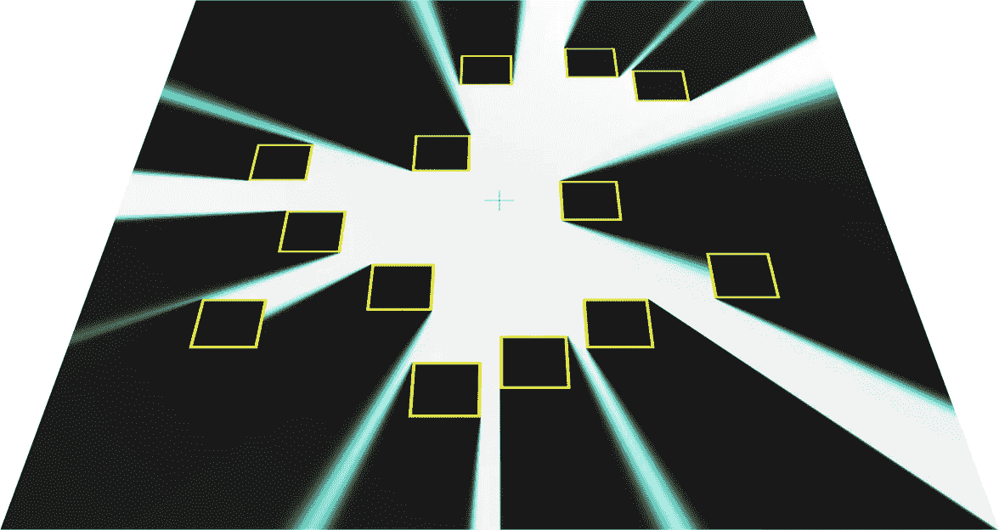
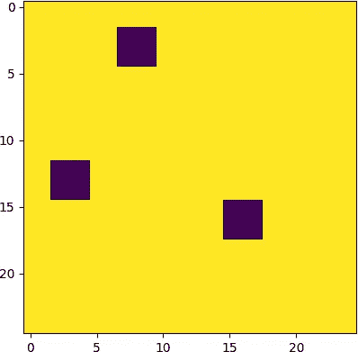
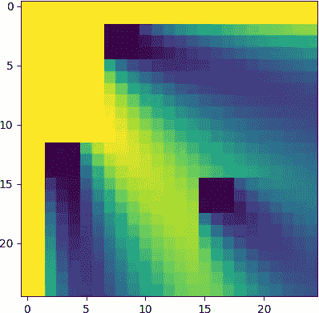
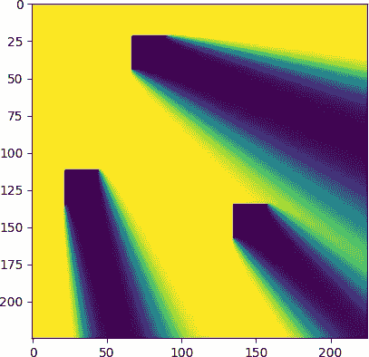
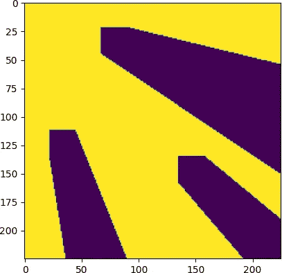
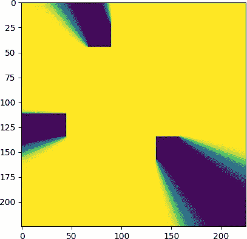
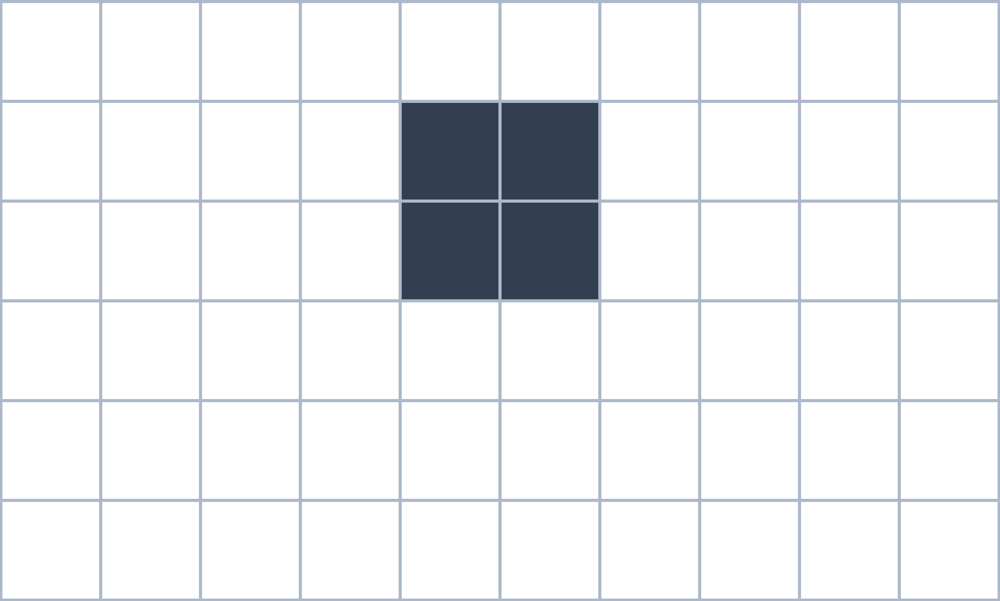
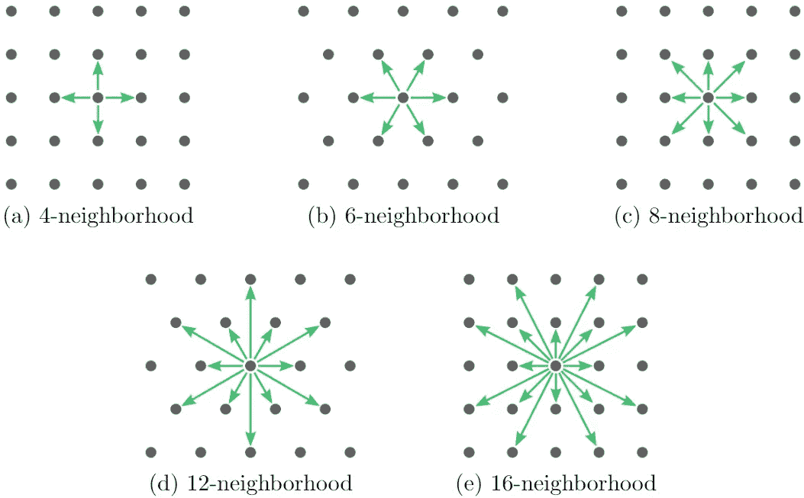
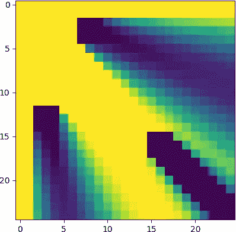
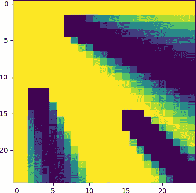

# 《网格基础可视化的快速清晰概述》

> 原文：[`towardsdatascience.com/a-quick-and-clear-look-at-grid-based-visibility-bf63769fbc78?source=collection_archive---------6-----------------------#2023-05-12`](https://towardsdatascience.com/a-quick-and-clear-look-at-grid-based-visibility-bf63769fbc78?source=collection_archive---------6-----------------------#2023-05-12)

## 如何使用一个 3 行的算法提供射线投射的不错替代方案

[](https://medium.com/@rhys.goldstein?source=post_page-----bf63769fbc78--------------------------------)[](https://towardsdatascience.com/?source=post_page-----bf63769fbc78--------------------------------) [Rhys Goldstein](https://medium.com/@rhys.goldstein?source=post_page-----bf63769fbc78--------------------------------)

·

[关注](https://medium.com/m/signin?actionUrl=https%3A%2F%2Fmedium.com%2F_%2Fsubscribe%2Fuser%2F46425896049b&operation=register&redirect=https%3A%2F%2Ftowardsdatascience.com%2Fa-quick-and-clear-look-at-grid-based-visibility-bf63769fbc78&user=Rhys+Goldstein&userId=46425896049b&source=post_page-46425896049b----bf63769fbc78---------------------post_header-----------) 发表在 [Towards Data Science](https://towardsdatascience.com/?source=post_page-----bf63769fbc78--------------------------------) ·14 分钟阅读·2023 年 5 月 12 日[](https://medium.com/m/signin?actionUrl=https%3A%2F%2Fmedium.com%2F_%2Fvote%2Ftowards-data-science%2Fbf63769fbc78&operation=register&redirect=https%3A%2F%2Ftowardsdatascience.com%2Fa-quick-and-clear-look-at-grid-based-visibility-bf63769fbc78&user=Rhys+Goldstein&userId=46425896049b&source=-----bf63769fbc78---------------------clap_footer-----------)

--

[](https://medium.com/m/signin?actionUrl=https%3A%2F%2Fmedium.com%2F_%2Fbookmark%2Fp%2Fbf63769fbc78&operation=register&redirect=https%3A%2F%2Ftowardsdatascience.com%2Fa-quick-and-clear-look-at-grid-based-visibility-bf63769fbc78&source=-----bf63769fbc78---------------------bookmark_footer-----------)

图片由 [Autodesk Research](https://www.research.autodesk.com/) [1] 提供。（已获许可）

在我之前的文章《与 Pascal’s Triangle 的简短直接漫步》中，我解释了如何改进基于网格的路径查找，以便在不使用视线测试的情况下获得高度直接的步行路径。本文将展示一种相关的技术，称为**基于网格的可见性**，该技术在不使用视线测试的情况下计算可见区域。基于网格的可见性在计算机科学界几乎没有听说过，但它是一种在各种人工智能应用中都很有意义的实用方法。它也非常容易实现，所需的代码仅有 3 行。继续阅读，发现解决视频游戏、移动机器人或建筑设计中的可见性问题的最简单选项。

# 可见区域问题

类似于路径查找，可见性分析出现在涉及人工智能和空间环境的多个领域中。视频游戏开发者可能希望计算从敌人瞭望塔可见的游戏地图区域。移动机器人工程师可能需要计算在测试机器人控制系统的模拟中，机器人视野的范围。建筑师可能希望分析建筑物内或街道上不同位置的人们的视野。可见性分析还可以用于估算光源照射的区域。

基本问题是这样的：给定一个 2D 顶视图地图，计算从一个点可见的空间区域。

如果你问计算机科学家如何解决这个问题，他们极有可能不会考虑我所称的**基于网格的算法**：一种通过计算邻近网格单元中的数字来得出每个网格单元中的数字的方法。可见区域问题几乎总是使用**基于向量的可见性**算法来解决，该算法涉及视线测试。最受欢迎的基于向量的可见性技术之一是**射线投射**，在这种技术中，从一个视点向不同方向投射许多射线。如果你对射线投射和其他基于向量的解决方案不熟悉，[Red Blob Games](https://www.redblobgames.com/)网站上的[2D 可见性](https://www.redblobgames.com/articles/visibility/)教程提供了一个很好的背景介绍。

基于网格和基于向量的方法在路径查找和 2D 图形等其他空间应用中都很受欢迎。例如，我们都熟悉光栅（基于网格）和向量图像，并且认识到这两种类型的图像都有其优缺点。那么，为什么只有基于向量的方法在可见性问题中被广泛使用呢？我开始相信，虽然基于网格和基于向量的方法在可见性问题中都有优缺点，但基于网格的可见性被奇怪地忽视了，应该得到更多的关注。

# 基于网格的可见性

这里是用 3 行 Python 代码编写的基于网格的可见性。

```py
for x in range(grid.shape[0]):
    for y in range(int(x==0), grid.shape[1]):
        grid[x,y] *= (x*grid[x-1,y] + y*grid[x,y-1]) / (x + y)
```

算法接受一个表示地图的网格，并对其进行修改以生成可见性结果。正如我们所见，转换过程包括遍历每个网格单元并应用线性插值。让我们通过将这 3 行代码放入一个简短的程序中来测试它们。请随意复制并运行下面的 Python 脚本。

```py
import numpy as np
import matplotlib.pyplot as plt

# Set dimensions
nx = 25
ny = 25

# Create map
grid = np.ones((nx,ny))
wx = nx//10 + 1
wy = ny//10 + 1
grid[int(.3*nx):int(.3*nx)+wx,int(.1*ny):int(.1*ny)+wy] = 0
grid[int(.1*nx):int(.1*nx)+wx,int(.5*ny):int(.5*ny)+wy] = 0
grid[int(.6*nx):int(.6*nx)+wx,int(.6*ny):int(.6*ny)+wy] = 0

# Display map
plt.figure("Map")
plt.imshow(np.transpose(grid))

# Compute visibility
for x in range(grid.shape[0]):
    for y in range(int(x==0), grid.shape[1]):
        grid[x,y] *= (x*grid[x-1,y] + y*grid[x,y-1]) / (x + y)

# Display visibility
plt.figure("Visibility")
plt.imshow(np.transpose(grid))
plt.show()
```

程序首先创建并显示地图，一个 25x25 的网格，其中填充障碍物的单元格值为 0，空单元格值为 1。如下面所示，地图有三个方形障碍物。



25x25 的输入地图。（图片由作者提供）

程序随后将地图转换为可见性网格并显示出来。可见性网格填充了**可见性得分**，这些得分近似于从左上角的视点观察到每个网格单元的可见程度。可见性得分的范围从 0（完全被阻挡）到 1（完全可见）。这是可见性网格。



结果为 25x25 的可见性网格。（图片由作者提供）

每个障碍物都会从左上角投射阴影，尽管你会注意到阴影的边缘有些模糊。提高地图分辨率是一种锐化这些边缘的方法。如果我们将网格大小从 25 改为 225 个单元格……

```py
nx = 225
ny = 225
```

…我们得到以下结果。



分辨率增加到 225x225 的可见性网格。（图片由作者提供）

在这里，我们看到更清晰、更准确的阴影。如果我们继续增加分辨率，可见性得分会变得越来越准确。实际上，结果会随着网格间距接近零而趋近于精确解。

根据应用情况，我们可能希望将每个网格单元分类为可见（1）或不可见（0）。我们可以在循环后应用 0.5 的阈值来实现这一点。

```py
for x in range(grid.shape[0]):
    for y in range(int(x==0), grid.shape[1]):
        grid[x,y] *= (x*grid[x-1,y] + y*grid[x,y-1]) / (x + y)
grid[:] = (grid >= 0.5)
```

将第 4 行插入脚本中会给我们如下结果。



应用阈值后的 225x225 可见性网格。（图片由作者提供）

重要的是要记住，基于网格的可见性是一种近似方法。一些网格单元可能会被分类为可见，即使它们实际上应该仅在阴影中；而有些可能会被分类为被阻挡，即使它们实际上应该仅在可见区域内。但一般来说，如果网格间距相对于障碍物及其之间的间隙较小，结果应该具有良好的准确性。

在我们继续之前，我得承认我使用了一些技巧将算法缩减到 3 行：

1.  在第二个`for`循环中，`int(x==0)`这个表达式是一个巧妙的技巧，可以跳过网格单元[0, 0]，因为插值公式会导致除以零的错误。

1.  我依赖于 NumPy 库允许使用负索引访问数组的事实。其他编程语言可能需要更多的代码行来检查这一条件。

1.  上述所有代码假设视点位于地图的角落。将视点移动到具有坐标`x0`和`y0`的任意单元格需要在四个象限中各重复计算一次。

要将视点置于地图中心，请用以下代码替换脚本中`计算可见性`部分的代码。

```py
# Set viewpoint
x0 = nx//2
y0 = ny//2

# Define visibility function
def visibility_from_corner(grid):
    for x in range(grid.shape[0]):
        for y in range(int(x==0), grid.shape[1]):
            grid[x,y] *= (x*grid[x-1,y] + y*grid[x,y-1]) / (x + y)

# Compute visibility
visibility_from_corner(grid[x0:,y0:])
visibility_from_corner(grid[x0::-1,y0:])
visibility_from_corner(grid[x0::-1,y0::-1])
visibility_from_corner(grid[x0:,y0::-1])
```

这是视点在中心时的结果。



225x225 的可见性网格，视点在中心。（作者图片）

# 使用 Excel 的一个巧妙技巧

这是一个我忍不住想展示的小技巧：在 Excel 中实现的网格可见性。以下的屏幕录制大约 1 分钟。


Excel 中的网格可见性。（作者录制）

想自己试试吗？按照下面的步骤操作即可。只需 1 到 2 分钟。

1.  打开 MS Excel 并创建一个**空白工作簿**。

1.  选择单元格**B2**，点击**公式栏**（或按`F2`），粘贴以下文本，然后按`Enter`：

    `=((COLUMN(B2)-2)*A2+(ROW(B2)-2)*B1)/((COLUMN(B2)-2)+(ROW(B2)-2))`

1.  重新选择单元格**B2**，按`Ctrl-C`进行复制，选择从**B2**到**Z26**的单元格范围，按`Ctrl-V`进行粘贴。

1.  在**主页**选项卡中，选择**条件格式**，**突出显示单元格规则**，**小于**。在第一个框（“格式小于”）中输入`0.5`，然后从右侧的下拉菜单中选择任意“填充”选项（例如，“浅红色填充，深红色文本”）。点击**确定**。

1.  选择单元格**B2**，按`1`，然后按`Enter`。

1.  通过点击单元格**A1**上方和左侧的绿色三角形选择所有单元格，然后点击并拖动**A**和**B**之间的垂直线，以缩小单元格宽度，使所有单元格最终大致为正方形。

1.  通过点击单元格并按`Backspace`创建障碍物。自动生成的阴影应从左上角扩展开来。

观察到，障碍物需要多单元格宽才能产生合理的阴影效果。

# 网格可见性的简要历史

网格可见性的历史解释了为何这一方法从未广泛被认可。首先，尽管其简单，但网格可见性直到 2004 年[2]才被发明，且其收敛性质直到 2008 年[3]才得到确立。到那时，基于向量的方法如光线投射已经变得普遍。计算机科学家们不再寻找替代的方法。其次，关于网格可见性的首篇论文来自一种称为水平集理论的数学分支，该领域以计算机科学家不熟悉的隐式方式表示几何图形。虽然水平集可见性方法适用于 2D 或 3D，并使用线性插值，但严格的 3D 替代方法，采用双线性插值，由建筑和城市信息学研究人员于 2013 年[4]开发。

大约在 2019 年，我和我的同事们对网格可视性产生了兴趣，作为分析大量计算机生成建筑设计的一种手段。在我们的开放获取期刊论文“[基于网格的导航路径计数](https://www.jair.org/index.php/jair/article/view/13544)” [1]中，我们做出了以下观察：

1.  **原始的水平集可视性方法可以轻松地适应于计算机科学家熟悉的显式几何形状。** 本文开头的 Python 代码是将原始插值公式与显式网格几何相结合的实现示例。

1.  **网格邻域的大小可以增加以产生更准确的结果。** 本文中的示例迄今为止使用了 4-邻域，其中信息流向北、南、东和/或西。我的同事们和我在论文和一个名为[SpaceAnalysis](https://www.youtube.com/watch?v=MK5GivotqLM)的建筑设计工具中使用了 8-邻域，这允许信息沿对角线流动。

1.  **基于网格的可视性结果可以通过概率理论特别是中心极限定理被证明收敛于精确解。** 原始的证明来自水平集社区，使用了数值分析[3]。

1.  **线性插值产生的可视性评分可以被重新解释为从视点出发的最短网格路径中未被障碍物阻挡的部分。**

最后的观察结果揭示了**基于网格的中心路径寻路**，这是本文的主要内容和我之前的 Medium 文章的主题，基于与网格可视性相同的基础数学。实际上，可以通过简单地计数路径来计算可见区域。

为了演示**通过计数实现可视性**，我们将假设视点位于左上角。我们从那个角落开始放置一个 1，然后重复地将数字向下和向右复制。当两个数字汇聚在同一个网格单元时，我们将它们加在一起。结果是每个网格单元包含从视点出发并最终到达该单元的网格路径的数量。例如，从视点到右下角有 742 条这样的路径。



从左上角的视点计数网格路径。（动画由作者提供）

接下来，我们重复这个过程，忽略所有障碍物。每个网格单元最终都拥有从视点到该单元的最大可能网格路径数量。这实际上只是帕斯卡三角形，一个在之前的文章中详细讨论的著名数字模式。观察到，从视点到右下角有最多 2002 条网格路径。


忽略障碍物时从视点计数网格路径。（动画由作者提供）

在我们的计数路径查找方法中，我们取了两组路径计数并将它们相乘。在计数可见性中，我们将两组路径计数相除。我们首先获取到达每个网格单元的实际路径数量（见上图），然后除以到该单元的最大可能路径数量（见第二动画），最终得到每个网格单元的可见性分数。我们将每个单元的可见性分数不低于 0.5 的单元标记为可见。例如，右下角的单元格由 742 条可能的 2002 条网格路径到达。它的可见性分数是 472/2002，即约为 0.37，因此被分类为不可见。


通过路径计数获得可见性分数。（作者提供的动画）

再次，我们在论文中证明了通过计数计算的可见性分数在数学上等同于原始插值公式所产生的分数。换句话说，两种方法都是解决可见区域问题的可行方法。然而，如果我们选择实现计数可见性，我们必须记住路径计数会随着距离指数级增加。如果我们用 64 位浮点数表示这些计数，路径计数将在达到视点 1030 网格移动后溢出。因此，我认为在实现基于网格的可见性时，默认使用线性插值方法是有意义的。同时，我认为路径计数的联系很有趣，值得分享。

# 更大的邻域

对于基于网格的可见性，你可能会担心其准确性，尤其是因为某些基于矢量的方法被认为能提供可见区域问题的精确解。关于精确解的现实是：它们只有在输入几何体精确的情况下才是精确的，但在实际中这种情况很少见。在对真实世界环境模型进行可见性分析、路径查找分析或任何空间分析时，由于离散化误差、测量误差以及在某些情况下的构建误差，模型几乎总是一个近似值。网格基可见性引入一些额外误差，是否会成为严重的缺陷，取决于具体应用。

尽管如此，仍有一种方法可以在不增加网格分辨率的情况下提高基于网格的可见性结果的准确性。到目前为止，我们的示例仅使用了 4-邻域，这是最简单但最不准确的二维网格邻域。如前所述，我们可以选择更大的网格邻域以获得更准确的结果。下图描绘了矩形网格的 4、8 和 16 邻域，以及三角网格的 6 和 12 邻域。



矩形和三角网格邻域。（图片由[Autodesk Research](https://www.research.autodesk.com/) [1]提供，已获许可）

为了查看更大邻域的效果，我们将从文章开头重写 Python 脚本。在这个新版本的程序中，`visibility_within_cone`函数计算位于两个向量之间的锥体内的可见性分数。这可能不是最有效的实现，但它将帮助我们理解过渡到更大的网格邻域意味着在更多的较薄锥体内应用相同的算法。

```py
import numpy as np
import matplotlib.pyplot as plt

# Set dimensions
nx = 25
ny = 25

# Create map
grid = np.ones((nx,ny))
wx = nx//10 + 1
wy = ny//10 + 1
grid[int(.3*nx):int(.3*nx)+wx,int(.1*ny):int(.1*ny)+wy] = 0
grid[int(.1*nx):int(.1*nx)+wx,int(.5*ny):int(.5*ny)+wy] = 0
grid[int(.6*nx):int(.6*nx)+wx,int(.6*ny):int(.6*ny)+wy] = 0

# Display map
plt.figure("Map")
plt.imshow(np.transpose(grid))

# Define visibility function
def visibility_within_cone(grid, u_direction, v_direction):
    u = np.asarray(u_direction, dtype=int)
    v = np.asarray(v_direction, dtype=int)
    origin = np.array([0,0], dtype=int)
    dims = np.asarray(grid.shape, dtype=int)
    m = 0
    k = 0
    position = np.array([0,0], dtype=int)
    while np.all(position < dims):
        while np.all(position < dims):
            if not np.all(position == 0):
                pos = tuple(position)
                pos_minus_u = tuple(np.maximum(origin, position - u))
                pos_minus_v = tuple(np.maximum(origin, position - v))
                grid[pos] *= (m*grid[pos_minus_u] + 
                              k*grid[pos_minus_v]) / (m + k)
            k += 1
            position += v
        m += 1
        k = 0
        position = m*u

# Compute visibility
visibility_within_cone(grid, [1,0], [0,1])

# Display visibility
plt.figure("Visibility")
plt.imshow(np.transpose(grid))
plt.show()
```

由于我们调用函数时使用的是向量`[1,0]`和`[0,1]`，所以我们仍然使用的是 4-邻域。结果与我们第一个脚本生成的结果相同。


25x25 4-邻域的可见性网格。（图片作者提供）

但现在我们可以轻松修改代码以使用 8-邻域。为此，请将`Compute visibility`部分的代码替换为以下代码。可见性函数现在被应用两次，第一次是在对角线`[1,1]`和网格轴`[1,0]`之间的锥体内，第二次是在`[1,1]`和`[0,1]`之间。

```py
# Compute visibility
visibility_within_cone(grid, [1,1], [1,0])
visibility_within_cone(grid, [1,1], [0,1])
```

这是 8-邻域的结果。阴影边缘变得更加清晰。



25x25 8-邻域的可见性网格。（图片作者提供）

最后，我们可以通过在 4 个锥体内应用可见性函数过渡到 16-邻域。

```py
# Compute visibility
visibility_within_cone(grid, [2,1], [1,0])
visibility_within_cone(grid, [2,1], [1,1])
visibility_within_cone(grid, [1,2], [1,1])
visibility_within_cone(grid, [1,2], [0,1])
```

这是 16-邻域的结果。



25x25 16-邻域的可见性网格。（图片作者提供）

16-邻域似乎为大多数应用提供了足够的精度。然而，如果需要更高质量的结果，可以继续升级到 32-邻域、64-邻域等。

这解决了矩形网格的问题。三角网格，也称为六边形网格，实现起来更棘手，因为没有理想的方式来索引网格单元。各种索引策略在[Red Blog Games](https://www.redblobgames.com/)教程中的[六边形网格](https://www.redblobgames.com/grids/hexagons/)中有描述，其中包括使用视线测试的可见性部分。我把在三角网格上实现基于网格的可见性作为一个挑战留给你。

# 结论

基于网格的可见性是光线投射和其他基于向量的可见性方法的简单而实用的替代方案。由于其发现的时机和背景，这种方法对计算机科学家而言仍然相对陌生。但我希望你会同意，是时候让基于网格的可见性变得显而易见了，并且希望你能在自己的人工智能项目中找到使用它的机会。

*更新：如果你想了解如何在 3D 中高精度地实现基于网格的可见性，请查看本系列的第三篇也是最后一篇文章：* *3D 网格邻域的清晰而坚实的轮廓**。*

# 参考文献

[1] R. Goldstein, K. Walmsley, J. Bibliowicz, A. Tessier, S. Breslav, A. Khan, [基于网格的导航路径计数](https://www.jair.org/index.php/jair/article/view/13544) (2022), Journal of Artificial Intelligence Research, vol. 74, pp. 917–955

[2] Y.-H. R. Tsai, L.-T. Cheng, H. Osher, P. Burchard, G. Sapiro, [基于 PDE 的隐式框架中的可见性及其动态](https://www.sciencedirect.com/science/article/abs/pii/S0021999104000841) (2004) [[PDF](https://mathweb.ucsd.edu/~lcheng/TCBOS04-Rver.pdf)]. Journal of Computational Physics, vol. 199, no. 1, pp. 260–290

[3] C.-Y. Kao, R. Tsai, [用于可见性问题的水平集算法的性质](https://link.springer.com/article/10.1007/s10915-008-9197-5) (2008) [[PDF](https://www.researchgate.net/publication/220396093_Properties_of_a_Level_Set_Algorithm_for_the_Visibility_Problems)], Journal of Scientific Computing, vol. 35, pp. 170–191

[4] D. Fisher-Gewirtzman, A. Shashkov, Y. Doytsher, [基于体素的城市环境可见性分析](https://www.tandfonline.com/doi/abs/10.1179/1752270613Y.0000000059) (2013), Survey Review, vol. 45, no. 333, pp. 451–461
