# 自然语言处理模型的归一化快速指南

> 原文：[`towardsdatascience.com/a-quick-guide-on-normalization-for-your-nlp-model-2dbd7d2d42a7`](https://towardsdatascience.com/a-quick-guide-on-normalization-for-your-nlp-model-2dbd7d2d42a7)

## 使用归一化加速模型收敛并稳定训练过程

[](https://medium.com/@vuphuongthao9611?source=post_page-----2dbd7d2d42a7--------------------------------)[](https://towardsdatascience.com/?source=post_page-----2dbd7d2d42a7--------------------------------) [Thao Vu](https://medium.com/@vuphuongthao9611?source=post_page-----2dbd7d2d42a7--------------------------------)

·发表于[Towards Data Science](https://towardsdatascience.com/?source=post_page-----2dbd7d2d42a7--------------------------------) ·阅读时间 7 分钟·2023 年 9 月 14 日

--


由[Mattia Bericchia](https://unsplash.com/@mattiabericchia?utm_source=medium&utm_medium=referral)拍摄，发布于[Unsplash](https://unsplash.com/?utm_source=medium&utm_medium=referral)

# 介绍

高效训练深度学习模型是一项具有挑战性的任务。随着近期自然语言处理模型规模和架构复杂性的增长，问题变得更加棘手。为了处理数十亿的参数，提出了更多优化方法以实现更快的收敛和稳定的训练。其中一个最显著的技术是**归一化**。

在本文中，我们将探讨一些归一化技术，它们的工作原理，以及如何将其用于自然语言处理深度模型。

# 为什么不使用 BatchNorm？

BatchNorm [2] 是一种早期的归一化技术，旨在解决内部协变量偏移问题。

简单来说，内部协变量偏移发生在层的输入数据分布发生变化时。当神经网络被迫适应不同的数据分布时，梯度更新在批次之间发生剧烈变化。因此，模型需要更长时间来调整、学习正确的权重并收敛。随着模型规模的增长，这个问题变得更严重。

初始解决方案包括使用较小的学习率（以减少数据分布变化的影响）和小心的权重初始化。BatchNorm 通过在特征维度上对输入进行归一化，有效地解决了这个问题。

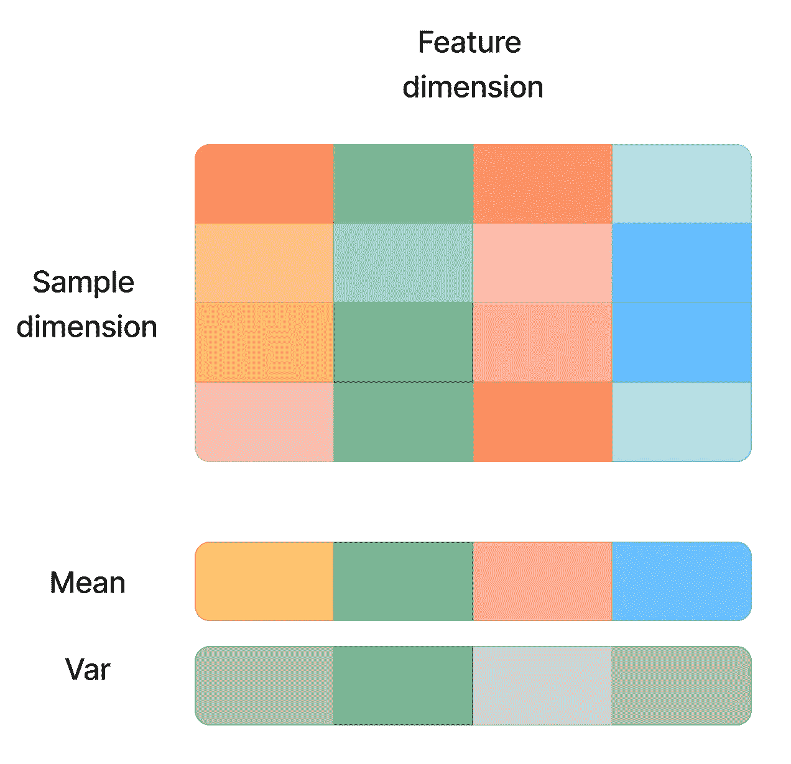

批量归一化（图片来源：作者）

该技术显著加快了收敛速度，并允许更高的学习率，因为模型对异常值的敏感度降低。然而，它仍然有一些缺点：

+   **小批量大小：** BatchNorm 依赖于批量数据来计算特征的均值和标准差。当批量大小较小时，均值和方差无法再代表总体。因此，BatchNorm 无法进行在线学习。

+   **序列输入：** 在 BatchNorm 中，每个输入样本的归一化依赖于来自同一批次的其他样本。这对序列数据效果不好。例如，我们有两个训练样本，长度不同 ***(a1, a2,.., a10)*** 和 ***(b1,b2,…,b20)***。如果 token ***b11*** 与填充 token ***a11*** 一起归一化，这是否合适？在推理步骤中，如果我们有一个长度为 30 的序列 ***(c1, c2,.., c30)***，我们如何获得均值和方差来归一化 token ***c21***？这就是 BatchNorm 不适用于 NLP 任务的关键原因。

+   **并行化：** 批量归一化模型难以并行化。由于元素（均值和方差）之间存在依赖关系，我们需要在设备之间进行同步。NLP 模型，如 Transformers，由于其大规模设置而受到影响。

这就是 LayerNorm [1] 出现的原因。2016 年提出的 LayerNorm 已经取代了 BatchNorm，稳步成为研究界最流行的归一化技术。

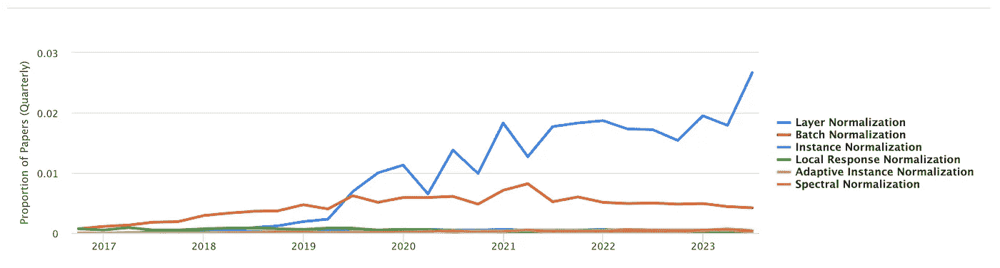

归一化技术的使用（[来源](https://paperswithcode.com/method/layer-normalization)）

那么，什么是层归一化，它为什么如此有效？

# 为什么 LayerNorm 表现如此出色？

与 BatchNorm 相对，LayerNorm 在每个数据样本维度上进行归一化。因此，在一个包含 n 个样本的训练批次 ***(x1, x2,.., xn)*** 中，归一化是在每个 ***xi*** 上独立完成的。

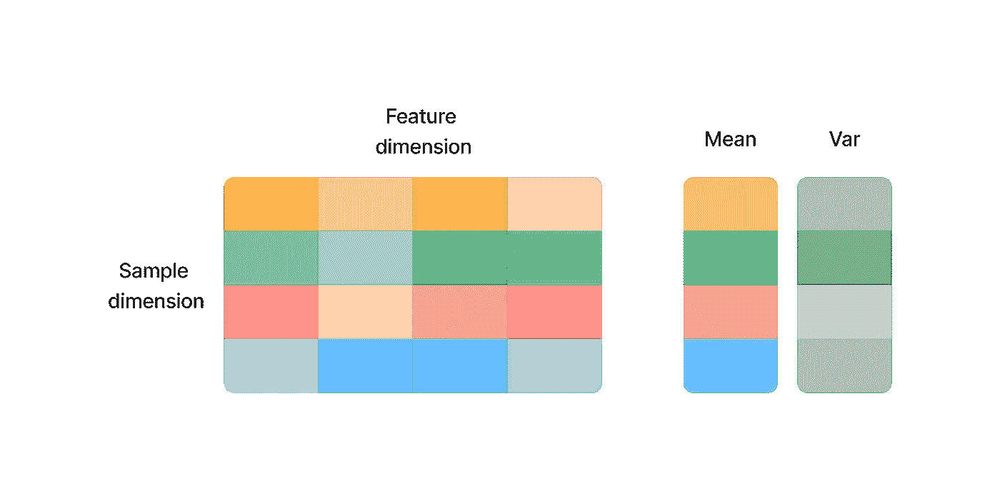

层归一化（图片由作者提供）

LayerNorm 已广泛应用于许多最先进的语言模型，如 BERT [5] 和 BLOOM [6]。它为什么表现如此出色？

首先，我们需要提到 LayerNorm 相较于 BatchNorm 的几个优点：

+   **序列数据：** 该技术引入了训练样本之间的独立性。因此，我们可以放心地对序列输入进行归一化，而不必担心训练样本之间的不同特性。

+   **灵活的批量大小：** 由于归一化是在每个样本上完成的，因此批量大小不再是问题。

+   **训练和测试：** 与 BatchNorm 不同，LayerNorm 不需要保持总体的移动均值或方差。因此，它在训练和推理时执行相同的计算。

+   **并行化：** 没有训练样本之间的依赖关系，因此我们可以在不同的设备上训练模型，而无需同步。

其次，我们将讨论归一化技术在训练稳定性方面如此有帮助的一个关键原因：它们在权重和输入变换下的不变性。不变性意味着归一化技术的结果不会受到输入变换的影响。

常见的变换有重新缩放和重新中心化。重新中心化不变性使模型对权重和数据中的随机噪声不敏感。与此同时，重新缩放不变性使输出对输入和权重的任意缩放保持弹性。

通过构建一个层归一化函数并在不同的变换上进行尝试，可以更容易理解不变性特征，以查看均值、方差和结果如何变化。

```py
def custom_ln(x: torch.Tensor, w : torch.Tensor, dim: Tuple[int], eps: float=1e-05):
  sum_input = x@w # multiply the input and the weight matrix
  mean = torch.mean(sum_input, dim=dim, keepdim=True) # get the mean on sample dimension
  std_var = torch.sqrt(torch.var(sum_input, dim=dim, keepdim=True) + eps) # get the var on sample dimension
  return (sum_input-mean)/(std_var )
```

我在重新缩放和重新中心化矩阵权重（w）和数据集（x）后得到了以下结果。

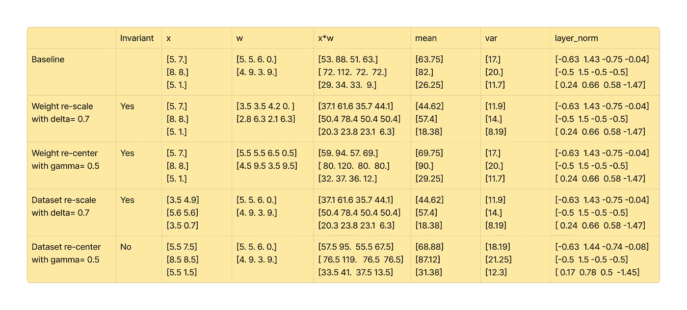

不同变换下的层归一化结果（作者提供的图片）

如我们所见，归一化结果在权重重新缩放和重新中心化下保持不变。对于数据集变换，该技术对重新缩放具有不变性，但对重新中心化不具备不变性。

LayerNorm 能够使输出对这种变换保持弹性，这非常令人惊讶。它是如何做到的？让我们深入探讨数学细节，以更好地理解其内部发生了什么。

这里的内容有点复杂，因此可以跳过此部分。然而，我敢肯定，这将给你一个强烈的直觉，帮助你更好地理解归一化的工作原理。

## Layer Norm 不变性的数学证明

我们有一个神经网络，权重为 ***W***，输入为 ***x***，偏置为 ***b*** 和激活函数为 ***f***。神经网络的输出为 ***y = f(Wx + b)***。

然后 LayerNorm 可以表示为：

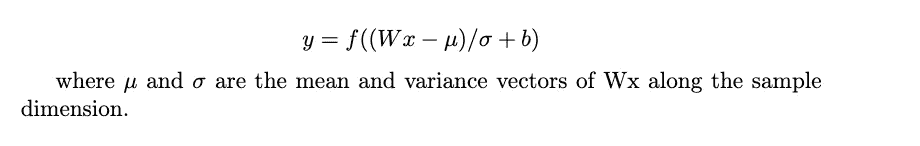

LayerNorm 方差的数学证明如下所示。

## 权重矩阵重新缩放不变性

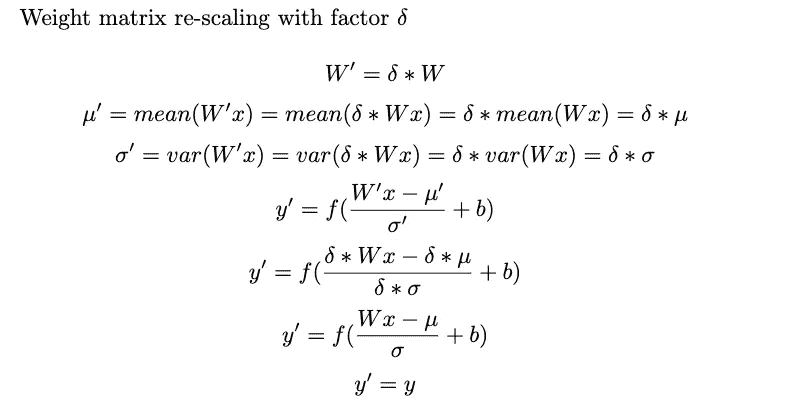

权重矩阵重新缩放不变性（作者提供的图片）

## 权重矩阵重新中心化不变性

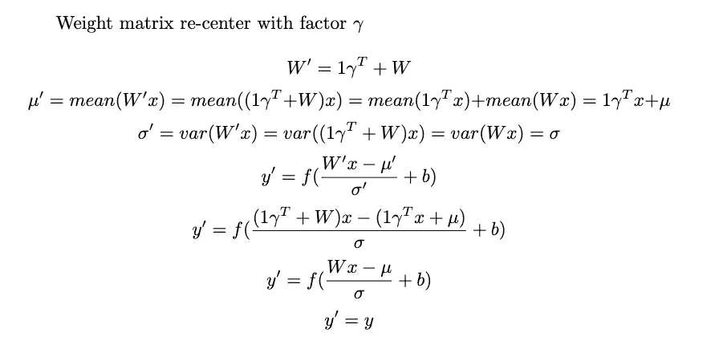

权重矩阵重新中心化不变性（作者提供的图片）

## 数据集重新缩放不变性

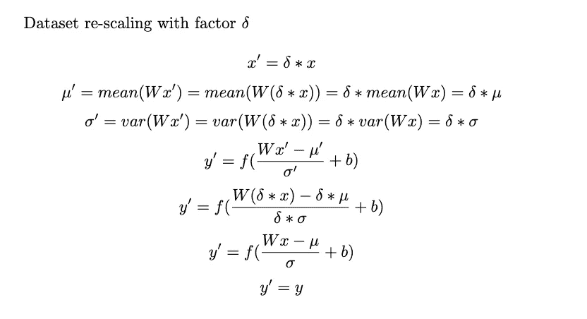

数据集重新缩放不变性（作者提供的图片）

这就是 LayerNorm 对变换的不变性的证明。然而，并非所有的不变性都是必要的。RMSNorm [3] 是 LayerNorm 的一个较年轻的兄弟，只具有重新缩放不变性特征。然而，它已成为最近 LLM 架构如 Llama [4] 的首选。

是什么使 RMSNorm 更优越？

# 什么是 RMSNorm？

RMSNorm 于 2019 年发布，其中 RMS 代表“均方根”。尽管 LayerNorm 加速了收敛，作者指出它在每个训练步骤中消耗的时间更多。

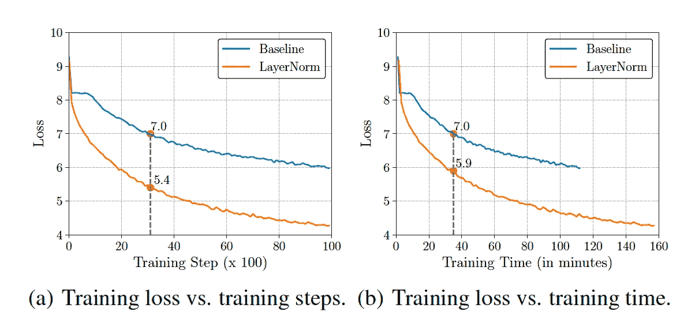

基于 GRU 的 RNNSearch 的训练过程 [3]

作者还辩称，LayerNorm 的均值归一化对最终性能的影响微乎其微，因此可以为了计算效率而被移除。

根据这个假设，提出了 RMSNorm，以关注重新缩放不变性，并使用均方根正则化，如下所示。

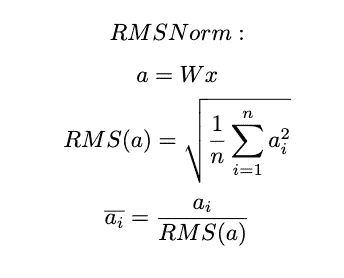

RMSNorm（作者提供的图片）

由于我们跳过了均值计算，归一化变得更简单。通过这种优雅的优化，作者观察到在不同实现中速度提升了 7%-64%，且性能没有下降！

其中一个实验是 WMT14 英语-德语翻译任务，使用基于 GRU 的 RNNSearch 并采用 BLEU 分数指标进行评估。LayerNorm 和 RMSNorm 在测试中都取得了相似的分数。但 RMSNorm 的训练时间快了 25%。

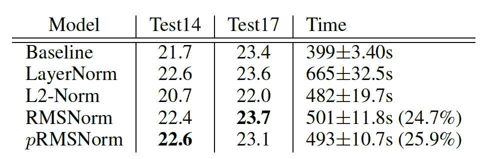

test14 和 test17 上的 BLEU 分数[3]

更详细地观察训练中的验证分数也表明 RMSNorm 的表现与 LayerNorm 在所有训练阶段相当。这支持了最初的观点，即重新中心化不具有显著意义，RMSNorm 更加高效。

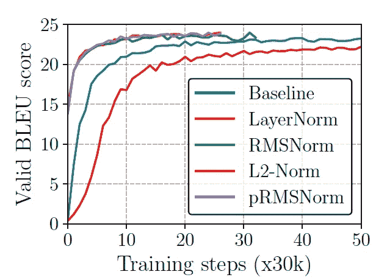

*RNNSearch 在 newstest2013 上的 SacreBLEU 分数[3]*

另一个有趣的指标是不同令牌位置的隐藏向量的均值和标准差。虽然基线的均值和方差变化很大，但使用 LayerNorm 和 RMSNorm 显著稳定了分布输出。这是归一化对于 NLP 模型至关重要的有力证明。

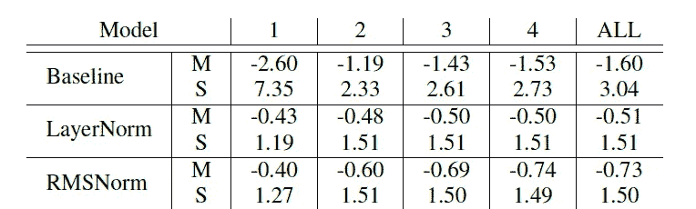

*特定位置的均值(M)和标准差(S)统计[3]*

我希望这篇文章能帮助你理解每种归一化技术在 NLP 任务中的优缺点。

下篇文章见！

# 参考文献

[1] Jimmy Lei Ba, Jamie Ryan Kiros 和 Geoffrey E Hinton。“层归一化。” *arXiv 预印本 arXiv:1607.06450* (2016)。

[2] Sergey Ioffe 和 Christian Szegedy。“批量归一化：通过减少内部协方差偏移加速深度网络训练。” ICML, 2015。

[3] Zhang, Biao 和 Rico Sennrich。“均方根层归一化。” *神经信息处理系统进展* 32 (2019)。

[4] Touvron, Hugo 等。“Llama: 开放且高效的基础语言模型。” *arXiv 预印本 arXiv:2302.13971* (2023)。

[5] Devlin, Jacob 等。“Bert: 深度双向变换器的预训练用于语言理解。” *arXiv 预印本 arXiv:1810.04805* (2018)。

[6] Scao, Teven Le 等。“Bloom: 一个 176b 参数的开放访问多语言模型。” *arXiv 预印本 arXiv:2211.05100* (2022)。
