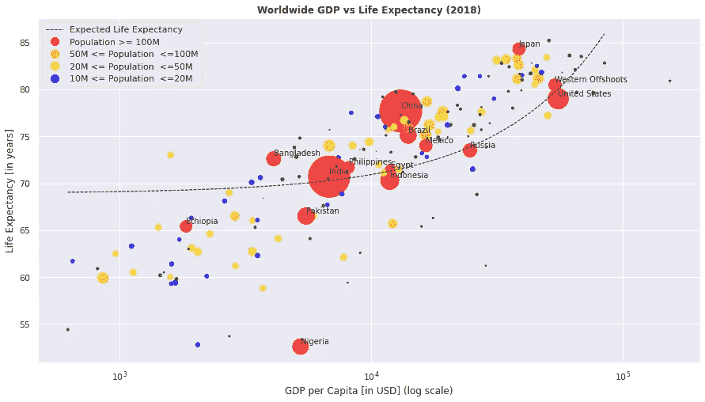
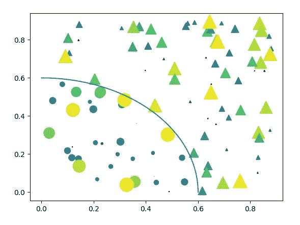
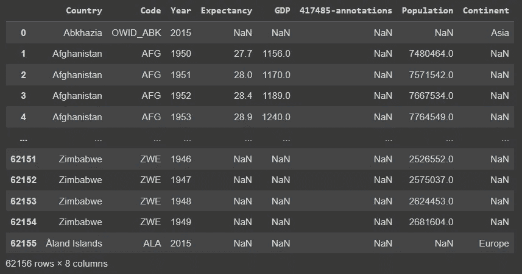
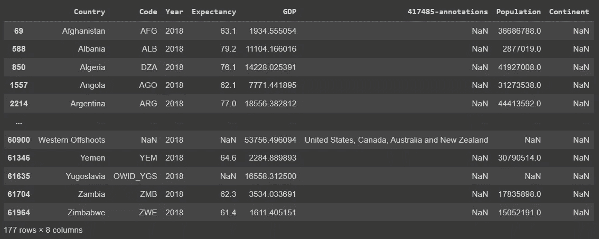
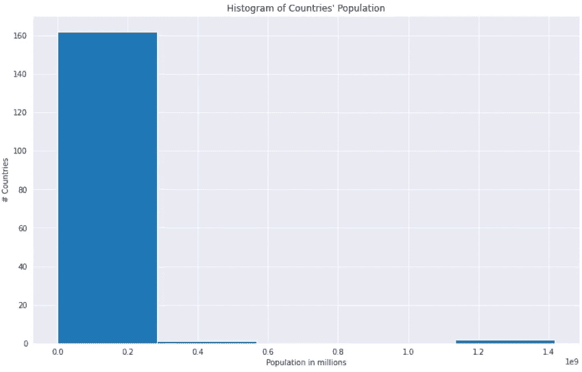
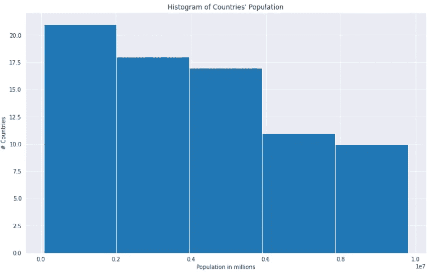
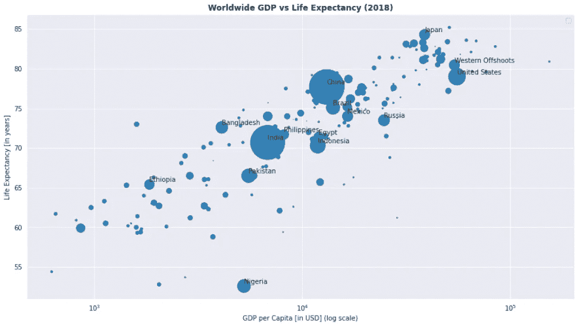
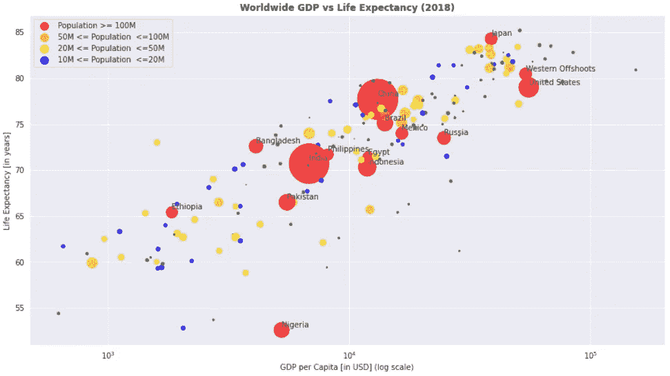
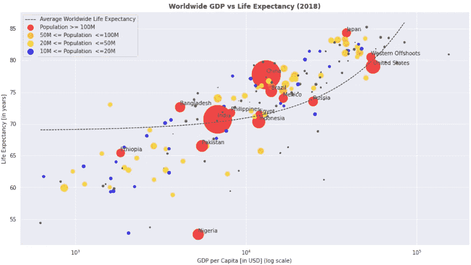

# Python 中美丽散点图的快速指南

> 原文：[`towardsdatascience.com/a-quick-guide-to-beautiful-scatter-plots-in-python-75625ae67396`](https://towardsdatascience.com/a-quick-guide-to-beautiful-scatter-plots-in-python-75625ae67396)

## 可视化全球生命预期与人均 GDP

 [Hair Parra](https://hair-parra.medium.com/?source=post_page-----75625ae67396--------------------------------)

·发布于 [Towards Data Science](https://towardsdatascience.com/?source=post_page-----75625ae67396--------------------------------) ·阅读时间 9 分钟·2023 年 1 月 12 日

--

作者通过 Python Matplotlib 提供的图片

所以你已经知道了一些 Python 和 matplotlib。也许你和我一样，喜欢复杂、美丽且富有洞察力的图表。然而，当你遇到一些基础示例并试图自己复现时，如 [这个文档页面](https://matplotlib.org/stable/gallery/lines_bars_and_markers/scatter_masked.html#sphx-glr-gallery-lines-bars-and-markers-scatter-masked-py) 中所见，你可能会看到这样的情况：

这将生成如下图表：

来源：[`matplotlib.org/stable/gallery/lines_bars_and_markers/scatter_masked.html#sphx-glr-gallery-lines-bars-and-markers-scatter-masked-py`](https://matplotlib.org/stable/gallery/lines_bars_and_markers/scatter_masked.html#sphx-glr-gallery-lines-bars-and-markers-scatter-masked-py)

虽然这张图非常色彩丰富，但相当简单，不太具备洞察力，代码也解释了其目的。在本文中，我将展示如何创建像文章开头看到的那样美丽而富有洞察力的散点图。

这个教程的代码笔记本 [可以在这里找到](https://colab.research.google.com/drive/1jJd7fjS_1T5OhOVBdb8nhkQPF7KXBgh0?usp=sharing)，我们将使用的数据集可以在 [这个链接](https://ourworldindata.org/grapher/life-expectancy-vs-gdp-per-capita) 中找到。请注意，在本教程中，我已将数据挂载到驱动器中，因此你可以 [做同样的事情](https://medium.com/geekculture/how-to-load-a-dataset-from-the-google-drive-to-google-colab-67d0478bc634)，或者将数据下载到本地并运行 Jupyter Notebook。为了方便，你也可以从 [我的 GitHub](https://github.com/JairParra/Introduction-to-Data-Science/blob/main/datasets/life-expectancy-vs-gdp-per-capita.csv) 下载数据。

# 导入

由于我将在这个例子中使用 Google Colab，你将看到特定的 Colab 驱动导入。但是，如果你是在本地进行操作，可以跳过这些。由于我们还将进行一些基本的数据清理和线性回归，我还导入了一些 Scikit-learn 类。

# 数据集：预期寿命与人均 GDP

对于这个例子，我们将使用**预期寿命与人均 GDP**数据集，该数据集可在[`ourworldindata.org/`](https://ourworldindata.org/)找到。一旦你获取了数据并能够读取文件，让我们查看分析它的步骤：

1.  加载数据

1.  检查数据并重命名列以便于使用

1.  提取具有 GDP 值的行/数据点

1.  可视化人口分布

1.  构建绘图函数

1.  美观地绘制数据！

## 加载数据

首先，让我们加载并检查我们的数据。我们使用 Pandas 加载数据（无论你将数据放置在哪里），并重命名一些列以便于使用。

结果数据应如下所示：

作者绘制的图表——使用 Python Pandas 在 Colab 上生成

## 清理数据

请注意，许多数据点在`GDP`列和`Population`列中都有`Nan`值。由于我们无法对缺失值进行分析，因此我们将从数据中删除这些点：

在清理了 GDP 数据并选择了 2018 年（你可以自己验证是否有进一步年份的 GDP 数据！）后，我们的数据将如下所示：

作者绘制的图表——使用 Python Pandas 在 Colab 上生成

请注意，我们还排除了`World`数据点，因为它包含所有国家的总和（可以自由包括它，看看最终图表有何变化！）。

# 可视化人口分布

请注意，人口值以百万为单位。在绘图中，为了给不同的人口数阈值添加不同的颜色，我们希望查看其分布情况：

作者提供的图片，使用 Python Matplotlib 生成

哎呀！这告诉我们，大多数国家的人口在 0.0 到 0.2¹e9 = 200,000,000（2 亿）之间，而一些国家的人口超过了约 1200 万。由于左侧密度较大（更多国家的人口较少），我们可以忽略高人口国家，并制作一个集中在左侧国家的直方图：

作者提供的图片，使用 Python Matplotlib 生成

好得多！我们将用它来创建大致的值，以颜色编码不同人口密度的国家。

# 构建绘图函数

对于这一部分，我们将执行几个子步骤，如下所示。

## 函数定义

我们将按如下方式定义我们的函数：

注意三个参数：`df`，这是我们经过初步预处理后的数据，`apply_color`用于对人口密度进行颜色编码，以及`regression`用于在图表上应用回归。

## 填补缺失数据

我们的数据仍然包含一些重要列的 NaN 值，即`["Expectancy", "GDP", "Population"]`。虽然我们可以删除包含 NaN 的行，但这里更好的方法是用“有根据的猜测”来填补它们。常见的选项是列的均值或中位数，但在这里我们将使用一种称为**K** **最近邻**（KNN）的机器学习算法。如果你不熟悉它，你可以在[这里](https://www.ibm.com/topics/knn)阅读相关内容。就我们的目的而言，它实际上是通过使用基于可用属性（比如预期寿命和 GDP）的最相似的 N 个国家的条目来预测人口值，并使用这些值的平均值来填补缺失值。

**数据汇总**

虽然这里的数据仅为 2018 年的数据，但鉴于更好的数据集，你可以将此分析扩展到更多年份。这就是为什么我们还**汇总数据**以确保所有年份都被考虑在内。此操作是使用 Pandas 的`groupby()`，选择“`Country`”列作为参数。此外，我们还会提前对数据进行四舍五入，以减少小数位数。

## 提取绘图变量

为了方便起见，我们将再次把列重新分配到各个变量。请注意，你可以直接查询数据框。然而，一个重要的步骤是，我们将把`Population`列按一百万的比例缩放并乘以 2。这将控制绘制散点图时点的大小。

## 执行回归

我们图表的一个可选部分是绘制一条非常漂亮的线，这条线跟随所有不同点的均值，这些点代表了每个国家的 GDP 与其相应的预期寿命。这将使我们能够快速评估各个国家相对于总体趋势的状态。为此，你可以使用 Scikit-learn 的`ElasticSearchCV`，这本质上是线性回归的混合体，它结合了 Lasso 和 Ridge 回归，为了更稳健的拟合而添加了正则化。你可以在[维基百科文章](https://en.wikipedia.org/wiki/Elastic_net_regularization)中阅读相关内容，也可以查看相应的[Scikit-learn 文档](https://scikit-learn.org/stable/modules/generated/sklearn.linear_model.ElasticNetCV.html)。此外，CV 代表“交叉验证”，这是一种在机器学习中减少模型方差的常见技术。你可以在[这里](https://medium.com/analytics-vidhya/understanding-cross-validation-for-beginners-31e0c606ebe0#:~:text=What%20is%20Cross%20Validation%3F,see%20how%20well%20it%20does.)了解更多。代码如下（注意`regression`参数）：

初始化算法后，我们将数据格式化为正确的格式（这里，X 参数是预测特征，y 是目标），然后拟合回归模型。接着，我们生成预测结果，最后将其整理成正确的格式。请注意，我们还会修剪预测值低于 90 的数据点，以避免图形超出边界。

## 开始绘图，上色并添加点密度

我们现在准备开始绘图。第一步是**为每个国家的人口密度点上色**。我们根据人口数量分配不同的颜色，仅在`apply_color=True`参数设置为真时才应用此操作。还记得我们之前绘制的直方图吗？如果我们查看箱子的边界值，我们可以为人口设置一些合理的范围，并赋予其适当的颜色（当然，这些颜色对我来说有意义，但你可以选择任何你喜欢的颜色！）。

接下来，我们使用`plt.figure()`开始绘图，并调用`plt.scatter()`方法，具体取决于我们是否要上色：

这里：

+   `s`参数将接收一个实数值向量，并相应地修改点的大小。因此，我们分配`population`变量，它已经包含了每个国家值的适当缩放，与其人口数量成比例。人口越多，点就越大。

+   `c`参数将为每个点应用相应的颜色，这些颜色是我们之前分配给数据框的。

+   `alpha`参数将改变点的透明度。

此外，我们还可以用`plt.annotate()`方法对高人口密度的点进行标注。为了获得相应的国家名称，我们对子集记录进行检索，获取它们的坐标，然后传递给方法。

注意 y 坐标中的`+0.3`；这是为了将文本稍微移动远离点，以避免重叠。

## 回归线

接下来，我们使用`reg.plot()`添加回归线，利用之前创建的`reg_data`。这条线代表了某个国家在给定人均 GDP 的情况下的平均预期寿命，我们可以用它作为基线来比较其他国家的相对状况。

`ls='--'`参数指定线条样式。还要注意，我们使用的是 GDP 数据（`reg_data["X"]`）和相应的预测值作为绘图参数。

## 完成绘图

让我们完成绘图代码：

在第一部分，我们为 x 轴（人均 GDP）和 y 轴（预期寿命）添加标签，并为绘图提供一个适当的标题。此外，我们以对数刻度显示 x 值，因为它提供了更美观、更具洞察力的图形（试着去掉它看看会发生什么！）。

接下来，我们创建不同颜色的标签。由于 Matplotlib 一次性创建所有标签，为了创建带有适当颜色和名称的标签，我们创建了四条对应的“幽灵”线，这些线在最终图表中不会做任何事情，但会提供一个颜色编码的标签。

最后，我们创建图例并显示我们的图表。

## 总结一下

我们已经走了很长一段路。这就是整个函数的样子：

让我们来测试一下吧！

图片由作者使用 Python 生成

相当不错！一眼望去，我们可以看到所有世界各国相对于其人均 GDP 的**预期寿命**，以及它们相应的预期寿命测量值。此外，我们还可以看到一些**人口相对较多**的国家名称。

我们还可以设置`apply_color=True`来区分不同的人口密度，并生成以下内容：

绘图由作者使用 Python 生成

看起来多么美丽啊！多亏了颜色编码，我们现在可以清晰地看到不同的**人口密度**。

最后，我们来添加回归线：

绘图由作者使用 Python 在 Google Colab 上生成

就这样！我们现在已经成功生成了你在文章开始时看到的图表。仅凭图表，我们可以一眼看出哪些国家在 2018 年相对于其 GDP 的**预期寿命**高于平均水平，通过查看哪些国家位于回归线的上方和之外。请注意，实际的回归线是一条线（显而易见！），而不是一条曲线，但因为我们在对数尺度下工作，它看起来更像是曲线，因为数值被改变了。

# **最后的话**

美丽、信息丰富的图表是一门艺术，虽然一些库无疑会促进你的学习；但提高基础知识并学到一些新技巧永远不是一个坏主意。

我希望这篇文章对你来说很有趣，如果是这样的话，确保查看一下我其他的一些受欢迎的文章和系列！

## 数据科学基础

[## 数据科学三部曲：NumPy、Pandas 和 Matplotlib 基础](https://towardsdatascience.com/the-data-science-trilogy-numpy-pandas-and-matplotlib-basics-42192b89e26?source=post_page-----75625ae67396--------------------------------)

### 所以你是 Python 新手。或者你可能已经熟悉这些库，但想要快速了解一下……

[## 数据科学三部曲：NumPy、Pandas 和 Matplotlib 基础](https://towardsdatascience.com/the-data-science-trilogy-numpy-pandas-and-matplotlib-basics-42192b89e26?source=post_page-----75625ae67396--------------------------------)

## GIT 基础

[## 快速 GIT 是你需要的一切](https://medium.com/analytics-vidhya/quick-git-is-all-you-need-6f6efd41b7c2?source=post_page-----75625ae67396--------------------------------)

### 好吧，你来这里是因为你想学习 Git/Github。因此，不如直接写一段关于它的`10 行`文字……

[medium.com](https://medium.com/analytics-vidhya/quick-git-is-all-you-need-6f6efd41b7c2?source=post_page-----75625ae67396--------------------------------)

## Python 中的函数式编程

[## Python 中的函数式编程（含代码）](https://medium.com/analytics-vidhya/going-functional-in-python-with-code-b50ba7742469?source=post_page-----75625ae67396--------------------------------)

### 曾经听说过函数式编程，却没有理解或者不知道从哪里开始？或者你可能会…

[medium.com](https://medium.com/analytics-vidhya/going-functional-in-python-with-code-b50ba7742469?source=post_page-----75625ae67396--------------------------------)

## 时间序列分析入门（使用 R）

[## 完整的时间序列分析介绍（使用 R）](https://medium.com/analytics-vidhya/a-complete-introduction-to-time-series-analysis-with-r-9882f2d44c9d?source=post_page-----75625ae67396--------------------------------)

### 在 Covid19 疫情期间，你也许听说过关于预测新情况的合作努力…

[medium.com](https://medium.com/analytics-vidhya/a-complete-introduction-to-time-series-analysis-with-r-9882f2d44c9d?source=post_page-----75625ae67396--------------------------------)

# 参考资料

用于此分析的数据及其原始分析由**我们的世界数据**完成，可以在 [`ourworldindata.org/grapher/life-expectancy-vs-gdp-per-capita`](https://ourworldindata.org/grapher/life-expectancy-vs-gdp-per-capita) 找到，其中引用了以下来源：

*Madison 项目数据库（2020）；联合国 WPP（2022）；Zijdeman 等（2015）*

从他们的页面：

*“许可证：我们的数据中的所有可视化、数据和文章都在* [*知识共享 BY 许可协议*](https://creativecommons.org/licenses/by/4.0/)*下开放访问。您可以在任何媒介中使用、分发和复制这些内容，只要注明来源和作者即可。”*

见 [`ourworldindata.org/about#legal`](https://ourworldindata.org/about#legal)

# 关注我

1.  [`www.linkedin.com/in/hair-parra-526ba19b/`](https://www.linkedin.com/in/hair-parra-526ba19b/)

1.  [`github.com/JairParra`](https://github.com/JairParra)

1.  [`medium.com/@hair.parra`](https://medium.com/@hair.parra)
