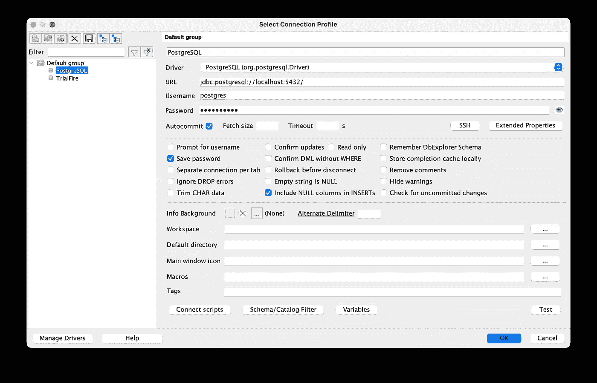

# 快速入门 PostgreSQL 连接和数据导入 Pandas

> 原文：[`towardsdatascience.com/a-quick-start-to-connecting-to-postgresql-and-pulling-data-into-pandas-26fbe7c0fcd5`](https://towardsdatascience.com/a-quick-start-to-connecting-to-postgresql-and-pulling-data-into-pandas-26fbe7c0fcd5)

## 通过将 PostgreSQL 数据导入 Pandas，快速开始数据分析和模型构建

[](https://medium.com/@broepke?source=post_page-----26fbe7c0fcd5--------------------------------)[](https://towardsdatascience.com/?source=post_page-----26fbe7c0fcd5--------------------------------) [Brian Roepke](https://medium.com/@broepke?source=post_page-----26fbe7c0fcd5--------------------------------)

·发布在 [Towards Data Science](https://towardsdatascience.com/?source=post_page-----26fbe7c0fcd5--------------------------------) ·4 分钟阅读·2023 年 2 月 5 日

--


[Sergi Ferrete](https://unsplash.com/@sergiferrete?utm_source=medium&utm_medium=referral) 提供的照片，发布在 [Unsplash](https://unsplash.com/?utm_source=medium&utm_medium=referral)

# 什么是 PostgreSQL？

[PostgreSQL](https://www.postgresql.org) 是一个强大的 **关系数据库管理系统**（RDBMS），许多组织都在使用它。连接到它很简单，得益于优秀的 Python 生态系统，将数据导入 Pandas 的数据框也同样简单。让我们看一个简单的例子，帮助你入门。

# 本地运行 PostgreSQL

本地运行 PostgreSQL 的一种简单方法是使用 [Docker](https://www.docker.com)。如果你尚未安装 Docker，可以 [在这里](https://www.docker.com/products/docker-desktop) 下载。安装 Docker 后，你可以运行以下命令来启动一个 PostgreSQL 容器。

前往 [Docker Hub](https://hub.docker.com/) 搜索 `postgres`。你会看到几个不同的镜像。我们需要的是 `postgres` 镜像；你可以使用以下命令将其拉取下来。

```py
docker pull postgres
```

然后，你可以运行以下命令（按照 Docker Hub 上的文档）来启动一个容器。

```py
docker run --name postgres -p 5432:5432 -e POSTGRES_PASSWORD =postgrespw -d postgres
```

你可以使用任何支持的 SQL 工具连接到数据库，例如 [SQL Workbench](https://www.sql-workbench.eu/index.html)。



作者提供的图片

```py
CREATE DATABASE MAIN;

CREATE TABLE CONTACTS (
 id integer PRIMARY KEY GENERATED BY DEFAULT AS IDENTITY,
 FIRST_NAME varchar(255),
 LAST_NAME varchar(255)
);

INSERT INTO CONTACTS (FIRST_NAME, LAST_NAME)
VALUES ('Brian', 'Roepke');

SELECT * FROM CONTACTS;
```

运行上述命令将创建一个名为 `MAIN` 的数据库和一个名为 `CONTACTS` 的表。它还会向表中插入一行数据，然后从表中选择所有行；这应该能让你开始一个简单的本地 PG 设置。

# 导入

我们首先需要导入所需的库。我们将需要`psycopg2`库来连接 PostgreSQL，还需要`pandas`库来处理数据。此外，我们还将使用`pandas`、`os`、`urllib`和`sqlalchemy`来帮助我们连接到数据库。

```py
import pandas as pd
import psycopg2
import os
from sqlalchemy import create_engine
from urllib.parse import quote_plus
```

接下来，我们要确保不将敏感信息硬编码到代码中，而是从环境变量中提取。如果您想了解更多关于此过程的信息，请查看这篇[文章](https://www.dataknowsall.com/envvar.html)。

接下来，我们需要确保连接字符串中的任何信息都**正确 URL 编码**，例如用户名和密码，这可以通过`urllib`中的`quote_plus`函数轻松实现。让我们快速看一下示例密码及其编码方式。

```py
fake_pw = "p@ssw0rd'9'!"
print(quote_plus(fake_pw))
```

```py
p%40ssw0rd%279%27%21
```

接下来，我们可以创建包含连接到数据库所需所有信息的**连接字符串**。我们将使用字符串格式（在字符串前加上`f`）来插入变量。我们还将使用`quote_plus`函数来对用户名和密码进行编码。

```py
uri = f"postgresql+psycopg2://{quote_plus(user)}:{quote_plus(pw)}@{host}:{port}/{db}"
alchemyEngine = create_engine(uri)
```

除了连接字符串，我们还将创建一个**SQLAlchemy 引擎**。

就这样！假设你没有收到错误消息，现在你已经连接到你的 PostgreSQL 数据库。让我们看看如何将数据提取到 Pandas 数据框中。

首先，我们将以字符串的形式定义一个查询。这里的最佳实践是使用三重引号（`"""`），这样可以在多行中编写查询，同时避免查询本身包含引号时的冲突，例如`WHERE FIRST_NAME = 'Brian'`。

```py
q = """SELECT * FROM CONTACTS"""
```

接下来，我们将创建之前创建的`alchemyEngine`的连接。

```py
dbConnection = alchemyEngine.connect();
```

然后我们将使用`pandas`中的`read_sql`函数将数据提取到数据框中。

```py
df = pd.read_sql(q, dbConnection);
```

现在我们有了数据框，可以显示前几行并查看数据。

```py
df.head()
```

一个最佳实践是完成后关闭连接。

```py
dbConnection.close();
```

# 结论

PostgreSQL 是一个强大的关系数据库管理系统（RDBMS），被许多公司使用。我们介绍了如何连接到它并将数据导入 Pandas 数据框。我们还讨论了一些最佳实践，如将凭据存储在环境变量中，以及如何轻松地 URL 编码用户名和密码，这些密码通常包含不受支持的字符。

*如果你喜欢阅读这样的故事并希望支持我作为一名作者，可以考虑注册成为 Medium 会员。每月 5 美元，您可以无限访问数千篇文章。如果您通过* [*我的链接*](https://medium.com/@broepke/membership)*注册，我将获得一小笔佣金，而您无需支付额外费用。*
