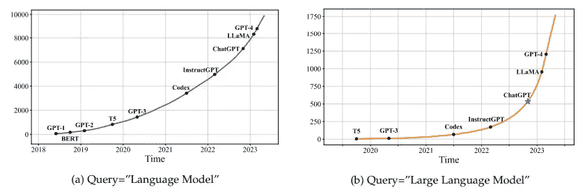
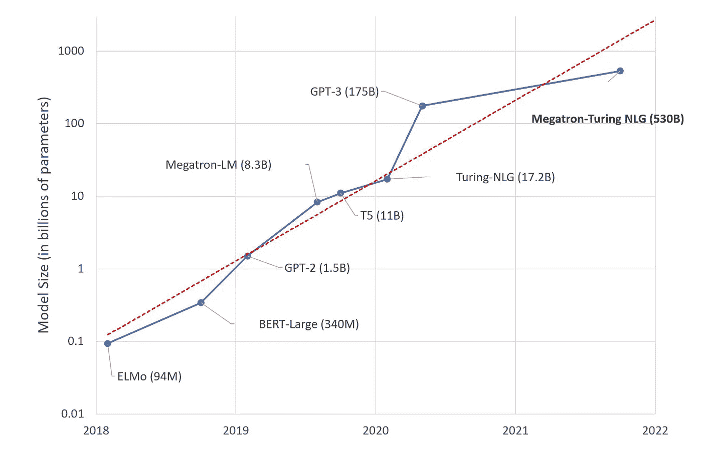
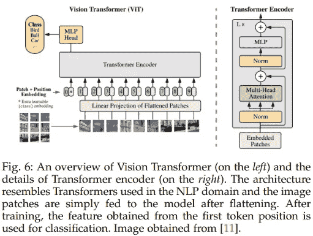
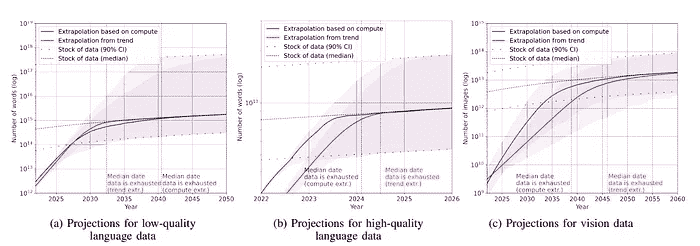
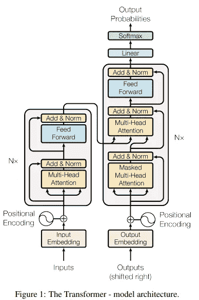
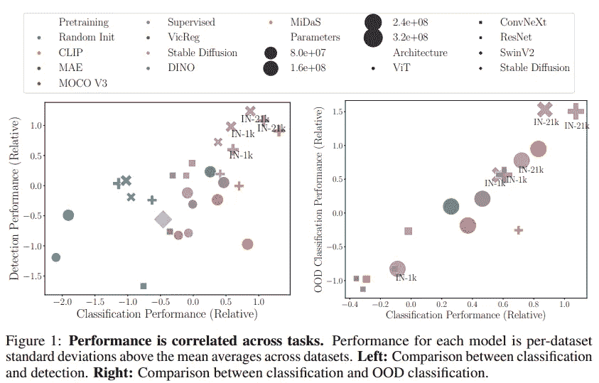
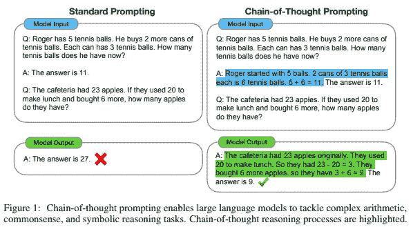
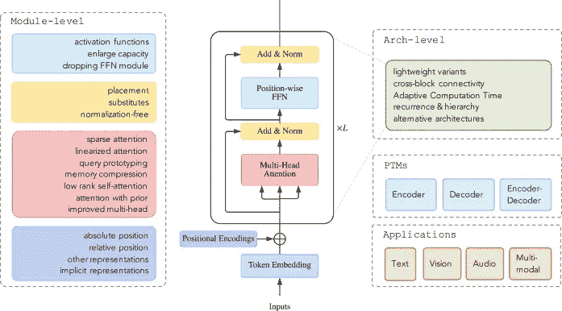

# 对变换器的悼歌？

> 原文：[`towardsdatascience.com/a-requiem-for-the-transformer-297e6f14e189`](https://towardsdatascience.com/a-requiem-for-the-transformer-297e6f14e189)

## |观点| AI| 大型语言模型|

## 变换器会成为引领我们迈向人工通用智能的模型吗？还是会被替代？

 [Salvatore Raieli](https://salvatore-raieli.medium.com/?source=post_page-----297e6f14e189--------------------------------)

·发表于[Towards Data Science](https://towardsdatascience.com/?source=post_page-----297e6f14e189--------------------------------) ·阅读时间 18 分钟·2023 年 12 月 1 日

--

图片来源于[Stefany Andrade](https://unsplash.com/@stefany_andrade?utm_source=medium&utm_medium=referral) 在[Unsplash](https://unsplash.com/?utm_source=medium&utm_medium=referral)

变换器在人工智能领域主导了六年，成为所有人工智能子领域的最先进技术。从[自然语言处理 (NLP)](https://en.wikipedia.org/wiki/Natural_language_processing) 到计算机视觉，再到声音和图表，各个领域都有表现优异的专用变换器。

+   这个领域还会持续多久？

+   变换器真的还是最好的架构吗？

+   它会在不久的将来被替代吗？

+   它的主导地位面临什么威胁？

本文尝试回答这些问题。从变换器为何如此成功以及哪些因素使其在众多领域中立足开始，我们将分析它是否仍然拥有无可争议的主导地位，哪些因素威胁到它的霸主地位，以及是否存在潜在的竞争者。

# 一个帝国的简要历史

图片来源于[Markus Spiske](https://unsplash.com/@markusspiske?utm_source=medium&utm_medium=referral) 在[Unsplash](https://unsplash.com/?utm_source=medium&utm_medium=referral)

> “所有的帝国都会变得傲慢。这是它们的本性。” ― 爱德华·拉瑟福德
> 
> 帝国不可避免地衰落，当它们衰落时，历史会根据它们留下的遗产来评判它们。—— 诺亚·费尔德曼

[“Attention Is All You Need](https://arxiv.org/pdf/1706.03762.pdf)” 是我们今天所知的人工智能的基础。生成型 AI 及其成功的根源都在于一个种子：**变换器**。

[transformer](https://en.wikipedia.org/wiki/Transformer_(machine-learning_model)) 最初是为了解决 [RNNs](https://en.wikipedia.org/wiki/Recurrent_neural_network) 的平行化不足，并能够建模序列中单词之间的长距离关系。其理念是为模型提供一个系统，以区分序列中哪些部分最重要（即注意力的关注点，[attention](https://en.wikipedia.org/wiki/Attention_(machine_learning))）。这一切都是为了改进机器翻译。

然而，这些因素使得 [transformer](https://en.wikipedia.org/wiki/Transformer_(machine_learning_model)) 更好地理解文本。此外，平行化使得模型在规模和更大的数据集上都能扩展。 [GPU](https://en.wikipedia.org/wiki/Graphics_processing_unit) 的兴起进一步展示了像 Transformer 这样的可平行化架构的好处。

因此，Transformer 崛起成为了 AI 的新王者。一个帝国在极短的时间内建立起来。事实上，如今所有流行的模型都是 Transformer：[ChatGPT](https://en.wikipedia.org/wiki/ChatGPT)、[Bard](https://en.wikipedia.org/wiki/Bard_(chatbot))、[GitHub Copilot](https://en.wikipedia.org/wiki/GitHub_Copilot)、[Mistral](https://arxiv.org/abs/2310.06825)、[LLaMA](https://en.wikipedia.org/wiki/LLaMA)、Bing Chat、[稳定扩散](https://en.wikipedia.org/wiki/Stable_Diffusion)、[DALL-E](https://en.wikipedia.org/wiki/DALL-E)、Midjourney 等等。

包含“语言模型”和“大型语言模型”关键短语的 arXiv 论文的累积数量趋势。图像来源：[这里](https://arxiv.org/pdf/2303.18223.pdf)

这是因为 Transformer 很快适应了许多超越语言的任务。

> 即使是最庞大的帝国也会在某个时刻衰落；Transformer 的统治正在发生什么？

# “脚踏实地的巨人”

图像来源：[这里](https://huggingface.co/blog/large-language-models)

当 transformer 被引入时，它的性能震惊了世界，并引发了参数竞赛。曾经一度，我们看到模型的增长速度如此之快，以至于它被称为“*AI 的新摩尔定律*。”这种增长一直持续到 2022 年 [Megatron](https://huggingface.co/docs/accelerate/usage_guides/megatron_lm)（530 B）和 [Google PaLM](https://ai.google/discover/palm2/)（540 B）发布。**然而我们仍未见到万亿参数。**

当深度卷积网络展示其高效性（VGG 模型）时，[卷积神经网络](https://en.wikipedia.org/wiki/Convolutional_neural_network)在短时间内从 16 层的[VGG16](https://arxiv.org/abs/1409.1556)发展到 201 层的[DenseNet201](https://arxiv.org/abs/1608.06993)。除了结果和性能外，这也是社区兴趣的证明。这种水平和垂直增长（以及对基础模型的渐进性变化）的模式在 2021 年停止了，当时社区相信[视觉变换器（ViTs）](https://huggingface.co/docs/transformers/model_doc/vit)优于卷积神经网络。

视觉变换器。图片来源：[这里](https://arxiv.org/pdf/2101.01169.pdf)

> 为什么变换器的增长停止了？它们也被替代了吗？

**不，但导致变换器增长的一些前提已经消失。**

这种增长受到了所谓的[幂律](https://en.wikipedia.org/wiki/Power_law)的激励。[根据 OpenAI](https://arxiv.org/abs/2001.08361)的说法，通过增加参数数量，特性会突然显现。因此，扩大模型规模会使模型发展出在某一规模以下无法观察到的特性。遗憾的是，斯坦福研究人员认为这些特性是偏差导致的海市蜃楼。

 ## AI 中的新兴能力：我们在追逐神话吗？

### 关于大语言模型新兴特性的视角改变

[towardsdatascience.com

扩大模型意味着花费更多。更多参数、更多计算、更多基础设施、更高的电力消耗（以及更多的碳排放）。**这值得吗？**

实际上，[DeepMind 与 Chinchilla](https://arxiv.org/abs/2203.15556)表示，性能的提升不仅与参数数量有关，还与数据量有关。因此，如果你想要一个拥有数十亿参数的模型，你必须拥有足够的令牌来训练它。**遗憾的是，我们人类无法产生足够的内容来训练一个万亿参数的模型。**

人类数据是有限资源。图片来源：[这里](https://arxiv.org/pdf/2211.04325.pdf)

此外，影响模型性能的不仅仅是文本的数量。**而是文本的质量。** 这也是一个痛点，因为收集大量未经筛选的文本并不是一个好主意（即从互联网上下载时不加选择）。

 ## 说一次！重复词汇并不能帮助 AI

### 重复令牌如何以及为何对大语言模型造成伤害？为什么这是个问题？

[towardsdatascience.com

另外，使用人工智能生成文本并不是一个好主意。理论上，人们可以使用一个 LLM 并要求它无限期地生成文本。问题在于，使用这些文本训练的模型只能模仿另一个 LLM，肯定不能超越它。

> 总体而言，我们的关键结论是，模型模仿并不是免费的午餐：今天的开源语言模型与其闭源对应物之间存在一个能力差距，这个差距无法通过廉价的模仿数据微调来弥合。 ([source](https://arxiv.org/pdf/2305.15717.pdf))

[## 模仿游戏：驾驭开源与专有模型之间的差距](https://levelup.gitconnected.com/the-imitation-game-taming-the-gap-between-open-source-and-proprietary-models-627374b390e5?source=post_page-----297e6f14e189--------------------------------)

### 模仿模型能否达到像 ChatGPT 这样的专有模型的性能？

[levelup.gitconnected.com](https://levelup.gitconnected.com/the-imitation-game-taming-the-gap-between-open-source-and-proprietary-models-627374b390e5?source=post_page-----297e6f14e189--------------------------------)

**另一个要点是，这些巨大的模型在部署上也存在问题。** 较小的模型性能很好，尤其是在某些任务中。可以将其提炼得到更小的专用模型。

**带回家的信息：巨大的变换器范式正面临危机。每年我们会看到更大模型的想法已经结束。**

毕竟，问题在于实际性（和成本）。一旦进入生产阶段，AI 的成本可能非常高。例如，[微软据说在 GitHub Copilot 上亏损巨额资金](https://www.techradar.com/pro/microsoft-is-reportedly-losing-huge-amounts-of-money-on-github-copilot)（每用户每月 20 美元）。据一份报告，[ChatGPT 每天的成本为 70 万美元](https://technext24.com/2023/08/14/chatgpt-costs-700000-daily-openai/)，如果 ChatGPT 不能盈利，投资者可能不会继续承担这些成本。

因此，我们可以期待公司更倾向于开发专注于特定任务和业务的较小模型。

> 好吧，变换器不再增长了，但它仍然是游戏中最好的架构吗？

那么，让我们在下一节中讨论这个话题…

# 卷积仍然备受关注

照片由 [Ricardo Gomez Angel](https://unsplash.com/@rgaleriacom?utm_source=medium&utm_medium=referral) 提供，来源于 [Unsplash](https://unsplash.com/?utm_source=medium&utm_medium=referral)

> 首先，为什么变换器在各个领域都成功？

在最初的描述中，变换器结合了三个基本概念：首先是序列的位置信息表示（[嵌入](https://en.wikipedia.org/wiki/Embedding) + 位置编码），然后是序列元素的关联（自注意力），最后是构建层级表示（层叠）。

当文章[*Attention is All You Need*](https://arxiv.org/abs/1706.03762)发布时，它基于十年的 NLP 研究，并整合了之前发布的最佳成果：

+   [词嵌入](https://arxiv.org/abs/1301.3781)在 2013 年具有革命性，因为它能将词语转化为向量表示。此外，对嵌入的操作具有逻辑和语法上的意义。

+   自注意力在[并非所有序列元素](https://arxiv.org/abs/1409.0473)都重要的革命性思想上有所改进。此外，它还解决了循环神经网络长期存在的问题和[梯度消失](https://en.wikipedia.org/wiki/Vanishing_gradient_problem)问题。

+   [层级表示](https://distill.pub/2020/circuits/zoom-in/)则来自二十年的卷积神经网络研究，我们意识到通过堆叠层，模型可以学习到数据的越来越复杂的表示。

其威严的骨架，变换器。图片来源：[这里](https://arxiv.org/abs/1706.03762)

这些元素使得他在 NLP 领域取得成功，但与此同时，它们也是在其他领域获胜的关键。首先，变换器具有非常弱的归纳偏差，使其能够适应几乎任何类型的数据。其次，层级表示和连接序列元素的能力在 NLP 之外也有广泛的应用。

**成功的故事，除非变换器自 2017 年起未曾改变，开始逐渐老化。**

变换器的核心最终是自注意力。但这颗心脏泵送的血液过多。实际上，它的计算成本是巨大的。

因此，几个团队尝试寻找对自注意力的线性替代方法。然而，所有这些变体都被证明表现不如自注意力。

**而什么看起来是一个不错的替代品？** 无非就是古老的卷积。正如他们在 Hyena 中所展示的，通过稍微调整卷积，你可以获得一个表现类似变换器的好模型。

 [## 欢迎回到 80 年代：卷积可能会击败变换器

### Hyena 模型展示了卷积如何比自注意力更快。

[levelup.gitconnected.com](https://levelup.gitconnected.com/welcome-back-80s-transformers-could-be-blown-away-by-convolution-21ff15f6d1cc?source=post_page-----297e6f14e189--------------------------------)

这颇具讽刺意味，因为自 2021 年以来，[视觉变换器](https://en.wikipedia.org/wiki/Vision_transformer)（ViTs）被认为在计算机视觉中优于 ConvNets。这似乎标志着卷积网络（[ConvNets](https://en.wikipedia.org/wiki/Convolutional_neural_network)）在其领域中未被规范的霸主地位的终结。**但事实是？**

似乎 ConvNets 已经实现了复仇。令人惊讶，就像认为恐龙会通过驱逐哺乳动物重新掌控大陆一样。实际上，[DeepMind 发布的最新文章](https://arxiv.org/abs/2310.16764)基本上指出 ViTs 与 ConvNets 的比较并不公平。通过给 ConvNets 提供相同的计算预算，它们在 ImageNet 上的表现与 ViTs 相似。

 [## 卷积网络是否已经过时

### 视觉变换器似乎取代了卷积网络，但它们真的更好吗？

levelup.gitconnected.com](https://levelup.gitconnected.com/have-convolutional-networks-become-obsolete-245969f6b9d9?source=post_page-----297e6f14e189--------------------------------)

[另一篇文章](https://arxiv.org/abs/2310.19909)似乎也朝着同样的方向发展，卷积网络似乎与变换器具有竞争力：

> 同样的获胜者在较小规模下也获胜。在较小的主干网络中，ConvNeXt-Tiny 和 SwinV2-Tiny 表现突出，其次是 DINO ViT-Small。（[source](https://arxiv.org/abs/2310.19909)）

图片来源：[这里](https://arxiv.org/abs/2310.19909)

> 影响这种模型性能的主要因素有三个：其架构、预训练算法和预训练数据集。（[source](https://arxiv.org/abs/2310.19909)）

如果预训练算法和预训练数据集相同，那么剩下的只有模型架构。**然而，在所有条件相等的情况下，ViTs 的所谓优越性似乎并未显现。** 以至于 DeepMind 的作者所说的内容似乎像是承认了失败：

> 尽管 ViTs 在计算机视觉领域的成功令人印象深刻，但在我们看来，尚无强有力的证据表明经过预训练的 ViTs 在公平评估时优于经过预训练的 ConvNets。（[source](https://arxiv.org/abs/2310.16764)）

**哎呀。因此我们可以说，在计算机视觉领域，ViTs 至少并不优于卷积网络。是吗？**

> 我们注意到，ViTs 在特定背景下可能具有实际优势，例如在多个模态中使用相似的模型组件的能力。（[source](https://arxiv.org/abs/2310.16764)）

作者指出，它们可能仍然更优，因为在我们对多模态模型感兴趣时是有用的。考虑到特征也可以从卷积网络中提取，使用相同的模型在多个模态中显然更方便。

然而，这是一个非常重要的点，实证数据表明，至少在计算机视觉中，transformer 并不优于其他架构。**这让我们不禁思考它的主导地位是否会在其他人工智能领域受到挑战。例如，transformer 核心领域的情况如何？它仍然是自然语言处理中的最佳模型吗？**

# 文本 Dominion 的基础很脆弱

图片由[Sigmund](https://unsplash.com/@sigmund?utm_source=medium&utm_medium=referral)拍摄，来源于[Unsplash](https://unsplash.com/?utm_source=medium&utm_medium=referral)

简短回答：**是的，但它的至高无上的地位可能会结束。** 让我们从它为何在 NLP 中如此成功开始。

Transformer 相比 RNN 的初始优势在于容易并行化。这导致了最初的狂热和对参数的急切追求。在此过程中，我们意识到是什么使得 Transformer 在 NLP 中获胜：**上下文学习**。

上下文学习是一个非常强大的概念：只需几个示例，模型就能够映射输入和输出之间的关系。所有这一切无需更新任何参数。

 ## 你需要了解的所有关于上下文学习的内容

### 什么是及其工作原理是什么，让大型语言模型如此强大

towardsdatascience.com

基本上，这是自注意力的一个意外效果（且尚未完全理解）。[根据 Anthropic](https://transformer-circuits.pub/2022/in-context-learning-and-induction-heads/index.html)的说法，有一些引导头实际上连接了模型的不同部分，并允许这种映射。

**这种奇迹是模型所谓推理能力的基础**。此外，能够如此多地实验提示也带来了令人难以置信的结果。

在实践中，无需重新训练模型，[提示技术](https://en.wikipedia.org/wiki/Prompt_engineering)可以被创建以提升模型在推理方面的能力。[**思维链**](https://arxiv.org/abs/2201.11903)就是这种方法的最佳示例。利用这种策略，LLM 能够解决需要推理的问题（数学问题、编程问题等）。

图片来源：[here](https://arxiv.org/abs/2201.11903)

然而，必须考虑到：

> 然而，这种多步骤生成过程并不意味着 LLM 具有强大的推理能力，因为它们可能仅仅模拟了人类推理的表面行为，而不是真正理解精确推理所需的基础逻辑和规则。[来源](https://arxiv.org/abs/2310.20689v1)

翻译过来，我们已经创造了一个见识过整个人类知识的鹦鹉，能够将提示中的问题与它在训练中看到的内容联系起来。

> 为什么这种优势极其脆弱？

**因为鹦鹉不一定是变压器。** 我们需要任何能够接受自然语言指令作为输入并进行上下文学习的模型，然后我们可以像使用变压器一样使用所有的提示工程技术。

> 好吧，如果我们不一定需要变压器，那我们的新“随机鹦鹉”在哪里？

# 官僚制度减缓了创新

图片由[Nam Anh](https://unsplash.com/@bepnamanh?utm_source=medium&utm_medium=referral)提供，[来源于 Unsplash](https://unsplash.com/?utm_source=medium&utm_medium=referral)

主要原因是，目前工业界的研究集中在将变压器（尽管有其缺陷）投入生产。此外，将一个我们了解较少的更好架构投入生产也是有风险的。

> 让我们深入了解一下…

首先，谷歌、META、亚马逊和其他大型科技公司拥有大量资源。然而，这些大公司却受到庞大的内部官僚制度的困扰：

> 谷歌是一个“曾经伟大的公司”，由于其官僚化的“迷宫”，它“逐渐停止了运作”。[来源](https://fortune.com/2023/02/16/alphabet-google-former-employee-praveen-seshadri-essay-criticizes-bureaucratic-maze/)

官僚制度的增加导致了生产力的下降和整体放缓。为了实施一个小变化，必须获得越来越长的指挥链的批准，并遵循[日益复杂的协议](https://www.theinformation.com/articles/aws-new-ceo-faces-a-fresh-challenge-bureaucracy)。简而言之，大型科技公司似乎有着与帝国相同的问题。

这显然也影响了创新：

> “如果要总结一下，我会说信噪比是让我疲惫的原因。创新挑战… 随着风险容忍度的降低，只会变得更糟。”前谷歌高管诺姆·巴丁。[来源](https://appleinsider.com/articles/21/06/21/google-is-risk-averse-has-paralyzing-bureaucracy-executives-say)

当然，像谷歌或微软这样的公司在选择上更加谨慎也是有充分理由的。例如，[谷歌在 Bard 错误回答有关詹姆斯·韦布太空望远镜的问题时损失了数十亿美元](https://fortune.com/2023/02/08/google-bard-ai-mistake-ad-stock-price-market-cap/)。

**这些声誉风险已经成为创新的巨大阻碍**。只有当技术成熟且风险较低时才会被采纳。

**最好的例子是苹果公司。** 该公司只有在技术成熟并且认为其有利可图时才会采用。一般来说，近年来它已停止创新（尽管仍保持创纪录的利润）。到目前为止，它一直没有参与生成性 AI 领域，因为它认为尚不成熟。

> 苹果被称为“快速跟随者”；它喜欢等到新技术成熟后，再推出自己的苹果版本。([来源](https://www.fastcompany.com/90867819/apples-silence-on-generative-ai-grows-louder))
> 
> 那么，这种对创新的抵制难道不应该有利于变压器技术吗？

**是的，但我们忘记了开源**。不仅仅是大型科技公司在进行研究，还有许多研究小组在调查 AI。他们可能没有 FAANGs 的资源，但独立研究合在一起是一股强大的力量。

**谷歌自己也承认这一点。** 实际上，山景城对微软或 OpenAI 的恐惧较少：

> “令人不安的真相是，我们并未处于赢得这场军备竞赛的位置，OpenAI 也一样。在我们争吵的时候，第三方已经悄悄地抢占了我们的市场，”谷歌泄露的文件，[来源](https://www.theguardian.com/technology/2023/may/05/google-engineer-open-source-technology-ai-openai-chatgpt)

**第三方正是开源社区。** 一旦[LLaMA](https://ai.meta.com/llama/)发布，它立即收到了带有指令调整、量化和[人类反馈强化学习](https://en.wikipedia.org/wiki/Reinforcement_learning_from_human_feedback)（RLHF）的改进版本。Mistral 7B 刚刚推出，两组团队扩展了上下文长度（首先到[32K](https://huggingface.co/amazon/MistralLite)，然后到[128K](https://huggingface.co/NousResearch/Yarn-Mistral-7b-128k)）。

开源模型迅速变得可定制且便宜，并获得了一个庞大且活跃的社区的支持。开源社区立即采用每一个突破，并迅速改进它。大型公司在内部官僚主义上浪费时间，并因声誉损害的风险而受到限制，导致可能落后。

**这个杰出的社区是变压器继任者的沃土。如果一个模型展示了克服变压器局限性的能力，它可能会获得如海啸般的力量。**

> 但让我们看看最后一点，为什么尽管如此，变压器技术还没有被替代

# 叹息号的船

图片由[Katherine McCormack](https://unsplash.com/@kathymack?utm_source=medium&utm_medium=referral)拍摄，来源于[Unsplash](https://unsplash.com/?utm_source=medium&utm_medium=referral)

> 古代哲学家提出了一个问题：经过数个世纪的维护，如果这些修补的 Theseus 号船的每一个部分都被逐个替换，它是否仍然是同一艘船？— [来源](https://en.wikipedia.org/wiki/Ship_of_Theseus)

**transformer 在保持不变的同时发生了变化吗？** 文献的简要搜索清楚地表明，如今有数百种 transformer 变体（如果考虑到所有位置编码、注意力等的变化）。**所以 LLMs 并不是我们迄今为止看到的完全相同的模型。**

Transformer 变体的分类。图片来源：[这里](https://www.sciencedirect.com/science/article/pii/S2666651022000146)。知识共享，许可证：[这里](https://creativecommons.org/licenses/by/4.0/)

现在我们处于[研究的增量阶段](https://medium.com/mlearning-ai/the-decline-of-disruptive-science-730cc3fe28b1)，在这个阶段，继续提出对相同模型的修改，以尝试克服现有技术的局限性。

**在某种意义上，我们已经达到了 transformer 的极限。** 扩大模型没有意义，因为这不会带来好处，也没有足够的 tokens。其次，transformer 的计算成本高昂，**如果说过去性能重要的话，如今应用才是关键**。第三，COT 和其他技术只是对 transformer 真实极限的补丁：模型[并不真正具备理解和概括的能力](https://arxiv.org/abs/2311.00871)。自注意力允许模型利用在训练过程中学到的大量知识，但它仍然是一个随机的鹦鹉。

> transformer 是一种快速捕捉任何输入不同部分之间交互的方式。它是一种通用方法，可以捕捉句子中片段之间的交互，或音乐中的音符，或图像中的像素，或蛋白质的部分。它可以用于任何任务。” — Ashish Vaswani，transformer 论文的作者（[来源](https://www.ft.com/content/37bb01af-ee46-4483-982f-ef3921436a50?accessToken=zwAGASoZXEbgkc83uwGv7kZEg9OYL-85IUNqUA.MEUCIGAX418D_QPFvxq-QLYReJE4g1m7wcZRXGk6pf1HqVQQAiEAn53oHV1zcVD3MYxeTbCWsSf_BIiSf_E_JcvZfhzlScw&sharetype=gift&token=4178b09d-f17c-4285-a18c-446dce2bdb54))

**从成本的角度来看，我们将会看到越来越多的小型专用模型用于不同的应用。** 此外，今天的研究大多在寻找一种比 transformer 更便宜的替代品（例如 Hyena，[Monarch Mixer](https://together.ai/blog/monarch-mixer)，[BiGS](https://arxiv.org/pdf/2212.10544.pdf) 和 [MEGA](https://arxiv.org/pdf/2209.10655.pdf)）。

此外，变换器模型[缺乏持续学习能力](https://www.forbes.com/sites/robtoews/2021/06/01/what-artificial-intelligence-still-cant-do/?sh=234a649c66f6)（它们具有静态参数）且缺乏解释性。[液体神经网络](https://arxiv.org/pdf/2006.04439.pdf)（一种受蠕虫大脑工作方式启发的模型）旨在特别解决这两个问题。

此外，单一的变换器理念已被放弃，人们更多地考虑将多个模型组合在一起工作（[GPT-4 似乎是由 8 个模型组成的](https://pub.towardsai.net/gpt-4-8-models-in-one-the-secret-is-out-e3d16fd1eee0)）。[Sakana AI 也追求相同的概念](https://www.bloomberg.com/news/articles/2023-08-17/ex-google-stability-ai-researchers-launch-ai-startup-that-takes-cues-from-fish#xj4y7vzkg)，通过借鉴集体智能的理念。

> 但这些模型会取代变换器吗？

**可能不会。** 或者在某些情况下，它们会被采用以满足特定需求。现阶段，这些模型尚未解决变换器的所有问题，对于许多应用来说，老旧的变换器已经足够。

目前，变换器在许多领域几乎具有绝对的主导地位。此外，许多研究和工作都基于这一架构并促成了其优化。**因此，替代它是具有挑战性的。**

像液体网络或群体智能这样的理念表明，人们在寻找超越构建更高效、更便宜模型的替代方案。然而，今天的研究仍未能克服变换器的真正限制。因此，变换器将被替代，但我们尚不清楚由什么来取代。它将是一项基于新理论进展的新技术。

# TL;DR

+   变换器并行化的优势导致了大规模语言模型的过度增长，这种情况已经结束。意识到需要大量高质量数据使得对创建更大模型的热情减退。此外，部署成本使得更大的模型难以实现。

+   变换器在人工智能所有领域中的绝对主导地位已经不再。最近的一些论文表明，当以相同方式训练时，卷积网络在计算机视觉领域对变换器具有竞争力。它们在自然语言处理中的主导地位仍然不可否认，但基于脆弱的前提。

+   变换器可能会被一种能够接受文本指令并在上下文中学习的模型取代。所有的提示工程技术可以保持不变。

+   大型公司因官僚作风而不愿创新，现在专注于应用研究。另一方面，开源社区非常活跃，潜在的创新会被迅速采纳和推动。

+   变压器的真正优势在于它多年拥有绝对主导地位。因此，它受到了大量关注、研究和优化。能够取代这样一个模型是非常困难但仍然必要的挑战。实际上，我们已经基本达到了这项技术的极限，需要一种能够超越它的新技术。

+   虽然目前我们没有替代方案，但研究正在寻找能够超越它的模型。

# 离别思考

图片来自 [Saif71.com](https://unsplash.com/@saif71?utm_source=medium&utm_medium=referral) 在 [Unsplash](https://unsplash.com/?utm_source=medium&utm_medium=referral)

目前，人工智能的研究主要是增量性的，特别是在模型架构方面。大型公司现在致力于最终将这些模型投入生产并用于商业目的。

确实，在经历了一年的重大公告后，相关机构也开始行动，新法律正在准备中，将对人工智能进行规范。这些法律也将在一定程度上定义新的研究方向。如果这些法律过于僵化，将会抑制创新。

> “确实有一些大型科技公司宁愿不与开源竞争，所以他们制造了对人工智能导致人类灭绝的恐惧。这已成为游说者用来推动对开源社区非常有害的立法的武器。” — Andrew Ng ([source](https://finance.yahoo.com/news/google-brain-cofounder-says-big-113049941.html?guccounter=1&guce_referrer=aHR0cHM6Ly93d3cuZ29vZ2xlLmNvbS8&guce_referrer_sig=AQAAACCPVKuuJ47EM3W7q-arne9h3S_l8zr9D-HvVqTp0_5A4D4Co8SiIWFoZHyPteR9rAcLij4bq2MmZoKJ-dGXBNuJUmHToa-wshhX8xBxXysi4fjya2rsPgiCaatOi_8ViZkSPzdS0x-wPhW6AzvMIwlVzsiorSVkVB_XWoCU98xc))

Yann LeCun 也持相同看法。目前，大公司对开源感到恐惧：

> “如果你的恐吓活动成功，它们将*不可避免地*导致你和我认为的灾难：少数公司将控制人工智能。” — Yann LeCun ([source](https://www.telegraph.co.uk/business/2023/10/30/big-tech-stoking-fears-over-ai-warn-scientists/))

无论如何，正如我们所见，没有任何技术会永远主导，而变压器也开始显示出其时代的局限性。考虑到将来会取代它的技术、理论进展、优雅的解决方案以及它将拥有的惊人能力，令人兴奋。

## 你认为什么会取代变压器？你尝试过变压器的替代品吗？在评论中告诉我。

# 如果你觉得这些内容有趣：

*你可以查看我的其他文章，也可以在*[***LinkedIn***](https://www.linkedin.com/in/salvatore-raieli/)***上联系我。*** *查看* [***这个库***](https://github.com/SalvatoreRa/ML-news-of-the-week) *，其中包含每周更新的机器学习和人工智能新闻。* ***我对合作和项目持开放态度*** *，你可以在 LinkedIn 上联系我。*

*这里是我 GitHub 库的链接，我在这里收集了与机器学习、人工智能等相关的代码和许多资源。*

 [## GitHub - SalvatoreRa/tutorial：机器学习、人工智能、数据科学教程…

### 机器学习、人工智能、数据科学教程，包括数学解释和可重复使用的代码（用 Python 编写…

[github.com](https://github.com/SalvatoreRa/tutorial?source=post_page-----297e6f14e189--------------------------------)

*或者你可能对我的一篇近期文章感兴趣：*

 ## 教学是困难的：如何训练小型模型并超越大型模型

### 提取大型模型知识的过程复杂，但一种新方法展现了惊人的表现

[towardsdatascience.com  [## 神经网络集成：什么比神经网络更好？一组神经网络

### 神经网络集成：如何将不同的神经网络结合成一个强大的模型

[级别提升](https://levelup.gitconnected.com/neural-ensemble-whats-better-than-a-neural-network-a-group-of-them-0c9e156fca15?source=post_page-----297e6f14e189--------------------------------)  [## 仅谈论你所读过的内容：LLMs 能否超越其预训练数据进行泛化？

### 揭示大型语言模型中上下文学习的局限性与奇迹

[pub.towardsai.net](https://pub.towardsai.net/speak-only-about-what-you-have-read-can-llms-generalize-beyond-their-pretraining-data-041704e96cd5?source=post_page-----297e6f14e189--------------------------------)  [## 机器学习新闻：11 月 6 日至 12 日

### OpenAI 开发，TopicGPT，新芯片等

salvatore-raieli.medium.com](https://salvatore-raieli.medium.com/ml-news-week-6-12-november-9878eb0a7005?source=post_page-----297e6f14e189--------------------------------)

# 参考文献

这是我撰写本文时参考的主要文献列表，仅引用了每篇文章的首名。

1.  Vaswani, 2017, 《注意力即是你所需要的一切》，[link](https://arxiv.org/abs/1706.03762)

1.  Huang, 2016, 《密集连接卷积网络》，[link](https://arxiv.org/abs/1608.06993)

1.  Zhao, 2023, 《大型语言模型的综述》，[link](https://arxiv.org/abs/2303.18223)

1.  Smith, 2023, 《ConvNets 在规模上匹配视觉变换器》，[link](https://arxiv.org/abs/2310.16764)

1.  Goldblum, 2023, 《骨干的战斗：预训练模型在计算机视觉任务中的大规模比较》，[link](https://arxiv.org/abs/2310.19909)

1.  Wang, 2023, 《无注意力的预训练》，[link](https://arxiv.org/pdf/2212.10544.pdf)

1.  Ma, 2023, 《Mega：配备移动平均的门控注意力》，[link](https://arxiv.org/pdf/2209.10655.pdf)

1.  Hasani, 2020, 《液态时间常数网络》，[link](https://arxiv.org/pdf/2006.04439.pdf)

1.  Yadlowsky, 2023, 《预训练数据混合使变换器模型具备狭窄的模型选择能力》，[link](https://arxiv.org/abs/2311.00871)

1.  Kaplan, 2020, 《神经语言模型的扩展规律》，[link](https://arxiv.org/abs/2001.08361)

1.  Hoffman, 2022, 《训练计算最优的大型语言模型》，[link](https://arxiv.org/abs/2203.15556)

1.  Simonyan, 2014, 《用于大规模图像识别的非常深的卷积网络》，[link](https://arxiv.org/abs/1409.1556)

1.  Khan, 2022, 《视觉中的变换器：综述》，[link](https://arxiv.org/pdf/2101.01169.pdf)

1.  Wei, 2022, 《链式思考提示在大型语言模型中引发推理》，[link](https://arxiv.org/abs/2201.11903)

1.  Touvron, 2023, 《LLaMA：开放高效的基础语言模型》，[link](https://arxiv.org/abs/2302.13971)
