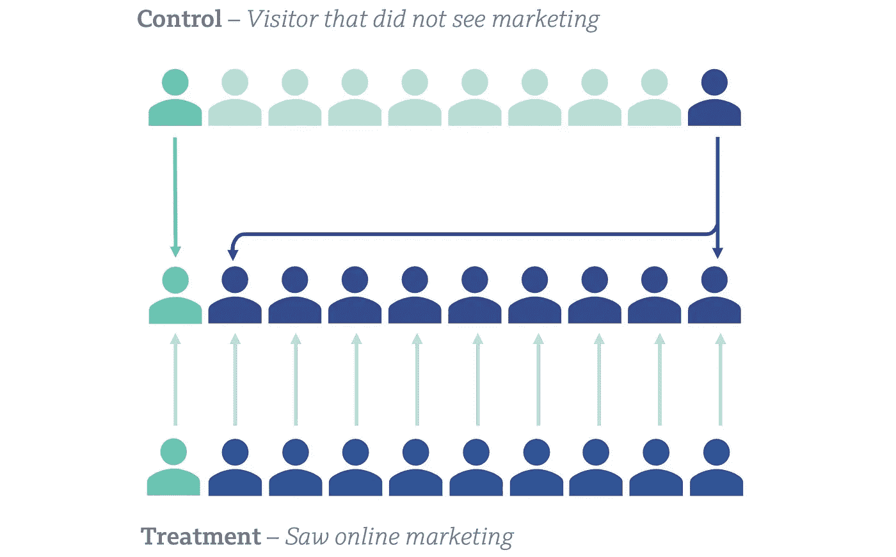

# 倾向评分建模方法回顾

> 原文：[`towardsdatascience.com/a-review-of-propensity-score-modelling-approaches-19af9ecd60d9`](https://towardsdatascience.com/a-review-of-propensity-score-modelling-approaches-19af9ecd60d9)

图片为作者原创。

## 对使用倾向评分进行因果推断建模的不同方法的回顾

 [Matt Crooks](https://drmattcrooks.medium.com/?source=post_page-----19af9ecd60d9--------------------------------)

·发表于 [Towards Data Science](https://towardsdatascience.com/?source=post_page-----19af9ecd60d9--------------------------------) ·阅读时间 11 分钟·2023 年 5 月 17 日

--

在这篇文章中，我将介绍倾向评分的概念及其用途，然后介绍 3 种常见的方法。我将讨论以下倾向评分模型：

+   *带替代的倾向评分匹配*（PSM）

+   *不带替代的倾向评分匹配*（PSM w/o）

+   *逆倾向评分加权*（IPSW）

# 介绍

评估特定干预或治疗效果的最佳方法是进行随机对照试验（RCT）。在 RCT 中，你将人群随机分为两个组，并只对其中一个组施加干预——这成为你的治疗组。未接受干预的组是对照组。由于对照组和治疗组之间的随机分配，两组之间的特征应无结构性差异。如果治疗后，治疗组的行为（即转化）有所不同，那么我们可以得出这是干预的结果。

然而，有许多情况下无法进行随机对照试验（RCT），包括但不限于：

+   出于伦理原因——例如，产品定价需要在用户之间保持一致

+   治疗效果无法数字化测量，例如广告牌

+   你的技术栈意味着你不能创建两个体验

# 倾向评分建模

> 倾向评分建模允许你对治疗组和对照组进行分层，以去除可能作为混杂因素的行为和人口统计学偏差

比较看到营销的人和未看到营销的人的问题的简化示例。图片为作者原创。

倾向性评分建模允许你在每个人都有*潜在*暴露于治疗的情况下推断干预与反应之间的因果关系。虽然每个人*可能*会暴露于治疗，但并不是每个人都会——总会有些人没有。显然，看到你的干预和没有看到干预的人的行为是不同的——治疗组被暴露是有原因的，对照组则没有。如果导致治疗的行为与转化相关，那么你就有了混杂因素。正是治疗组中人们的特征导致了他们既被暴露于干预又发生了转化。倾向性评分方法允许你对治疗组和对照组进行分层，以去除可能作为混杂因素的行为和人口统计偏差。

在上面的图示中，青色的人更有可能暴露于营销，因此在治疗组中占比过高。如果青色的人比深蓝色的人更有可能转化，那么你自然会期待治疗组有更多转化。然而，这种现象是由青色人的比例驱动的，与某人是否看到营销无关。

# 什么是倾向性评分？

> **倾向性评分**是一个个体将被暴露于治疗的概率。如果我们拿 100 个相同的客户，其中 70 个暴露于治疗，那么它们的倾向性评分都是 0.7

计算倾向性评分的最常见方法是拟合一个逻辑回归分类器来预测治疗组，然后使用与治疗组相关的概率作为倾向性评分。这种方法的好处是操作非常简单，避免了过拟合。缺点是逻辑回归分类器被训练来*分类*每个样本为治疗组或对照组，具体概率只是倾向性评分的代理。

# 倾向性评分模型

有 3 种常用的倾向性评分模型，我们将在本节中讨论每种模型的优缺点。

## 带替换的倾向性评分匹配

> 每个治疗样本会与具有最相似特征的对照样本进行匹配，特征通过倾向性评分进行测量

在倾向性评分匹配中，你将每个治疗样本与具有最相似倾向性评分的对照样本配对。每个对照样本可以与多个治疗样本匹配，并且并不是每个对照样本都会被匹配。

倾向性评分匹配的可视化。中间行显示了匹配的对照组。匹配过程由灰色箭头表示。图片由作者提供。

在上面的图示中，你可以看到：

+   治疗组中的青色人员会与对照组中的一个青色人员进行匹配

+   治疗组中的 9 名海军人员全部与对照组中的唯一一名海军人员匹配。结果是，对照样本被重复了 9 次。

+   对照组中有 8 人未被匹配（浅绿松石色），因此被排除在我们的分析之外。

## 优点

+   进行匹配过程的计算效率高 —— 通常你会使用标准的最近邻算法来实现这一点。

## 缺点

+   多重匹配的对照样本可能会影响治疗效果。

## 无替代的倾向评分匹配

> 每个治疗样本与特征最相似的对照样本进行匹配，但每个对照样本只能被匹配一次。

无匹配 PSM 在匹配执行方式上与 PSM 不同。每个对照样本只能与一个治疗样本匹配。执行匹配过程的顺序可能会影响模型性能，因为首先匹配的治疗样本有更多对照样本可供选择。后来的治疗样本必须与对照组中剩下的样本匹配，这些样本通常没有非常相似的倾向评分。为了消除由于匹配顺序引入的方差，你可以用不同的顺序引导匹配过程，尽管这会增加较大的计算开销。

无匹配的 PSM 的可视化。匹配过程由灰色箭头和虚线表示，虚线表示匹配效果差。图像为作者原创。

在上述可视化中我们可以看到：

+   治疗组中的绿松石色人员与对照组中的一名绿松石色人员匹配。

+   治疗组中的第一个海军人员与对照组中唯一的海军人员匹配。

+   治疗组中剩余的海军人员与对照组中的绿松石色人员匹配 —— 匹配效果差。

## 优点

+   对照组中的每个人最多出现一次，因此没有单个样本可以影响治疗效果。

## 缺点

+   可用于匹配过程的开放源代码包有限。

+   由于需要跟踪哪些样本已经被匹配，这比 PSM 效率低。

+   需要引导抽样，这增加了计算开销。

+   匹配效果差可能导致协变量的残留偏差

# 逆倾向加权

> 每个对照样本都被加权，以便对照组整体上与治疗组匹配。

在逆倾向加权中，我们根据每个对照组样本的倾向评分对其施加一个权重。治疗样本的权重为 1。*i*th 对照样本的权重可以使用以下公式计算：

其中 *pi* 是样本的倾向评分。上述形式的权重意味着相对于处理组，对照组中具有特征不足的样本（倾向评分 ~ 1）被赋予更高的权重，权重 > 1。对照组中具有过多特征的样本（倾向评分 ~ 0）则被赋予较低的权重，权重 < 1。在我们的示例中，我们可以使用以下权重：

IPSW 的可视化。中间一行显示了加权对照组。在这种情况下没有个体匹配过程。图片为作者自制。

在上述视觉效果中，我们可以看到：

+   对照组中的 9 个青色样本贡献了 1 的总权重，以匹配处理组中的一个青色样本

+   对照组中的一个海军蓝样本获得了 9 次投票，以匹配处理组中的 9 个海军蓝样本

## 优点

+   高效，因为我们不是匹配样本，而是对每个样本独立执行可向量化的计算

## 缺点

+   权重较高的样本可能会偏倚处理效果

# 评估倾向评分模型

## 协变量偏差

> 协变量偏差意味着处理组和对照组之间在特征上存在可测量且统计显著的差异

如果你分析了对照组和处理组的特征，很可能会发现它们之间的差异。也许更活跃的用户更可能接触到干预，并出现在你的处理组中。如果你试图提高留存率，那么处理组中更活跃的用户可能会比对照组中的用户留存更长时间，这种情况就属于偏差。倾向评分建模如果应用得当，应当去除对照组和处理组之间在所有特征上的偏差。

我们可以使用绝对标准化均值差来测量与特定协变量相关的偏差，该差异定义为

这里 `x̄` 是样本均值，*t* 和 *c* 的下标分别表示处理组和对照组。|.| 表示取绝对值。对于连续变量，*s* 定义为

对于二元变量，它定义为

σ 是标准差，*n* 是样本数量。在 IPSW 中，我们可以用权重的总和替代 *n —* 1，并且 `x̄` 被替换为加权均值。

*s* 的定义本质上是对照组和处理组方差的加权平均的平方根。加权平均使用 *n —* 1 作为权重，类似于总体的无偏标准差。

如果*smd >* 0.1 对于你的某个协变量，我们就可以得出结论，治疗组和对照组之间存在偏差，并且这个协变量可能作为混杂因素。0.1 的阈值相当于在 AB 测试中使用α = 0.05 的双侧检验来检测统计显著结果。

## 倾向评分的挑战

使用分类器来估计倾向评分有两个问题：

+   ***准确性***：如果我们选取 100 位非常相似的客户，其中 70 人接受了治疗，那么他们的倾向评分都应该是 0.7

+   ***自洽性***：如果我们选取 100 位倾向评分为 0.7 的客户，那么其中 70 人应该接受治疗

为了完全消除倾向评分建模中的偏差，你应该有准确且自洽的倾向评分。

## 解决自洽问题

通过重新调整倾向评分，自洽是相当容易实现的。在下图中，我将倾向评分四舍五入到最接近的 0.01，以将人们分到离散的桶中（*x*轴）。然后，*y*轴上显示的是每个桶中治疗组样本的比例。

一般来说，逻辑回归在较高值时低估了倾向评分，而在较低值时则高估了。大约 70%的倾向评分为 0.6 的人在治疗组中——按定义，这个比例应该是 60%。

我还包含了一条拟合了关系的`tanh`曲线。通过将逻辑回归中的概率通过此`tanh`函数，我们可以重新调整倾向评分以实现自洽。现在倾向评分为 0.6 的人会被调整为 0.7，我们可以看到 70%的人会在治疗组中。

然而，这种方法假设具有相似倾向评分的人具有相似的基础特征——虽然大体上这是真的，但不一定足够准确以消除偏差。

在不同倾向评分下的治疗密度比较（海军蓝点）。粉色线显示了通过数据拟合的*tanh 曲线。图片为作者原创。*

## 解决准确性问题

准确性是一个挑战，因为我们没有任何实际的倾向评分来训练回归模型，这就是为什么我们训练了一个分类器。没有实际的值来与分类器的倾向评分进行比较，我们也无法衡量倾向评分的准确性。准确性本质上是一个潜在变量，我们必须假设如果无法证明我们的倾向评分是不准确的。例如，如果倾向评分是自洽的，并且它们消除了协变量偏差，那么它们可能足够好用。

# 方法概述

以下是总结每种方法优缺点的表格。我定义了三种对倾向建模重要的特征，它们是：

+   **匹配独立性** — 每个处理样本的匹配可以独立于其他样本进行。这一特性体现了该方法的计算效率

+   **没有过度匹配** — 没有任何对照样本被匹配或加权到如此程度，以至于存在主导对照组转化率的风险

+   **低多样性** — 一个仅包含少量样本的对照组，这些样本被多次匹配。低多样性类似于过度匹配，但许多对照样本被重复。根据你的过度匹配阈值，可能会出现低多样性但没有过度匹配的情况。

各倾向评分方法的特征表。图片为作者自制。

# 讨论

PSM 和 IPSW 都具有独立匹配，因此它们是计算上高效的方法。对于 PSM w/o 的实施支持较少，定制实现建立在顺序匹配和自助抽样基础上，使得在实践中使用它变得具有挑战性。

PSM w/o 是唯一一种完全避免过度匹配的方法，因为它使用的是一对一匹配。然而，这可能会因为匹配质量较差而导致偏倚减少效果不佳。过度匹配虽然在 PSM 和 IPSW 中都有出现，但实际上是由不同的途径引起的。在 IPSW 中，过度匹配只会发生在高倾向评分处，这时对照样本的比例非常小，每个样本都被分配了较大的权重。如果你的完整样本中的倾向评分仅在 0.2 到 0.8 之间，那么在 IPSW 中你不会遇到过度匹配的问题。在 PSM 中，过度匹配可以在任何倾向评分下发生，因为它更多地与对照组和处理组中的倾向评分的具体值和分布相关。

PSM 容易因为少量的对照样本看起来最像处理组而遭受低多样性，因此这些样本会被多次匹配。PSM w/o 将保留完整的对照组（如果对照组和处理组的大小相等），但这可能会导致匹配效果较差，从而未能有效去除偏倚。ISPW 保留了整个对照组，并且由于它可以增加或减少对照样本的权重，因此能够实现多样化的对照组，同时有效地去除偏倚。

# 结论

在这篇文章中，我介绍并讨论了 3 种在因果推断中使用倾向评分的方法。由于其实施简单，带替换的倾向评分匹配在业界受到最多关注，但如果没有适当分析，可能会导致未能适当地去除偏差和准确建模真实处理效应。无替换的倾向评分建模往往在计算上非常昂贵，并且可能在根本上未能去除偏差，尽管它在生成多样化的对照组方面确实提供了几个优点。逆倾向评分加权是一种非常被忽视的方法，它结合了带替换倾向评分匹配的计算效率和无替换倾向评分匹配的稳健性。如果你的倾向评分没有接近 1，那么它无疑是这三种方法中最优的。
