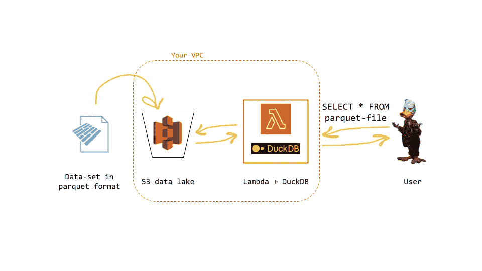
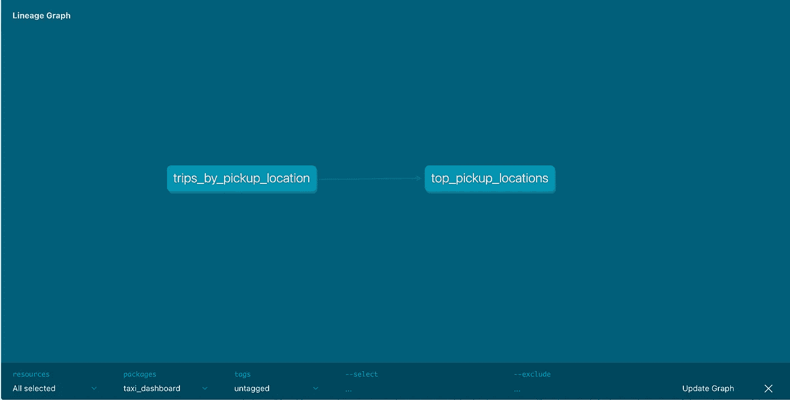

# 从备用零件构建的无服务器查询引擎

> 原文：[`towardsdatascience.com/a-serverless-query-engine-from-spare-parts-bd6320f10353?source=collection_archive---------0-----------------------#2023-04-27`](https://towardsdatascience.com/a-serverless-query-engine-from-spare-parts-bd6320f10353?source=collection_archive---------0-----------------------#2023-04-27)

## ***一个基于 DuckDB 和 AWS Lambdas 的开源数据湖实现***

[](https://medium.com/@ciro.greco?source=post_page-----bd6320f10353--------------------------------)[](https://towardsdatascience.com/?source=post_page-----bd6320f10353--------------------------------) [Ciro Greco](https://medium.com/@ciro.greco?source=post_page-----bd6320f10353--------------------------------)

·

[关注](https://medium.com/m/signin?actionUrl=https%3A%2F%2Fmedium.com%2F_%2Fsubscribe%2Fuser%2F1a8912e69301&operation=register&redirect=https%3A%2F%2Ftowardsdatascience.com%2Fa-serverless-query-engine-from-spare-parts-bd6320f10353&user=Ciro+Greco&userId=1a8912e69301&source=post_page-1a8912e69301----bd6320f10353---------------------post_header-----------) 发表在 [Towards Data Science](https://towardsdatascience.com/?source=post_page-----bd6320f10353--------------------------------) ·9 分钟阅读·2023 年 4 月 27 日[](https://medium.com/m/signin?actionUrl=https%3A%2F%2Fmedium.com%2F_%2Fvote%2Ftowards-data-science%2Fbd6320f10353&operation=register&redirect=https%3A%2F%2Ftowardsdatascience.com%2Fa-serverless-query-engine-from-spare-parts-bd6320f10353&user=Ciro+Greco&userId=1a8912e69301&source=-----bd6320f10353---------------------clap_footer-----------)

--

[](https://medium.com/m/signin?actionUrl=https%3A%2F%2Fmedium.com%2F_%2Fbookmark%2Fp%2Fbd6320f10353&operation=register&redirect=https%3A%2F%2Ftowardsdatascience.com%2Fa-serverless-query-engine-from-spare-parts-bd6320f10353&source=-----bd6320f10353---------------------bookmark_footer-----------)

云中的一只鸭子。照片由[László Glatz](https://unsplash.com/ko/@glatz0?utm_source=medium&utm_medium=referral)拍摄，来源于[Unsplash](https://unsplash.com/?utm_source=medium&utm_medium=referral)。

在这篇文章中，我们将展示如何在无服务器基础设施上构建一个简单的端到端应用程序。我们的目标很简单：我们想展示可以直接在云中开发，同时最小化设计和构建基础设施的认知负担。此外，我们将提出一个设计方案，与现代数据仓库（如 Big Query 或 Snowflake）相比，能够最小化成本。

作为数据从业者，我们希望（并且喜欢）尽可能无缝地在我们的数据上构建应用程序。无论你是从事 BI、数据科学还是机器学习，最终的应用程序和你看到它端到端运行的速度才是最重要的。然而，基础设施往往会成为障碍。

想象一下，作为一个实际例子，我们需要为我们的产品团队构建一个新的面向客户的分析应用。因为这是面向客户的，所以我们需要尊重一些性能约束，例如低延迟。

我们可以直接在云中开始开发，但这会立即引出一些基础设施问题：我们在哪里运行它？我们需要多大的机器？由于低延迟的要求，我们是否需要构建一个缓存层？如果是的话，我们该怎么做？

另外，我们可以在本地开发我们的应用。从开发者体验的角度来看，这可能更直观，但这只是推迟了基础设施问题，因为最终我们必须找到一种方法将本地项目转移到实际的管道中。此外，数据需要离开云环境到达我们的机器，这并不完全安全和可审计。

为了使云体验尽可能顺畅，我们设计了一个数据湖架构，其中数据存储在一个简单的云存储（AWS S3）中，嵌入 DuckDB 的无服务器基础设施作为查询引擎。在周期结束时，我们将拥有一个分析应用，可以实时可视化和查询数据，几乎没有基础设施成本。

当然，这有些简化，因为在实际生产场景中运行这个项目还需要一些调整。我们提供的是一个通用蓝图，利用存储和计算的分离来在云端构建数据湖和查询引擎。我们展示了如何通过一个（几乎）免费的云端终端、无需仓库设置以及闪电般的性能来支持一个交互式数据应用。在我们的实现中，最终的应用是一个简单的 [Streamlit](https://streamlit.io/) 应用，但这仅仅是为了说明目的：你可以轻松地考虑将其与自己喜欢的 BI 工具连接起来。


用我们的系统构建的闪电般快速的分析应用。图片来自作者。

## **鸭子无服务器化**

你们现在都知道 DuckDB 了。它是一个开源的内存中 SQL OLAP 数据库，专为分析查询而构建。DuckDB 实际上在 [生产环境中使用](https://dlthub.com/docs/blog/duckdb-1M-downloads-users) 的情况还不太清楚，但对我们来说，杀手级功能是可以用 SQL 语法直接查询 S3 中的 parquet 文件。

因此，大多数从业者现在似乎将其作为本地引擎进行数据探索，*临时*分析，POC 和原型制作（同时一些[创新的想法](https://duckdb.org/2022/10/12/modern-data-stack-in-a-box.html)则扩展其初始目的以涵盖更多领域）。人们使用嵌入 DuckDB 的笔记本或小型数据应用程序来原型设计和实验生产数据。

云更好。如果我们常常感觉不是这样，那是因为我们使用的工具链出了问题，但是一个[坏主意](https://www.facebook.com/CoachBillHart/videos/yep-worst-idea-ever/682926339663235/)和一个[好主意糟糕执行](https://www.ebay.com/itm/256040369567)之间有很大的区别。

如果我们结合数据湖架构、无服务器设计、DuckDB 和一些机智，我们可以从备件构建一个非常快速的数据堆栈：无需仓库设置，性能极快，成本非常便宜 —— S3 最昂贵的标准价格是每 GB $0.023，AWS Lambda 很快，并在不使用时缩减至零，因此它是一个无负担的计算账单，而且 AWS 还免费提供 100 万次调用。

准备好，[克隆仓库](https://github.com/BauplanLabs/quack-reduce/)，跟着唱，更多细节，请参阅[README](https://github.com/BauplanLabs/quack-reduce#quack-reduce)。

## **架构**

该项目非常自包含，只需要对云服务和 Python 有入门级别的熟悉度。

思路是从存储数据的数据湖开始。一旦数据以 Parquet 格式上传到我们的 S3 中，我们就可以使用 SQL 查询触发 Lambda。此时，我们的 Lambda 启动，在内存中启动 DuckDB 实例，计算查询并将结果返回给用户，可以直接在终端中呈现为表格。

该架构具有多个优点，主要来自无服务器设计：速度快，接近数据，一键部署很好；当然，系统在不使用时可以缩减至零，因此我们只需按查询付费。



我们系统的总体架构。来自作者的图片

## **您的第一个查询引擎 + 数据湖来自备件**

我们提供了一个简单的脚本，将创建一个 S3 存储桶，并将[纽约市 TLC 行程记录数据](https://www.nyc.gov/site/tlc/about/tlc-trip-record-data.page)的一部分填充进去（可在[nyc.gov 使用条款](https://www.nyc.gov/home/terms-of-use.page)下使用），分别作为唯一文件和分区目录（您可以使用[Make](https://github.com/BauplanLabs/quack-reduce/blob/74846468fd7b5dd2087691d1bc3d7aaa8417aa39/src/Makefile#L15)运行）。一旦数据存储在数据湖中，我们可以设置和使用我们的 Lambda：如果您已正确设置 Serverless CLI，则部署 Lambda 又是[一条 Make 命令](https://github.com/BauplanLabs/quack-reduce/blob/74846468fd7b5dd2087691d1bc3d7aaa8417aa39/src/Makefile#L7)的事情。

Lambda 可以通过任何常见方式调用，并接受一个查询作为其主要负载：当它运行时，它使用 DuckDB（如果是热启动，则重用实例）在数据湖中执行查询。DuckDb 在执行前后对数据一无所知，使得 lambda 在数据语义上完全无状态。

例如，你可以使用项目中的简单 Python 脚本将这个查询发送到 lambda，并显示结果：

```py
SELECT
  pickup_at as pickup_time,
  dropoff_at as dropoff_location,
  trip_distance
FROM read_parquet(your_s3_bucket/dataset/taxi_2019_04.parquet')
WHERE pickup_at >= '2019–04–01' AND pickup_at < '2019–04–03'
LIMIT 10
```


结果会直接在你的终端中可视化。图片来自作者。

看！你现在可以在云端安全地查询你的数据湖。这种非常简单的设计直接解决了在云数据仓库中工作的两个典型摩擦点：

+   由于所有用户需要做的只是拥有她的 AWS 凭证，设置过程显著简化。一旦设置完成，用户只需访问 lambda（或任何代理！）：这很好，因为它使用户在没有访问底层存储的情况下拥有完整的查询能力。

+   性能如此出色，以至于即使我们总是通过云端，也感觉像是在本地开发。一个快速的云体验有助于驯服那种在远程机器上工作的优势以良好的开发者体验为代价的过于熟悉的感觉。

## **（几乎）免费分析**

一切都很好而且奢华，但假设我们想做的事情比即时查询数据更多。假设我们想在一个表的基础上构建一个应用程序。它是一个非常简单的应用，没有编排，也不需要校准工作负载。

与此同时，假设这个应用需要具备响应能力，它还需要快速。直接与客户打交道的人都知道，为那些希望查看数据的客户提供一个新鲜的响应式体验是多么重要。没有人喜欢一个加载需要几分钟的仪表盘。

为了了解这种架构如何弥合数据管道与实时分析查询之间的差距，我们提供了一个小型的 dbt DAG 以模拟对原始数据集进行一些离线 SQL 转换，从而在数据湖中生成一个新成果（相当于仪表盘视图）。

为了尽可能保持自给自足，我们包括了一个可以在本地机器上运行的版本（请参阅 README 获取更多细节—— dbt 或其背后的引擎对该模式的工作无关紧要）。然而，你可以使用不同的 dbt 运行时，并将最终成果导出为 parquet 文件，使用 [Snowflake](https://docs.snowflake.com/en/user-guide/script-data-load-transform-parquet) 或 [BigQuery](https://cloud.google.com/dataflow/docs/guides/templates/provided/bigquery-to-parquet)。


我们的系统架构与一个 dbt 项目配对。图片来自作者。

目前，我们将坚持使用我们由两个节点构成的超级简单 DAG。第一个节点从我们的数据湖中提取 pickup_location_id，并按旅行次数排序：

```py
SELECT
  pickup_location_id AS location_id,
COUNT(*) AS counts
FROM read_parquet(['s3://{{ env_var('S3_BUCKET_NAME') }}/dataset/taxi_2019_04.parquet'])
GROUP BY 1
```

第二个节点提供了数据集中前 200 个取车地点：

```py
SELECT
  location_id,
  counts
FROM {{ ref('trips_by_pickup_location') }}
ORDER BY 2 DESC
LIMIT 200
```

我们可以使用 dbt 文档可视化 DAG：



一旦我们的管道完成，最终工件将上传回我们的数据湖中：

```py
s3:/your_s3_bucket/dashboard/my_view.parquet
```

然后我们可以重用之前构建的查询引擎，查询 DAG 的第二个（也是最后一个）节点，以在 Streamlit 应用中可视化数据，只需在终端中运行：

```py
(venv) cirogreco@Ciros-MBP src % make dashboard
```

每次我们访问仪表盘时，仪表盘都会访问幕后运行的 lambda。如果你喜欢这种简单的架构，相同的模式可以在你自己的 Streamlit 应用或你喜欢的 BI 工具中使用。

## **关于“合理规模”的几点说明**

[不久前](https://tenor.com/view/yeah-i-member-memberberries-south-park-i-remember-oh-yeah-gif-20408218)，我们写了一系列关于我们称之为[合理规模下的 MLOps](https://towardsdatascience.com/tagged/mlops-without-much-ops)的文章，讨论了在不处理互联网规模数据的公司中构建可靠 ML 应用的最佳策略，并且这些公司具有真正的大数据公司通常不具备的一些约束条件。我们主要从 ML 和 MLOps 的角度进行了讨论，因为成功地运作 ML 曾经是组织面临的一个主要问题（也许现在仍然是，我不确定），但有一个普遍的观察结果仍然存在：大多数数据组织都是“合理规模”的，他们应该围绕这一假设来设计他们的系统。需要注意的是，成为合理规模的组织并不一定意味着成为小公司。企业界充满了在大型——有时是巨大的——组织中处理复杂性的团队，但这些团队通常有许多合理规模的管道，通常是为了内部利益相关者，从几 GB 到最多 TB 不等。

最近，我们高兴地见证了一个关于公司是否需要大数据系统来解决数据问题的激烈辩论。从我们的观点来看，最重要的结论仍然是，如果你是一个“合理规模”的组织，处理不必要的基础设施可能会给你的组织流程带来很大的负担，产生许多不利影响。理论上，你可以构建一个完整的数据堆栈来支持低延迟仪表盘——也许你可以使用数据仓库和缓存层——但由于你的资源有限，是否可以有一种更简单、更便宜的方法呢？

在这篇文章中，我们展示了数据优先存储格式、按需计算和内存 OLAP 处理的组合如何在合理规模下开辟新的可能性。该系统虽然远未完善，且[还需要许多改进](https://github.com/BauplanLabs/quack-reduce#whats-next)，但它表明，人们可以构建一个无需数据仓库设置、性能极快且几乎无成本的互动数据应用。通过从 DuckDB 中移除数据库，我们可以将本地（“单节点处理是你所需的一切”）和云端（“数据在其他地方处理效果更好”）的优点结合起来。

我大部分时间都在思考无服务器数据基础设施。如果你感兴趣，或者对这篇文章有反馈，或者只是想聊聊，可以通过 ciros.greco@bauplanlabs.com 联系我。
