# 使用机器学习进行层次时间序列预测的简单方法

> 原文：[`towardsdatascience.com/a-simple-approach-to-hierarchical-time-series-forecasting-with-machine-learning-2e180d83966c`](https://towardsdatascience.com/a-simple-approach-to-hierarchical-time-series-forecasting-with-machine-learning-2e180d83966c)

## Kaggle 蓝图

## 如何使用 LightGBM 和 Python “提升”你的周期性销售数据预测

[](https://medium.com/@iamleonie?source=post_page-----2e180d83966c--------------------------------)[](https://towardsdatascience.com/?source=post_page-----2e180d83966c--------------------------------) [Leonie Monigatti](https://medium.com/@iamleonie?source=post_page-----2e180d83966c--------------------------------)

·发布于 [Towards Data Science](https://towardsdatascience.com/?source=post_page-----2e180d83966c--------------------------------) ·8 分钟阅读·2023 年 3 月 14 日

--


层次时间序列预测（图由作者绘制）

欢迎来到另一期的 “Kaggle 蓝图” ，我们将分析 [Kaggle](https://www.kaggle.com/) 比赛的获胜方案，以寻找适用于我们自己数据科学项目的经验教训。

本期将回顾[“M5 预测 — 精度”](https://www.kaggle.com/competitions/m5-forecasting-accuracy/)比赛中的技术和方法，该比赛于 2020 年 6 月底结束。

# 问题陈述：层次时间序列预测

[“M5 预测 — 精度”](https://www.kaggle.com/competitions/m5-forecasting-accuracy/)比赛的目标是预测 42,840 个层次时间序列销售数据的接下来的 28 天。

[](https://www.kaggle.com/competitions/m5-forecasting-accuracy/?source=post_page-----2e180d83966c--------------------------------) [## M5 预测 — 精度

### 估计沃尔玛零售商品的单位销量

www.kaggle.com](https://www.kaggle.com/competitions/m5-forecasting-accuracy/?source=post_page-----2e180d83966c--------------------------------)

**层次时间序列** — 与常见的多变量时间序列问题不同，层次时间序列可以在不同层级上进行汇总：例如，商品层级、商店层级和州层级。在这次比赛中，参赛者获得了来自 3 个不同类别的 3000 种单独产品的超过 40,000 个时间序列，这些产品在 3 个州的 10 个商店中销售。

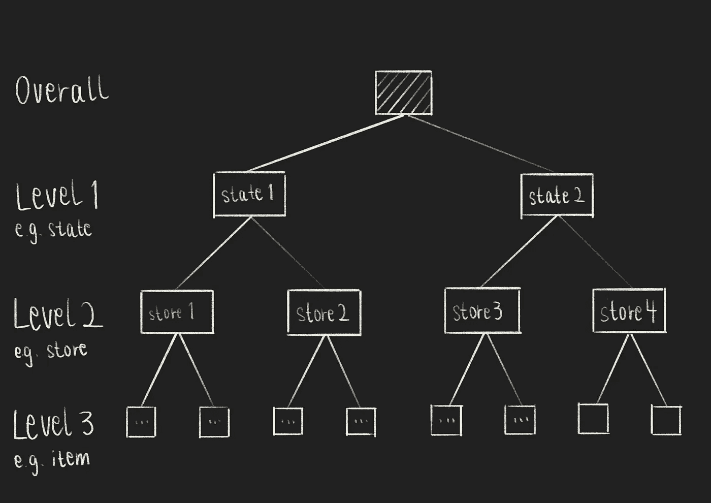

分层时间序列（图像由作者提供）

**周期性**——销售数据通常是周期性的，这意味着销售数据是时间依赖的。例如，你会看到重复的模式，比如在周末结束时销售增加（每周周期）、在月初（每月周期）或节假日期间（年度周期）。

**多步**——任务是预测 28 天后的销售数据（28 个步骤）。

[](/time-series-problems-simply-explained-as-fast-food-combo-meals-70c6eb9bdef?source=post_page-----2e180d83966c--------------------------------) ## 时间序列问题简单解释为快餐组合餐

### 单变量与多变量、单步与多步、滑动窗口与扩展窗口时间之间的区别……

towardsdatascience.com

要跟进本文，你的数据集应如下所示：

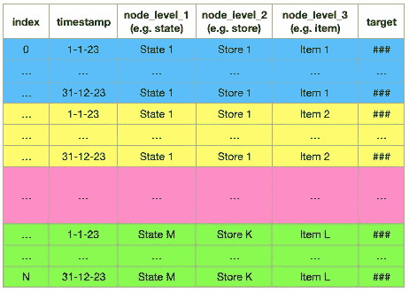

在这里插入你的数据：你的分层时间序列数据应如何格式化（图像由作者提供）

# 将时间序列预测视为一个回归问题来使用机器学习

竞争者中一种流行的方法是将时间序列预测问题表述为回归问题，并使用机器学习（ML）进行建模 [6]。

1.  时间序列预测问题可以通过将预测拆分为单一步骤来形成回归问题——在数据点之间保持历史数据和预测之间的间隔恒定。

1.  你可以将历史数据点汇总为历史特征，而不是将过去的值序列输入到机器学习模型中。

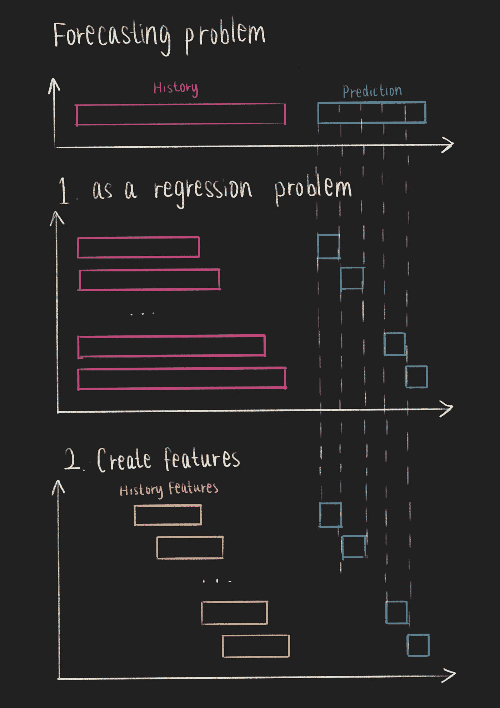

时间序列预测作为回归问题（图像由作者提供）

因此，使用机器学习来处理分层时间序列预测问题的主要步骤是：

1.  建立简单基线

1.  从历史数据中进行特征工程

1.  使用机器学习建模和验证时间序列预测问题

# 第 1 步：建立简单基线

与任何传统的机器学习问题一样，我们将从建立一个简单的基线开始。对于时间序列预测问题，一个好的起点是**将最后一个时间戳的值作为预测——这是一种朴素的方法**。

如果你有周期性时间序列，可以通过参考上一个周期来改进朴素方法。例如，如果你的时间序列依赖于星期几，你可以[取上个月的数据，按星期几分组，并取平均值](https://www.kaggle.com/code/chrisrichardmiles/simple-model-avg-last-28-days-grouped-by-weekday/notebook) [2]。

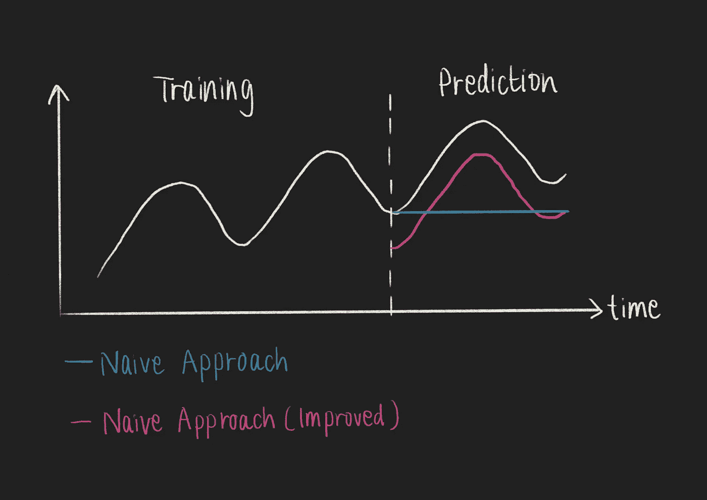

时间序列预测的基线：朴素方法（图像由作者提供）

# 第 2 步：从历史数据中进行特征工程

与使用经典统计方法相比，特征工程是开发 ML 模型时的一个重要步骤。因此，你需要[将历史数据聚合为历史特征](https://www.kaggle.com/code/kyakovlev/m5-simple-fe/notebook)[4]，而不是直接将历史数据输入 ML 模型。

## 时间戳特征

一个时间序列至少有两个特征：时间戳和一个值。仅时间戳就可以用来创建多个新特征。

首先，你可以通过将时间戳拆解为其组成部分（例如，天、周、月、年等）来提取特征[4]。

```py
# Convert to DateTime
df['date'] = pd.to_datetime(df['date'])

# Make some features from date
df['day'] = df['date'].dt.day
df['week'] = df['date'].dt.week
df['month'] = df['date'].dt.month
df['year'] = df['date'].dt.year
# etc.
```

其次，你可以基于日期创建新特征[1, 3]：它是工作日还是周末？是节假日吗？是否发生特殊事件（例如，体育赛事）？

```py
df['dayofweek'] = df['date'].dt.dayofweek
df['weekend'] = (df['dayofweek']>=5)
# etc.
```

## 聚合特征

接下来，你可以通过聚合历史数据并创建统计特征，如最大值、最小值、标准差和均值[1, 3, 4, 8, 10]，来创建新特征。

因为我们处理的是分层时间序列，所以我们将按不同的`LEVEL`（例如`store_id`）对时间序列进行分组。

```py
FEATURE = 'price'
LEVEL_1 = 'store_id'
LEVEL_N = 'item_id'

# Basic aggregations
df[f'{FEATURE}_max'] = df.groupby([LEVEL_1, LEVEL_N])[FEATURE].transform('max')
df[f'{FEATURE}_min'] = df.groupby([LEVEL_1, LEVEL_N])[FEATURE].transform('min')
df[f'{FEATURE}_std'] = df.groupby([LEVEL_1, LEVEL_N])[FEATURE].transform('std')
df[f'{FEATURE}_mean'] = df.groupby([LEVEL_1, LEVEL_N])[FEATURE].transform('mean')

# Normalization (min/max scaling)
df[f'{FEATURE}_norm'] = df[FEATURE]/df[f'{FEATURE}_max']

# Some items are can be inflation dependent and some items are very "stable"
df[f'{FEATURE}_nunique'] = df.groupby([LEVEL_1, LEVEL_N])[FEATURE].transform('nunique')

# Feature "momentum" 
df[f'{FEATURE}_momentum'] = df[FEATURE]/df.groupby([LEVEL_1, LEVEL_N])[FEATURE].transform(lambda x: x.shift(1))
```

## 滞后特征

一个流行的时间序列数据特征工程技术是创建滞后特征[4, 5, 10]。为了在测试数据上使用此特征，滞后时间应大于训练数据和测试数据之间的时间间隔。

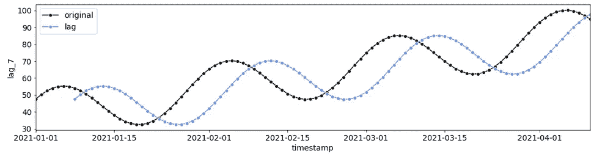

7 天的滞后（作者提供的图像）

```py
LEVEL = 'store_id'
TARGET = 'sales'
lag = 7

df[f"lag_{lag}"] = df.groupby(LEVEL)[TARGET].shift(lag).fillna(0)
```

## 滚动特征

另一种流行的时间序列数据特征工程技术是基于滚动窗口创建特征（例如，均值或标准差）[1, 3, 10]。

你可以直接将此特征工程技术应用于`FEATURE`，甚至应用于其滞后版本。

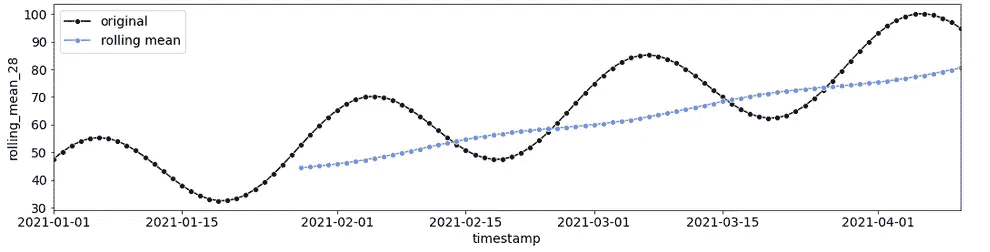

28 天滚动窗口的均值（作者提供的图像）

```py
window = 28

df[f"rolling_mean_{window}"] = df.groupby(LEVEL)[FEATURE].transform(lambda x : x.rolling(window).mean()).fillna(0)
```

## 作为分类特征的层级

在处理分层时间序列时，你还可以将不同层级的节点标识符（例如`store_id`、`item_id`）作为分类变量[1, 3]。

在将数据输入 ML 模型之前，你的结果数据框应如下所示：

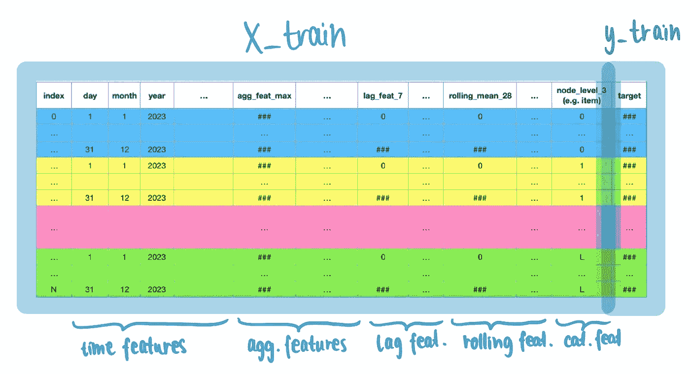

用于时间序列预测的 ML（GBDT）模型的训练数据结构（作者提供的图像）

# 第 3 步：使用机器学习建模和验证时间序列预测问题

在建模和验证普通 ML 问题（例如回归或分类）与使用 ML 进行的分层时间序列预测问题之间存在一些差异。

## 建模多变量和分层时间序列

建模分层时间序列问题类似于建模多变量问题。

**多变量时间序列建模** — 自回归模型和序列到序列模型通常一次只能建模一个时间序列（单变量时间序列问题）。因此，当遇到多变量时间序列问题（如层级时间序列）时，你需要构建多个预测模型 — 每个时间序列一个模型。

许多参赛者使用了 LightGBM，一个机器学习模型和梯度提升框架 [1, 3, 5, 7, 8, 10]。使用 LightGBM 时，你可以用一个 LightGBM 模型建模多个时间序列，而不需要构建多个预测模型。

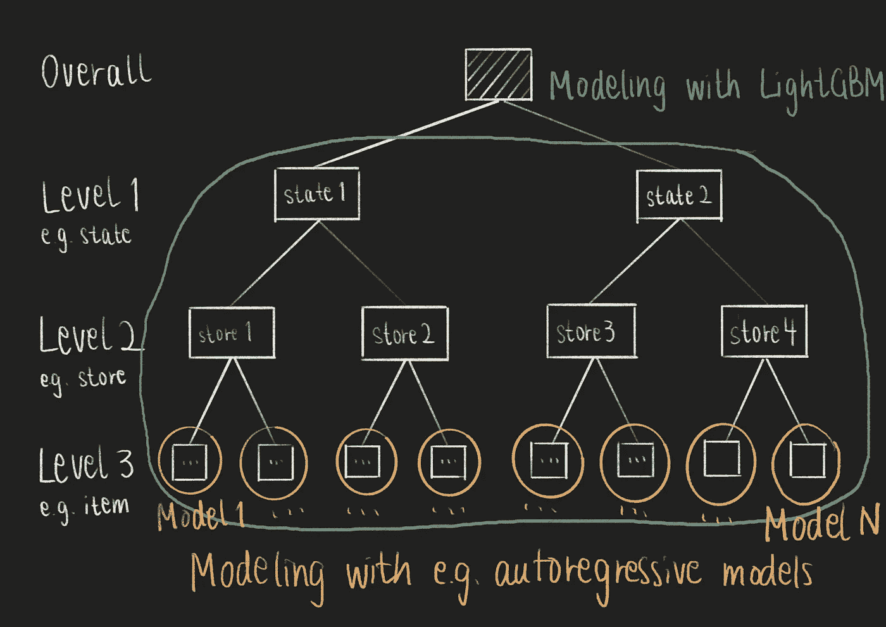

多变量时间序列建模策略（图像来源：作者）

由于时间序列数据是层级结构的，许多参赛者**按层级对类似时间序列进行分组**（例如，按商店）并将它们一起建模 [3, 8, 10]。

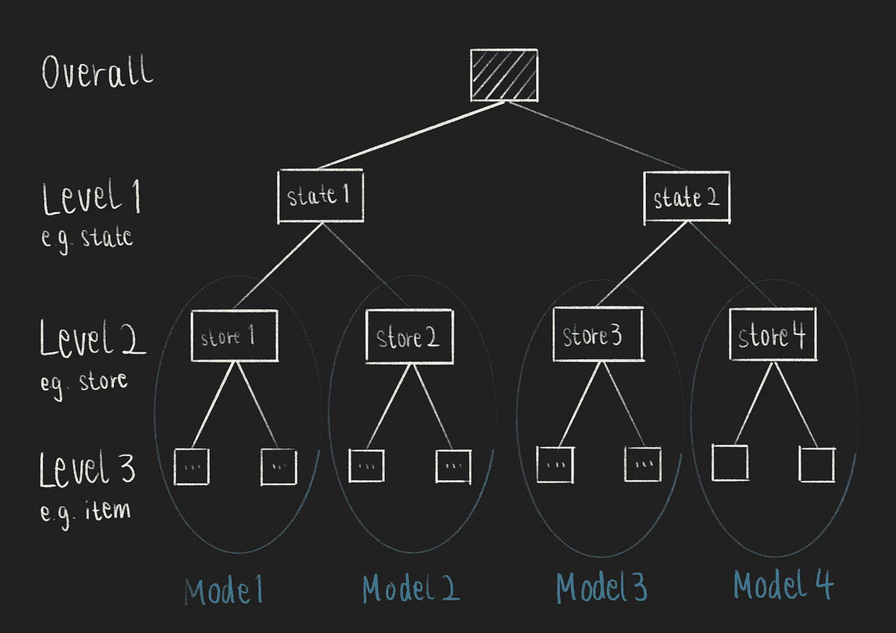

使用机器学习的层级时间序列预测建模策略（图像来源：作者）

## 验证预测模型

在验证时间序列预测模型时，关键是要牢记时间序列的时序顺序 [6]。如果你使用了流行的 KFold 交叉验证策略，你会使用未来的数据来预测过去的事件。在预测时，必须避免泄露未来信息以对过去做出预测。

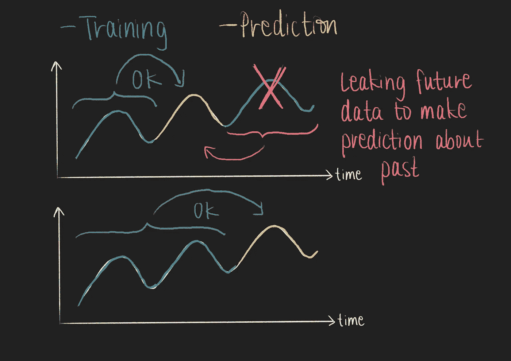

避免在时间序列预测验证中泄露未来信息以对过去做出预测（图像来源：作者）

相反，你应该定义一些交叉验证期，然后用该期间之前的所有数据来训练一个模型 [3, 8, 10]。例如，对于最后一个月的每周 (`VALIDATION_PERIOD = 7`)（`N_FOLDS = 4`）。

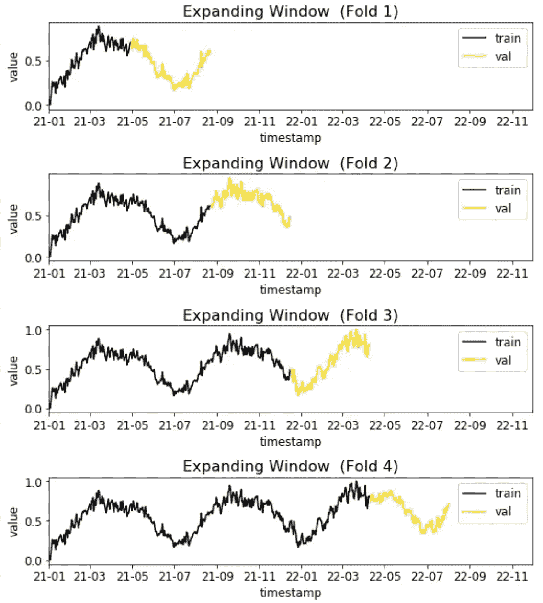

时间序列预测的交叉验证（图像来源：作者）

为了将所有内容整合在一起，你可以参考以下代码片段：

```py
from datetime import datetime, timedelta
import lightgbm as lgb

N_FOLDS = 4
VALIDATION_PERIOD = 7

for store_id in STORES_IDS:
  for fold in range(N_FOLDS):
      training_date = train_df['timestamp'].max() - timedelta(VALIDATION_PERIOD) * (N_FOLDS-fold)
      valid_date = training_date + timedelta(VALIDATION_PERIOD)
      print(f"\nFold {fold}: \ntraining data from {train_df['timestamp'].min()} to {training_date}\nvalidation data from {training_date + timedelta(1)} to {valid_date}")
      train = train_df[train_df['timestamp'] <= training_date]
      val  = train_df[(train_df['timestamp'] > training_date) & (train_df['timestamp'] <= valid_date) ]

      X_train = train[features]
      y_train = train[target]

      X_val = val[features]
      y_val = val[target]

      train_data = lgb.Dataset(X_train, label = y_train)
      valid_data = lgb.Dataset(X_val, label = y_val)

      estimator = lgb.train(lgb_params,
                                train_data,
                                valid_sets = [valid_data],
                                verbose_eval = 100,
                                )Mo
```

在评估层级时间序列预测模型时，可能需要[创建一个简单的仪表盘](https://www.kaggle.com/code/tnmasui/m5-wrmsse-evaluation-dashboard/) [9] 来分析模型在每一层级的表现。

# 总结

从回顾 Kagglers 在[“M5 预测—准确性”](https://www.kaggle.com/competitions/m5-forecasting-accuracy/)竞赛过程中创建的学习资源中，你可以学到更多的经验教训。这类问题声明也有很多不同的解决方案。

在本文中，我们关注了许多参赛者普遍采用的一般方法：将时间序列预测问题表述为回归问题，从历史数据中工程化特征，然后应用机器学习模型。

# 数据集

本文使用了合成数据，因为原始比赛数据集仅供非商业用途。本文使用的时间序列是由正弦波、线性函数和白噪声信号的和生成的。

# 享受这个故事了吗？

[*免费订阅*](https://medium.com/subscribe/@iamleonie) *以在我发布新故事时收到通知。*

[](https://medium.com/@iamleonie/subscribe?source=post_page-----2e180d83966c--------------------------------) [## 订阅以获取 Leonie Monigatti 的最新文章通知。

### 每当 Leonie Monigatti 发布新文章时，你将收到电子邮件通知。通过注册，你将创建一个 Medium 帐户（如果你还没有的话）……

medium.com](https://medium.com/@iamleonie/subscribe?source=post_page-----2e180d83966c--------------------------------)

*在* [*LinkedIn*](https://www.linkedin.com/in/804250ab/)，[*Twitter*](https://twitter.com/helloiamleonie)*，和* [*Kaggle*](https://www.kaggle.com/iamleonie)*上找到我！*

# 参考文献

[1] Alan Lahoud (2020). [Kaggle 讨论中的第 5 名解决方案](https://www.kaggle.com/competitions/m5-forecasting-accuracy/discussion/163916)（访问日期：2023 年 3 月 7 日）

[2] Chris Miles (2020). [简单模型：按工作日分组的最近 28 天的平均值](https://www.kaggle.com/code/chrisrichardmiles/simple-model-avg-last-28-days-grouped-by-weekday/notebook) 在 Kaggle Notebooks（访问日期：2023 年 3 月 6 日）

[3] Eugene Tang (2020). [Kaggle 讨论中的第 7 名解决方案](https://www.kaggle.com/competitions/m5-forecasting-accuracy/discussion/164826)（访问日期：2023 年 3 月 7 日）

[4] Konstantin Yakovlev (2020). [M5 — 简单特征工程](https://www.kaggle.com/code/kyakovlev/m5-simple-fe/notebook) 在 Kaggle Notebooks（访问日期：2023 年 3 月 7 日）

[5] Konstantin Yakovlev (2020). [M5 — 三种黑暗阴影：更黑暗的魔法](https://www.kaggle.com/code/kyakovlev/m5-three-shades-of-dark-darker-magic) 在 Kaggle Notebooks（访问日期：2023 年 3 月 7 日）

[6] LogicAI (2023). [Kaggle Days Paris 2022_Jean Francois Puget_ 销售预测和欺诈检测](https://www.youtube.com/watch?v=y61MkqCw8_Q) 在 YouTube 上（访问日期：2023 年 2 月 21 日）

[7] Matthias (2020). [Kaggle 讨论中的第 2 名解决方案](https://www.kaggle.com/competitions/m5-forecasting-accuracy/discussion/164599)（访问日期：2023 年 3 月 7 日）

[8 ] monsaraida (2020). [Kaggle 讨论中的第 4 名解决方案](https://www.kaggle.com/competitions/m5-forecasting-accuracy/discussion/163216)（访问日期：2023 年 3 月 7 日）

[9] Tomonori Masui (2020). [M5 — WRMSSE 评估仪表板](https://www.kaggle.com/code/tnmasui/m5-wrmsse-evaluation-dashboard) 在 Kaggle Notebooks（访问日期：2023 年 3 月 7 日）

[10] Yeonjun In (2020). [Kaggle 讨论中的第 1 名解决方案](https://www.kaggle.com/competitions/m5-forecasting-accuracy/discussion/163684)（访问日期：2023 年 3 月 7 日）
